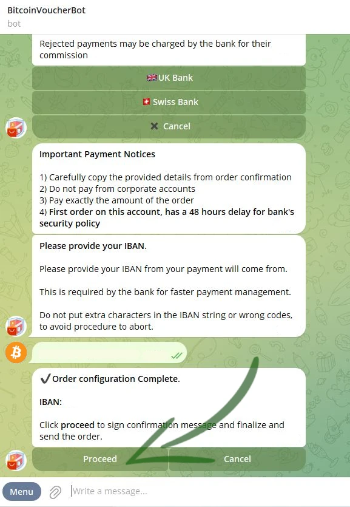
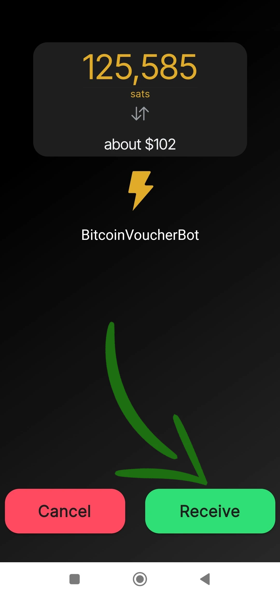
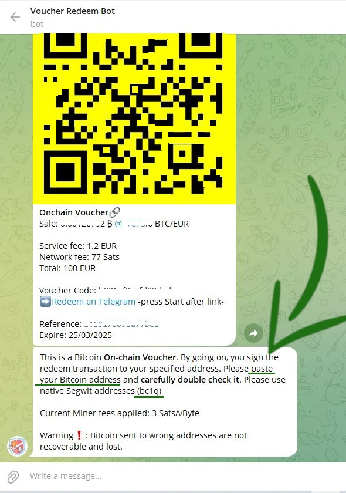

_This tutorial was written by_ [Bitcoin Campus](https://linktr.ee/bitcoincampus_)

# Introduction

The BitcoinVoucherBot is a tool with which Bitcoins can be purchased in exchange for euros.

### KYC Light

The action of changing euros for Bitcoin is the first and most fundamental step to begin studying this subject, but it is apparently also the most difficult and complex. There can be many options: offering Bitcoin through centralized Exchanges, Bitcoin-themed meetups, friends, acquaintances, and more. We join the Bitcoiner community and **we absolutely recommend the use of centralized Exchanges** in order to safeguard more attention to one's privacy.

Although this choice may be less convenient, it is important to understand that Exchanges enforce the Know Your Cutomer (KYC) regulation, thus assigning an identity, as well as a physical location, to every Satoshi purchased from them. "Convenience" has some striking side effects.

### How to do it?

Here comes the [BitcoinVoucherBot:](https://t.me/BitcoinVoucherBot) service, a Telegram bot that acts as a conduit between our SEPA transfers and Sats purchases.

### Pre-requisites

To start using BitcoinVoucherBot, there is no need to release sensitive personal information to the Bot staff. **No authorization needed**.

All that is needed is an already active Telegram account and a bank account. **Note**: An account opened with Poste Italiane (for Italian customers) or, more generally, referring to a rechargeable card is not suitable.

In the Telegram chat we prepare an order, with a bank transfer we pay for it, and finally through the bot we get a voucher issued by a third party company that does not know the object of the purchase.

### Bot activation and menu

Activation is a simple one-time operation. From Telegram, search for _@BitcoinVoucherBot_ and as soon as you get to the Bot's chat, a large _Start/Start_ button stands out at the bottom. The operation causes the Bot to respond, which presents a menu of the main commands available to it. The first welcome messages also appear, for which we recommend careful reading.

**Warning**: there are several scammers posing as original VoucherBot. If you are not sure about the search via Telegram, please access the BitcoinVoucherBot link from the [official website](https://www.bitcoinvoucherbot.com/)

Options appear by clicking the _Menu_ button in the lower left corner: you can click on the word corresponding to the command, or type in the message box the slash `/` followed by the command typed.

Major operations include:

- _/purchase_: is the actual purchase procedure. When the transaction is completed, the QR Code is automatically generated by the bot, ready for redemption.
- _/refill_: available at the time of writing this tutorial, but we will not cover it because-for technical reasons-this option may be removed later.
- _/swap_: opens the swap procedure, available either with a convenient Telegram bot or via the web.
- _/ap_: accumulation plan, which allows you to set up a **Constant Accumulation Plan (CAP)**.
- _/lnaddress_: with which we are asked to link an own LN Address, for a particular procedure we will see later.
- _/credits_: to check how much credit is left to generate vouchers.
- _/myorders_: shows orders placed with the bot (**Warning** the system only tracks the last 10 orders placed and not the entire history).
- _/fees_: a command to check network fees. To evaluate them, it is always best to rely on Mempool.space.
- _/support_: in case of need, pops up contacts to report issues to the support team.

# Bitcoin purchasing procedure

## Order preparation

Click _/purchase_ in the command menu

A number of opportunities appear, but we choose _BTC Vouchers_

BitcoinVoucherBot allows you to purchase Bitcoin onchain, Lightning and Liquid.

At this stage choose _Onchain & Lightning 🔗⚡️_

The screen changes quickly and VoucherBot proposes purchase denominations. They start from a minimum of €100.00 up to €900.00.

In case of a first purchase, only the 100.00 €, Onchain and Lightning denominations are offered. To increase confidentiality, we suggest choosing _Lightning ⚡️_

The VoucherBot alerts us that a first choice has been made and that, to confirm it, we need to choose _Proceed_

It is now a matter of choosing the payment method. The transfer is made by wire transfer **(accepted only SEPA)**. VoucherBot proposes as a receiver a company that provides two bank accounts, one in U.K and the other in Switzerland. The Swiss bank was chosen to carry out this tutorial

At this point we are asked to enter our IBAN, the one from which the transfer to the chosen bank will start. This information goes to make up a puzzle that will allow the bot, i.e., a machine, to put together some information to make the purchase process flow without the need for human intervention.

The IBAN must be written in the message bar, checked, and sent to the bot.

A control message now appears in the chat with VoucherBot.

If everything is correct, continue by clicking _Proceed_.

## Payment

After a few moments, necessary to process the data, VoucherBot replies with a message containing all the details necessary to complete the order. Depending on what your bank requires, the relevant information is:

- `IBAN`, which is essential for the deposit, as well as the recipient`s address;
- `the amount chosen` previously through the cutoff, which must be met to allow VoucherBot to recognize the order when payment is received;
- `Payment reason`, which is the reason for the payment. **Must be copied and pasted without removing or adding anything in the appropriate field of your transfer. Any "." or "-" present in the payment reason, may be replaced by `white space'**.
- a unique `OrderID` to refer to when requesting any assistance.

You can then proceed with the payment, via your app or bank. When the payment has been accepted by the bank, it is important to remember to press _Notify payment_ in the chat with VoucherBot. This simple operation alerts you that a payment is on its way.

VoucherBot responds with a message that contains a very important warning: **don't delete the chat**, at least until the voucher is received, because it is the only means of reconstructing the order and keeping it going.

---
Please note:

- only SEPA wire transfers are accepted;
- wait times are solely related to how the banks (which do not work 24/7/365 like Bitcoin) process the voucher. It may take from a few hours up to 3 working days to receive the voucher;
- for any needs, Bitcoin VoucherBot has an excellent [support](https://t.me/BitcoinVoucherGroup) service on Telegram.

---
## Redemption

As soon as the payment is successful, Bitcoin VoucherBot sends the voucher directly into the chat. The lightning voucher is in the form of a QR code, printed on an orange background.

There is all the data needed to cash it in:

- the amount in Sats, equivalent to that sent by wire transfer, excluding service fees and network fees;
- a reference ID of the voucher;
- the date by which the voucher must be redeemed or else funds will be lost, i.e., 25 days after issuance.

You can cash in the voucher by framing the QR code with the scan function of a compatible Wallet Lightning Network, or via LNURL, also shown below the QR code.

For this tutorial we used Wallet Of Satoshi, using the scan function activated by the _Send_ key

With the cell phone camera activated, frame the QR code in the chat, opening Telegram from PC

Before proceeding, Wallet Of Satoshi from a verification screen that includes the amount, which exactly matches the amount expressed on the voucher and, as a description, BitcoinVoucherBot. To cash out the voucher, simply click on _Receive_

Wallet Of Satoshi processes for a few moments

and finally the collection is reported and immediately available in the Wallet balance.

**Wallet of Satoshi is a custodial app: immediately after cashing in the voucher, it is advisable to move Sats to a Wallet non-custodial.**

### How to cash in an onchain voucher

As we saw in the order preparation, VoucherBot allows Sats to be purchased directly onchain, with the choice of the eponymous voucher.

**Note**: Order preparation and payment do not change, they are always the same. What does change is how an onchain voucher is cashed.

After completing the order, making the payment, pressing _Notify payment_ and waiting for the banks' technical time to transfer the transfer, VoucherBot will respond by sending the voucher directly into the chat.

This voucher is also in the form of a QR code, but the main color is canary yellow and-most importantly-in the description it is well explained that it is an onchain voucher, which you cash directly on your Wallet onchain and, to start the cash-out procedure, you have to click on _Redeem on Telegram_. The onchain voucher also contains the information already seen for the lightning one:

- the amount in Sats, equivalent to that sent by wire transfer, excluding service fees and network fees;
- a voucher code;
- a reference ID of the voucher;
- the date by which the voucher must be redeemed or else funds will be lost, i.e., 25 days after issuance.

**WARNING ⚠️:** clicked as explained, pop-up of another bot opens: **Voucher RedeemBot.**

Voucher RedeemBot is the tool made available for this purpose. Whether this is the first use or there are previous orders, each time a new redemption is made it is always necessary to click _START_.

At this point RedeemBot loads the onchain voucher, easily recognized by Voucher Code and reference ID. It also unlocks the bar to write messages and start chatting with the bot, which in fact invites us to tell it an onchain address of our Wallet.

**Note**: This address must be of type SegWit.

We open our Wallet at this point and generate a SegWit address

we copy it

and paste it into the chat with RedeemBot

We now have a check screen, to verify the voucher code is correct, as well as the address we have communicated to RedeemBot. Let's check it well because, by clicking _Proceed_, the transaction starts and there will be no way to find it again if we have, for example, communicated the wrong address.

The transaction has started and the Redeem procedure of the onchain voucher thus ends.

while the amount can be seen coming in the history of our Wallet.

