tutorial ini ditulis oleh_ [Kampus Bitcoin] (https://linktr.ee/bitcoincampus_)

# Pendahuluan

BitcoinVoucherBot adalah alat yang dapat digunakan untuk membeli Bitcoin di Exchange dengan harga euro.

### Lampu KYC

Tindakan menukar euro dengan Bitcoin adalah langkah pertama dan paling mendasar untuk mulai mempelajari subjek ini, tetapi tampaknya juga yang paling sulit dan kompleks. Ada banyak pilihan: menawarkan Bitcoin melalui bursa terpusat, pertemuan bertema Bitcoin, teman, kenalan, dan banyak lagi. Kami bergabung dengan komunitas Bitcoiner dan **kami sangat merekomendasikan penggunaan bursa terpusat** untuk menjaga privasi seseorang.

Meskipun pilihan ini mungkin kurang nyaman, penting untuk dipahami bahwa Exchange memberlakukan peraturan Know Your Customer (KYC), sehingga memberikan identitas, serta lokasi fisik, untuk setiap Satoshi yang dibeli dari mereka. "Kenyamanan" memiliki beberapa efek samping yang mencolok.

### Bagaimana cara melakukannya?

Inilah layanan [BitcoinVoucherBot:] (https://t.me/BitcoinVoucherBot), sebuah bot Telegram yang bertindak sebagai penghubung antara transfer SEPA dan pembelian Sats.

### Prasyarat

Untuk mulai menggunakan BitcoinVoucherBot, tidak perlu memberikan informasi pribadi yang sensitif kepada staf Bot. **Tidak perlu otorisasi**.

Yang diperlukan hanyalah akun Telegram yang sudah aktif dan rekening bank. **Catatan**: Akun yang dibuka dengan Poste Italiane (untuk pelanggan Italia) atau, secara umum, mengacu pada kartu yang dapat diisi ulang tidak cocok.

Dalam obrolan Telegram kami menyiapkan pesanan, dengan transfer bank kami membayarnya, dan akhirnya melalui bot kami mendapatkan voucher yang dikeluarkan oleh perusahaan pihak ketiga yang tidak mengetahui objek pembelian.

### Aktivasi dan menu bot

Aktivasi adalah operasi satu kali yang sederhana. Dari Telegram, cari _@BitcoinVoucherBot_ dan segera setelah Anda masuk ke obrolan Bot, tombol _Start/Start_ yang besar akan muncul di bagian bawah. Operasi ini menyebabkan Bot merespons, yang menyajikan menu perintah utama yang tersedia untuknya. Pesan selamat datang pertama juga muncul, yang kami sarankan untuk dibaca dengan cermat.

**Peringatan**: ada beberapa penipu yang menyamar sebagai VoucherBot asli. Jika Anda tidak yakin dengan pencarian melalui Telegram, silakan akses tautan BitcoinVoucherBot dari [situs web resmi] (https://www.bitcoinvoucherbot.com/)

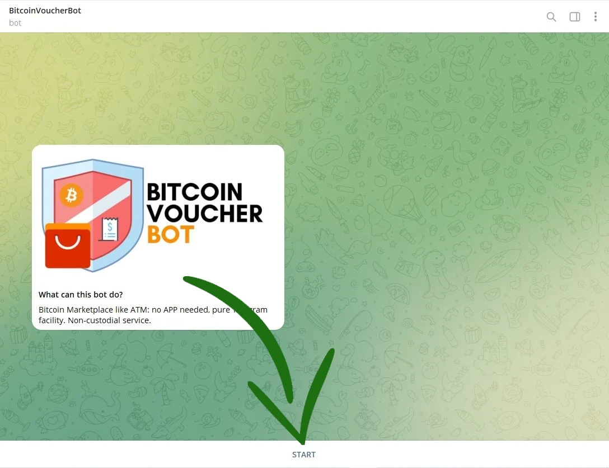

Pilihan akan muncul dengan mengklik tombol _Menu_ di sudut kiri bawah: Anda dapat mengklik kata yang sesuai dengan perintah, atau mengetikkan garis miring `/` di kotak pesan diikuti dengan perintah yang diketikkan.

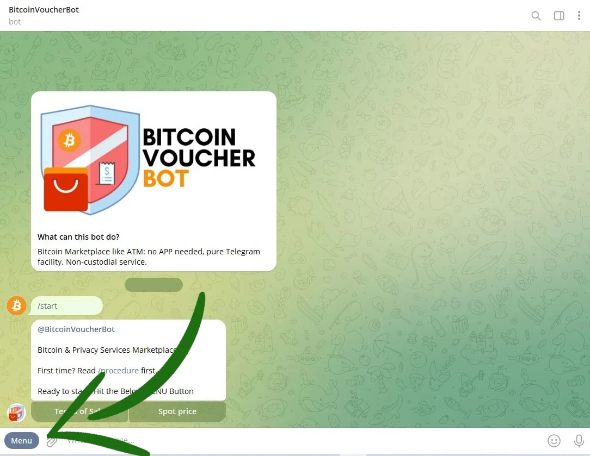

Operasi besar meliputi:

- _/purchase_: adalah prosedur pembelian yang sebenarnya. Ketika transaksi selesai, Kode QR secara otomatis dihasilkan oleh bot, siap untuk ditukarkan.
- _/refill_: tersedia pada saat tutorial ini ditulis, tetapi kami tidak akan membahasnya karena - karena alasan teknis - opsi ini mungkin akan dihapus nanti.
- _/swap_: membuka prosedur swap, tersedia dengan bot Telegram yang mudah digunakan atau melalui web.
- _/ap_: rencana akumulasi, yang memungkinkan Anda untuk mengatur **Rencana Akumulasi Konstan (CAP)**.
- _/lnaddress_: yang dengannya kita diminta untuk menghubungkan LN Address sendiri, untuk prosedur tertentu yang akan kita lihat nanti.
- _/kredit_: untuk memeriksa berapa banyak kredit yang tersisa pada voucher generate.
- _/myorders_: menunjukkan pesanan yang dilakukan dengan bot (**Peringatan** sistem hanya melacak 10 pesanan terakhir yang dilakukan dan bukan seluruh riwayat).
- _/fees_: perintah untuk memeriksa biaya jaringan. Untuk mengevaluasinya, yang terbaik adalah mengandalkan Mempool.space.
- _/support_: jika diperlukan, memunculkan kontak untuk melaporkan masalah ke tim dukungan.

# Prosedur pembelian Bitcoin

## Persiapan pesanan

Klik _/purchase_ pada menu perintah

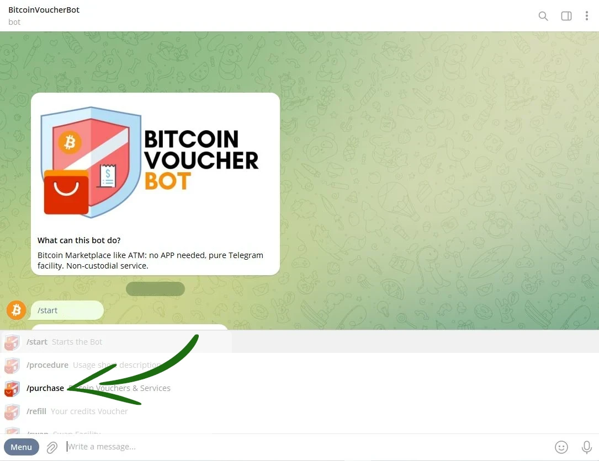

Sejumlah peluang muncul, tetapi kami memilih _Voucher BTC_

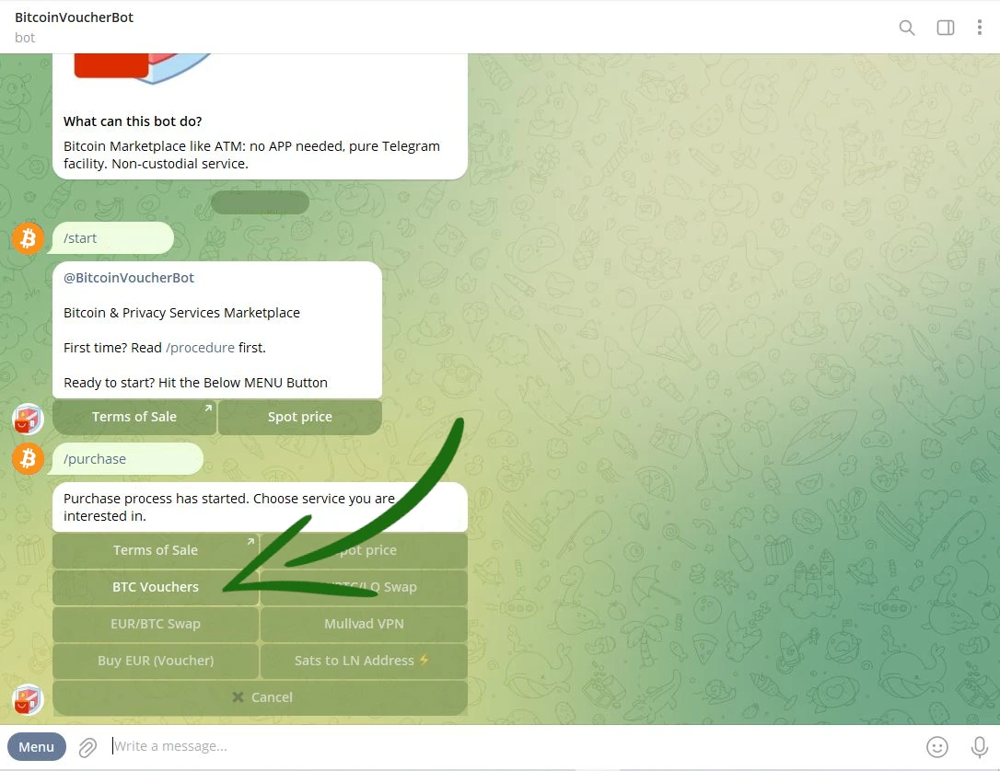

BitcoinVoucherBot memungkinkan Anda untuk membeli onchain Bitcoin, Lightning dan Liquid.

Pada tahap ini pilih _Onchain & Lightning 🔗⚡️_

Layar berubah dengan cepat dan VoucherBot mengusulkan denominasi pembelian. Mulai dari minimal Rp100.00 hingga Rp900.00.

Untuk pembelian pertama, hanya denominasi 100.00 €, Onchain dan Lightning yang ditawarkan. Untuk meningkatkan kerahasiaan, kami sarankan untuk memilih _Lightning ⚡️_

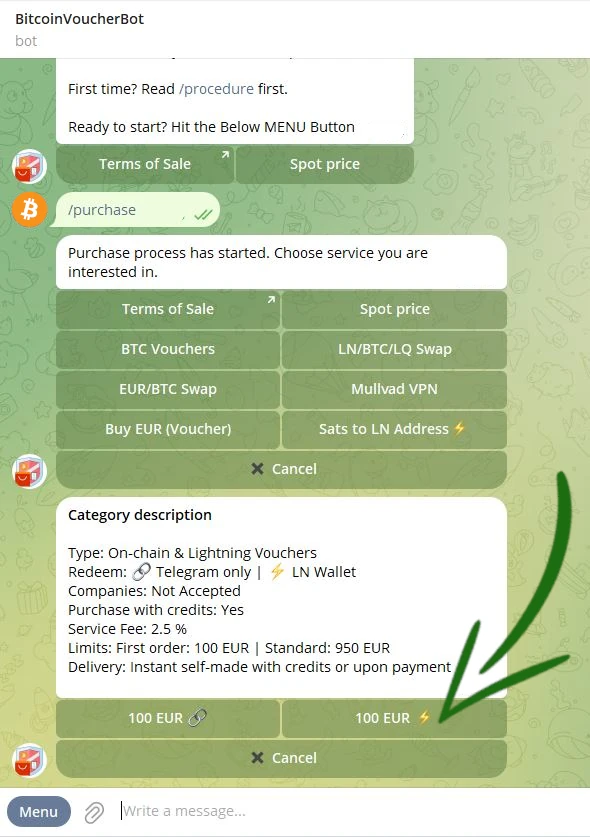

VoucherBot memberi tahu kita bahwa pilihan pertama telah dibuat dan untuk mengonfirmasikannya, kita harus memilih _Lanjutkan_

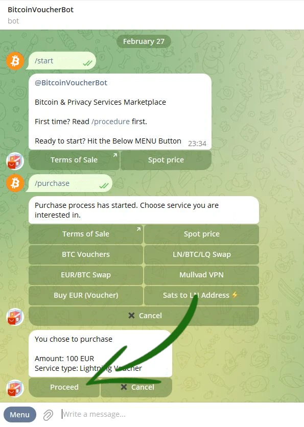

Sekarang tinggal memilih metode pembayaran. Transfer dilakukan melalui transfer bank **(hanya menerima SEPA)**. VoucherBot mengusulkan sebagai penerima sebuah perusahaan yang menyediakan dua rekening bank, satu di Inggris dan yang lainnya di Swiss. Bank Swiss dipilih untuk melaksanakan tutorial ini

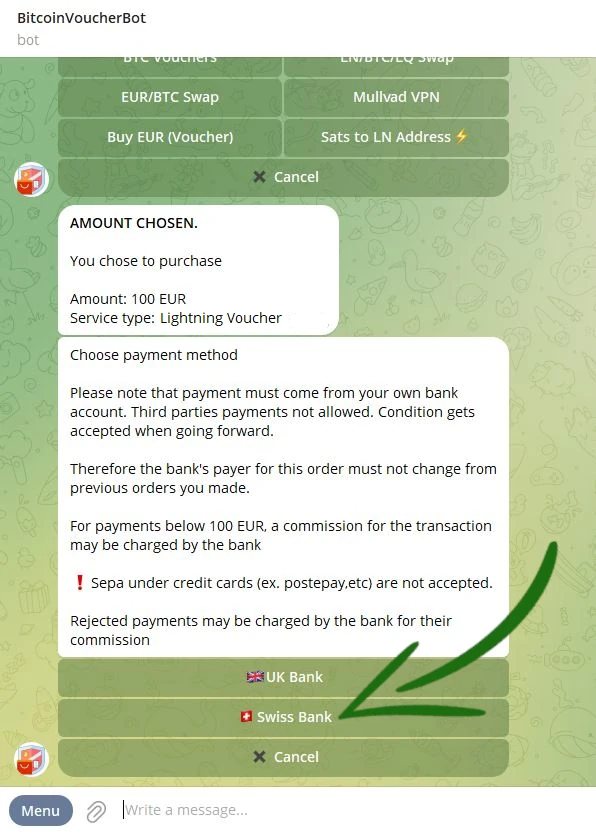

Pada tahap ini kita diminta untuk memasukkan IBAN kita, yaitu IBAN yang digunakan untuk memulai transfer ke bank yang dipilih. Informasi ini digunakan untuk menyusun teka-teki yang akan memungkinkan bot, yaitu mesin, untuk mengumpulkan beberapa informasi untuk membuat proses pembelian mengalir tanpa perlu campur tangan manusia.

IBAN harus ditulis di bilah pesan, dicentang, dan dikirim ke bot.

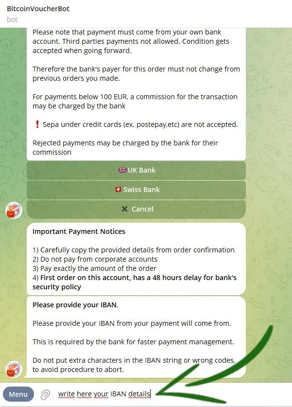

Pesan kontrol sekarang muncul dalam obrolan dengan VoucherBot.

Jika semuanya sudah benar, lanjutkan dengan mengeklik _Lanjutkan_.

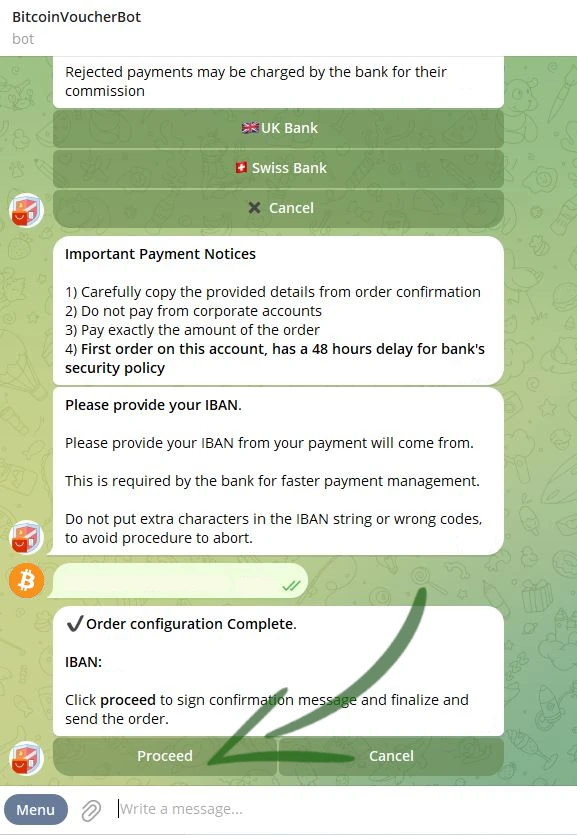

## Pembayaran

Setelah beberapa saat, yang diperlukan untuk memproses data, VoucherBot membalas dengan pesan yang berisi semua detail yang diperlukan untuk menyelesaikan pesanan. Informasi yang diperlukan tergantung pada apa yang diminta oleh bank Anda:

- `IBAN`, yang penting untuk setoran, serta Address penerima;
- 'jumlah yang dipilih' sebelumnya melalui batas waktu, yang harus dipenuhi agar VoucherBot dapat mengenali pesanan saat pembayaran diterima;
- 'Alasan pembayaran', yaitu alasan pembayaran. **Harus disalin dan ditempelkan tanpa menghapus atau menambahkan apa pun pada kolom yang sesuai dengan transfer Anda. Tanda "." atau "-" yang ada pada alasan pembayaran dapat diganti dengan `spasi kosong`.
- `OrderID` unik untuk merujuk saat meminta bantuan apa pun.

Anda kemudian dapat melanjutkan pembayaran, melalui aplikasi atau bank Anda. Ketika pembayaran telah diterima oleh bank, penting untuk diingat untuk menekan _Notify payment_ dalam obrolan dengan VoucherBot. Operasi sederhana ini akan memberi tahu Anda bahwa pembayaran sedang dalam proses.

VoucherBot merespons dengan pesan yang berisi peringatan yang sangat penting: **Jangan hapus obrolan, setidaknya sampai voucher diterima, karena ini adalah satu-satunya cara untuk merekonstruksi pesanan dan menjaganya tetap berjalan.

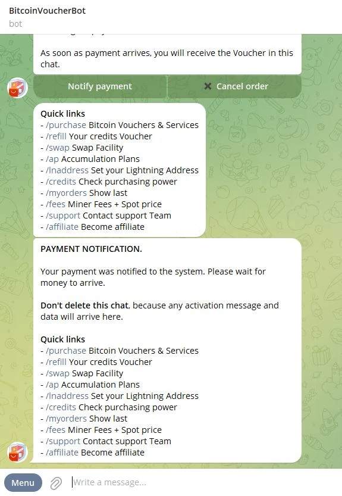

---
Harap dicatat:

- hanya transfer kawat SEPA yang diterima;
- waktu tunggu semata-mata terkait dengan bagaimana bank (yang tidak bekerja 24/7/365 seperti Bitcoin) memproses voucher. Diperlukan waktu beberapa jam hingga 3 hari kerja untuk menerima voucher;
- untuk kebutuhan apa pun, Bitcoin VoucherBot memiliki layanan [dukungan] (https://t.me/BitcoinVoucherGroup) yang sangat baik di Telegram.

---
## Penebusan

Segera setelah pembayaran berhasil, Bitcoin VoucherBot mengirimkan voucher langsung ke dalam obrolan. Voucher kilat dalam bentuk kode QR, dicetak pada latar belakang oranye.

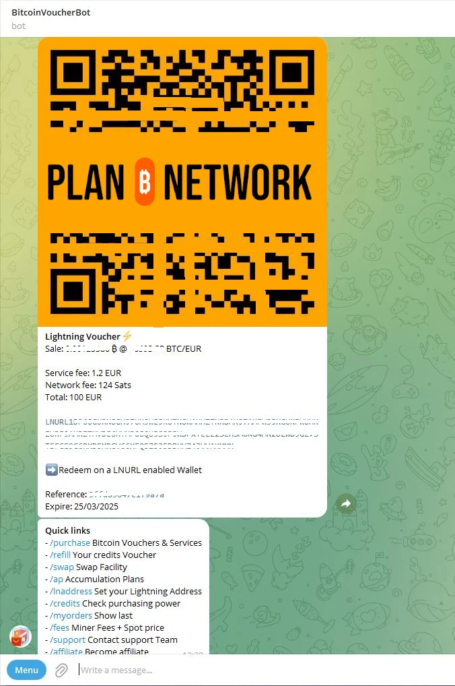

Ada semua data yang diperlukan untuk menguangkannya:

- jumlah dalam Sats, setara dengan jumlah yang dikirim melalui transfer bank, tidak termasuk biaya layanan dan biaya jaringan;
- iD referensi dari voucher;
- tanggal di mana voucher harus ditukarkan atau dana akan hilang, yaitu 25 hari setelah penerbitan.

Anda dapat menguangkan voucher dengan membingkai kode QR dengan fungsi pemindaian Wallet Lightning Network yang kompatibel, atau melalui LNURL, yang juga ditampilkan di bawah kode QR.

Untuk tutorial ini, kami menggunakan Wallet dari Satoshi, menggunakan fungsi pemindaian yang diaktifkan oleh tombol _Send_

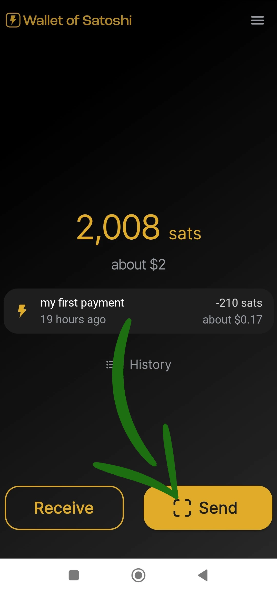

Dengan kamera ponsel diaktifkan, bingkai kode QR dalam obrolan, buka Telegram dari PC

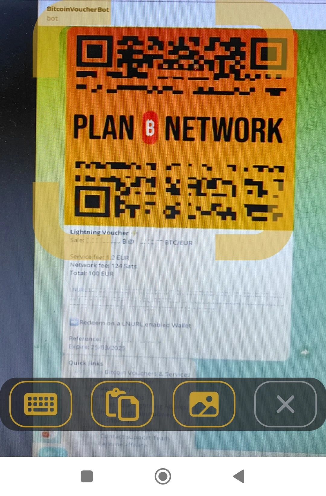

Sebelum melanjutkan, Wallet Dari Satoshi dari layar verifikasi yang menyertakan jumlah, yang sama persis dengan jumlah yang tertera pada voucher dan, sebagai deskripsi, BitcoinVoucherBot. Untuk mencairkan voucher, cukup klik _Terima_

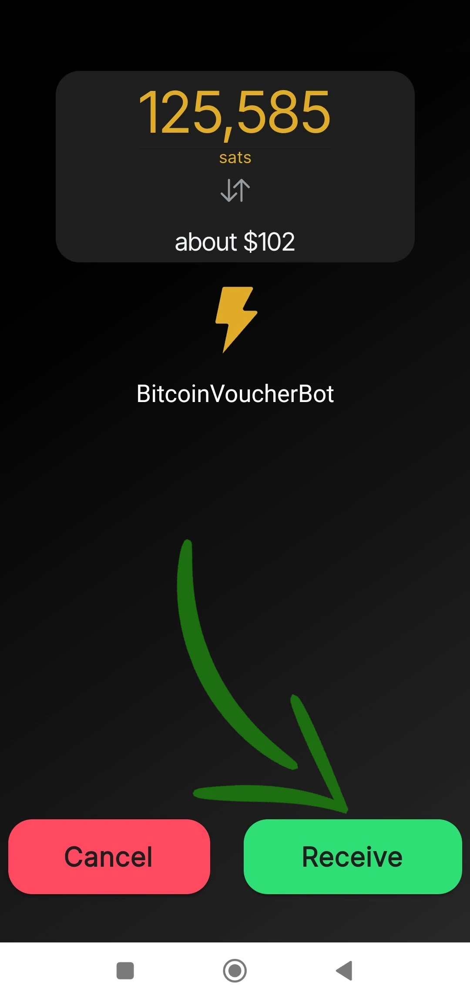

Wallet Dari proses Satoshi selama beberapa saat

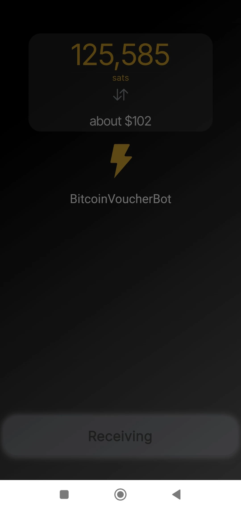

dan akhirnya koleksi tersebut dilaporkan dan segera tersedia dalam saldo Wallet.

**Wallet dari Satoshi adalah aplikasi kustodian: segera setelah mencairkan voucher, disarankan untuk memindahkan Sats ke Wallet non-kustodian.**

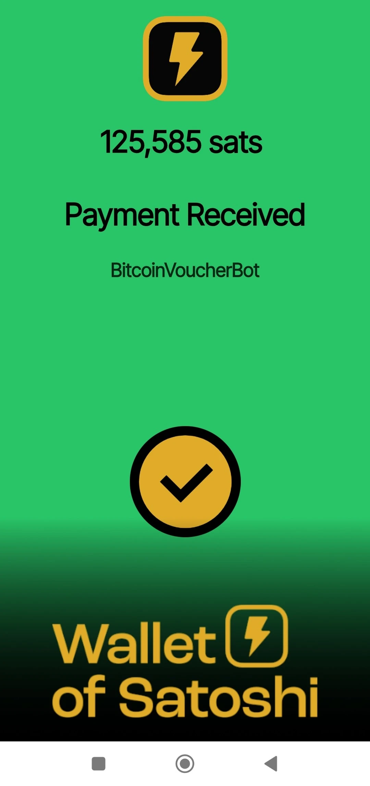

### Cara menguangkan voucher onchain

Seperti yang kita lihat dalam persiapan pesanan, VoucherBot memungkinkan Sats untuk dibeli secara langsung di blockchain, dengan pilihan voucher eponymous.

**Catatan**: Persiapan pesanan dan pembayaran tidak berubah, selalu sama. Yang berubah adalah bagaimana voucher onchain diuangkan.

Setelah menyelesaikan pesanan, melakukan pembayaran, menekan _Notify payment_ dan menunggu waktu teknis bank untuk mentransfer transfer, VoucherBot akan merespons dengan mengirimkan voucher langsung ke dalam obrolan.

Voucher ini juga berbentuk kode QR, tetapi warna utamanya adalah kuning kenari dan-yang paling penting-dalam deskripsinya dijelaskan dengan baik bahwa ini adalah voucher onchain, yang dapat diuangkan langsung di onchain Wallet Anda dan, untuk memulai prosedur pencairan, Anda harus mengeklik _Redeem on Telegram_. Voucher onchain juga berisi informasi yang sudah terlihat untuk voucher lightning:

- jumlah dalam Sats, setara dengan jumlah yang dikirim melalui transfer bank, tidak termasuk biaya layanan dan biaya jaringan;
- kode voucher;
- iD referensi dari voucher;
- tanggal di mana voucher harus ditukarkan atau dana akan hilang, yaitu 25 hari setelah penerbitan.

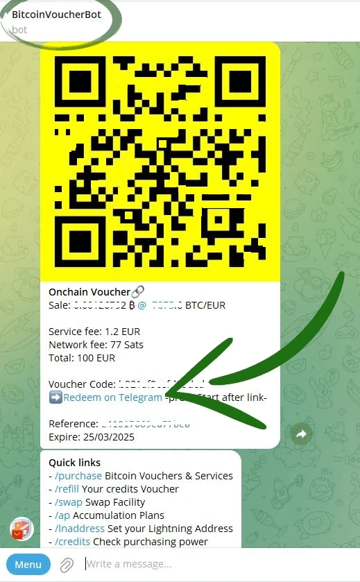

**PERINGATAN ⚠️:** diklik seperti yang dijelaskan, pop-up bot lain akan terbuka: **Voucher PenukaranBot.**

Voucher RedeemBot adalah alat yang disediakan untuk tujuan ini. Apakah ini adalah penggunaan pertama atau ada pesanan sebelumnya, setiap kali penukaran baru dilakukan, Anda harus selalu mengklik _MULAI_.

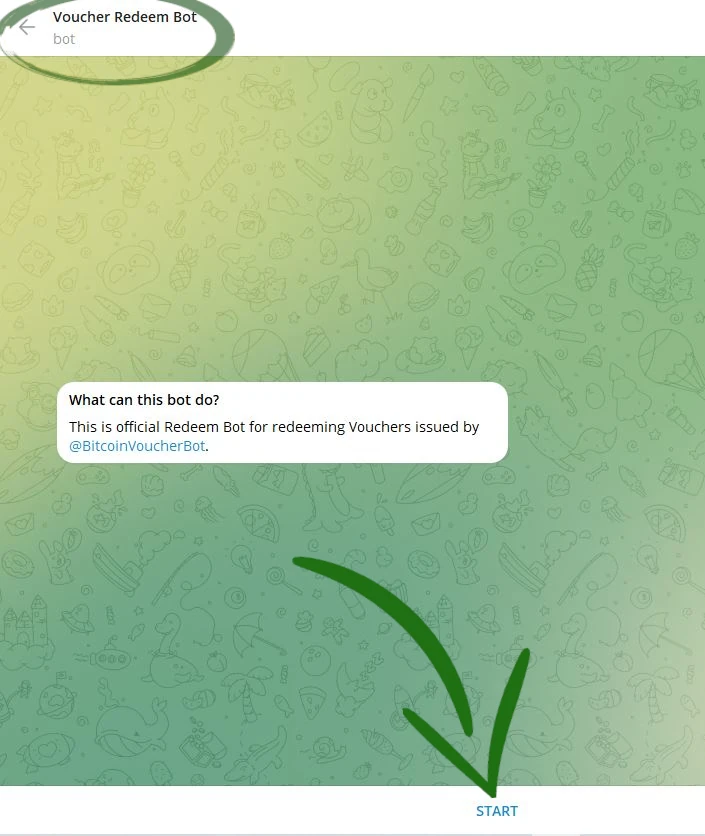

Pada titik ini RedeemBot memuat voucher onchain, yang mudah dikenali oleh Kode Voucher dan ID referensi. Ini juga membuka bilah untuk menulis pesan dan mulai mengobrol dengan bot, yang sebenarnya mengundang kita untuk memberitahukannya Address onchain dari Wallet kita.

**Catatan**: Address ini harus tipe SegWit.

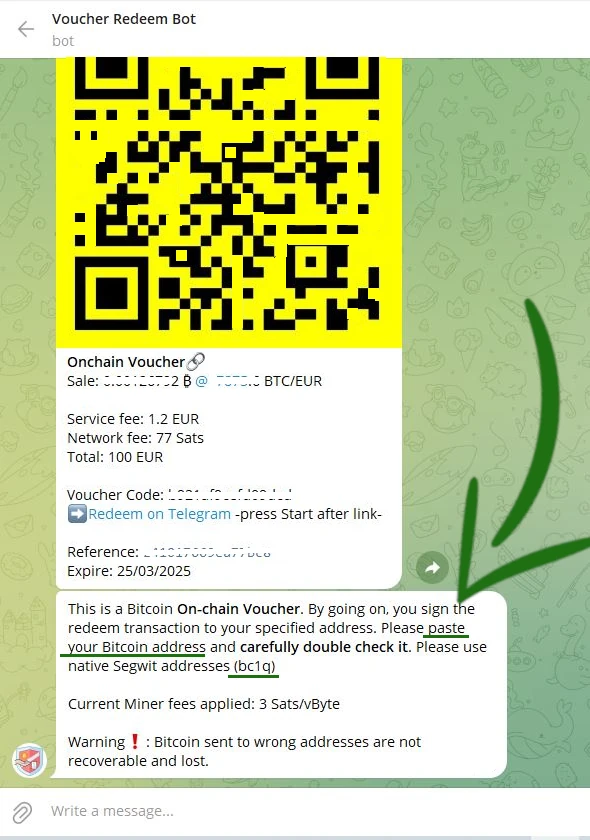

Kami membuka Wallet kami pada titik ini dan generate a SegWit Address

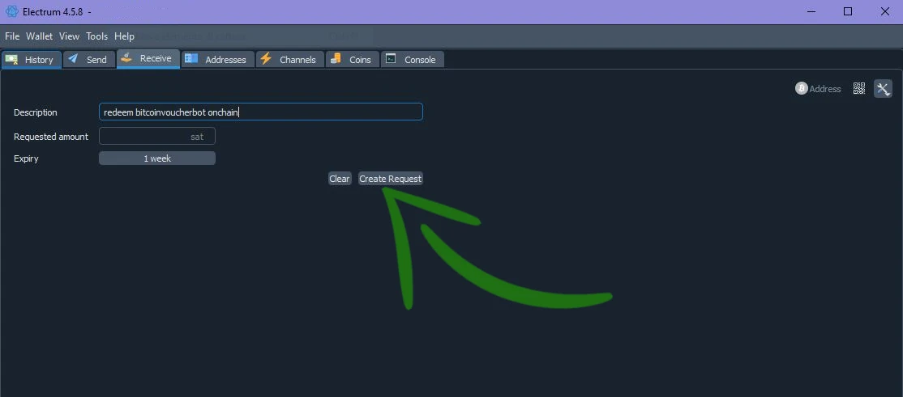

kami menyalinnya

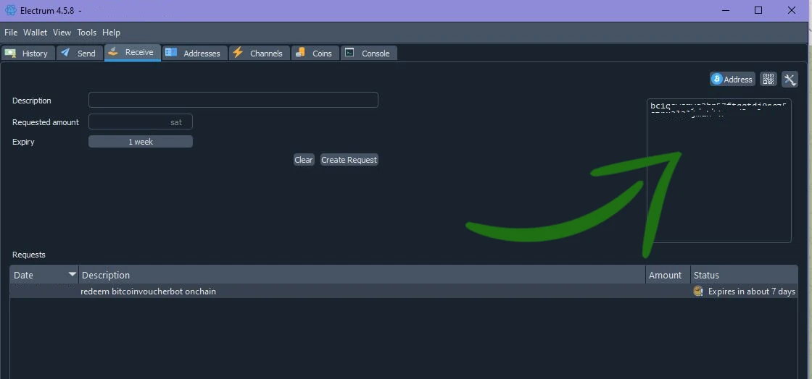

dan tempelkan ke dalam obrolan dengan RedeemBot

Kita sekarang memiliki layar pemeriksaan, untuk memverifikasi kode voucher sudah benar, serta Address yang telah kita komunikasikan ke RedeemBot. Mari kita periksa dengan baik karena, dengan mengklik _Proceed_, transaksi dimulai dan tidak akan ada cara untuk menemukannya lagi jika kita, misalnya, mengkomunikasikan Address yang salah.

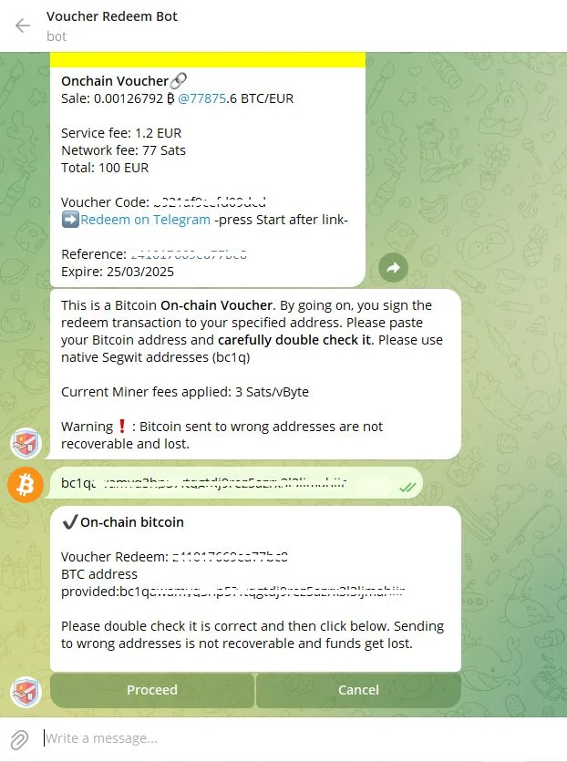

Transaksi telah dimulai dan prosedur Redeem dari voucher onchain berakhir.

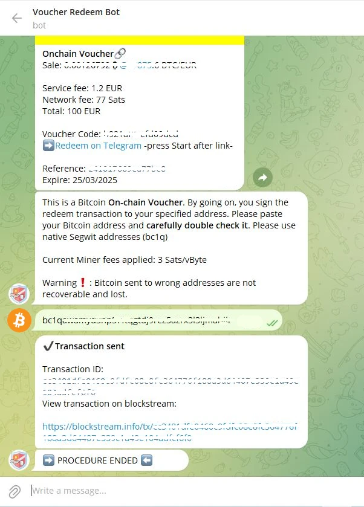

sementara jumlah tersebut dapat dilihat dalam sejarah Wallet kami.

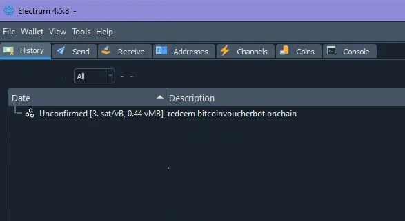