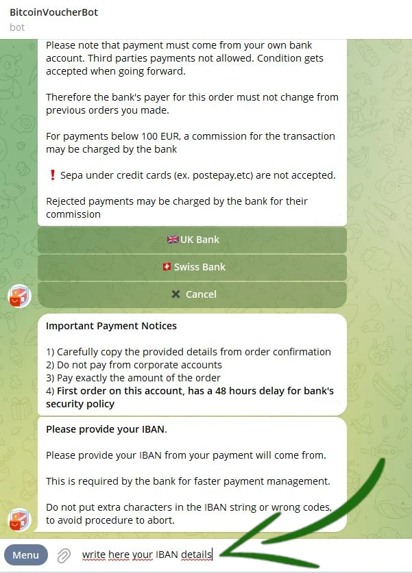

_Questo tutorial è stato scritto da_ [Bitcoin Campus](https://linktr.ee/bitcoincampus_)

# Introduzione
Il BitcoinVoucherBot è uno strumento con il quale si possono acquistare Bitcoin in cambio di euro.

### KYC Light

L'azione di cambiare euro per Bitcoin è il primo e fondamentale passo per iniziare a studiare questa materia, ma è apparentemente anche il più difficile e complesso. Le opzioni possono essere molteplici: l'offerta di bitcoin tramite gli exchange centralizzati, i meetup a tema Bitcoin, amici, conoscenti e tanto altro ancora. Ci uniamo alla community di Bitcoiner e **sconsigliamo assolutamente l’uso di exchange centralizzati**, al fine di salvaguardare maggiormente attenzione alla propria privacy.

Sebbene questa scelta possa risultare meno comoda, è importante capire che gli exchange applicano la normativa KYC (Know Your Cutomer), assegnando quindi un’identità, nonché una posizione fisica, ad ogni satoshi acquistato presso di loro. La "comodità" presenta degli effetti collaterali che colpiscono.

### Come fare?

Ecco che ci viene incontro il servizio [BitcoinVoucherBot:](https://t.me/BitcoinVoucherBot), un bot di Telegram che fa da tramite tra i nostri bonifici SEPA e l'acquisto di sats.

### Pre-requisiti
Per iniziare ad utilizzare BitcoinVoucherBot non c'è bisogno di rilasciare delicate informazioni personali allo staff del Bot. **Non serve autorizzazione**.

Tutto ciò che occorre è un account Telegram già attivo e un conto corrente bancario. **Nota**: non è adatto un conto aperto presso Poste Italiane (per i clienti italiani) o, più in generale, che faccia riferimento ad una carta ricaricabile.

Nella chat di Telegram prepariamo un ordine, con un bonifico bancario lo paghiamo e, infine, tramite il bot otteniamo un voucher emesso da una società terza che non conosce l'oggetto dell’acquisto.

### Attivazione del bot e menu
L’attivazione è una semplice operazione che viene eseguita una volta sola. Da Telegram cercare _@BitcoinVoucherBot_ e, appena giunti nella chat del Bot, campeggia in basso un pulsantone grande _Avvia/Start_. L’operazione fa rispondere il Bot che presenta il menu dei principali comandi a disposizione. Appaiono anche i primi messaggi di benvenuto, per i quali consigliamo un'attenta lettura.

**Attenzione**: ci sono diversi scammer che si spacciano per VoucherBot originale. Se non sei sicuro della ricerca via Telegram, fai accesso al link di BitcoinVoucherBot dal [sito ufficiale](https://www.bitcoinvoucherbot.com/)

Le opzioni appaiono cliccando il tasto _Menu_ in basso a sinistra: si può cliccare sulla parola corrispondente al comando, oppure scrivere nella casella del messaggio lo slash `/` seguito dal comando digitato.

Tra le principali operazioni ci sono:
- _/purchase_: è la procedura di acquisto vera e propria. Al termine dell’operazione il QR Code viene generato automaticamente dal bot, pronto al riscatto.
- _/refill_: disponibile nel momento in cui scriviamo questo tutorial, ma non lo tratteremo perché - per motivi tecnici - questa opzione potrebbe essere elimata in seguito.
- _/swap_: apre la procedura di swap, disponibile sia con un comodo bot di Telegram che via web.
- _/ap_: accumulation plan, che consente di impostare un **Piano di Accumulo Costante (PAC)**.
- _/lnaddress_: con cui ci viene chiesto di collegare un proprio LN Address, per una particolare procedura che vedremo in seguito.
- _/credits_: per controllare quanto credito è rimasto per generare voucher.
- _/myorders_: mostra gli ordini fatti con il bot (**Attenzione** il sistema tiene traccia soltanto degli ultimi 10 ordini effettuati e non l'intero storico).
- _/fees_: un comando per controllare le fee di rete. Per valutarle, è sempre meglio affidarsi a mempool.space.
- _/support_: in caso di necessità, fa comparire i contatti per segnalare al team di supporto le problematiche.

# Procedura di acquisto Bitcoin

## Preparazione dell'ordine
Cliccare _/purchase_ nel menu dei comandi

Compaiono una serie di opportunità, ma noi scegliamo _BTC Vouchers_

BitcoinVoucherBot consente di acquistare Bitcoin onchain, Lightning e Liquid.
In questa fase si scelga _Onchain & Lightning 🔗⚡️_

La schermata cambia rapidamente e VoucherBot propone i tagli di acquisto. Si parte da un minimo di 100,00 € fino ad arrivare a 900,00 €.

In caso di primo acquisto, vengono proposti solo i tagli da 100,00 €, Onchain e Lightning. Per aumentare la confidenzialità, suggeriamo di scegliere _Lightning ⚡️_

Il VoucherBot ci avvisa che una prima scelta è stata fatta e che, per confermarla, è necessario scegliere _Proceed_

Si tratta ora di scegliere il metodo di pagamento. Il trasferimento avviene tramite bonifico **(accettato solo SEPA)**. VoucherBot propone come ricevente una società che mette a disposzione due conti correnti, uno in U.K e l'altro in Svizzera. Per realizzare questo tutorial è stata scelta la banca svizzera

A questo punto ci viene chiesto di immettere il nostro IBAN, quello da cui partirà il bonifico verso la banca scelta. Questa informazione va a comporre un puzzle che permetterà al bot, cioè ad una macchina, di mettere insieme alcune informazioni per far scorrere il processo d'acquisto senza il bisogno dell'intervento umano.
L'IBAN deve essere scritto nella barra del messaggio, controllato e inviato al bot.

Nella chat con VoucherBot compare ora un messaggio di controllo.
Se tutto è corretto, proseguire cliccando _Proceed_.

## Pagamento

Dopo qualche istante, necessario per processare i dati, VoucherBot replica con un messaggio che contiene tutti i dettagli necessari a completare l'ordine. A seconda di quanto richiesto dalla propria banca, le informazioni rilevanti sono:
- `IBAN`, indispensabile per il versamento, oltre all'indirizzo del ricevente;
- `l'importo scelto` in precedenza tramite il taglio, che deve essere rispettato per permettere a VoucherBot di riconoscere l'ordine quando sarà arrivato il pagamento;
- `Payment reason`, ovvero la causale del pagamento. **Deve essere copiata e incollata senza togliere o aggiungere nulla nell'apposito campo del proprio bonifico. Eventuali "." o "-" presenti nella payment reason, possono essere sostituiti dallo "spazio bianco"**.
- un `OrderID` univoco, cui fare riferimento per richiedere eventuale assistenza.

Si può quindi procedere con il pagamento, tramite la propria app o banca. Quando il pagamento è stato accettato dalla banca, è importante ricordarsi di premere _Notify payment_ nella chat con VoucherBot. Questa semplice operazione avvisa che un pagamento sta per arrivare.

VoucherBot risponde con un messaggio che contiene un avviso molto importante: **non cancellare la chat**, almeno fino alla ricezione del voucher, perché è l'unico strumento per ricostruire l'ordine e farlo proseguire.

---
Nota bene:
- sono accettati solo bonifici SEPA;
- i tempi di attesa sono legati esclusivamente alle modalità di processamento delle banche (che non lavorano 24/7/365 come Bitcoin). Potrebbero volerci da poche ore fino a 3 giorni lavorativi per ricevere il voucher;
- per qualsiasi necessità, Bitcoin VoucherBot ha un eccellente servizio di [assistenza](https://t.me/BitcoinVoucherGroup) su Telegram.

---

## Riscatto
Non appena il pagamento è giunto a buon fine, Bitcoin VoucherBot manda il voucher direttamente nella chat. Il voucher lightning è sottoforma di QR code, stampato su sfondo arancione.

Ci sono tutti i dati necessari per incassarlo:
- l'importo in sats, equivalente a quello inviato tramite bonifico, escluse le fee del servizio e le fee di rete;
- un reference ID del voucher;
- la data entro la quale il voucher deve essere riscattato, pena la perdita di fondi, cioè 25 giorni dopo l'emissione.

Si può incassare il voucher inquadrando il QR code con la funzione scan di un wallet Lightning Network compatibile, o tramite LNURL, anch'esso indicato sotto il QR code.

Per questo tutorial abbiamo usato Wallet Of Satoshi, usando la funzione di scan attivata dal tasto _Send_

Con la fotocamera del cellulare attivata, inquadrare il QR code nella chat, aprendo Telegram da PC

Prima di procedere, Wallet Of Satoshi da una schermata di verifica che comprende l'importo, il quale corrisponde esattamente a quello espresso sul voucher e, come descrizione, BitcoinVoucherBot. Per incassare il voucher è sufficiente cliccare su _Receive_

Wallet Of Satoshi processa per pochi istanti

e infine l'incasso è segnalato e subito disponibile nel saldo del wallet.

**Wallet of Satoshi è un'app custodial: subito dopo l'incasso del voucher è consigliabile spostare i sats su un wallet non-custodial.**

### Come incassare un voucher onchain

Come abbiamo visto nella preparazione dell'ordine, VoucherBot permette di acquistare sats direttamente onchain, con la scelta dell'omonimo voucher.

**Nota**: preparazione dell'ordine e pagamento non cambiano, sono sempre gli stessi. Ciò che cambia è il come si incassa un voucher onchain.

Dopo aver completato l'ordine, effettuato il pagamento, premuto _Notify payment_ e atteso i tempi tecnici delle banche per trasferire il bonifico, VoucherBot risponderà inviando il voucher direttamente nella chat.

Anche questo voucher è sottoforma di QR code, ma il colore principale è il giallo canarino e - soprattutto - in descrizione è ben spiegato che si tratta di un voucher onchain, il quale si incassa direttamente sul proprio wallet onchain e, per iniziare la procedura di incasso, si deve cliccare su _Redeem on Telegram_. Anche il voucher onchain contiene le informazioni già viste per quello lightning:
- l'importo in sats, equivalenti a quello inviato tramite bonifico, escluse le fee del servizio e le fee di rete;
- un voucher code;
- un reference ID del voucher;
- la data entro la quale il voucher deve essere riscattato, pena la perdita di fondi, cioè 25 giorni dopo l'emissione.

**ATTENZIONE ⚠️:** cliccato come spiegato, si apre il pop-up di un altro bot: **Voucher RedeemBot.**

Voucher RedeemBot è lo strumento messo a disposizione per questo scopo. Sia che si tratti del primo utilizzo, sia che ci siano degli ordini pregressi, ad ogni nuovo riscatto è sempre necessario cliccare su _START_.

A questo punto RedeemBot carica il voucher onchain, facilmente riconoscibile da Voucher Code e reference ID. Si sblocca anche la barra per scrivere i messaggi e iniziare a chattare con il bot, che infatti ci invita a comunicargli un indirizzo onchain del nostro wallet.

**Nota**: questo indirizzo deve essere del tipo Segwit.

Apriamo a questo punto il nostro wallet e generiamo un indirizzo segwit

lo copiamo

e lo incolliamo nella chat con RedeemBot

Abbiamo adesso a disposizione una schermata di controllo, per verificare il voucher code che sia corretto, così come l'indirizzo che abbiamo comunicato a RedeemBot. Controlliamo bene perché, cliccando su _Proceed_, la transazione parte e non ci sarà più modo di ritrovarla se abbiamo, ad esempio, comunicato l'indirizzo sbagliato.

La transazione è partita e la procedura di redeem del voucher onchain termina così.

mentre l'importo è visibile in arrivo nella history del nostro wallet.

