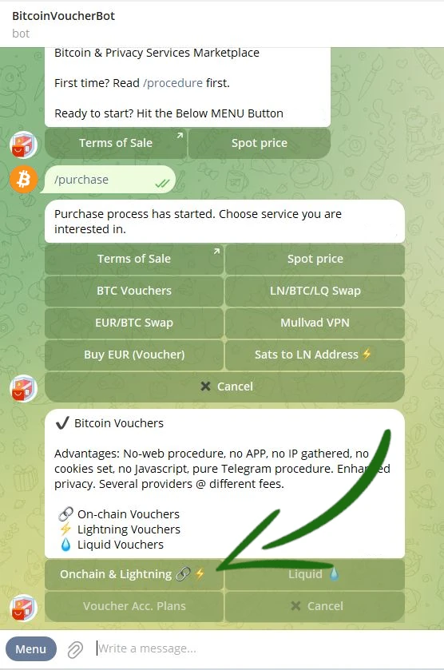
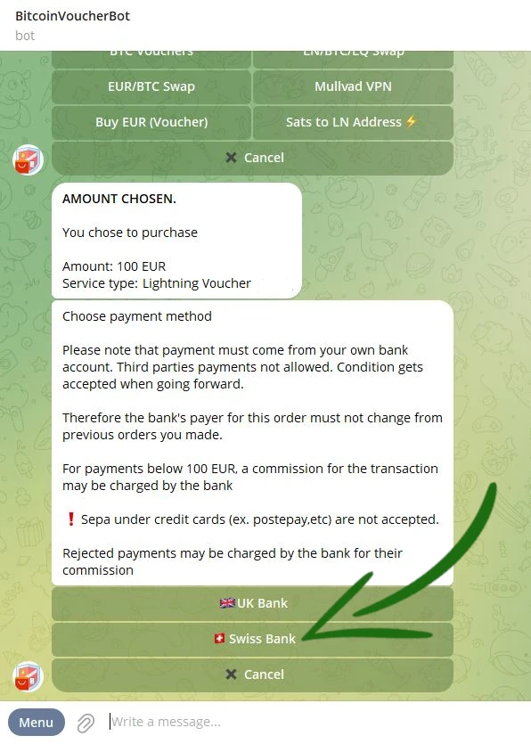
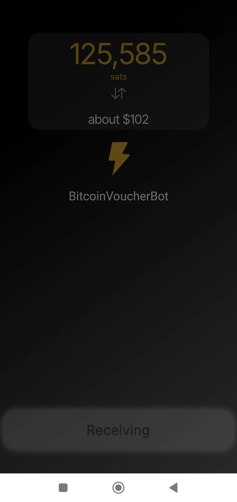

_Bài hướng dẫn này được viết bởi_ [Bitcoin Campus](https://linktr.ee/bitcoincampus_)

# Giới thiệu

BitcoinVoucherBot là công cụ có thể mua Bitcoin bằng Exchange với giá euro.

### Ánh sáng KYC

Hành động đổi euro lấy Bitcoin là bước đầu tiên và cơ bản nhất để bắt đầu nghiên cứu chủ đề này, nhưng rõ ràng cũng là bước khó khăn và phức tạp nhất. Có thể có nhiều lựa chọn: cung cấp Bitcoin thông qua các Sàn giao dịch tập trung, các buổi gặp gỡ theo chủ đề Bitcoin, bạn bè, người quen, v.v. Chúng tôi tham gia cộng đồng Bitcoiner và **chúng tôi hoàn toàn khuyến nghị sử dụng Sàn giao dịch tập trung** để bảo vệ sự chú ý nhiều hơn đến quyền riêng tư của một người.

Mặc dù lựa chọn này có thể không thuận tiện, nhưng điều quan trọng là phải hiểu rằng các Sàn giao dịch thực thi quy định Biết khách hàng của bạn (KYC), do đó chỉ định danh tính cũng như vị trí vật lý cho mọi Satoshi được mua từ họ. "Sự tiện lợi" có một số tác dụng phụ đáng chú ý.

### Làm thế nào để thực hiện?

Sau đây là dịch vụ [BitcoinVoucherBot:](https://t.me/BitcoinVoucherBot), một bot Telegram đóng vai trò là cầu nối giữa các giao dịch chuyển tiền SEPA và giao dịch mua Sats của chúng tôi.

### Điều kiện tiên quyết

Để bắt đầu sử dụng BitcoinVoucherBot, bạn không cần phải tiết lộ thông tin cá nhân nhạy cảm cho nhân viên Bot. **Không cần ủy quyền**.

Tất cả những gì cần là một tài khoản Telegram đã hoạt động và một tài khoản ngân hàng. **Lưu ý**: Không phù hợp khi mở tài khoản tại Poste Italiane (dành cho khách hàng Ý) hoặc nói chung là tham chiếu đến thẻ nạp lại.

Trong cuộc trò chuyện trên Telegram, chúng tôi chuẩn bị một đơn hàng, thanh toán bằng chuyển khoản ngân hàng và cuối cùng thông qua bot, chúng tôi nhận được một chứng từ do một công ty bên thứ ba phát hành, công ty này không biết mục đích mua hàng.

### Kích hoạt bot và menu

Kích hoạt là một thao tác đơn giản chỉ thực hiện một lần. Từ Telegram, hãy tìm kiếm _@BitcoinVoucherBot_ và ngay khi bạn vào được phần trò chuyện của Bot, một nút _Start/Start_ lớn sẽ nổi bật ở phía dưới. Thao tác này khiến Bot phản hồi, hiển thị menu các lệnh chính mà nó có thể sử dụng. Các tin nhắn chào mừng đầu tiên cũng xuất hiện, chúng tôi khuyên bạn nên đọc kỹ.

**Cảnh báo**: có một số kẻ lừa đảo giả danh VoucherBot gốc. Nếu bạn không chắc chắn về việc tìm kiếm qua Telegram, vui lòng truy cập liên kết BitcoinVoucherBot từ [trang web chính thức](https://www.bitcoinvoucherbot.com/)

Các tùy chọn sẽ xuất hiện khi nhấp vào nút _Menu_ ở góc dưới bên trái: bạn có thể nhấp vào từ tương ứng với lệnh hoặc nhập dấu gạch chéo `/` theo sau là lệnh đã nhập vào hộp thông báo.

Các hoạt động chính bao gồm:

- _/purchase_: là quy trình mua hàng thực tế. Khi giao dịch hoàn tất, mã QR sẽ tự động được bot tạo ra, sẵn sàng để đổi.
- _/refill_: có sẵn tại thời điểm viết hướng dẫn này, nhưng chúng tôi sẽ không đề cập đến tùy chọn này vì lý do kỹ thuật, tùy chọn này có thể bị xóa sau này.
- _/swap_: mở quy trình hoán đổi, có thể thực hiện thông qua bot Telegram hoặc qua web.
- _/ap_: kế hoạch tích lũy, cho phép bạn thiết lập **Kế hoạch tích lũy liên tục (CAP)**.
- _/lnaddress_: dùng để liên kết LN Address của chúng ta, cho một quy trình cụ thể mà chúng ta sẽ xem sau.
- _/credits_: để kiểm tra số tín dụng còn lại trong chứng từ generate.
- _/myorders_: hiển thị các đơn hàng được đặt bằng bot (**Cảnh báo** hệ thống chỉ theo dõi 10 đơn hàng gần nhất chứ không phải toàn bộ lịch sử).
- _/fees_: lệnh để kiểm tra phí mạng. Để đánh giá chúng, tốt nhất là luôn dựa vào Mempool.space.
- _/support_: trong trường hợp cần thiết, sẽ hiển thị danh bạ để báo cáo sự cố cho nhóm hỗ trợ.

# Thủ tục mua hàng Bitcoin

## Chuẩn bị đơn hàng

Nhấp vào _/purchase_ trong menu lệnh

Có nhiều cơ hội xuất hiện, nhưng chúng tôi chọn _BTC Vouchers_

BitcoinVoucherBot cho phép bạn mua Bitcoin trực tuyến, Lightning và Liquid.

Ở giai đoạn này chọn _Onchain & Lightning 🔗⚡️_

Màn hình thay đổi nhanh chóng và VoucherBot đề xuất mệnh giá mua. Chúng bắt đầu từ tối thiểu €100,00 đến €900,00.

Trong trường hợp mua hàng lần đầu, chỉ có mệnh giá 100,00 €, Onchain và Lightning được cung cấp. Để tăng tính bảo mật, chúng tôi khuyên bạn nên chọn _Lightning ⚡️_

VoucherBot cảnh báo chúng ta rằng lựa chọn đầu tiên đã được thực hiện và để xác nhận, chúng ta cần chọn _Tiến hành_

Bây giờ là vấn đề chọn phương thức thanh toán. Việc chuyển tiền được thực hiện bằng chuyển khoản điện tử **(chỉ chấp nhận SEPA)**. VoucherBot đề xuất một công ty cung cấp hai tài khoản ngân hàng, một ở Anh và một ở Thụy Sĩ, làm người nhận. Ngân hàng Thụy Sĩ đã được chọn để thực hiện hướng dẫn này

Tại thời điểm này, chúng tôi được yêu cầu nhập IBAN, mã mà từ đó việc chuyển tiền đến ngân hàng đã chọn sẽ bắt đầu. Thông tin này sẽ tạo thành một câu đố cho phép bot, tức là một cỗ máy, tổng hợp một số thông tin để quá trình mua hàng diễn ra trôi chảy mà không cần sự can thiệp của con người.

Bạn phải viết IBAN vào thanh tin nhắn, kiểm tra và gửi đến bot.

Bây giờ, một tin nhắn kiểm soát sẽ xuất hiện trong phần trò chuyện với VoucherBot.

Nếu mọi thứ đều chính xác, hãy tiếp tục bằng cách nhấp vào _Tiếp tục_.

## Sự chi trả

Sau một vài phút, cần xử lý dữ liệu, VoucherBot trả lời bằng tin nhắn chứa tất cả các chi tiết cần thiết để hoàn tất đơn hàng. Tùy thuộc vào yêu cầu của ngân hàng, thông tin liên quan là:

- `IBAN`, mã số cần thiết cho khoản tiền gửi, cũng như mã số Address của người nhận;
- `số tiền đã chọn` trước đó thông qua ngưỡng thanh toán, phải đạt được ngưỡng này để VoucherBot có thể nhận ra đơn hàng khi nhận được thanh toán;
- `Lý do thanh toán`, là lý do thanh toán. **Phải sao chép và dán mà không xóa hoặc thêm bất kỳ thứ gì vào trường thích hợp trong giao dịch chuyển tiền của bạn. Bất kỳ dấu "." hoặc "-" nào có trong lý do thanh toán, có thể được thay thế bằng `khoảng trắng'**.
- `OrderID` duy nhất để tham chiếu khi yêu cầu bất kỳ sự hỗ trợ nào.

Sau đó, bạn có thể tiến hành thanh toán thông qua ứng dụng hoặc ngân hàng của mình. Khi khoản thanh toán đã được ngân hàng chấp nhận, điều quan trọng là phải nhớ nhấn _Thông báo thanh toán_ trong cuộc trò chuyện với VoucherBot. Thao tác đơn giản này sẽ thông báo cho bạn rằng khoản thanh toán đang được thực hiện.

VoucherBot phản hồi bằng một tin nhắn có chứa cảnh báo rất quan trọng: **không xóa cuộc trò chuyện**, ít nhất là cho đến khi nhận được phiếu mua hàng, vì đây là cách duy nhất để xây dựng lại đơn hàng và duy trì đơn hàng.

---
Xin lưu ý:

- chỉ chấp nhận chuyển khoản SEPA;
- thời gian chờ chỉ liên quan đến cách các ngân hàng (không hoạt động 24/7/365 như Bitcoin) xử lý chứng từ. Có thể mất từ vài giờ đến 3 ngày làm việc để nhận được chứng từ;
- đối với mọi nhu cầu, Bitcoin VoucherBot có dịch vụ [hỗ trợ](https://t.me/BitcoinVoucherGroup) tuyệt vời trên Telegram.

---
## Sự cứu chuộc

Ngay sau khi thanh toán thành công, Bitcoin VoucherBot sẽ gửi voucher trực tiếp vào cuộc trò chuyện. Voucher sét có dạng mã QR, được in trên nền màu cam.

Có đầy đủ dữ liệu cần thiết để quy đổi thành tiền mặt:

- số tiền trong Sats, tương đương với số tiền được gửi bằng chuyển khoản, không bao gồm phí dịch vụ và phí mạng;
- mã tham chiếu của chứng từ;
- ngày phải đổi phiếu mua hàng, nếu không, tiền sẽ bị mất, tức là 25 ngày sau ngày phát hành.

Bạn có thể đổi phiếu mua hàng bằng cách quét mã QR bằng chức năng quét của máy Wallet Lightning Network tương thích hoặc thông qua LNURL, cũng hiển thị bên dưới mã QR.

Đối với hướng dẫn này, chúng tôi đã sử dụng Wallet của Satoshi, sử dụng chức năng quét được kích hoạt bởi phím _Send_

Với camera điện thoại di động được kích hoạt, đóng khung mã QR trong cuộc trò chuyện, mở Telegram từ PC

Trước khi tiếp tục, Wallet Của Satoshi từ màn hình xác minh bao gồm số tiền, khớp chính xác với số tiền được thể hiện trên chứng từ và, như mô tả, BitcoinVoucherBot. Để rút tiền từ chứng từ, chỉ cần nhấp vào _Nhận_

Wallet Của Satoshi xử lý trong vài phút

và cuối cùng, bộ sưu tập được báo cáo và có sẵn ngay trong bảng cân đối Wallet.

**Wallet trong số Satoshi là ứng dụng lưu ký: ngay sau khi đổi phiếu mua hàng, bạn nên chuyển Sats sang ứng dụng không lưu ký Wallet.**

### Cách đổi phiếu mua hàng onchain

Như chúng ta đã thấy trong quá trình chuẩn bị đơn hàng, VoucherBot cho phép mua Sats trực tiếp trên chuỗi, với sự lựa chọn về chứng từ cùng tên.

**Lưu ý**: Việc chuẩn bị đơn hàng và thanh toán không thay đổi, chúng luôn giống nhau. Điều thay đổi là cách đổi phiếu mua hàng onchain.

Sau khi hoàn tất đơn hàng, thanh toán, nhấn _Thông báo thanh toán_ và chờ thời gian kỹ thuật của ngân hàng chuyển tiền, VoucherBot sẽ phản hồi bằng cách gửi voucher trực tiếp vào phần trò chuyện.

Phiếu mua hàng này cũng có dạng mã QR, nhưng màu chủ đạo là vàng hoàng yến và quan trọng nhất là trong phần mô tả có giải thích rõ ràng rằng đây là phiếu mua hàng onchain, bạn có thể đổi trực tiếp trên Wallet onchain của mình và để bắt đầu quy trình đổi tiền, bạn phải nhấp vào _Đổi trên Telegram_. Phiếu mua hàng onchain cũng chứa thông tin đã thấy cho phiếu mua hàng lightning:

- số tiền trong Sats, tương đương với số tiền được gửi bằng chuyển khoản, không bao gồm phí dịch vụ và phí mạng;
- mã phiếu giảm giá;
- mã số tham chiếu của chứng từ;
- ngày phải đổi phiếu mua hàng, nếu không, tiền sẽ bị mất, tức là 25 ngày sau ngày phát hành.

**CẢNH BÁO ⚠️:** nhấp vào như giải thích, cửa sổ bật lên của bot khác sẽ mở ra: **Voucher RedeemBot.**

Voucher RedeemBot là công cụ được cung cấp cho mục đích này. Cho dù đây là lần sử dụng đầu tiên hay đã có đơn hàng trước đó, mỗi lần đổi thưởng mới, bạn luôn phải nhấp vào _START_.

Tại thời điểm này, RedeemBot tải chứng từ onchain, dễ dàng nhận dạng bằng Mã chứng từ và ID tham chiếu. Nó cũng mở khóa thanh để viết tin nhắn và bắt đầu trò chuyện với bot, trên thực tế, điều này mời chúng ta nói với nó một Address onchain của Wallet của chúng ta.

**Lưu ý**: Address này phải là loại SegWit.

Chúng tôi mở Wallet tại thời điểm này và generate một SegWit Address

chúng tôi sao chép nó

và dán nó vào cuộc trò chuyện với RedeemBot

Bây giờ chúng ta có màn hình kiểm tra để xác minh mã phiếu giảm giá là chính xác, cũng như Address mà chúng ta đã truyền đạt đến RedeemBot. Hãy kiểm tra kỹ vì khi nhấp vào _Proceed_, giao dịch sẽ bắt đầu và sẽ không có cách nào để tìm lại nếu chúng ta đã truyền đạt sai Address.

Giao dịch đã bắt đầu và quy trình Redeem của chứng từ trên chuỗi kết thúc.

trong khi số lượng có thể được nhìn thấy trong lịch sử Wallet của chúng tôi.

