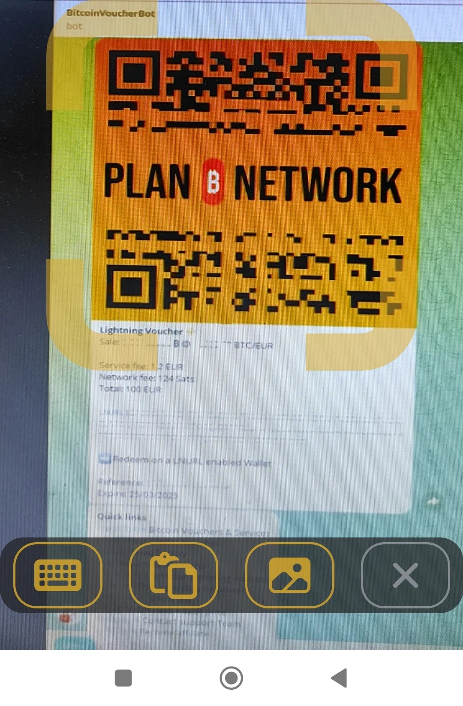

_本教程由_ [Bitcoin 校园](https://linktr.ee/bitcoincampus_) 编写

# 导言

BitcoinVoucherBot 是一种可以用欧元在 Exchange 中购买比特币的工具。

### KYC 灯

为 Bitcoin 更换欧元是开始研究这一主题的第一步，也是最基本的一步，但显然也是最困难和最复杂的一步。可以有很多选择：通过集中式交易所提供 Bitcoin、以 Bitcoin 为主题的聚会、朋友、熟人等等。我们加入比特币社区，**我们绝对建议使用集中式交易所**，以保障个人隐私得到更多关注。

虽然这种选择可能不太方便，但重要的是要明白，交易所执行的是 "了解客户"（KYC）规定，因此，从交易所购买的每个 Satoshi 都会被赋予一个身份和一个物理位置。"方便 "有一些显著的副作用。

### 怎么做？

BitcoinVoucherBot:](https://t.me/BitcoinVoucherBot) 服务来了，这是一个 Telegram 机器人，充当我们的 SEPA 转账和 Sats 购买之间的通道。

### 先决条件

要开始使用 BitcoinVoucherBot，无需向 Bot 工作人员透露敏感的个人信息。 **无需授权**。

只需一个已激活的 Telegram 账户和一个银行账户。 **注意**：在意大利邮政开设的账户（针对意大利客户）或充值卡并不适用。

在 Telegram 聊天室里，我们准备好订单，通过银行转账付款，最后通过机器人获得由第三方公司签发的凭证，而这家公司并不知道购买对象是谁。

### 机器人激活和菜单

激活是一个简单的一次性操作。在 Telegram 上搜索 _@BitcoinVoucherBot_，一进入机器人聊天室，底部就会出现一个大大的 _Start/Start_ 按钮。该操作会使机器人做出反应，并显示一个主要命令菜单。同时还会出现第一批欢迎信息，我们建议您仔细阅读。

**警告**：有几个骗子冒充原版VoucherBot。如果您不确定通过 Telegram 进行搜索，请从 [官方网站](https://www.bitcoinvoucherbot.com/) 访问 BitcoinVoucherBot 链接。

点击左下角的 _Menu_ 按钮即可显示选项：您可以点击与命令相对应的单词，或者在消息框中输入斜线 `/`，然后输入所输入的命令。

主要业务包括

- _/purchase_：是实际的购买流程。交易完成后，机器人会自动生成二维码，以供兑换。
- _/refill_：在编写本教程时可用，但由于技术原因，该选项以后可能会被移除，因此我们将不对其进行介绍。
- _/swap_：打开交换程序，可通过便捷的 Telegram 机器人或网络使用。
- _/ap_：累积计划，允许您设置**恒定累积计划（CAP）**。
- _/lnaddress_：要求我们用它连接自己的 LN Address，用于我们稍后将看到的特定程序。
- _/credits_：检查 generate 凭单还剩多少余额。
- _/myorders_：显示使用机器人下达的订单（**警告**系统只跟踪最近 10 个订单，而不是整个历史订单）。
- _/fees_：检查网络费用的命令。要评估网络费用，最好使用 Mempool.space。
- _/support_：在需要时，弹出向支持团队报告问题的联系人。

# Bitcoin 采购程序

## 订单准备

点击命令菜单中的 _/购买

出现了许多机会，但我们选择了_BTC 代金券_____________________________。

BitcoinVoucherBot 允许您购买 Bitcoin onchain、Lightning 和 Liquid。

在此阶段选择_Onchain & Lightning 🔗⚡️_

屏幕会快速切换，VoucherBot 会提出购买面额。最低 100 欧元，最高 900 欧元。

如果是首次购买，只提供 100.00 欧元、Onchain 和 Lightning 面额。为提高保密性，建议选择 _Lightning ⚡️_

凭单机器人提醒我们已经做出了第一个选择，要确认它，我们需要选择_Proceed_（继续）。

现在只需选择付款方式。转账方式为电汇**（仅接受 SEPA）**。VoucherBot 建议由一家公司作为收款人，该公司提供两个银行账户，一个在英国，另一个在瑞士。本教程选择瑞士银行进行操作

此时，我们需要输入 IBAN，即开始向所选银行转账的 IBAN。这些信息将组成一个拼图，让机器人（即机器）拼凑出一些信息，使购买流程更加流畅，而无需人工干预。

IBAN 必须写入信息栏、核对并发送给机器人。

现在，与 VoucherBot 的聊天中会出现控制信息。

如果一切正常，请点击_Proceed_继续。

## 付款方式

处理数据所需的片刻之后，VoucherBot 会回复一条信息，其中包含完成订单所需的所有详细信息。根据您的银行要求，相关信息包括

- IBAN"，这是存款和收款人 Address 所必需的；
- 选择的金额 "先前已通过截止日期，必须满足截止日期才能让 VoucherBot 在收到付款时识别订单；
- 付款原因"，即付款的原因。 **必须复制并粘贴，不得在转账的相应字段中删除或添加任何内容。付款原因中的任何". "或"-"都可以用 "空白 "**代替。
- 一个唯一的 "订单 ID"，以便在请求任何帮助时参考。

然后您可以通过应用程序或银行进行支付。银行接受付款后，请务必记住在与 VoucherBot 的聊天中按下_Notify payment_（通知付款）。这个简单的操作会提醒您付款正在进行中。

VoucherBot 会回复一条信息，其中包含一个非常重要的警告： **至少在收到代金券之前，不要删除聊天**，因为这是重建订单并使其继续的唯一方法。

---
请注意

- 只接受 SEPA 电汇；
- 等待时间完全取决于银行（不像 Bitcoin 那样全天候工作）处理凭单的方式。收到凭单可能需要几个小时到 3 个工作日；
- 如有任何需要，Bitcoin VoucherBot 在 Telegram 上提供出色的 [支持](https://t.me/BitcoinVoucherGroup) 服务。

---
## 救赎

一旦支付成功，Bitcoin VoucherBot 就会将优惠券直接发送到聊天工具中。闪电礼券采用二维码形式，印在橙色背景上。

这里有兑现所需的所有数据：

- Sats 中的金额，相当于电汇金额，不包括服务费和网络费；
- 凭证的参考 ID；
- 必须兑换凭单的日期，否则资金将丢失，即发放后 25 天。

您可以使用兼容的 Wallet Lightning Network 的扫描功能或通过 LNURL（也显示在二维码下方）对二维码进行取景，兑现优惠券。

在本教程中，我们使用了 Wallet Of Satoshi，使用 _Send_ 键激活扫描功能

启动手机摄像头，在聊天框中输入二维码，从电脑打开 Telegram

在继续之前，Wallet Of Satoshi 会从一个验证屏幕上看到金额，该金额与代金券上的金额完全一致，作为说明，BitcoinVoucherBot。要兑现优惠券，只需点击_Receive_______________________________。

Wallet 和 Satoshi 处理片刻

最后在 Wallet 余额中报告并立即提供收款情况。

**Satoshi的Wallet是一个托管应用程序：兑现凭证后，建议立即将Sats移至Wallet非托管**。

### 如何兑现链上代金券

正如我们在订单准备过程中看到的，VoucherBot 允许直接在链上购买 Sats，并可选择同名代金券。

**注意**：订单准备和付款不会改变，始终如一。变化的是如何兑现链上凭单。

完成订单、付款、按_Notify payment_（通知付款）并等待银行转账的技术时间后，VoucherBot 将直接在聊天中发送代金券。

该代金券也是二维码形式，但主色调为金丝雀黄色，最重要的是，说明中详细解释了这是一种链上代金券，您可以直接在 Wallet 上链上兑现，要开始兑现程序，您必须点击 _Redeem on Telegram_。链上兑换券还包含闪电兑换券的相关信息：

- 以 Sats 表示的金额，相当于电汇金额，不包括服务费和网络费；
- 一个优惠券代码；
- 凭证的参考 ID；
- 必须兑换凭单的日期，否则资金将丢失，即发放后 25 天。

**WARNING ⚠️:**按说明点击后，会弹出另一个机器人的窗口： **Voucher RedeemBot.**

代金券 RedeemBot 就是为此目的提供的工具。无论是首次使用还是以前的订单，每次进行新的兑换时都必须点击 _START_。

此时，RedeemBot 会加载链上凭证，通过凭证代码和参考 ID 很容易识别。它还解锁了写消息的栏位，并开始与机器人聊天，实际上是邀请我们告诉它我们的 Wallet 的链上 Address。

**注意**：该 Address 必须为 SegWit 型。

此时我们打开 Wallet 和 generate a SegWit Address

我们复制它

并将其粘贴到与 RedeemBot 的聊天中

现在，我们有了一个检查界面，以验证优惠券代码以及我们发送给 RedeemBot 的 Address 是否正确。让我们好好检查一下，因为点击_Proceed_后，交易就开始了，如果我们发送了错误的 Address，就没有办法再找到它了。

交易开始，链上凭单的 Redeem 程序就此结束。

而从我们 Wallet 的历史中可以看到这一数额的增长。

