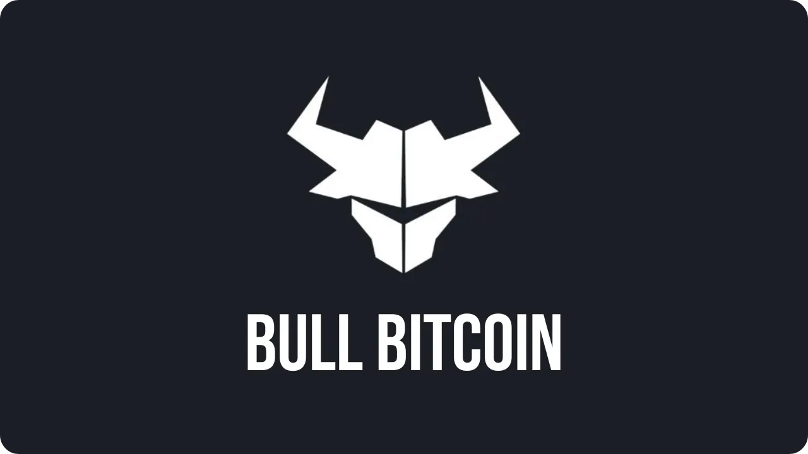

बुल Bitcoin एक Bitcoin-केवल Exchange प्लेटफॉर्म है, जिसे 2013 में कनाडा में फ्रांसिस पाउलियट द्वारा स्थापित किया गया था, जो Bitcoin इकोसिस्टम में एक प्रतिष्ठित व्यक्ति हैं। बुल Bitcoin का दर्शन है कि उपयोगकर्ताओं को वित्तीय स्वतंत्रता और मुक्ति के लिए उपकरण प्रदान करना। यह Exchange प्लेटफॉर्म गैर-हिरासतकारी है, जिसका मतलब है कि आपके बिटकॉइन्स पर हमेशा आपका ही नियंत्रण रहता है।

शुरुआत में केवल कनाडा में उपलब्ध यह प्लेटफॉर्म अब यूरोप में भी उपलब्ध है, जिसमें एक नया और बेहतर Interface शामिल है। Bull Bitcoin का यह नया संस्करण फिलहाल केवल यूरोप में उपलब्ध है। यह आपको बिटकॉइन को तेजी और आसानी से खरीदने और बेचने की सुविधा देता है, जिसका श्रेय लाइटनिंग और इंस्टेंट SEPA ट्रांसफर्स को जाता है। भविष्य में, इस प्लेटफॉर्म में DCA, ऑटोमैटिक खरीदारी, लिमिट ऑर्डर्स और बिटकॉइन में बिल भुगतान के विकल्प भी शामिल किए जाएंगे।

बुल Bitcoin यह सुनिश्चित करता है कि वह एक पारदर्शी सेवा प्रदान करे जिसमें कोई छुपे हुए शुल्क न हों। यूरोप के सभी अन्य Exchange प्लेटफार्मों की तरह, बुल Bitcoin का उपयोग करने के लिए KYC (ग्राहक पहचान प्रक्रिया) की आवश्यकता होती है।

## बुल Bitcoin पर रजिस्टर करें।

Bull Bitcoin की [पंजीकरण पृष्ठ](https://accounts.bullbitcoin.com/en/registration) पर जाएं और एक नया खाता बनाएं। अपना ई-मेल Address दर्ज करें और एक मजबूत पासवर्ड चुनें। फिर "*साइन अप*" पर क्लिक करें।

आपको ई-मेल के माध्यम से एक 6-अंकों का पुष्टि कोड भेजा जाएगा।

इस कोड को Bull Bitcoin वेबसाइट पर दर्ज करें और "*Continue*" बटन दबाएं।

आपका खाता अब सक्रिय है और आप प्लेटफ़ॉर्म का उपयोग कर सकते हैं।

## अपने खाते की स्थापना करना

अब चलिए आपके खाते को सुरक्षित करते हैं। "*माई अकाउंट*" पर क्लिक करें।

"*सुरक्षा सेटिंग्स*" टैब पर जाएं और "*एक्सेस सेटिंग्स*" चुनें।

अपने खाते में अतिरिक्त सुरक्षा के लिए "*दो-कारक प्रमाणीकरण जोड़ें*" विकल्प चुनें।

अपने प्रमाणीकरण ऐप्लिकेशन से QR कोड स्कैन करें, 6-अंकों का कोड दर्ज करें और "*2FA सक्रिय करें*" पर क्लिक करें।

यदि आप 2FA के लिए ऑथेंटिकेशन एप्लिकेशन का उपयोग करने से परिचित नहीं हैं, तो मैं आपको Authy एप्लिकेशन पर इस ट्यूटोरियल को देखने की सलाह देता हूँ:

https://planb.network/tutorials/computer-security/authentication/authy-a76ab26b-71b0-473c-aa7c-c49153705eb7
कृपया पुष्टि के लिए अपना पासवर्ड दर्ज करें।

दोहरी प्रमाणीकरण की सेटिंग अब पूरी हो गई है।

मैं सुझाव देता हूँ कि आप अपने रिकवरी कोड्स को सुरक्षित रखें। उन्हें generate करने के लिए, "*Manage 2FA backup codes*" पर क्लिक करें।

"*generate नए बैकअप रिकवरी कोड्स*" को चुनें और इन कोड्स को किसी सुरक्षित स्थान पर सुरक्षित रखें।

अपने Interface को और अधिक कस्टमाइज़ करने के लिए, "*ऐप सेटिंग्स*" टैब पर जाएं, जहां आप अपनी पसंद की भाषा और मुद्रा चुन सकते हैं।

## KYC का मतलब है "अपने ग्राहक को जानें"। यह एक प्रक्रिया है जिसका उपयोग बैंक और वित्तीय संस्थान अपने ग्राहकों की पहचान और सत्यापन के लिए करते हैं। इसमें आमतौर पर आपके पहचान पत्र, पते का प्रमाण और अन्य व्यक्तिगत जानकारी की जांच शामिल होती है। यह प्रक्रिया इसलिए की जाती है ताकि वित्तीय धोखाधड़ी और अवैध गतिविधियों को रोका जा सके।

Bull Bitcoin की पूरी कार्यक्षमता का उपयोग करने के लिए, जो कि एक विनियमित प्लेटफॉर्म है, आपको पहचान सत्यापन (KYC) करना होगा। "*सत्यापन जारी रखें*" पर क्लिक करें।

"*पर्सनल अकाउंट*" चुनें।

अपनी व्यक्तिगत जानकारी भरें और सत्यापन प्रक्रिया के चरणों का पालन करें। आपसे पूछा जाएगा:

- आपका पहला और आखिरी नाम;
- आपका टेलीफोन नंबर;
- आपका डाक Address;
- आपकी जन्मतिथि, आपका पेशा और इस प्लेटफॉर्म पर आपके इरादे (जैसे निवेश करना, बेचना, भुगतान करना आदि);
- पहचान पत्र और एक सेल्फी।

इस सत्यापन की पुष्टि जल्द ही हो जानी चाहिए। एक बार सत्यापित हो जाने पर, आपको प्लेटफ़ॉर्म द्वारा पेश की गई सभी सुविधाओं का उपयोग करने की अनुमति मिल जाएगी।

## फिएट मुद्रा जमा करें

Bull पर Bitcoin खरीदने और बेचने से पहले यह समझना जरूरी है कि यह प्लेटफॉर्म कभी भी आपके Sats को स्टोर नहीं करता। इसका मतलब है कि Bitcoin खरीदने के लिए, आपको तुरंत अपने फंड को एक स्व-कस्टडी Wallet में ट्रांसफर करना होगा। इसी तरह, बेचने के लिए, आपको अपने बिटकॉइन को स्व-कस्टडी Wallet से Bull पर भेजना होगा। इसके बाद उन्हें प्राप्ति पर फिएट मुद्रा में बदल दिया जाएगा। प्लेटफॉर्म पर सीधे बिटकॉइन स्टोर करना संभव नहीं है। हालांकि, आप यूरो में बैलेंस रख सकते हैं।

शुरू करने के लिए, आपको शायद Bull के साथ कुछ यूरो जमा करने होंगे ताकि आप अपना पहला Sats खरीद सकें। "*फंड जमा करें*" पर क्लिक करें।

"*SEPA ट्रांसफर*" चुनें।

प्लेटफ़ॉर्म के बैंक विवरण प्रदर्शित किए जाएंगे। दिए गए लाभार्थी को अपने नाम के बैंक खाते (जो प्लेटफ़ॉर्म पर KYC के लिए उपयोग किया गया था) से तुरंत SEPA ट्रांसफर करें। ट्रांसफर के विवरण में इस पृष्ठ पर दिखाए गए ट्रांसफर कोड को शामिल करना न भूलें।

जैसे ही हमें आपका ट्रांसफर प्राप्त होगा, आपका यूरो में बैलेंस अपडेट कर दिया जाएगा।

## बिटकॉइन खरीदें

अब जब आपने अपने खाते में यूरो जमा कर दिए हैं, तो अब समय आ गया है कि आप अपना पहला Sats खरीदें। "Bitcoin खरीदें" पर क्लिक करें।

आप वह राशि दर्ज करें जिसे आप खरीदना चाहते हैं। आपको यह भी चुनना होगा कि आप अपने Sats को कैसे निकालना चाहते हैं। छोटी राशि के लिए, मैं लाइटनिंग विकल्प की सिफारिश करता हूँ, लेकिन On-Chain या Liquid निकासी भी उपलब्ध हैं। इस स्थिति में, आपको वह Address प्रदान करना होगा जिसमें धनराशि भेजनी है। एक बार जब आप अपनी जानकारी भर लें, तो "*Continue*" पर क्लिक करें।

अगर आप Bitcoin, Lightning या Liquid वॉलेट्स का इस्तेमाल करने में परिचित नहीं हैं, तो मैं सुझाव दूंगा कि आप हमारा विशेष प्रशिक्षण कोर्स लें।

https://planb.network/courses/f3e3843d-1a1d-450c-96d6-d7232158b81f
आप [Bitcoin वॉलेट्स पर हमारे विस्तृत ट्यूटोरियल्स](https://planb.network/tutorials/Wallet) भी देख सकते हैं।

फिर "*Confirm Buy*" पर क्लिक करके अपनी खरीदारी की पुष्टि करें।

मेरे हिस्से की बात करें तो, मैंने लाइटनिंग के माध्यम से निकासी का विकल्प चुना है, और मेरे पास अपने Sats को प्राप्त करने के तीन विकल्प हैं:

- क्यूआर कोड स्कैन करके LNURL
- मैंने अपने Lightning Address को उपलब्ध करवा दिया है;
- खरीदारी की राशि के लिए एक Invoice प्रदान करके।

LNURL विधि सबसे सरल है। यह ज्यादातर लाइटनिंग वॉलेट्स में उपलब्ध है, जैसे कि फीनिक्स, जहां आप बस "*प्राप्त करें*" चुनें और फिर "*स्कैन करें*"।

आपके बिटकॉइन अब आपके Wallet में सुरक्षित हैं।

## बिटकॉइन बेचना

बिटकॉइन बेचने की प्रक्रिया बहुत ही सरल है। "*Sell Bitcoin*" पर क्लिक करें।

आप वह राशि दर्ज करें जिसे आप बेचना चाहते हैं और Sats को Bull Bitcoin में ट्रांसफर करने की विधि चुनें। छोटी राशि के लिए, मैं लाइटनिंग विकल्प की सिफारिश करता हूँ। फिर "*Continue*" पर क्लिक करें।

उस खाते का चयन करें जिसमें आप बिक्री से प्राप्त यूरो प्राप्त करना चाहते हैं। आप प्लेटफॉर्म पर अपने खाते का चयन कर सकते हैं या किसी बाहरी बैंक खाते का चयन कर सकते हैं। "*जारी रखें*" पर क्लिक करें।

लेन-देन को पूरा करने के लिए निर्देश फिर स्क्रीन पर दिखाए जाते हैं। मेरे लाइटनिंग उदाहरण में, मैं Invoice का भुगतान करूँगा।

जैसे ही भुगतान की पुष्टि हो जाएगी, आपका बैलेंस अपडेट हो जाएगा।

## फिएट मुद्रा निकालें

यदि आपके पास Bull Bitcoin पर यूरो हैं और आप उन्हें किसी बाहरी बैंक खाते में ट्रांसफर करना चाहते हैं, तो "*फंड निकालें*" पर क्लिक करें।

ट्रांसफर की जाने वाली राशि दर्ज करें, फिर "*Continue*" पर क्लिक करें।

अपना भुगतान तरीका चुनें।

एक नया लाभार्थी खाता जोड़ें या पहले से पंजीकृत खातों में से एक चुनें।

फिर निकासी की पुष्टि करें।

अपने सभी लेन-देन पर नज़र रखने के लिए, आप "*नवीनतम लेन-देन*" मेनू में इतिहास देख सकते हैं।

अब आप Bull Bitcoin के साथ Bitcoin को आसानी से खरीदने और बेचने का तरीका जान गए हैं। अगर आपको यह ट्यूटोरियल उपयोगी लगा, तो मैं बहुत आभारी रहूँगा अगर आप नीचे Green अंगूठा दें। इस लेख को अपने सोशल नेटवर्क्स पर साझा करने में संकोच न करें। बहुत-बहुत धन्यवाद!

मैं आपको यह सुझाव देता हूँ कि आप इस दूसरे विस्तृत ट्यूटोरियल को भी देखें, ताकि आप अपने Mnemonic वाक्यांश को सही तरीके से प्रबंधित करना सीख सकें।

https://planb.network/tutorials/wallet/backup/backup-mnemonic-22c0ddfa-fb9f-4e3a-96f9-46e2a7954270