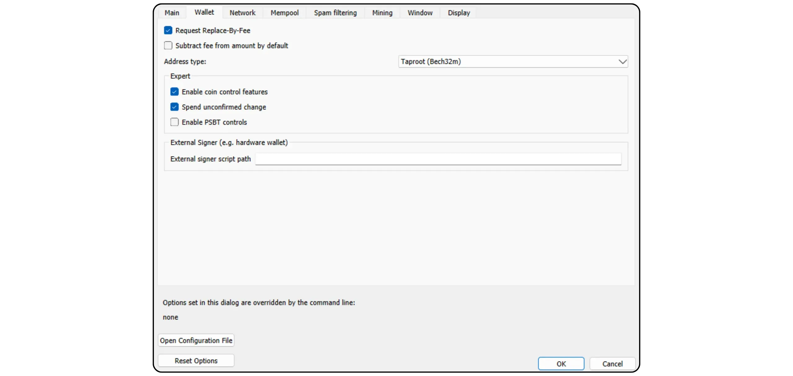
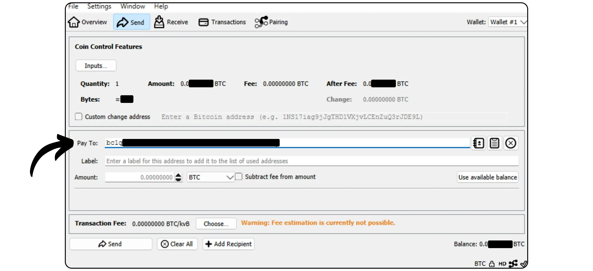

Bitcoin Knots je alternativní implementace protokolu Bitcoin odvozená z jádra Bitcoin. Navrhl a udržuje ji Luke Dashjr a nabízí některé další funkce a úpravy pravidel oproti Mempool, přičemž zůstává kompatibilní s ostatními uzly v síti. Bitcoin Knots integruje Bitcoin Wallet, ale lze jej používat i jako jednoduchý uzel Bitcoin vedle jiného softwaru Wallet.

## Proč používat uzly a ne jádro?

V současné době je jádro většinovou implementací protokolu Bitcoin v síti. Protokol Bitcoin je pouze souborem pravidel. K jejich použití je zapotřebí software. Stroj se softwarem implementujícím protokol Bitcoin se nazývá uzel a všechny tyto uzly dohromady tvoří síť Bitcoin.

V průběhu historie Bitcoin vzniklo mnoho klientů odvozených od původního softwaru vyvinutého Satoshi Nakamotem. Dnes (březen 2025) je v drtivé většině Bitcoin Core - tohoto klienta používá téměř 98 % uzlů v síti Bitcoin.

K dispozici je však i alternativní software. Nejedná se o uzly propojené s Altcoin jako Bitcoin Cash, ale o alternativní klienty kompatibilní se skutečnou sítí Bitcoin. Z nich je nejznámější Bitcoin Knots. V současné době představuje přibližně 1,4 % sítě. Ostatní alternativní zákazníci jsou stále ve výrazné menšině.


Existují dva hlavní důvody, proč používat alternativního klienta, jako je Knots, namísto jádra:


- Technická**: Tito klienti často nabízejí různé možnosti pro jádro, zejména pokud jde o správu Mempool, tím, že určují, které transakce uzel přijímá a vysílá.
- Zásady**: Někteří lidé dávají přednost používání alternativních klientů, jako je Knots, z netechnických důvodů, zejména proto, aby podpořili alternativu k jádru a omezili tak jeho monopol. Pokud by někdy došlo k ohrožení jádra, bylo by užitečné mít nejen solidní a dobře udržované alternativní klienty, ale také vědět, jak je používat. Jiní používají Knots z protestních důvodů, protože ztratili důvěru ve vývojáře Core nebo nesouhlasí se správou většinového klienta.

## Jak nainstalovat uzly Bitcoin?

Na [oficiálních stránkách Bitcoin Knots](https://bitcoinknots.org/#download) si stáhněte verzi pro svůj operační systém. Nezapomeňte si stáhnout otisk prstu a podpisy pro ověření softwaru. Tyto soubory jsou k dispozici také [v úložišti Bitcoin Knots GitHub](https://github.com/bitcoinknots/Bitcoin).


Před instalací softwaru do počítače důrazně doporučujeme zkontrolovat jeho pravost a integritu. Pokud nevíte jak, podívejte se na tento další návod:

https://planb.network/tutorials/computer-security/data/integrity-authenticity-21d0420a-be02-4663-94a3-8d487f23becc
Po ověření softwaru jej nainstalujte podle pokynů na instalačním panelu.


## Spuštění IBD

Při prvním spuštění programu Bitcoin Knots si budete moci vybrat místní adresář, ve kterém budou uložena data uzlů (včetně sady Blockchain, UTXO a parametrů).


Můžete se také rozhodnout pro ořezání dat Blockchain, aby byly zachovány pouze nejnovější bloky. Tato volba umožňuje uzlu kontrolovat každý blok celý v rámci nastaveného limitu úložiště, a postupně tak odstraňovat nejstarší bloky. Pokud máte dostatek místa na disku (v současné době je to přibližně 650 GB, ale toto číslo roste), ponechte tuto možnost nezaškrtnutou. Pokud máte na disku málo místa, aktivujte prořezávání a zadejte maximální povolenou kapacitu.

Upozornění: Pokud je váš uzel ořezán a použijete jej k synchronizaci obnoveného Wallet, nebudete moci načíst transakce před nejstarším lokálně uloženým blokem.


Další dostupnou možností je "*Předpokládat platnost*". Ta urychluje počáteční synchronizaci tím, že vynechává ověřování podpisu u transakcí zahrnutých v blocích před konkrétním blokem.

Cílem funkce "*Assume Valid*" je urychlit první synchronizaci uzlu, aniž by se výrazně snížila bezpečnost, a to tím, že se předpokládá, že tyto transakce již byly v síti hromadně ověřeny předem. Jediným důležitým kompromisem je, že váš uzel nezjistí žádné předchozí krádeže Bitcoin, ale přesto zaručí přesnost celkového počtu vydaných bitcoinů. Váš uzel ověří všechny podpisy transakcí po zadaném bloku. Tento přístup vychází z předpokladu, že transakce, která byla sítí dlouhodobě přijata bez zpochybnění, je s největší pravděpodobností platná.

Například zde je položka "*Předpokládejme, že je platný*" nastavena na blok č. 855 000 `00000000000000000000000233ea80aa10d38aa4486cd7033fffc2c4df556d0b9138`, zveřejněný dne 1. srpna 2024. Během IBD tedy můj uzel zahájí úplné ověření podpisu až od tohoto bloku.


Poté klikněte na tlačítko "*OK*" a spusťte *Initial Block Download*. Během počáteční synchronizace uzlů budete muset být trpěliví. Pokud budete chtít synchronizaci obnovit později, jednoduše zavřete software a vypněte počítač. Synchronizace bude bez problémů pokračovat při příštím otevření programu.


## Nastavení uzlu Bitcoin

Klikněte na kartu "*Nastavení*" a poté vyberte možnost "*Možnosti*".


Na kartě "*Hlavní*" máte přístup k hlavním parametrům uzlu:


- "*Start...*" automaticky spustí uzel při spuštění počítače, aby se synchronizace okamžitě zahájila;
- "*Prune...*" upraví limit ukládání, pokud jste se rozhodli prořezat Blockchain ;
- "*Databáze cache...*" nastavuje maximální množství paměti RAM povolené pro váš uzel;
- Pokud chcete uzel Bitcoin Knots připojit k jinému portfoliovému softwaru, jako je například Sparrow Wallet nebo Liana, aktivujte možnost "*Povolit server RPC*".


Na kartě "*Wallet*" najdete nastavení pro integrované portfolio, které můžete později vytvořit v aplikaci Uzly. Doporučuji, abyste aktivovali funkci RBF a kontrolu mincí. Můžete také definovat typ skriptu, který se má použít.



Karta "*Síť*" obsahuje parametry sítě, které můžete přizpůsobit svým specifickým potřebám.


Na kartě "*Mempool*" můžete konfigurovat *Poul paměti*, tj. správu nepotvrzených transakcí uložených v paměti, a maximální velikost přidělenou této funkci (ve výchozím nastavení 300 MB).


Karta "Filtrování spamu" je funkcí Bitcoin Knots. Najdete zde řadu nastavení, která vám umožní zvolit, které transakce budete přijímat nebo odmítat vysílat. Hlavním cílem je omezit některá okrajová použití Bitcoin, zejména metaprotokoly, aby se proti těmto praktikám bojovalo a zároveň se zabránilo přetížení vašeho uzlu. Je to politická volba, která závisí na vaší osobní představě o Bitcoin.

Najdete zde také klasické parametry, jako je definice prahové hodnoty "*Dust*".

Tyto parametry však ovlivňují pouze pravidla standardizace. Váš uzel bude nadále přijímat nepotvrzené transakce, pouze pokud budou zahrnuty do bloku, aby zůstal kompatibilní se zbytkem sítě Bitcoin. Tato nastavení pouze mění způsob, jakým váš uzel zpracovává a distribuuje nepotvrzené transakce svým kolegům. Protože uzly jsou v praxi v menšině, jsou to právě pravidla stanovená ve výchozím nastavení v jádře Bitcoin, která definují standardizaci v síti.


Na kartě "*Mining*" můžete nastavit možnou účast uzlu v Mining, pokud chcete tuto funkci aktivovat.


Karta "*Zobrazení*" se týká parametrů souvisejících s grafikou Interface, včetně jazyka softwaru.


## Vytvoření portfolia Bitcoin

Po dokončení počáteční synchronizace je uzel Bitcoin Knots plně funkční. Nyní máte možnost připojit tento uzel k jinému softwaru Wallet nebo přímo používat vestavěný Hot Wallet. Za tímto účelem klikněte na tlačítko "*Vytvořit nový uzel Wallet*".


Pojmenujte svůj Wallet. Můžete jej také chránit pomocí passphrase BIP39 kliknutím na "*Encrypt Wallet*". Jakmile budete připraveni, klikněte na tlačítko "*Vytvořit*".


passphrase BIP39 je volitelné heslo, které si můžete libovolně zvolit jako doplněk k frázi Mnemonic a zvýšit tak bezpečnost svého zařízení Wallet. Před nastavením této funkce vám důrazně doporučujeme přečíst si následující článek, který podrobně vysvětluje, jak passphrase teoreticky funguje a jak se vyvarovat chyb, které by mohly vést k trvalé ztrátě vašich bitcoinů:

https://planb.network/tutorials/wallet/backup/passphrase-a26a0220-806c-44b4-af14-bafdeb1adce7
Pokud jste aktivovali možnost passphrase, vyberte si robustní a pečlivě ji uložte na jedno nebo více zabezpečených fyzických médií.


Vaše portfolio Bitcoin je nyní vytvořeno.


## Zálohování portfolia Bitcoin

Ještě předtím, než obdržíte své první bitcoiny, je nezbytné vytvořit zálohu svého účtu Bitcoin Wallet, abyste mohli své prostředky obnovit v případě ztráty nebo selhání počítače. Za tímto účelem klikněte na záložku "*Soubor*" a poté na "*Záloha Wallet*".


Tato operace vygeneruje jediný soubor, který lze použít k obnovení všech vašich bitcoinů. Buďte proto velmi opatrní a uložte jej na bezpečné externí médium.

## Přijímání bitcoinů

Chcete-li přijímat bitcoiny přímo do svého účtu Knots Wallet, klikněte na tlačítko "*Přijmout*".


Přiřaďte svému modulu Address "*Značku*", abyste snadno identifikovali jeho účel a usnadnili budoucí použití modulu *Kontrola mincí*. Můžete také předem definovat přesnou částku, která má být na tomto Address přijata, nebo přidat zprávu pro plátce. Po nastavení parametrů klikněte na tlačítko "*Požádat o platbu*".


Bitcoin Knots pak zobrazí přijímací formulář Address, který můžete zkopírovat nebo naskenovat a odeslat plátci.


Jakmile je transakce odvysílána, můžete její stav sledovat přímo v nabídce "*Transakce*".


## Odeslat bitcoiny

Nyní, když máte bitcoiny ve svém Knots Wallet, je můžete poslat. To provedete kliknutím na tlačítko "*Odeslat*".


Klikněte na tlačítko "*Vstupy...*" a vyberte přesný počet UTXO, který chcete na tuto transakci vynaložit.


Zadejte číslo příjemce Bitcoin Address.



Přidejte štítek pro zapamatování účelu této transakce.


Zadejte částku, kterou si přejete poslat na tento účet Address.


Kliknutím na tlačítko "*Vybrat...*" vyberte příslušnou sazbu poplatku pro vaši transakci na základě aktuálního stavu sítě.


Pokud vám vše vyhovuje, klikněte na tlačítko "*Odeslat*". Pokud používáte passphrase, budete v této fázi vyzváni k jeho vyplnění.


Naposledy zkontrolujte parametry transakce, a pokud je vše v pořádku, klikněte znovu na tlačítko "*Odeslat*" a transakci podepište a distribuujte.


Vaše transakce čekající na potvrzení se nyní zobrazí na kartě "*Transakce*".


## Připojení uzlu k jinému programu

Integrovaný modul Bitcoin Knots pro správu portfolia Bitcoin nemusí být nutně nejintuitivnější a jeho funkce zůstávají poměrně omezené. Uzel Bitcoin Knots však můžete připojit ke specializovanému softwaru pro správu portfolia a snadno tak přistupovat k datům Blockchain Bitcoin a vysílat své transakce.

Postup závisí na použitém softwaru, ale existují dva hlavní scénáře: buď je program Bitcoin Knots nainstalován na stejném počítači jako software pro práci s portfoliem, nebo běží na samostatném počítači.

### S místními uzly Bitcoin :

Pokud je v počítači nainstalován program Bitcoin Knots, vyhledejte mezi softwarovými soubory soubor `Bitcoin.conf`. Pokud tento soubor neexistuje, můžete jej vytvořit. Otevřete jej pomocí textového editoru a vložte následující řádek:

```ini
server=1
```

Poté změny uložte.

Můžete to také provést prostřednictvím grafiky Bitcoin-QT Interface, když přejdete na "*Nastavení*" > "*Možnosti...*" a povolte možnost "*Povolit server RPC*".

Po provedení těchto změn nezapomeňte restartovat software.


Poté přejděte do softwaru pro správu portfolia (např. Sparrow Wallet nebo Liana) a zadejte cestu k souboru cookie, který se obvykle nachází ve stejné složce jako soubor `Bitcoin.conf`, v závislosti na operačním systému:

|**macOS**|~/Library/Application Support/Bitcoin|

|---|---|

|**Windows**|%APPDATA%\Bitcoin|

|**Linux**|~/.Bitcoin|


Ostatní parametry ponechte jako výchozí, tedy URL `127.0.0.1` a port `8332`, a klikněte na "*Test Connection*".


### S dálkovým ovládáním Bitcoin Uzly :

Pokud je modul Bitcoin Knots nainstalován na jiném počítači připojeném ke stejné síti, vyhledejte nejprve soubor `Bitcoin.conf` mezi softwarovými soubory. Pokud tento soubor ještě neexistuje, můžete jej vytvořit. Otevřete tento soubor v textovém editoru a přidejte následující řádek:

```ini
server=1
```

Po úpravě souboru se ujistěte, že jste jej uložili do příslušné složky operačního systému:

|**macOS**|~/Library/Application Support/Bitcoin|

|---|---|

|**Windows**|%APPDATA%\Bitcoin|

|**Linux**|~/.Bitcoin|

Tuto operaci lze provést také prostřednictvím grafiky Bitcoin-QT Interface. Přejděte do nabídky "*Nastavení*", poté "*Možnosti...*" a aktivujte možnost "*Povolit server RPC*" zaškrtnutím příslušného políčka. Pokud soubor `Bitcoin.conf` neexistuje, můžete jej vytvořit přímo z tohoto Interface kliknutím na "*Otevřít konfigurační soubor*".


V místní síti vyhledejte IP adresu Address počítače, který je hostitelem Bitcoin Knots. K tomu můžete použít nástroj, jako je [Angry IP Scanner](https://angryip.org/). Pro představu předpokládejme, že IP Address vašeho uzlu je `192.168.1.18`.

Do souboru `Bitcoin.conf` přidejte následující řádky a nastavte `rpcbind=192.168.1.18` tak, aby odpovídala IP adrese Address vašeho uzlu.

```ini
[main]
rpcbind=127.0.0.1
rpcbind=192.168.1.18
rpcallowip=127.0.0.1
rpcallowip=192.168.1.0/24
```


Do souboru `Bitcoin.conf` také přidejte uživatelské jméno a heslo pro vzdálená připojení. Nezapomeňte nahradit `loic` svým uživatelským jménem a `my_password` silným heslem:

```ini
rpcuser=loic
rpcpassword=my_password
```


Po úpravě a uložení souboru znovu spusťte aplikaci Bitcoin Knots.

Nyní můžete přejít do softwaru pro správu portfolia (např. Sparrow Wallet nebo Liana). V programu Sparrow přejděte na kartu "*Uživatel / průkaz*". Zadejte uživatelské jméno a heslo, které jste nakonfigurovali v souboru `Bitcoin.conf`. Ostatní parametry ponechte jako výchozí, tj. adresu URL `127.0.0.1` a port `8332`. Poté klikněte na tlačítko "*Test Connection*".


Spojení je navázáno.

Nyní víte vše o alternativní implementaci Bitcoin Knots.

Pokud vám tento návod přišel užitečný, budu vám vděčný, když mi níže zanecháte palec Green. Neváhejte jej sdílet na svých sociálních sítích. Moc vám děkuji!

Doporučuji také tento další tutoriál, ve kterém vysvětluji, jak nastavit vlastní uzel Lightning:

https://planb.network/tutorials/node/lightning-network/alby-hub-62e6356c-6a6d-4134-8f22-c3b6afb9882a