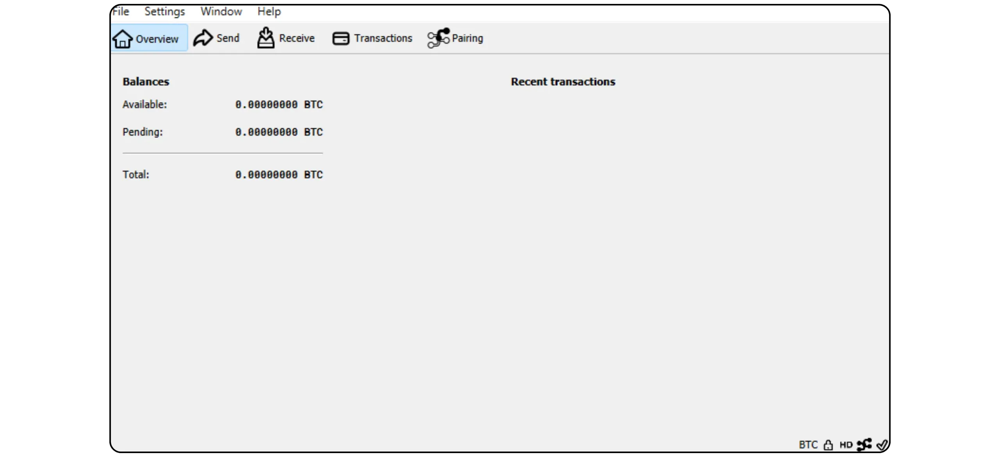
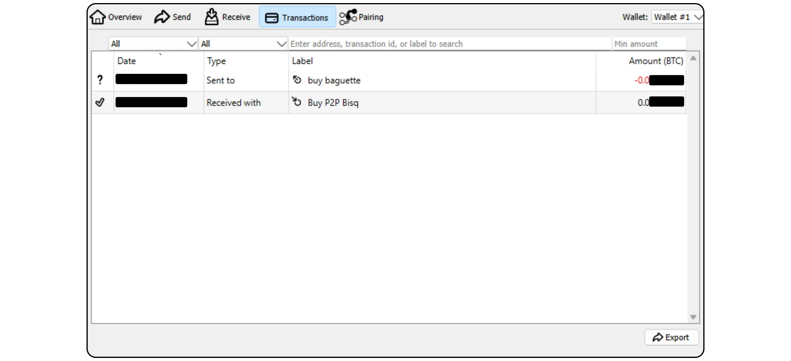

Bitcoin Knots ist eine alternative Implementierung des Bitcoin Protokolls, abgeleitet von Bitcoin Core. Entwickelt und gepflegt von Luke Dashjr, bietet es einige zusätzliche Funktionen und Regelanpassungen von Mempool, während es mit anderen Knoten im Netzwerk kompatibel bleibt. Bitcoin Knots integriert einen Bitcoin Wallet, kann aber auch als einfacher Bitcoin-Knoten neben anderer Wallet-Software verwendet werden.

## Warum Knoten und nicht Kern verwenden?

Derzeit ist Core die Hauptimplementierung des Bitcoin-Protokolls im Netz. Das Bitcoin-Protokoll ist nur ein Satz von Regeln. Es erfordert Software, um sie anzuwenden. Ein Rechner, auf dem Software zur Implementierung des Bitcoin-Protokolls läuft, wird als Knoten bezeichnet, und alle diese Knoten zusammen bilden das Bitcoin-Netz.

Im Laufe der Geschichte von Bitcoin sind zahlreiche Clients entstanden, die von der ursprünglichen, von Satoshi Nakamoto entwickelten Software abgeleitet sind. Heute (März 2025) ist Bitcoin Core die überwältigende Mehrheit, wobei fast 98 % der Knoten im Bitcoin-Netzwerk diesen Client verwenden.

Es ist jedoch auch eine alternative Software verfügbar. Dabei handelt es sich nicht um Altcoin-verknüpfte Knoten wie Bitcoin Cash, sondern um alternative Clients, die mit dem echten Bitcoin-Netz kompatibel sind. Von diesen ist Bitcoin Knots die bekannteste. Er macht derzeit etwa 1,4 % des Netzes aus. Andere alternative Kunden sind noch sehr in der Minderheit.


Es gibt zwei Hauptgründe für die Verwendung eines alternativen Clients wie Knots anstelle von Core:


- Technisch**: Diese Clients bieten Core oft verschiedene Optionen, insbesondere in Bezug auf die Mempool-Verwaltung, indem sie festlegen, welche Transaktionen von Ihrem Knoten akzeptiert und übertragen werden.
- Politik**: Einige Leute ziehen es vor, alternative Clients wie Knots aus nicht-technischen Gründen zu verwenden, vor allem um eine Alternative zu Core zu unterstützen und damit dessen Monopol zu verringern. Sollte Core jemals kompromittiert werden, wäre es nicht nur nützlich, solide, gut gewartete alternative Clients zu haben, sondern auch zu wissen, wie man sie benutzt. Andere verwenden Knots aus Protest, weil sie das Vertrauen in die Core-Entwickler verloren haben oder mit der Verwaltung des Hauptclients nicht einverstanden sind.

## Wie installiere ich Bitcoin-Knoten?

Gehen Sie auf [die offizielle Bitcoin-Knoten-Website] (https://bitcoinknots.org/#download), um die Version für Ihr Betriebssystem herunterzuladen. Vergessen Sie nicht, den Fingerabdruck und die Signaturen herunterzuladen, um die Software zu verifizieren. Diese Dateien sind auch [im Bitcoin Knots GitHub Repository](https://github.com/bitcoinknots/Bitcoin) verfügbar.


Bevor Sie die Software auf Ihrem Computer installieren, empfehlen wir Ihnen dringend, ihre Authentizität und Integrität zu überprüfen. Wenn Sie nicht wissen, wie das geht, schauen Sie sich diese andere Anleitung an:

https://planb.network/tutorials/computer-security/data/integrity-authenticity-21d0420a-be02-4663-94a3-8d487f23becc
Sobald die Software überprüft wurde, installieren Sie sie, indem Sie die im Installationsfenster angegebenen Schritte ausführen.


## IBD einführen

Wenn Sie Bitcoin Knots zum ersten Mal starten, können Sie das lokale Verzeichnis auswählen, in dem Ihre Knotendaten (einschließlich Blockchain, UTXO Set und Parameter) gespeichert werden.


Sie können die Blockchain-Daten auch so beschneiden, dass nur die jüngsten Blöcke erhalten bleiben. Mit dieser Option kann Ihr Knoten jeden Block innerhalb eines festgelegten Speicherplatzlimits vollständig prüfen und so nach und nach die ältesten Blöcke entfernen. Wenn Sie über ausreichend Speicherplatz verfügen (derzeit etwa 650 GB, aber diese Zahl wächst), lassen Sie diese Option deaktiviert. Wenn Ihr Speicherplatz begrenzt ist, aktivieren Sie Pruning und geben Sie die maximal zulässige Kapazität an.

Bitte beachten Sie: Wenn Ihr Knoten beschnitten wird und Sie ihn zur Synchronisierung eines wiederhergestellten Wallet verwenden, können Sie keine Transaktionen vor dem ältesten lokal gespeicherten Block abrufen.


Eine weitere verfügbare Option ist "*Gültig annehmen*". Sie beschleunigt die anfängliche Synchronisierung, indem sie die Signaturprüfung für Transaktionen überspringt, die in Blöcken vor einem bestimmten Block enthalten sind.

Das Ziel von "*Assume Valid*" ist es, die erste Synchronisation des Knotens zu beschleunigen, ohne die Sicherheit signifikant zu reduzieren, indem man annimmt, dass diese Transaktionen bereits vorher massiv vom Netzwerk validiert wurden. Der einzige wichtige Kompromiss ist, dass Ihr Knoten keine früheren Bitcoin-Diebstähle erkennt, aber dennoch die Genauigkeit der Gesamtzahl der ausgegebenen Bitcoins garantiert. Ihr Knoten wird alle Transaktionssignaturen nach dem angegebenen Block überprüfen. Dieser Ansatz beruht auf der Annahme, dass eine Transaktion, die vom Netzwerk lange Zeit ohne Anfechtung akzeptiert wurde, höchstwahrscheinlich gültig ist.

Zum Beispiel ist hier "*Gültig annehmen*" auf Block Nr. eingestellt. 855 000 `00000000000000000000000233ea80aa10d38aa4486cd7033fffc2c4df556d0b9138`, veröffentlicht am 1. August 2024. Während der IBD wird mein Knoten daher erst ab diesem Block mit der vollständigen Signaturprüfung beginnen.


Klicken Sie dann auf die Schaltfläche "*OK*", um den *Initial Block Download* zu starten. Während der anfänglichen Knotensynchronisierung müssen Sie etwas Geduld haben. Wenn Sie die Synchronisierung später fortsetzen möchten, schließen Sie einfach die Software und schalten Sie Ihren Computer aus. Wenn Sie das Programm das nächste Mal öffnen, wird die Synchronisierung ohne Probleme fortgesetzt.


## Einrichten des Bitcoin-Knotens

Klicken Sie auf die Registerkarte "*Einstellungen*" und wählen Sie dann "*Optionen*".


Auf der Registerkarte "*Haupt*" haben Sie Zugriff auf die wichtigsten Parameter des Knotens:


- mit "*Start...*" wird der Knoten automatisch gestartet, wenn Ihr Computer hochfährt, um sofort mit der Synchronisierung zu beginnen;
- mit "*Prune...*" wird die Speichergrenze angepasst, wenn Sie den Blockchain beschneiden möchten;
- "*Datenbank-Cache...*" legt die maximale Menge an RAM fest, die für Ihren Knoten zulässig ist;
- Aktivieren Sie schließlich "*RPC-Server aktivieren*", wenn Sie Ihren Bitcoin-Knoten mit einer anderen Portfoliosoftware verbinden möchten, wie z. B. Sparrow Wallet oder Liana.


Auf der Registerkarte "*Wallet*" finden Sie die Einstellungen für das integrierte Portfolio, das Sie später auf Knots erstellen können. Ich empfehle Ihnen, RBF und die Münzkontrolle zu aktivieren. Sie können auch die Art des zu verwendenden Skripts festlegen.


Die Registerkarte "*Netzwerk*" enthält Netzwerkparameter, die Sie an Ihre speziellen Bedürfnisse anpassen können.


Auf der Registerkarte "*Mempool*" können Sie den *Speicherpool* konfigurieren, d. h. die Verwaltung der unbestätigten Transaktionen, die im Speicher abgelegt werden, und die maximale Größe, die dieser Funktion zugewiesen wird (standardmäßig 300 MB).


Die Registerkarte "Spamfilterung" ist eine Funktion von Bitcoin Knots. Hier finden Sie eine Reihe von Einstellungen, mit denen Sie auswählen können, welche Transaktionen Sie akzeptieren oder nicht übertragen wollen. Das Hauptziel besteht darin, bestimmte marginale Verwendungen von Bitcoin, insbesondere Meta-Protokolle, zu begrenzen, um diese Praktiken zu bekämpfen und gleichzeitig eine Überlastung Ihres Knotens zu vermeiden. Es ist eine politische Entscheidung, abhängig von Ihrer persönlichen Vision von Bitcoin.

Hier finden Sie auch klassische Parameter wie die Definition des Schwellenwerts "*Dust*".

Diese Parameter beeinflussen jedoch nur die Standardisierungsregeln. Ihr Knoten wird weiterhin unbestätigte Transaktionen nur akzeptieren, wenn sie in einem Block enthalten sind, um mit dem Rest des Bitcoin-Netzwerks kompatibel zu bleiben. Diese Einstellungen ändern nur die Art und Weise, wie Ihr Knoten unbestätigte Transaktionen verarbeitet und an seine Peers verteilt. Da Knots in der Minderheit ist, sind es in der Praxis die Regeln, die standardmäßig auf dem Bitcoin Core festgelegt sind, die die Standardisierung des Netzes definieren.


Auf der Registerkarte "*Mining*" können Sie die mögliche Teilnahme Ihres Knotens an Mining konfigurieren, wenn Sie diese Funktion aktivieren möchten.


Die Registerkarte "*Display*" schließlich betrifft Parameter, die sich auf die Interface-Grafik beziehen, darunter die Software-Sprache.


## Erstellung eines Bitcoin-Portfolios

Sobald die anfängliche Synchronisierung abgeschlossen ist, ist Ihr Bitcoin-Knoten voll funktionsfähig. Sie haben nun die Möglichkeit, diesen Knoten mit anderer Wallet Software zu verbinden oder den eingebauten Hot Wallet direkt zu verwenden. Klicken Sie dazu auf die Schaltfläche "*Erstelle einen neuen Wallet*".


Geben Sie Ihrem Wallet einen Namen. Sie können ihn auch mit einem passphrase BIP39 schützen, indem Sie auf "*Wallet verschlüsseln*" klicken. Sobald Sie fertig sind, klicken Sie auf die Schaltfläche "*Erstellen*".


Das passphrase BIP39 ist ein optionales Passwort, das Sie frei wählen können, zusätzlich zu Ihrer Mnemonic Phrase, um die Sicherheit Ihres Wallet zu erhöhen. Bevor Sie diese Funktion konfigurieren, empfehlen wir Ihnen dringend, den folgenden Artikel zu lesen, der detailliert erklärt, wie das passphrase theoretisch funktioniert und wie Sie Fehler vermeiden können, die zum dauerhaften Verlust Ihrer Bitcoins führen könnten:

https://planb.network/tutorials/wallet/backup/passphrase-a26a0220-806c-44b4-af14-bafdeb1adce7
Wenn Sie die Option passphrase aktiviert haben, wählen Sie eine robuste Option und speichern Sie sie sorgfältig auf einem oder mehreren sicheren physischen Medien.


Ihr Bitcoin-Portfolio ist nun erstellt.



## Sichern Sie Ihr Bitcoin-Portfolio

Noch bevor Sie Ihre ersten Bitcoins erhalten, sollten Sie unbedingt eine Sicherungskopie Ihres Bitcoin Wallet erstellen, damit Sie Ihre Gelder im Falle eines Verlusts oder Computerausfalls wiederherstellen können. Klicken Sie dazu auf die Registerkarte "*Datei*" und dann auf "*Backup Wallet*".


Bei diesem Vorgang wird eine einzige Datei erzeugt, mit der Sie alle Ihre Bitcoins wiederherstellen können. Seien Sie also sehr vorsichtig und speichern Sie sie auf einem sicheren externen Medium.

## Bitcoins erhalten

Um Bitcoins direkt auf Ihren Knots Wallet zu erhalten, klicken Sie auf die Schaltfläche "*Empfangen*".


Weisen Sie Ihrem Address ein "*Label*" zu, um seinen Zweck leicht zu identifizieren und die zukünftige Verwendung von *Coin Control* zu erleichtern. Sie können auch im Voraus einen genauen Betrag festlegen, der an diesem Address empfangen werden soll, oder eine Nachricht für den Zahler hinzufügen. Sobald Sie die Parameter festgelegt haben, klicken Sie auf "*Zahlung anfordern*".


Bitcoin Knoten zeigt dann einen Empfangs-Address an, den Sie kopieren oder einscannen und an den Zahlungspflichtigen senden können.


Sobald eine Transaktion übertragen wurde, können Sie ihren Status direkt im Menü "*Transaktionen*" verfolgen.


## Bitcoins senden

Jetzt, wo Sie Bitcoins in Ihrem Knots Wallet haben, können Sie sie versenden. Klicken Sie dazu auf die Schaltfläche "*Senden*".


Klicken Sie auf die Schaltfläche "*Eingaben...*", um die genauen UTXO auszuwählen, die Sie für diese Transaktion ausgeben möchten.


Geben Sie die Bitcoin Address des Empfängers ein.


Fügen Sie ein Etikett hinzu, um sich an den Zweck dieser Transaktion zu erinnern.


Geben Sie den Betrag ein, den Sie an diese Address senden möchten.


Klicken Sie auf die Schaltfläche "*Auswählen...*", um den passenden Gebührensatz für Ihre Transaktion auszuwählen, der auf dem aktuellen Netzwerkstatus basiert.


Wenn alles zu Ihrer Zufriedenheit ist, klicken Sie auf die Schaltfläche "*Senden*". Wenn Sie einen passphrase verwenden, werden Sie aufgefordert, diesen jetzt auszufüllen.


Überprüfen Sie ein letztes Mal Ihre Transaktionsparameter und klicken Sie dann, wenn alles korrekt ist, erneut auf die Schaltfläche "*Senden*", um Ihre Transaktion zu unterzeichnen und zu verteilen.


Ihre zu bestätigende Transaktion erscheint nun auf der Registerkarte "*Transaktionen*".



## Verbinden Ihres Knotens mit einem anderen Programm

Das in Bitcoin Knots integrierte Interface zur Verwaltung Ihres Bitcoin-Portfolios ist nicht unbedingt das intuitivste, und seine Funktionalität bleibt relativ begrenzt. Sie können jedoch Ihren Bitcoin-Knoten mit einer speziellen Portfoliomanagement-Software verbinden, um einfach auf Blockchain-Bitcoin-Daten zuzugreifen und Ihre Transaktionen zu übertragen.

Die Vorgehensweise hängt von der verwendeten Software ab, aber es gibt zwei Hauptszenarien: Entweder wird Bitcoin Knots auf demselben Computer wie Ihre Portfoliosoftware installiert oder es läuft auf einem separaten Rechner.

### Mit lokalen Bitcoin-Knoten :

Wenn Bitcoin Knots auf Ihrem Computer installiert ist, suchen Sie die Datei `Bitcoin.conf` unter den Softwaredateien. Wenn diese Datei nicht vorhanden ist, können Sie sie erstellen. Öffnen Sie sie mit einem Texteditor und fügen Sie die folgende Zeile ein:

```ini
server=1
```

Speichern Sie dann Ihre Änderungen.

Sie können dies auch über die Interface-Grafik von Bitcoin-QT tun, indem Sie zu "*Einstellungen*" navigieren > "*Optionen...*" navigieren und die Option "*RPC-Server aktivieren*" aktivieren.

Vergessen Sie nicht, die Software neu zu starten, nachdem Sie diese Änderungen vorgenommen haben.


Gehen Sie dann zu Ihrer Portfolioverwaltungssoftware (z. B. Sparrow Wallet oder Liana) und geben Sie den Pfad zu Ihrer Cookie-Datei ein, die sich je nach Betriebssystem normalerweise im selben Ordner wie die `Bitcoin.conf` befindet:

|**macOS**|~/Library/Application Support/Bitcoin|

|---|---|

|**Windows**|%APPDATA%\Bitcoin|

|**Linux**|~/.Bitcoin|


Lassen Sie die anderen Parameter wie vorgegeben, URL `127.0.0.1` und Port `8332`, und klicken Sie dann auf "*Verbindung testen*".


### Mit ferngesteuerten Bitcoin-Knoten :

Wenn Bitcoin Knots auf einem anderen Rechner installiert ist, der mit demselben Netzwerk verbunden ist, suchen Sie zunächst die Datei `Bitcoin.conf` unter den Softwaredateien. Wenn diese Datei noch nicht vorhanden ist, können Sie sie erstellen. Öffnen Sie diese Datei mit einem Texteditor und fügen Sie die folgende Zeile ein:

```ini
server=1
```

Nachdem Sie die Datei bearbeitet haben, speichern Sie sie im entsprechenden Ordner Ihres Betriebssystems:

|**macOS**|~/Library/Application Support/Bitcoin|

|---|---|

|**Windows**|%APPDATA%\Bitcoin|

|**Linux**|~/.Bitcoin|

Dieser Vorgang kann auch über die Interface-Grafik des Bitcoin-QT durchgeführt werden. Gehen Sie in das Menü "*Einstellungen*", dann "*Optionen...*", und aktivieren Sie die Option "*RPC-Server aktivieren*", indem Sie das entsprechende Kästchen anklicken. Wenn die Datei `Bitcoin.conf` nicht existiert, können Sie sie direkt von diesem Interface aus erstellen, indem Sie auf "*Open Configuration File*" klicken.


Finden Sie die IP Address des Rechners, der Bitcoin Knots in Ihrem lokalen Netzwerk hostet. Dazu können Sie ein Tool wie [Angry IP Scanner](https://angryip.org/) verwenden. Nehmen wir an, dass die IP Address Ihres Knotens "192.168.1.18" lautet.

Fügen Sie in der Datei `Bitcoin.conf` die folgenden Zeilen hinzu und setzen Sie `rpcbind=192.168.1.18` so, dass es der IP Address Ihres Knotens entspricht.

```ini
[main]
rpcbind=127.0.0.1
rpcbind=192.168.1.18
rpcallowip=127.0.0.1
rpcallowip=192.168.1.0/24
```


Fügen Sie auch einen Benutzernamen und ein Passwort für Fernverbindungen in die Datei `Bitcoin.conf` ein. Ersetzen Sie `loic` durch Ihren Benutzernamen und `my_password` durch ein sicheres Passwort:

```ini
rpcuser=loic
rpcpassword=my_password
```


Nachdem Sie die Datei geändert und gespeichert haben, starten Sie Bitcoin Knots erneut.

Sie können nun zu Ihrer Portfolioverwaltungssoftware (z. B. Sparrow Wallet oder Liana) gehen. Gehen Sie in Sparrow auf die Registerkarte "*Benutzer/Pass*". Geben Sie den Benutzernamen und das Kennwort ein, die Sie in der Datei `Bitcoin.conf` konfiguriert haben. Belassen Sie die anderen Parameter als Standard, d.h. URL `127.0.0.1` und Port `8332`. Klicken Sie dann auf "*Verbindung testen*".


Die Verbindung wird hergestellt.

Jetzt wissen Sie alles über die alternative Implementierung der Bitcoin-Knoten.

Wenn Sie dieses Tutorial nützlich fanden, wäre ich Ihnen sehr dankbar, wenn Sie unten einen Green-Daumen hinterlassen würden. Sie können es auch gerne in Ihren sozialen Netzwerken teilen. Ich danke Ihnen sehr!

Ich empfehle auch dieses andere Tutorial, in dem ich erkläre, wie man einen eigenen Lightning-Knoten einrichtet:

https://planb.network/tutorials/node/lightning-network/alby-hub-62e6356c-6a6d-4134-8f22-c3b6afb9882a