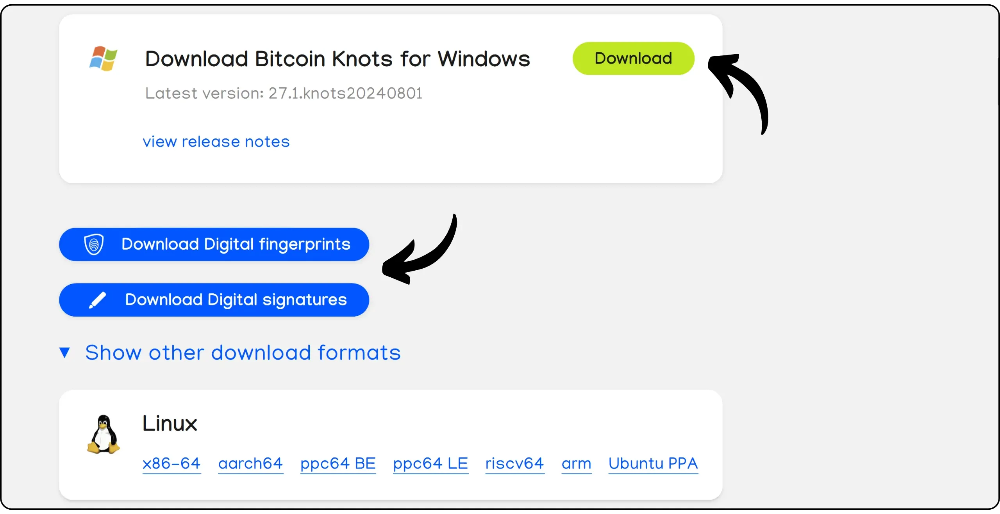
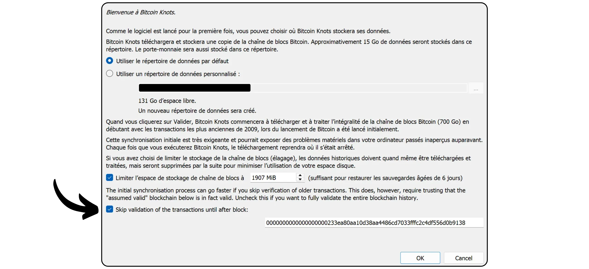
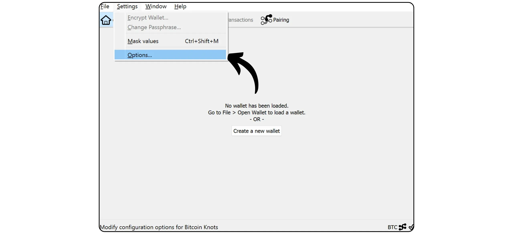

Bitcoin Knots is an alternative implementation of the Bitcoin protocol, derived from Bitcoin Core. Designed and maintained by Luke Dashjr, it offers some additional features and rule adjustments from Mempool, while remaining compatible with other nodes on the network. Bitcoin Knots integrates a Bitcoin wallet, but can also be used as a simple Bitcoin node alongside other wallet software.

## Why use Knots rather than Core?

Currently, Core is the majority implementation of the Bitcoin protocol on the network. The Bitcoin protocol is just a set of rules. It requires software to apply them. A machine running software implementing the Bitcoin protocol is called a node, and all these nodes together make up the Bitcoin network.

Throughout Bitcoin's history, numerous clients derived from the initial software developed by Satoshi Nakamoto have emerged. Today (March 2025), Bitcoin Core is the overwhelming majority, with almost 98% of nodes on the Bitcoin network using this client.

However, alternative software is also available. These are not altcoin-linked nodes like Bitcoin Cash, but alternative clients compatible with the real Bitcoin network. Of these, Bitcoin Knots is the best known. It currently represents around 1.4% of the network. Other alternative customers are still very much in the minority.


There are two main reasons to use an alternative client like Knots instead of Core:


- Technical**: These clients often offer different options to Core, notably in terms of Mempool management, by determining which transactions are accepted and broadcast by your node.
- Policy**: Some people prefer to use alternative clients such as Knots for non-technical reasons, notably to support an alternative to Core and thus reduce its monopoly. If Core were ever compromised, it would be useful not only to have solid, well-maintained alternative clients, but also to know how to use them. Others use Knots for protest purposes, because they have lost confidence in Core's developers or disapprove of the majority client's management.

## How do I install Bitcoin Knots?

Go to [the official Bitcoin Knots website](https://bitcoinknots.org/#download) to download the version for your operating system. Don't forget to download the fingerprint and signatures to verify the software. These files are also available [on the Bitcoin Knots GitHub repository](https://github.com/bitcoinknots/Bitcoin).



Before installing the software on your machine, we strongly recommend that you check its authenticity and integrity. If you don't know how, have a look at this other tutorial:

https://planb.network/tutorials/computer-security/data/integrity-authenticity-21d0420a-be02-4663-94a3-8d487f23becc
Once the software has been verified, install it by following the steps indicated in the installation panel.


## Launch IBD

The first time you launch Bitcoin Knots, you'll be able to choose the local directory where your node data (including Blockchain, UTXO set and parameters) will be stored.


You can also choose to prune the Blockchain data to retain only the most recent blocks. This option allows your node to check each block in its entirety within a set storage limit, thus gradually removing the oldest blocks. If you have sufficient disk space (currently around 650 GB, but this number is growing), leave this option unchecked. If your disk space is limited, activate pruning and specify the maximum capacity allowed.

Please note: If your node is pruned and you use it to synchronize a recovered wallet, you won't be able to retrieve transactions prior to the oldest locally stored block.


Another available option is "*Assume Valid*". It speeds up initial synchronization by skipping signature verification for transactions included in blocks prior to a specific block.

The aim of "*Assume Valid*" is to speed up the node's first synchronization without significantly reducing security, by assuming that these transactions have already been massively validated by the network beforehand. The only important compromise is that your node will not detect any previous bitcoin thefts, but it will still guarantee the accuracy of the total number of bitcoins issued. Your node will verify all transaction signatures after the specified block. This approach is based on the assumption that a transaction that has long been accepted by the network without challenge is most likely valid.

For example, here, "*Assume Valid*" is set to block no. 855 000 `00000000000000000000000233ea80aa10d38aa4486cd7033fffc2c4df556d0b9138`, published on August 1, 2024. During IBD, my node will therefore only start full signature verification from this block.



Then click on the "*OK*" button to launch *Initial Block Download*. You'll need to be patient during the initial node synchronization. If you wish to resume synchronization later, simply close the software and switch off your computer. Synchronization will resume without a hitch the next time you open the program.


## Setting up your Bitcoin Knot

Click on the "*Settings*" tab, then select "*Options*".



In the "*Main*" tab, you access the node's main parameters:


- "*Start...*" automatically launches the node when your computer starts up to begin synchronization immediately;
- "*Prune...*" adjusts the storage limit if you have chosen to prune the Blockchain ;
- "*Database cache...*" sets the maximum amount of RAM allowed to your node;
- Finally, activate "*Enable RPC server*" if you wish to connect your Bitcoin Knots node to other portfolio software, such as Sparrow Wallet or Liana for example.


In the "*Wallet*" tab, you'll find the settings for the integrated portfolio you can create later on Knots. I recommend that you activate RBF and coin control. You can also define the type of script to be used.


The "*Network*" tab contains network parameters that you can adapt to your specific needs.


The "*Mempool*" tab lets you configure the *Memory Pool*, i.e. the management of unconfirmed transactions stored in memory, and the maximum size allocated to this functionality (300 MB by default).


The "Spam filtering" tab is a Bitcoin Knots feature. Here you'll find a number of settings that allow you to choose which transactions you'll accept or refuse to broadcast. The main objective is to limit certain marginal uses of Bitcoin, in particular meta-protocols, in order to combat these practices while avoiding overloading your node. It's a political choice, depending on your personal vision of Bitcoin.

You'll also find classic parameters such as the definition of the "*Dust*" threshold.

However, these parameters only influence the standardization rules. Your node will continue to accept unconfirmed transactions only when they are included in a block, in order to remain compatible with the rest of the Bitcoin network. These settings only modify the way your node processes and distributes unconfirmed transactions to its peers. In practice, as Knots is in the minority, it is the rules established by default on Bitcoin Core that define standardization on the network.


The "*Mining*" tab lets you configure your node's possible participation in mining, if you wish to activate this function.


Finally, the "*Display*" tab concerns parameters relating to the Interface graphics, including the software language.


## Creating a Bitcoin portfolio

Once the initial synchronization is complete, your Bitcoin Knots node is fully functional. You now have the option of connecting this node to other wallet software, or using the built-in hot wallet directly. To do so, click on the "*Create a new Wallet*" button.


Give your wallet a name. You can also protect it with a passphrase BIP39 by clicking on "*Encrypt Wallet*". Once ready, click on the "*Create*" button.


The passphrase BIP39 is an optional password that you can choose freely, in addition to your mnemonic phrase, to increase the security of your wallet. Before configuring this feature, we strongly advise you to read the following article, which explains in detail how the passphrase works in theory, and how to avoid mistakes that could lead to the permanent loss of your bitcoins:

https://planb.network/tutorials/wallet/backup/passphrase-a26a0220-806c-44b4-af14-bafdeb1adce7
If you have activated the passphrase option, choose a robust one and save it carefully on one or more secure physical media.


Your Bitcoin portfolio is now created.


## Backing up your Bitcoin portfolio

Even before you receive your first bitcoins, it's essential to make a backup of your Bitcoin wallet so that you can recover your funds in the event of loss or computer failure. To do this, click on the "*File*" tab and then on "*Backup Wallet*".


This operation generates a single file that can be used to restore all your bitcoins. So be very careful, and save it on a secure external medium.

## Receive bitcoins

To receive bitcoins directly to your Knots wallet, click on the "*Receive*" button.


Assign a "*Label*" to your address to easily identify its purpose and facilitate future use of *Coin Control*. You can also define in advance a precise amount to be received at this address, or add a message for the payer. Once you've set the parameters, click on "*Request payment*".


Bitcoin Knots then displays a receiving address, which you can copy or scan and send to the payer.


Once a transaction has been broadcast, you can follow its status directly in the "*Transactions*" menu.


## Send bitcoins

Now that you have bitcoins in your Knots wallet, you can send them. To do so, click on the "*Send*" button.


Click on the "*Inputs...*" button to select the exact UTXO you wish to spend on this transaction.


Enter the recipient's Bitcoin address.


Add a label to remember the purpose of this transaction.


Enter the amount you wish to send to this address.


Click on the "*Choose...*" button to select the appropriate fee rate for your transaction, based on the current network status.


If everything is to your satisfaction, click on the "*Send*" button. If you're using a passphrase, you'll be asked to fill it in at this stage.


Check your transaction parameters one last time, then, if everything is correct, click the "*Send*" button again to sign and distribute your transaction.


Your transaction awaiting confirmation now appears in the "*Transactions*" tab.


## Connecting your node to another program

Bitcoin Knots' integrated Interface for managing your Bitcoin portfolio is not necessarily the most intuitive, and its functionality remains relatively limited. However, you can connect your Bitcoin Knots node to specialized portfolio management software to easily access Blockchain Bitcoin data and broadcast your transactions.

The procedure will depend on the software used, but there are two main scenarios: either Bitcoin Knots is installed on the same computer as your portfolio software, or it runs on a separate machine.

### With local Bitcoin Knots :

If Bitcoin Knots is installed on your computer, locate the file `Bitcoin.conf` among the software files. If this file doesn't exist, you can create it. Open it with a text editor and insert the following line:

```ini
server=1
```

Then save your changes.

You can also do this via Bitcoin-QT's Interface graphic by navigating to "*Settings*" > "*Options...*" and enabling the "*Enable RPC server*" option.

Don't forget to restart the software after making these changes.


Then go to your portfolio management software (e.g. Sparrow Wallet or Liana) and enter the path to your cookie file, usually located in the same folder as the `Bitcoin.conf`, depending on your operating system:

|**macOS**|~/Library/Application Support/Bitcoin|

|---|---|

|**Windows**|%APPDATA%\Bitcoin|

|**Linux**|~/.Bitcoin|


Leave the other parameters as default, URL `127.0.0.1` and port `8332`, then click on "*Test Connection*".


### With remote Bitcoin Knots :

If Bitcoin Knots is installed on another machine connected to the same network, first locate the `Bitcoin.conf` file among the software files. If this file does not yet exist, you can create it. Open this file with a text editor and add the following line:

```ini
server=1
```

After editing the file, make sure you save it in the appropriate folder for your operating system:

|**macOS**|~/Library/Application Support/Bitcoin|

|---|---|

|**Windows**|%APPDATA%\Bitcoin|

|**Linux**|~/.Bitcoin|

This operation can also be performed via Bitcoin-QT's Interface graphics. Go to the "*Settings*" menu, then "*Options...*", and activate the "*Enable RPC server*" option by checking the corresponding box. If the `Bitcoin.conf` file doesn't exist, you can create it directly from this Interface by clicking on "*Open Configuration File*".


Find the IP address of the machine hosting Bitcoin Knots on your local network. To do this, you can use a tool such as [Angry IP Scanner](https://angryip.org/). Let's assume, for the sake of argument, that the IP address of your node is `192.168.1.18`.

In the `Bitcoin.conf` file, add the following lines, setting `rpcbind=192.168.1.18` to match the IP address of your node.

```ini
[main]
rpcbind=127.0.0.1
rpcbind=192.168.1.18
rpcallowip=127.0.0.1
rpcallowip=192.168.1.0/24
```


Also add a username and password for remote connections to the `Bitcoin.conf` file. Be sure to replace `loic` with your username and `my_password` with a strong password:

```ini
rpcuser=loic
rpcpassword=my_password
```


After modifying and saving the file, restart Bitcoin Knots.

You can now go to your portfolio management software (e.g. Sparrow Wallet or Liana). On Sparrow, go to the "*User / Pass*" tab. Enter the username and password you have configured in the `Bitcoin.conf` file. Leave the other parameters as default, i.e. URL `127.0.0.1` and port `8332`. Then click on "*Test Connection*".


The connection is established.

Now you know all about the alternative Bitcoin Knots implementation.

If you found this tutorial useful, I'd be very grateful if you'd leave a green thumb below. Feel free to share it on your social networks. Thank you very much!

I also recommend this other tutorial in which I explain how to set up your own Lightning node:

https://planb.network/tutorials/node/lightning-network/alby-hub-62e6356c-6a6d-4134-8f22-c3b6afb9882a