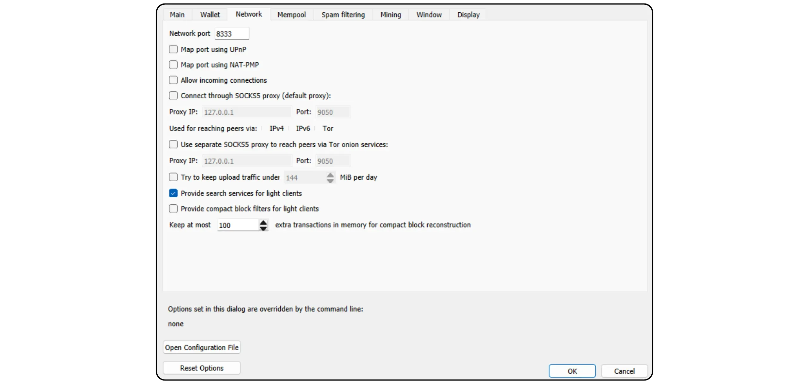
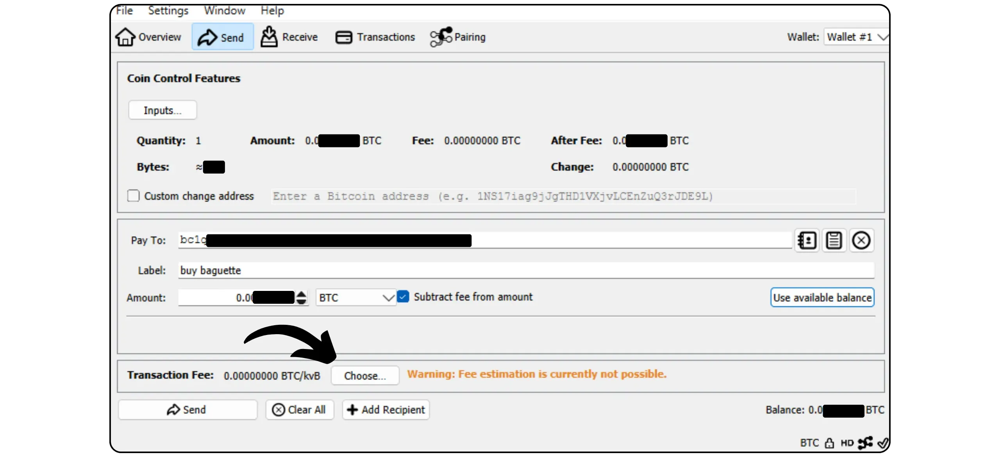

Bitcoin Knots es una implementación alternativa del protocolo Bitcoin, derivado de Bitcoin Core. Diseñado y mantenido por Luke Dashjr, ofrece algunas características adicionales y ajustes de reglas de Mempool, sin dejar de ser compatible con otros nodos de la red. Bitcoin Knots integra un Bitcoin Wallet, pero también puede ser usado como un simple nodo Bitcoin junto con otro software Wallet.

## ¿Por qué utilizar Nudos en lugar de Núcleo?

Actualmente, Core es la implementación mayoritaria del protocolo Bitcoin en la red. El protocolo Bitcoin es sólo un conjunto de reglas. Requiere un software que las aplique. Una máquina que ejecuta software que aplica el protocolo Bitcoin se llama nodo, y todos estos nodos juntos forman la red Bitcoin.

A lo largo de la historia de Bitcoin, han surgido numerosos clientes derivados del software inicial desarrollado por Satoshi Nakamoto. En la actualidad (marzo de 2025), Bitcoin Core es la abrumadora mayoría, con casi el 98% de los nodos de la red Bitcoin utilizando este cliente.

Sin embargo, también existe software alternativo. No se trata de nodos vinculados a Altcoin como Bitcoin Cash, sino de clientes alternativos compatibles con la red Bitcoin real. De ellos, Bitcoin Knots es el más conocido. Actualmente representa alrededor del 1,4% de la red. Otros clientes alternativos siguen siendo muy minoritarios.


Hay dos razones principales para utilizar un cliente alternativo como Knots en lugar de Core:


- Técnico**: Estos clientes suelen ofrecer diferentes opciones a Core, sobre todo en términos de gestión de Mempool, determinando qué transacciones son aceptadas y difundidas por su nodo.
- Política**: Algunas personas prefieren utilizar clientes alternativos como Knots por razones no técnicas, en particular para apoyar una alternativa a Core y reducir así su monopolio. Si alguna vez Core se viera comprometido, sería útil no sólo disponer de clientes alternativos sólidos y bien mantenidos, sino también saber cómo utilizarlos. Otros utilizan Nudos con fines de protesta, porque han perdido la confianza en los desarrolladores de Core o desaprueban la gestión del cliente mayoritario.

## ¿Cómo se instalan los nudos Bitcoin?

Visita [el sitio web oficial de Bitcoin Knots](https://bitcoinknots.org/#download) para descargar la versión para tu sistema operativo. No olvides descargar la huella digital y las firmas para verificar el software. Estos archivos también están disponibles [en el repositorio GitHub de Bitcoin Knots](https://github.com/bitcoinknots/Bitcoin).


Antes de instalar el software en su máquina, le recomendamos encarecidamente que compruebe su autenticidad e integridad. Si no sabes cómo, echa un vistazo a este otro tutorial:

https://planb.network/tutorials/computer-security/data/integrity-authenticity-21d0420a-be02-4663-94a3-8d487f23becc
Una vez verificado el software, instálelo siguiendo los pasos indicados en el panel de instalación.


## Lanzar IBD

La primera vez que inicies Nudos Bitcoin, podrás elegir el directorio local donde se almacenarán los datos de tus nodos (incluyendo Blockchain, UTXO set y parámetros).


También puedes elegir podar los datos de Blockchain para conservar sólo los bloques más recientes. Esta opción permite que su nodo compruebe cada bloque en su totalidad dentro de un límite de almacenamiento establecido, eliminando así gradualmente los bloques más antiguos. Si dispone de suficiente espacio en disco (actualmente unos 650 GB, pero esta cifra va en aumento), deje esta opción sin marcar. Si su espacio en disco es limitado, active la poda y especifique la capacidad máxima permitida.

Nota: Si tu nodo está podado y lo utilizas para sincronizar un Wallet recuperado, no podrás recuperar transacciones anteriores al bloque más antiguo almacenado localmente.


Otra opción disponible es "*Asumir válido*". Acelera la sincronización inicial al omitir la verificación de firma de las transacciones incluidas en bloques anteriores a un bloque específico.

El objetivo de "*Asumir Válido*" es acelerar la primera sincronización del nodo sin reducir significativamente la seguridad, asumiendo que estas transacciones ya han sido validadas masivamente por la red de antemano. El único compromiso importante es que tu nodo no detectará ningún robo previo de Bitcoin, pero seguirá garantizando la exactitud del número total de bitcoins emitidos. Su nodo verificará todas las firmas de transacciones después del bloque especificado. Este enfoque se basa en la suposición de que una transacción que ha sido aceptada por la red durante mucho tiempo sin impugnación es muy probablemente válida.

Por ejemplo, aquí, "*Assume Valid*" se establece en el bloque nº. 855 000 `00000000000000000000000233ea80aa10d38aa4486cd7033fffc2c4df556d0b9138`, publicado el 1 de agosto de 2024. Por lo tanto, durante el IBD, mi nodo sólo iniciará la verificación completa de la firma a partir de este bloque.


A continuación, haga clic en el botón "*OK*" para iniciar la *Descarga inicial de bloques*. Tendrá que ser paciente durante la sincronización inicial de nodos. Si desea reanudar la sincronización más tarde, sólo tiene que cerrar el software y apagar el ordenador. La sincronización se reanudará sin problemas la próxima vez que abra el programa.


## Configuración del nudo Bitcoin

Haz clic en la pestaña "*Configuración*" y selecciona "*Opciones*".


En la pestaña "*Main*" se accede a los parámetros principales del nodo:


- "*Iniciar...*" inicia automáticamente el nodo al arrancar el ordenador para comenzar la sincronización inmediatamente;
- "*Prune...*" ajusta el límite de almacenamiento si has elegido podar la Blockchain ;
- "*Caché de base de datos...*" establece la cantidad máxima de RAM permitida a tu nodo;
- Por último, active "*Habilitar servidor RPC*" si desea conectar su nodo Bitcoin Knots a otro software de cartera, como Sparrow Wallet o Liana, por ejemplo.


En la pestaña "*Wallet*" encontrarás la configuración de la cartera integrada que podrás crear más adelante en Nudos. Le recomiendo que active RBF y el control de monedas. También puedes definir el tipo de script a utilizar.


La pestaña "*Red*" contiene parámetros de red que puedes adaptar a tus necesidades específicas.



La pestaña "*Mempool*" permite configurar el *Memory Pool*, es decir, la gestión de las transacciones no confirmadas almacenadas en memoria, y el tamaño máximo asignado a esta funcionalidad (300 MB por defecto).


La pestaña "Filtrado de spam" es una función de Bitcoin Nudos. Aquí encontrará una serie de ajustes que le permitirán elegir qué transacciones aceptará o rechazará transmitir. El objetivo principal es limitar ciertos usos marginales de Bitcoin, en particular los metaprotocolos, para luchar contra estas prácticas evitando al mismo tiempo sobrecargar su nodo. Es una elección política, dependiendo de tu visión personal de Bitcoin.

También encontrará parámetros clásicos como la definición del umbral "*Dust*".

Sin embargo, estos parámetros sólo influyen en las reglas de normalización. Su nodo seguirá aceptando transacciones no confirmadas sólo cuando estén incluidas en un bloque, para seguir siendo compatible con el resto de la red Bitcoin. Estos parámetros sólo modifican la forma en que su nodo procesa y distribuye las transacciones no confirmadas a sus pares. En la práctica, como Knots es minoritario, son las reglas establecidas por defecto en Bitcoin Core las que definen la estandarización en la red.


La pestaña "*Mining*" le permite configurar la posible participación de su nodo en Mining, si desea activar esta función.


Por último, la pestaña "*Pantalla*" se refiere a los parámetros relativos a los gráficos de Interface, incluido el idioma del software.


## Crear una cartera Bitcoin

Una vez completada la sincronización inicial, su nodo de Nudos Bitcoin es totalmente funcional. Ahora tiene la opción de conectar este nodo a otro software Wallet, o utilizar directamente el Hot Wallet incorporado. Para ello, haga clic en el botón "*Crear una nueva Wallet*".


Dale un nombre a tu Wallet. También puedes protegerla con un BIP39 de passphrase haciendo clic en "*Encriptar Wallet*". Una vez listo, haz clic en el botón "*Crear*".


La passphrase BIP39 es una contraseña opcional que puedes elegir libremente, además de tu frase Mnemonic, para aumentar la seguridad de tu Wallet. Antes de configurar esta característica, le recomendamos encarecidamente que lea el siguiente artículo, que explica en detalle cómo funciona en teoría la passphrase, y cómo evitar errores que podrían conducir a la pérdida permanente de sus bitcoins:

https://planb.network/tutorials/wallet/backup/passphrase-a26a0220-806c-44b4-af14-bafdeb1adce7
Si has activado la opción passphrase, elige una robusta y guárdala cuidadosamente en uno o varios soportes físicos seguros.


Su cartera Bitcoin ya está creada.


## Copia de seguridad de su cartera Bitcoin

Incluso antes de recibir sus primeros bitcoins, es esencial hacer una copia de seguridad de su Bitcoin Wallet para poder recuperar sus fondos en caso de pérdida o fallo informático. Para ello, haga clic en la pestaña "*Archivo*" y luego en "*Copia de seguridad Wallet*".


Esta operación genera un único archivo que puede ser utilizado para restaurar todos tus bitcoins. Así que ten mucho cuidado y guárdalo en un medio externo seguro.

## Recibir bitcoins

Para recibir bitcoins directamente en su Wallet de Knots, haga clic en el botón "*Recibir*".


Asigne una "*etiqueta*" a su Address para identificar fácilmente su finalidad y facilitar el uso futuro de *Coin Control*. También puede definir de antemano una cantidad precisa a recibir en esta Address, o añadir un mensaje para el pagador. Una vez establecidos los parámetros, haga clic en "*Solicitar pago*".


Bitcoin Nudos muestra entonces un Address de recepción, que puede copiar o escanear y enviar al pagador.


Una vez emitida una transacción, puede seguir su estado directamente en el menú "*Transacciones*".


## Enviar bitcoins

Ahora que tienes bitcoins en tu Knots Wallet, puedes enviarlos. Para ello, haz clic en el botón "*Enviar*".


Pulse el botón "*Inputs...*" para seleccionar los UTXO exactos que desea gastar en esta transacción.


Introduzca el Bitcoin Address del destinatario.


Añada una etiqueta para recordar el propósito de esta transacción.


Introduzca el importe que desea enviar a este Address.


Haga clic en el botón "*Elegir...*" para seleccionar la tarifa adecuada para su transacción, en función del estado actual de la red.



Si todo es de tu agrado, pulsa el botón "*Enviar*". Si utiliza un passphrase, se le pedirá que lo rellene en esta fase.


Compruebe los parámetros de la transacción una última vez y, si todo es correcto, pulse de nuevo el botón "*Enviar*" para firmar y distribuir su transacción.


Su transacción pendiente de confirmación aparece ahora en la pestaña "*Transacciones*".


## Conectar el nodo a otro programa

Bitcoin Knots integrado para gestionar su cartera Bitcoin no es necesariamente el más intuitivo, y su funcionalidad sigue siendo relativamente limitada. Sin embargo, puede conectar su nodo Bitcoin Knots a un software especializado de gestión de carteras para acceder fácilmente a los datos de Blockchain Bitcoin y difundir sus transacciones.

El procedimiento dependerá del software utilizado, pero hay dos escenarios principales: o bien Bitcoin Knots se instala en el mismo ordenador que el software de su cartera, o bien se ejecuta en una máquina independiente.

### Con nudos locales Bitcoin :

Si Bitcoin Knots está instalado en su ordenador, localice el archivo `Bitcoin.conf` entre los archivos de software. Si este archivo no existe, puede crearlo. Ábralo con un editor de texto e inserte la siguiente línea:

```ini
server=1
```

A continuación, guarda los cambios.

También puede hacerlo a través del gráfico Interface de Bitcoin-QT navegando a "*Configuración*" > "*Opciones...*" y activando la opción "*Habilitar servidor RPC*".

No olvide reiniciar el programa después de realizar estos cambios.


A continuación, vaya a su software de gestión de carteras (por ejemplo, Sparrow Wallet o Liana) e introduzca la ruta a su archivo cookie, normalmente ubicado en la misma carpeta que el `Bitcoin.conf`, dependiendo de su sistema operativo:

|**macOS**|~/Library/Application Support/Bitcoin|

|---|---|

|**Windows**|%APPDATA%\Bitcoin|

|**Linux**|~/.Bitcoin|


Deje los demás parámetros por defecto, URL `127.0.0.1` y puerto `8332`, y haga clic en "*Test Connection*".


### Con mando a distancia Bitcoin Nudos :

Si Bitcoin Knots está instalado en otra máquina conectada a la misma red, localice primero el archivo `Bitcoin.conf` entre los archivos de software. Si este archivo aún no existe, puede crearlo. Abra este archivo con un editor de texto y añada la siguiente línea:

```ini
server=1
```

Después de editar el archivo, asegúrate de guardarlo en la carpeta adecuada para tu sistema operativo:

|**macOS**|~/Library/Application Support/Bitcoin|

|---|---|

|**Windows**|%APPDATA%\Bitcoin|

|**Linux**|~/.Bitcoin|

Esta operación también puede realizarse a través de los gráficos Interface de Bitcoin-QT. Vaya al menú "*Configuración*", luego a "*Opciones...*", y active la opción "*Habilitar servidor RPC*" marcando la casilla correspondiente. Si el archivo `Bitcoin.conf` no existe, puede crearlo directamente desde este Interface pulsando "*Abrir archivo de configuración*".


Encuentre la IP Address de la máquina que aloja Nudos Bitcoin en su red local. Para ello, puede utilizar una herramienta como [Angry IP Scanner](https://angryip.org/). Asumamos, por el bien del argumento, que la IP Address de tu nodo es `192.168.1.18`.

En el fichero `Bitcoin.conf`, añade las siguientes líneas, configurando `rpcbind=192.168.1.18` para que coincida con la IP Address de tu nodo.

```ini
[main]
rpcbind=127.0.0.1
rpcbind=192.168.1.18
rpcallowip=127.0.0.1
rpcallowip=192.168.1.0/24
```


Añada también un nombre de usuario y una contraseña para conexiones remotas al fichero `Bitcoin.conf`. Asegúrese de reemplazar `loic` con su nombre de usuario y `my_password` con una contraseña segura:

```ini
rpcuser=loic
rpcpassword=my_password
```


Después de modificar y guardar el archivo, reinicie Bitcoin Knots.

Ahora puede ir a su software de gestión de cartera (por ejemplo, Sparrow Wallet o Liana). En Sparrow, vaya a la pestaña "*User / Pass*". Introduzca el nombre de usuario y la contraseña que ha configurado en el archivo `Bitcoin.conf`. Deja el resto de parámetros por defecto, es decir, URL "127.0.0.1" y puerto "8332". A continuación, haz clic en "*Probar conexión*".


Se establece la conexión.

Ahora ya lo sabes todo sobre la implementación alternativa de los Nudos Bitcoin.

Si este tutorial te ha resultado útil, te agradecería que dejaras un pulgar Green a continuación. No dudes en compartirlo en tus redes sociales. Muchas gracias

También te recomiendo este otro tutorial en el que explico cómo configurar tu propio nodo Lightning:

https://planb.network/tutorials/node/lightning-network/alby-hub-62e6356c-6a6d-4134-8f22-c3b6afb9882a