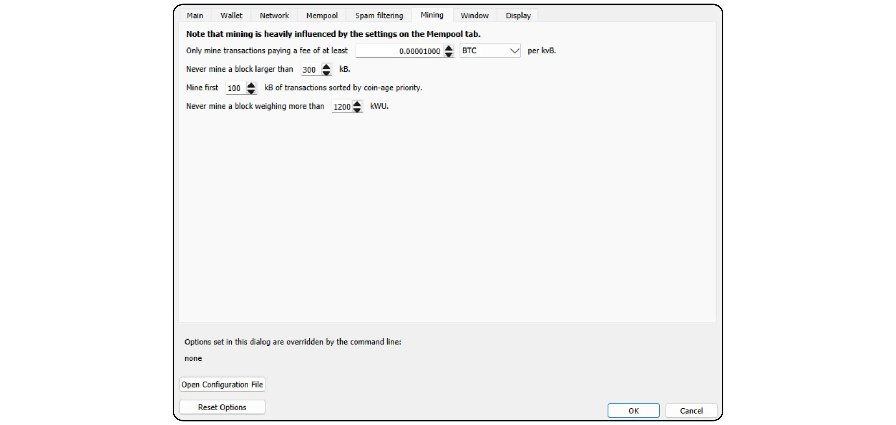
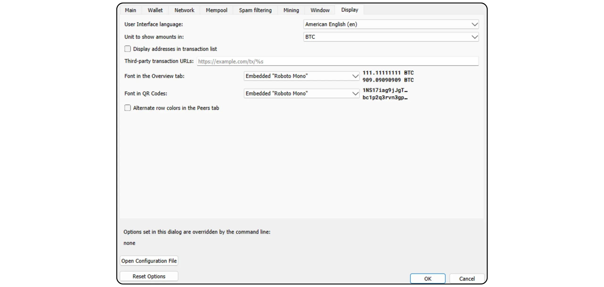

Bitcoin Knots on Bitcoin protokolli alternatiivne rakendus, mis on tuletatud Bitcoin Core'ist. See on loodud ja hooldatud Luke Dashjr'i poolt ning pakub mõningaid lisafunktsioone ja reeglite kohandamist Mempool-st, jäädes samas ühilduvaks teiste võrgus olevate sõlmedega. Bitcoin Knots integreerib Bitcoin Wallet, kuid seda saab kasutada ka lihtsa Bitcoin sõlmpunktina koos muu Wallet tarkvaraga.

## Miks kasutada pigem sõlmi kui südamikku?

Hetkel on põhisüsteem Bitcoin protokolli enamusrakendus võrgus. Bitcoin protokoll on lihtsalt reeglite kogum. Nende rakendamiseks on vaja tarkvara. Bitcoin protokolli rakendavat tarkvara kasutavat masinat nimetatakse sõlmpunktiks ja kõik need sõlmed koos moodustavad Bitcoin võrgu.

Bitcoin ajaloo jooksul on Satoshi Nakamoto poolt välja töötatud algsest tarkvarast tuletatud arvukalt kliente. Praegu (märts 2025) on Bitcoin Core ülekaalus, peaaegu 98% Bitcoin võrgu sõlmedest kasutab seda klienti.

Siiski on saadaval ka alternatiivne tarkvara. Need ei ole Altcoin-ga seotud sõlmed nagu Bitcoin Cash, vaid alternatiivsed kliendid, mis ühilduvad tõelise Bitcoin võrguga. Neist on kõige tuntum Bitcoin Knots. Praegu moodustab see umbes 1,4% võrgustikust. Muud alternatiivsed kliendid on veel väga vähemuses.


Core'i asemel on kaks peamist põhjust kasutada alternatiivset klienti, nagu Knots:


- Tehniline**: Need kliendid pakuvad Core'ile sageli erinevaid võimalusi, eelkõige Mempool haldamise osas, määrates kindlaks, milliseid tehinguid teie sõlmpunkt aktsepteerib ja edastab.
- Poliitika**: Mõned inimesed eelistavad kasutada alternatiivseid kliente, nagu Knots, mittetehnilistel põhjustel, eelkõige selleks, et toetada alternatiivi Core'ile ja seega vähendada selle monopoli. Kui Core peaks kunagi ohtu sattuma, oleks kasulik mitte ainult omada kindlaid, hästi hooldatud alternatiivseid kliente, vaid ka teada, kuidas neid kasutada. Teised kasutavad Knots'i protestiks, sest nad on kaotanud usalduse Core'i arendajate vastu või ei kiida heaks enamuse kliendi juhtimist.

## Kuidas paigaldada Bitcoin sõlme?

Mine [ametlikule Bitcoin Knots veebilehele](https://bitcoinknots.org/#download), et laadida alla oma operatsioonisüsteemi jaoks sobiv versioon. Ärge unustage tarkvara kontrollimiseks sõrmejälge ja allkirju alla laadida. Need failid on saadaval ka [Bitcoin Knots GitHubi repositooriumis](https://github.com/bitcoinknots/Bitcoin).


Enne tarkvara paigaldamist oma masinasse soovitame tungivalt kontrollida selle autentsust ja terviklikkust. Kui te ei tea, kuidas seda teha, vaadake seda teist õpetust:

https://planb.network/tutorials/computer-security/data/integrity-authenticity-21d0420a-be02-4663-94a3-8d487f23becc
Kui tarkvara on kontrollitud, installige see, järgides paigalduspaneelil näidatud samme.


## IBD käivitamine

Kui käivitate Bitcoin Knots'i esimest korda, saate valida kohaliku kataloogi, kuhu teie sõlme andmed (sh Blockchain, UTXO komplekt ja parameetrid) salvestatakse.


Võite valida ka Blockchain andmete kärpimise, et säilitada ainult kõige uuemad plokid. See valik võimaldab teie sõlme kontrollida iga plokki tervikuna määratud salvestuspiiri piires, eemaldades seega järk-järgult vanimad plokid. Kui teil on piisavalt kettaruumi (praegu umbes 650 GB, kuid see arv kasvab), jätke see valik märkimata. Kui teie kettaruum on piiratud, aktiveerige kärpimine ja määrake maksimaalne lubatud maht.

Pange tähele: Kui teie sõlme on kärbitud ja te kasutate seda taastatud Wallet sünkroniseerimiseks, ei saa te vanimale lokaalselt salvestatud plokile eelnevaid tehinguid välja otsida.


Teine võimalik valik on "*Võta kehtivaks*". See kiirendab esialgset sünkroniseerimist, jättes allkirjade kontrollimise vahele konkreetsele plokile eelnevates plokkides sisalduvate tehingute puhul.

Funktsiooni "*Võta kehtivaks*" eesmärk on kiirendada sõlme esimest sünkroniseerimist ilma turvalisust oluliselt vähendamata, eeldades, et need tehingud on võrgus juba eelnevalt massiliselt valideeritud. Ainus oluline kompromiss on see, et teie sõlme ei tuvasta eelnevaid Bitcoin vargusi, kuid see tagab siiski väljastatud bitcoinide koguarvu täpsuse. Teie sõlme kontrollib kõiki tehingu allkirju pärast määratud plokki. See lähenemisviis põhineb eeldusel, et tehing, mille võrk on pikka aega ilma vaidlustamiseta heaks kiitnud, on tõenäoliselt kehtiv.

Näiteks siin on "*Võta kehtivaks*" seatud blokki nr. 855 000 `000000000000000000000000000233ea80aa10d38aa4486cd7033fffc2c4df556d0b9138`, avaldatud 1. augustil 2024. IBD ajal alustab minu sõlmpunkt seega ainult sellest plokist täielikku allkirja kontrollimist.


Seejärel klõpsake nupule "*OK*", et käivitada *Initial Block Download*. Esialgse sõlme sünkroniseerimise ajal peate olema kannatlik. Kui soovite sünkroniseerimist hiljem jätkata, sulgege lihtsalt tarkvara ja lülitage arvuti välja. Sünkroniseerimine jätkub tõrgeteta, kui te programmi järgmine kord avate.


## Bitcoin sõlme seadistamine

Klõpsake vahekaardil "*Settings*", seejärel valige "*Options*".


Vahekaardil "*Main*" pääsete ligi sõlme peamistele parameetritele:


- "*Start...*" käivitab sõlme automaatselt arvuti käivitamisel, et alustada sünkroonimist kohe;
- "*Prune...*" kohandab salvestuspiirangut, kui olete valinud Blockchain kärpimise;
- "*Database cache...*" määrab teie sõlme maksimaalse lubatud RAM-i hulga;
- Lõpuks aktiveerige "*Enable RPC server*", kui soovite ühendada oma Bitcoin Knots-sõlme teise portfoolio tarkvaraga, näiteks Sparrow Wallet või Liana.


Vahekaardil "*Wallet*" leiate seaded integreeritud portfelli jaoks, mille saate hiljem luua Knotsi. Soovitan teil aktiveerida RBF ja mündikontroll. Samuti saate määrata kasutatava skripti tüübi.


Vahekaart "*Võrk*" sisaldab võrguparameetreid, mida saate kohandada vastavalt oma konkreetsetele vajadustele.


Vahekaardil "*Mempool*" saate konfigureerida *Mälupool*, st mällu salvestatud kinnitamata tehingute haldamist ja sellele funktsioonile eraldatud maksimaalset suurust (vaikimisi 300 MB).


"Rämpsposti filtreerimise" vahekaart on Bitcoin Knotsi funktsioon. Siit leiate mitmeid seadistusi, mis võimaldavad teil valida, milliseid tehinguid te aktsepteerite või keeldute edastamast. Peamine eesmärk on piirata Bitcoin teatud marginaalseid kasutusviise, eelkõige metaprotokolle, et võidelda nende tavade vastu, vältides samal ajal teie sõlme ülekoormamist. See on poliitiline valik, sõltuvalt teie isiklikust nägemusest Bitcoin-st.

Samuti leiate klassikalised parameetrid, nagu näiteks "*Dust*" künnise määratlus.

Need parameetrid mõjutavad siiski ainult standardimisreegleid. Teie sõlmpunkt jätkab kinnitamata tehingute vastuvõtmist ainult siis, kui need sisalduvad plokis, et jääda ühilduvaks ülejäänud Bitcoin võrguga. Need seaded muudavad ainult seda, kuidas teie sõlmpunkt töötleb ja jagab kinnitamata tehinguid oma eakaaslastele. Kuna Knots on praktikas vähemuses, on Bitcoin Core'ile vaikimisi kehtestatud reeglid need, mis määravad võrgu standardiseerimise.


Vahekaardil "*Mining*" saate konfigureerida oma sõlme võimalikku osalemist Mining-s, kui soovite selle funktsiooni aktiveerida.



Lõpuks on vahekaart "*Display*" seotud Interface graafikaga seotud parameetritega, sealhulgas tarkvara keelega.



## Bitcoin portfelli loomine

Kui esialgne sünkroniseerimine on lõpule viidud, on teie Bitcoin Knots-sõlm täielikult toimiv. Nüüd on teil võimalus ühendada see sõlmpunkt muu Wallet tarkvaraga või kasutada otse sisseehitatud Hot Wallet. Selleks klõpsake nuppu "*Loo uus Wallet*".


Andke oma Wallet-le nimi. Samuti saate seda kaitsta passphrase BIP39-ga, klõpsates "*Encrypt Wallet*". Kui olete valmis, klõpsake nupule "*Create*".


passphrase BIP39 on valikuline parool, mille saate vabalt valida lisaks Mnemonic fraasile, et suurendada Wallet turvalisust. Enne selle funktsiooni seadistamist soovitame tungivalt lugeda järgmist artiklit, mis selgitab üksikasjalikult, kuidas passphrase teoreetiliselt töötab ja kuidas vältida vigu, mis võivad põhjustada teie bitcoinide lõpliku kaotuse:

https://planb.network/tutorials/wallet/backup/passphrase-a26a0220-806c-44b4-af14-bafdeb1adce7
Kui olete aktiveerinud passphrase valiku, valige kindel valik ja salvestage see hoolikalt ühele või mitmele turvalisele füüsilisele andmekandjale.


Teie Bitcoin portfell on nüüd loodud.


## Bitcoin portfelli varundamine

Juba enne esimeste bitcoinide saamist on oluline teha oma Bitcoin Wallet varukoopia, et saaksite oma raha taastada kaotsimineku või arvutirikke korral. Selleks klõpsake vahekaardil "*Fail*" ja seejärel "*Backup Wallet*".


See toiming genereerib ühe faili, mida saab kasutada kõigi teie bitcoinide taastamiseks. Seega olge väga ettevaatlik ja salvestage see turvalisele välisele andmekandjale.

## Bitcoinide vastuvõtmine

Et saada bitcoine otse oma Knots Wallet-i, klõpsa nupule "*Vaata*".


Määrake oma Address-le "*Label*", et selle otstarve oleks hõlpsasti tuvastatav ja hõlbustaks *Coin Control* edaspidist kasutamist. Samuti saate eelnevalt määrata täpse summa, mis tuleb sellele Address-le vastu võtta, või lisada maksjale sõnumi. Kui olete parameetrid kindlaks määranud, klõpsake nuppu "*Request payment*".


Bitcoin Knots kuvab seejärel vastuvõtva Address, mille saate kopeerida või skaneerida ja maksjale saata.


Kui tehing on edastatud, saate selle staatust jälgida otse menüüst "*Tehingud*".


## Bitcoinide saatmine

Nüüd, kui teil on bitcoinid oma Knots Wallet-s, saate neid saata. Selleks klõpsake nupule "*Sendama*".


Vajutage nupule "*Sisendid...*", et valida täpne UTXO, mida soovite selle tehingu jaoks kulutada.


Sisestage saaja Bitcoin Address.


Lisage silt, et meeles pidada selle tehingu eesmärki.


Sisestage summa, mille soovite saata sellele Address-le.


Klõpsake nupule "*Vali...*", et valida oma tehingu jaoks sobiv tasumäär, mis põhineb praegusel võrguseisundil.


Kui olete kõigega rahul, klõpsake nupule "*Saatmine*". Kui kasutate passphrase, palutakse teil see selles etapis täita.


Kontrollige oma tehingu parameetreid veel viimast korda, seejärel, kui kõik on õige, klõpsake uuesti nupule "*Saatmine*", et oma tehing allkirjastada ja levitada.


Teie kinnitust ootav tehing ilmub nüüd vahekaardile "*Tehingud*".


## Sõlme ühendamine teise programmiga

Bitcoin Knotsi integreeritud Interface oma Bitcoin portfelli haldamiseks ei ole tingimata kõige intuitiivsem ja selle funktsionaalsus on suhteliselt piiratud. Siiski saate ühendada oma Bitcoin Knots-sõlme spetsiaalse portfellihaldustarkvaraga, et hõlpsasti ligi pääseda Blockchain Bitcoin andmetele ja edastada oma tehinguid.

Menetlus sõltub kasutatavast tarkvarast, kuid on kaks peamist stsenaariumi: kas Bitcoin Knots on paigaldatud samasse arvutisse kui teie portfoolio tarkvara või töötab see eraldi masinas.

### Kohalike Bitcoin sõlmedega :

Kui Bitcoin Knots on teie arvutisse paigaldatud, otsige tarkvara failide hulgast üles fail `Bitcoin.conf`. Kui seda faili ei ole olemas, saate selle luua. Avage see tekstiredaktoriga ja sisestage järgmine rida:

```ini
server=1
```

Seejärel salvestage oma muudatused.

Seda saate teha ka Bitcoin-QT Interface graafiku kaudu, kui navigeerite "*Settings*" juurde > "*Options...*" ja lülitage sisse valik "*Enable RPC server*".

Ärge unustage pärast nende muudatuste tegemist tarkvara taaskäivitamist.


Seejärel minge oma portfellihaldusprogrammi (nt Sparrow Wallet või Liana) ja sisestage tee oma küpsiste faili, mis tavaliselt asub samas kaustas nagu `Bitcoin.conf`, sõltuvalt teie operatsioonisüsteemist:

|**macOS**|~/Library/Application Support/Bitcoin|

|---|---|

|**Windows**|%APPDATA%\Bitcoin|

|**Linux**|~/.Bitcoin|


Jäta muud parameetrid vaikimisi, URL `127.0.0.1` ja port `8332`, seejärel klõpsa "*Testiühendus*".


### Kaugjuhtimisega Bitcoin sõlmedega :

Kui Bitcoin Knots on paigaldatud teise masinasse, mis on ühendatud samasse võrku, otsige kõigepealt tarkvara failide hulgast üles fail "Bitcoin.conf". Kui seda faili veel ei ole, võite selle luua. Avage see fail tekstiredaktoriga ja lisage järgmine rida:

```ini
server=1
```

Pärast faili redigeerimist salvestage see kindlasti oma operatsioonisüsteemi jaoks sobivasse kausta:

|**macOS**|~/Library/Application Support/Bitcoin|

|---|---|

|**Windows**|%APPDATA%\Bitcoin|

|**Linux**|~/.Bitcoin|

Seda toimingut saab teha ka Bitcoin-QT Interface graafika abil. Mine menüüsse "*Settings*", seejärel "*Options...*" ja aktiveeri valik "*Enable RPC server*", märgistades vastava kasti. Kui `Bitcoin.conf` faili ei ole olemas, saate selle luua otse sellest Interface-st, klõpsates "*Open Configuration File*".


Leidke Bitcoin Knotsi majutava masina IP-aadress Address teie kohalikus võrgus. Selleks võite kasutada sellist tööriista nagu [Angry IP Scanner](https://angryip.org/). Oletame, et teie sõlme IP Address on `192.168.1.18`.

Lisa faili `Bitcoin.conf` järgmised read, seades `rpcbind=192.168.1.18`, et see vastaks sinu sõlme Address IP-le.

```ini
[main]
rpcbind=127.0.0.1
rpcbind=192.168.1.18
rpcallowip=127.0.0.1
rpcallowip=192.168.1.0/24
```


Lisage ka faili `Bitcoin.conf` kasutajanimi ja parool kaugühenduste jaoks. Asendage `loic` kindlasti oma kasutajanimega ja `my_password` tugeva parooliga:

```ini
rpcuser=loic
rpcpassword=my_password
```


Pärast faili muutmist ja salvestamist käivitage Bitcoin Knots uuesti.

Nüüd saate minna oma portfellihaldustarkvarasse (nt Sparrow Wallet või Liana). Minge Sparrow's vahekaardile "*Kasutaja / Pass*". Sisestage kasutajanimi ja parool, mille olete seadistanud failis `Bitcoin.conf`. Jäta muud parameetrid vaikimisi, st URL `127.0.0.1` ja port `8332`. Seejärel klõpsake nuppu "*Test Connection*".


Ühendus on loodud.

Nüüd te teate kõike alternatiivse Bitcoin sõlmede rakendamise kohta.

Kui leidsite selle õpetuse kasulikuks, oleksin väga tänulik, kui jätaksite allpool Green pöidla. Võite seda vabalt jagada oma sotsiaalsetes võrgustikes. Tänan teid väga!

Soovitan ka seda teist õpetust, kus ma selgitan, kuidas luua oma Lightning-sõlme:

https://planb.network/tutorials/node/lightning-network/alby-hub-62e6356c-6a6d-4134-8f22-c3b6afb9882a