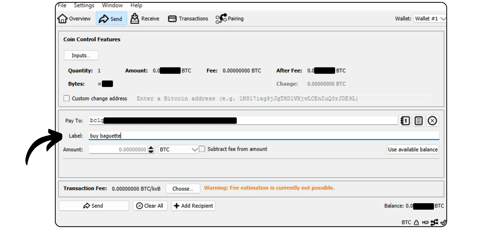

Bitcoin Knots on Bitcoin-protokollan vaihtoehtoinen toteutus, joka on johdettu Bitcoin Core -protokollasta. Sen on suunnitellut ja ylläpitää Luke Dashjr, ja se tarjoaa joitakin lisäominaisuuksia ja sääntömuutoksia Mempool:sta, mutta on samalla yhteensopiva verkon muiden solmujen kanssa. Bitcoin Knots integroi Bitcoin Wallet:n, mutta sitä voidaan käyttää myös yksinkertaisena Bitcoin-solmuna muiden Wallet-ohjelmistojen rinnalla.

## Miksi käyttää solmuja eikä ydintä?

Tällä hetkellä Core on Bitcoin-protokollan enemmistötoteutus verkossa. Bitcoin-protokolla on vain joukko sääntöjä. Niiden soveltaminen edellyttää ohjelmistoa. Bitcoin-protokollaa toteuttavaa ohjelmistoa käyttävää konetta kutsutaan solmuksi, ja kaikki nämä solmut yhdessä muodostavat Bitcoin-verkon.

Bitcoin:n historian aikana on syntynyt lukuisia Satoshi Nakamoton kehittämästä alkuperäisestä ohjelmistosta johdettuja asiakkaita. Nykyään (maaliskuussa 2025) Bitcoin Core on ylivoimainen enemmistö, ja lähes 98 prosenttia Bitcoin-verkon solmuista käyttää tätä asiakasta.

Saatavilla on kuitenkin myös vaihtoehtoisia ohjelmistoja. Nämä eivät ole Altcoin-solmuja kuten Bitcoin Cash, vaan vaihtoehtoisia asiakkaita, jotka ovat yhteensopivia todellisen Bitcoin-verkon kanssa. Näistä Bitcoin Knots on tunnetuin. Sen osuus verkosta on tällä hetkellä noin 1,4 prosenttia. Muut vaihtoehtoiset asiakkaat ovat vielä vähemmistönä.


On kaksi tärkeintä syytä käyttää vaihtoehtoista asiakasta, kuten Knotsia, Coren sijasta:


- Tekninen**: Nämä asiakkaat tarjoavat usein erilaisia vaihtoehtoja Core:lle, erityisesti Mempool:n hallinnan osalta, sillä ne määrittelevät, mitkä transaktiot solmusi hyväksyy ja lähettää.
- Politiikka**: Jotkut haluavat käyttää vaihtoehtoisia asiakkaita, kuten Knotsia, muista kuin teknisistä syistä, erityisesti tukeakseen vaihtoehtoa Core-ohjelmalle ja vähentääkseen siten sen monopolia. Jos Core joskus vaarantuisi, olisi hyödyllistä, että olisi paitsi vankkoja, hyvin ylläpidettyjä vaihtoehtoisia asiakkaita, myös tietoa siitä, miten niitä käytetään. Toiset käyttävät Knotsia protestitarkoituksessa, koska he ovat menettäneet luottamuksensa Coren kehittäjiin tai paheksuvat enemmistöasiakkaan hallintoa.

## Miten asennan Bitcoin-solmut?

Siirry [Bitcoin Knotsin viralliselle verkkosivustolle](https://bitcoinknots.org/#download) ja lataa käyttöjärjestelmääsi sopiva versio. Älä unohda ladata sormenjälkeä ja allekirjoituksia ohjelmiston varmentamiseksi. Nämä tiedostot ovat saatavilla myös [Bitcoin Knotsin GitHub-arkistossa](https://github.com/bitcoinknots/Bitcoin).


Ennen kuin asennat ohjelmiston koneellesi, suosittelemme, että tarkistat sen aitouden ja eheyden. Jos et tiedä miten, katso tämä toinen ohje:

https://planb.network/tutorials/computer-security/data/integrity-authenticity-21d0420a-be02-4663-94a3-8d487f23becc
Kun ohjelmisto on tarkistettu, asenna se noudattamalla asennuspaneelissa ilmoitettuja ohjeita.


## IBD:n käynnistäminen

Kun käynnistät Bitcoin Knotsin ensimmäistä kertaa, voit valita paikallisen hakemiston, johon solmun tiedot (mukaan lukien Blockchain, UTXO set ja parametrit) tallennetaan.


Voit myös karsia Blockchain-tiedot niin, että säilytät vain viimeisimmät lohkot. Tämän vaihtoehdon avulla solmupiste voi tarkistaa jokaisen lohkon kokonaisuudessaan asetetun varastointirajan puitteissa, jolloin vanhimmat lohkot poistetaan vähitellen. Jos sinulla on riittävästi levytilaa (tällä hetkellä noin 650 Gt, mutta määrä kasvaa), jätä tämä vaihtoehto valitsematta. Jos levytilaa on rajoitetusti, ota karsinta käyttöön ja määritä suurin sallittu kapasiteetti.

Huomaa: Jos solmusi on karsittu ja käytät sitä palautetun Wallet:n synkronointiin, et voi hakea tapahtumia, jotka edeltävät vanhinta paikallisesti tallennettua lohkoa.


Toinen käytettävissä oleva vaihtoehto on "*Aseta voimassa*". Se nopeuttaa alkusynkronointia ohittamalla allekirjoituksen tarkistamisen tietyn lohkon edeltäviin lohkoihin sisältyvien transaktioiden osalta.

"*Assume Valid*" -toiminnon tavoitteena on nopeuttaa solmun ensimmäistä synkronointia heikentämättä merkittävästi turvallisuutta olettamalla, että verkko on validoinut nämä transaktiot jo etukäteen. Ainoa tärkeä kompromissi on, että solmusi ei havaitse aiempia Bitcoin-varkauksia, mutta se takaa silti liikkeeseen laskettujen bitcoinien kokonaismäärän tarkkuuden. Solmusi tarkistaa kaikki transaktioiden allekirjoitukset tietyn lohkon jälkeen. Tämä lähestymistapa perustuu oletukseen, että transaktio, jonka verkko on pitkään hyväksynyt ilman haastetta, on todennäköisesti pätevä.

Esimerkiksi tässä tapauksessa "*Aseta voimassa oleva*" on asetettu lohkon nro:ksi. 855 000 `0000000000000000000000000000000233ea80aa10d38aa4486cd7033fffc2c4df556d0b9138`, julkaistu 1. elokuuta 2024. IBD:n aikana solmuni aloittaa siis täydellisen allekirjoituksen tarkistuksen vain tästä lohkosta.


Napsauta sitten "*OK*"-painiketta käynnistääksesi *Initial Block Download*. Sinun on oltava kärsivällinen solmujen alkusynkronoinnin aikana. Jos haluat jatkaa synkronointia myöhemmin, sulje ohjelmisto ja sammuta tietokone. Synkronointi jatkuu ongelmitta, kun avaat ohjelman seuraavan kerran.


## Bitcoin-solmun asettaminen

Napsauta välilehteä "*Asetukset*" ja valitse sitten "*Valinnat*".


"*Main*"-välilehdellä pääset käsiksi solmun pääparametreihin:


- "*Start...*" käynnistää solmun automaattisesti tietokoneen käynnistyessä, jotta synkronointi voidaan aloittaa välittömästi;
- "*Karsiminen...*" säätää tallennusrajaa, jos olet valinnut Blockchain:n karsimisen;
- "*Database cache...*" määrittää solmun sallitun RAM-muistin enimmäismäärän;
- Aktivoi lopuksi "*Enable RPC server*", jos haluat liittää Bitcoin Knots-solmun muihin salkkuohjelmistoihin, kuten esimerkiksi Sparrow Wallet:een tai Liana:een.


"*Wallet*"-välilehdeltä löydät asetukset integroitua portfoliota varten, jonka voit luoda myöhemmin Knotsissa. Suosittelen, että otat käyttöön RBF:n ja kolikonhallinnan. Voit myös määrittää käytettävän skriptityypin.


"*Verkko*"-välilehti sisältää verkkoparametrit, joita voit mukauttaa omiin tarpeisiisi.


"*Mempool*"-välilehdellä voit määrittää *Muistipoolin* eli muistiin tallennettujen vahvistamattomien tapahtumien hallinnan ja tälle toiminnolle varatun enimmäiskoon (oletusarvoisesti 300 Mt).


Roskapostin suodatus -välilehti on Bitcoin Knotsin ominaisuus. Täältä löydät useita asetuksia, joiden avulla voit valita, mitkä tapahtumat hyväksyt tai kieltäydyt lähettämästä. Päätavoitteena on rajoittaa tiettyjä Bitcoin:n marginaalisia käyttötapoja, erityisesti metaprotokollia, jotta näitä käytäntöjä voidaan torjua ja samalla välttää solmun ylikuormittuminen. Kyseessä on poliittinen valinta, joka riippuu henkilökohtaisesta näkemyksestäsi Bitcoin:sta.

Löydät myös klassisia parametreja, kuten "*Dust*"-kynnyksen määritelmän.

Nämä parametrit vaikuttavat kuitenkin vain standardointisääntöihin. Solmusi hyväksyy edelleen vahvistamattomia transaktioita vain silloin, kun ne sisältyvät lohkoon, jotta se pysyy yhteensopivana muun Bitcoin-verkon kanssa. Nämä asetukset muuttavat vain tapaa, jolla solmusi käsittelee ja jakaa vahvistamattomat transaktiot vertaisverkoilleen. Käytännössä, koska Knots on vähemmistönä, Bitcoin Coreen oletusarvoisesti asetetut säännöt määrittelevät verkon standardoinnin.


"*Mining*"-välilehdellä voit määrittää solmun mahdollisen osallistumisen Mining:een, jos haluat aktivoida tämän toiminnon.


"*Display*"-välilehdellä on Interface:n grafiikkaan liittyviä parametreja, mukaan lukien ohjelmiston kieli.


## Bitcoin-salkun luominen

Kun alustava synkronointi on valmis, Bitcoin Knots -solmusi on täysin toimiva. Sinulla on nyt mahdollisuus liittää tämä solmu muihin Wallet-ohjelmistoihin tai käyttää sisäänrakennettua Hot Wallet:tä suoraan. Napsauta tätä varten "*Luo uusi Wallet*"-painiketta.


Anna Wallet:lle nimi. Voit myös suojata sen passphrase BIP39:llä napsauttamalla "*Salaa Wallet*". Kun olet valmis, napsauta "*Luo*"-painiketta.


passphrase BIP39 on valinnainen salasana, jonka voit valita vapaasti Mnemonic-lauseen lisäksi Wallet:n turvallisuuden lisäämiseksi. Ennen tämän ominaisuuden määrittämistä suosittelemme sinua lukemaan seuraavan artikkelin, jossa selitetään yksityiskohtaisesti, miten passphrase toimii teoriassa ja miten voit välttää virheitä, jotka voivat johtaa bitcoinien pysyvään menettämiseen:

https://planb.network/tutorials/wallet/backup/passphrase-a26a0220-806c-44b4-af14-bafdeb1adce7
Jos olet aktivoinut passphrase-vaihtoehdon, valitse kestävä vaihtoehto ja tallenna se huolellisesti yhdelle tai useammalle suojatulle fyysiselle tietovälineelle.


Bitcoin-salkkusi on nyt luotu.


## Bitcoin-salkun varmuuskopiointi

Jo ennen kuin saat ensimmäiset bitcoinisi, on tärkeää tehdä varmuuskopio Bitcoin Wallet:sta, jotta voit palauttaa rahasi, jos ne katoavat tai tietokoneen toimintahäiriö ilmenee. Tee tämä napsauttamalla "*Tiedosto*"-välilehteä ja sitten "*Varmistus Wallet*".


Tämä toiminto luo yhden tiedoston, jota voidaan käyttää kaikkien bitcoinien palauttamiseen. Ole siis hyvin varovainen ja tallenna se turvalliselle ulkoiselle tietovälineelle.

## Vastaanottaa bitcoineja

Jos haluat vastaanottaa bitcoineja suoraan Knots Wallet:ään, napsauta "*Vastaanottaa*"-painiketta.


Määritä Address:lle "*Label*", jotta sen käyttötarkoitus voidaan helposti tunnistaa ja *Coin Control*:n tulevaa käyttöä helpottaa. Voit myös määritellä etukäteen tarkan summan, joka tähän Address:aan vastaanotetaan, tai lisätä viestin maksajalle. Kun olet asettanut parametrit, napsauta "*Maksupyyntö*".


Bitcoin Knots näyttää sitten vastaanottavan Address:n, jonka voit kopioida tai skannata ja lähettää maksajalle.


Kun tapahtuma on lähetetty, voit seurata sen tilaa suoraan "*Tapahtumat*"-valikosta.


## Lähetä bitcoineja

Nyt kun sinulla on bitcoineja Knots Wallet:ssäsi, voit lähettää niitä. Tee se klikkaamalla "*lähettää*"-painiketta.


Napsauta "*Syötteet...*"-painiketta valitaksesi tarkat UTXO, jotka haluat käyttää tähän tapahtumaan.


Kirjoita vastaanottajan Bitcoin Address.


Lisää merkintä, jolla muistat tämän tapahtuman tarkoituksen.



Kirjoita summa, jonka haluat lähettää tälle Address:lle.


Napsauta "*Valitse...*"-painiketta valitaksesi maksutapahtumalle sopivan maksun, joka perustuu verkon senhetkiseen tilaan.


Jos olet tyytyväinen, napsauta "*Lähetä*"-painiketta. Jos käytät passphrase:ta, sinua pyydetään täyttämään se tässä vaiheessa.


Tarkista tapahtumaparametrit vielä kerran, ja jos kaikki on oikein, napsauta uudelleen "*Lähetä*"-painiketta allekirjoittaaksesi ja jakaaksesi tapahtuman.


Vahvistusta odottava tapahtumasi näkyy nyt "*Tapahtumat*"-välilehdellä.


## Solmun liittäminen toiseen ohjelmaan

Bitcoin Knotsin integroitu Interface Bitcoin-salkun hallintaan ei välttämättä ole kaikkein intuitiivisin, ja sen toiminnot ovat suhteellisen rajalliset. Voit kuitenkin liittää Bitcoin Knots -solmun erikoistuneeseen salkunhallintaohjelmistoon, jolloin pääset helposti käsiksi Blockchain Bitcoin -tietoihin ja voit lähettää transaktioita.

Menettely riippuu käytetystä ohjelmistosta, mutta on kaksi päävaihtoehtoa: joko Bitcoin Knots on asennettu samaan tietokoneeseen kuin salkkuohjelmisto, tai se toimii erillisellä koneella.

### Paikallisilla Bitcoin-solmuilla :

Jos Bitcoin Knots on asennettu tietokoneellesi, etsi tiedosto `Bitcoin.conf` ohjelmistotiedostojen joukosta. Jos tätä tiedostoa ei ole olemassa, voit luoda sen. Avaa se tekstieditorilla ja lisää seuraava rivi:

```ini
server=1
```

Tallenna sitten muutokset.

Voit tehdä tämän myös Bitcoin-QT:n Interface-grafiikan kautta siirtymällä kohtaan "*asetukset*" > "*Options...*" ja ota käyttöön vaihtoehto "*Enable RPC server*".

Muista käynnistää ohjelmisto uudelleen näiden muutosten tekemisen jälkeen.


Siirry sitten portfolionhallintaohjelmistoon (esim. Sparrow Wallet tai Liana) ja syötä polku evästetiedostoon, joka sijaitsee yleensä samassa kansiossa kuin `Bitcoin.conf`, käyttöjärjestelmästäsi riippuen:

|**macOS**|~/Library/Application Support/Bitcoin|

|---|---|

|**Windows**|%APPDATA%\Bitcoin|

|**Linux**|~/.Bitcoin|~/.Bitcoin|


Jätä muut parametrit oletusarvoisiksi, URL `127.0.0.1` ja portti `8332`, ja napsauta sitten "*Testausyhteys*".


### Kaukosäätimellä Bitcoin Solmut :

Jos Bitcoin Knots on asennettu toiseen koneeseen, joka on liitetty samaan verkkoon, etsi ensin Bitcoin.conf-tiedosto ohjelmistotiedostojen joukosta. Jos tätä tiedostoa ei vielä ole, voit luoda sen. Avaa tämä tiedosto tekstieditorilla ja lisää seuraava rivi:

```ini
server=1
```

Kun olet muokannut tiedostoa, varmista, että tallennat sen käyttöjärjestelmääsi sopivaan kansioon:

|**macOS**|~/Library/Application Support/Bitcoin||

|---|---|

|**Windows**|%APPDATA%\Bitcoin|

|**Linux**|~/.Bitcoin|~/.Bitcoin|

Tämä toiminto voidaan suorittaa myös Bitcoin-QT:n Interface-grafiikan avulla. Siirry "*Settings*"-valikkoon, sitten "*Options...*" ja aktivoi "*Enable RPC server*"-vaihtoehto merkitsemällä vastaava ruutu. Jos `Bitcoin.conf`-tiedostoa ei ole olemassa, voit luoda sen suoraan tästä Interface:stä klikkaamalla "*Open Configuration File*".


Etsi lähiverkosta sen koneen IP Address, joka isännöi Bitcoin Solmuja. Voit tehdä tämän käyttämällä työkalua, kuten [Angry IP Scanner](https://angryip.org/). Oletetaan, että solmusi IP Address on `192.168.1.18`.

Lisää seuraavat rivit tiedostoon `Bitcoin.conf` ja aseta `rpcbind=192.168.1.18` vastaamaan solmusi Address:n IP-osoitetta.

```ini
[main]
rpcbind=127.0.0.1
rpcbind=192.168.1.18
rpcallowip=127.0.0.1
rpcallowip=192.168.1.0/24
```


Lisää myös käyttäjätunnus ja salasana etäyhteyksiä varten Bitcoin.conf-tiedostoon. Muista korvata `loic` käyttäjänimelläsi ja `my_password` vahvalla salasanalla:

```ini
rpcuser=loic
rpcpassword=my_password
```


Kun olet muokannut ja tallentanut tiedoston, käynnistä Bitcoin Knots uudelleen.

Voit nyt siirtyä salkunhallintaohjelmistoon (esim. Sparrow Wallet tai Liana). Siirry Sparrow'ssa välilehdelle "*Käyttäjä / Pass*". Syötä käyttäjätunnus ja salasana, jotka olet määrittänyt Bitcoin.conf-tiedostossa. Jätä muut parametrit oletusarvoisiksi, eli URL-osoite `127.0.0.0.1` ja portti `8332`. Napsauta sitten "*Testaa yhteys*".


Yhteys on muodostettu.

Nyt tiedät kaiken vaihtoehtoisesta Bitcoin Solmujen toteutuksesta.

Jos löysit tämän opetusohjelman hyödylliseksi, olisin hyvin kiitollinen, jos jättäisit Green peukalon alle. Voit vapaasti jakaa sen sosiaalisissa verkostoissa. Kiitos paljon!

Suosittelen myös tätä toista opetusohjelmaa, jossa selitän, miten oma Lightning-solmu perustetaan:

https://planb.network/tutorials/node/lightning-network/alby-hub-62e6356c-6a6d-4134-8f22-c3b6afb9882a