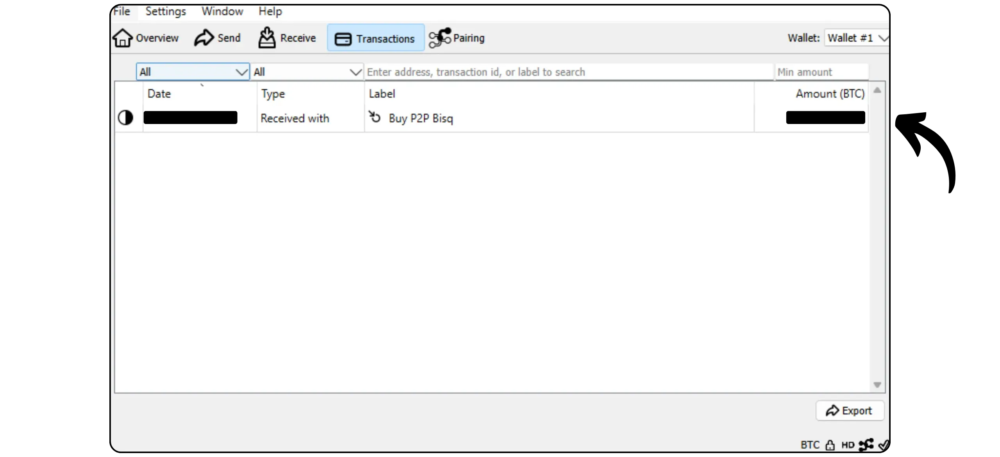
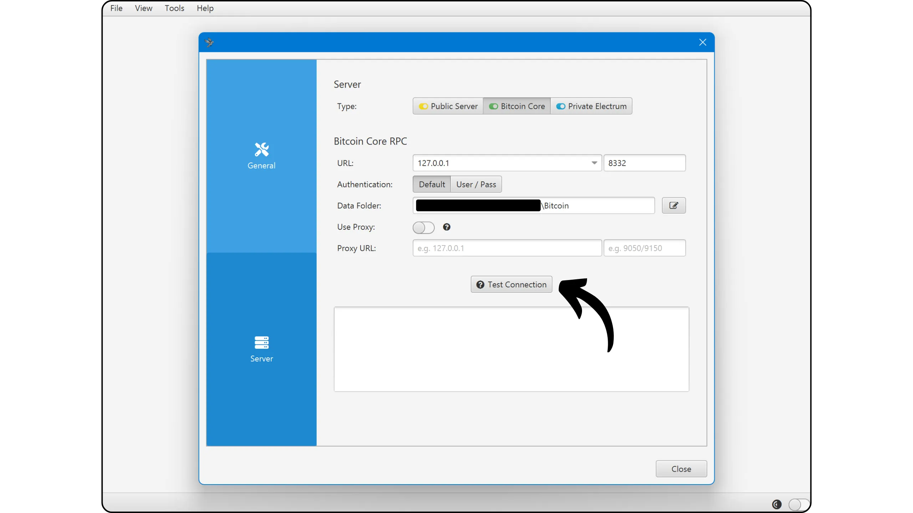
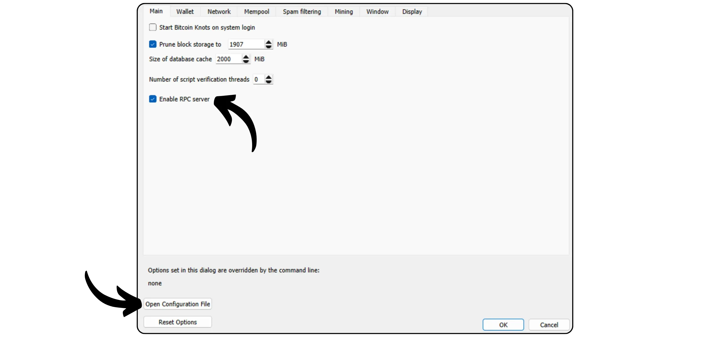

Bitcoin Knots est une implémentation alternative du protocole Bitcoin, dérivée de Bitcoin Core. Conçue et maintenue par Luke Dashjr, elle propose quelques fonctionnalités supplémentaires et des ajustements de règles de mempool, tout en restant compatible avec les autres nœuds du réseau. Bitcoin Knots intègre un portefeuille Bitcoin, mais il peut également être utilisé comme un simple noeud Bitcoin avec à côté d'autres logiciels de portefeuille.

## Pourquoi utiliser Knots plutôt que Core ?

Actuellement, Core est l'implémentation majoritaire du protocole Bitcoin sur le réseau. En effet, le protocole Bitcoin n'est qu'un ensemble de règles. Il nécessite un logiciel pour leur application. Une machine exécutant un tel logiciel implémentant le protocole Bitcoin s'appelle un nœud, et tous ces nœuds réunis constituent le réseau Bitcoin.

Tout au long de l'histoire de Bitcoin, de nombreux clients dérivés du logiciel initial développé par Satoshi Nakamoto ont vu le jour. Aujourd'hui (mars 2025), Bitcoin Core est ultra-majoritaire, puisque près de 98 % des nœuds du réseau Bitcoin utilisent ce client.

Cependant, il existe aussi des logiciels alternatifs. Il ne s'agit pas de nœuds liés à des altcoins comme Bitcoin Cash, mais bien de clients alternatifs compatibles avec le vrai réseau Bitcoin. Parmi eux, Bitcoin Knots est le plus connu. Il représente actuellement environ 1,4 % du réseau. Les autres clients alternatifs demeurent très minoritaires.


Deux principales raisons peuvent vous pousser à utiliser un client alternatif comme Knots au lieu de Core :

- **Technique** : Ces clients offrent souvent des options différentes de Core, notamment en matière de gestion de la mempool, en déterminant les transactions acceptées et diffusées par votre nœud.

- **Politique** : Certains préfèrent utiliser des clients alternatifs tels que Knots pour des raisons non techniques, notamment pour soutenir une alternative à Core et ainsi réduire son monopole. Si Core venait un jour à être compromis, il serait alors utile de disposer d'autres clients solides et bien maintenus, mais aussi de savoir les utiliser. D'autres utilisent Knots dans une démarche contestataire, parce qu'ils ont perdu confiance dans les développeurs de Core ou désapprouvent la gestion du client majoritaire.

## Comment installer Bitcoin Knots ?

Rendez-vous [sur le site officiel de Bitcoin Knots](https://bitcoinknots.org/#download) pour télécharger la version correspondant à votre système d'exploitation. N'oubliez pas de récupérer également l'empreinte et les signatures pour vérifier le logiciel. Ces fichiers sont aussi disponibles [sur le dépôt GitHub de Bitcoin Knots](https://github.com/bitcoinknots/bitcoin).


Avant d'installer le logiciel sur votre machine, il est fortement recommandé d'en vérifier l'authenticité et l'intégrité. Si vous ne savez pas comment le faire, consultez cet autre tutoriel :

https://planb.network/tutorials/computer-security/data/integrity-authenticity-21d0420a-be02-4663-94a3-8d487f23becc

Une fois le logiciel vérifié, installez-le en suivant les étapes indiquées dans le panneau d'installation.


## Lancer l'IBD

Lors du premier lancement de Bitcoin Knots, vous pourrez choisir le répertoire local où seront stockées les données de votre nœud (notamment la blockchain, l'UTXO set et les paramètres).


Vous pouvez également choisir d'élaguer les données de la blockchain pour ne conserver que les blocs les plus récents. Cette option permet à votre nœud de vérifier intégralement chaque bloc tout en respectant une limite de stockage fixée, ce qui supprime donc progressivement les blocs les plus anciens. Si vous disposez de suffisamment d'espace disque (environ 650 Go actuellement, mais ce nombre ne cesse d'augmenter), laissez cette option décochée. Si votre espace disque est limité, activez l'élagage et indiquez la capacité maximale autorisée.

Attention : Si votre nœud est élagué et que vous l'utilisez pour synchroniser un portefeuille récupéré, vous ne pourrez pas retrouver les transactions antérieures au bloc le plus ancien conservé localement.


Une autre option disponible est "*Assume Valid*". Elle permet d'accélérer la synchronisation initiale en sautant la vérification des signatures des transactions incluses dans les blocs antérieurs à un bloc précis.

L'objectif d'"*Assume Valid*" est d'accélérer la première synchronisation du nœud sans réduire significativement la sécurité, en présumant que ces transactions ont déjà été validées massivement par le réseau auparavant. Le seul compromis important est que votre nœud ne détectera pas d'éventuels vols antérieurs de bitcoins, mais il permettra tout de même de garantir l'exactitude du nombre total de bitcoins émis. Votre nœud vérifiera toutes les signatures des transactions situées après le bloc indiqué. Cette approche repose sur l'hypothèse qu'une transaction acceptée depuis longtemps par le réseau sans contestation est très probablement valide.

Par exemple, ici, "*Assume Valid*" est paramétré sur le bloc n°855 000 `0000000000000000000233ea80aa10d38aa4486cd7033fffc2c4df556d0b9138`, publié le 1er août 2024. Durant l'IBD, mon nœud commencera donc la vérification complète des signatures seulement à partir de ce bloc.


Cliquez ensuite sur le bouton "*OK*" pour lancer l'*Initial Block Download*. Vous devrez patienter durant la synchronisation initiale du nœud. Si vous souhaitez reprendre cette synchronisation plus tard, fermez simplement le logiciel et éteignez votre ordinateur. La synchronisation reprendra sans problème à votre prochaine ouverture.


## Paramétrer son nœud Bitcoin Knots

Cliquez sur l'onglet "*Settings*", puis sélectionnez "*Options*".


Dans l'onglet "*Main*", vous accédez aux paramètres principaux du nœud :
- "*Start…*" permet le lancement automatique du nœud au démarrage de votre ordinateur pour entamer la synchronisation immédiatement ;
- "*Prune…*" permet d'ajuster la limite de stockage si vous avez choisi d'élaguer la blockchain ;
- "*Database cache…*" règle la quantité maximale de mémoire vive autorisée à votre nœud ;
- Enfin, activez "*Enable RPC server*" si vous souhaitez connecter votre nœud Bitcoin Knots à d'autres logiciels de portefeuille, tels que Sparrow Wallet ou Liana par exemple.


Dans l'onglet "*Wallet*", vous trouverez les paramètres du portefeuille intégré que vous pourrez créer ultérieurement sur Knots. Je vous recommande d'activer RBF et le coin control. Vous pouvez également définir le type de script à utiliser.


L'onglet "*Network*" contient les paramètres réseau que vous pourrez adapter selon vos besoins spécifiques.


L'onglet "*Mempool*" permet de configurer la *Memory Pool*, c'est-à-dire la gestion des transactions non confirmées stockées en mémoire ainsi que la taille maximale attribuée à cette fonctionnalité (300 Mo par défaut).


L'onglet "*Spam filtering*" est une fonctionnalité propre à Bitcoin Knots. Vous y trouverez de nombreux réglages permettant de choisir quelles transactions vous acceptez ou refusez de diffuser. L'objectif principal est de limiter certaines utilisations marginales de Bitcoin, en particulier les méta-protocoles, afin de combattre ces pratiques tout en évitant la surcharge de votre nœud. Il s'agit donc d'un choix politique selon votre vision personnelle de Bitcoin.

Vous y trouverez aussi des paramètres classiques comme la définition du seuil de "*Dust*".

Cependant, ces paramètres influencent uniquement les règles de standardisation. Votre nœud continuera à accepter les transactions ne respectant pas ces critères uniquement lorsqu'elles sont incluses dans un bloc, afin de rester compatible avec le reste du réseau Bitcoin. Ces paramètres modifient seulement la manière dont votre nœud traite et diffuse les transactions non confirmées à ses pairs. En pratique, comme Knots est minoritaire, ce sont les règles établies par défaut sur Bitcoin Core qui définissent la standardisation sur le réseau.


L'onglet "*Mining*" permet de configurer la participation éventuelle de votre nœud au minage, si vous souhaitez activer cette fonction.


Enfin, l'onglet "*Display*" concerne les paramètres relatifs à l'interface graphique, notamment la langue du logiciel.


## Créer un portefeuille Bitcoin

Une fois la synchronisation initiale achevée, votre nœud Bitcoin Knots est pleinement fonctionnel. Vous avez désormais la possibilité de connecter ce nœud à un autre logiciel de portefeuille, ou bien d'utiliser directement le portefeuille chaud intégré. Pour ce faire, cliquez sur le bouton "*Create a new wallet*".


Donnez un nom à votre portefeuille. Vous pouvez également le protéger à l'aide d'une Passphrase BIP39 en cliquant sur "*Encrypt Wallet*". Une fois prêt, cliquez sur le bouton "*Create*".


La passphrase BIP39 est un mot de passe optionnel que vous choisissez librement, venant s'ajouter à votre phrase mnémonique afin d'accroître la sécurité de votre portefeuille. Avant de configurer cette fonctionnalité, il est vivement conseillé de consulter l'article suivant, qui explique en détail le fonctionnement théorique de la passphrase et vous permet d'éviter les erreurs susceptibles d'entraîner une perte définitive de vos bitcoins :

https://planb.network/tutorials/wallet/backup/passphrase-a26a0220-806c-44b4-af14-bafdeb1adce7

Si vous avez activé l'option passphrase, choisissez-en une robuste et sauvegardez-la soigneusement sur un ou plusieurs supports physiques sécurisés.


Votre portefeuille Bitcoin est désormais créé.


## Sauvegarder son portefeuille Bitcoin

Avant même de recevoir vos premiers bitcoins, il est indispensable d'effectuer une sauvegarde de votre portefeuille Bitcoin afin de pouvoir récupérer vos fonds en cas de perte ou de panne de votre ordinateur. Pour ce faire, cliquez sur l'onglet "*File*" puis sur "*Backup wallet*".


Cette opération génère un fichier unique qui permet, à lui seul, de restaurer l'ensemble de vos bitcoins. Soyez donc très vigilant, et sauvegardez-le sur un support externe sécurisé.

## Recevoir des bitcoins

Pour recevoir des bitcoins directement sur votre portefeuille Knots, cliquez sur le bouton "*Receive*".


Attribuez un "*Label*" à votre adresse afin d'en identifier facilement l'objectif et faciliter l'utilisation ultérieure du *Coin Control*. Vous pouvez également définir à l'avance un montant précis à recevoir sur cette adresse, ou ajouter un message destiné au payeur. Une fois les paramètres définis, cliquez sur "*Request payment*".


Bitcoin Knots affiche alors une adresse de réception que vous pouvez copier ou scanner afin de la transmettre au payeur.


Une fois la transaction diffusée, vous pourrez suivre son état directement dans le menu "*Transactions*".



## Envoyer des bitcoins

Maintenant que vous avez des bitcoins sur votre portefeuille Knots, vous avez la possibilité d'en envoyer. Pour ce faire, cliquez sur le bouton "*Send*".


Cliquez sur le bouton "*Inputs...*" afin de sélectionner précisément l'UTXO que vous souhaitez dépenser pour cette transaction.


Indiquez l'adresse Bitcoin du destinataire.


Ajoutez un label afin de vous souvenir de l'objectif de cette transaction.


Entrez le montant que vous souhaitez envoyer à cette adresse.


Cliquez sur le bouton "*Choose...*" pour sélectionner le taux de frais adapté à votre transaction en fonction de l'état actuel du réseau.


Si tout vous convient, cliquez sur le bouton "*Send*". Si vous utilisez une passphrase, il vous sera demandé de la renseigner à cette étape.


Vérifiez une dernière fois les paramètres de votre transaction, puis, si tout est correct, cliquez à nouveau sur le bouton "*Send*" pour signer et diffuser votre transaction.


Votre transaction en attente de confirmation apparaît désormais dans l'onglet "*Transactions*".


## Connecter son nœud à un autre logiciel

L'interface intégrée de Bitcoin Knots pour gérer votre portefeuille Bitcoin n'est pas forcément la plus intuitive, et ses fonctionnalités restent relativement limitées. Vous pouvez toutefois connecter votre nœud Bitcoin Knots à un logiciel spécialisé de gestion de portefeuille afin d'accéder facilement aux données de la blockchain Bitcoin et de diffuser vos transactions.

La procédure à suivre dépendra du logiciel utilisé, mais deux cas de figure principaux existent : soit Bitcoin Knots est installé sur le même ordinateur que votre logiciel de portefeuille, soit il fonctionne sur une machine séparée.

### Avec Bitcoin Knots en local :

Si Bitcoin Knots est installé sur votre ordinateur, localisez le fichier `bitcoin.conf` parmi les fichiers du logiciel. Si ce fichier n'existe pas, vous pouvez le créer. Ouvrez-le avec un éditeur de texte et insérez la ligne suivante :

```ini
server=1
```

Sauvegardez ensuite vos modifications.

Vous pouvez également effectuer cette configuration via l'interface graphique de Bitcoin-QT en naviguant dans "*Settings*" > "*Options...*" et en activant l'option "*Enable RPC server*".

N'oubliez pas de redémarrer le logiciel après ces modifications.


Rendez-vous ensuite sur votre logiciel de gestion de portefeuille (par exemple Sparrow Wallet ou Liana) et renseignez le chemin vers votre fichier de cookie, généralement situé dans le même dossier que le `bitcoin.conf`, selon votre système d'exploitation :

|**macOS**|~/Library/Application Support/Bitcoin|
|---|---|
|**Windows**|%APPDATA%\Bitcoin|
|**Linux**|~/.bitcoin|


Laissez les autres paramètres par défaut, l'URL `127.0.0.1` et le port `8332`, puis cliquez sur "*Test Connection*".



### Avec Bitcoin Knots à distance :

Si Bitcoin Knots est installé sur une autre machine connectée sur le même réseau, commencez par localiser le fichier `bitcoin.conf` parmi les fichiers du logiciel. Si ce fichier n'existe pas encore, vous pouvez le créer. Ouvrez ce fichier avec un éditeur de texte et ajoutez la ligne suivante :

```ini
server=1
```

Après avoir modifié le fichier, assurez-vous de l'enregistrer dans le dossier approprié selon votre système d'exploitation :

|**macOS**|~/Library/Application Support/Bitcoin|
|---|---|
|**Windows**|%APPDATA%\Bitcoin|
|**Linux**|~/.bitcoin|

Il est également possible de réaliser cette manipulation via l'interface graphique de Bitcoin-QT. Accédez au menu "*Settings*", puis "*Options...*", et activez l'option "*Enable RPC server*" en cochant la case correspondante. Si le fichier `bitcoin.conf` n'existe pas, vous pouvez le créer directement depuis cette interface en cliquant sur "*Open Configuration File*".



Trouvez l'adresse IP de la machine qui héberge Bitcoin Knots dans votre réseau local. Pour cela, vous pouvez utiliser un outil tel que [Angry IP Scanner](https://angryip.org/). Supposons, pour l'exemple, que l'adresse IP de votre nœud soit `192.168.1.18`.

Dans le fichier `bitcoin.conf`, ajoutez les lignes suivantes, en configurant `rpcbind=192.168.1.18` pour correspondre à l'adresse IP de votre nœud.

```ini
[main]
rpcbind=127.0.0.1
rpcbind=192.168.1.18
rpcallowip=127.0.0.1
rpcallowip=192.168.1.0/24
```


Ajoutez également dans le fichier `bitcoin.conf` un identifiant et un mot de passe pour les connexions à distance. Assurez-vous de remplacer `loic` par votre nom d'utilisateur et `my_password` par un mot de passe fort :

```ini
rpcuser=loic
rpcpassword=my_password
```


Après avoir modifié et sauvegardé le fichier, redémarrez Bitcoin Knots.

Vous pouvez maintenant aller sur votre logiciel de gestion de portefeuille (par exemple Sparrow Wallet ou Liana). Sur Sparrow, accédez à l'onglet "*User / Pass*". Saisissez le nom d'utilisateur et le mot de passe que vous avez configurés dans le fichier `bitcoin.conf`. Laissez les autres paramètres par défaut, à savoir l'URL `127.0.0.1` et le port `8332`. Cliquez ensuite sur "*Test Connection*".


La connexion est établie.

Vous savez maintenant tout sur l'implémentation alternative Bitcoin Knots.

Si vous avez trouvé ce tutoriel utile, je vous serais très reconnaissant de laisser un pouce vert ci-dessous. N'hésitez pas à le partager sur vos réseaux sociaux. Merci beaucoup !

Je vous conseille également de découvrir cet autre tutoriel dans lequel je vous explique comment mettre en place votre propre nœud Lightning :

https://planb.network/tutorials/node/lightning-network/alby-hub-62e6356c-6a6d-4134-8f22-c3b6afb9882a
