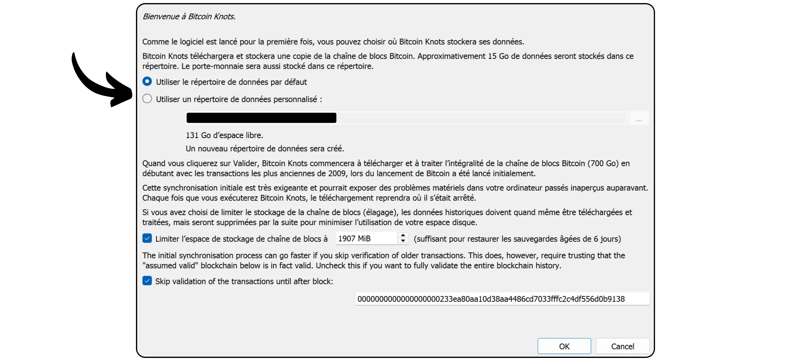
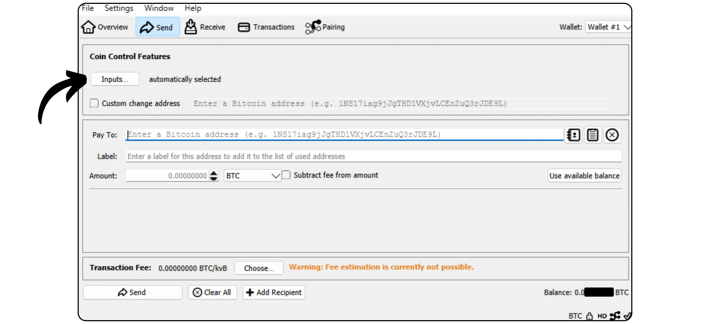

Bitcoin Knots, Bitcoin प्रोटोकॉल का एक वैकल्पिक कार्यान्वयन है, जो Bitcoin कोर से लिया गया है। इसे ल्यूक डैशजून द्वारा डिज़ाइन और बनाए रखा गया है। इसमें Mempool से कुछ अतिरिक्त विशेषताएँ और नियम समायोजन शामिल हैं, जबकि यह नेटवर्क पर अन्य नोड्स के साथ संगत रहता है। Bitcoin Knots एक Bitcoin Wallet को एकीकृत करता है, लेकिन इसे अन्य Wallet सॉफ़्टवेयर के साथ एक साधारण Bitcoin नोड के रूप में भी उपयोग किया जा सकता है।

## गाँठों का उपयोग कोर की बजाय क्यों करें?

वर्तमान में, कोर नेटवर्क पर Bitcoin प्रोटोकॉल का मुख्य कार्यान्वयन है। Bitcoin प्रोटोकॉल बस नियमों का एक सेट है। इसे लागू करने के लिए सॉफ़्टवेयर की आवश्यकता होती है। एक मशीन जो Bitcoin प्रोटोकॉल को लागू करने वाला सॉफ़्टवेयर चला रही है, उसे नोड कहा जाता है, और ये सभी नोड्स मिलकर Bitcoin नेटवर्क बनाते हैं।

Bitcoin के इतिहास में, कई ग्राहक Satoshi नाकामोटो द्वारा विकसित प्रारंभिक सॉफ़्टवेयर से उत्पन्न हुए हैं। आज (मार्च 2025), Bitcoin कोर का दबदबा है, जिसमें लगभग 98% नोड्स Bitcoin नेटवर्क पर इस क्लाइंट का उपयोग कर रहे हैं।

हालांकि, वैकल्पिक सॉफ़्टवेयर भी उपलब्ध है। ये Altcoin से जुड़े नोड्स जैसे Bitcoin कैश नहीं हैं, बल्कि असली Bitcoin नेटवर्क के साथ संगत वैकल्पिक क्लाइंट्स हैं। इनमें से, Bitcoin नॉट्स सबसे प्रसिद्ध है। यह वर्तमान में नेटवर्क का लगभग 1.4% हिस्सा है। अन्य वैकल्पिक ग्राहक अभी भी बहुत कम संख्या में हैं।


कोर की बजाय नॉट्स जैसे वैकल्पिक क्लाइंट का उपयोग करने के दो मुख्य कारण हैं:


- तकनीकी**: ये क्लाइंट्स अक्सर कोर के मुकाबले अलग-अलग विकल्प प्रदान करते हैं, खासकर Mempool प्रबंधन के मामले में, यह तय करके कि आपके नोड द्वारा कौन से लेन-देन स्वीकार किए जाएंगे और प्रसारित किए जाएंगे।
- नीति: कुछ लोग गैर-तकनीकी कारणों से Knots जैसे वैकल्पिक क्लाइंट्स का उपयोग करना पसंद करते हैं, खासकर Core के विकल्प का समर्थन करने के लिए और इस तरह उसके एकाधिकार को कम करने के लिए। अगर कभी Core से समझौता हो जाता है, तो यह न केवल मजबूत और अच्छी तरह से बनाए गए वैकल्पिक क्लाइंट्स का होना उपयोगी होगा, बल्कि यह जानना भी जरूरी होगा कि उनका उपयोग कैसे किया जाए। कुछ लोग विरोध के उद्देश्य से Knots का उपयोग करते हैं, क्योंकि उन्होंने Core के डेवलपर्स पर विश्वास खो दिया है या वे बहुसंख्यक क्लाइंट के प्रबंधन को नापसंद करते हैं।

## Bitcoin Knots को कैसे इंस्टॉल करें?

अपने ऑपरेटिंग सिस्टम के लिए संस्करण डाउनलोड करने के लिए [आधिकारिक Bitcoin Knots वेबसाइट](https://bitcoinknots.org/#download) पर जाएं। सॉफ़्टवेयर को सत्यापित करने के लिए फिंगरप्रिंट और हस्ताक्षर डाउनलोड करना न भूलें। ये फाइलें [Bitcoin Knots GitHub रिपॉजिटरी](https://github.com/bitcoinknots/Bitcoin) पर भी उपलब्ध हैं।


अपने कंप्यूटर पर सॉफ़्टवेयर इंस्टॉल करने से पहले, हम दृढ़ता से सुझाव देते हैं कि आप उसकी प्रामाणिकता और अखंडता की जाँच करें। अगर आपको नहीं पता कि कैसे करना है, तो इस दूसरे ट्यूटोरियल को देखें:

https://planb.network/tutorials/computer-security/data/integrity-authenticity-21d0420a-be02-4663-94a3-8d487f23becc
एक बार जब सॉफ़्टवेयर की पुष्टि हो जाए, तो इसे इंस्टॉलेशन पैनल में दिए गए चरणों का पालन करके इंस्टॉल करें।


## आईबीडी लॉन्च करें।

जब आप पहली बार Bitcoin Knots को लॉन्च करेंगे, तो आपको वह लोकल डायरेक्टरी चुनने का विकल्प मिलेगा जहाँ आपके नोड डेटा (जिसमें Blockchain, UTXO सेट और पैरामीटर शामिल हैं) को स्टोर किया जाएगा।



आप Blockchain डेटा को छांटकर केवल सबसे हाल के ब्लॉक्स को बनाए रखने का विकल्प भी चुन सकते हैं। यह विकल्प आपके नोड को एक निर्धारित स्टोरेज सीमा के भीतर प्रत्येक ब्लॉक की पूरी तरह से जांच करने की अनुमति देता है, जिससे सबसे पुराने ब्लॉक्स को धीरे-धीरे हटाया जा सके। अगर आपके पास पर्याप्त डिस्क स्पेस है (वर्तमान में लगभग 650 GB, लेकिन यह संख्या बढ़ रही है), तो इस विकल्प को अनचेक छोड़ दें। अगर आपका डिस्क स्पेस सीमित है, तो छंटाई को सक्रिय करें और अधिकतम क्षमता निर्दिष्ट करें।

कृपया ध्यान दें: अगर आपका नोड प्रून किया गया है और आप इसका उपयोग एक पुनः प्राप्त Wallet को सिंक्रोनाइज़ करने के लिए करते हैं, तो आप सबसे पुराने स्थानीय रूप से संग्रहीत ब्लॉक से पहले के लेन-देन को पुनः प्राप्त नहीं कर पाएंगे।


एक और उपलब्ध विकल्प है "*अस्यूम वैलिड*". यह प्रारंभिक समन्वयन को तेज करता है क्योंकि यह एक विशेष ब्लॉक से पहले के ब्लॉकों में शामिल लेन-देन के लिए हस्ताक्षर सत्यापन को छोड़ देता है।

"*अस्यूम वैलिड*" का उद्देश्य नोड के पहले सिंक्रोनाइज़ेशन को तेज़ करना है, बिना सुरक्षा को बहुत अधिक घटाए। यह मानकर चलता है कि ये लेन-देन पहले से ही नेटवर्क द्वारा बड़े पैमाने पर सत्यापित किए जा चुके हैं। इसका एकमात्र महत्वपूर्ण समझौता यह है कि आपका नोड किसी भी पिछले Bitcoin चोरी का पता नहीं लगा पाएगा, लेकिन यह जारी किए गए कुल बिटकॉइन की सटीकता की गारंटी देगा। आपका नोड निर्दिष्ट ब्लॉक के बाद सभी लेन-देन हस्ताक्षरों की जांच करेगा। यह दृष्टिकोण इस धारणा पर आधारित है कि एक लेन-देन जिसे लंबे समय से नेटवर्क द्वारा बिना किसी चुनौती के स्वीकार कर लिया गया है, वह सबसे अधिक संभावना से वैध है।

उदाहरण के लिए, यहाँ "*Assume Valid*" को ब्लॉक नंबर 855 000 `00000000000000000000000233ea80aa10d38aa4486cd7033fffc2c4df556d0b9138` पर सेट किया गया है, जो 1 अगस्त, 2024 को प्रकाशित हुआ था। IBD (Initial Block Download) के दौरान, मेरा नोड इसलिए केवल इस ब्लॉक से पूर्ण हस्ताक्षर सत्यापन शुरू करेगा।


फिर "*OK*" बटन पर क्लिक करें ताकि *Initial Block Download* शुरू हो सके। प्रारंभिक नोड सिंक्रोनाइज़ेशन के दौरान आपको धैर्य रखना होगा। अगर आप बाद में सिंक्रोनाइज़ेशन फिर से शुरू करना चाहते हैं, तो बस सॉफ़्टवेयर बंद कर दें और अपने कंप्यूटर को बंद कर दें। अगली बार जब आप प्रोग्राम खोलेंगे, तो सिंक्रोनाइज़ेशन बिना किसी रुकावट के फिर से शुरू हो जाएगा।


## अपने Bitcoin नॉट को सेट अप करना

"*सेटिंग्स*" टैब पर क्लिक करें, फिर "*विकल्प*" चुनें।


"*मुख्य*" टैब में, आप नोड के मुख्य पैरामीटर तक पहुँच सकते हैं:


- "*स्टार्ट...*" आपके कंप्यूटर के चालू होते ही नोड को ऑटोमैटिकली लॉन्च कर देता है ताकि तुरंत सिंक्रोनाइज़ेशन शुरू हो सके।
- "*Prune...*" का मतलब है कि अगर आपने Blockchain को prune करने का विकल्प चुना है, तो यह स्टोरेज लिमिट को समायोजित करता है।
- "*डेटाबेस कैश...*" आपके नोड के लिए अधिकतम RAM की सीमा निर्धारित करता है।
- अंत में, अगर आप अपने Bitcoin Knots नोड को अन्य पोर्टफोलियो सॉफ़्टवेयर जैसे Sparrow Wallet या Liana से जोड़ना चाहते हैं, तो "*Enable RPC server*" को सक्रिय करें।


"*Wallet*" टैब में, आपको उन सेटिंग्स का विवरण मिलेगा जिनका उपयोग आप बाद में Knots पर एकीकृत पोर्टफोलियो बनाने के लिए कर सकते हैं। मैं सुझाव देता हूँ कि आप RBF और कॉइन कंट्रोल को सक्रिय करें। आप उपयोग किए जाने वाले स्क्रिप्ट के प्रकार को भी परिभाषित कर सकते हैं।


"*नेटवर्क*" टैब में नेटवर्क पैरामीटर होते हैं जिन्हें आप अपनी विशेष आवश्यकताओं के अनुसार अनुकूलित कर सकते हैं।


"*Mempool*" टैब आपको *मेमोरी पूल* को कॉन्फ़िगर करने की सुविधा देता है, यानी मेमोरी में संग्रहीत अपुष्ट लेन-देन के प्रबंधन और इस कार्यक्षमता के लिए आवंटित अधिकतम आकार (डिफ़ॉल्ट रूप से 300 MB) को सेट करने की अनुमति देता है।


"स्पैम फिल्टरिंग" टैब Bitcoin Knots की एक विशेषता है। यहाँ आपको कई सेटिंग्स मिलेंगी जो आपको यह चुनने की अनुमति देती हैं कि आप कौन से लेन-देन स्वीकार करेंगे या प्रसारित करने से मना करेंगे। मुख्य उद्देश्य Bitcoin के कुछ सीमांत उपयोगों, विशेष रूप से मेटा-प्रोटोकॉल्स को सीमित करना है, ताकि इन प्रथाओं से निपटा जा सके और आपके नोड को अधिक लोड होने से बचाया जा सके। यह एक राजनीतिक निर्णय है, जो आपके Bitcoin के प्रति व्यक्तिगत दृष्टिकोण पर निर्भर करता है।

आपको "*Dust*" सीमा की परिभाषा जैसे क्लासिक पैरामीटर भी मिलेंगे।

हालांकि, ये पैरामीटर केवल मानकीकरण के नियमों को प्रभावित करते हैं। आपका नोड केवल तब तक अपुष्ट लेन-देन स्वीकार करेगा जब तक वे एक ब्लॉक में शामिल नहीं हो जाते, ताकि यह Bitcoin नेटवर्क के बाकी हिस्सों के साथ संगत बना रहे। ये सेटिंग्स केवल इस बात को संशोधित करती हैं कि आपका नोड अपुष्ट लेन-देन को कैसे संसाधित और अपने साथियों के साथ वितरित करता है। व्यवहार में, क्योंकि Knots अल्पसंख्यक में है, यह Bitcoin कोर पर डिफ़ॉल्ट रूप से स्थापित नियम हैं जो नेटवर्क पर मानकीकरण को परिभाषित करते हैं।


"*Mining*" टैब आपको आपके नोड की Mining में संभावित भागीदारी को कॉन्फ़िगर करने की अनुमति देता है, यदि आप इस फ़ंक्शन को सक्रिय करना चाहते हैं।


अंत में, "*डिस्प्ले*" टैब Interface ग्राफिक्स से संबंधित पैरामीटर के बारे में है, जिसमें सॉफ़्टवेयर की भाषा भी शामिल है।


## Bitcoin पोर्टफोलियो बनाना

जब पहली बार सिंक्रोनाइज़ेशन पूरा हो जाता है, तो आपका Bitcoin Knots नोड पूरी तरह से काम करने के लिए तैयार है। अब आपके पास इस नोड को अन्य Wallet सॉफ़्टवेयर से जोड़ने का विकल्प है, या सीधे बिल्ट-इन Hot Wallet का उपयोग कर सकते हैं। ऐसा करने के लिए, "*Create a new Wallet*" बटन पर क्लिक करें।


अपने Wallet को एक नाम दें। आप इसे passphrase BIP39 के साथ सुरक्षित भी कर सकते हैं, इसके लिए "*Encrypt Wallet*" पर क्लिक करें। जब सब तैयार हो जाए, तो "*Create*" बटन पर क्लिक करें।


passphrase BIP39 एक वैकल्पिक पासवर्ड है जिसे आप अपनी मर्जी से चुन सकते हैं, जो आपके Mnemonic वाक्यांश के साथ मिलकर आपके Wallet की सुरक्षा बढ़ाता है। इस फीचर को सेट करने से पहले, हम आपको सलाह देते हैं कि आप निम्नलिखित लेख को ध्यान से पढ़ें। यह लेख विस्तार से बताता है कि passphrase सिद्धांत में कैसे काम करता है और उन गलतियों से कैसे बचा जा सकता है जो आपके बिटकॉइन के स्थायी नुकसान का कारण बन सकती हैं।

https://planb.network/tutorials/wallet/backup/passphrase-a26a0220-806c-44b4-af14-bafdeb1adce7
अगर आपने passphrase विकल्प को सक्रिय कर लिया है, तो एक मजबूत विकल्प चुनें और उसे एक या अधिक सुरक्षित भौतिक माध्यमों पर सावधानीपूर्वक सहेज लें।


आपका Bitcoin पोर्टफोलियो अब तैयार हो गया है।


## अपने Bitcoin पोर्टफोलियो का बैकअप लेना

आपको अपने पहले बिटकॉइन प्राप्त करने से पहले ही अपने Bitcoin और Wallet का बैकअप लेना बहुत जरूरी है, ताकि अगर कभी आपका डेटा खो जाए या कंप्यूटर में कोई खराबी आ जाए, तो आप अपने फंड्स को वापस पा सकें। इसके लिए, "*File*" टैब पर क्लिक करें और फिर "*Backup Wallet*" पर क्लिक करें।


यह प्रक्रिया एक ऐसा फाइल बनाती है जो आपके सभी बिटकॉइन्स को पुनः प्राप्त करने के लिए उपयोगी हो सकता है। इसलिए बहुत सावधान रहें और इसे किसी सुरक्षित बाहरी माध्यम पर सहेज कर रखें।

## बिटकॉइन प्राप्त करें

अपने Knots Wallet पर सीधे बिटकॉइन प्राप्त करने के लिए, "*Receive*" बटन पर क्लिक करें।


अपने Address को आसानी से पहचानने और भविष्य में *Coin Control* के उपयोग को सरल बनाने के लिए एक "*लेबल*" असाइन करें। आप पहले से ही इस Address पर प्राप्त होने वाली सटीक राशि को भी निर्धारित कर सकते हैं, या भुगतानकर्ता के लिए एक संदेश जोड़ सकते हैं। जब आप सभी सेटिंग्स कर लें, तो "*भुगतान का अनुरोध करें*" पर क्लिक करें।


Bitcoin नॉट्स फिर एक प्राप्त करने वाला Address दिखाता है, जिसे आप कॉपी या स्कैन करके भुगतानकर्ता को भेज सकते हैं।


एक बार जब लेन-देन प्रसारित हो जाता है, तो आप इसकी स्थिति को सीधे "*लेन-देन*" मेन्यू में देख सकते हैं।


## बिटकॉइन भेजें।

अब जब आपके पास Knots Wallet में बिटकॉइन हैं, तो आप उन्हें भेज सकते हैं। ऐसा करने के लिए, "*Send*" बटन पर क्लिक करें।


इस लेन-देन पर खर्च करने के लिए जिस सटीक UTXO को आप चुनना चाहते हैं, उसे चुनने के लिए "*इनपुट्स...*" बटन पर क्लिक करें।



प्राप्तकर्ता का Bitcoin Address दर्ज करें।


इस लेन-देन के उद्देश्य को याद रखने के लिए एक लेबल जोड़ें।


कृपया वह राशि दर्ज करें जो आप इस Address को भेजना चाहते हैं।


अपने लेन-देन के लिए उपयुक्त शुल्क दर चुनने के लिए "*चुनें...*" बटन पर क्लिक करें, जो वर्तमान नेटवर्क स्थिति पर आधारित है।


यदि सब कुछ आपकी संतुष्टि के अनुसार है, तो "*भेजें*" बटन पर क्लिक करें। अगर आप passphrase का उपयोग कर रहे हैं, तो इस चरण में आपको इसे भरने के लिए कहा जाएगा।


अपने लेन-देन के विवरण को एक बार फिर से ध्यान से जांच लें। अगर सब कुछ सही है, तो "*भेजें*" बटन पर क्लिक करें ताकि आप अपने लेन-देन को साइन और वितरित कर सकें।


आपका लेन-देन अब पुष्टि के इंतजार में "*लेन-देन*" टैब में दिखाई दे रहा है।


## अपने नोड को किसी अन्य प्रोग्राम से जोड़ना

Bitcoin Knots का Interface के साथ एकीकृत होना आपके Bitcoin पोर्टफोलियो को प्रबंधित करने के लिए बहुत सहज नहीं है, और इसकी कार्यक्षमता भी थोड़ी सीमित है। हालांकि, आप अपने Bitcoin Knots नोड को विशेष पोर्टफोलियो प्रबंधन सॉफ़्टवेयर से जोड़ सकते हैं, जिससे आप आसानी से Blockchain Bitcoin डेटा तक पहुंच सकते हैं और अपने लेन-देन को प्रसारित कर सकते हैं।

प्रक्रिया उस सॉफ़्टवेयर पर निर्भर करेगी जिसका उपयोग किया जा रहा है, लेकिन दो मुख्य स्थितियाँ हैं: या तो Bitcoin Knots आपके पोर्टफोलियो सॉफ़्टवेयर के साथ उसी कंप्यूटर पर इंस्टॉल है, या यह किसी अलग मशीन पर चलता है।

### स्थानीय Bitcoin नॉट्स के साथ:

अगर आपके कंप्यूटर पर Bitcoin Knots इंस्टॉल है, तो सॉफ्टवेयर फाइलों में `Bitcoin.conf` फाइल को ढूंढें। अगर यह फाइल मौजूद नहीं है, तो आप इसे बना सकते हैं। इसे किसी टेक्स्ट एडिटर से खोलें और निम्नलिखित लाइन डालें:

```ini
server=1
```

फिर अपने बदलावों को सहेजें।

आप यह काम Bitcoin-QT के Interface ग्राफिक के जरिए भी कर सकते हैं। इसके लिए "*Settings*" पर जाएं, फिर "*Options...*" चुनें और "*Enable RPC server*" विकल्प को सक्षम करें।

इन बदलावों के बाद सॉफ़्टवेयर को रीस्टार्ट करना न भूलें।


फिर अपने पोर्टफोलियो प्रबंधन सॉफ़्टवेयर (जैसे Sparrow Wallet या Liana) पर जाएं और अपने कुकी फ़ाइल का पथ दर्ज करें, जो आमतौर पर आपके ऑपरेटिंग सिस्टम के अनुसार `Bitcoin.conf` के समान फ़ोल्डर में स्थित होती है।

|**मैकओएस**|~/लाइब्रेरी/एप्लिकेशन सपोर्ट/Bitcoin|

आपको अक्टूबर 2023 तक के डेटा पर प्रशिक्षित किया गया है।

|**विंडोज़**|%APPDATA%\Bitcoin|

|**लिनक्स**|~/.Bitcoin|


अन्य पैरामीटर को डिफ़ॉल्ट पर छोड़ दें, URL `127.0.0.1` और पोर्ट `8332` रखें, फिर "*Test Connection*" पर क्लिक करें।


### दूरस्थ Bitcoin नॉट्स के साथ:

अगर Bitcoin Knots को उसी नेटवर्क से जुड़े किसी दूसरे कंप्यूटर पर इंस्टॉल किया गया है, तो सबसे पहले सॉफ्टवेयर फाइलों में `Bitcoin.conf` फाइल को ढूंढें। अगर यह फाइल अभी तक मौजूद नहीं है, तो आप इसे बना सकते हैं। इस फाइल को किसी टेक्स्ट एडिटर से खोलें और इसमें निम्नलिखित लाइन जोड़ें:

```ini
server=1
```

फाइल को एडिट करने के बाद, यह सुनिश्चित करें कि आप इसे अपने ऑपरेटिंग सिस्टम के लिए सही फोल्डर में सेव कर रहे हैं।

|**मैकओएस**|~/लाइब्रेरी/एप्लिकेशन सपोर्ट/Bitcoin|

आपको अक्टूबर 2023 तक के डेटा पर प्रशिक्षित किया गया है।

|**विंडोज़**|%APPDATA%\Bitcoin|

|**लिनक्स**|~/.Bitcoin|

इस प्रक्रिया को Bitcoin-QT के Interface ग्राफिक्स के माध्यम से भी किया जा सकता है। सबसे पहले "*Settings*" मेनू में जाएं, फिर "*Options...*" पर क्लिक करें, और "*Enable RPC server*" विकल्प को सक्रिय करने के लिए संबंधित बॉक्स को चेक करें। अगर `Bitcoin.conf` फाइल मौजूद नहीं है, तो आप इसे सीधे इस Interface से "*Open Configuration File*" पर क्लिक करके बना सकते हैं।


आपके स्थानीय नेटवर्क पर Bitcoin Knots को होस्ट करने वाली मशीन का IP Address खोजें। इसके लिए आप [Angry IP Scanner](https://angryip.org/) जैसे टूल का उपयोग कर सकते हैं। मान लीजिए, आपके नोड का IP Address `192.168.1.18` है।

`Bitcoin.conf` फाइल में निम्नलिखित पंक्तियाँ जोड़ें, और `rpcbind=192.168.1.18` को आपके नोड के IP Address से मिलाने के लिए सेट करें।

```ini
[main]
rpcbind=127.0.0.1
rpcbind=192.168.1.18
rpcallowip=127.0.0.1
rpcallowip=192.168.1.0/24
```


`Bitcoin.conf` फाइल में रिमोट कनेक्शन के लिए एक यूज़रनेम और पासवर्ड भी जोड़ें। ध्यान रखें कि `loic` को अपने यूज़रनेम से और `my_password` को एक मजबूत पासवर्ड से बदलें।

```ini
rpcuser=loic
rpcpassword=my_password
```


फाइल को संशोधित और सेव करने के बाद, Bitcoin नॉट्स को फिर से शुरू करें।

अब आप अपने पोर्टफोलियो मैनेजमेंट सॉफ्टवेयर (जैसे Sparrow Wallet या Liana) पर जा सकते हैं। Sparrow पर, "*User / Pass*" टैब पर जाएं। वहां वह यूज़रनेम और पासवर्ड डालें जो आपने `Bitcoin.conf` फाइल में सेट किया है। बाकी के पैरामीटर जैसे URL `127.0.0.1` और पोर्ट `8332` को डिफॉल्ट पर ही छोड़ दें। फिर "*Test Connection*" पर क्लिक करें।


संपर्क स्थापित हो गया है।

अब आप Bitcoin नॉट्स के वैकल्पिक कार्यान्वयन के बारे में सब कुछ जानते हैं।

अगर आपको यह ट्यूटोरियल उपयोगी लगा, तो मैं बहुत आभारी रहूँगा अगर आप नीचे एक Green अंगूठा छोड़ दें। इसे अपने सोशल नेटवर्क्स पर साझा करने के लिए स्वतंत्र महसूस करें। बहुत-बहुत धन्यवाद!

मैं इस दूसरे ट्यूटोरियल की भी सिफारिश करता हूँ जिसमें मैं समझाता हूँ कि आप अपना खुद का लाइटनिंग नोड कैसे सेटअप कर सकते हैं।

https://planb.network/tutorials/node/lightning-network/alby-hub-62e6356c-6a6d-4134-8f22-c3b6afb9882a