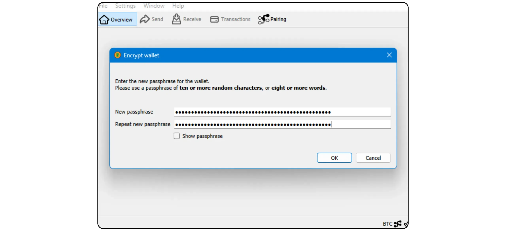
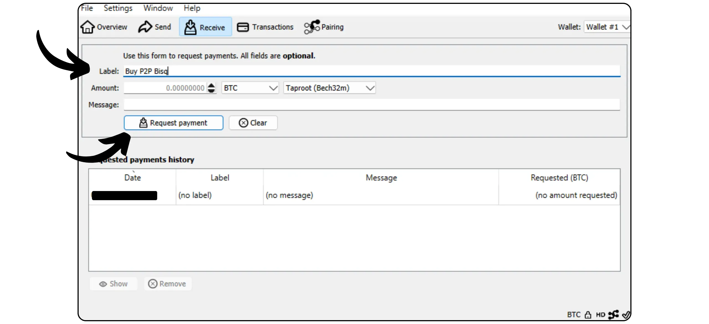
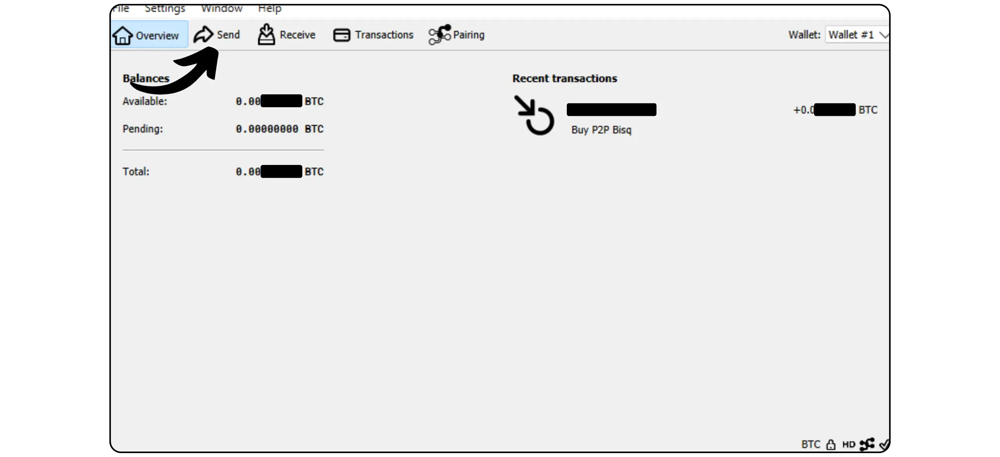

Bitcoin Knot adalah implementasi alternatif dari protokol Bitcoin, yang berasal dari Bitcoin Core. Dirancang dan dikelola oleh Luke Dashjr, ia menawarkan beberapa fitur tambahan dan penyesuaian aturan dari Mempool, namun tetap kompatibel dengan node lain di jaringan. Bitcoin Knots mengintegrasikan Bitcoin Wallet, tetapi juga dapat digunakan sebagai simpul Bitcoin sederhana bersama dengan perangkat lunak Wallet lainnya.

## Mengapa menggunakan Knot daripada Core?

Saat ini, Core adalah implementasi mayoritas protokol Bitcoin di jaringan. Protokol Bitcoin hanyalah sekumpulan aturan. Dibutuhkan perangkat lunak untuk menerapkannya. Mesin yang menjalankan perangkat lunak yang mengimplementasikan protokol Bitcoin disebut node, dan semua node ini bersama-sama membentuk jaringan Bitcoin.

Sepanjang sejarah Bitcoin, banyak klien yang berasal dari perangkat lunak awal yang dikembangkan oleh Satoshi Nakamoto telah muncul. Saat ini (Maret 2025), Bitcoin Core adalah mayoritas, dengan hampir 98% node di jaringan Bitcoin menggunakan klien ini.

Namun, perangkat lunak alternatif juga tersedia. Ini bukan node yang terhubung dengan Altcoin seperti Bitcoin Cash, tetapi klien alternatif yang kompatibel dengan jaringan Bitcoin yang sebenarnya. Dari semua itu, Bitcoin Knot adalah yang paling terkenal. Saat ini mewakili sekitar 1,4% dari jaringan. Pelanggan alternatif lainnya masih sangat sedikit.


Ada dua alasan utama untuk menggunakan klien alternatif seperti Knot daripada Core:


- Teknis**: Klien-klien ini sering kali menawarkan opsi yang berbeda dengan Core, terutama dalam hal manajemen Mempool, dengan menentukan transaksi mana yang diterima dan disiarkan oleh node Anda.
- Kebijakan**: Beberapa orang lebih suka menggunakan klien alternatif seperti Knot untuk alasan non-teknis, terutama untuk mendukung alternatif dari Core dan dengan demikian mengurangi monopoli Core. Jika Core mengalami gangguan, akan sangat berguna untuk memiliki klien alternatif yang solid dan terpelihara dengan baik, tetapi juga mengetahui cara menggunakannya. Orang lain menggunakan Knot untuk tujuan protes, karena mereka telah kehilangan kepercayaan pada pengembang Core atau tidak setuju dengan manajemen klien mayoritas.

## Bagaimana cara memasang Bitcoin Knot?

Kunjungi [situs web resmi Bitcoin Knot] (https://bitcoinknots.org/#download) untuk mengunduh versi untuk sistem operasi Anda. Jangan lupa untuk mengunduh sidik jari dan tanda tangan untuk memverifikasi perangkat lunak. File-file ini juga tersedia [di repositori GitHub Bitcoin Knots](https://github.com/bitcoinknots/Bitcoin).


Sebelum menginstal perangkat lunak pada komputer Anda, kami sangat menyarankan agar Anda memeriksa keaslian dan integritasnya. Jika Anda tidak tahu caranya, lihatlah tutorial lain ini:

https://planb.network/tutorials/computer-security/data/integrity-authenticity-21d0420a-be02-4663-94a3-8d487f23becc
Setelah perangkat lunak diverifikasi, instal perangkat lunak dengan mengikuti langkah-langkah yang ditunjukkan pada panel instalasi.


## Meluncurkan IBD

Pertama kali Anda meluncurkan Bitcoin Knot, Anda akan dapat memilih direktori lokal di mana data simpul Anda (termasuk Blockchain, set UTXO dan parameter) akan disimpan.


Anda juga dapat memilih untuk memangkas data Blockchain untuk mempertahankan hanya blok yang terbaru. Opsi ini memungkinkan simpul Anda untuk memeriksa setiap blok secara keseluruhan dalam batas penyimpanan yang ditetapkan, sehingga secara bertahap menghapus blok tertua. Jika Anda memiliki ruang disk yang cukup (saat ini sekitar 650 GB, tetapi jumlah ini terus bertambah), biarkan opsi ini tidak dicentang. Jika ruang disk Anda terbatas, aktifkan pemangkasan dan tentukan kapasitas maksimum yang diizinkan.

Harap diperhatikan: Jika node Anda dipangkas dan Anda menggunakannya untuk menyinkronkan Wallet yang telah dipulihkan, Anda tidak akan dapat mengambil transaksi sebelum blok yang tersimpan secara lokal yang tertua.


Opsi lain yang tersedia adalah "*Asumsikan Valid*". Ini mempercepat sinkronisasi awal dengan melewatkan verifikasi tanda tangan untuk transaksi yang termasuk dalam blok sebelum blok tertentu.

Tujuan dari "*Asumsikan Valid*" adalah untuk mempercepat sinkronisasi pertama node tanpa mengurangi keamanan secara signifikan, dengan mengasumsikan bahwa transaksi-transaksi ini telah divalidasi secara besar-besaran oleh jaringan sebelumnya. Satu-satunya kompromi yang penting adalah bahwa node Anda tidak akan mendeteksi pencurian Bitcoin sebelumnya, tetapi masih akan menjamin keakuratan jumlah total bitcoin yang dikeluarkan. Node Anda akan memverifikasi semua tanda tangan transaksi setelah blok yang ditentukan. Pendekatan ini didasarkan pada asumsi bahwa transaksi yang sudah lama diterima oleh jaringan tanpa tantangan kemungkinan besar valid.

Misalnya, di sini, "*Asumsikan Valid*" diatur untuk memblokir no. 855 000 `00000000000000000000000233ea80aa10d38aa4486cd7033fffc2c4df556d0b9138`, yang diterbitkan pada tanggal 1 Agustus 2024. Selama IBD, node saya hanya akan memulai verifikasi tanda tangan penuh dari blok ini.


Kemudian klik pada tombol "*OK*" untuk meluncurkan *Pengunduhan Blok Awal*. Anda harus bersabar selama sinkronisasi node awal. Jika Anda ingin melanjutkan sinkronisasi nanti, cukup tutup perangkat lunak dan matikan komputer Anda. Sinkronisasi akan dilanjutkan tanpa hambatan pada saat Anda membuka program berikutnya.


## Menyiapkan Simpul Bitcoin Anda

Klik tab "*Settings*", kemudian pilih "*Options*".


Pada tab "*Main*", Anda mengakses parameter utama node:


- "*Start...*" secara otomatis meluncurkan node ketika komputer Anda dinyalakan untuk segera memulai sinkronisasi;
- "*Prune...*" menyesuaikan batas penyimpanan jika Anda memilih untuk memangkas Blockchain ;
- "*Cache basis data...*" menetapkan jumlah maksimum RAM yang diizinkan untuk node Anda;
- Terakhir, aktifkan "*Enable RPC server*" jika Anda ingin menghubungkan node Bitcoin Knots Anda ke perangkat lunak portofolio lainnya, seperti Sparrow Wallet atau Liana misalnya.


Pada tab "*Wallet*", Anda akan menemukan pengaturan untuk portofolio terintegrasi yang dapat Anda buat nanti di Knot. Saya sarankan Anda untuk mengaktifkan RBF dan kontrol koin. Anda juga dapat menentukan jenis skrip yang akan digunakan.


Tab "*Network*" berisi parameter jaringan yang dapat Anda sesuaikan dengan kebutuhan spesifik Anda.


Tab "*Mempool*" memungkinkan Anda untuk mengonfigurasi *Memory Pool*, yaitu pengelolaan transaksi yang belum dikonfirmasi yang disimpan dalam memori, dan ukuran maksimum yang dialokasikan untuk fungsi ini (300 MB secara default).


Tab "Penyaringan spam" adalah fitur Bitcoin Knot. Di sini Anda akan menemukan sejumlah pengaturan yang memungkinkan Anda untuk memilih transaksi mana yang akan Anda terima atau tolak untuk disiarkan. Tujuan utamanya adalah untuk membatasi penggunaan marjinal tertentu dari Bitcoin, khususnya meta-protokol, untuk memerangi praktik-praktik ini sambil menghindari kelebihan beban pada node Anda. Ini adalah pilihan politik, tergantung pada visi pribadi Anda tentang Bitcoin.

Anda juga akan menemukan parameter klasik seperti definisi ambang batas "*Dust*".

Akan tetapi, parameter ini hanya mempengaruhi aturan standardisasi. Node Anda akan terus menerima transaksi yang belum dikonfirmasi hanya jika transaksi tersebut termasuk dalam blok, agar tetap kompatibel dengan jaringan Bitcoin lainnya. Pengaturan ini hanya mengubah cara node Anda memproses dan mendistribusikan transaksi yang belum dikonfirmasi ke rekan-rekannya. Dalam praktiknya, karena Knot adalah minoritas, aturan yang ditetapkan secara default pada Bitcoin Core yang menentukan standarisasi pada jaringan.


Tab "*Mining*" memungkinkan Anda mengonfigurasi kemungkinan partisipasi node Anda dalam Mining, jika Anda ingin mengaktifkan fungsi ini.


Terakhir, tab "*Display*" menyangkut parameter yang berkaitan dengan grafik Interface, termasuk bahasa perangkat lunak.


## Membuat portofolio Bitcoin

Setelah sinkronisasi awal selesai, node Bitcoin Knot Anda sudah berfungsi penuh. Anda sekarang memiliki opsi untuk menghubungkan node ini ke perangkat lunak Wallet lainnya, atau menggunakan Hot Wallet bawaan secara langsung. Untuk melakukannya, klik tombol "*Buat Wallet baru*".


Berikan nama pada Wallet Anda. Anda juga dapat melindunginya dengan passphrase BIP39 dengan mengklik "*Enkripsi Wallet*". Setelah siap, klik tombol "*Create*".


passphrase BIP39 adalah kata sandi opsional yang dapat Anda pilih secara bebas, selain frasa Mnemonic, untuk meningkatkan keamanan Wallet Anda. Sebelum mengonfigurasi fitur ini, kami sangat menyarankan Anda untuk membaca artikel berikut ini, yang menjelaskan secara detail cara kerja passphrase secara teori, dan cara menghindari kesalahan yang dapat menyebabkan hilangnya bitcoin Anda secara permanen:

https://planb.network/tutorials/wallet/backup/passphrase-a26a0220-806c-44b4-af14-bafdeb1adce7
Jika Anda telah mengaktifkan opsi passphrase, pilihlah yang kuat dan simpanlah dengan hati-hati pada satu atau beberapa media fisik yang aman.



Portofolio Bitcoin Anda sekarang telah dibuat.


## Mencadangkan portofolio Bitcoin Anda

Bahkan sebelum Anda menerima bitcoin pertama Anda, sangat penting untuk membuat cadangan Bitcoin Wallet Anda agar Anda bisa memulihkan dana Anda jika terjadi kehilangan atau kerusakan komputer. Untuk melakukannya, klik pada tab "*File*" dan kemudian "*Backup Wallet*".


Operasi ini menghasilkan satu file yang dapat digunakan untuk memulihkan semua bitcoin Anda. Jadi berhati-hatilah, dan simpanlah di media eksternal yang aman.

## Menerima bitcoin

Untuk menerima bitcoin langsung ke Knot Wallet Anda, klik tombol "*Terima*".


Tetapkan "*Label*" pada Address Anda untuk memudahkan identifikasi tujuan dan memfasilitasi penggunaan *Coin Control* di masa mendatang. Anda juga dapat menentukan terlebih dahulu jumlah yang akan diterima pada Address ini, atau menambahkan pesan untuk pembayar. Setelah Anda mengatur parameter, klik "*Minta pembayaran*".



Bitcoin Knot kemudian menampilkan Address penerima, yang dapat Anda salin atau pindai dan kirimkan ke pembayar.


Setelah transaksi disiarkan, Anda dapat mengikuti statusnya secara langsung di menu "*Transactions*".


## Kirim bitcoin

Sekarang setelah Anda memiliki bitcoin di dalam Knot Wallet, Anda dapat mengirimkannya. Untuk melakukannya, klik tombol "*Kirim*".



Klik tombol "*Input...*" untuk memilih UTXO yang ingin Anda belanjakan dalam transaksi ini.


Masukkan Bitcoin Address penerima.


Tambahkan label untuk mengingat tujuan transaksi ini.


Masukkan jumlah yang ingin Anda kirim ke Address ini.


Klik tombol "*Pilih...*" untuk memilih tarif biaya yang sesuai untuk transaksi Anda, berdasarkan status jaringan saat ini.


Jika semuanya sudah sesuai dengan keinginan Anda, klik tombol "*Kirim*". Jika Anda menggunakan passphrase, Anda akan diminta untuk mengisinya pada tahap ini.


Periksa parameter transaksi Anda untuk terakhir kalinya, kemudian, jika semuanya sudah benar, klik tombol "*Kirim*" sekali lagi untuk menandatangani dan mendistribusikan transaksi Anda.


Transaksi Anda yang menunggu konfirmasi sekarang muncul di tab "*Transaksi*".


## Menghubungkan node Anda ke program lain

Bitcoin Knot yang terintegrasi dengan Interface untuk mengelola portofolio Bitcoin Anda belum tentu yang paling intuitif, dan fungsinya masih relatif terbatas. Namun, Anda dapat menghubungkan node Bitcoin Knot Anda ke perangkat lunak manajemen portofolio khusus untuk dengan mudah mengakses data Blockchain Bitcoin dan menyiarkan transaksi Anda.

Prosedurnya akan tergantung pada perangkat lunak yang digunakan, tetapi ada dua skenario utama: Bitcoin Knot diinstal pada komputer yang sama dengan perangkat lunak portofolio Anda, atau dijalankan pada mesin yang terpisah.

### Dengan Bitcoin Knot lokal:

Jika Bitcoin Knots terinstal di komputer Anda, cari file `Bitcoin.conf` di antara file perangkat lunak. Jika file ini tidak ada, Anda dapat membuatnya. Buka file tersebut dengan sebuah editor teks dan masukkan baris berikut ini:

```ini
server=1
```

Kemudian simpan perubahan Anda.

Anda juga dapat melakukan ini melalui grafik Bitcoin-QT Interface dengan menavigasi ke "*Pengaturan*" > "*Options...*" dan aktifkan opsi "*Enable RPC server*".

Jangan lupa untuk memulai ulang perangkat lunak setelah melakukan perubahan ini.


Kemudian buka perangkat lunak manajemen portofolio Anda (misalnya Sparrow Wallet atau Liana) dan masukkan jalur ke file cookie Anda, biasanya terletak di folder yang sama dengan `Bitcoin.conf`, tergantung sistem operasi Anda:

|**macOS**|~/Perpustakaan/Dukungan Aplikasi/Bitcoin

|---|---|

|**Windows**|%APPDATA%\Bitcoin|

|**Linux**|~/.Bitcoin|


Biarkan parameter lain sebagai default, URL `127.0.0.1` dan port `8332`, lalu klik "*Test Connection*".


### Dengan Bitcoin Knot jarak jauh:

Jika Bitcoin Knot diinstal pada mesin lain yang terhubung ke jaringan yang sama, pertama-tama cari file `Bitcoin.conf` di antara file perangkat lunak. Jika file ini belum ada, Anda dapat membuatnya. Buka file ini dengan editor teks dan tambahkan baris berikut:

```ini
server=1
```

Setelah mengedit file, pastikan Anda menyimpannya dalam folder yang sesuai untuk sistem operasi Anda:

|**macOS**|~/Perpustakaan/Dukungan Aplikasi/Bitcoin

|---|---|

|**Windows**|%APPDATA%\Bitcoin|

|**Linux**|~/.Bitcoin|

Operasi ini juga dapat dilakukan melalui grafik Bitcoin-QT Interface. Buka menu "*Settings*", kemudian "*Options...*", dan aktifkan opsi "*Enable RPC server*" dengan mencentang kotak yang sesuai. Jika file `Bitcoin.conf` tidak ada, Anda dapat membuatnya langsung dari Interface ini dengan mengklik "*Open Configuration File*".


Temukan IP Address dari mesin yang menghosting Bitcoin Knot di jaringan lokal Anda. Untuk melakukan ini, Anda dapat menggunakan alat seperti [Angry IP Scanner] (https://angryip.org/). Mari kita asumsikan, untuk kepentingan argumen, bahwa IP Address dari node Anda adalah `192.168.1.18`.

Pada berkas `Bitcoin.conf`, tambahkan baris berikut, atur `rpcbind=192.168.1.18` untuk mencocokkan IP Address node Anda.

```ini
[main]
rpcbind=127.0.0.1
rpcbind=192.168.1.18
rpcallowip=127.0.0.1
rpcallowip=192.168.1.0/24
```


Tambahkan juga nama pengguna dan kata sandi untuk sambungan jarak jauh ke file `Bitcoin.conf`. Pastikan untuk mengganti `loic` dengan nama pengguna Anda dan `my_password` dengan kata sandi yang kuat:

```ini
rpcuser=loic
rpcpassword=my_password
```


Setelah memodifikasi dan menyimpan file, jalankan kembali Bitcoin Knots.

Sekarang Anda dapat membuka perangkat lunak manajemen portofolio Anda (misalnya, Sparrow Wallet atau Liana). Pada Sparrow, buka tab "*User / Pass*". Masukkan nama pengguna dan kata sandi yang telah Anda konfigurasikan dalam file `Bitcoin.conf`. Biarkan parameter lainnya sebagai default, yaitu URL `127.0.0.1` dan port `8332`. Kemudian klik "*Test Connection*".


Sambungan sudah dibuat.

Sekarang Anda telah mengetahui semua tentang implementasi alternatif Bitcoin Knot.

Jika Anda merasa tutorial ini bermanfaat, saya akan sangat berterima kasih jika Anda mau memberikan jempol Green di bawah ini. Jangan ragu untuk membagikannya di jejaring sosial Anda. Terima kasih banyak!

Saya juga merekomendasikan tutorial lain yang menjelaskan cara menyiapkan simpul Lightning Anda sendiri:

https://planb.network/tutorials/node/lightning-network/alby-hub-62e6356c-6a6d-4134-8f22-c3b6afb9882a