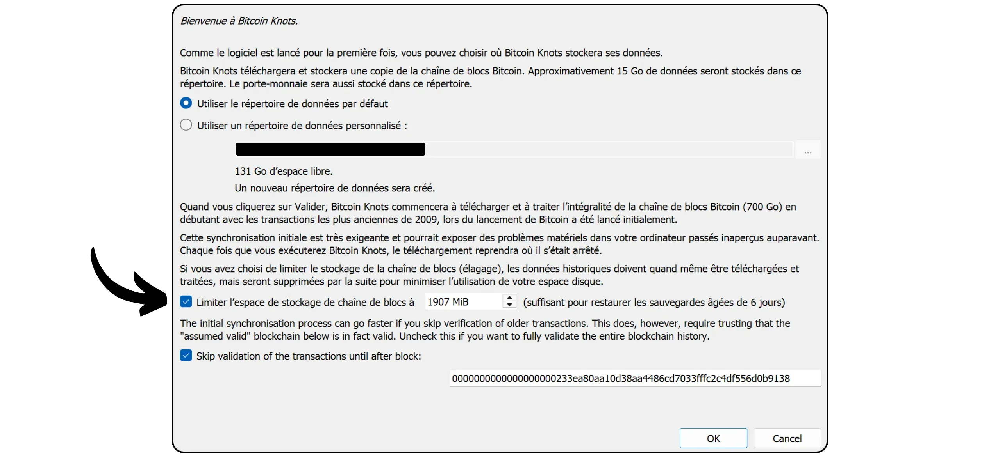
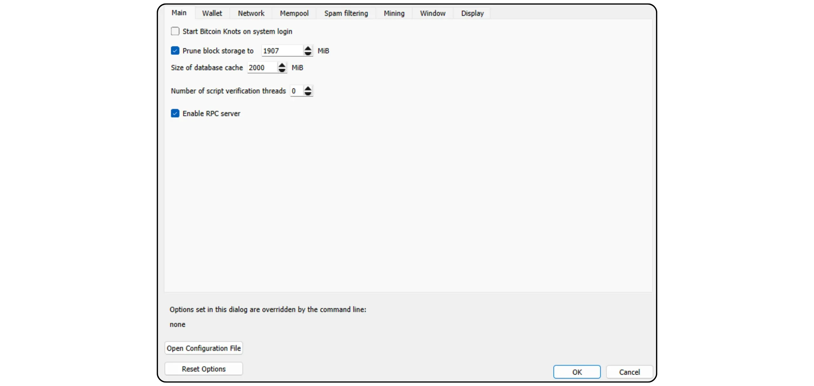
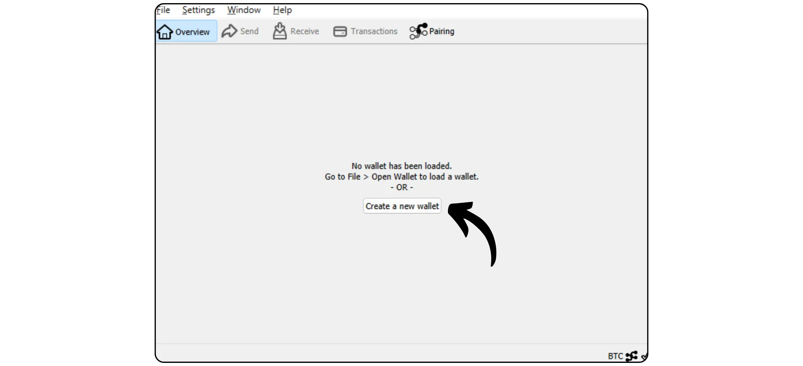
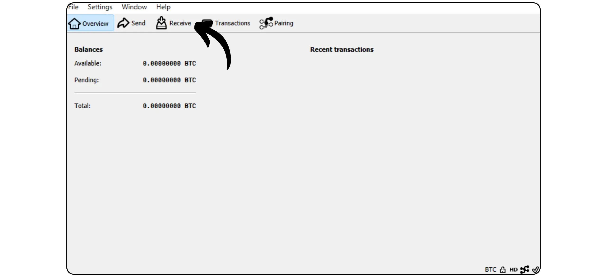

Bitcoin Knots è un'implementazione alternativa del protocollo Bitcoin, derivata dal Bitcoin Core. Progettato e mantenuto da Luke Dashjr, offre alcune funzionalità aggiuntive e regolazioni rispetto al Mempool, pur rimanendo compatibile con gli altri nodi della rete. Bitcoin Knots integra un Bitcoin Wallet, ma può anche essere utilizzato come semplice nodo Bitcoin insieme ad altri software Wallet.

## Perché usare i nodi piuttosto che il nucleo?

Attualmente, Core è l'implementazione principale del protocollo Bitcoin sulla rete. Il protocollo Bitcoin è solo un insieme di regole. Richiede un software per applicarle. Una macchina che esegue un software che implementa il protocollo Bitcoin è chiamata nodo e l'insieme di questi nodi costituisce la rete Bitcoin.

Nel corso della storia del Bitcoin, sono emersi numerosi client derivati dal software iniziale sviluppato da Satoshi Nakamoto. Oggi (marzo 2025), Bitcoin Core è la stragrande maggioranza, con quasi il 98% dei nodi della rete Bitcoin che utilizzano questo client.

Tuttavia, è disponibile anche un software alternativo. Non si tratta di nodi collegati a Altcoin come Bitcoin Cash, ma di client alternativi compatibili con la rete Bitcoin reale. Tra questi, Bitcoin Knots è il più noto. Attualmente rappresenta circa l'1,4% della rete. Gli altri clienti alternativi sono ancora una minoranza.


Ci sono due ragioni principali per utilizzare un client alternativo come Knots invece di Core:


- Tecnico**: Questi client offrono spesso diverse opzioni al Core, in particolare in termini di gestione del Mempool, determinando quali transazioni vengono accettate e trasmesse dal nodo.
- Politica**: Alcune persone preferiscono usare client alternativi come Knots per ragioni non tecniche, in particolare per supportare un'alternativa a Core e quindi ridurre il suo monopolio. Se Core fosse mai compromesso, sarebbe utile non solo avere client alternativi solidi e ben mantenuti, ma anche sapere come usarli. Altri usano Knots per protesta, perché hanno perso fiducia negli sviluppatori di Core o disapprovano la gestione del client di maggioranza.

## Come si installano i nodi Bitcoin?

Andate su [il sito ufficiale di Bitcoin Knots](https://bitcoinknots.org/#download) per scaricare la versione per il vostro sistema operativo. Non dimenticate di scaricare l'impronta digitale e le firme per verificare il software. Questi file sono disponibili anche [sul repository Bitcoin Knots GitHub](https://github.com/bitcoinknots/Bitcoin).


Prima di installare il software sul vostro computer, vi consigliamo di verificarne l'autenticità e l'integrità. Se non sapete come fare, date un'occhiata a quest'altra guida:

https://planb.network/tutorials/computer-security/data/integrity-authenticity-21d0420a-be02-4663-94a3-8d487f23becc
Una volta verificato il software, installarlo seguendo i passaggi indicati nel pannello di installazione.


## Avviare IBD

La prima volta che si avvia Bitcoin Knots, si potrà scegliere la directory locale in cui saranno memorizzati i dati del nodo (compresi i set e i parametri di Blockchain e UTXO).


È anche possibile scegliere di sfrondare i dati Blockchain per conservare solo i blocchi più recenti. Questa opzione consente al nodo di controllare ogni blocco nella sua interezza entro un limite di archiviazione stabilito, eliminando gradualmente i blocchi più vecchi. Se lo spazio su disco è sufficiente (attualmente circa 650 GB, ma il numero è in crescita), lasciare questa opzione non selezionata. Se lo spazio su disco è limitato, attivare il pruning e specificare la capacità massima consentita.

Nota bene: se il nodo è stato tagliato e viene utilizzato per sincronizzare un Wallet recuperato, non sarà possibile recuperare le transazioni precedenti al blocco più vecchio memorizzato localmente.



Un'altra opzione disponibile è "*Assume Valid*". Questa opzione accelera la sincronizzazione iniziale saltando la verifica della firma per le transazioni incluse nei blocchi precedenti a un blocco specifico.

Lo scopo di "*Assume Valid*" è quello di accelerare la prima sincronizzazione del nodo senza ridurre significativamente la sicurezza, assumendo che queste transazioni siano già state massicciamente convalidate dalla rete in precedenza. L'unico compromesso importante è che il nodo non rileverà eventuali furti di Bitcoin precedenti, ma garantirà comunque l'accuratezza del numero totale di bitcoin emessi. Il nodo verificherà tutte le firme delle transazioni dopo il blocco specificato. Questo approccio si basa sul presupposto che una transazione che è stata a lungo accettata dalla rete senza contestazioni è molto probabilmente valida.

Ad esempio, in questo caso, "*Assume Valid*" è impostato sul blocco n. 855 000 `0000000000000000000233ea80aa10d38aa4486cd7033fffc2c4df556d0b9138`, pubblicato il 1° agosto 2024. Durante l'IBD, il mio nodo avvierà quindi la verifica completa della firma solo a partire da questo blocco.


Quindi fare clic sul pulsante "*OK*" per avviare il download del blocco iniziale. È necessario avere pazienza durante la sincronizzazione iniziale dei nodi. Se si desidera riprendere la sincronizzazione in un secondo momento, è sufficiente chiudere il software e spegnere il computer. La sincronizzazione riprenderà senza problemi alla successiva apertura del programma.


## Impostazione del nodo Bitcoin

Fare clic sulla scheda "*Impostazioni*", quindi selezionare "*Opzioni*".


Nella scheda "*Main*" si accede ai parametri principali del nodo:


- "*Avvia...*" lancia automaticamente il nodo all'avvio del computer per iniziare immediatamente la sincronizzazione;
- "*Prune...*" regola il limite di memorizzazione se si è scelto di potare il Blockchain ;
- "*Cache del database...*" imposta la quantità massima di RAM consentita al nodo;
- Infine, attivare "*Abilita server RPC*" se si desidera collegare il nodo Bitcoin Knots ad altri software di portfolio, come Sparrow Wallet o Liana, ad esempio.



Nella scheda "*Wallet*" si trovano le impostazioni per il portafoglio integrato che si può creare in seguito su Nodi. Si consiglia di attivare il RBF e il controllo delle monete. È inoltre possibile definire il tipo di script da utilizzare.


La scheda "*Rete*" contiene parametri di rete che possono essere adattati alle proprie esigenze specifiche.


La scheda "*Mempool*" consente di configurare il *Memory Pool*, ossia la gestione delle transazioni non confermate memorizzate, e la dimensione massima assegnata a questa funzionalità (300 MB per impostazione predefinita).


La scheda "Filtro antispam" è una caratteristica di Bitcoin Knots. Qui si trovano una serie di impostazioni che consentono di scegliere quali transazioni accettare o rifiutare di trasmettere. L'obiettivo principale è quello di limitare alcuni usi marginali del Bitcoin, in particolare i metaprotocolli, al fine di combattere queste pratiche evitando di sovraccaricare il nodo. Si tratta di una scelta politica, che dipende dalla vostra visione personale del Bitcoin.

Troverete anche parametri classici come la definizione della soglia "*Dust*".

Tuttavia, questi parametri influenzano solo le regole di standardizzazione. Il vostro nodo continuerà ad accettare transazioni non confermate solo quando sono incluse in un blocco, per rimanere compatibile con il resto della rete Bitcoin. Queste impostazioni modificano solo il modo in cui il vostro nodo elabora e distribuisce le transazioni non confermate ai suoi pari. Queste impostazioni modificano solo il modo in cui il nodo elabora e distribuisce le transazioni non confermate ai suoi pari. In pratica, poiché Knots è in minoranza, sono le regole stabilite di default su Bitcoin Core a definire la standardizzazione della rete.


La scheda "*Mining*" consente di configurare l'eventuale partecipazione del nodo al Mining, se si desidera attivare questa funzione.


Infine, la scheda "*Display*" riguarda i parametri relativi alla grafica del Interface, compresa la lingua del software.


## Creare un portafoglio Bitcoin

Una volta completata la sincronizzazione iniziale, il nodo Bitcoin Nodi è completamente funzionante. Ora è possibile collegare questo nodo ad altri software Wallet o utilizzare direttamente il Hot Wallet integrato. A tale scopo, fare clic sul pulsante "*Crea un nuovo Wallet*".



Assegnate un nome al vostro Wallet. È inoltre possibile proteggerlo con un passphrase BIP39 facendo clic su "*Encrypt Wallet*". Una volta pronto, fare clic sul pulsante "*Crea*".


La passphrase BIP39 è una password opzionale che potete scegliere liberamente, in aggiunta alla vostra frase Mnemonic, per aumentare la sicurezza della vostra Wallet. Prima di configurare questa funzione, vi consigliamo vivamente di leggere il seguente articolo, che spiega in dettaglio il funzionamento teorico del passphrase e come evitare errori che potrebbero portare alla perdita permanente dei vostri bitcoin:

https://planb.network/tutorials/wallet/backup/passphrase-a26a0220-806c-44b4-af14-bafdeb1adce7
Se avete attivato l'opzione passphrase, sceglietene una robusta e salvatela con cura su uno o più supporti fisici sicuri.


Il vostro portafoglio Bitcoin è stato creato.


## Backup del portafoglio Bitcoin

Prima ancora di ricevere i primi bitcoin, è essenziale eseguire un backup del proprio Bitcoin Wallet, in modo da poter recuperare i fondi in caso di perdita o guasto del computer. A tale scopo, fare clic sulla scheda "*File*" e poi su "*Backup Wallet*".


Questa operazione genera un singolo file che può essere utilizzato per ripristinare tutti i bitcoin. Fate quindi molta attenzione e salvatelo su un supporto esterno sicuro.

## Ricevere bitcoin

Per ricevere bitcoin direttamente sul vostro Knots Wallet, cliccate sul pulsante "*Receive*".



Assegnate una "*etichetta*" al vostro Address per identificarne facilmente lo scopo e facilitare l'uso futuro del *Controllo monete*. È inoltre possibile definire in anticipo un importo preciso da ricevere presso questo Address, o aggiungere un messaggio per il pagatore. Una volta impostati i parametri, cliccate su "*Richiesta di pagamento*".


Bitcoin Knots visualizza quindi un Address di ricezione, che può essere copiato o scansionato e inviato al pagatore.


Una volta trasmessa una transazione, è possibile seguirne lo stato direttamente nel menu "*Transazioni*".


## Inviare bitcoin

Ora che avete dei bitcoin nel vostro Knots Wallet, potete inviarli. Per farlo, cliccate sul pulsante "*Invio*".


Fare clic sul pulsante "*Ingressi...*" per selezionare l'esatto UTXO che si desidera spendere per questa transazione.


Inserire il Bitcoin Address del destinatario.


Aggiungere un'etichetta per ricordare lo scopo di questa transazione.


Immettere l'importo che si desidera inviare a questo Address.


Fare clic sul pulsante "*Scegliere...*" per selezionare la tariffa appropriata per la transazione, in base allo stato attuale della rete.


Se tutto è di vostro gradimento, fate clic sul pulsante "*Invio*". Se si utilizza un passphrase, in questa fase verrà richiesto di compilarlo.


Controllare un'ultima volta i parametri della transazione e, se tutto è corretto, fare nuovamente clic sul pulsante "*Invio*" per firmare e distribuire la transazione.


La transazione in attesa di conferma appare ora nella scheda "*Transazioni*".


## Collegare il nodo a un altro programma

Il Bitcoin Knots integrato per la gestione del portafoglio Bitcoin non è necessariamente il più intuitivo e la sua funzionalità rimane relativamente limitata. Tuttavia, è possibile collegare il nodo Bitcoin Knots a un software specializzato nella gestione del portafoglio per accedere facilmente ai dati Blockchain Bitcoin e trasmettere le transazioni.

La procedura dipende dal software utilizzato, ma esistono due scenari principali: Bitcoin Knots è installato sullo stesso computer del software di portfolio, oppure viene eseguito su un computer separato.

### Con nodi locali Bitcoin :

Se Bitcoin Knots è installato sul computer, individuare il file `Bitcoin.conf` tra i file del software. Se questo file non esiste, è possibile crearlo. Aprirlo con un editor di testo e inserire la seguente riga:

```ini
server=1
```

Quindi salvare le modifiche.

È possibile farlo anche tramite la grafica Bitcoin-QT di Interface, andando su "*Impostazioni*" > "*Opzioni...*" e abilitando l'opzione "*Abilita server RPC*" > "*Opzioni...*" e attivando l'opzione "*Abilita server RPC*".

Non dimenticate di riavviare il software dopo aver apportato queste modifiche.


Quindi accedere al software di gestione del portafoglio (ad esempio Sparrow Wallet o Liana) e inserire il percorso del file cookie, solitamente situato nella stessa cartella del `Bitcoin.conf`, a seconda del sistema operativo:

|**macOS**~/Libreria/Application Support/Bitcoin|

|---|---|

|**Windows**|%APPDATA%\Bitcoin|

|**{\i}Linux {\i}~/.Bitcoin}


Lasciare gli altri parametri come predefiniti, URL `127.0.0.1` e porta `8332`, quindi fare clic su "*Test Connection*".


### Con nodi remoti Bitcoin :

Se Bitcoin Knots è installato su un'altra macchina collegata alla stessa rete, individuare prima il file `Bitcoin.conf` tra i file del software. Se questo file non esiste ancora, è possibile crearlo. Aprire questo file con un editor di testo e aggiungere la seguente riga:

```ini
server=1
```

Dopo aver modificato il file, assicuratevi di salvarlo nella cartella appropriata per il vostro sistema operativo:

|**macOS**~/Libreria/Application Support/Bitcoin|

|---|---|

|**Windows**|%APPDATA%\Bitcoin|

|**{\i}Linux {\i}~/.Bitcoin}

Questa operazione può essere eseguita anche tramite la grafica Bitcoin-QT di Interface. Accedere al menu "*Impostazioni*", quindi "*Opzioni...*", e attivare l'opzione "*Abilita server RPC*" selezionando la casella corrispondente. Se il file `Bitcoin.conf` non esiste, è possibile crearlo direttamente da questo Interface facendo clic su "*Apri file di configurazione*".


Trovare l'IP Address della macchina che ospita Bitcoin Knots sulla rete locale. Per farlo, si può usare uno strumento come [Angry IP Scanner](https://angryip.org/). Supponiamo, per amor di discussione, che l'IP Address del vostro nodo sia `192.168.1.18`.

Nel file `Bitcoin.conf`, aggiungere le seguenti righe, impostando `rpcbind=192.168.1.18` in modo che corrisponda all'IP Address del nodo.

```ini
[main]
rpcbind=127.0.0.1
rpcbind=192.168.1.18
rpcallowip=127.0.0.1
rpcallowip=192.168.1.0/24
```


Aggiungete anche un nome utente e una password per le connessioni remote al file `Bitcoin.conf`. Assicuratevi di sostituire `loic` con il vostro nome utente e `my_password` con una password forte:

```ini
rpcuser=loic
rpcpassword=my_password
```


Dopo aver modificato e salvato il file, riavviare Bitcoin Knots.

A questo punto è possibile accedere al software di gestione del portafoglio (ad esempio Sparrow Wallet o Liana). Su Sparrow, andare alla scheda "*User / Pass*". Inserire il nome utente e la password configurati nel file `Bitcoin.conf`. Lasciare gli altri parametri come predefiniti, ossia l'URL `127.0.0.1` e la porta `8332`. Quindi fare clic su "*Test Connection*".


La connessione è stabilita.

Ora sapete tutto sull'implementazione alternativa di Bitcoin Knots.

Se avete trovato utile questa esercitazione, vi sarei molto grato se lasciaste un pollice Green qui sotto. Sentitevi liberi di condividerlo sui vostri social network. Grazie mille!

Raccomando anche quest'altro tutorial in cui spiego come impostare il proprio nodo Lightning:

https://planb.network/tutorials/node/lightning-network/alby-hub-62e6356c-6a6d-4134-8f22-c3b6afb9882a