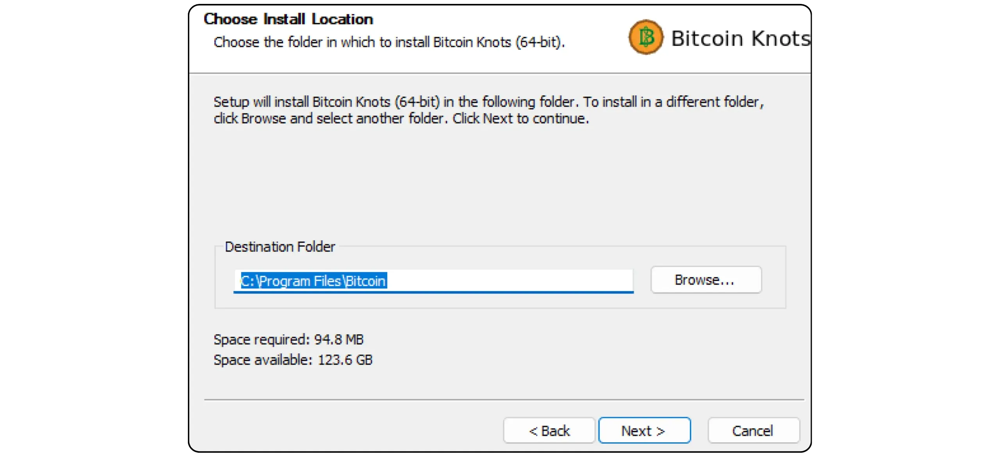

Bitcoin Knotsは、Bitcoin Coreから派生したBitcoinプロトコルの代替実装です。Luke Dashjrによって設計・保守され、ネットワーク上の他のノードとの互換性を保ちつつ、Mempoolからいくつかの追加機能とルール調整を提供しています。Bitcoin KnotsはBitcoin Walletを統合していますが、他のWalletソフトウェアと一緒に単純なBitcoinノードとしても使用できます。

## なぜコアではなくノットを使うのか？

現在、Coreはネットワーク上でBitcoinプロトコルの大半を実装している。Bitcoinプロトコルはルールの集合に過ぎない。それを適用するにはソフトウェアが必要です。Bitcoinプロトコルを実装したソフトウェアが動作するマシンはノードと呼ばれ、これらすべてのノードがBitcoinネットワークを構成します。

Bitcoinの歴史を通じて、Satoshiナカモトが開発した初期ソフトウェアから派生した数多くのクライアントが登場してきた。現在（2025年3月）ではBitcoinコアが圧倒的多数であり、Bitcoinネットワーク上のほぼ98％のノードがこのクライアントを使用している。

ただし、代替ソフトも用意されている。これらはBitcoin CashのようなAltcoinリンクノードではなく、実際のBitcoinネットワークと互換性のある代替クライアントである。このうち、Bitcoin Knotsが最もよく知られている。現在ネットワークの約1.4％を占めている。その他の代替顧客はまだ非常に少数派である。


Coreの代わりにKnotsのような代替クライアントを使う主な理由は2つある：


- テクニカル**：これらのクライアントはCoreに異なるオプションを提供することが多く、特にMempool管理に関しては、どのトランザクションを受け入れ、ノードにブロードキャストするかを決定する。
- ポリシー**：Knotsのような代替クライアントを使うことを好む人もいますが、それは技術的な理由ではなく、Coreの代替クライアントをサポートすることで、Coreの独占を減らすためです。もしCoreが危険にさらされるようなことがあれば、しっかりした、よく整備された代替クライアントを持つだけでなく、その使い方を知っておくことも有用でしょう。また、Coreの開発者への信頼を失ったり、多数派のクライアントの運営に不服があったりするため、抗議の目的でKnotsを使う人もいる。

## Bitcoinノットの取り付け方法は？

Bitcoin Knots公式ウェブサイト](https://bitcoinknots.org/#download)にアクセスし、お使いのOSに対応したバージョンをダウンロードしてください。ソフトウェアを確認するためにフィンガープリントと署名をダウンロードすることを忘れないでください。これらのファイルは[Bitcoin Knots GitHubリポジトリ](https://github.com/bitcoinknots/Bitcoin)でも入手可能です。


あなたのマシンにソフトウェアをインストールする前に、その真正性と完全性をチェックすることを強くお勧めします。方法がわからない場合は、こちらのチュートリアルをご覧ください：

https://planb.network/tutorials/computer-security/data/integrity-authenticity-21d0420a-be02-4663-94a3-8d487f23becc
ソフトウェアが確認されたら、インストールパネルに表示されている手順に従ってインストールしてください。



## IBDの立ち上げ

Bitcoin Knotsの初回起動時に、ノードデータ（Blockchain、UTXOセット、パラメータを含む）を保存するローカルディレクトリを選択できるようになります。


また、Blockchainデータをプルーニングして、最新のブロックのみを保持することもできる。このオプションにより、ノードは設定されたストレージ制限内で各ブロックを全体的にチェックし、最も古いブロックを徐々に削除することができます。十分なディスク容量がある場合（現在約650GBですが、この数字は増え続けています）、このオプションはチェックしないままにしておいてください。ディスク容量が限られている場合は、プルーニングを有効にして、許容される最大容量を指定してください。

注意：ノードがプルーニングされ、そのノードを使用して復旧したWalletを同期する場合、ローカルに保存された最も古いブロックより前のトランザクションを取り出すことはできません。


もう1つの利用可能なオプションは "*Assume Valid*"である。これは特定のブロックより前のブロックに含まれるトランザクションの署名検証をスキップすることで、初期同期を高速化する。

Assume Valid*」の目的は、これらの取引が事前にネットワークによってすでに大量に検証されていると仮定することで、セキュリティを大幅に低下させることなく、ノードの最初の同期を高速化することです。唯一の重要な妥協点は、あなたのノードが以前のBitcoinの盗難を検知しないことですが、それでも発行されたビットコインの総数の正確性は保証されます。あなたのノードは指定されたブロックの後にすべての取引署名を検証します。このアプローチは、長い間チャレンジなしでネットワークに受け入れられてきた取引は有効である可能性が高いという仮定に基づいています。

例えば、ここでは "*有効*と仮定する "がブロック番号に設定されている。855 000 `000000000000000233ea80aa10d38aa4486cd7033fffc2c4df556d0b9138`, published on August 1, 2024.IBDの間、私のノードはこのブロックからのみ完全な署名検証を開始する。


その後、"*OK*"ボタンをクリックして、*初期ブロックダウンロード*を開始します。最初のノード同期中は辛抱強く待つ必要があります。後で同期を再開したい場合は、単にソフトウェアを終了し、コンピュータの電源を切ってください。次にプログラムを開いたときに、同期は問題なく再開されます。


## Bitcoinノットのセッティング

設定*"タブをクリックし、"*オプション*"を選択します。


Main*"タブでは、ノードの主なパラメーターにアクセスします：


- "*起動...*"は、コンピュータの起動時に自動的にノードを起動し、直ちに同期を開始します；
- "*プルーン...*"は、Blockchainのプルーンを選択した場合、ストレージの上限を調整します；
- "*データベース・キャッシュ...*"は、ノードに許可されるRAMの最大量を設定します；
- 最後に、Bitcoin KnotsノードをSparrow WalletやLianaなどの他のポートフォリオソフトに接続したい場合は、「*RPCサーバーを有効にする*」を有効にしてください。


Wallet*」タブには、後でKnotsで作成できる統合ポートフォリオの設定があります。RBFとコインコントロールを有効にしておくことをお勧めします。また、使用するスクリプトの種類を定義することもできます。


Network*"タブにはネットワーク・パラメーターが含まれており、特定のニーズに合わせることができます。


Mempool*」タブでは、*メモリープール*、つまりメモリーに保存された未確認トランザクションの管理と、この機能に割り当てられる最大サイズ（デフォルトでは300MB）を設定できる。


スパムフィルタリング "タブはBitcoin Knotsの機能です。ここでは、どのトランザクションを受け入れるか、またはブロードキャストを拒否するかを選択することができます。主な目的は、Bitcoinの特定の限界的な使用、特にメタ・プロトコルを制限することです。これは政治的な選択であり、Bitcoinの個人的なビジョンに依存します。

また、"*Dust*"スレッショルドの定義など、クラシックなパラメーターも見つけることができる。

ただし、これらのパラメータは標準化ルールに影響するだけです。あなたのノードは、Bitcoinネットワークの他の部分との互換性を保つために、未確認トランザクションをブロックに含まれる場合にのみ受け入れ続けます。これらの設定は、あなたのノードが未確認トランザクションを処理し、ピアに分配する方法を変更するだけです。実際には、Knotsは少数派であるため、ネットワーク上の標準化を定義するのはBitcoin Coreでデフォルトで確立されたルールです。


Mining*」タブでは、ノードのMiningへの参加を設定することができます。


最後に、"*Display*"タブは、ソフトウェア言語を含むInterfaceグラフィックスに関するパラメーターに関係する。


## Bitcoinポートフォリオの作成

初期同期が完了すると、Bitcoin Knots ノードは完全に機能します。このノードを他のWalletソフトウェアに接続するか、内蔵のHot Walletを直接使用するかのオプションがあります。そのためには、"*Create a new Wallet*"ボタンをクリックしてください。


Walletに名前をつけてください。また、"*Encrypt Wallet*"をクリックすることで、passphrase BIP39で保護することができます。準備ができたら、"*Create*"ボタンをクリックしてください。


passphrase BIP39 は、Wallet のセキュリティを向上させるために、Mnemonic のフレーズに加えて自由に選択できるオプションのパスワードです。この機能を設定する前に、passphraseが理論的にどのように機能するのか、また、ビットコインの永久的な損失につながる可能性のある間違いをどのように避けるかについて詳しく説明している以下の記事を読むことを強くお勧めします：

https://planb.network/tutorials/wallet/backup/passphrase-a26a0220-806c-44b4-af14-bafdeb1adce7
passphraseオプションを有効にしている場合は、堅牢なものを選び、1つ以上の安全な物理メディアに慎重に保存すること。


これでBitcoinのポートフォリオは完成です。


## Bitcoinポートフォリオのバックアップ

最初のビットコインを受け取る前であっても、Bitcoin Walletのバックアップを作成し、紛失やコンピュータの故障の際に資金を回復できるようにしておくことが不可欠です。これを行うには、「*ファイル*」タブをクリックし、次に「*Walletのバックアップ*」をクリックしてください。


この操作は、すべてのビットコインを復元するために使用できる単一のファイルを生成します。そのため、十分に注意し、安全な外部媒体に保存してください。

## ビットコインを受け取る

Knots Walletに直接ビットコインを受け取るには、「*Receive*」ボタンをクリックしてください。


Addressに "*ラベル*"を割り当てることで、そのAddressの目的を簡単に特定し、将来*コインコントロール*を使用することを容易にします。また、このAddressで受け取る正確な金額を事前に定義したり、支払人へのメッセージを追加したりすることもできます。パラメータを設定したら、"*Request payment*"をクリックしてください。


Bitcoin Knotsは、受信Addressを表示し、コピーまたはスキャンして支払人に送信することができます。


トランザクションがブロードキャストされると、"*Transactions*"メニューでそのステータスを直接確認することができます。


## ビットコインを送る

これでKnots Walletにビットコインが入りましたので、送信することができます。送信するには、「*送信*」ボタンをクリックしてください。


入力...*」ボタンをクリックして、この取引に使用する正確なUTXOを選択します。


受信者のBitcoin Addressを入力する。


このトランザクションの目的を忘れないようにラベルを追加する。


このAddressに送りたい金額を入力してください。


選択...*"ボタンをクリックすると、現在のネットワーク状況に基づき、取引に適した手数料率が選択されます。


問題がなければ「*送信*」ボタンをクリックします。passphraseをお使いの方は、この段階で記入を求められます。


最後にもう一度トランザクションのパラメーターを確認し、問題がなければ、もう一度「*送信*」ボタンをクリックして、トランザクションに署名し、配信します。


確認待ちの取引が「*取引*」タブに表示されます。


## ノードを他のプログラムに接続する

Bitcoin ポートフォリオを管理するためのInterfaceを統合したBitcoin Knotsは、必ずしも最も直感的なものではなく、その機能は比較的限定的なままです。しかし、Blockchain Bitcoinデータに簡単にアクセスし、取引をブロードキャストするために、Bitcoin Knotsノードを専用のポートフォリオ管理ソフトウェアに接続することができます。

Bitcoin Knotsをポートフォリオソフトと同じコンピュータにインストールするか、別のマシンで実行するかです。

### 地元のBitcoinノットで：

Bitcoin Knotsがコンピュータにインストールされている場合、ソフトウェアファイルの中から`Bitcoin.conf`というファイルを探します。このファイルが存在しない場合は、作成することができます。テキストエディタで開き、以下の行を挿入してください：

```ini
server=1
```

その後、変更を保存します。

Bitcoin-QTのInterfaceグラフィックから、"*設定*">"*オプション...*"に移動し、"*RPCサーバーを有効にする*"オプションを有効にすることでも、これを行うことができます。> オプション...*"に移動し、"*RPCサーバーを有効にする*"オプションを有効にします。

変更後はソフトウェアを再起動することをお忘れなく。


その後、ポートフォリオ管理ソフト（Sparrow WalletやLianaなど）にアクセスし、Cookieファイルのパスを入力します。OSにもよりますが、通常は`Bitcoin.conf`と同じフォルダにあります：

|**macOS**|~/Library/Application Support/Bitcoin|をご覧ください。

|---|---|

|**Windows**|%APPDATA%\Bitcoin|

|**Linux**|〜/.Bitcoin|｜｜｜Bitcoin


他のパラメータはデフォルトのままにして、URL `127.0.0.1`とポート `8332` を指定し、"*Test Connection*"をクリックする。


### リモートBitcoinノット付き：

Bitcoin Knotsが同じネットワークに接続された別のマシンにインストールされている場合は、まずソフトウェアファイルの中から`Bitcoin.conf`ファイルを探します。このファイルがまだ存在しない場合は、作成することができます。テキストエディタでこのファイルを開き、以下の行を追加します：

```ini
server=1
```

ファイルを編集したら、お使いのオペレーティングシステムに適したフォルダに保存してください：

|**macOS**|~/Library/Application Support/Bitcoin|Library/Application Support/Bitcoin|Library/Application Support/Bitcoin

|---|---|

|**Windows**|%APPDATA%\Bitcoin|

|**Linux**|〜/.Bitcoin|｜｜｜Bitcoin

この操作は、Bitcoin-QT の Interface グラフィックスからも行うことができます。メニューの "*設定*"から "*オプション...*"に進み、"*RPCサーバーを有効にする*"オプションにチェックを入れて有効にします。Bitcoin.conf`ファイルが存在しない場合は、"*Open Configuration File*"をクリックして、このInterfaceから直接作成することができます。


ローカルネットワーク上のBitcoin KnotsをホストしているマシンのIP Addressを見つけてください。これを行うには、[Angry IP Scanner](https://angryip.org/)のようなツールを使用することができます。議論のために、あなたのノードのIP Addressが`192.168.1.18`であると仮定しましょう。

Bitcoin.conf`ファイルに以下の行を追加し、`rpcbind=192.168.1.18`をノードのIP Addressと一致するように設定する。

```ini
[main]
rpcbind=127.0.0.1
rpcbind=192.168.1.18
rpcallowip=127.0.0.1
rpcallowip=192.168.1.0/24
```


また、`Bitcoin.conf` ファイルにリモート接続用のユーザー名とパスワードを追加する。loic`をユーザー名に、`my_password`を強力なパスワードに置き換えてください：

```ini
rpcuser=loic
rpcpassword=my_password
```


ファイルを修正して保存したら、Bitcoin Knotsを再起動します。

ポートフォリオ管理ソフトウェア（Sparrow WalletまたはLianaなど）にアクセスします。Sparrowの "*User / Pass*"タブを開きます。Bitcoin.conf`ファイルに設定したユーザー名とパスワードを入力します。その他のパラメーターはデフォルトのまま、つまりURL `127.0.0.1`とポート `8332` のままにする。次に "*Test Connection*"をクリックする。


接続が確立される。

これで、Bitcoinノッツの代案がすべておわかりいただけただろう。

このチュートリアルが役に立ったと思ったら、下にGreenの親指を残していただけるととてもありがたい。あなたのソーシャルネットワークでシェアしてください。ありがとうございました！

Lightningノードのセットアップ方法については、こちらのチュートリアルもおすすめだ：

https://planb.network/tutorials/node/lightning-network/alby-hub-62e6356c-6a6d-4134-8f22-c3b6afb9882a