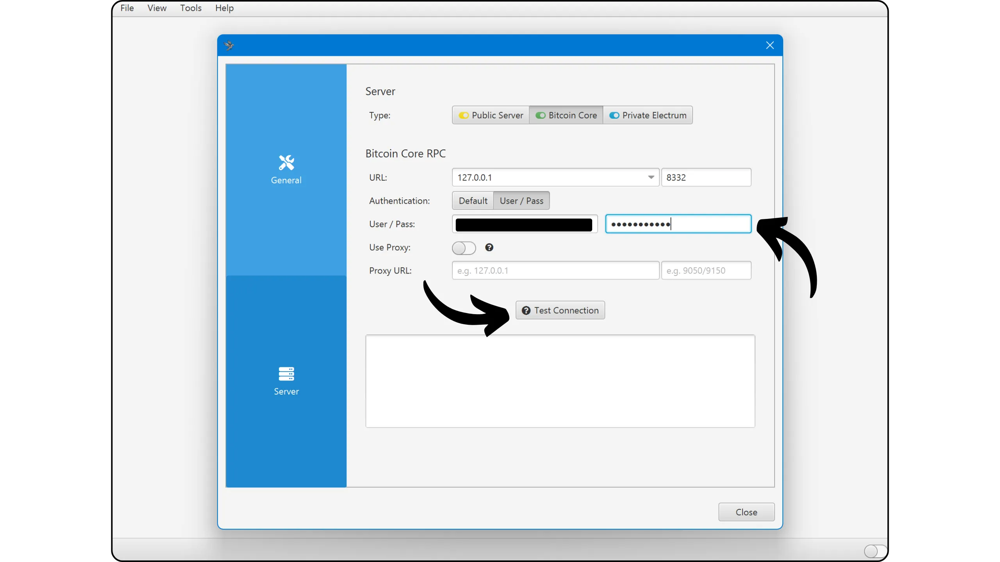

Bitcoin Knots er en alternativ implementering av Bitcoin-protokollen, avledet fra Bitcoin Core. Den er designet og vedlikeholdt av Luke Dashjr, og tilbyr noen ekstra funksjoner og regeljusteringer fra Mempool, samtidig som den er kompatibel med andre noder i nettverket. Bitcoin Knots integrerer en Bitcoin Wallet, men kan også brukes som en enkel Bitcoin-node sammen med annen Wallet-programvare.

## Hvorfor bruke Knots i stedet for Core?

For øyeblikket er Core den vanligste implementeringen av Bitcoin-protokollen i nettverket. Bitcoin-protokollen er bare et sett med regler. Det krever programvare for å anvende dem. En maskin som kjører programvare som implementerer Bitcoin-protokollen, kalles en node, og alle disse nodene utgjør til sammen Bitcoin-nettverket.

Gjennom Bitcoins historie har det dukket opp en rekke klienter som er avledet fra den opprinnelige programvaren utviklet av Satoshi Nakamoto. I dag (mars 2025) er Bitcoin Core den overveldende majoriteten, med nesten 98 % av nodene i Bitcoin-nettverket som bruker denne klienten.

Alternativ programvare er imidlertid også tilgjengelig. Dette er ikke Altcoin-koblede noder som Bitcoin Cash, men alternative klienter som er kompatible med det ekte Bitcoin-nettverket. Av disse er Bitcoin Knots den mest kjente. Det representerer for tiden rundt 1,4 % av nettverket. Andre alternative kunder er fortsatt i mindretall.


Det er to hovedgrunner til å bruke en alternativ klient som Knots i stedet for Core:


- Teknisk**: Disse klientene tilbyr ofte ulike alternativer til Core, særlig når det gjelder Mempool-administrasjon, ved å bestemme hvilke transaksjoner som skal aksepteres og kringkastes av noden din.
- Policy**: Noen foretrekker å bruke alternative klienter som Knots av ikke-tekniske grunner, særlig for å støtte et alternativ til Core og dermed redusere Core-monopolet. Hvis Core noen gang skulle bli kompromittert, ville det være nyttig ikke bare å ha solide, godt vedlikeholdte alternative klienter, men også å vite hvordan man bruker dem. Andre bruker Knots i protestøyemed, fordi de har mistet tilliten til Core-utviklerne eller misliker hvordan majoritetsklienten administreres.

## Hvordan installerer jeg Bitcoin-knuter?

Gå til [det offisielle nettstedet til Bitcoin Knots] (https://bitcoinknots.org/#download) for å laste ned versjonen for operativsystemet ditt. Ikke glem å laste ned fingeravtrykk og signaturer for å verifisere programvaren. Disse filene er også tilgjengelige [på Bitcoin Knots GitHub-repository](https://github.com/bitcoinknots/Bitcoin).


Før du installerer programvaren på maskinen din, anbefaler vi på det sterkeste at du sjekker ektheten og integriteten. Hvis du ikke vet hvordan, kan du ta en titt på denne andre veiledningen:

https://planb.network/tutorials/computer-security/data/integrity-authenticity-21d0420a-be02-4663-94a3-8d487f23becc
Når programvaren er bekreftet, installerer du den ved å følge trinnene som er angitt i installasjonspanelet.


## Lansering av IBD

Første gang du starter Bitcoin Knots, kan du velge den lokale katalogen der nodedataene dine (inkludert Blockchain- og UTXO-sett og parametere) skal lagres.


Du kan også velge å beskjære Blockchain-dataene slik at bare de nyeste blokkene beholdes. Med dette alternativet kan noden sjekke hver blokk i sin helhet innenfor en angitt lagringsgrense, slik at de eldste blokkene gradvis fjernes. Hvis du har tilstrekkelig diskplass (for øyeblikket rundt 650 GB, men dette tallet er økende), kan du la dette alternativet være ukontrollert. Hvis du har begrenset diskplass, aktiverer du beskjæring og angir den maksimalt tillatte kapasiteten.

Merk: Hvis noden din er beskåret og du bruker den til å synkronisere en gjenopprettet Wallet, vil du ikke kunne hente transaksjoner fra før den eldste lokalt lagrede blokken.


Et annet tilgjengelig alternativ er "*Anta gyldig*". Den innledende synkroniseringen går raskere ved at signaturverifisering for transaksjoner som er inkludert i blokker før en bestemt blokk, hoppes over.

Målet med "*Assume Valid*" er å fremskynde nodens første synkronisering uten å redusere sikkerheten betydelig, ved å anta at disse transaksjonene allerede har blitt massivt validert av nettverket på forhånd. Det eneste viktige kompromisset er at noden din ikke vil oppdage tidligere Bitcoin-tyverier, men den vil fortsatt garantere nøyaktigheten av det totale antallet utstedte bitcoins. Noden din vil verifisere alle transaksjonssignaturer etter den angitte blokken. Denne tilnærmingen er basert på antakelsen om at en transaksjon som lenge har blitt akseptert av nettverket uten å bli utfordret, mest sannsynlig er gyldig.

Her er for eksempel "*Assume Valid*" satt til blokk nr. 855 000 `000000000000000000000000000233ea80aa10d38aa4486cd7033fffc2c4df556d0b9138`, publisert 1. august 2024. Under IBD vil noden min derfor kun starte full signaturverifisering fra denne blokken.


Klikk deretter på "*OK*"-knappen for å starte *Initial Block Download*. Du må være tålmodig under den første nodesynkroniseringen. Hvis du ønsker å gjenoppta synkroniseringen senere, lukker du programvaren og slår av datamaskinen. Synkroniseringen vil fortsette uten problemer neste gang du åpner programmet.


## Sette opp Bitcoin-knuten din

Klikk på fanen "*Innstillinger*", og velg deretter "*Alternativer*".


I fanen "*Main*" får du tilgang til nodens hovedparametere:


- "*Start...*" starter noden automatisk når datamaskinen starter, slik at synkroniseringen kan starte umiddelbart;
- "*Prune...*" justerer lagringsgrensen hvis du har valgt å beskjære Blockchain ;
- "*Database cache...*" angir den maksimale mengden RAM som er tillatt for noden;
- Til slutt aktiverer du "*Enable RPC server*" hvis du ønsker å koble Bitcoin Knots-noden din til annen porteføljeprogramvare, som for eksempel Sparrow Wallet eller Liana.


I fanen "*Wallet*" finner du innstillingene for den integrerte porteføljen du kan opprette senere på Knots. Jeg anbefaler at du aktiverer RBF og myntkontroll. Du kan også definere hvilken type skript som skal brukes.


Fanen "*Nettverk*" inneholder nettverksparametere som du kan tilpasse til dine spesifikke behov.


Under fanen "*Mempool*" kan du konfigurere *Memory Pool*, dvs. håndtering av ubekreftede transaksjoner som er lagret i minnet, og den maksimale størrelsen som er allokert til denne funksjonen (300 MB som standard).


Fanen "Spam-filtrering" er en Bitcoin Knots-funksjon. Her finner du en rekke innstillinger som lar deg velge hvilke transaksjoner du vil godta eller nekte å kringkaste. Hovedformålet er å begrense visse marginale bruksområder for Bitcoin, spesielt metaprotokoller, for å bekjempe denne praksisen samtidig som du unngår å overbelaste noden din. Det er et politisk valg, avhengig av din personlige visjon av Bitcoin.

Du finner også klassiske parametere som for eksempel definisjonen av terskelen "*Dust*".

Disse parameterne påvirker imidlertid bare standardiseringsreglene. Noden din vil fortsette å godta ubekreftede transaksjoner bare når de er inkludert i en blokk, for å forbli kompatibel med resten av Bitcoin-nettverket. Disse innstillingene endrer bare måten noden din behandler og distribuerer ubekreftede transaksjoner til de andre nodene. I praksis, siden Knots er i mindretall, er det reglene som er etablert som standard på Bitcoin Core som definerer standardiseringen i nettverket.


Under fanen "*Mining*" kan du konfigurere nodens mulige deltakelse i Mining, hvis du ønsker å aktivere denne funksjonen.


Fanen "*Display*" inneholder parametere for Interface-grafikken, inkludert programvarens språk.


## Opprettelse av en Bitcoin-portefølje

Når den første synkroniseringen er fullført, er Bitcoin Knots-noden din fullt funksjonell. Du har nå muligheten til å koble denne noden til annen Wallet-programvare, eller bruke den innebygde Hot Wallet direkte. Dette gjør du ved å klikke på knappen "*Opprett en ny Wallet*".


Gi din Wallet et navn. Du kan også beskytte den med en passphrase BIP39 ved å klikke på "*Krypter Wallet*". Når du er klar, klikker du på knappen "*Create*".


passphrase BIP39 er et valgfritt passord som du kan velge fritt, i tillegg til Mnemonic frasen din, for å øke sikkerheten til din Wallet. Før du konfigurerer denne funksjonen, anbefaler vi deg på det sterkeste å lese følgende artikkel, som forklarer i detalj hvordan passphrase fungerer i teorien, og hvordan du kan unngå feil som kan føre til permanent tap av dine bitcoins:

https://planb.network/tutorials/wallet/backup/passphrase-a26a0220-806c-44b4-af14-bafdeb1adce7
Hvis du har aktivert passphrase-alternativet, bør du velge et robust alternativ og lagre det nøye på ett eller flere sikre fysiske medier.


Bitcoin-porteføljen din er nå opprettet.


## Sikkerhetskopiering av Bitcoin-porteføljen din

Allerede før du mottar dine første bitcoins, er det viktig å ta en sikkerhetskopi av din Bitcoin Wallet, slik at du kan gjenopprette pengene dine i tilfelle tap eller feil på datamaskinen. For å gjøre dette, klikk på "*File*"-fanen og deretter på "*Backup Wallet*".


Denne operasjonen genererer en enkelt fil som kan brukes til å gjenopprette alle bitcoinsene dine. Så vær veldig forsiktig, og lagre den på et sikkert eksternt medium.

## Motta bitcoins

For å motta bitcoins direkte til din Knots Wallet, klikk på "*Motta*"-knappen.


Tildel en "*Etikett*" til din Address for å enkelt identifisere formålet med den og forenkle fremtidig bruk av *Coin Control*. Du kan også på forhånd definere et nøyaktig beløp som skal mottas på denne Address, eller legge til en melding til betaleren. Når du har angitt parametrene, klikker du på "*Forespør betaling*".


Bitcoin Knots viser deretter en mottakende Address, som du kan kopiere eller skanne og sende til betaleren.


Når en transaksjon er sendt, kan du følge med på statusen direkte i menyen "*Transaksjoner*".


## Send bitcoins

Nå som du har bitcoins i Knots Wallet, kan du sende dem. For å gjøre det, klikk på "*Send*"-knappen.


Klikk på "*Input...*"-knappen for å velge de nøyaktige UTXO du ønsker å bruke på denne transaksjonen.


Skriv inn mottakerens Bitcoin Address.


Legg til en etikett for å huske formålet med denne transaksjonen.


Skriv inn beløpet du ønsker å sende til denne Address.


Klikk på "*Velg...*"-knappen for å velge riktig gebyrsats for transaksjonen din, basert på gjeldende nettverksstatus.


Hvis du er fornøyd med alt, klikker du på "*Send*"-knappen. Hvis du bruker en passphrase, blir du bedt om å fylle den ut på dette stadiet.


Kontroller transaksjonsparametrene en siste gang, og hvis alt er riktig, klikker du på "*Send*"-knappen igjen for å signere og distribuere transaksjonen.


Transaksjonen som venter på bekreftelse, vises nå i fanen "*Transaksjoner*".


## Koble noden din til et annet program

Bitcoin Knots' integrerte Interface for å administrere Bitcoin-porteføljen din er ikke nødvendigvis den mest intuitive, og funksjonaliteten er fortsatt relativt begrenset. Du kan imidlertid koble Bitcoin Knots-noden din til spesialisert programvare for porteføljeforvaltning for å få enkel tilgang til Blockchain Bitcoin-data og kringkaste transaksjonene dine.

Fremgangsmåten avhenger av programvaren som brukes, men det finnes to hovedscenarioer: Enten er Bitcoin Knots installert på samme datamaskin som porteføljeprogramvaren, eller så kjører den på en separat maskin.

### Med lokale Bitcoin-knuter :

Hvis Bitcoin Knots er installert på datamaskinen din, finner du filen `Bitcoin.conf` blant programvarefilene. Hvis denne filen ikke finnes, kan du opprette den. Åpne den med et tekstredigeringsprogram, og sett inn følgende linje:

```ini
server=1
```

Lagre deretter endringene.

Du kan også gjøre dette via Bitcoin-QTs Interface-grafikk ved å navigere til "*Innstillinger*" > "*Options...*" og aktivere alternativet "*Enable RPC server*".

Ikke glem å starte programvaren på nytt etter at du har gjort disse endringene.


Gå deretter til programvaren for porteføljeadministrasjon (f.eks. Sparrow Wallet eller Liana) og skriv inn banen til cookie-filen, som vanligvis ligger i samme mappe som `Bitcoin.conf`, avhengig av operativsystemet ditt:

|**macOS**|~/Bibliotek/Applikasjonsstøtte/Bitcoin|

|---|---|

|**Windows**|%APPDATA%\Bitcoin|

|**Linux**|~/.Bitcoin|


La de andre parameterne være standard, URL `127.0.0.1` og port `8332`, og klikk deretter på "*Test Connection*".


### Med fjernkontroll Bitcoin Knots :

Hvis Bitcoin Knots er installert på en annen maskin som er koblet til samme nettverk, må du først finne filen `Bitcoin.conf` blant programvarefilene. Hvis denne filen ikke finnes ennå, kan du opprette den. Åpne denne filen med et tekstredigeringsprogram, og legg til følgende linje:

```ini
server=1
```

Når du har redigert filen, må du sørge for å lagre den i riktig mappe for operativsystemet ditt:

|**macOS**|~/Library/Application Support/Bitcoin|

|---|---|

|**Windows**|%APPDATA%\Bitcoin|

|**Linux**|~/.Bitcoin|

Denne operasjonen kan også utføres via Bitcoin-QTs Interface-grafikk. Gå til menyen "*Settings*", deretter "*Options...*", og aktiver alternativet "*Enable RPC server*" ved å krysse av i den tilhørende boksen. Hvis filen `Bitcoin.conf` ikke finnes, kan du opprette den direkte fra denne Interface ved å klikke på "*Open Configuration File*".


Finn IP Address til maskinen som er vert for Bitcoin Knots i ditt lokale nettverk. For å gjøre dette kan du bruke et verktøy som [Angry IP Scanner] (https://angryip.org/). La oss for eksempel anta at IP Address til noden din er `192.168.1.18`.

I filen `Bitcoin.conf` legger du til følgende linjer, og setter `rpcbind=192.168.1.18` til å samsvare med IP Address for noden din.

```ini
[main]
rpcbind=127.0.0.1
rpcbind=192.168.1.18
rpcallowip=127.0.0.1
rpcallowip=192.168.1.0/24
```


Legg også til et brukernavn og passord for eksterne tilkoblinger i filen `Bitcoin.conf`. Sørg for å erstatte `loic` med ditt brukernavn og `my_password` med et sterkt passord:

```ini
rpcuser=loic
rpcpassword=my_password
```


Etter at du har endret og lagret filen, starter du Bitcoin Knots på nytt.

Du kan nå gå til programvaren for porteføljeforvaltning (f.eks. Sparrow Wallet eller Liana). I Sparrow går du til fanen "*Bruker/Passord*". Skriv inn brukernavnet og passordet du har konfigurert i filen `Bitcoin.conf`. La de andre parameterne være standard, dvs. URL `127.0.0.1` og port `8332`. Klikk deretter på "*Test Connection*".



Forbindelsen er opprettet.

Nå vet du alt om den alternative implementeringen av Bitcoin Knots.

Hvis du fant denne opplæringen nyttig, ville jeg være veldig takknemlig hvis du legger igjen en Green-tommel nedenfor. Del den gjerne på dine sosiale nettverk. Tusen takk skal du ha!

Jeg anbefaler også denne andre veiledningen, der jeg forklarer hvordan du setter opp din egen Lightning-node:

https://planb.network/tutorials/node/lightning-network/alby-hub-62e6356c-6a6d-4134-8f22-c3b6afb9882a