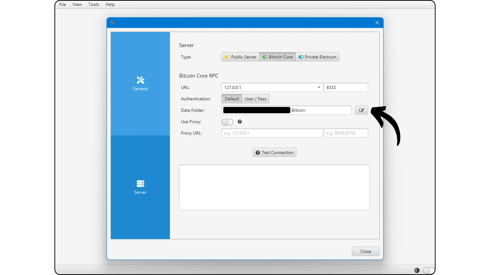

Bitcoin Knots é uma implementação alternativa do protocolo Bitcoin, derivado do Bitcoin Core. Projetado e mantido por Luke Dashjr, ele oferece alguns recursos adicionais e ajustes de regras do Mempool, mantendo-se compatível com outros nós na rede. Bitcoin Knots integra um Bitcoin Wallet, mas também pode ser usado como um simples nó Bitcoin junto com outro software Wallet.

## Porquê utilizar nós em vez de núcleo?

Atualmente, o Core é a implementação maioritária do protocolo Bitcoin na rede. O protocolo Bitcoin é apenas um conjunto de regras. Requer software para as aplicar. Uma máquina que executa o software que implementa o protocolo Bitcoin é chamada de nó, e todos esses nós juntos formam a rede Bitcoin.

Ao longo da história do Bitcoin, surgiram inúmeros clientes derivados do software inicial desenvolvido pelo Satoshi Nakamoto. Atualmente (março de 2025), o Bitcoin Core é a esmagadora maioria, com quase 98% dos nós da rede Bitcoin a utilizarem este cliente.

No entanto, também está disponível software alternativo. Não se trata de nós ligados ao Altcoin, como o Bitcoin Cash, mas de clientes alternativos compatíveis com a rede real do Bitcoin. Destes, o Bitcoin Knots é o mais conhecido. Representa atualmente cerca de 1,4% da rede. Outros clientes alternativos são ainda muito minoritários.


Há duas razões principais para utilizar um cliente alternativo como o Knots em vez do Core:


- Técnica**: Estes clientes oferecem frequentemente diferentes opções ao Core, nomeadamente em termos de gestão do Mempool, determinando quais as transacções que são aceites e difundidas pelo seu nó.
- Política**: Algumas pessoas preferem usar clientes alternativos como o Knots por razões não técnicas, nomeadamente para suportar uma alternativa ao Core e assim reduzir o seu monopólio. Se o Core alguma vez for comprometido, seria útil não apenas ter clientes alternativos sólidos e bem mantidos, mas também saber como usá-los. Outros usam o Knots para protestar, porque perderam a confiança nos programadores do Core ou desaprovam a gestão do cliente maioritário.

## Como é que instalo o Bitcoin Knots?

Vá para [o site oficial do Bitcoin Knots] (https://bitcoinknots.org/#download) para descarregar a versão para o seu sistema operativo. Não se esqueça de descarregar a impressão digital e as assinaturas para verificar o software. Estes ficheiros também estão disponíveis [no repositório GitHub do Bitcoin Knots](https://github.com/bitcoinknots/Bitcoin).


Antes de instalar o software no seu computador, recomendamos vivamente que verifique a sua autenticidade e integridade. Se não sabe como, consulte este outro tutorial:

https://planb.network/tutorials/computer-security/data/integrity-authenticity-21d0420a-be02-4663-94a3-8d487f23becc
Quando o software tiver sido verificado, instale-o seguindo os passos indicados no painel de instalação.


## Lançamento do IBD

Na primeira vez que iniciar o Bitcoin Knots, poderá escolher o diretório local onde os dados do seu nó (incluindo o Blockchain, o conjunto UTXO e os parâmetros) serão armazenados.


Também é possível optar por podar os dados do Blockchain para reter apenas os blocos mais recentes. Esta opção permite que o seu nó verifique cada bloco na sua totalidade dentro de um limite de armazenamento definido, removendo assim gradualmente os blocos mais antigos. Se tiver espaço suficiente em disco (atualmente cerca de 650 GB, mas este número está a aumentar), deixe esta opção desmarcada. Se o seu espaço em disco for limitado, active a poda e especifique a capacidade máxima permitida.

Atenção: Se o seu nó for podado e o utilizar para sincronizar um Wallet recuperado, não poderá recuperar transacções anteriores ao bloco mais antigo armazenado localmente.


Outra opção disponível é "*Assume Valid*". Esta opção acelera a sincronização inicial, ignorando a verificação de assinaturas para transacções incluídas em blocos anteriores a um bloco específico.

O objetivo de "*Assumir Válido*" é acelerar a primeira sincronização do nó sem reduzir significativamente a segurança, assumindo que estas transacções já foram massivamente validadas pela rede anteriormente. O único compromisso importante é que o seu nó não detectará quaisquer roubos anteriores de Bitcoin, mas continuará a garantir a exatidão do número total de bitcoins emitidos. O seu nó verificará todas as assinaturas de transação após o bloco especificado. Esta abordagem baseia-se no pressuposto de que uma transação que tenha sido aceite pela rede há muito tempo sem contestação é muito provavelmente válida.

Por exemplo, aqui, "*Assume Valid*" está definido para o bloco n. 855 000 `00000000000000000000000233ea80aa10d38aa4486cd7033fffc2c4df556d0b9138`, publicado em 1 de agosto de 2024. Por conseguinte, durante a IBD, o meu nó só iniciará a verificação completa da assinatura a partir deste bloco.


Em seguida, clique no botão "*OK*" para iniciar o *Initial Block Download*. Terá de ser paciente durante a sincronização inicial dos nós. Se desejar retomar a sincronização mais tarde, basta fechar o software e desligar o computador. A sincronização será retomada sem problemas na próxima vez que abrir o programa.


## Configurar o nó Bitcoin

Clique no separador "*Definições*" e, em seguida, selecione "*Opções*".


No separador "*Main*", tem acesso aos parâmetros principais do nó:


- "*Iniciar...*" inicia automaticamente o nó quando o computador arranca para iniciar imediatamente a sincronização;
- "*Prune...*" ajusta o limite de armazenamento se tiver optado por podar o Blockchain ;
- "*Database cache...*" define a quantidade máxima de RAM permitida para o seu nó;
- Por fim, active "*Enable RPC server*" se pretender ligar o seu nó Bitcoin Knots a outro software de carteira, como o Sparrow Wallet ou Liana, por exemplo.


No separador "*Wallet*", encontra as definições para a carteira integrada que pode criar mais tarde no Knots. Recomendo que active o RBF e o controlo de moedas. Também pode definir o tipo de script a utilizar.


O separador "*Rede*" contém parâmetros de rede que podem ser adaptados às suas necessidades específicas.


O separador "*Mempool*" permite-lhe configurar o *Memory Pool*, ou seja, a gestão das transacções não confirmadas armazenadas em memória, e o tamanho máximo atribuído a esta funcionalidade (300 MB por defeito).


O separador "Filtragem de spam" é uma funcionalidade do Bitcoin Knots. Aqui encontrará uma série de configurações que lhe permitem escolher quais as transacções que aceita ou recusa transmitir. O objetivo principal é limitar certas utilizações marginais do Bitcoin, em particular os meta-protocolos, de forma a combater estas práticas evitando sobrecarregar o seu nó. É uma escolha política, dependendo da sua visão pessoal do Bitcoin.

Encontrará também parâmetros clássicos, como a definição do limiar "*Dust*".

No entanto, estes parâmetros apenas influenciam as regras de normalização. O seu nó continuará a aceitar transacções não confirmadas apenas quando estas estiverem incluídas num bloco, de forma a permanecer compatível com o resto da rede Bitcoin. Estas configurações apenas modificam a forma como o seu nó processa e distribui as transacções não confirmadas aos seus pares. Na prática, como Knots está em minoria, são as regras estabelecidas por defeito no Bitcoin Core que definem a padronização na rede.


O separador "*Mining*" permite-lhe configurar a possível participação do seu nó no Mining, caso pretenda ativar esta função.


Por fim, o separador "*Display*" diz respeito aos parâmetros relativos aos gráficos do Interface, incluindo a linguagem do software.


## Criar uma carteira Bitcoin

Uma vez concluída a sincronização inicial, o seu nó Bitcoin Knots está totalmente funcional. Tem agora a opção de ligar este nó a outro software Wallet, ou utilizar diretamente o Hot Wallet incorporado. Para o fazer, clique no botão "*Create a new Wallet*".


Dê um nome ao seu Wallet. Pode também protegê-lo com um passphrase BIP39 clicando em "*Encriptar Wallet*". Quando estiver pronto, clique no botão "*Criar*".


O passphrase BIP39 é uma password opcional que pode escolher livremente, para além da sua frase Mnemonic, para aumentar a segurança do seu Wallet. Antes de configurar esta funcionalidade, aconselhamos vivamente a leitura do seguinte artigo, que explica em pormenor o funcionamento teórico do passphrase e como evitar erros que podem levar à perda permanente dos seus bitcoins:

https://planb.network/tutorials/wallet/backup/passphrase-a26a0220-806c-44b4-af14-bafdeb1adce7
Se tiver ativado a opção passphrase, escolha uma opção robusta e guarde-a cuidadosamente num ou mais suportes físicos seguros.


A sua carteira Bitcoin está agora criada.


## Salvaguardar a sua carteira Bitcoin

Mesmo antes de receberes os teus primeiros bitcoins, é essencial fazeres uma cópia de segurança do teu Bitcoin Wallet para que possas recuperar os teus fundos em caso de perda ou falha do computador. Para isso, clica no separador "*File*" e depois em "*Backup Wallet*".


Esta operação gera um único ficheiro que pode ser usado para restaurar todos os seus bitcoins. Por isso, tenha muito cuidado e guarde-o num suporte externo seguro.

## Receber bitcoins

Para receber bitcoins diretamente no seu Knots Wallet, clique no botão "*Receive*".


Atribua um "*Rótulo*" ao seu Address para identificar facilmente a sua finalidade e facilitar a utilização futura do *Controlo de Moedas*. Também pode definir antecipadamente um montante exato a receber neste Address, ou acrescentar uma mensagem para o pagador. Depois de ter definido os parâmetros, clique em "*Request payment*".


O Bitcoin Knots apresenta então um Address de receção, que pode ser copiado ou digitalizado e enviado ao pagador.


Depois de uma transação ter sido transmitida, pode seguir o seu estado diretamente no menu "*Transacções*".


## Enviar bitcoins

Agora que tens bitcoins no teu Knots Wallet, podes enviá-los. Para o fazer, clica no botão "*Enviar*".


Clique no botão "*Inputs...*" para selecionar o UTXO exato que pretende gastar nesta transação.


Introduzir o Bitcoin Address do destinatário.


Adicione uma etiqueta para recordar a finalidade desta transação.


Introduza o montante que pretende enviar para este Address.


Clique no botão "*Escolher...*" para selecionar a taxa adequada para a sua transação, com base no estado atual da rede.


Se tudo estiver a seu gosto, clique no botão "*Enviar*". Se estiver a utilizar um passphrase, ser-lhe-á pedido que o preencha nesta fase.


Verifique os parâmetros da transação uma última vez e, se tudo estiver correto, clique novamente no botão "*Enviar*" para assinar e distribuir a transação.


A sua transação a aguardar confirmação aparece agora no separador "*Transacções*".


## Ligar o nó a outro programa

O Bitcoin Knots integrado no Interface para gerir a sua carteira Bitcoin não é necessariamente o mais intuitivo, e a sua funcionalidade permanece relativamente limitada. No entanto, pode ligar o seu nó Bitcoin Knots a um software especializado de gestão de carteiras para aceder facilmente aos dados Blockchain Bitcoin e transmitir as suas transacções.

O procedimento dependerá do software utilizado, mas existem dois cenários principais: ou o Bitcoin Knots é instalado no mesmo computador que o software do seu portefólio, ou é executado numa máquina separada.

### Com nós locais Bitcoin :

Se o Bitcoin Knots estiver instalado no seu computador, localize o ficheiro `Bitcoin.conf` entre os ficheiros do software. Se este ficheiro não existir, pode criá-lo. Abra-o com um editor de texto e insira a seguinte linha:

```ini
server=1
```

Em seguida, guarde as suas alterações.

Também o pode fazer através do gráfico Interface do Bitcoin-QT, navegando para "*Settings*" > "*Opções...*" e activando a opção "*Ativar servidor RPC*".

Não se esqueça de reiniciar o software depois de efetuar estas alterações.


Em seguida, vá para o seu software de gestão de carteiras (por exemplo, Sparrow Wallet ou Liana) e introduza o caminho para o seu ficheiro cookie, normalmente localizado na mesma pasta que o `Bitcoin.conf`, dependendo do seu sistema operativo:

|**macOS**|~/Biblioteca/Suporte a aplicativos/Bitcoin|

|---|---|

|**Windows**|%APPDATA%\Bitcoin|

|**Linux**|~/.Bitcoin|



Deixe os outros parâmetros como padrão, URL `127.0.0.1` e porta `8332`, depois clique em "*Testar conexão*".


### Com controlo remoto Bitcoin Knots :

Se o Bitcoin Knots estiver instalado em outra máquina conectada à mesma rede, primeiro localize o arquivo `Bitcoin.conf` entre os arquivos do software. Se este ficheiro ainda não existir, pode criá-lo. Abra este ficheiro com um editor de texto e adicione a seguinte linha:

```ini
server=1
```

Depois de editar o ficheiro, certifique-se de que o guarda na pasta adequada ao seu sistema operativo:

|**macOS**|~/Biblioteca/Suporte a aplicativos/Bitcoin|

|---|---|

|**Windows**|%APPDATA%\Bitcoin|

|**Linux**|~/.Bitcoin|

Esta operação também pode ser efectuada através dos gráficos Bitcoin-QT do Interface. Vá ao menu "*Settings*", depois "*Options...*", e active a opção "*Enable RPC server*" marcando a caixa correspondente. Se o ficheiro `Bitcoin.conf` não existir, pode criá-lo diretamente a partir deste Interface, clicando em "*Open Configuration File*".


Encontre o IP Address da máquina que aloja o Bitcoin Knots na sua rede local. Para fazer isso, você pode usar uma ferramenta como [Angry IP Scanner] (https://angryip.org/). Vamos assumir, para fins de argumentação, que o IP Address do seu nó é `192.168.1.18`.

No ficheiro `Bitcoin.conf`, adicione as seguintes linhas, definindo `rpcbind=192.168.1.18` para corresponder ao IP Address do seu nó.

```ini
[main]
rpcbind=127.0.0.1
rpcbind=192.168.1.18
rpcallowip=127.0.0.1
rpcallowip=192.168.1.0/24
```


Adicione também um nome de utilizador e password para ligações remotas ao ficheiro `Bitcoin.conf`. Certifique-se de substituir `loic` pelo seu nome de usuário e `my_password` por uma senha forte:

```ini
rpcuser=loic
rpcpassword=my_password
```


Depois de modificar e guardar o ficheiro, reinicie o Bitcoin Knots.

Pode agora aceder ao seu software de gestão de carteiras (por exemplo, Sparrow Wallet ou Liana). No Sparrow, vá para o separador "*User / Pass*". Introduza o nome de utilizador e a palavra-passe que configurou no ficheiro `Bitcoin.conf`. Deixe os outros parâmetros como padrão, ou seja, URL `127.0.0.1` e porta `8332`. Depois clique em "*Test Connection*".


A ligação é estabelecida.

Agora já sabes tudo sobre a implementação alternativa do Bitcoin Knots.

Se achou este tutorial útil, ficaria muito grato se deixasse um polegar Green abaixo. Sinta-se à vontade para o partilhar nas suas redes sociais. Muito obrigado!

Também recomendo este outro tutorial no qual explico como configurar o seu próprio nó do Lightning:

https://planb.network/tutorials/node/lightning-network/alby-hub-62e6356c-6a6d-4134-8f22-c3b6afb9882a