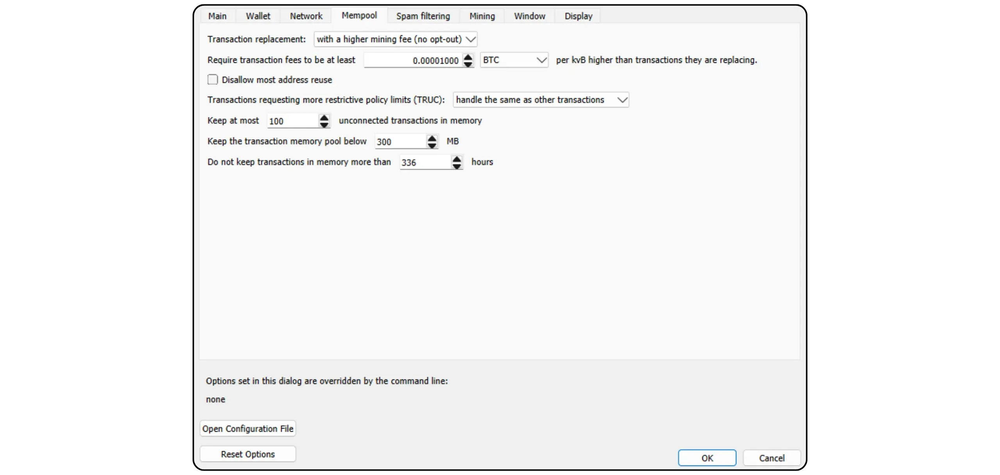
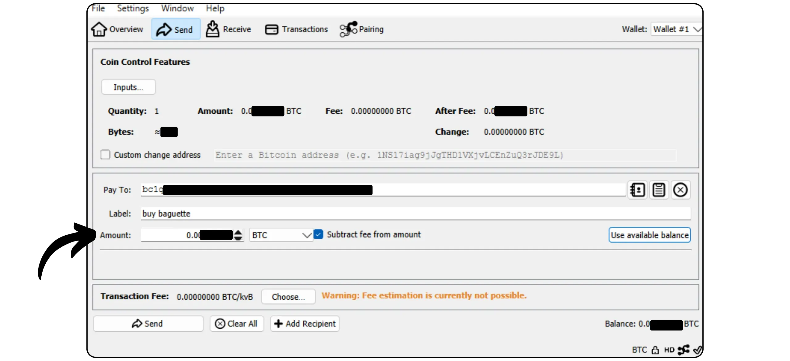
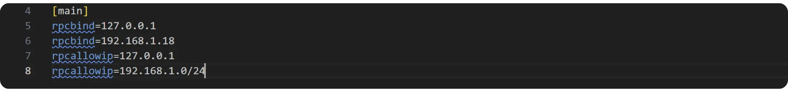
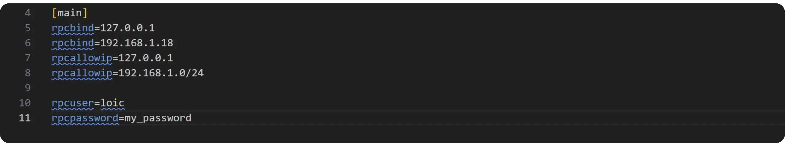

Bitcoin Knots - это альтернативная реализация протокола Bitcoin, полученная из Bitcoin Core. Разработанная и поддерживаемая Люком Дашджром, она предлагает некоторые дополнительные возможности и корректировки правил по сравнению с Mempool, оставаясь при этом совместимой с другими узлами в сети. Bitcoin Knots интегрирован в Bitcoin Wallet, но также может использоваться как простой узел Bitcoin вместе с другими программами Wallet.

## Почему стоит использовать узлы, а не сердечники?

В настоящее время Core является основной реализацией протокола Bitcoin в сети. Протокол Bitcoin - это просто набор правил. Для его применения требуется программное обеспечение. Машина, на которой запущено программное обеспечение, реализующее протокол Bitcoin, называется узлом, а все эти узлы вместе составляют сеть Bitcoin.

За всю историю существования Bitcoin появилось множество клиентов, созданных на основе первоначального программного обеспечения, разработанного Satoshi Накамото. Сегодня (март 2025 года) подавляющее большинство составляет Bitcoin Core, почти 98 % узлов в сети Bitcoin используют этот клиент.

Однако существует и альтернативное программное обеспечение. Это не узлы, привязанные к Altcoin, как в Bitcoin Cash, а альтернативные клиенты, совместимые с реальной сетью Bitcoin. Из них наиболее известен Bitcoin Knots. В настоящее время он составляет около 1,4 % сети. Другие альтернативные клиенты все еще находятся в меньшинстве.


Есть две основные причины использовать альтернативный клиент, например Knots, вместо Core:


- Технические**: Эти клиенты часто предлагают Core различные варианты, в частности, в плане управления Mempool, определяя, какие транзакции принимаются и транслируются вашим узлом.
- Политика**: Некоторые люди предпочитают использовать альтернативные клиенты, такие как Knots, по нетехническим причинам, в частности, чтобы поддержать альтернативу Core и таким образом уменьшить его монополию. Если Core когда-нибудь будет скомпрометирован, будет полезно не только иметь надежные, хорошо поддерживаемые альтернативные клиенты, но и знать, как ими пользоваться. Другие используют Knots в целях протеста, потому что потеряли доверие к разработчикам Core или не одобряют руководство клиента большинства.

## Как установить узлы Bitcoin?

Перейдите на [официальный сайт Bitcoin Knots](https://bitcoinknots.org/#download), чтобы загрузить версию для вашей операционной системы. Не забудьте загрузить отпечаток пальца и подписи для проверки программного обеспечения. Эти файлы также доступны [на GitHub-репозитории Bitcoin Knots](https://github.com/bitcoinknots/Bitcoin).


Прежде чем устанавливать программное обеспечение на свой компьютер, мы настоятельно рекомендуем проверить его подлинность и целостность. Если вы не знаете, как это сделать, ознакомьтесь с другим руководством:

https://planb.network/tutorials/computer-security/data/integrity-authenticity-21d0420a-be02-4663-94a3-8d487f23becc
После проверки программного обеспечения установите его, выполнив действия, указанные на панели установки.


## Запуск IBD

При первом запуске Bitcoin Knots вы сможете выбрать локальный каталог, в котором будут храниться данные вашего узла (включая наборы и параметры Blockchain, UTXO).


Вы также можете выбрать обрезку данных Blockchain, чтобы сохранить только самые последние блоки. Эта опция позволяет узлу проверять каждый блок целиком в пределах установленного лимита хранения, постепенно удаляя самые старые блоки. Если у вас достаточно места на диске (в настоящее время около 650 ГБ, но это число постоянно растет), оставьте эту опцию не отмеченной. Если дисковое пространство ограничено, активируйте обрезку и укажите максимально допустимый объем.

Обратите внимание: если ваш узел обрезан и вы используете его для синхронизации восстановленного Wallet, вы не сможете получить транзакции до самого старого локально сохраненного блока.


Еще одна доступная опция - "*Assume Valid*". Она ускоряет начальную синхронизацию, пропуская проверку подписи для транзакций, включенных в блоки, предшествующие определенному блоку.

Цель "*Assume Valid*" - ускорить первую синхронизацию узла без существенного снижения безопасности, предполагая, что эти транзакции уже были предварительно массово подтверждены сетью. Единственный важный компромисс заключается в том, что ваш узел не обнаружит никаких предыдущих краж Bitcoin, но он по-прежнему будет гарантировать точность общего количества выпущенных биткоинов. Ваш узел будет проверять подписи всех транзакций после указанного блока. Этот подход основан на предположении, что транзакция, которая долгое время принималась сетью без возражений, скорее всего, является действительной.

Например, здесь "*Assume Valid*" установлено на блок №. 855 000 `00000000000000000000000233ea80aa10d38aa4486cd7033fffc2c4df556d0b9138`, опубликованный 1 августа 2024 года. Поэтому во время IBD мой узел начнет полную проверку подписи только с этого блока.


Затем нажмите на кнопку "*OK*", чтобы запустить *Initial Block Download*. Во время начальной синхронизации узлов вам потребуется терпение. Если вы захотите возобновить синхронизацию позже, просто закройте программу и выключите компьютер. Синхронизация возобновится без проблем, когда вы откроете программу в следующий раз.


## Настройка узла Bitcoin

Перейдите на вкладку "*Настройки*", затем выберите "*Опции*".


На вкладке "*Основные*" вы получаете доступ к основным параметрам узла:


- "*Start...*" автоматически запускает узел при включении компьютера, чтобы немедленно начать синхронизацию;
- "*Prune...*" регулирует предел хранения, если вы выбрали обрезку Blockchain;
- "*Кэш базы данных...*" устанавливает максимальный объем оперативной памяти, разрешенный для вашего узла;
- Наконец, активируйте "*Enable RPC server*", если вы хотите подключить узел Bitcoin Knots к другому программному обеспечению портфеля, например, Sparrow Wallet или Liana.


На вкладке "*Wallet*" вы найдете настройки для интегрированного портфеля, который вы сможете создать позже в Knots. Я рекомендую вам активировать RBF и контроль монет. Вы также можете определить тип используемого скрипта.


Вкладка "*Сеть*" содержит параметры сети, которые вы можете адаптировать под свои нужды.


Вкладка "*Mempool*" позволяет настроить *пул памяти*, т.е. управление неподтвержденными транзакциями, хранящимися в памяти, и максимальный размер, выделенный для этой функциональности (по умолчанию 300 МБ).



Вкладка "Фильтрация спама" - это функция Bitcoin Knots. Здесь вы найдете ряд настроек, которые позволят вам выбрать, какие транзакции вы будете принимать или отказываться транслировать. Основная цель - ограничить некоторые маргинальные виды использования Bitcoin, в частности мета-протоколы, чтобы бороться с подобной практикой и в то же время не перегружать ваш узел. Это политический выбор, зависящий от вашего личного видения Bitcoin.

Вы также найдете классические параметры, такие как определение порога "*Dust*".

Однако эти параметры влияют только на правила стандартизации. Ваш узел будет продолжать принимать неподтвержденные транзакции только тогда, когда они включены в блок, чтобы оставаться совместимым с остальной сетью Bitcoin. Эти настройки изменяют только способ обработки и распределения неподтвержденных транзакций между вашими узлами. На практике, поскольку Knots находится в меньшинстве, именно правила, установленные по умолчанию в Bitcoin Core, определяют стандартизацию в сети.


Вкладка "*Mining*" позволяет настроить возможное участие вашего узла в Mining, если вы хотите активировать эту функцию.


Наконец, вкладка "*Display*" касается параметров, относящихся к графике Interface, включая язык программного обеспечения.


## Создание портфеля Bitcoin

После завершения начальной синхронизации ваш узел Bitcoin Knots полностью готов к работе. Теперь у вас есть возможность подключить этот узел к другим программам Wallet или использовать встроенный Hot Wallet напрямую. Для этого нажмите на кнопку "*Создать новый Wallet*".


Дайте своему Wallet имя. Вы также можете защитить его с помощью passphrase BIP39, нажав на кнопку "*Encrypt Wallet*". Когда все будет готово, нажмите на кнопку "*Создать*".


passphrase BIP39 - это дополнительный пароль, который вы можете выбрать по своему усмотрению, в дополнение к фразе Mnemonic, чтобы повысить безопасность вашего Wallet. Прежде чем настраивать эту функцию, мы настоятельно рекомендуем вам прочитать следующую статью, в которой подробно объясняется, как passphrase работает в теории, и как избежать ошибок, которые могут привести к безвозвратной потере ваших биткоинов:

https://planb.network/tutorials/wallet/backup/passphrase-a26a0220-806c-44b4-af14-bafdeb1adce7
Если вы активировали опцию passphrase, выберите надежный вариант и тщательно сохраните его на одном или нескольких защищенных физических носителях.


Теперь ваш портфель Bitcoin создан.


## Резервное копирование портфеля Bitcoin

Еще до того, как вы получите свои первые биткоины, необходимо сделать резервную копию Bitcoin Wallet, чтобы в случае потери или сбоя компьютера вы могли восстановить свои средства. Для этого перейдите на вкладку "*Файл*", а затем на "*Бэкап Wallet*".


В результате этой операции создается один файл, который можно использовать для восстановления всех ваших биткоинов. Поэтому будьте очень осторожны и сохраните его на безопасном внешнем носителе.

## Получение биткоинов

Чтобы получать биткоины непосредственно на ваш Knots Wallet, нажмите на кнопку "*Получить*".


Присвойте своему Address "*Метку*", чтобы легко определить его назначение и облегчить дальнейшее использование *Контроля монет*. Вы также можете заранее определить точную сумму, которая будет получена на этот Address, или добавить сообщение для плательщика. Задав параметры, нажмите на кнопку "*Запросить платеж*".


Bitcoin Knots затем отображает приемный Address, который вы можете скопировать или отсканировать и отправить плательщику.


После трансляции транзакции вы можете следить за ее статусом непосредственно в меню "*Транзакции*".


## Отправить биткойны

Теперь, когда у вас есть биткоины в Knots Wallet, вы можете отправить их. Для этого нажмите на кнопку "*Отправить*".


Нажмите на кнопку "*Вводы...*", чтобы выбрать точное количество UTXO, которое вы хотите потратить на эту операцию.


Введите Bitcoin Address получателя.


Добавьте метку, чтобы помнить о цели этой операции.


Введите сумму, которую вы хотите отправить на этот Address.



Нажмите на кнопку "*Выбрать...*", чтобы выбрать соответствующую ставку комиссии для вашей транзакции, исходя из текущего состояния сети.


Если вас все устраивает, нажмите на кнопку "*Отправить*". Если вы используете passphrase, вам будет предложено заполнить его на этом этапе.


Проверьте параметры транзакции в последний раз, затем, если все правильно, снова нажмите кнопку "*Отправить*", чтобы подписать и распространить транзакцию.


Ваша транзакция, ожидающая подтверждения, теперь отображается на вкладке "*Транзакции*".


## Подключение вашего узла к другой программе

Интегрированная в Bitcoin Knots программа Interface для управления портфелем Bitcoin не всегда является самой интуитивно понятной, а ее функциональность остается относительно ограниченной. Однако вы можете подключить свой узел Bitcoin Knots к специализированному программному обеспечению для управления портфелем, чтобы легко получить доступ к данным Blockchain Bitcoin и транслировать свои сделки.

Процедура зависит от используемого программного обеспечения, но есть два основных сценария: либо Bitcoin Knots устанавливается на том же компьютере, что и программа портфолио, либо запускается на отдельной машине.

### С локальными узлами Bitcoin :

Если на вашем компьютере установлена программа Bitcoin Knots, найдите файл `Bitcoin.conf` среди файлов программного обеспечения. Если этот файл не существует, вы можете создать его. Откройте его с помощью текстового редактора и вставьте следующую строку:

```ini
server=1
```

Затем сохраните изменения.

Вы также можете сделать это через графику Bitcoin-QT для Interface, перейдя в меню "*Настройки*" > "*Опции...*" и включив опцию "*Включить сервер RPC*".

Не забудьте перезапустить программу после внесения этих изменений.


Затем зайдите в программное обеспечение для управления портфелем (например, Sparrow Wallet или Liana) и введите путь к файлу cookie, который обычно находится в той же папке, что и `Bitcoin.conf`, в зависимости от операционной системы:

|**macOS**|~/Library/Application Support/Bitcoin|

|---|---|

|**Windows**|%APPDATA%\Bitcoin|

|**Linux**|~/.Bitcoin|


Оставьте остальные параметры по умолчанию, URL `127.0.0.1` и порт `8332`, затем нажмите на кнопку "*Test Connection*".


### С пультом Bitcoin Узлы :

Если Bitcoin Knots установлен на другой машине, подключенной к той же сети, сначала найдите файл `Bitcoin.conf` среди файлов программного обеспечения. Если этот файл еще не существует, вы можете создать его. Откройте этот файл в текстовом редакторе и добавьте следующую строку:

```ini
server=1
```

После редактирования файла убедитесь, что вы сохранили его в соответствующей папке для вашей операционной системы:

|**macOS**|~/Library/Application Support/Bitcoin|

|---|---|

|**Windows**|%APPDATA%\Bitcoin|

|**Linux**|~/.Bitcoin|

Эту операцию также можно выполнить через графический сервер Bitcoin-QT. Зайдите в меню "*Настройки*", затем "*Опции...*" и активируйте опцию "*Включить сервер RPC*", установив соответствующий флажок. Если файл `Bitcoin.conf` не существует, вы можете создать его прямо из этого Interface, нажав на кнопку "*Открыть файл конфигурации*".


Найдите IP Address компьютера, на котором установлен Bitcoin Knots, в вашей локальной сети. Для этого вы можете использовать такой инструмент, как [Angry IP Scanner](https://angryip.org/). Давайте предположим, что IP Address вашего узла - `192.168.1.18`.

В файл `Bitcoin.conf` добавьте следующие строки, установив `rpcbind=192.168.1.18` в соответствии с IP Address вашего узла.

```ini
[main]
rpcbind=127.0.0.1
rpcbind=192.168.1.18
rpcallowip=127.0.0.1
rpcallowip=192.168.1.0/24
```



Также добавьте имя пользователя и пароль для удаленных подключений в файл `Bitcoin.conf`. Обязательно замените `loic` на ваше имя пользователя, а `my_password` на надежный пароль:

```ini
rpcuser=loic
rpcpassword=my_password
```



После изменения и сохранения файла перезапустите Bitcoin Knots.

Теперь вы можете перейти к своему программному обеспечению для управления портфелем (например, Sparrow Wallet или Liana). В Sparrow перейдите на вкладку "*Пользователь/Пасс*". Введите имя пользователя и пароль, которые вы задали в файле `Bitcoin.conf`. Остальные параметры оставьте по умолчанию, т.е. URL `127.0.0.1` и порт `8332`. Затем нажмите на кнопку "*Тестировать соединение*".


Соединение установлено.

Теперь вы знаете все об альтернативной реализации Bitcoin Knots.

Если вы нашли это руководство полезным, я буду очень признателен, если вы оставите свой отзыв о Green. Не стесняйтесь поделиться им в своих социальных сетях. Большое спасибо!

Я также рекомендую этот другой учебник, в котором я объясняю, как создать свой собственный узел Lightning:

https://planb.network/tutorials/node/lightning-network/alby-hub-62e6356c-6a6d-4134-8f22-c3b6afb9882a