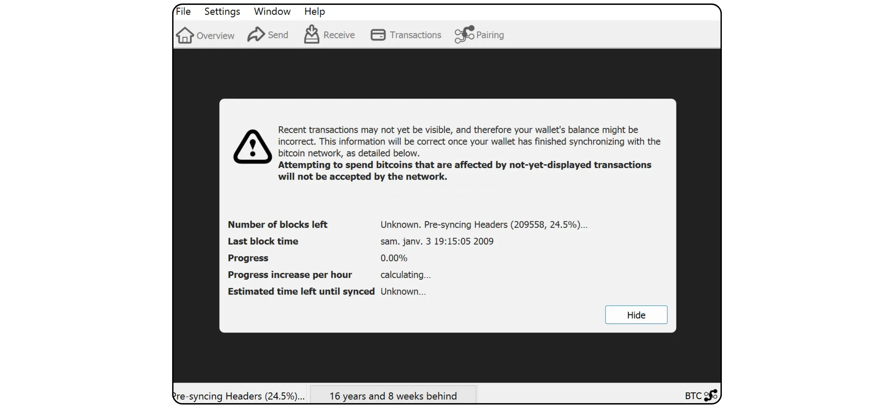
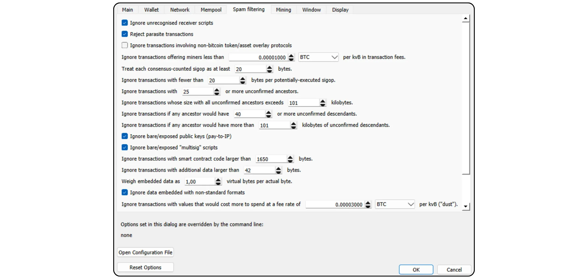
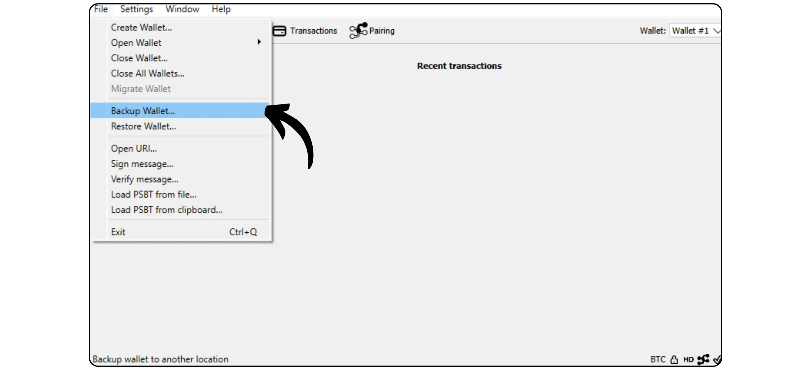
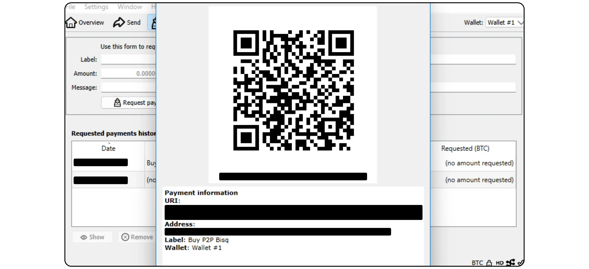

Bitcoin 节是 Bitcoin 协议的另一种实现方式，源自 Bitcoin 核心。它由 Luke Dashjr 设计和维护，在 Mempool 的基础上提供了一些附加功能和规则调整，同时与网络上的其他节点保持兼容。Bitcoin Knots 集成了 Bitcoin Wallet，但也可以作为一个简单的 Bitcoin 节点与其他 Wallet 软件一起使用。

## 为什么使用 "结 "而不是 "芯"？

目前，Core 是网络上 Bitcoin 协议的主要实施者。Bitcoin 协议只是一套规则。它需要软件来应用这些规则。运行执行 Bitcoin 协议软件的机器称为节点，所有这些节点共同组成 Bitcoin 网络。

在 Bitcoin 的整个历史中，出现了许多从 Satoshi Nakamoto 开发的初始软件衍生出来的客户端。如今（2025 年 3 月），Bitcoin Core 是绝大多数，Bitcoin 网络上几乎 98% 的节点都在使用这个客户端。

不过，也有替代软件。这些软件并非像 Bitcoin Cash 那样与 Altcoin 链接的节点，而是与真正的 Bitcoin 网络兼容的替代客户端。其中最著名的是 Bitcoin Knots。它目前约占网络的 1.4%。其他替代客户仍占极少数。


使用 Knots 等替代客户端而不是 Core 有两个主要原因：


- 技术**：这些客户端通常为 Core 提供不同的选项，特别是在 Mempool 管理方面，它们决定节点接受和广播哪些交易。
- 政策**：有些人出于非技术原因，特别是为了支持 Core 的替代方案，从而减少其垄断地位，而喜欢使用 Knots 等替代客户端。如果 Core 遭到破坏，那么不仅要有可靠、维护良好的替代客户端，还要知道如何使用它们。还有一些人出于抗议目的使用 Knots，因为他们对 Core 开发人员失去了信心，或者不赞成大多数客户端的管理方式。

## 如何安装 Bitcoin 结？

请访问 [Bitcoin Knots 官方网站](https://bitcoinknots.org/#download) 下载适用于您操作系统的版本。别忘了下载指纹和签名以验证软件。这些文件也可在 [Bitcoin Knots GitHub 存储库](https://github.com/bitcoinknots/Bitcoin) 中找到。


在您的机器上安装软件之前，我们强烈建议您检查其真实性和完整性。如果您不知道如何检查，请参阅本教程：

https://planb.network/tutorials/computer-security/data/integrity-authenticity-21d0420a-be02-4663-94a3-8d487f23becc
软件通过验证后，请按照安装面板中指示的步骤进行安装。


## 启动 IBD

首次启动 Bitcoin 结时，您可以选择存储节点数据（包括 Blockchain、UTXO 设置和参数）的本地目录。


您还可以选择剪切 Blockchain 数据，只保留最新的数据块。该选项允许您的节点在设定的存储限制内完整检查每个数据块，从而逐渐删除最旧的数据块。如果您有足够的磁盘空间（目前约为 650 GB，但这一数字还在增长），请不要选中该选项。如果磁盘空间有限，请激活剪枝并指定允许的最大容量。

请注意：如果您的节点被修剪，而您使用它来同步已恢复的 Wallet，您将无法检索本地存储的最旧块之前的事务。


另一个可用选项是 "*假设有效*"。它可以跳过对特定块之前的块中包含的事务的签名验证，从而加快初始同步。

假定有效*"的目的是通过假定这些交易已经事先通过网络的大规模验证，在不显著降低安全性的情况下加快节点的首次同步。唯一重要的妥协是，你的节点将不会检测到任何之前的 Bitcoin 盗窃，但仍会保证比特币发行总量的准确性。您的节点将在指定区块后验证所有交易签名。这种方法是基于这样一个假设，即长期被网络接受而未被质疑的交易很可能是有效的。

例如，这里的 "*假设有效*"设置为区块编号。855 000 `0000000000000000000233ea80aa10d38aa4486cd7033fffc2c4df556d0b9138`, 发布于 2024 年 8 月 1 日。因此，在 IBD 期间，我的节点将只从这个区块开始进行完整的签名验证。


然后点击 "*OK*"按钮，启动*初始块下载*。在初始节点同步期间，您需要耐心等待。如果您希望稍后恢复同步，只需关闭软件并关闭电脑。下次打开程序时，同步将顺利恢复。



## 设置 Bitcoin 结

点击 "*设置*"选项卡，然后选择 "*选项*"。


在 "*主*"选项卡中，您可以访问节点的主要参数：


- 当电脑启动时，"*Start...*"会自动启动节点，立即开始同步；
- 如果您选择修剪 Blockchain，"*Prune...*"将调整存储限制；
- "数据库缓存......*"设置节点允许的最大内存量；
- 最后，如果希望将 Bitcoin Knots 节点连接到 Sparrow Wallet 或 Liana 等其他组合软件，请激活 "*启用 RPC 服务器*"。


在 "*Wallet*"选项卡中，您可以找到稍后在 "结 "中创建的集成投资组合的设置。我建议您激活 RBF 和硬币控制。您还可以定义要使用的脚本类型。


网络*"选项卡包含网络参数，您可以根据具体需要进行调整。


通过 "*Mempool*"选项卡，您可以配置*内存池*，即管理存储在内存中的未确认事务，以及分配给该功能的最大容量（默认为 300 MB）。


垃圾邮件过滤 "选项卡是 Bitcoin 结的一项功能。在这里，您可以找到许多设置，允许您选择接受或拒绝广播哪些交易。主要目的是限制 Bitcoin 的某些边缘用途，特别是元协议，以打击这些做法，同时避免节点超载。这是一个政治选择，取决于你对 Bitcoin 的个人看法。

您还可以找到经典参数，如 "*Dust*"阈值的定义。

但是，这些参数只影响标准化规则。您的节点将继续接受未经确认的交易，只有当这些交易包含在一个区块中时，才能与 Bitcoin 网络的其他部分保持兼容。这些设置只会修改您的节点处理未确认交易并将其分配给同行的方式。在实践中，由于 Knots 是少数派，Bitcoin 核心默认建立的规则定义了网络的标准化。



如果希望激活 Mining，"*Mining*"选项卡可让您配置节点可能参与的 Mining。


最后，"*显示*"选项卡涉及与 Interface 图形有关的参数，包括软件语言。


## 创建 Bitcoin 组合

初始同步完成后，您的 Bitcoin 节点就可以正常工作了。现在您可以选择将该节点连接到其他 Wallet 软件，或直接使用内置的 Hot Wallet。为此，请点击 "*创建新的 Wallet*"按钮。


给 Wallet 起个名字。您还可以点击 "*加密 Wallet*"，用 passphrase BIP39 对其进行保护。准备就绪后，点击 "*创建*"按钮。


passphrase BIP39 是一个可选密码，您可以在 Mnemonic 短语之外自由选择，以提高 Wallet 的安全性。在配置此功能之前，我们强烈建议您阅读以下文章，其中详细解释了 passphrase 的理论工作原理，以及如何避免可能导致比特币永久丢失的错误：

https://planb.network/tutorials/wallet/backup/passphrase-a26a0220-806c-44b4-af14-bafdeb1adce7
如果您已激活 passphrase 选项，请选择一个强大的选项，并小心保存在一个或多个安全的物理介质上。


您的 Bitcoin 投资组合现已创建。


## 备份您的 Bitcoin 投资组合

即使在您收到第一枚比特币之前，也有必要备份您的 Bitcoin Wallet，以便在丢失或电脑故障时恢复您的资金。为此，请点击 "*文件*"标签，然后点击 "*备份 Wallet*"。



此操作会生成一个单一文件，可用于恢复所有比特币。因此要非常小心，并将其保存在安全的外部介质上。

## 接收比特币

要直接向您的 Knots Wallet 接收比特币，请点击 "*接收*"按钮。


为您的 Address 分配一个 "*标签*"，以便于识别其用途，并方便日后使用 "*硬币控制*"。您还可以预先确定该 Address 接收的精确金额，或为付款人添加信息。设置好参数后，点击 "*请求付款*"。


然后，Bitcoin Knots 会显示接收的 Address，您可以复制或扫描并发送给付款人。



交易广播后，您可以直接在 "*交易*"菜单中查看其状态。


## 发送比特币

现在您的 Knots Wallet 中已经有了比特币，您可以发送比特币了。为此，请点击 "*发送*"按钮。


点击 "*输入...*"按钮，选择您希望在此交易中使用的准确 UTXO。


输入收件人的 Bitcoin Address。


添加一个标签，以记住本次交易的目的。


输入您希望向该 Address 发送的金额。


点击 "*选择...*"按钮，根据当前网络状态为您的交易选择合适的费率。


如果一切都令您满意，请点击 "*发送*"按钮。如果您使用的是 passphrase，在此阶段会要求您填写。


最后一次检查交易参数，如果一切正常，再次点击 "*发送*"按钮，签署并分发交易。


您等待确认的交易现在会出现在 "*交易*"选项卡中。


## 将节点连接到另一个程序

Bitcoin Knots 用于管理 Bitcoin 投资组合的集成 Interface 不一定是最直观的，其功能仍然相对有限。不过，您可以将 Bitcoin Knots 节点连接到专门的投资组合管理软件，轻松访问 Blockchain Bitcoin 数据并广播您的交易。

操作步骤取决于所使用的软件，但主要有两种情况：要么 Bitcoin 结与投资组合软件安装在同一台计算机上，要么在另一台计算机上运行。

### 与当地的 Bitcoin 结 ：

如果计算机上安装了 Bitcoin 结，请在软件文件中找到文件 `Bitcoin.conf`。如果该文件不存在，您可以创建它。用文本编辑器打开该文件并插入以下一行：

```ini
server=1
```

然后保存更改。

您也可以通过 Bitcoin-QT 的 Interface 图形进行此操作，方法是导航至 "*设置*">"*选项...*"并启用 "*启用 RPC 服务器*"选项。

做完这些更改后，不要忘记重新启动软件。


然后进入组合管理软件（如 Sparrow Wallet 或 Liana），输入 cookie 文件的路径，根据操作系统的不同，cookie 文件通常与 "Bitcoin.conf "位于同一文件夹中：

|**macOS**|~/Library/Application Support/Bitcoin||

|---|---|

|**Windows**|%APPDATA%\Bitcoin|

|**Linux**||~/.Bitcoin|


其他参数保持默认，URL `127.0.0.1` 和端口 `8332`，然后点击 "*测试连接*"。


### 带遥控 Bitcoin 节 ：

如果 Bitcoin Knots 安装在连接到同一网络的另一台机器上，请首先在软件文件中找到 `Bitcoin.conf` 文件。如果该文件不存在，您可以创建它。用文本编辑器打开该文件，添加以下一行：

```ini
server=1
```

编辑文件后，确保将其保存在操作系统的相应文件夹中：

|**macOS**|~/Library/Application Support/Bitcoin||

|---|---|

|**Windows**|%APPDATA%\Bitcoin|

|**Linux**|~/.Bitcoin|

也可通过 Bitcoin-QT 的 Interface 图形执行此操作。进入 "*Settings*（设置）"菜单，然后进入 "*Options...*（选项...）"菜单，选中相应的复选框，激活 "*Enable RPC server*（启用 RPC 服务器*）"选项。如果 "Bitcoin.conf "文件不存在，可以点击 "*Open Configuration File*"（*打开配置文件*），直接从 Interface 创建该文件。


查找本地网络中托管 Bitcoin 结的机器的 IP Address。为此，您可以使用 [Angry IP Scanner](https://angryip.org/) 等工具。为了方便起见，我们假设您的节点的 IP Address 是 `192.168.1.18`。

在 "Bitcoin.conf "文件中添加以下几行，设置 "rpcbind=192.168.1.18 "以匹配节点的 IP Address。

```ini
[main]
rpcbind=127.0.0.1
rpcbind=192.168.1.18
rpcallowip=127.0.0.1
rpcallowip=192.168.1.0/24
```


同时在 `Bitcoin.conf` 文件中添加用于远程连接的用户名和密码。确保将 `loic` 替换为用户名，将 `my_password` 替换为高强度密码：

```ini
rpcuser=loic
rpcpassword=my_password
```


修改并保存文件后，重新启动 Bitcoin 结。

现在您可以进入组合管理软件（如 Sparrow Wallet 或 Liana）。在 Sparrow 上，进入 "*用户/密码*"选项卡。输入您在 Bitcoin.conf 文件中配置的用户名和密码。其他参数保持默认，即 URL `127.0.0.1` 和端口 `8332`。然后点击 "*测试连接*"。


连接已建立。

现在，您对 Bitcoin 结的替代实施方案已经了如指掌。

如果您觉得本教程有用，请在下面留下 Green 的大拇指，我将不胜感激。欢迎在您的社交网络上分享。非常感谢

我还推荐另一篇教程，其中介绍了如何建立自己的 Lightning 节点：

https://planb.network/tutorials/node/lightning-network/alby-hub-62e6356c-6a6d-4134-8f22-c3b6afb9882a