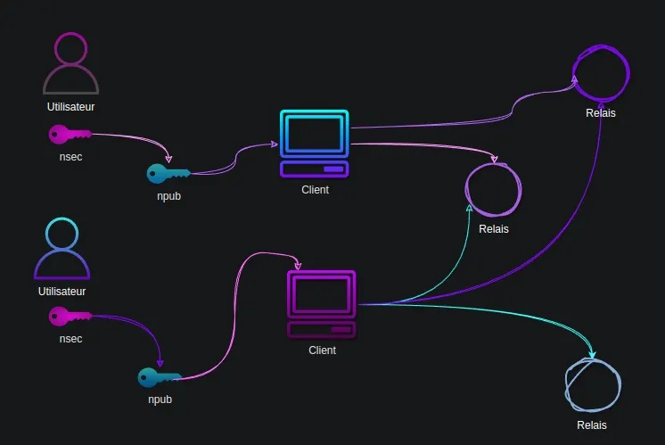
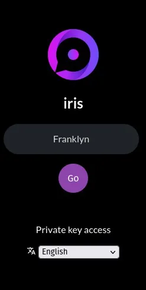
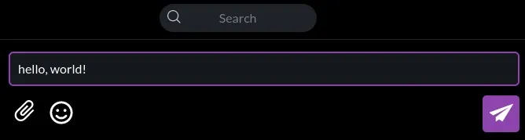
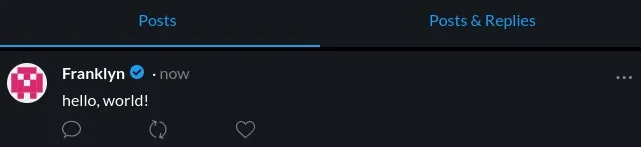
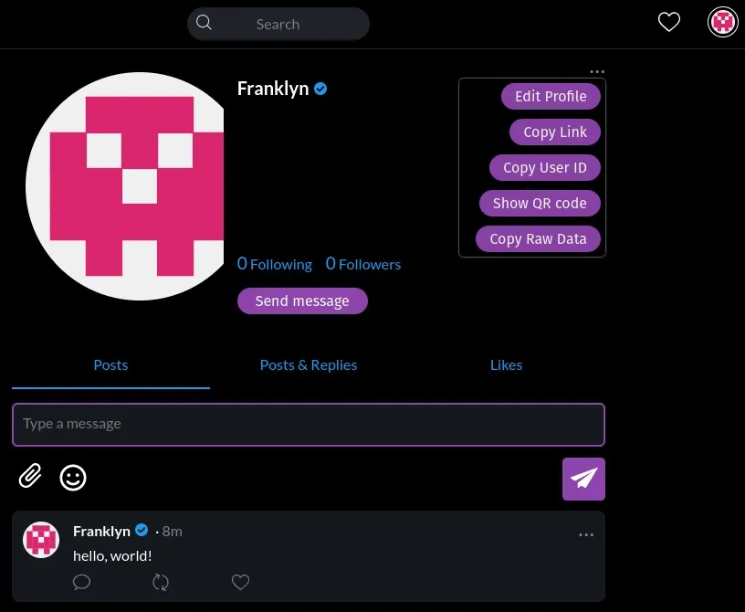
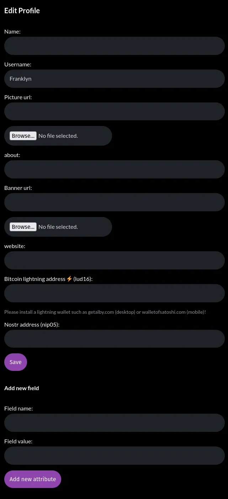
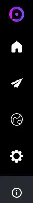
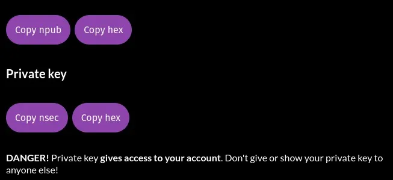

इस गाइड के अंत तक, आप समझ जाएंगे कि Nostr क्या है, आपने एक खाता बना लिया होगा, और आप इसे उपयोग करने में सक्षम होंगे।

## Nostr एक ओपन प्रोटोकॉल है जो सोशल नेटवर्किंग और मैसेजिंग के लिए उपयोग किया जाता है। इसका उद्देश्य एक विकेंद्रीकृत और सेंसरशिप-प्रतिरोधी प्लेटफॉर्म प्रदान करना है, जहां उपयोगकर्ता स्वतंत्र रूप से संवाद कर सकते हैं और जानकारी साझा कर सकते हैं। यह पारंपरिक सोशल मीडिया प्लेटफॉर्म्स से अलग है क्योंकि यह किसी एकल संस्था द्वारा नियंत्रित नहीं होता।

Nostr एक ऐसा प्रोटोकॉल है जिसमें ट्विटर, टेलीग्राम और अन्य सोशल मीडिया प्लेटफॉर्म्स को बदलने की क्षमता है। यह एक सरल और खुला प्रोटोकॉल है जो एक बार में ही एक वैश्विक रूप से स्थायी सोशल नेटवर्क बना सकता है।

## यह कैसे काम करता है?

Nostr तीन मुख्य घटकों पर आधारित है: की पेयर, क्लाइंट्स, और रिले।

प्रत्येक उपयोगकर्ता की एक या अधिक पहचान होती हैं, और प्रत्येक पहचान एक क्रिप्टोग्राफिक कुंजी जोड़ी द्वारा निर्धारित होती है।

नेटवर्क का उपयोग करने के लिए, आपको क्लाइंट सॉफ़्टवेयर का उपयोग करना होगा और सामग्री प्राप्त करने और भेजने के लिए रिले से कनेक्ट करना होगा।

## 1. क्रिप्टोग्राफिक कुंजियाँ

फेसबुक या ट्विटर के विपरीत, जहाँ उपयोगकर्ताओं को एक निजी कंपनी को ईमेल और ढेर सारी जानकारी देनी होती है, Nostr बिना किसी केंद्रीय प्राधिकरण के काम करता है। उपयोगकर्ता एक क्रिप्टोग्राफिक कुंजी जोड़ी बनाते हैं, जिसमें एक गुप्त कुंजी (जिसे निजी कुंजी भी कहा जाता है) और एक सार्वजनिक कुंजी शामिल होती है।

गुप्त कुंजी, nsec, जो केवल उपयोगकर्ता को पता होती है, का उपयोग प्रमाणीकरण और सामग्री प्रकाशित करने के लिए किया जाता है।

सार्वजनिक कुंजी, जिसे npub कहा जाता है, एक अनोखा पहचानकर्ता है जिससे किसी उपयोगकर्ता द्वारा प्रकाशित सभी सामग्री जुड़ी होती है। आपकी सार्वजनिक कुंजी आपके उपयोगकर्ता नाम की तरह होती है, जो अन्य उपयोगकर्ताओं को आपको खोजने और आपके Nostr फीड को सब्सक्राइब करने की अनुमति देती है।

## 2. ग्राहक

क्लाइंट्स ऐसे सॉफ़्टवेयर होते हैं जो Nostr के साथ बातचीत करने की सुविधा देते हैं। मुख्य क्लाइंट्स हैं:

- iOS: डैमस
- एंड्रॉइड: नीलमणि
- वेब: iris.to; snort.social; astral.ninja

ग्राहक उपयोगकर्ताओं को generate के माध्यम से एक नई कुंजी जोड़ी बनाने (जो कि एक खाता बनाने के बराबर है) या मौजूदा कुंजी जोड़ी के साथ प्रमाणीकरण करने की अनुमति देते हैं।

## 3. रिले

रिले सरल सर्वर होते हैं जिन्हें आप कभी भी छोड़ सकते हैं अगर आपको उनके द्वारा दिया गया कंटेंट पसंद नहीं आता। अगर आप चाहें तो आप अपना खुद का रिले भी चला सकते हैं।

💡 **प्रो टिप:** पेड रिले आमतौर पर स्पैम और अवांछित सामग्री को छानने में अधिक प्रभावी होते हैं।

### आपको अक्टूबर 2023 तक के डेटा पर प्रशिक्षित किया गया है।

अब आप Nostr के बारे में इतना जान चुके हैं कि आप इस प्रोटोकॉल पर अपनी पहली पहचान बना सकते हैं और शुरुआत कर सकते हैं।

इस गाइड के लिए, हम iris.to (https://iris.to/) का उपयोग करेंगे क्योंकि यह वेब क्लाइंट किसी भी प्लेटफॉर्म पर काम करता है।

## चरण 1: चाबियाँ उत्पन्न करना

RIS आपके लिए एक सेट कीज़ बना देगा, जिसमें आपको बस अपने प्रोफाइल के लिए एक नाम (वास्तविक या काल्पनिक) दर्ज करना होगा। फिर GO पर क्लिक करें और आपका काम हो गया!

⚠️ **ध्यान दें!** अगर आप अपनी प्रोफ़ाइल को फिर से एक्सेस करना चाहते हैं जब आपकी सत्र समाप्त हो जाए, तो आपको अपनी चाबियों का ध्यान रखना होगा। इस गाइड के अंत में मैं आपको यह कैसे करना है, दिखाऊंगा।

## चरण 2: सामग्री प्रकाशित करें

सामग्री प्रकाशित करने के लिए, यह उतना ही सरल और सहज है जितना कि प्रकाशन क्षेत्र में कुछ शब्द लिखना।

लो जी! आपने Nostr पर अपनी पहली नोट प्रकाशित कर दी है।

## चरण 3: एक दोस्त खोजें

मुझे Nostr पर ढूंढें और फिर कभी अकेले न रहें। मैं उन सभी को वापस सब्सक्राइब करूंगा जो मेरे फीड को सब्सक्राइब करेंगे। ऐसा करने के लिए, बस मेरा सार्वजनिक कुंजी दर्ज करें।

खोज बार में npub1hartx53w6t3q5wv9xdqdwrk7h6r5866t8u775q0304zedpn5zgssasp7d3 टाइप करें।

"फॉलो" पर क्लिक करें और कुछ दिनों में, मैं भी आपकी फीड को सब्सक्राइब कर लूंगा। हम दोस्त बन जाएंगे। अगर आप मुझे कोई संदेश लिखना चाहते हैं, तो उसे पढ़कर मुझे खुशी होगी।

अंत में, यह सुनिश्चित करें कि आप Agora256 के फीड को सब्सक्राइब कर लें ताकि जब भी हम कुछ नया प्रकाशित करें, आपको एक नोटिफिकेशन मिल सके: npub1ag0rawstycy7nanuc6sz4v287rneen2yapcq3fd06972f8ncrhzqx

## चरण 4: अपनी प्रोफ़ाइल को अनुकूलित करें

आपको अपने प्रोफाइल को कस्टमाइज़ करने के लिए अभी कुछ काम करना बाकी है। ऐसा करने के लिए, स्क्रीन के ऊपरी दाएँ कोने में उस अवतार पर क्लिक करें जो आईरिस ने आपके लिए स्वचालित रूप से बनाया है, और फिर "एडिट प्रोफाइल" पर क्लिक करें।

अब आपको बस इतना करना है कि आइरिस को बताएं कि आपकी इमेज और प्रोफाइल बैनर इंटरनेट पर कहां मिलेंगे। मैं सलाह दूंगा कि आप अपनी सामग्री खुद होस्ट करें: जो आपका है उसे सुरक्षित रखें।

अगर आप चाहें, तो आप चित्र भी अपलोड कर सकते हैं। इन्हें आपके लिए iris द्वारा nostr.build पर संग्रहीत किया जाएगा, जो Nostr के लिए एक मुफ्त दृश्य सामग्री होस्टिंग सेवा है।

जैसा कि आप देख सकते हैं, आप अपने क्लाइंट को इस तरह से सेट कर सकते हैं कि वह Sats प्राप्त और भेज सके। इस तरह, आप उन लेखकों को इनाम दे सकते हैं जिनकी सामग्री आपको पसंद आई, या इससे भी बेहतर, आप उस बेहतरीन सामग्री के लिए Sats जमा कर सकते हैं जो आप प्रकाशित करेंगे।

## चरण 5: कुंजी जोड़ी का बैकअप लें

यह कदम बहुत महत्वपूर्ण है अगर आप अपने प्रोफाइल तक पहुंच बनाए रखना चाहते हैं जब आप क्लाइंट से लॉग आउट कर चुके हों या आपकी सत्र समाप्त हो गई हो।

सबसे पहले, गियर के रूप में दिखाए गए "सेटिंग्स" आइकन पर क्लिक करें।

आपके पास अक्टूबर 2023 तक के डेटा पर प्रशिक्षण है। उसके बाद, अपने npub, npub hex, nsec, और nsec hex को एक-एक करके कॉपी करें और एक टेक्स्ट फाइल में पेस्ट करें, जिसे आप सुरक्षित रखेंगे। अगर आपको फाइल को एन्क्रिप्ट करना आता है, तो मैं इसे एन्क्रिप्ट करने की सलाह देता हूँ।

⚠️ **कृपया आइरिस द्वारा दी गई चेतावनी पर ध्यान दें:** आप बिना किसी चिंता के अपनी सार्वजनिक कुंजी साझा कर सकते हैं, लेकिन आपकी निजी कुंजी का मामला अलग है। जिसके पास आपकी निजी कुंजी होगी, वह आपके खाते तक पहुंच सकता है।

## निष्कर्ष

लो भई, छोटे शुतुरमुर्ग, तुमने Nostr पर अपने पहले कदम रख लिए हैं। अब तुम्हें बिजली की रफ्तार से दौड़ना सीखना होगा। हम जल्द ही गाइड्स प्रकाशित करेंगे जो तुम्हें सिखाएंगी कि अपनी चाबियों को कैसे मैनेज करना है और कैसे getalby का उपयोग करके अपने Nostr अनुभव में बिजली को शामिल करना है।