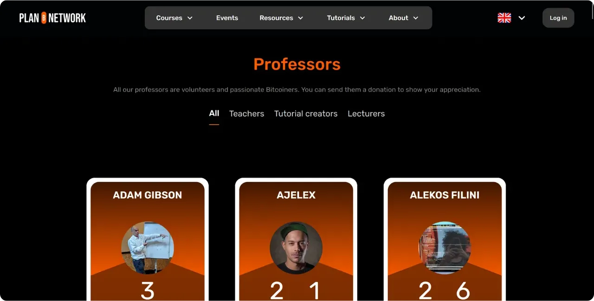

Si vous envisagez de contribuer à Plan ₿ Network en rédigeant un nouveau tutoriel ou un nouveau cours, il est nécessaire de disposer d'un profil de professeur. Ce profil vous permettra de recevoir les crédits appropriés pour le contenu que vous apportez à la plateforme.

Pour ceux qui ont déjà participé à la création de contenu éducatif sur Plan ₿ Network, vous possédez probablement déjà un profil de professeur. Vous pouvez le trouver dans le dossier `/professors` [sur notre dépôt GitHub](https://github.com/PlanB-Network/bitcoin-educational-content/tree/dev/professors). Si votre profil existe déjà, retrouvez votre identifiant dans le fichier `professor.yml`.

Pour apporter des modifications à votre profil, dirigez-vous vers la section "*Modifier son profil de professeur*" située à la fin de ce tutoriel.

## Ajouter un nouveau professeur avec notre logiciel

La méthode la plus simple pour créer votre profil de professeur sur Plan ₿ Network consiste à utiliser notre outil Python intégré au dépôt. Voici la marche à suivre.

### 1 - Configurez votre environnement local

Vous devez avoir votre propre fork du [dépôt Plan ₿ Network sur GitHub](https://github.com/PlanB-Network/bitcoin-educational-content).

Synchronisez la branche principale (`dev`) de votre fork avec le dépôt source.

Mettez à jour votre clone local.

```bash
# Cloner votre fork (si ce n'est pas déjà fait)
git clone https://github.com/<username>/bitcoin-educational-content.git
cd bitcoin-educational-content

# Ajouter le dépôt source en tant que remote upstream
git remote add upstream https://github.com/PlanB-Network/bitcoin-educational-content.git

# Récupérer les dernières modifications depuis le dépôt source
git fetch upstream

# Se positionner sur la branche principale 'dev'
git checkout dev

# Fusionner les modifications de la branche 'dev' du dépôt source dans votre fork
git merge upstream/dev

# Pousser les mises à jour vers votre fork sur GitHub
git push origin dev
```

### 2 - Créez une nouvelle branche

Assurez-vous d’être sur la branche `dev`. Créez une nouvelle branche avec un nom descriptif (par exemple : `add-professor-loic-morel`).

Publiez cette branche sur votre fork en ligne.

```bash
# Assurez-vous d’être sur la branche 'dev'
git checkout dev

# Créez une nouvelle branche avec un nom descriptif
git checkout -b add-professor-loic-morel

# Publiez cette branche sur votre fork en ligne
git push -u origin add-professor-loic-morel
```

### 3 - Créez votre profil de professeur

Rendez-vous dans le dossier `scripts/tutorial-related/data-creator/` sur votre clone local. Assurez-vous d'installer toutes les dépendances requises pour le logiciel, en ayant préalablement installé Python :

```bash
pip install -r requirements.txt
```

Puis lancez le logiciel avec la commande :

```bash
python3 main.py
```

Une fois sur l'accueil, indiquez le chemin local vers votre clone du dépôt, la langue dans laquelle vous rédigez et votre identifiant GitHub. Si vous créez ce profil pour une autre personne et possédez déjà un profil de professeur, inscrivez votre identifiant dans le champ "*PBN Professor's ID*". Si vous créez votre propre profil, vous n'aurez pas encore d'identifiant de professeur puisque vous êtes en cours de création; laissez donc ce champ vide.

Ensuite, cliquez sur le bouton "*New Professor*".

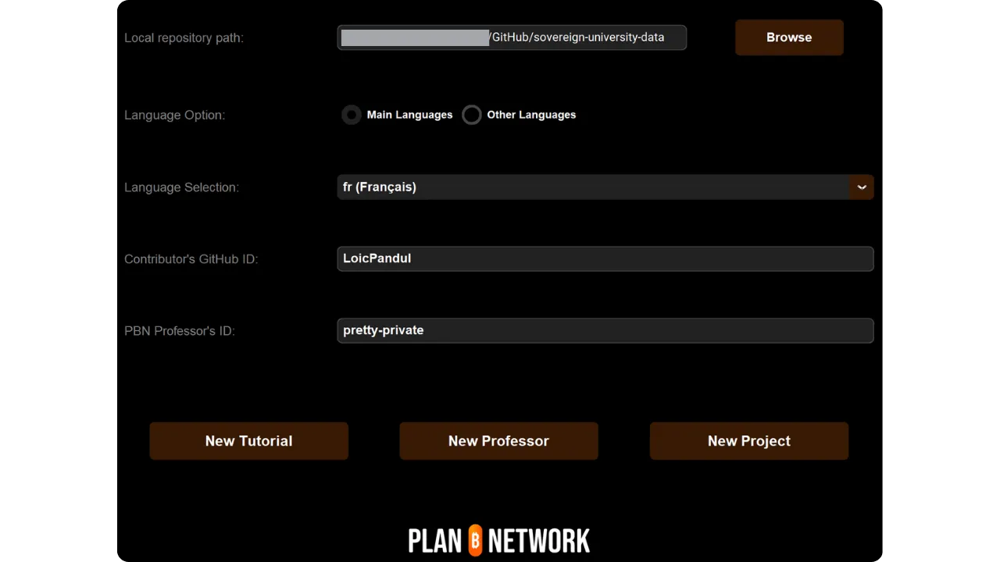

Complétez les informations requises (attention, toutes ces informations seront publiques sur notre plateforme ainsi que sur GitHub) :
- Nom de votre dossier de professeur (utilisez votre prénom et votre nom ou un pseudo, en minuscules) ;
- Votre nom ou pseudo ;
- Génération aléatoire de votre identifiant ;
- Votre site web et votre profil X (optionnel) ;
- Une adresse Lightning pour recevoir des dons des lecteurs (optionnel) ;
- Sélectionnez 2 ou 3 tags parmi ceux proposés ;
- Cliquez sur "*Select Image*" pour choisir une image de profil depuis vos dossiers locaux (n'importe quel nom et format peut être utilisé pour l'image, le logiciel l'adaptera automatiquement. Assurez-vous simplement que l'image soit carrée) ;
- Rédigez une courte description de votre profil.

Finalisez la création en cliquant sur "*Create Professor*". Cela va générer automatiquement tous les fichiers nécessaires pour votre profil.

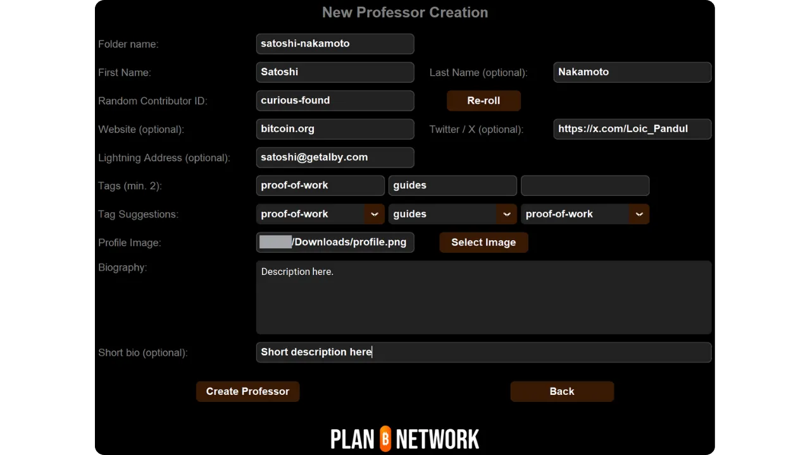

Enregistrez vos modifications localement en créant un commit avec un message explicatif. Poussez les changements vers votre fork GitHub.

```bash
# Créez un commit avec un message descriptif
git commit -m "*new professor Loïc Morel*"

# Poussez vos modifications sur votre fork
git push origin add-professor-loic-morel
```

Une fois terminé, créez une Pull Request (PR) sur GitHub pour proposer l’intégration de vos modifications. Ajoutez un titre et une brève description à la PR.

### 4 - Relecture et fusion

Attendez la validation ou les retours d’un administrateur. Si nécessaire, effectuez des corrections et poussez de nouveaux commits.

```bash
# Créez un commit décrivant les corrections apportées
git commit -m "*Corrections suite à la revue du tutoriel green-wallet*"

# Poussez les corrections sur votre fork
git push origin add-professor-loic-morel
```

Une fois la PR fusionnée, vous pouvez supprimer votre branche de travail.

## Modifier son profil de professeur

Si vous maîtrisez l'utilisation de Git, modifiez votre profil de professeur en créant une nouvelle branche et en éditant directement le fichier concerné dans votre dossier existant. Les modifications peuvent être apportées soit dans le fichier `professor.yml` soit dans le fichier markdown, selon l'information à rectifier. Après avoir réalisé vos modifications en local, poussez-les vers votre fork et soumettez une PR.

Pour les débutants, je vous recommande de faire la modification directement via l'interface web de GitHub. Assurez-vous d'avoir un compte GitHub. Si vous ne savez pas comment en créer un, suivez ce tutoriel :

https://planb.network/tutorials/others/contribution/create-github-account-a75fc39d-f0d0-44dc-9cd5-cd94aee0c07c

Rendez-vous [sur le dépôt GitHub de Plan ₿ Network dédié aux données](https://github.com/PlanB-Network/bitcoin-educational-content/graphs/contributors).

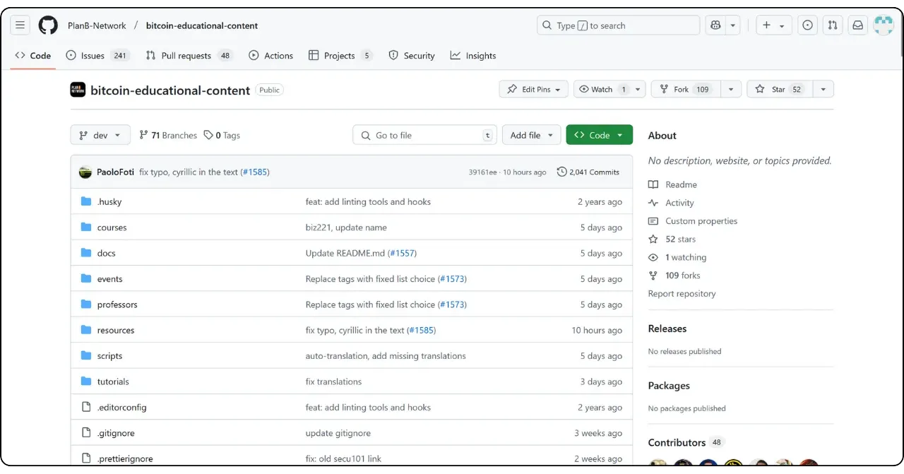

Cliquez sur le dossier "*professors*", puis allez dans votre dossier personnel.

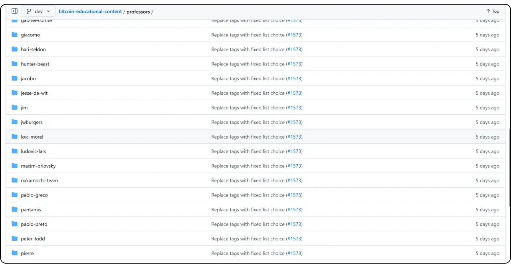

Pour modifier les métadonnées de votre profil telles que l'adresse Lightning, votre nom, ou vos liens, sélectionnez le fichier "*professor.yml*". Pour changer votre description, cliquez sur le fichier YAML de votre langue (par exemple "*en.yml*" ou "*fr.yml*").

Si vous modifiez votre description, pensez à supprimer toutes les traductions obsolètes. Ensuite, vous pouvez soit vous charger de la traduction de votre description dans les autres langues à l'aide d'un LLM, soit laisser uniquement la description dans votre langue natale et mentionner dans votre Pull Request que votre description nécessite une traduction par notre équipe.

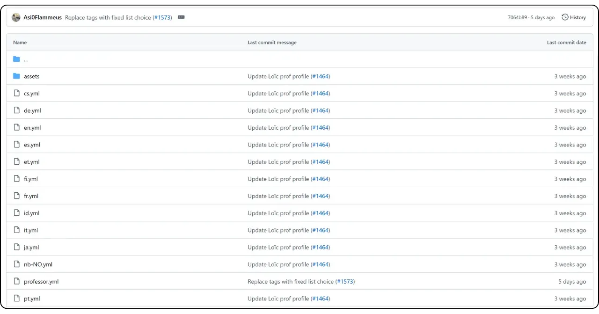

Une fois sur le fichier que vous souhaitez modifier, cliquez sur l'icône du crayon.

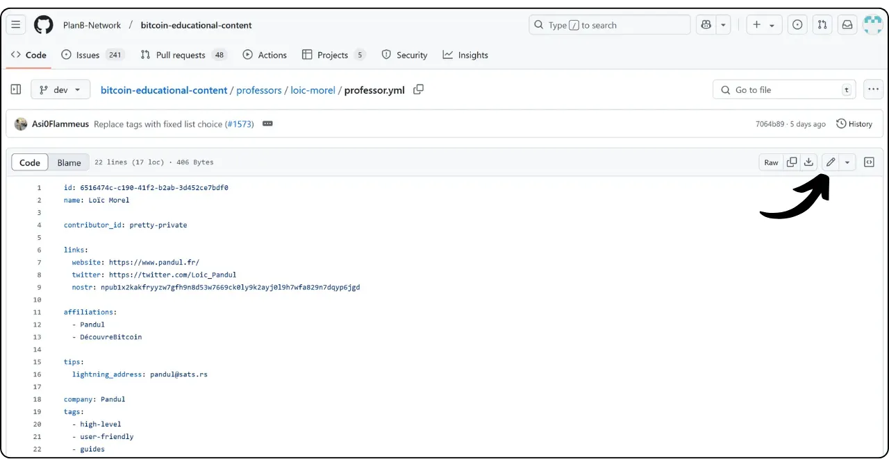

Si vous n'avez pas encore de fork du dépôt de Plan ₿ Network, GitHub vous proposera d'en créer un. Cliquez sur "*Fork this repository*".

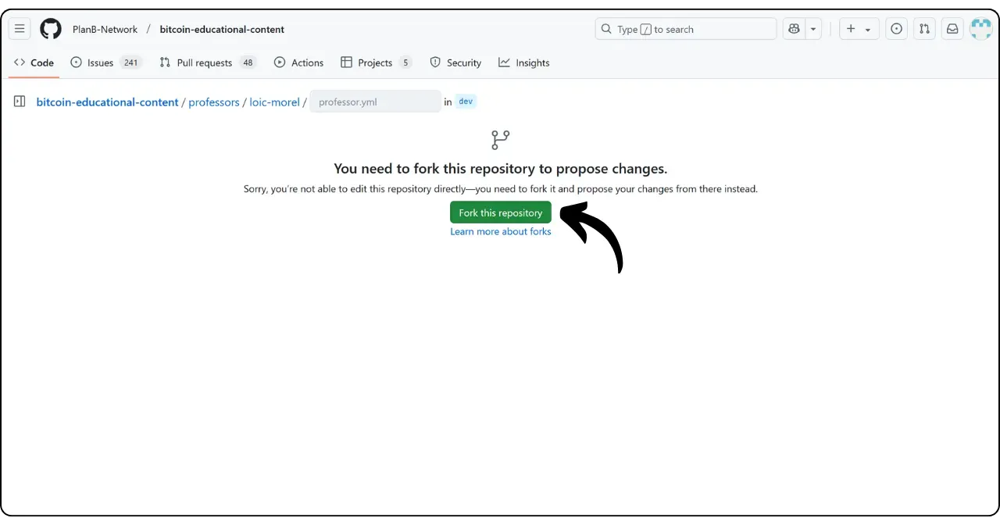

Apportez les modifications souhaitées au fichier. Une fois terminé, cliquez sur "*Commit changes*".

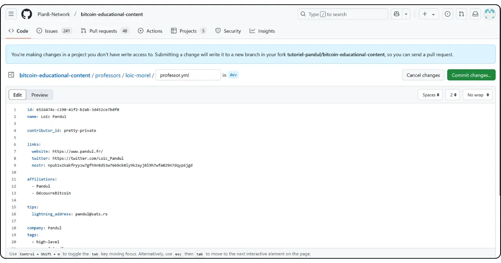

Indiquez un message décrivant votre modification, puis sélectionnez "*Propose changes*".

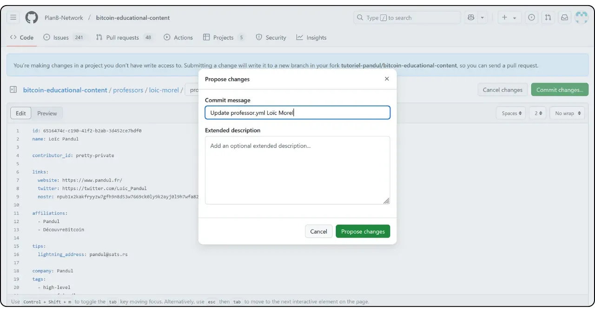

Un récapitulatif de vos modifications s'affichera. Si vous désirez apporter d'autres modifications à votre profil, vous pouvez revenir sur les dossiers et réaliser d'autres commits. Lorsque vous avez terminé, cliquez sur "*Create pull request*".

Une Pull Request est une demande faite pour intégrer les modifications de votre branche vers la branche de principale du dépôt de Plan ₿ Network, qui permet la revue et la discussion des changements avant leur fusion.

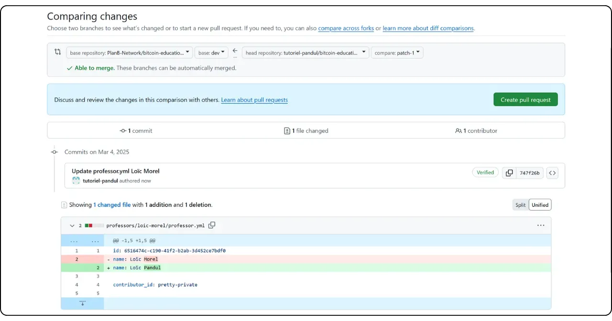

Assurez-vous, en haut de l'interface, que votre branche de travail soit bien fusionnée sur la branche `dev` du dépôt Plan ₿ Network (qui est la branche principale).

Indiquez un titre qui résume brièvement les modifications que vous souhaitez fusionner avec le dépôt source. Ajoutez un bref commentaire décrivant ces changements, puis cliquez sur le bouton vert "*Create pull request*" pour confirmer la demande de fusion :

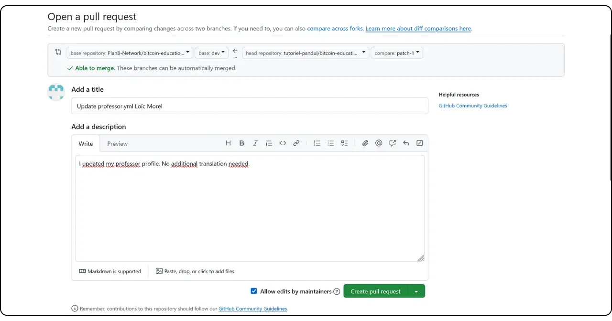

Votre PR sera alors visible dans l'onglet "*Pull Request*" du dépôt principal de Plan ₿ Network. Il ne vous reste plus qu'à patienter jusqu'à ce qu'un administrateur fusionne votre modification.

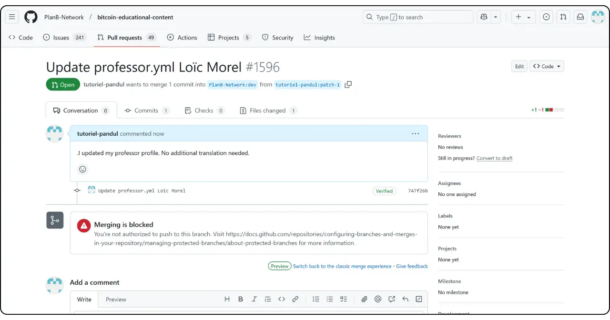

Si vous rencontrez des difficultés techniques pour soumettre votre modification, n'hésitez pas à demander de l'aide sur [notre groupe Telegram dédié aux contributions](https://t.me/PlanBNetwork_ContentBuilder). Merci !
