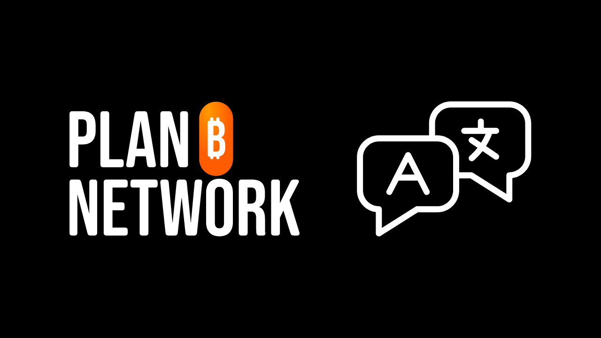
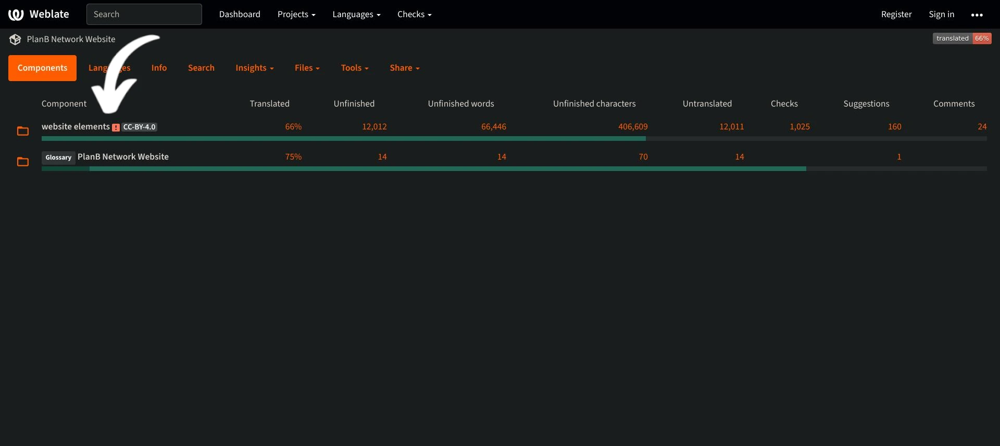
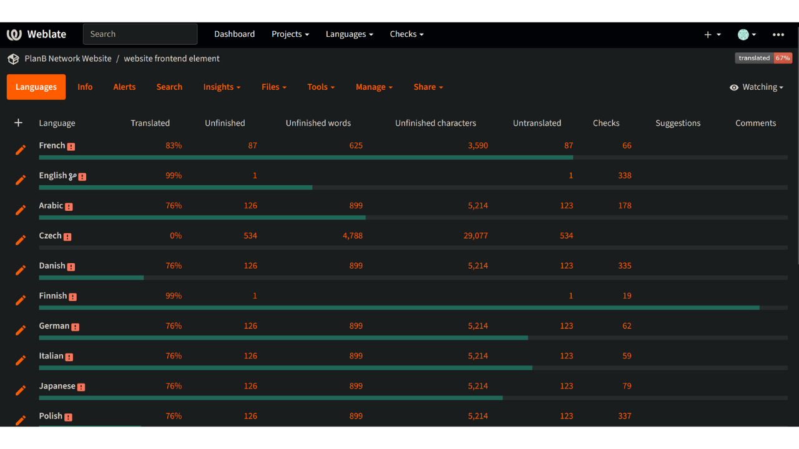
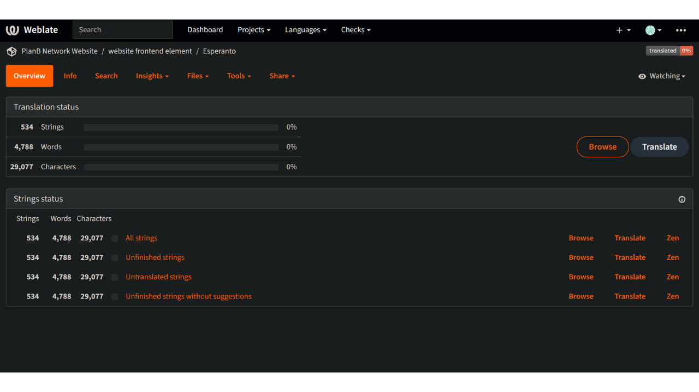
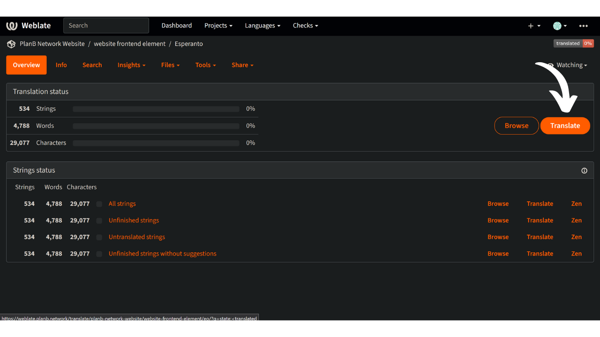

La missione di Plan ₿ Network è quella di fornire risorse educative di prima classe su Bitcoin e di tradurle nel maggior numero di lingue possibile. Gran parte dei contenuti pubblicati sul sito sono open-source e si trovano su GitHub, permettendo a chiunque di partecipare all'arricchimento della piattaforma. I contributi possono assumere varie forme: fare proofreading e correggere i contenuti esistenti, aggiornare le informazioni o creare nuovi tutorial da aggiungere alla piattaforma.

Attualmente il nostro sito web offre una vasta gamma di lingue, e stiamo lavorando per aggiungerne altre. Per migliorare il processo di traduzione del nostro frontend, utilizziamo lo strumento Weblate, che ci aiuta a collaborare e a gestire le traduzioni in modo efficiente.

Se la vostra lingua non è ancora disponibile sul nostro sito e volete aggiungerla, questo tutorial fa per voi!

Innanzitutto, assicuratevi di contattare il team di Plan ₿ Network tramite il nostro [gruppo Telegram] (https://t.me/PlanBNetwork_ContentBuilder). Se non avete Telegram, potete inviare un'e-mail a mari@planb.network. Assicuratevi di scrivere una piccola presentazione su chi siete e sulle lingue che parlate.

## Verificare la presenza di una lingua su Weblate

Per verificare se la vostra lingua è già tra quelle su cui stiamo lavorando.

- Andate su [la nostra piattaforma Weblate](https://weblate.planb.network/projects/planb-network-website/):

- Nel menu `Elementi del sito` si trova un elenco di tutte le lingue in corso:

Se la vostra lingua è presente in questo elenco, non è necessario aggiungerla di nuovo. Per contribuire alla correzione del weblate, potete dunque cliccare sul seguente tutorial:

https://planb.network/tutorials/others/contribution/translate-front-weblate-8213b931-650f-4efd-8f4e-9a8ae5ce6295
Se la vostra lingua non è presente, seguite invece il tutorial sottostante per aggiungerla.

## Aggiungere una nuova lingua su Plan ₿ Network

- Il primo passo è creare un account su Weblate cliccando su "Registrati" nell'angolo in alto a destra (se avete bisogno di aiuto, potete tornare al tutorial citato poco sopra).
- Una volta creato l'account, bisogna accedere al menu "Elementi del sito web" e selezionare la scheda "Lingue":

- Fare clic sul simbolo `+` in alto a sinistra della finestra:

- Aprire l'elenco a discesa e selezionare la lingua che si desidera aggiungere. Se la lingua desiderata non è disponibile nell'elenco a discesa, potete contattare il [gruppo Telegram](https://t.me/PlanBNetwork_ContentBuilder) in modo che il nostro team possa crearla manualmente:

- Fare clic su "Avvia nuova traduzione":

- Si arriva così alla pagina di gestione delle traduzioni per la propria lingua:

- Per iniziare a tradurre gli elementi statici del sito web, fare clic sul pulsante `Translate`: 

Per essere guidati nel processo di traduzione, consultate il nostro tutorial dedicato qui sotto:

https://planb.network/tutorials/others/contribution/translate-front-weblate-8213b931-650f-4efd-8f4e-9a8ae5ce6295
Congratulazioni, avete iniziato il processo di traduzione degli elementi statici del sito web di Plan ₿ Network!

Comprendono tutte le stringhe del sito web, ad eccezione dei contenuti didattici (corsi, tutorial...) per i quali utilizziamo un altro metodo semi-automatico (traduzione AI + revisione dei collaboratori).

Un grande ringraziamento per il vostro prezioso contributo!