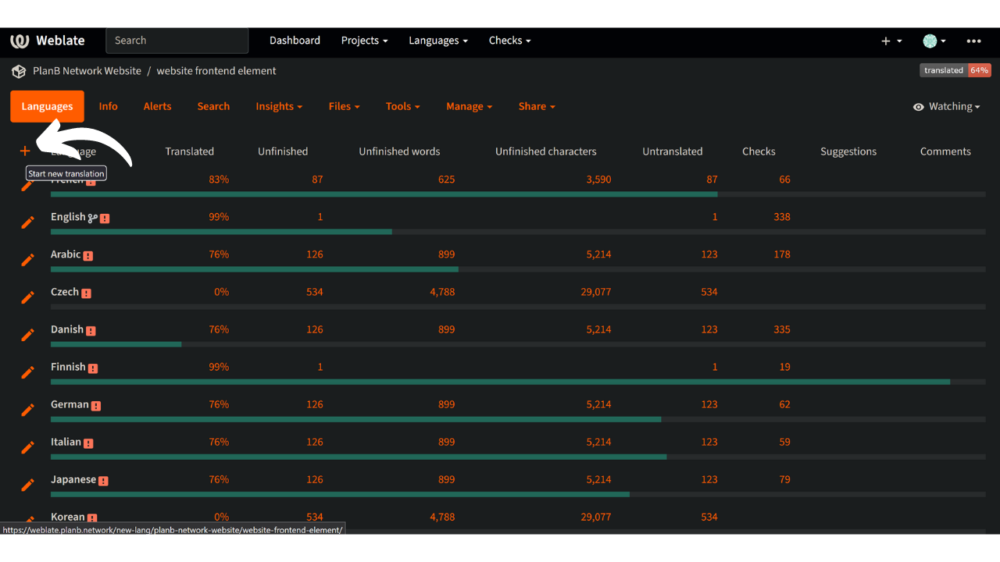

Sứ mệnh của Plan ₿ Network là cung cấp các nguồn tài nguyên giáo dục hạng nhất về Bitcoin và dịch chúng sang nhiều ngôn ngữ nhất có thể. Phần lớn nội dung được xuất bản trên trang web là nguồn mở và được lưu trữ trên GitHub, cho phép bất kỳ ai cũng có thể tham gia làm phong phú nền tảng. Đóng góp có thể ở nhiều hình thức khác nhau: sửa và hiệu đính nội dung hiện có, cập nhật thông tin hoặc tạo hướng dẫn mới để thêm vào nền tảng.

Trang web của chúng tôi hiện cung cấp nhiều ngôn ngữ và chúng tôi liên tục làm việc để bổ sung thêm nhiều ngôn ngữ hơn. Để cải thiện quy trình dịch cho giao diện người dùng, chúng tôi sử dụng công cụ Weblate, giúp chúng tôi cộng tác và quản lý bản dịch hiệu quả. Đây là công cụ thân thiện với người dùng.

Nếu ngôn ngữ mẹ đẻ của bạn chưa có trên trang web của chúng tôi và bạn muốn thêm ngôn ngữ đó vào thì hướng dẫn này là dành cho bạn!

Trước tiên, hãy đảm bảo liên hệ với nhóm Plan ₿ Network qua [nhóm Telegram](https://t.me/PlanBNetwork_ContentBuilder) của chúng tôi. Nếu bạn không có Telegram, bạn có thể gửi email đến mari@planb.network. Đảm bảo viết một bài thuyết trình ngắn về bạn là ai và ngôn ngữ bạn nói.

## Kiểm tra xem một ngôn ngữ có hiện diện trên Weblate không

Để kiểm tra xem ngôn ngữ của bạn có nằm trong danh sách ngôn ngữ chúng tôi đang xử lý hay không.

- Truy cập [nền tảng Weblate của chúng tôi](https://weblate.planb.network/projects/planb-network-website/):

- Trong menu `Thành phần trang web`, bạn sẽ tìm thấy danh sách tất cả các ngôn ngữ đang được tiến hành:

Nếu ngôn ngữ của bạn nằm trong danh sách này, bạn không cần phải thêm lại. Để đóng góp bằng cách hiệu đính bản weblate, hãy khám phá hướng dẫn sau:

https://planb.network/tutorials/others/contribution/translate-front-weblate-8213b931-650f-4efd-8f4e-9a8ae5ce6295
Nếu ngôn ngữ của bạn không có ở đó, hãy làm theo hướng dẫn bên dưới để thêm ngôn ngữ.

## Thêm ngôn ngữ mới vào Plan ₿ Network

- Bước đầu tiên là tạo một tài khoản trên Weblate bằng cách nhấp vào "Đăng ký" ở góc trên bên phải (nếu bạn cần trợ giúp, bạn có thể quay lại hướng dẫn được đề cập ở trên).
- Sau khi tài khoản của bạn được tạo, hãy vào menu `Thành phần trang web` và chọn tab `Ngôn ngữ`:

- Nhấp vào dấu `+` ở góc trên bên trái của cửa sổ:

- Mở danh sách thả xuống và chọn ngôn ngữ bạn muốn thêm. Nếu ngôn ngữ bạn đang tìm kiếm không có trong danh sách thả xuống, bạn có thể liên hệ qua [nhóm Telegram](https://t.me/PlanBNetwork_ContentBuilder) để nhóm của chúng tôi có thể tạo thủ công:

- Nhấp vào `Bắt đầu bản dịch mới`:

- Sau đó, bạn sẽ đến trang quản lý bản dịch cho ngôn ngữ của mình:

- Để bắt đầu dịch các thành phần tĩnh của trang web, hãy nhấp vào nút `Dịch`: 

Để được hướng dẫn trong suốt quá trình dịch, hãy xem hướng dẫn chuyên sâu của chúng tôi bên dưới:

https://planb.network/tutorials/others/contribution/translate-front-weblate-8213b931-650f-4efd-8f4e-9a8ae5ce6295
Xin chúc mừng, bạn đã bắt đầu quá trình dịch các thành phần tĩnh trên trang web Plan ₿ Network!

Chúng bao gồm tất cả các chuỗi trên trang web, ngoại trừ nội dung giáo dục (khóa học, hướng dẫn...) mà chúng tôi sử dụng phương pháp bán tự động khác (dịch AI + hiệu đính của cộng tác viên).

Xin chân thành cảm ơn sự đóng góp quý báu của bạn!