Plan ₿ Network hat es sich zur Aufgabe gemacht, erstklassige Bildungsressourcen zu Bitcoin bereitzustellen und sie in so viele Sprachen wie möglich zu übersetzen. Ein Großteil der auf der Website veröffentlichten Inhalte ist quelloffen und wird auf GitHub gehostet, so dass sich jeder an der Bereicherung der Plattform beteiligen kann. Beiträge können verschiedene Formen annehmen: Korrektur und Korrekturlesen bestehender Inhalte, Aktualisierung von Informationen oder die Erstellung neuer Anleitungen, die der Plattform hinzugefügt werden.

In diesem Tutorial zeigen wir Ihnen, wie Sie ganz einfach zur Übersetzung der statischen Elemente auf unserer Website beitragen können. Die Daten auf der Plattform sind in zwei Hauptkategorien unterteilt:

- die Frontend-Daten/statischen Elemente (Seiten, Schaltflächen usw.);
- die Bildungsinhalte (Tutorials, Kurse, Ressourcen...).

Für die Übersetzung der Bildungsinhalte verwenden wir [künstliche Intelligenz] (https://github.com/Asi0Flammeus/LLM-Translator). Um eventuelle Fehler in diesen Dateien zu korrigieren, bitten wir Korrekturleser um ihre Mitarbeit. Wenn Sie einige Inhalte Korrektur lesen möchten, lesen Sie bitte die folgende Anleitung:

https://planb.network/en/tutorials/others/contribution/content-review-tutorial-1ee068ca-ddaf-4bec-b44e-b41a9abfdef6
Wenn Sie hingegen an der Übersetzung der statischen Elemente der Website (mit Ausnahme der Bildungsinhalte) interessiert sind, sind Sie bei uns genau richtig! Um das Frontend effektiv zu übersetzen, verwenden wir das Tool Weblate, das sehr einfach zu bedienen ist und den Ansatz zur Übersetzung erleichtert.

Wenn Sie dem Plan ₿ Network eine völlig neue Sprache hinzufügen möchten, kontaktieren Sie bitte das Team des Plan ₿ Network über unsere [Telegram-Gruppe] (https://t.me/PlanBNetwork_ContentBuilder). Wenn Sie kein Telegramm haben, können Sie eine E-Mail an mari@planb.network senden. Stellen Sie sicher, dass Sie eine kleine Präsentation darüber schreiben, wer Sie sind und welche Sprachen Sie sprechen.

Unsere Teammitglieder werden Ihnen spezifische Anweisungen geben und die entsprechenden "Issues" auf Github öffnen, um Ihre Arbeit zu koordinieren.

Bevor Sie dieser speziellen Anleitung folgen, um dem Weblate eine neue Sprache hinzuzufügen.

https://planb.network/tutorials/others/contribution/add-new-language-weblate-eef2f5c0-1aba-48a3-b8f0-a57feb761d86
Wenn Sie bereit sind, mit der Übersetzung zu beginnen, kehren Sie zu diesem Lernprogramm zurück und gehen Sie die folgenden Punkte durch.

## Registrierung auf der Weblate

- Gehen Sie zu [dem selbst gehosteten Weblate von Plan ₿ Network] (https://weblate.planb.network/):

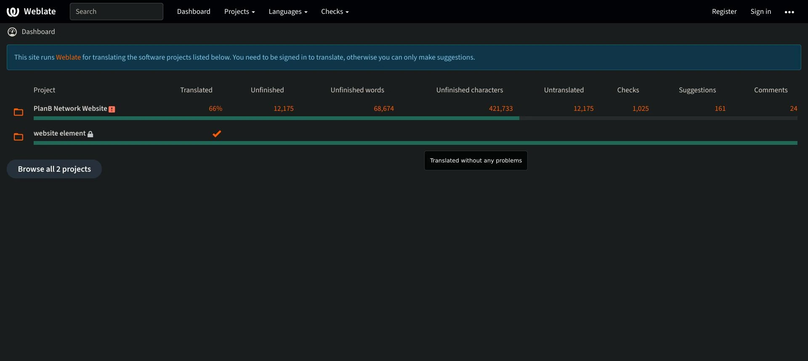

- Wenn Sie bereits ein Weblate-Konto haben, klicken Sie auf `Anmelden`:

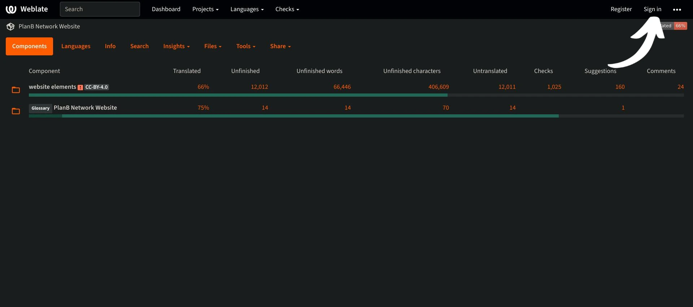

- Wenn Sie noch kein Konto haben, klicken Sie auf `Registrieren`:

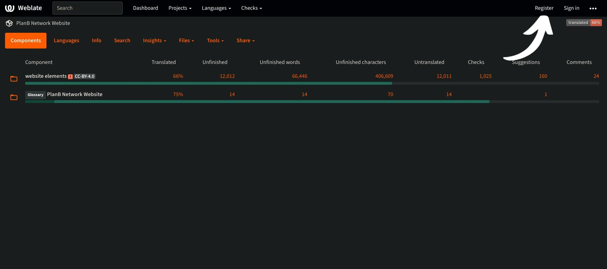

- Geben Sie Ihre E-Mail-Adresse sowie einen Benutzernamen und Ihren vollständigen Namen ein (Sie können ein Pseudonym verwenden) und klicken Sie dann auf "Registrieren":

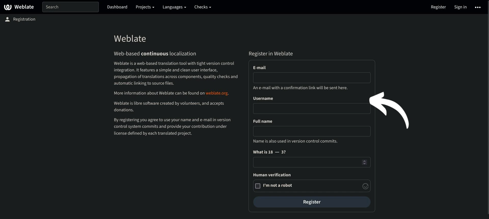

- In Ihrem E-Mail-Posteingang sollten Sie eine Bestätigungsnachricht von Weblate erhalten haben. Klicken Sie auf den Link, um Ihre Anmeldung zu bestätigen:

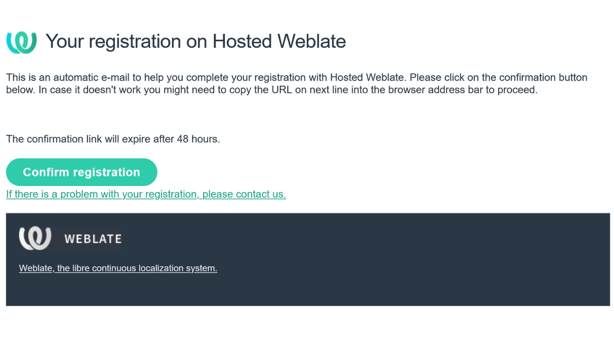

- Wählen Sie ein sicheres Passwort und klicken Sie dann auf "Mein Passwort ändern":

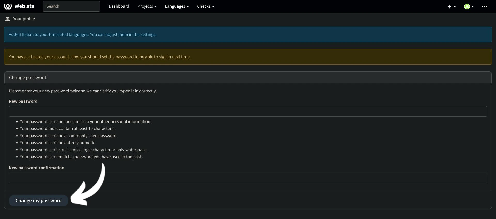

- Sie können nun zum Dashboard Plan ₿ Network zurückkehren:

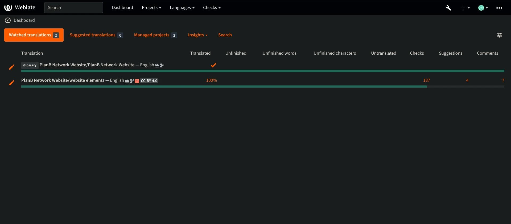

## Mit dem Übersetzen beginnen

- Klicken Sie auf das Projekt `Website-Elemente` (nicht das Glossar):

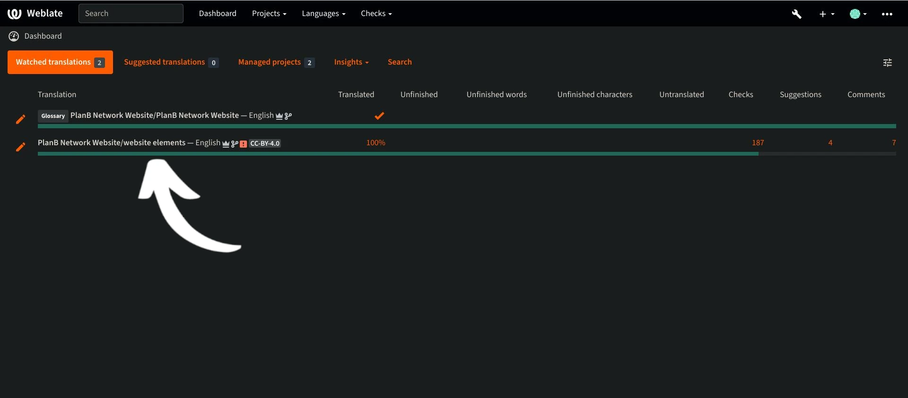

- Sie gelangen zu einer Oberfläche, auf der Sie die Sprachen in Bearbeitung sehen können:

- Wählen Sie Ihre Sprache. Nehmen wir zum Beispiel Französisch:

- Um mit dem Übersetzen zu beginnen, klicken Sie einfach auf die Schaltfläche "Übersetzen":

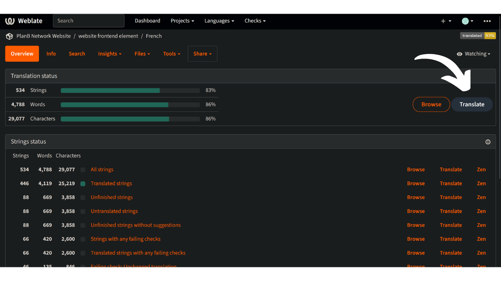

- Sie werden zur Arbeitsoberfläche weitergeleitet:

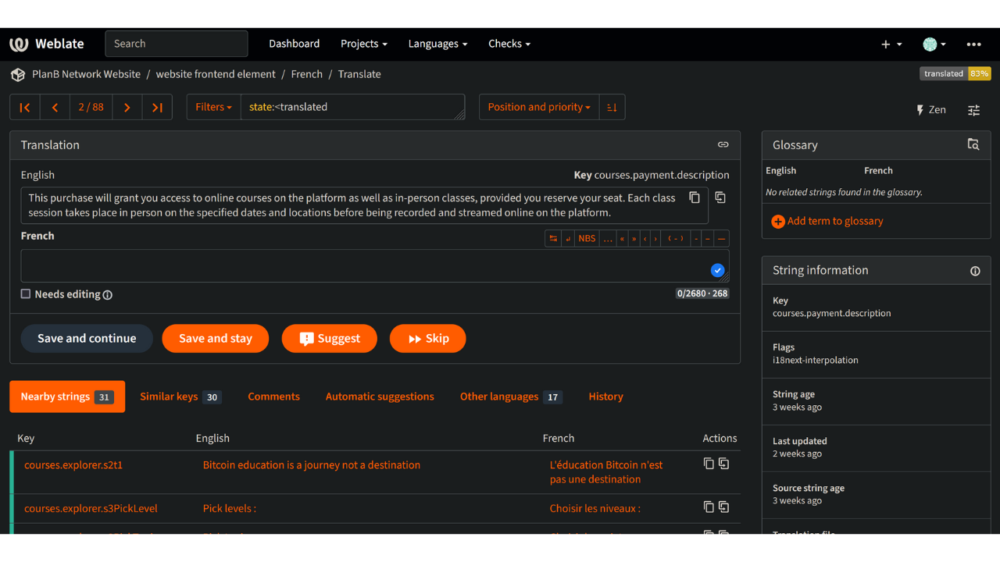

- Weblate schlägt dann automatisch Sätze, Absätze oder sogar Wörter vor, die in das Feld "Sprache" übersetzt werden sollen. In Ihrem Fall werden Sie wahrscheinlich den englischen Haupttext und ein weiteres Textfeld für Ihre Sprache sehen:

- Ihre Aufgabe besteht darin, die angegebenen Zeichenfolgen zu übersetzen. Sie müssen Ihren Text in das Kästchen eintragen, das der von Ihnen gewählten Sprache entspricht. Wenn Sie zum Beispiel an der französischen Version arbeiten, schreiben Sie Ihre Übersetzung in das Feld "Französisch":

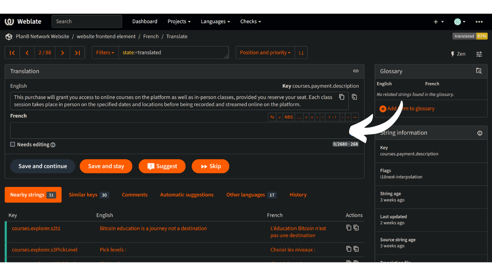

- Klicken Sie auf die Registerkarte `Automatische Vorschläge`:

- Hier zeigt Ihnen das Weblate eine von künstlicher Intelligenz erstellte Übersetzung:

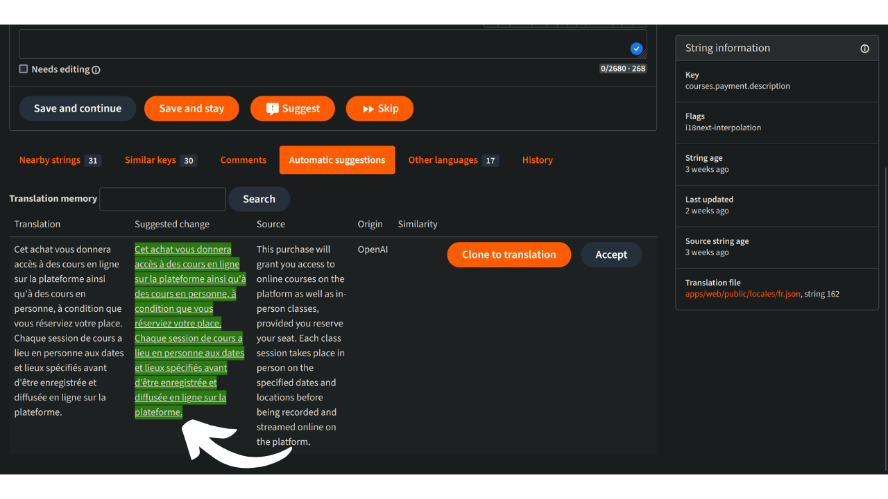

- Wenn die vorgeschlagene Übersetzung für Sie relevant erscheint, können Sie auf die Schaltfläche "Zur Übersetzung klonen" klicken:

- Der Vorschlag befindet sich nun in Ihrer Arbeitsbox:

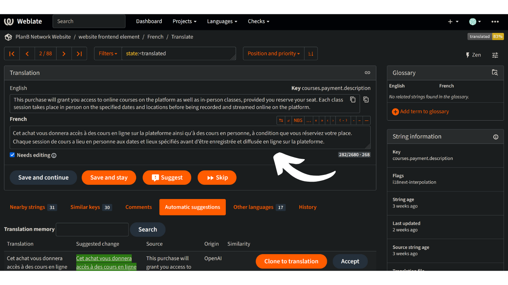

- Sie können den Vorschlag dann manuell ändern:

- Wenn Ihnen die Übersetzung zufriedenstellend erscheint, klicken Sie auf die Schaltfläche "Speichern und weiter". Achten Sie darauf, das Kästchen "Muss bearbeitet werden" zu deaktivieren, wenn Sie mit Ihrer Übersetzung zufrieden sind:

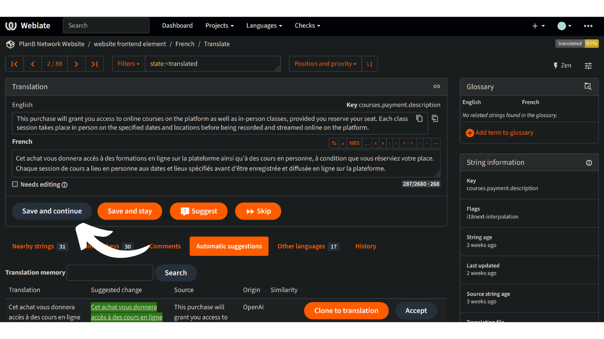

- So geht's! Ihre Übersetzung wurde erfolgreich gespeichert. Weblate leitet Sie automatisch zum nächsten zu übersetzenden Element weiter. Wenn Sie zum Dashboard Ihrer Sprache zurückkehren, können Sie sehen, dass jede Art von Zeichenfolge einen anderen Übersetzungsstatus hat. Wenn Sie sich zum Beispiel nur auf "unübersetzte Zeichenfolgen" konzentrieren möchten, können Sie auf die entsprechende Registerkarte klicken:

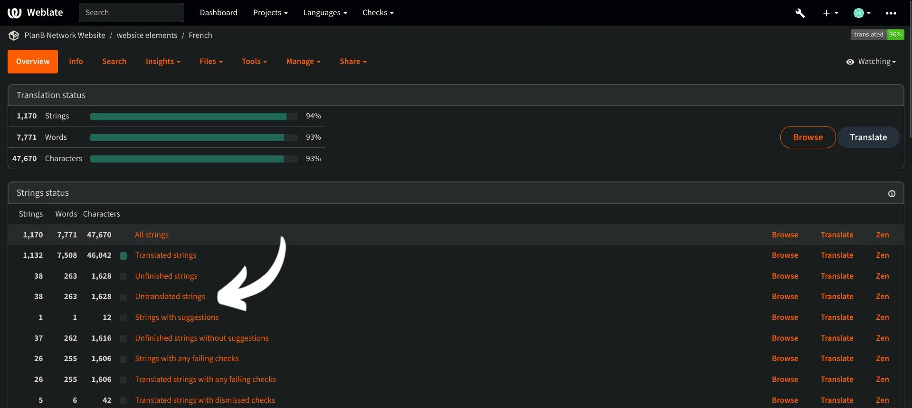

- Wenn Sie ein bestimmtes Wort suchen müssen, sei es in Ihrer Sprache oder in der Originalsprache, klicken Sie auf "Suchen" und geben es dort ein:

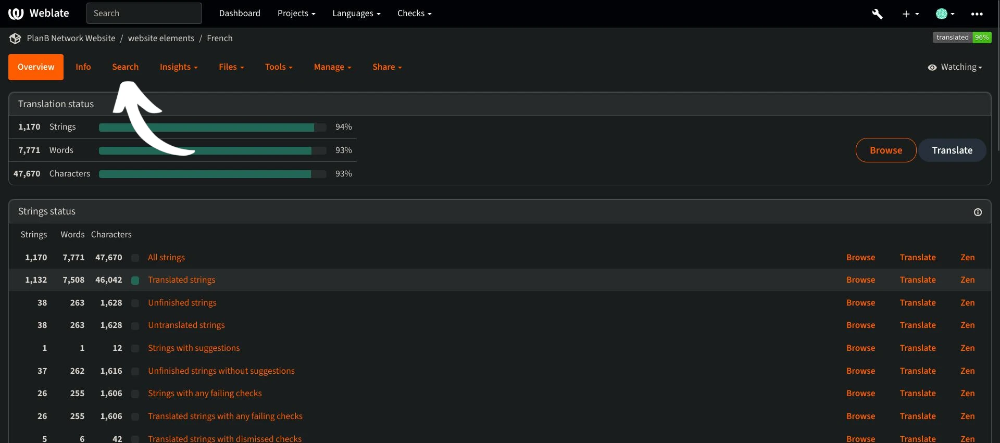

## Leitlinien für die Übersetzung

- Wenn Sie Wörter in geschweiften Klammern "{" finden, brauchen Sie diese nicht zu übersetzen. Zum Beispiel in "Ihr Konto wurde erstellt, {{Benutzername}}!" übersetzen Sie den gesamten Satz, behalten aber den "Benutzernamen" im Englischen.
- Wenn Sie "Plan ₿ Network" in einem String finden, stellen Sie sicher, dass Sie NICHT das Wort "Network" übersetzen (betrachten Sie Plan ₿ Network als Markenzeichen). Außerdem sollten Sie immer das ₿ des Bitcoins verwenden!
- Wenn Sie das Wort "Netzwerk" allein finden, können Sie es stattdessen übersetzen.
- Übersetzen Sie nicht "B-CERT", da dies ein anderes festes Wort ist.
- Wenn Sie Zeichenfolgen finden, die mit einem Leerzeichen enden, können Sie dieses weglassen.
- Manche Zeichenfolgen enthalten ein Leerzeichen zwischen dem letzten Wort und einem Satzzeichen: Lassen Sie es in Ihrer Zielsprache nicht stehen, es sei denn, die Grammatik erfordert dies. Zum Beispiel sollte "Contact information :" in "Contact information:" korrigiert werden. In diesem Fall übersetzen Sie es auf die richtige Art und Weise. Sie können auch einen Kommentar hinzufügen, um die Administratoren auf dieses Problem in der englischen Originalversion hinzuweisen.

## Neue Funktionen

- Wir arbeiten daran, einen Abschnitt "Erklärung" für jede Zeichenfolge zusammen mit einem Screenshot hinzuzufügen, um Ihnen zu helfen, herauszufinden, wo ein bestimmter Satz/Wort auf der Website erscheint. Im Moment können Sie, wenn Sie Zweifel an einigen Wörtern haben und ihre spezifische Position auf der Website finden müssen, eine Frage im Abschnitt "Kommentare" stellen oder den Übersetzungskoordinator in der Telegram-Gruppe fragen, die am Anfang dieses Tutorials erwähnt wurde.

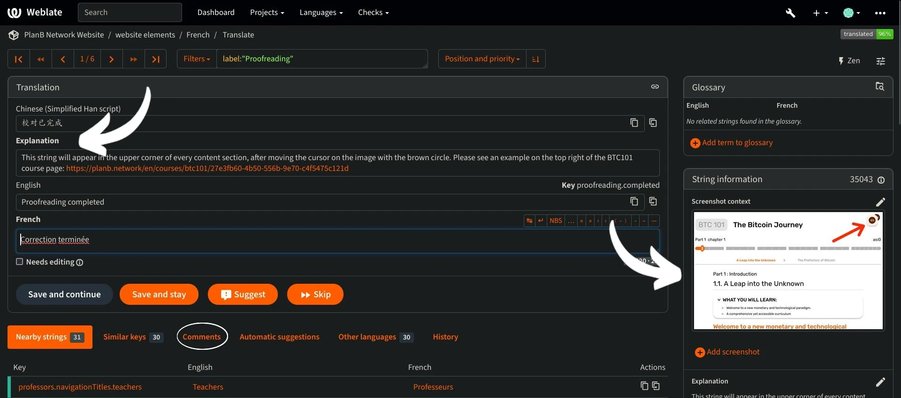

Vielen Dank im Voraus für Ihren Beitrag zur Übersetzung von Plan ₿ Network! Wenn Sie spezielle Fragen oder Kommentare für uns haben, können Sie uns gerne über die [Telegram-Gruppe] (https://t.me/PlanBNetwork_ContentBuilder) kontaktieren.