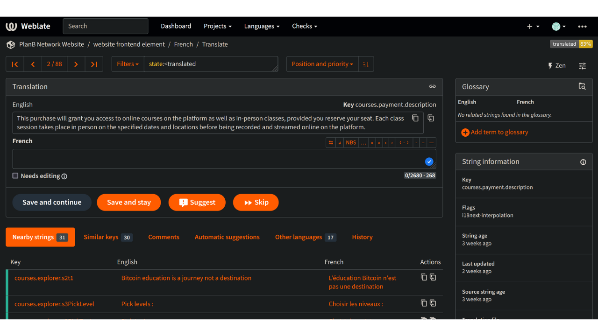
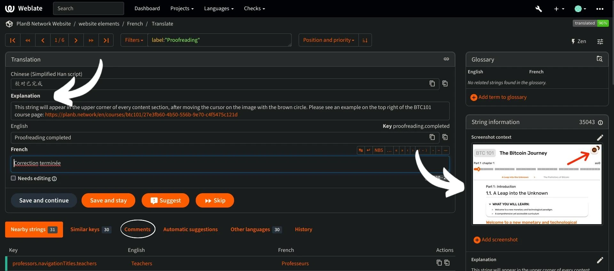

Plan ₿ Network's mission is to provide first-class educational resources on Bitcoin and translate them into as many languages as possible. Much of the content published on the site is open-source and hosted on GitHub, allowing anyone to participate in enriching the platform. Contributions can take various forms: correcting and proofreading existing content, updating information, or creating new tutorials to add on the platform.

In this tutorial, we will show you how to easily contribute to the translation of the static elements on our website. The data on the platform is divided into two main categories:
- the frontend data/static elements (pages, buttons, etc.);
- the educational content (tutorials, courses, resources...).

To translate the educational content, we use [artificial intelligence](https://github.com/Asi0Flammeus/LLM-Translator). Then, to correct the eventual mistakes in these files, we invite proofreaders to contribute. If you wish to proofread some content, consult the following tutorial:

https://planb.network/en/tutorials/others/contribution/content-review-tutorial-1ee068ca-ddaf-4bec-b44e-b41a9abfdef6

On the other hand, if you are interested in translating the static elements of the website (excluding educational content), you are in the right place! To effectively translate the frontend, we use the Weblate tool, which is very simple to use and facilitates the approach to translation.

If you wish to add a completely new language to Plan ₿ Network, make sure to contact the Plan ₿ Network team via our [Telegram group](https://t.me/PlanBNetwork_ContentBuilder). If you don't have telegram, you can send an e-mail to mari@planb.network. Make sure to write a small presentation about who you are and the languages you speak.
Our team members will give you specific instructions and will open the related "issues" on Github to coordinate your work.

Before  follow this specific tutorial to add a new language to the Weblate.

https://planb.network/tutorials/others/contribution/add-new-language-weblate-eef2f5c0-1aba-48a3-b8f0-a57feb761d86

When you are ready to start translating, come back to this tutorial and go through the following points.

## Register on the Weblate

- Go to [the self-hosted Weblate of Plan ₿ Network](https://weblate.planb.network/):

- If you already have a Weblate account, click on `Sign in`:

- If you don't have an account, click on `Register`:

- Enter your email address, as well as a username and full name (you can use a pseudonym), then click on `Register`:

- In your email inbox, you should have received a confirmation message from Weblate. Click on the link to confirm your registration:

- Choose a strong password, then click on `Change my password`:

- You can now go back to the Plan ₿ Network dashboard: 

## Start translating

- Click on the `Website Elements` project (not the glossary):

- You will get to an interface, where you can see the languages in progress:

- Choose your language. For example, let's take French:

- To start translating, simply click on the `Translate` button:

- You will be redirected to the work interface:

- The Weblate will then automatically suggest sentences, paragraphs, or even words to translate into the `language` box. In your case, you will probably see the English main string, and another text box for your language:

- Your task consists in the translation of the indicated strings. You must insert your text in the box corresponding to the language you have chosen. For example, if you are working on the French version, write your translation in the `French` box:

- Click on the `Automatic suggestion` tab:

- Here, the Weblate shows you a translation made by artificial intelligence:

- If the suggested translation seems relevant to you, you can click on the `Clone to translation` button:

- The suggestion is now placed in your work box:

- You can then manually modify the suggestion:

- Once the translation seems satisfactory to you, click on the `Save and Continue` button. Make sure to uncheck the "Needs editing" box when you are sure of your translation:

- There you go! Your translation has been successfully saved. The Weblate will automatically redirect you to the next item to translate. If you go back to the dashboard corresponding to your language, you can see that any type of string has a different translation status. For example, if you need to only focus on "untranslated strings", you can click on the specific tab:

- If you need to search for a specific word, whether in your language or in the original one, click on "search" and insert it there:

## Translation guidelines

- When you find words inserted inside curly brackets "{", you don't need to translate them. For example, in "Your account has been created, {{userName}}!", you will translate the entire sentence, but maintain "username" in English.
- When you find "Plan ₿ Network" in a string, make sure NOT to translate the word "network" (consider Plan ₿ Network as a trademark). Besides, always use the Bitcoin's ₿!
- If you find the word "network" alone, you can translate it, instead.
- Do not translate "B-CERT", as it is another fixed word.
- If you find strings that end with a space, you can leave it.
- Some strings might contain a space between the last word and a punctuation mark: don't leave it in your target language unless the grammar implies it. For example, "Contact information :" should be corrected into "Contact information:". In this case, translate it using the correct way. You can also add a comment to tell admins about this issue in the original English version.

## New features
- We are working to add an "explanation" section for any string, together with a screenshot, to help you find where a specific sentence/word appears on the website. As of right now, if you have any doubt about some words and you need to find their specific location on the website, you can ask a question in the "comments" section or ask the translation coordinator on the Telegram group mentioned at the beginning of this tutorial.

Thank you in advance for your contribution to the translation of Plan ₿ Network! If you have any specific questions or comments for us, feel free to contact us via the [Telegram group](https://t.me/PlanBNetwork_ContentBuilder).
