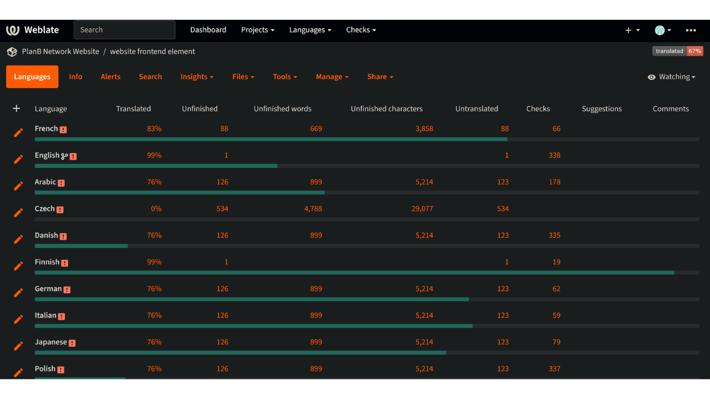

La misión de Plan ₿ Network es proporcionar recursos educativos de primera clase sobre Bitcoin y traducirlos al mayor número de idiomas posible. Gran parte del contenido publicado en el sitio es de código abierto y está alojado en GitHub, lo que permite a cualquiera participar en el enriquecimiento de la plataforma. Las contribuciones pueden adoptar diversas formas: corregir y corregir el contenido existente, actualizar la información o crear nuevos tutoriales para añadir a la plataforma.

En este tutorial, le mostraremos cómo contribuir fácilmente a la traducción de los elementos estáticos de nuestro sitio web. Los datos de la plataforma se dividen en dos categorías principales:

- los datos/elementos estáticos del frontend (páginas, botones, etc.);
- el contenido educativo (tutoriales, cursos, recursos...).

Para traducir los contenidos educativos, utilizamos [inteligencia artificial](https://github.com/Asi0Flammeus/LLM-Translator). Luego, para corregir los eventuales errores de estos archivos, invitamos a los correctores a contribuir. Si desea corregir algún contenido, consulte el siguiente tutorial:

https://planb.network/en/tutorials/others/contribution/content-review-tutorial-1ee068ca-ddaf-4bec-b44e-b41a9abfdef6
Por otro lado, si está interesado en traducir los elementos estáticos del sitio web (excluidos los contenidos educativos), ¡está en el lugar adecuado! Para traducir eficazmente el frontend, utilizamos la herramienta Weblate, que es muy sencilla de utilizar y facilita el planteamiento de la traducción.

Si deseas añadir un idioma completamente nuevo a Plan ₿ Network, asegúrate de ponerte en contacto con el equipo de Plan ₿ Network a través de nuestro [grupo de Telegram](https://t.me/PlanBNetwork_ContentBuilder). Si no tienes telegram, puedes enviar un correo electrónico a mari@planb.network. Asegúrate de escribir una pequeña presentación sobre quién eres y los idiomas que hablas.

Los miembros de nuestro equipo le darán instrucciones específicas y abrirán las "incidencias" correspondientes en Github para coordinar su trabajo.

Antes de seguir este tutorial específico para añadir un nuevo idioma al Weblate.

https://planb.network/tutorials/others/contribution/add-new-language-weblate-eef2f5c0-1aba-48a3-b8f0-a57feb761d86
Cuando estés listo para empezar a traducir, vuelve a este tutorial y repasa los siguientes puntos.

## Registrarse en Weblate

- Vaya a [el Weblate autoalojado de Plan ₿ Network](https://weblate.planb.network/):

- Si ya tiene una cuenta Weblate, haga clic en `Iniciar sesión`:

- Si no tiene una cuenta, haga clic en `Registrarse`:

- Introduzca su dirección de correo electrónico, así como un nombre de usuario y un nombre completo (puede utilizar un seudónimo) y, a continuación, haga clic en `Registrarse`:

- En la bandeja de entrada de tu correo electrónico, deberías haber recibido un mensaje de confirmación de Weblate. Haga clic en el enlace para confirmar su inscripción:

- Elige una contraseña segura y haz clic en "Cambiar mi contraseña":

- Ahora puede volver al panel Plan ₿ Network:

## Empezar a traducir

- Haga clic en el proyecto "Elementos del sitio web" (no en el glosario):

- Accederá a una interfaz en la que podrá ver los idiomas en curso:

- Elija su idioma. Por ejemplo, el francés:

- Para empezar a traducir, basta con hacer clic en el botón `Traducir`:

- Se le redirigirá a la interfaz de trabajo:

- A continuación, Weblate le sugerirá automáticamente frases, párrafos o incluso palabras para traducir en la casilla `idioma`. En su caso, probablemente verá la cadena principal en inglés, y otro cuadro de texto para su idioma:

- Tu tarea consiste en traducir las cadenas indicadas. Debes introducir tu texto en la casilla correspondiente al idioma que hayas elegido. Por ejemplo, si está trabajando en la versión francesa, escriba su traducción en la casilla `Francés`:

- Haga clic en la pestaña `Sugerencia automática`:

- Aquí, Weblate te muestra una traducción realizada por inteligencia artificial:

- Si la traducción sugerida le parece relevante, puede hacer clic en el botón `Clonar en traducción`:

- La sugerencia se coloca ahora en su buzón de trabajo:

- A continuación, puede modificar manualmente la sugerencia:

- Cuando la traducción le parezca satisfactoria, pulse el botón `Guardar y continuar`. Asegúrate de desmarcar la casilla "Necesita edición" cuando estés seguro de tu traducción:

- Ya está Tu traducción se ha guardado correctamente. Weblate te redirigirá automáticamente al siguiente elemento a traducir. Si vuelves al panel correspondiente a tu idioma, podrás ver que cada tipo de cadena tiene un estado de traducción diferente. Por ejemplo, si necesitas centrarte sólo en las "cadenas sin traducir", puedes hacer clic en la pestaña específica:

- Si necesitas buscar una palabra concreta, ya sea en tu idioma o en el original, haz clic en "buscar" e introdúcela allí:

## Pautas de traducción

- Cuando encuentre palabras insertadas dentro de llaves "{", no es necesario que las traduzca. Por ejemplo, en "Your account has been created, {{userName}}!", traducirá toda la frase, pero mantendrá "nombredeusuario" en inglés.
- Cuando encuentres "Plan ₿ Network" en una cadena, asegúrate de NO traducir la palabra "network" (considera Plan ₿ Network como una marca registrada). Además, ¡utiliza siempre la ₿ de Bitcoin!
- Si encuentra la palabra "red" sola, puede traducirla en su lugar.
- No traduzca "B-CERT", ya que es otra palabra fija.
- Si encuentras cadenas que terminan con un espacio, puedes dejarlo.
- Algunas cadenas pueden contener un espacio entre la última palabra y un signo de puntuación: no lo deje en la lengua de destino a menos que la gramática lo implique. Por ejemplo, "Información de contacto :" debe corregirse en "Información de contacto:". En este caso, tradúzcalo utilizando la forma correcta. También puedes añadir un comentario para informar a los administradores sobre este problema en la versión original en inglés.

## Novedades

- Estamos trabajando para añadir una sección de "explicación" para cualquier cadena, junto con una captura de pantalla, para ayudarte a encontrar dónde aparece una frase/palabra específica en el sitio web. Por ahora, si tienes alguna duda sobre algunas palabras y necesitas encontrar su ubicación específica en el sitio web, puedes hacer una pregunta en la sección "comentarios" o preguntar al coordinador de traducción en el grupo de Telegram mencionado al principio de este tutorial.

¡Gracias de antemano por tu contribución a la traducción de Plan ₿ Network! Si tienes alguna pregunta o comentario específico para nosotros, no dudes en ponerte en contacto con nosotros a través del [grupo de Telegram](https://t.me/PlanBNetwork_ContentBuilder).