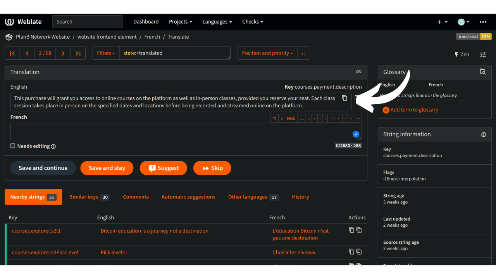
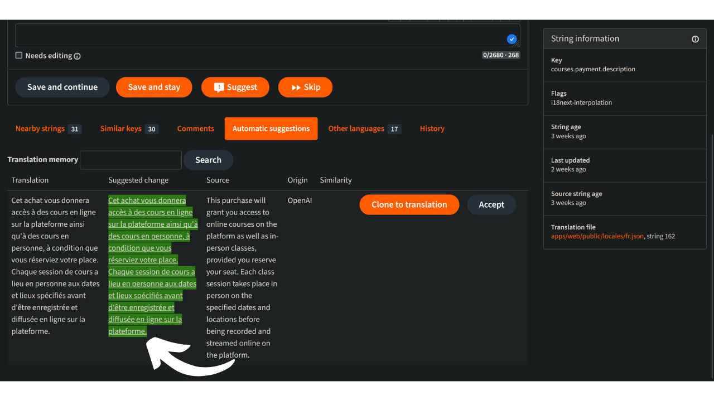

Plan ₿ Network tehtävänä on tarjota ensiluokkaisia koulutusresursseja Bitcoinista ja kääntää ne mahdollisimman monelle kielelle. Suuri osa sivustolla julkaistusta sisällöstä on avoimen lähdekoodin ja GitHubissa isännöityä, jolloin kuka tahansa voi osallistua alustan rikastuttamiseen. Osallistuminen voi tapahtua eri muodoissa: olemassa olevan sisällön korjaaminen ja oikolukeminen, tietojen päivittäminen tai uusien opetusohjelmien luominen alustalle lisättäväksi.

Tässä opetusohjelmassa näytämme sinulle, miten voit helposti osallistua sivustomme staattisten elementtien kääntämiseen. Alustan tiedot on jaettu kahteen pääluokkaan:

- etusivun tiedot/staattiset elementit (sivut, painikkeet jne.);
- koulutussisältö (opetusohjelmat, kurssit, resurssit jne.).

Koulutussisällön kääntämiseen käytämme [tekoälyä] (https://github.com/Asi0Flammeus/LLM-Translator). Tämän jälkeen pyydämme oikolukijoita osallistumaan tiedostojen mahdollisten virheiden korjaamiseen. Jos haluat oikolukea jotakin sisältöä, tutustu seuraavaan ohjeeseen:

https://planb.network/en/tutorials/others/contribution/content-review-tutorial-1ee068ca-ddaf-4bec-b44e-b41a9abfdef6
Toisaalta, jos olet kiinnostunut kääntämään verkkosivuston staattisia elementtejä (lukuun ottamatta opetussisältöä), olet oikeassa paikassa! Etusivun tehokkaaseen kääntämiseen käytämme Weblate-työkalua, joka on erittäin helppokäyttöinen ja helpottaa kääntämistä.

Jos haluat lisätä kokonaan uuden kielen Plan ₿ Network, ota yhteyttä Plan ₿ Network -tiimiin [Telegram-ryhmässä](https://t.me/PlanBNetwork_ContentBuilder). Jos sinulla ei ole telegramia, voit lähettää sähköpostia osoitteeseen mari@planb.network. Muista kirjoittaa pieni esittely siitä, kuka olet ja mitä kieliä puhut.

Tiimimme jäsenet antavat sinulle tarkat ohjeet ja avaavat Githubiin asiaan liittyvät "ongelmat", jotta voit koordinoida työtäsi.

Ennen kuin seuraat tätä erityistä ohjetta uuden kielen lisäämiseksi Weblateen.

https://planb.network/tutorials/others/contribution/add-new-language-weblate-eef2f5c0-1aba-48a3-b8f0-a57feb761d86
Kun olet valmis aloittamaan kääntämisen, palaa tähän ohjeeseen ja käy läpi seuraavat kohdat.

## Rekisteröidy Weblatessa

- Siirry [Plan ₿ Networkin itse isännöimään Weblate-sivustoon](https://weblate.planb.network/):

- Jos sinulla on jo Weblate-tili, klikkaa `Sign in`:

- Jos sinulla ei ole tiliä, klikkaa `Registeröidy`:

- Kirjoita sähköpostiosoitteesi sekä käyttäjätunnus ja koko nimi (voit käyttää salanimeä) ja napsauta sitten "Rekisteröidy":

- Sähköpostilaatikkoosi pitäisi tulla vahvistusviesti Weblatelta. Vahvista rekisteröinti klikkaamalla linkkiä:

- Valitse vahva salasana ja napsauta sitten `Vaihda salasanani`:

- Voit nyt palata Plan ₿ Network -mittaristoon:

## Aloita kääntäminen

- Napsauta `Website Elements` -projektia (ei sanastoa):

- Pääset käyttöliittymään, jossa näet käynnissä olevat kielet:

- Valitse kieli. Otetaan esimerkiksi ranska:

- Voit aloittaa kääntämisen napsauttamalla `Käännä`-painiketta:

- Sinut ohjataan työliittymään:

- Weblate ehdottaa sitten automaattisesti lauseita, kappaleita tai jopa sanoja käännettäväksi "kieli"-laatikkoon. Sinun tapauksessasi näet todennäköisesti englanninkielisen päämerkkijonon ja toisen tekstilaatikon kielellesi:

- Tehtävänäsi on kääntää ilmoitetut merkkijonot. Sinun on lisättävä tekstisi valitsemaasi kieltä vastaavaan ruutuun. Jos työskentelet esimerkiksi ranskankielisen version parissa, kirjoita käännöksesi "ranskankielinen" -kenttään:

- Napsauta välilehteä `Automaattiset ehdotukset`:

- Tässä Weblate näyttää tekoälyn tekemän käännöksen:

- Jos ehdotettu käännös vaikuttaa sinulle sopivalta, voit napsauttaa `Clone to translation`-painiketta:

- Ehdotus on nyt sijoitettu työlaatikkoosi:

- Voit sitten muokata ehdotusta manuaalisesti:

- Kun käännös vaikuttaa tyydyttävältä, napsauta `Save and Continue`-painiketta. Kun olet varma käännöksestäsi, poista rasti kohdasta "Tarvitsee muokkausta":

- Noin sitä pitää! Käännöksesi on onnistuneesti tallennettu. Weblate ohjaa sinut automaattisesti seuraavaan käännettävään kohteeseen. Jos palaat takaisin kieltäsi vastaavaan kojelautaan, näet, että kaikilla merkkijonotyypeillä on erilainen käännöstila. Jos haluat esimerkiksi keskittyä vain "kääntämättömiin merkkijonoihin", voit napsauttaa kyseistä välilehteä:

- Jos haluat etsiä tiettyä sanaa, joko omalla kielelläsi tai alkuperäisellä kielellä, napsauta "Etsi" ja lisää se sinne:

## Käännösohjeet

- Kun löydät sanoja, jotka on sijoitettu sulkeisiin "{", sinun ei tarvitse kääntää niitä. Esimerkiksi lauseessa "Tilisi on luotu, {{käyttäjänimi}}!" käännät koko lauseen, mutta säilytät sanan "käyttäjätunnus" englanniksi.
- Kun löydät merkkijonosta "Plan ₿ Network", varmista, ettet käännä sanaa "network" (pidä Plan ₿ Networkia tavaramerkkinä). Käytä sitä paitsi aina Bitcoinin ₿!
- Jos löydät sanan "verkko" yksin, voit kääntää sen sen sijaan.
- Älä käännä "B-CERT", koska se on toinen kiinteä sana.
- Jos löydät merkkijonoja, jotka päättyvät välilyöntiin, voit jättää sen pois.
- Joissakin merkkijonoissa saattaa olla välilyönti viimeisen sanan ja välimerkin välissä: älä jätä sitä kohdekielessäsi, ellei kielioppi sitä edellytä. Esimerkiksi "Yhteystiedot :" olisi korjattava muotoon "Yhteystiedot:". Käännä se tässä tapauksessa käyttämällä oikeaa tapaa. Voit myös lisätä kommentin kertoaksesi ylläpitäjille tästä asiasta alkuperäisessä englanninkielisessä versiossa.

## Uudet ominaisuudet

- Pyrimme lisäämään minkä tahansa merkkijonon "selitys"-osion ja kuvakaappauksen, jotta voit löytää, missä tietty lause/sana esiintyy sivustolla. Tällä hetkellä, jos sinulla on epäselvyyksiä joistakin sanoista ja sinun on löydettävä niiden sijainti verkkosivustolla, voit esittää kysymyksen "kommentit"-osiossa tai kysyä käännöskoordinaattorilta tämän ohjeen alussa mainitussa Telegram-ryhmässä.

Kiitos jo etukäteen osallistumisestanne Plan ₿ Networkin kääntämiseen! Jos sinulla on meille erityisiä kysymyksiä tai kommentteja, ota rohkeasti yhteyttä [Telegram-ryhmässä] (https://t.me/PlanBNetwork_ContentBuilder).