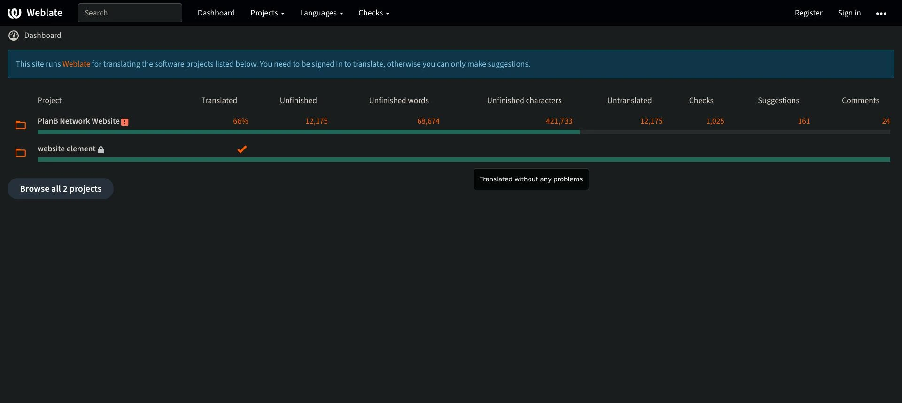
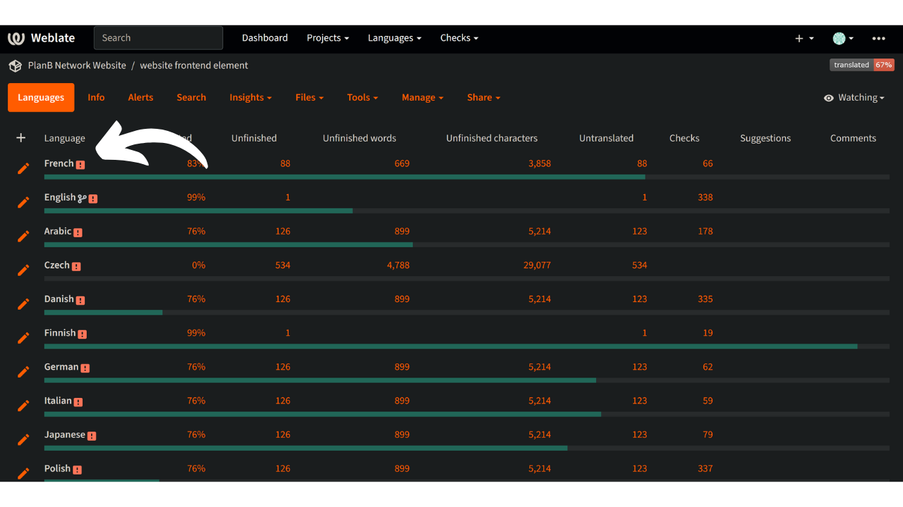

La missione di Plan ₿ Network è quella di fornire risorse educative di prima classe su Bitcoin e di tradurle nel maggior numero di lingue possibile. Gran parte dei contenuti pubblicati sul sito sono open-source e ospitati su GitHub, consentendo a chiunque di partecipare all'arricchimento della piattaforma. I contributi possono assumere varie forme: correggere e correggere i contenuti esistenti, aggiornare le informazioni o creare nuovi tutorial da aggiungere alla piattaforma.

In questo tutorial vi mostreremo come contribuire facilmente alla traduzione degli elementi statici del nostro sito web. I dati presenti sulla piattaforma sono suddivisi in due categorie principali:

- i dati/elementi statici del frontend (pagine, pulsanti, ecc.);
- i contenuti didattici (tutorial, corsi, risorse...).

Per tradurre i contenuti didattici, utilizziamo [l'intelligenza artificiale] (https://github.com/Asi0Flammeus/LLM-Translator). Poi, per correggere gli eventuali errori presenti in questi file, invitiamo i correttori di bozze a contribuire. Se desiderate correggere alcuni contenuti, consultate il seguente tutorial:

https://planb.network/en/tutorials/others/contribution/content-review-tutorial-1ee068ca-ddaf-4bec-b44e-b41a9abfdef6
Se invece siete interessati a tradurre gli elementi statici del sito web (esclusi i contenuti didattici), siete nel posto giusto! Per tradurre efficacemente il frontend, utilizziamo lo strumento Weblate, che è molto semplice da usare e facilita l'approccio alla traduzione.

Se si desidera aggiungere una lingua completamente nuova a Plan ₿ Network, assicurarsi di contattare il team di Plan ₿ Network tramite il nostro [gruppo Telegram](https://t.me/PlanBNetwork_ContentBuilder). Se non avete Telegram, potete inviare un'e-mail a mari@planb.network. Assicuratevi di scrivere una piccola presentazione su chi siete e sulle lingue che parlate.

I membri del nostro team vi daranno istruzioni specifiche e apriranno le relative "issue" su Github per coordinare il vostro lavoro.

Prima di seguire questa guida specifica per aggiungere una nuova lingua a Weblate.

https://planb.network/tutorials/others/contribution/add-new-language-weblate-eef2f5c0-1aba-48a3-b8f0-a57feb761d86
Quando si è pronti per iniziare a tradurre, tornare a questa esercitazione e passare in rassegna i punti seguenti.

## Registrati su Weblate

- Andare a [il Weblate autogestito di Plan ₿ Network](https://weblate.planb.network/):

- Se si dispone già di un account Weblate, fare clic su "Accedi":

- Se non si dispone di un account, fare clic su "Registra":

- Inserire l'indirizzo e-mail, il nome utente e il nome completo (è possibile utilizzare uno pseudonimo), quindi fare clic su "Registrazione":

- Nella vostra casella di posta elettronica dovreste aver ricevuto un messaggio di conferma da Weblate. Fare clic sul link per confermare la registrazione:

- Scegliere una password forte, quindi fare clic su "Cambia la mia password":

- Ora è possibile tornare alla dashboard di Plan ₿ Network:

## Iniziare a tradurre

- Fare clic sul progetto `Elementi del sito web` (non sul glossario):

- Si accede a un'interfaccia in cui è possibile vedere le lingue in corso:

- Scegliete la vostra lingua. Ad esempio, prendiamo il francese:

- Per iniziare a tradurre, è sufficiente fare clic sul pulsante "Traduci":

- Si verrà reindirizzati all'interfaccia di lavoro:

- Weblate suggerirà automaticamente frasi, paragrafi o addirittura parole da tradurre nella casella "lingua". Nel vostro caso, probabilmente vedrete la stringa principale inglese e un'altra casella di testo per la vostra lingua:

- Il vostro compito consiste nel tradurre le stringhe indicate. Dovete inserire il vostro testo nella casella corrispondente alla lingua che avete scelto. Ad esempio, se state lavorando sulla versione francese, scrivete la vostra traduzione nella casella `Francese`:

- Fare clic sulla scheda "Suggerimento automatico":

- Qui, il Weblate mostra una traduzione fatta dall'intelligenza artificiale:

- Se la traduzione suggerita vi sembra pertinente, potete fare clic sul pulsante `Clone to translation`:

- Il suggerimento viene ora inserito nella casella di lavoro:

- È quindi possibile modificare manualmente il suggerimento:

- Quando la traduzione vi sembra soddisfacente, fate clic sul pulsante "Salva e continua". Assicuratevi di deselezionare la casella "Necessita di modifiche" quando siete sicuri della vostra traduzione:

- Ecco fatto! La traduzione è stata salvata con successo. Weblate vi reindirizzerà automaticamente al prossimo elemento da tradurre. Se si torna alla dashboard corrispondente alla propria lingua, si può notare che ogni tipo di stringa ha uno stato di traduzione diverso. Ad esempio, se si desidera concentrarsi solo sulle "stringhe non tradotte", è possibile fare clic sulla scheda specifica:

- Se avete bisogno di cercare una parola specifica, sia nella vostra lingua che in quella originale, cliccate su "cerca" e inseritela:

## Linee guida per la traduzione

- Quando si trovano parole inserite all'interno di parentesi graffe "{", non è necessario tradurle. Ad esempio, in "Il tuo account è stato creato, {{nomeutente}}!", si tradurrà l'intera frase, ma si manterrà "username" in inglese.
- Quando trovate "Plan ₿ Network" in una stringa, assicuratevi di NON tradurre la parola "network" (considerate Plan ₿ Network come un marchio). Inoltre, utilizzate sempre la ₿ di Bitcoin!
- Se trovate la parola "rete" da sola, potete invece tradurla.
- Non traducete "B-CERT", perché è un'altra parola fissa.
- Se si trovano stringhe che terminano con uno spazio, è possibile lasciarle.
- Alcune stringhe potrebbero contenere uno spazio tra l'ultima parola e un segno di punteggiatura: non lasciatelo nella lingua di arrivo a meno che la grammatica non lo implichi. Ad esempio, "Contact information :" dovrebbe essere corretto in "Contact information:". In questo caso, traducetelo nel modo corretto. È inoltre possibile aggiungere un commento per segnalare agli amministratori questo problema nella versione originale in inglese.

## Nuove caratteristiche

- Stiamo lavorando per aggiungere una sezione "spiegazione" per ogni stringa, insieme a uno screenshot, per aiutarvi a trovare la posizione di una specifica frase/parola sul sito web. Al momento, se avete dubbi su alcune parole e avete bisogno di trovare la loro posizione specifica sul sito, potete fare una domanda nella sezione "commenti" o chiedere al coordinatore delle traduzioni sul gruppo Telegram menzionato all'inizio di questo tutorial.

Grazie in anticipo per il vostro contributo alla traduzione di Plan ₿ Network! Se avete domande o commenti specifici da farci, non esitate a contattarci tramite il [gruppo Telegram](https://t.me/PlanBNetwork_ContentBuilder).