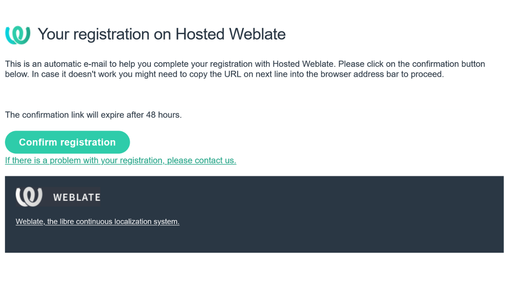
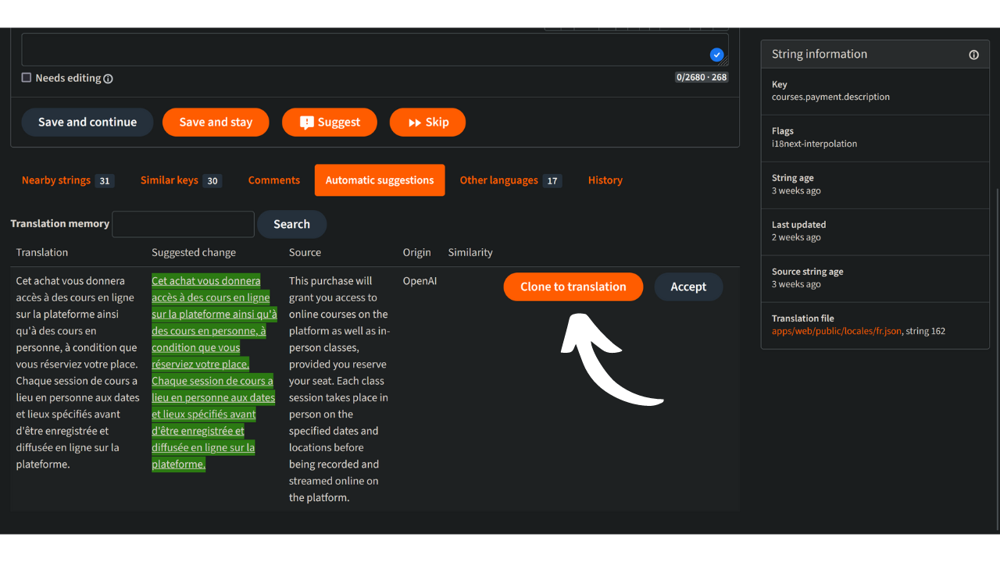
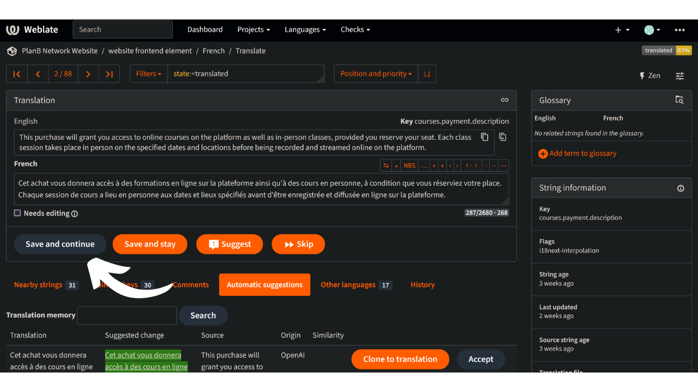

Plan ₿ Network 的使命是提供一流的比特币教育资源，并将其翻译成尽可能多的语言。网站上发布的大部分内容都是开源的，并托管在 GitHub 上，任何人都可以参与丰富该平台。贡献的形式多种多样：纠正和校对现有内容、更新信息或创建新的教程添加到平台上。

在本教程中，我们将向您展示如何轻松帮助翻译网站上的静态元素。平台上的数据分为两大类：

- 前台数据/静态元素（页面、按钮等）；
- 教育内容（教程、课程、资源......）。

为了翻译教育内容，我们使用了[人工智能](https://github.com/Asi0Flammeus/LLM-Translator)。然后，为了纠正这些文件中可能出现的错误，我们邀请校对人员提供帮助。如果您想校对某些内容，请参考以下教程：

https://planb.network/en/tutorials/others/contribution/content-review-tutorial-1ee068ca-ddaf-4bec-b44e-b41a9abfdef6
另一方面，如果您有兴趣翻译网站的静态元素（不包括教育内容），那您就找对地方了！为了有效地翻译前端内容，我们使用了 Weblate 工具，该工具使用起来非常简单，而且便于翻译。

如果您希望在 Plan ₿ Network 中添加一种全新的语言，请务必通过我们的 [Telegram 群组](https://t.me/PlanBNetwork_ContentBuilder) 联系 Plan ₿ Network 团队。如果您没有电报，可以发送电子邮件至 mari@planb.network。请务必撰写一份小简介，介绍您的身份和您所使用的语言。

我们的团队成员将为您提供具体指导，并在 Github 上开启相关 "问题"，以协调您的工作。

在按照本教程在 Weblate 上添加新语言之前，请先阅读本教程。

https://planb.network/tutorials/others/contribution/add-new-language-weblate-eef2f5c0-1aba-48a3-b8f0-a57feb761d86
当您准备好开始翻译时，请返回本教程并阅读以下要点。

## 在 Weblate 上注册

- 访问 [Plan ₿ Network 的自办 Weblate](https://weblate.planb.network/)：

- 如果您已有Weblate帐户，请点击 "登录"：

- 如果您还没有账户，请点击 "注册"：

- 输入您的电子邮件地址以及用户名和全名（可以使用化名），然后点击 "注册"：

- 在您的电子邮件收件箱中，您应已收到来自Weblate的确认信息。点击链接确认您的注册：

- 选择一个强大的密码，然后点击 "更改我的密码"：

- 现在可以返回Plan ₿ Network仪表板：

## 开始翻译

- 点击 "网站元素 "项目（不是术语表）：

- 您将进入一个界面，在这里可以看到正在进行中的语言：

- 选择语言。例如，以法语为例：

- 要开始翻译，只需点击 "翻译 "按钮：

- 您将被重定向到工作界面：

- 然后，Weblate会自动建议将句子、段落甚至单词翻译到 "语言 "框中。就您的情况而言，您可能会看到英文主字符串和另一个您的语言文本框：

- 您的任务是翻译指定的字符串。您必须在所选语言对应的方框内插入文本。例如，如果您正在处理法语版本，请在 "法语 "框中写下您的翻译：

- 点击 "自动建议 "选项卡：

- 在这里，Weblate 向您展示了人工智能翻译：

- 如果建议的翻译与您相关，您可以点击 "复制到翻译 "按钮：

- 现在，该建议已放入您的工作框中：

- 然后，您可以手动修改建议：

- 一旦翻译结果令您满意，请单击 "保存并继续 "按钮。确保在确定翻译后取消选中 "需要编辑 "框：

- 就是这样！您的翻译已成功保存。Weblate 将自动跳转到下一个翻译项目。如果您回到与您的语言相对应的仪表板，您可以看到任何类型的字符串都有不同的翻译状态。例如，如果您只需要关注 "未翻译字符串"，您可以点击特定选项卡：

- 如果您需要搜索某个特定的单词，无论是用您的语言还是用原文，都可以点击 "搜索 "并将其插入：

## 翻译指南

- 当您发现插入大括号"{"内的单词时，您不需要翻译它们。例如，在 "您的账户已创建，{{userName}}!"中，您将翻译整个句子，但保留英文中的 "username"。
- 当你在一个字符串中找到 "Plan ₿ Network "时，一定不要翻译 "network "这个单词（将 Plan ₿ Network 视为商标）。此外，一定要使用比特币的₿！
- 如果您发现只有 "网络 "一词，您可以将其翻译为 "网络"。
- 不要翻译 "B-CERT"，因为这是另一个固定的单词。
- 如果发现字符串以空格结尾，可以不填。
- 有些字符串可能在最后一个单词和标点符号之间有空格：除非语法暗示，否则不要在目标语言中留下空格。例如，"联系信息："应更正为 "联系信息："。在这种情况下，请用正确的方式翻译。您还可以添加评论，向管理员说明英文原版中的这一问题。

## 新功能

- 我们正在努力为任何字符串添加 "解释 "部分，并附上截图，以帮助您找到特定句子/单词在网站上出现的位置。目前，如果您对某些单词有任何疑问，需要找到它们在网站上的具体位置，可以在 "评论 "部分提问，或在本教程开头提到的 Telegram 群组中询问翻译协调员。

感谢您对 Plan ₿ Network 翻译工作的贡献！如果您有任何具体问题或意见，请随时通过 [Telegram group](https://t.me/PlanBNetwork_ContentBuilder) 联系我们。