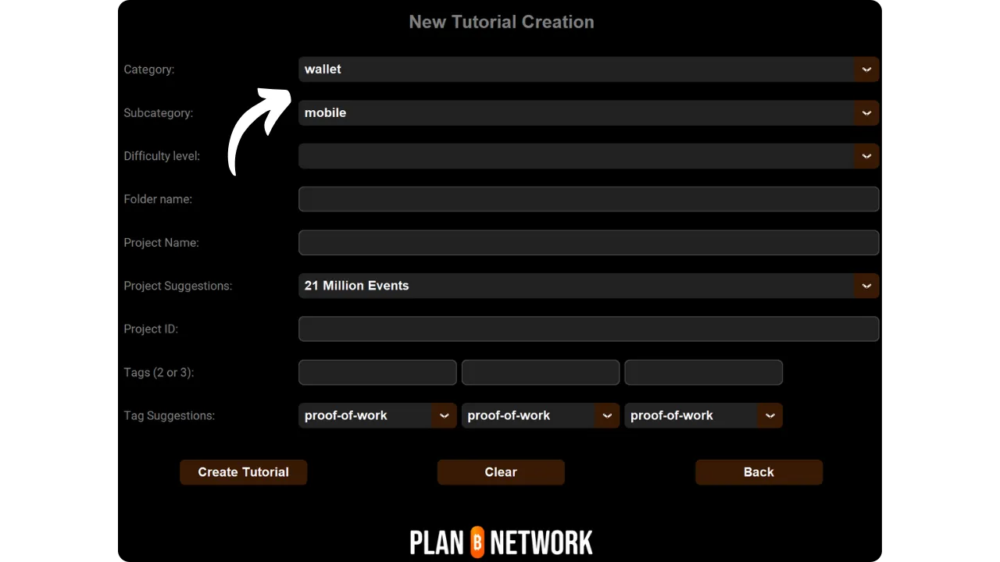

Než se pustíte do tohoto návodu na přidání nového tutoriálu, musíte provést několik předběžných kroků. Pokud jste tak ještě neučinili, podívejte se nejprve na tento úvodní návod a pak se vraťte sem :

https://planb.network/tutorials/others/contribution/write-tutorials-4d142a6a-9127-4ffb-9e0a-5aba29f169e2

Již máte :


- Vyberte si téma výukového programu;
- Kontaktoval tým sítě Plan ₿ prostřednictvím [skupiny Telegram](https://t.me/PlanBNetwork_ContentBuilder) nebo paolo@planb.network ;
- Vyberte si nástroje pro přispívání.

V tomto tutoriálu se podíváme na to, jak přidat svůj tutoriál do sítě Plan ₿ pomocí konfigurace místního prostředí GitHub Desktop. Pokud již ovládáte systém Git, tento velmi podrobný návod pro vás nemusí být nutný. Místo toho doporučuji podívat se na tento další tutoriál, kde uvádím pouze obecné pokyny, bez podrobného návodu krok za krokem :


- Zkušení uživatelé** :

https://planb.network/tutorials/others/contribution/write-tutorials-git-expert-0ce1e490-c28f-4c51-b7e0-9a6ac9728410

Pokud nechcete konfigurovat místní prostředí, postupujte podle tohoto dalšího návodu určeného pro začátečníky, kde změny provedeme přímo přes webové rozhraní GitHub :


- Začátečníci (webové rozhraní)** :

https://planb.network/tutorials/others/contribution/write-tutorials-github-web-beginner-e64f8fed-4c0b-4225-9ebb-7fc5f1c01a79

## Předpoklady

Software potřebný pro sledování tohoto výukového programu :


- [GitHub Desktop](https://desktop.github.com/);
- Editor souborů markdown, například [Obsidian](https://obsidian.md/);
- Editor kódu ([VSC](https://code.visualstudio.com/) nebo [Sublime Text](https://www.sublimetext.com/)).


Předpoklady před zahájením výuky :


- Mít účet [GitHub](https://github.com/signup);
- Mít fork zdrojového úložiště [Plan ₿ Network](https://github.com/PlanB-Network/bitcoin-educational-content);
- Mít [profil učitele v síti Plan ₿ Network](https://planb.network/professors) (pouze pokud nabízíte kompletní výuku).

Pokud potřebujete pomoci se získáním těchto předpokladů, pomohou vám mé další návody:

https://planb.network/tutorials/others/contribution/basics-of-github-471f7f00-8b5a-4b63-abb1-f1528b032bbb

https://planb.network/tutorials/others/contribution/create-github-account-a75fc39d-f0d0-44dc-9cd5-cd94aee0c07c

https://planb.network/tutorials/others/contribution/github-desktop-work-environment-5862003b-9d76-47f5-a9e0-5ec74256a8ba

https://planb.network/tutorials/others/contribution/create-teacher-profile-8ba9ba49-8fac-437a-a435-c38eebc8f8a4

Jakmile je vše na svém místě a místní prostředí je nastaveno s vlastní síťovou vidlicí Plan ₿, můžete začít přidávat výukový program.

## 1 - Vytvoření nové pobočky

Otevřete prohlížeč a přejděte na stránku s vidlicí v úložišti Plan ₿ Network. Jedná se o fork, který jste založili na GitHubu. Adresa URL vašeho forku by měla vypadat takto: `https://github.com/[vaše uživatelské jméno]/bitcoin-educational-content` :


Ujistěte se, že jste v hlavní větvi `dev`, a klikněte na tlačítko `Sync fork`. Pokud váš fork není aktuální, GitHub vás požádá o aktualizaci větve. Pokračujte v této aktualizaci. Pokud je naopak vaše větev již aktuální, GitHub vás o tom bude informovat:


Otevřete Plochu GitHubu a ujistěte se, že je v levém horním rohu okna správně vybrána vaše vidlice:


Klikněte na tlačítko `Přinést původ`. Pokud je váš místní repozitář již aktuální, aplikace GitHub Desktop nenavrhne žádné další kroky. V opačném případě se zobrazí možnost `Pull origin`. Kliknutím na toto tlačítko aktualizujete svůj místní repozitář:


Zkontrolujte, zda jste v hlavní větvi `dev`:


Klikněte na tuto větev a poté klikněte na tlačítko `Nová větev`:


Ujistěte se, že nová větev je založena na zdrojovém úložišti, tj. `PlanB-Network/bitcoin-educational-content`.

Pojmenujte svou pobočku tak, aby byl z názvu zřejmý její účel, a jednotlivá slova oddělujte pomlčkami. Řekněme například, že naším cílem je napsat návod, jak používat peněženku Sparrow. V tomto případě by se pracovní větev věnovaná psaní tohoto návodu mohla jmenovat: `tuto-sparrow-wallet-loic`. Po zadání vhodného názvu klikněte na tlačítko `Vytvořit větev` a potvrďte vytvoření větve:


Nyní klikněte na tlačítko `Publikovat větev` a uložte novou pracovní větev do své online pobočky na GitHubu:


Nyní byste měli být na ploše GitHubu v nové větvi. To znamená, že všechny změny, které provedete lokálně na svém počítači, budou uloženy výhradně v této konkrétní větvi. Dokud bude tato větev vybrána na Ploše GitHub, budou soubory viditelné lokálně na vašem počítači odpovídat souborům této větve (`tuto-sparrow-wallet-loic`), a ne hlavní větve (`dev`).


Pro každý nový článek, který chcete publikovat, musíte vytvořit novou větev z `dev`. Větev v systému Git je paralelní verze projektu, která vám umožňuje provádět změny bez vlivu na hlavní větev, dokud není práce připravena ke sloučení.

## 2 - Přidání výukových souborů

Nyní, když byla vytvořena pracovní větev, je čas integrovat nový výukový program. Máte dvě možnosti: použít můj skript Python, který automatizuje vytvoření potřebných dokumentů, nebo vytvořit každý soubor ručně. Podívejme se na kroky, které je třeba provést u každé z těchto možností.

### Pomocí mého skriptu Python

Je třeba nainstalovat :


- Python 3.8 nebo vyšší ;
- Závislosti potřebné pro skript. Spustit :

```bash
pip install customtkinter appdirs
````
Pour utiliser le script, rendez-vous dans le dossier où il est stocké. Le script se trouve dans le dépôt de data de Plan ₿ Network sous le chemin : `bitcoin-educational-content/scripts/tutorial-related/new-tutorial-creation/`.
Une fois dans le dossier, exécutez la commande :
```

python new-tutorial-creation.py

```
Une interface graphique (GUI) va s'ouvrir. La première fois, vous devrez entrer toutes les informations nécessaires, mais lors des utilisations ultérieures du script, vos informations personnelles seront mémorisées, ce qui vous évite de devoir les saisir de nouveau.

Commencez par indiquer le chemin local menant au dossier `/tutorials` sur votre clone du dépôt (`.../bitcoin-educational-content/tutorials/`). Vous pouvez le noter manuellement ou cliquer sur le bouton "Browse" pour naviguer via votre explorateur de fichiers.

Sélectionnez la langue dans laquelle vous rédigerez votre tutoriel.

Choisissez une catégorie principale pour votre tutoriel.

Ensuite, sélectionnez une sous-catégorie appropriée, en fonction de la catégorie principale que vous avez choisie.

Déterminez un niveau de difficulté pour le tutoriel.

Choisissez le nom du répertoire spécialement créé pour votre tutoriel. Le nom de ce dossier devrait refléter le logiciel abordé dans le tutoriel, en utilisant des tirets pour relier les mots. Par exemple, le dossier pourrait s'appeler `red-wallet` :

Le `project_id` est l'UUID de l'entreprise ou de l'organisation derrière l'outil présenté dans le tutoriel, disponible [dans la liste des projets](https://github.com/PlanB-Network/bitcoin-educational-content/tree/dev/resources/projects). Par exemple, pour un tutoriel sur le logiciel Sparrow Wallet, vous trouverez ce `project_id` dans le fichier : `bitcoin-educational-content/resources/projects/sparrow/project.yml`. Cette information est ajoutée au fichier YAML de votre tutoriel car Plan ₿ Network maintient une base de données des entreprises et organisations actives sur Bitcoin ou des projets connexes. En ajoutant le `project_id` associé à votre tutoriel, vous créez un lien entre votre contenu et l'entité concernée.
***Mise à jour :*** Dans la nouvelle version du script, vous n'avez plus besoin de saisir manuellement le `project_id`. Une fonction de recherche a été ajoutée pour trouver le projet par son nom et récupérer automatiquement le `project_id` correspondant. Tapez le début du nom du projet dans la case "Project name" pour le rechercher, puis sélectionnez l'entreprise souhaitée dans le menu déroulant. Le `project_id` sera automatiquement renseigné dans la case en dessous. Vous avez également la possibilité de le noter manuellement si nécessaire.

Pour les tags, sélectionnez 2 ou 3 mots-clés pertinents en relation avec le contenu de votre tutoriel, en les choisissant exclusivement [dans la liste des tags de Plan ₿ Network](https://github.com/PlanB-Network/bitcoin-educational-content/blob/dev/docs/50-planb-tags.md).

Dans la case "Contributor's GitHub ID", inscrivez votre identifiant GitHub.

Pour la case "PBN professor's ID", saisissez votre identifiant en utilisant les mots de la liste BIP39, tel qu'il apparaît sur [votre profil professeur](https://github.com/PlanB-Network/bitcoin-educational-content/tree/dev/professors).

Pour plus de détails sur votre identifiant de professeur, veuillez consulter le tutoriel suivant :
https://planb.network/tutorials/others/contribution/create-teacher-profile-8ba9ba49-8fac-437a-a435-c38eebc8f8a4

Une fois toutes les informations saisies et vérifiées, cliquez sur "Create Tutorial" pour valider la création des fichiers de votre tutoriel. Cela générera en local le dossier de votre tutoriel et tous les fichiers nécessaires dans le dossier de la catégorie sélectionnée.

Vous pouvez maintenant passer outre la sous-partie "Sans mon script Python", ainsi que l'étape 3 "Remplir le fichier YAML", car le script a déjà effectué ces actions automatiquement pour vous. Passez directement à l'étape 4 et à la rédaction de votre tutoriel.
Pour plus d'informations sur ce script Python, vous pouvez également [consulter son README](https://github.com/PlanB-Network/bitcoin-educational-content/blob/dev/scripts/tutorial-related/new-tutorial-creation/README.md).
### Sans mon script Python
Ouvrez votre gestionnaire de fichiers et dirigez-vous vers le dossier `bitcoin-educational-content`, qui représente le clone local de votre dépôt. Vous devriez normalement le trouver sous `Documents\GitHub\bitcoin-educational-content`.
Au sein de ce répertoire, il sera nécessaire de localiser le sous-dossier adéquat pour le placement de votre tutoriel. L'organisation des dossiers reflète les différentes sections du site web Plan ₿ Network. Dans notre exemple, puisque nous souhaitons ajouter un tutoriel sur Sparrow Wallet, il convient de se rendre dans le chemin suivant : `bitcoin-educational-content\tutorials\wallet` qui correspond à la section `WALLET` sur le site web :

Au sein du dossier `wallet`, il faut créer un nouveau répertoire spécifiquement dédié à votre tutoriel. Le nom de ce dossier doit évoquer le logiciel traité dans le tutoriel, en veillant à relier les mots par des tirets. Pour mon exemple, le dossier sera intitulé `sparrow-wallet` :

Dans ce nouveau sous-dossier dédié à votre tutoriel, il faut ajouter plusieurs éléments :
- Créez un dossier `assets`, destiné à recevoir toutes les illustrations nécessaires à votre tutoriel ;
- Au sein de ce dossier `assets`, il faut créer un sous-dossier nommé selon le code de langue originale du tutoriel. Par exemple, si le tutoriel est rédigé en anglais, ce sous-dossier doit être nommé `en`. Placez-y tous les visuels du tutoriel (schémas, images, captures d’écran, etc.).
- Un fichier `tutorial.yml` doit être créé pour y consigner les détails relatifs à votre tutoriel ;
- Un fichier en format markdown est à créer pour y rédiger le contenu effectif de votre tutoriel. Ce fichier doit être intitulé selon le code de la langue de rédaction. Par exemple, pour un tutoriel rédigé en français, le fichier devra s'appeler `fr.md`.

Pour résumer, voici la hiérarchie des fichiers à créer :
```

bitcoin-educational-content/

└──── výukové materiály/

└── peněženka/ (změnit na správnou kategorii)

└── sparrow-wallet/ (upravit pomocí názvu aplikace)

├── aktiva/

│ ├── en/ (změňte na příslušný kód jazyka)

├── tutorial.yml

└── fr.md (upravit podle kódu příslušného jazyka)

```
## 3 - Remplir le fichier YAML
Remplissez le fichier `tutorial.yml` en copiant le modèle suivant :
```

id:

project_id:

tagy:

-

-

-

kategorie:

úroveň:

úvěry:

profesor:

# Korektury metadat

original_language:

korektury:


  - jazyk:

last_contribution_date:

naléhavost:

přispěvatelé_id:

-

odměna:

````

Zde jsou povinná pole:


- id**: UUID (_Universally Unique Identifier_), který jednoznačně identifikuje výukový program. Můžete jej vygenerovat pomocí [online nástroje](https://www.uuidgenerator.net/version4). Jediným omezením je, že tento UUID musí být náhodný, aby nedošlo ke konfliktu s jiným UUID na platformě;
- project_id** : UUID společnosti nebo organizace, která stojí za nástrojem prezentovaným v tutoriálu [ze seznamu projektů](https://github.com/PlanB-Network/bitcoin-educational-content/tree/dev/resources/projects). Pokud například zpracováváte výukový program o softwaru Sparrow Wallet, najdete toto `project_id` v následujícím souboru: `bitcoin-educational-content/resources/projects/sparrow/project.yml`. Tato informace je přidána do souboru YAML vašeho výukového programu, protože síť Plan ₿ udržuje databázi všech společností a organizací působících v oblasti Bitcoinu nebo souvisejících projektů. Přidáním `project_id` propojené entity do svého tutoriálu vytvoříte vazbu mezi těmito dvěma prvky;
- tagy**: 2 nebo 3 relevantní klíčová slova související s obsahem výukového programu, vybraná výhradně [ze seznamu tagů sítě Plan ₿](https://github.com/PlanB-Network/bitcoin-educational-content/blob/dev/docs/50-planb-tags.md);
- kategorie** : Podkategorie odpovídající obsahu výuky podle struktury sítě Plan ₿ (např. pro peněženky: `desktop`, `hardware`, `mobil`, `zálohování`) ;
- úroveň** : Úroveň obtížnosti výuky, od :
    - začátečník`
    - `intermediate`
    - `pokročilý`
    - `expert`
- profesor**: (slova BIP39), jak je zobrazeno na [profilu učitele](https://github.com/PlanB-Network/bitcoin-educational-content/tree/dev/professors);
- original_language** : Původní jazyk výukového programu (např. `fr`, `en` atd.) ;
- korektury**: Informace o procesu korektury. Vyplňte první část, protože korektura vlastního výukového programu se počítá jako první ověření:
    - jazyk**: (např. `fr`, `en` atd.).
    - last_contribution_date**: Dnešní datum.
    - naléhavost** : Nechte prázdné.
    - přispěvatelé_id** : Vaše GitHub ID.
    - odměna** : Nechte prázdné.

Další podrobnosti o ID učitele naleznete v příslušném výukovém kurzu :

https://planb.network/tutorials/others/contribution/create-teacher-profile-8ba9ba49-8fac-437a-a435-c38eebc8f8a4

Zde je příklad souboru `tutorial.yml` vyplněného pro výukový program o peněžence Blockstream Green:

```yaml
id: e84edaa9-fb65-48c1-a357-8a5f27996143
project_id: 3b2f45e6-d612-412c-95ba-cf65b49aa5b8
tags:
- wallets
- software
- keys
category: mobile
level: beginner
credits:
professor: pretty-private
# Proofreading metadata
original_language: fr
proofreading:
- language: fr
last_contribution_date: 2024-11-20
urgency:
contributors_id:
- LoicPandul
reward:
```

Po dokončení úprav souboru `tutorial.yml` uložte dokument kliknutím na `Soubor > Uložit` :


Nyní můžete zavřít editor kódu.

## 4 - Vyplňte soubor Markdown

Nyní můžete otevřít svůj výukový soubor pojmenovaný kódem jazyka, např. `en.md`. Přejděte na Obsidian, v levé části okna, a přejděte dolů do stromu složek na složku s výukovým programem a požadovaným souborem :


Kliknutím na soubor jej otevřete:


Začneme vyplněním oddílu `Vlastnosti` v horní části dokumentu.


Ručně přidejte a vyplňte následující blok kódu:

```markdown
---
name: [Titre]
description: [Description]
---
```


Vyplňte název výukového programu a krátký popis:


Poté přidejte cestu k obrázku obálky na začátek výukového programu. K tomu si poznamenejte :

```markdown

```

Tato syntaxe se vám bude hodit, kdykoli budete potřebovat přidat obrázek do výukového programu. Vykřičník označuje obrázek, jehož alternativní text (alt) je uveden mezi hranatými závorkami. Cesta k obrázku je uvedena mezi závorkami:


## 5 - Přidání loga a obálky

Do složky `assets` je třeba přidat soubor s názvem `logo.webp`, který bude sloužit jako miniatura článku. Tento obrázek musí být ve formátu `.webp` a čtvercové velikosti, aby odpovídal uživatelskému rozhraní. Můžete si zvolit logo softwaru, o kterém pojednává výukový program, nebo jakýkoli jiný vhodný obrázek, pokud je bez licenčních poplatků. Kromě toho přidejte na stejné místo obrázek s názvem `cover.webp`. Ten se bude zobrazovat v horní části vašeho výukového programu. Ujistěte se, že tento obrázek, stejně jako logo, respektuje práva na použití a je vhodný pro kontext vašeho tutoriálu:


## 6 - Napsání výukového programu a přidání vizualizací

Pokračujte v psaní výukového obsahu. Pokud chcete uvést podnadpis, použijte příslušné formátování markdown tak, že text předepíšete předponou `##` :


Podsložka Jazyk ve složce `assets` slouží k uložení diagramů a vizuálních materiálů, které budou doprovázet výukový program. Pokud je to možné, vyvarujte se vkládání textu do obrázků, aby byl obsah přístupný mezinárodnímu publiku. Prezentovaný software bude samozřejmě obsahovat text, ale pokud přidáváte schémata nebo další údaje na snímky softwaru, udělejte to bez textu, nebo pokud je to nezbytné, použijte angličtinu.


Pro pojmenování obrázků jednoduše použijte čísla odpovídající pořadí jejich výskytu ve výukovém programu ve formátu dvou číslic (nebo tří číslic, pokud výukový program obsahuje více než 99 obrázků). Například první obrázek pojmenujte `01.webp`, druhý `02.webp` a tak dále.

Vaše obrázky musí být pouze ve formátu `.webp`. V případě potřeby můžete použít [můj software pro konverzi obrázků](https://github.com/LoicPandul/ImagesConverter).


Chcete-li do dokumentu vložit diagram, použijte následující příkaz v jazyce Markdown a dbejte na zadání vhodného alternativního textu a správné cesty k obrázku:

```markdown

```

Vykřičník na začátku označuje obrázek. Alternativní text, který pomáhá s přístupností a odkazováním, je umístěn mezi hranatými závorkami. Nakonec je mezi závorkami uvedena cesta k obrázku.

Pokud chcete vytvořit vlastní schéma, nezapomeňte dodržet grafické pokyny pro plánování sítě, abyste zajistili vizuální konzistenci:


- Písmo**: [Rubik](https://fonts.google.com/specimen/Rubik);
- Barvy** :
 - Oranžová: #FF5C00
 - Černá : #000000
 - Bílá: #FFFFFF

**Je nutné, aby všechny vizuály integrované do vašich výukových programů byly bez autorských práv nebo aby respektovaly licenci zdrojových souborů**. Proto jsou všechna schémata publikovaná v síti Plan ₿ k dispozici pod licencí CC-BY-SA, stejně jako text.

**-> Tip:** Při veřejném sdílení souborů, například obrázků, je důležité odstranit nadbytečná metadata. Ta mohou obsahovat citlivé informace, jako jsou údaje o umístění, data vytvoření a údaje o autorovi. V zájmu ochrany soukromí je dobré tato metadata odstranit. Pro zjednodušení této operace můžete použít specializované nástroje, například [Exif Cleaner](https://exifcleaner.com/), který umožňuje vyčistit metadata dokumentu jednoduchým přetažením.

## 7 - Uložte a navrhněte výukový program

Po dokončení psaní výukového programu ve zvoleném jazyce je dalším krokem odeslání **žádosti o stažení**. Správce poté přidá chybějící překlady do vašeho tutoriálu pomocí naší metody automatického překladu s lidskou korekturou.

Chcete-li provést žádost o stažení, otevřete aplikaci GitHub Desktop. Program by měl automaticky zjistit všechny změny, které jste provedli lokálně ve své větvi původního úložiště. Než budete pokračovat, pečlivě zkontrolujte v levé části rozhraní, zda tyto změny odpovídají tomu, co jste očekávali:


Přidejte název revize a kliknutím na modré tlačítko `Odeslat do [vaší větve]` tyto změny potvrďte:


Revize je záznam změn provedených ve větvi, doplněný popisnou zprávou, který umožňuje sledovat vývoj projektu v čase. Jedná se o jakýsi mezilehlý kontrolní bod.

Poté klikněte na tlačítko `Push origin`. Tím odešlete revizi do svého forku:


Pokud jste výukový program nedokončili, můžete se k němu vrátit později a provést nové revize. Pokud jste dokončili úpravy této větve, klikněte na tlačítko `Preview Pull Request`:


Můžete naposledy zkontrolovat, zda jsou vaše změny správné, a poté kliknout na tlačítko `Vytvořit žádost o stažení`:


Požadavek na vytažení je požadavek na začlenění změn z vaší větve do hlavní větve úložiště sítě Plan ₿, což umožňuje kontrolu a diskusi o změnách před jejich sloučením.

Na přípravné stránce žádosti o stažení budete v prohlížeči automaticky přesměrováni na GitHub:


Zadejte název, který stručně shrnuje změny, které chcete sloučit se zdrojovým úložištěm. Přidejte stručný komentář popisující tyto změny (pokud je s vytvořením vašeho výukového programu spojeno číslo problému, nezapomeňte jako komentář uvést `Uzavírá #{číslo problému}`) a poté kliknutím na zelené tlačítko `Vytvořit žádost o sloučení` žádost potvrďte:


Vaše žádost o stažení bude poté viditelná na kartě `Žádost o stažení` v hlavním úložišti sítě Plán ₿. Nyní stačí počkat, až se vám ozve správce a potvrdí, že váš příspěvek byl sloučen, nebo požádá o další úpravy.


Po sloučení vašeho PR s hlavní větví doporučujeme smazat vaši pracovní větev (`tuto-sparrow-wallet`), abyste zachovali čistou historii vaší větve. GitHub vám tuto možnost nabídne automaticky na stránce PR:


V aplikaci GitHub Desktop se můžete přesunout zpět do hlavní větve svého forku (`dev`).


Pokud chcete provést změny ve svém příspěvku poté, co jste již podali PR, závisí postup na aktuálním stavu vašeho PR:


- Pokud je váš PR stále otevřený a ještě nebyl sloučen, proveďte změny lokálně a zůstaňte ve stejné větvi. Po dokončení změn přidejte pomocí tlačítka `Push origin` novou revizi do stále otevřeného PR;
- V případě, že váš PR již byl sloučen s hlavní větví, budete muset proces opakovat od začátku vytvořením nové větve a následným odesláním nového PR. Před pokračováním se ujistěte, že je váš místní repozitář synchronizován se zdrojovým repozitářem sítě Plan ₿.

Pokud máte technické potíže s odesláním návodu, neváhejte požádat o pomoc na [naší speciální skupině pro příspěvky na Telegramu](https://t.me/PlanBNetwork_ContentBuilder). Moc vám děkujeme!