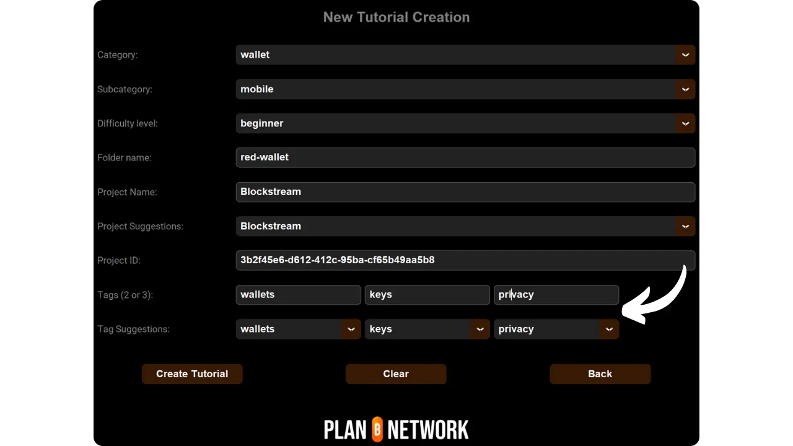

Bevor Sie dieses Tutorial zum Hinzufügen eines neuen Tutorials lesen, müssen Sie einige vorbereitende Schritte durchgeführt haben. Falls Sie dies noch nicht getan haben, sehen Sie sich bitte zuerst dieses einführende Tutorial an und kommen Sie dann hierher zurück:

https://planb.network/tutorials/others/contribution/write-tutorials-4d142a6a-9127-4ffb-9e0a-5aba29f169e2
Sie haben bereits :


- Wählen Sie ein Thema für Ihr Lernprogramm;
- Kontaktieren Sie das Plan ₿ Network Team über [Telegram group] (https://t.me/PlanBNetwork_ContentBuilder) oder paolo@planb.network;
- Wählen Sie Ihre Beitragstools.

In diesem Tutorial sehen wir uns an, wie Sie Ihr Tutorial zum Plan ₿ Network hinzufügen, indem Sie Ihre lokale Umgebung mit GitHub Desktop konfigurieren. Wenn Sie Git bereits beherrschen, ist dieses sehr detaillierte Tutorial für Sie vielleicht nicht notwendig. Stattdessen empfehle ich Ihnen, einen Blick auf dieses andere Tutorial zu werfen, in dem ich nur die allgemeinen Richtlinien vorstelle, ohne detaillierte Schritt-für-Schritt-Anleitungen:


- Erfahrene Benutzer** :

https://planb.network/tutorials/others/contribution/write-tutorials-git-expert-0ce1e490-c28f-4c51-b7e0-9a6ac9728410
Wenn Sie es vorziehen, Ihre lokale Umgebung nicht zu konfigurieren, folgen Sie diesem anderen Tutorial für Anfänger, in dem wir die Änderungen direkt über die GitHub-Weboberfläche vornehmen:


- Anfänger (Webschnittstelle)** :

https://planb.network/tutorials/others/contribution/write-tutorials-github-web-beginner-e64f8fed-4c0b-4225-9ebb-7fc5f1c01a79
## Voraussetzungen

Erforderliche Software für dieses Tutorial :


- [GitHub Desktop](https://desktop.github.com/);
- Ein Markdown-Dateieditor wie [Obsidian] (https://obsidian.md/);
- Ein Code-Editor ([VSC](https://code.visualstudio.com/) oder [Sublime Text](https://www.sublimetext.com/)).


Voraussetzungen vor Beginn des Tutorials :


- Sie haben ein [GitHub-Konto] (https://github.com/signup);
- Haben Sie einen Fork des [Plan ₿ Network source repository] (https://github.com/PlanB-Network/bitcoin-educational-content);
- Haben Sie [ein Lehrerprofil im Plan ₿ Network] (https://planb.network/professors) (nur wenn Sie ein vollständiges Tutorium anbieten).

Wenn Sie Hilfe brauchen, um diese Voraussetzungen zu schaffen, helfen Ihnen meine anderen Tutorials:

https://planb.network/tutorials/others/contribution/basics-of-github-471f7f00-8b5a-4b63-abb1-f1528b032bbb
https://planb.network/tutorials/others/contribution/create-github-account-a75fc39d-f0d0-44dc-9cd5-cd94aee0c07c
https://planb.network/tutorials/others/contribution/github-desktop-work-environment-5862003b-9d76-47f5-a9e0-5ec74256a8ba
https://planb.network/tutorials/others/contribution/create-teacher-profile-8ba9ba49-8fac-437a-a435-c38eebc8f8a4
Sobald alles vorhanden ist und Ihre lokale Umgebung mit Ihrem eigenen Plan ₿ Network fork eingerichtet ist, können Sie mit dem Hinzufügen des Tutorials beginnen.

## 1 - Einen neuen Zweig erstellen

Öffnen Sie Ihren Browser und navigieren Sie zu Ihrer Fork-Seite im Plan ₿ Network Repository. Dies ist der Fork, den Sie auf GitHub eingerichtet haben. Die URL Ihrer Abspaltung sollte wie folgt aussehen: `https://github.com/[Ihr-Benutzername]/bitcoin-educational-content` :


Vergewissern Sie sich, dass Sie sich auf dem Hauptzweig `dev` befinden, und klicken Sie dann auf die Schaltfläche `Sync fork`. Wenn Ihr Fork nicht auf dem neuesten Stand ist, wird GitHub Sie auffordern, Ihren Branch zu aktualisieren. Fahren Sie mit dieser Aktualisierung fort. Ist Ihr Zweig hingegen bereits auf dem neuesten Stand, werden Sie von GitHub darüber informiert:


Öffnen Sie GitHub Desktop und vergewissern Sie sich, dass Ihr Fork in der oberen linken Ecke des Fensters korrekt ausgewählt ist:


Klicken Sie auf die Schaltfläche "Herkunft abrufen". Wenn Ihr lokales Repository bereits auf dem neuesten Stand ist, schlägt GitHub Desktop keine weiteren Maßnahmen vor. Andernfalls wird die Option "Herkunft abrufen" angezeigt. Klicken Sie auf diese Schaltfläche, um Ihr lokales Repository zu aktualisieren:


Stellen Sie sicher, dass Sie sich auf dem `dev`-Hauptzweig befinden:


Klicken Sie auf diesen Zweig und dann auf die Schaltfläche "Neuer Zweig":


Stellen Sie sicher, dass der neue Zweig auf dem Quell-Repository basiert, d.h. `PlanB-Network/bitcoin-educational-content`.

Benennen Sie Ihren Zweig so, dass der Titel den Zweck klar erkennen lässt, und trennen Sie die einzelnen Wörter mit Bindestrichen. Nehmen wir zum Beispiel an, unser Ziel ist es, ein Tutorial zu schreiben, wie man Sparrow Wallet benutzt. In diesem Fall könnte der Arbeitszweig, der für die Erstellung dieses Tutorials vorgesehen ist, den Namen "tuto-sparrow-wallet-loic" tragen. Sobald Sie den entsprechenden Namen eingegeben haben, klicken Sie auf "Zweig erstellen", um die Erstellung des Zweigs zu bestätigen:


Klicken Sie nun auf die Schaltfläche "Zweig veröffentlichen", um Ihren neuen Arbeitszweig auf Ihrem Online-Zweig auf GitHub zu speichern:


Auf GitHub Desktop sollten Sie sich nun in Ihrem neuen Zweig befinden. Das bedeutet, dass alle Änderungen, die Sie lokal auf Ihrem Computer vornehmen, ausschließlich in diesem speziellen Zweig gespeichert werden. Solange dieser Zweig auf GitHub Desktop ausgewählt bleibt, entsprechen die lokal auf Ihrem Computer sichtbaren Dateien denen dieses Zweigs (`tuto-sparrow-wallet-loic`) und nicht denen des Hauptzweigs (`dev`).


Für jeden neuen Artikel, den Sie veröffentlichen möchten, müssen Sie einen neuen Zweig von `dev` erstellen. Ein Zweig in Git ist eine parallele Version des Projekts, die es Ihnen ermöglicht, Änderungen vorzunehmen, ohne den Hauptzweig zu beeinflussen, bis die Arbeit zum Zusammenführen bereit ist.

## 2 - Tutorial-Dateien hinzufügen

Nun, da der Arbeitszweig erstellt wurde, ist es an der Zeit, Ihr neues Tutorial zu integrieren. Sie haben zwei Möglichkeiten: Verwenden Sie mein Python-Skript, das die Erstellung der erforderlichen Dokumente automatisiert, oder erstellen Sie jede Datei manuell. Schauen wir uns die Schritte an, die für jede Option zu befolgen sind.

### Mit meinem Python-Skript

Sie müssen die Datei :


- Python 3.8 oder höher ;
- Für das Skript erforderliche Abhängigkeiten. Ausführen:

```bash
pip install customtkinter appdirs
````
Pour utiliser le script, rendez-vous dans le dossier où il est stocké. Le script se trouve dans le dépôt de data de Plan ₿ Network sous le chemin : `bitcoin-educational-content/scripts/tutorial-related/new-tutorial-creation/`.
Une fois dans le dossier, exécutez la commande :
```

python neue-lehrgang-erstellung.py

```
Une interface graphique (GUI) va s'ouvrir. La première fois, vous devrez entrer toutes les informations nécessaires, mais lors des utilisations ultérieures du script, vos informations personnelles seront mémorisées, ce qui vous évite de devoir les saisir de nouveau.

Commencez par indiquer le chemin local menant au dossier `/tutorials` sur votre clone du dépôt (`.../bitcoin-educational-content/tutorials/`). Vous pouvez le noter manuellement ou cliquer sur le bouton "Browse" pour naviguer via votre explorateur de fichiers.

Sélectionnez la langue dans laquelle vous rédigerez votre tutoriel.

Choisissez une catégorie principale pour votre tutoriel.

Ensuite, sélectionnez une sous-catégorie appropriée, en fonction de la catégorie principale que vous avez choisie.

Déterminez un niveau de difficulté pour le tutoriel.

Choisissez le nom du répertoire spécialement créé pour votre tutoriel. Le nom de ce dossier devrait refléter le logiciel abordé dans le tutoriel, en utilisant des tirets pour relier les mots. Par exemple, le dossier pourrait s'appeler `red-wallet` :

Le `project_id` est l'UUID de l'entreprise ou de l'organisation derrière l'outil présenté dans le tutoriel, disponible [dans la liste des projets](https://github.com/PlanB-Network/bitcoin-educational-content/tree/dev/resources/projects). Par exemple, pour un tutoriel sur le logiciel Sparrow Wallet, vous trouverez ce `project_id` dans le fichier : `bitcoin-educational-content/resources/projects/sparrow/project.yml`. Cette information est ajoutée au fichier YAML de votre tutoriel car Plan ₿ Network maintient une base de données des entreprises et organisations actives sur Bitcoin ou des projets connexes. En ajoutant le `project_id` associé à votre tutoriel, vous créez un lien entre votre contenu et l'entité concernée.
***Mise à jour :*** Dans la nouvelle version du script, vous n'avez plus besoin de saisir manuellement le `project_id`. Une fonction de recherche a été ajoutée pour trouver le projet par son nom et récupérer automatiquement le `project_id` correspondant. Tapez le début du nom du projet dans la case "Project name" pour le rechercher, puis sélectionnez l'entreprise souhaitée dans le menu déroulant. Le `project_id` sera automatiquement renseigné dans la case en dessous. Vous avez également la possibilité de le noter manuellement si nécessaire.

Pour les tags, sélectionnez 2 ou 3 mots-clés pertinents en relation avec le contenu de votre tutoriel, en les choisissant exclusivement [dans la liste des tags de Plan ₿ Network](https://github.com/PlanB-Network/bitcoin-educational-content/blob/dev/docs/50-planb-tags.md).

Dans la case "Contributor's GitHub ID", inscrivez votre identifiant GitHub.

Pour la case "PBN professor's ID", saisissez votre identifiant en utilisant les mots de la liste BIP39, tel qu'il apparaît sur [votre profil professeur](https://github.com/PlanB-Network/bitcoin-educational-content/tree/dev/professors).

Pour plus de détails sur votre identifiant de professeur, veuillez consulter le tutoriel suivant :
https://planb.network/tutorials/others/contribution/create-teacher-profile-8ba9ba49-8fac-437a-a435-c38eebc8f8a4
Une fois toutes les informations saisies et vérifiées, cliquez sur "Create Tutorial" pour valider la création des fichiers de votre tutoriel. Cela générera en local le dossier de votre tutoriel et tous les fichiers nécessaires dans le dossier de la catégorie sélectionnée.

Vous pouvez maintenant passer outre la sous-partie "Sans mon script Python", ainsi que l'étape 3 "Remplir le fichier YAML", car le script a déjà effectué ces actions automatiquement pour vous. Passez directement à l'étape 4 et à la rédaction de votre tutoriel.
Pour plus d'informations sur ce script Python, vous pouvez également [consulter son README](https://github.com/PlanB-Network/bitcoin-educational-content/blob/dev/scripts/tutorial-related/new-tutorial-creation/README.md).
### Sans mon script Python
Ouvrez votre gestionnaire de fichiers et dirigez-vous vers le dossier `bitcoin-educational-content`, qui représente le clone local de votre dépôt. Vous devriez normalement le trouver sous `Documents\GitHub\bitcoin-educational-content`.
Au sein de ce répertoire, il sera nécessaire de localiser le sous-dossier adéquat pour le placement de votre tutoriel. L'organisation des dossiers reflète les différentes sections du site web Plan ₿ Network. Dans notre exemple, puisque nous souhaitons ajouter un tutoriel sur Sparrow Wallet, il convient de se rendre dans le chemin suivant : `bitcoin-educational-content\tutorials\wallet` qui correspond à la section `WALLET` sur le site web :

Au sein du dossier `wallet`, il faut créer un nouveau répertoire spécifiquement dédié à votre tutoriel. Le nom de ce dossier doit évoquer le logiciel traité dans le tutoriel, en veillant à relier les mots par des tirets. Pour mon exemple, le dossier sera intitulé `sparrow-wallet` :

Dans ce nouveau sous-dossier dédié à votre tutoriel, il faut ajouter plusieurs éléments :
- Créez un dossier `assets`, destiné à recevoir toutes les illustrations nécessaires à votre tutoriel ;
- Au sein de ce dossier `assets`, il faut créer un sous-dossier nommé selon le code de langue originale du tutoriel. Par exemple, si le tutoriel est rédigé en anglais, ce sous-dossier doit être nommé `en`. Placez-y tous les visuels du tutoriel (schémas, images, captures d’écran, etc.).
- Un fichier `tutorial.yml` doit être créé pour y consigner les détails relatifs à votre tutoriel ;
- Un fichier en format markdown est à créer pour y rédiger le contenu effectif de votre tutoriel. Ce fichier doit être intitulé selon le code de la langue de rédaction. Par exemple, pour un tutoriel rédigé en français, le fichier devra s'appeler `fr.md`.

Pour résumer, voici la hiérarchie des fichiers à créer :
```

bitcoin-ausbildungsinhalt/

└── tutorials/

└── Brieftasche/ (Wechsel in die richtige Kategorie)

└── sparrow-wallet/ (ändern mit tuto-Name)

├── Vermögenswerte/

│ ├── en/ (Wechsel zum entsprechenden Sprachcode)

├── tutorial.yml

└── fr.md (entsprechend dem jeweiligen Sprachcode zu ändern)

```
## 3 - Remplir le fichier YAML
Remplissez le fichier `tutorial.yml` en copiant le modèle suivant :
```

id:

projekt_id:

tags:

-

-

-

kategorie:

ebene:

kredite:

professor:

# Korrekturlesen von Metadaten

original_language:

korrekturlesen:


  - sprache:

letzter_Beitrag_datum:

dringlichkeit:

mitwirkende_id:

-

belohnung:

````

Hier sind die erforderlichen Felder:


- id**: Eine UUID (_Universally Unique Identifier_) zur eindeutigen Identifizierung des Lernprogramms. Sie können sie mit [einem Online-Tool] (https://www.uuidgenerator.net/version4) erzeugen. Die einzige Einschränkung ist, dass diese UUID zufällig sein muss, damit sie nicht mit einer anderen UUID auf der Plattform kollidiert;
- project_id** : Die UUID des Unternehmens oder der Organisation, die hinter dem im Tutorium vorgestellten Tool steht [aus der Liste der Projekte] (https://github.com/PlanB-Network/bitcoin-educational-content/tree/dev/resources/projects). Wenn Sie zum Beispiel ein Tutorial über die Sparrow Wallet Software machen, können Sie diese `project_id` in der folgenden Datei finden: `bitcoin-educational-content/resources/projects/sparrow/project.yml`. Diese Information wird in der YAML-Datei Ihres Tutorials hinzugefügt, weil das Plan ₿ Network eine Datenbank aller Unternehmen und Organisationen unterhält, die an Bitcoin oder verwandten Projekten arbeiten. Indem Sie die `project_id` der verlinkten Entität zu Ihrem Tutorial hinzufügen, schaffen Sie eine Verbindung zwischen den beiden Elementen;
- tags**: 2 oder 3 relevante Schlüsselwörter, die sich auf den Inhalt des Tutorials beziehen und ausschließlich [aus der Tag-Liste des Plan ₿ Network] (https://github.com/PlanB-Network/bitcoin-educational-content/blob/dev/docs/50-planb-tags.md) ausgewählt werden;
- kategorie** : Die Unterkategorie, die dem Inhalt des Tutorials entspricht, gemäß der Plan ₿ Netzwerkstruktur (z.B. für Wallets: `Desktop`, `Hardware`, `Mobile`, `Backup`) ;
- stufe** : Schwierigkeitsgrad des Tutorials, von :
    - anfängerin
    - mittel
    - fortgeschritten
    - experte
- professor**: Ihre "contributor_id" (BIP39-Wörter), wie sie auf [Ihr Lehrerprofil] (https://github.com/PlanB-Network/bitcoin-educational-content/tree/dev/professors) angezeigt wird;
- original_language** : Die Originalsprache des Tutorials (z.B. `fr`, `en`, etc.) ;
- korrekturlesen**: Informationen über den Korrekturleseprozess. Füllen Sie den ersten Teil aus, denn das Korrekturlesen Ihres eigenen Tutoriums zählt als erste Validierung:
    - sprache**: Korrekturlesen von Sprachcodes (z. B. `fr`, `en`, usw.).
    - letzter_Beitrag_datum**: Das heutige Datum.
    - dringlichkeit** : Leer lassen.
    - contributors_id** : Ihre GitHub-ID.
    - belohnung** : Leer lassen.

Weitere Einzelheiten zu Ihrer Lehrer-ID finden Sie in der entsprechenden Anleitung:

https://planb.network/tutorials/others/contribution/create-teacher-profile-8ba9ba49-8fac-437a-a435-c38eebc8f8a4
Hier ist ein Beispiel für eine "tutorial.yml"-Datei, die für ein Tutorial über die Blockstream Green Wallet erstellt wurde:

```yaml
id: e84edaa9-fb65-48c1-a357-8a5f27996143
project_id: 3b2f45e6-d612-412c-95ba-cf65b49aa5b8
tags:
- wallets
- software
- keys
category: mobile
level: beginner
credits:
professor: pretty-private
# Proofreading metadata
original_language: fr
proofreading:
- language: fr
last_contribution_date: 2024-11-20
urgency:
contributors_id:
- LoicPandul
reward:
```

Wenn Sie die Bearbeitung der Datei "tutorial.yml" abgeschlossen haben, speichern Sie Ihr Dokument, indem Sie auf "Datei > Speichern" klicken:


Sie können nun Ihren Code-Editor schließen.

## 4 - Füllen Sie die Markdown-Datei aus

Nun können Sie Ihre Tutorial-Datei öffnen, die mit Ihrem Sprachcode benannt ist, z. B. `de.md`. Gehen Sie zu Obsidian, auf der linken Seite des Fensters, und scrollen Sie im Ordnerbaum nach unten zu Ihrem Tutorial-Ordner und der gewünschten Datei:


Klicken Sie auf die Datei, um sie zu öffnen:


Wir beginnen damit, den Abschnitt "Eigenschaften" ganz oben im Dokument auszufüllen.


Fügen Sie den folgenden Codeblock manuell hinzu und füllen Sie ihn aus:

```markdown
---
name: [Titre]
description: [Description]
---
```


Geben Sie den Namen Ihres Tutorials und eine kurze Beschreibung ein:


Fügen Sie dann den Pfad zum Titelbild am Anfang Ihres Tutorials ein. Beachten Sie dazu:

```markdown

```

Diese Syntax ist immer dann nützlich, wenn Sie ein Bild zu Ihrem Tutorial hinzufügen möchten. Das Ausrufezeichen steht für ein Bild, dessen Alternativtext (alt) zwischen den eckigen Klammern angegeben wird. Der Pfad zum Bild wird zwischen den Klammern angegeben:


## 5 - Logo und Umschlag hinzufügen

Im Ordner "Assets" müssen Sie eine Datei mit dem Namen "logo.webp" hinzufügen, die als Miniaturbild für Ihren Artikel dienen wird. Dieses Bild muss im Format `.webp` sein und eine quadratische Größe haben, damit es zur Benutzeroberfläche passt. Sie können das Logo der in der Anleitung behandelten Software oder ein beliebiges anderes relevantes Bild wählen, solange es lizenzfrei ist. Fügen Sie außerdem ein Bild mit dem Titel "cover.webp" an der gleichen Stelle ein. Dieses Bild wird am Anfang des Tutorials angezeigt. Achten Sie darauf, dass dieses Bild, ebenso wie das Logo, die Nutzungsrechte respektiert und dem Kontext Ihres Tutorials angemessen ist:


## 6 - Schreiben des Tutorials und Hinzufügen von Bildmaterial

Fahren Sie mit dem Schreiben des Inhalts Ihres Tutorials fort. Wenn Sie einen Untertitel einfügen möchten, wenden Sie die entsprechende Markdown-Formatierung an, indem Sie dem Text das Zeichen `##` voranstellen:


Der Unterordner "Sprache" im Ordner "Assets" dient zum Speichern der Diagramme und Bilder, die Ihr Lernprogramm begleiten werden. Vermeiden Sie so weit wie möglich, Text in Ihre Bilder einzufügen, um Ihre Inhalte einem internationalen Publikum zugänglich zu machen. Natürlich wird die vorgestellte Software Text enthalten, aber wenn Sie Schemata oder zusätzliche Angaben zu den Software-Screenshots hinzufügen, tun Sie dies ohne Text oder verwenden Sie, falls unbedingt erforderlich, Englisch.


Um Ihre Bilder zu benennen, verwenden Sie einfach Nummern, die der Reihenfolge ihres Erscheinens im Lernprogramm entsprechen, formatiert als zwei Ziffern (oder drei Ziffern, wenn Ihr Lernprogramm mehr als 99 Bilder enthält). Nennen Sie zum Beispiel Ihr erstes Bild `01.webp`, Ihr zweites `02.webp`, und so weiter.

Ihre Bilder dürfen nur im `.webp`-Format sein. Falls erforderlich, können Sie [meine Bildkonvertierungssoftware] (https://github.com/LoicPandul/ImagesConverter) verwenden.


Um ein Diagramm in Ihr Dokument einzufügen, verwenden Sie den folgenden Befehl in Markdown, wobei Sie darauf achten müssen, den entsprechenden Alternativtext sowie den korrekten Bildpfad anzugeben:

```markdown

```

Das Ausrufezeichen am Anfang weist auf ein Bild hin. Der alternative Text, der die Zugänglichkeit und die Referenzierung erleichtert, steht zwischen den eckigen Klammern. Schließlich wird der Pfad zum Bild zwischen Klammern angegeben.

Wenn Sie Ihre eigenen Schemata erstellen möchten, sollten Sie sich an die grafischen Richtlinien des Plan ₿ Network halten, um die visuelle Konsistenz zu gewährleisten:


- Schriftart**: Verwenden Sie [Rubik](https://fonts.google.com/specimen/Rubik);
- Farben** :
 - Orange: #FF5C00
 - Schwarz : #000000
 - Weiß: #FFFFFF

**Es ist unbedingt erforderlich, dass alle in Ihre Tutorials integrierten Grafiken frei von Urheberrechten sind oder die Lizenz für die Quelldatei respektieren**. Daher werden alle Diagramme, die im Plan ₿ Network veröffentlicht werden, unter einer CC-BY-SA-Lizenz zur Verfügung gestellt, genau wie der Text.

**-> Tipp:** Wenn Sie Dateien, wie z. B. Bilder, öffentlich zugänglich machen, ist es wichtig, überflüssige Metadaten zu entfernen. Diese können sensible Informationen enthalten, z. B. Standortdaten, Erstellungsdaten und Angaben zum Autor. Um Ihre Privatsphäre zu schützen, ist es eine gute Idee, diese Metadaten zu entfernen. Um diesen Vorgang zu vereinfachen, können Sie spezielle Werkzeuge wie [Exif Cleaner] (https://exifcleaner.com/) verwenden, mit denen Sie die Metadaten eines Dokuments durch einfaches Ziehen und Ablegen bereinigen können.

## 7 - Speichern und vorschlagen des Tutorials

Wenn Sie Ihr Tutorial in der Sprache Ihrer Wahl fertiggestellt haben, ist der nächste Schritt das Einreichen eines **Pull Request**. Der Administrator wird dann die fehlenden Übersetzungen zu Ihrem Tutorial hinzufügen, indem er unsere automatische Übersetzungsmethode mit menschlichem Korrekturlesen verwendet.

Um einen Pull Request durchzuführen, öffnen Sie GitHub Desktop. Die Software sollte automatisch alle Änderungen erkennen, die Sie lokal an Ihrem Zweig des ursprünglichen Repositorys vorgenommen haben. Bevor Sie fortfahren, überprüfen Sie sorgfältig auf der linken Seite der Benutzeroberfläche, ob diese Änderungen Ihren Erwartungen entsprechen:


Fügen Sie einen Titel für Ihre Übergabe hinzu und klicken Sie dann auf die blaue Schaltfläche "Übergeben an [Ihren Zweig]", um diese Änderungen zu bestätigen:


Ein Commit ist eine Aufzeichnung der an einem Zweig vorgenommenen Änderungen, begleitet von einer beschreibenden Nachricht, die es Ihnen ermöglicht, die Entwicklung eines Projekts im Laufe der Zeit zu verfolgen. Es ist eine Art Zwischen-Checkpoint.

Klicken Sie dann auf die Schaltfläche `Push origin`. Dadurch wird Ihr Commit an Ihren Fork gesendet:


Wenn Sie Ihr Tutorial noch nicht fertiggestellt haben, können Sie später darauf zurückkommen und neue Übertragungen vornehmen. Wenn Sie die Bearbeitung dieses Zweigs abgeschlossen haben, klicken Sie auf die Schaltfläche "Pull Request vorschauen":


Sie können ein letztes Mal überprüfen, ob Ihre Änderungen korrekt sind, und dann auf die Schaltfläche "Pull Request erstellen" klicken:


Ein Pull Request ist eine Anfrage, um Änderungen aus Ihrem Zweig in den Hauptzweig des Plan ₿ Network Repository zu integrieren, was eine Überprüfung und Diskussion der Änderungen ermöglicht, bevor sie zusammengeführt werden.

Sie werden auf der Vorbereitungsseite Ihres Pull Request automatisch zu GitHub weitergeleitet:


Geben Sie einen Titel ein, der kurz die Änderungen zusammenfasst, die Sie mit dem Quell-Repository zusammenführen möchten. Fügen Sie einen kurzen Kommentar hinzu, der diese Änderungen beschreibt (wenn Sie eine Ausgabenummer haben, die mit der Erstellung Ihres Tutorials verbunden ist, denken Sie daran, "Schließt #{Ausgabenummer}" als Kommentar zu vermerken), und klicken Sie dann auf die grüne Schaltfläche "Pull Request erstellen", um die Zusammenführungsanfrage zu bestätigen:


Ihr PR wird dann auf der Registerkarte "Pull Request" des Plan ₿ Network Repository sichtbar sein. Jetzt müssen Sie nur noch warten, bis ein Administrator Sie kontaktiert, um zu bestätigen, dass Ihr Beitrag zusammengeführt wurde, oder um weitere Änderungen zu verlangen.


Nachdem Sie Ihren PR mit dem Hauptzweig zusammengeführt haben, empfehlen wir, Ihren Arbeitszweig (`tuto-sparrow-wallet`) zu löschen, um eine saubere Historie auf Ihrem Fork zu erhalten. GitHub bietet Ihnen diese Option automatisch auf Ihrer PR-Seite an:


Auf GitHub Desktop können Sie zum Hauptzweig Ihrer Abspaltung (`dev`) zurückkehren.


Wenn Sie Änderungen an Ihrem Beitrag vornehmen möchten, nachdem Sie Ihren PR bereits eingereicht haben, hängen die zu befolgenden Schritte vom aktuellen Status Ihres PR ab:


- Wenn Ihr PR noch offen ist und noch nicht zusammengeführt wurde, nehmen Sie die Änderungen lokal vor und bleiben auf demselben Zweig. Sobald die Änderungen abgeschlossen sind, fügen Sie mit der Schaltfläche `Push origin` eine neue Übergabe zu Ihrem noch offenen PR hinzu;
- Falls Ihr PR bereits mit dem Hauptzweig zusammengeführt wurde, müssen Sie den Prozess von Anfang an wiederholen, indem Sie einen neuen Zweig erstellen und dann einen neuen PR einreichen. Stellen Sie sicher, dass Ihr lokales Repository mit dem Plan ₿ Network Source Repository synchronisiert ist, bevor Sie fortfahren.

Wenn Sie technische Schwierigkeiten haben, Ihr Tutorial einzureichen, zögern Sie bitte nicht, auf [unserer speziellen Telegram-Gruppe für Beiträge] (https://t.me/PlanBNetwork_ContentBuilder) um Hilfe zu bitten. Herzlichen Dank!