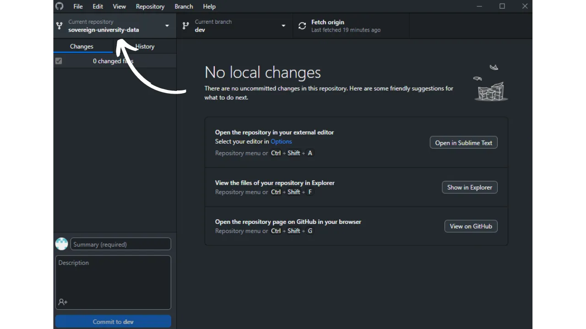

Before following this tutorial on adding a new tutorial, you need to have completed a few preliminary steps. If you haven't already done so, please take a look at this introductory tutorial first, then come back here :

https://planb.network/tutorials/others/contribution/write-tutorials-4d142a6a-9127-4ffb-9e0a-5aba29f169e2
You already have :


- Choose a theme for your tutorial;
- Contacted the Plan ₿ Network team via [Telegram group](https://t.me/PlanBNetwork_ContentBuilder) or paolo@planb.network ;
- Choose your contribution tools.

In this tutorial, we'll look at how to add your tutorial to Plan ₿ Network by configuring your local environment with GitHub Desktop. If you've already mastered Git, this very detailed tutorial may not be necessary for you. Instead, I recommend you take a look at this other tutorial where I present only the broad guidelines, without detailed step-by-step guidance :


- Experienced users** :

https://planb.network/tutorials/others/contribution/write-tutorials-git-expert-0ce1e490-c28f-4c51-b7e0-9a6ac9728410
If you prefer not to configure your local environment, follow this other tutorial designed for beginners, where we make the changes directly via the GitHub web interface :


- Beginners (web interface)** :

https://planb.network/tutorials/others/contribution/write-tutorials-github-web-beginner-e64f8fed-4c0b-4225-9ebb-7fc5f1c01a79
## Prerequisites

Software required to follow this tutorial :


- [GitHub Desktop](https://desktop.github.com/);
- A markdown file editor such as [Obsidian](https://obsidian.md/);
- A code editor ([VSC](https://code.visualstudio.com/) or [Sublime Text](https://www.sublimetext.com/)).


Prerequisites before starting the tutorial :


- Have a [GitHub account](https://github.com/signup);
- Have a fork of the [Plan ₿ Network source repository](https://github.com/PlanB-Network/bitcoin-educational-content);
- Have [a teacher profile on Plan ₿ Network](https://planb.network/professors) (only if you offer a full tutorial).

If you need help getting these prerequisites, my other tutorials will help:

https://planb.network/tutorials/others/contribution/basics-of-github-471f7f00-8b5a-4b63-abb1-f1528b032bbb
https://planb.network/tutorials/others/contribution/create-github-account-a75fc39d-f0d0-44dc-9cd5-cd94aee0c07c
https://planb.network/tutorials/others/contribution/github-desktop-work-environment-5862003b-9d76-47f5-a9e0-5ec74256a8ba
https://planb.network/tutorials/others/contribution/create-teacher-profile-8ba9ba49-8fac-437a-a435-c38eebc8f8a4
Once everything is in place and your local environment is set up with your own Plan ₿ Network fork, you can start adding the tutorial.

## 1 - Create a new branch

Open your browser and navigate to your fork page in the Plan ₿ Network repository. This is the fork you established on GitHub. The URL of your fork should look like this: `https://github.com/[your-username]/bitcoin-educational-content` :


Make sure you're on the main `dev` branch, then click on the `Sync fork` button. If your fork is not up to date, GitHub will ask you to update your branch. Proceed with this update. If, on the other hand, your branch is already up to date, GitHub will inform you:


Open GitHub Desktop and make sure that your fork is correctly selected in the top left corner of the window:



Click on the `Fetch origin` button. If your local repository is already up to date, GitHub Desktop will not suggest any further action. Otherwise, the `Pull origin` option will appear. Click on this button to update your local repository:


Check that you are on the `dev` main branch:


Click on this branch, then click on the `New Branch` button:


Make sure the new branch is based on the source repository, i.e. `PlanB-Network/bitcoin-educational-content`.

Name your branch so that the title is clear about its purpose, using dashes to separate each word. For example, let's say our objective is to write a tutorial on how to use Sparrow Wallet. In this case, the work branch dedicated to writing this tutorial could be named: `tuto-sparrow-wallet-loic`. Once you've entered the appropriate name, click `Create branch` to confirm the creation of the branch:


Now click on the `Publish branch` button to save your new working branch on your online fork on GitHub :


Now, on GitHub Desktop, you should be on your new branch. This means that any changes you make locally on your computer will be saved exclusively on this specific branch. Also, as long as this branch remains selected on GitHub Desktop, the files visible locally on your machine correspond to those of this branch (`tuto-sparrow-wallet-loic`), and not to those of the main branch (`dev`).


For each new article you want to publish, you'll need to create a new branch from `dev`. A branch in Git is a parallel version of the project, allowing you to make changes without affecting the main branch, until the work is ready to be merged.

## 2 - Add tutorial files

Now that the working branch has been created, it's time to integrate your new tutorial. You have two options: use my Python script, which automates the creation of the necessary documents, or create each file manually. Let's take a look at the steps to follow for each option.

### With my Python script

You need to install :


- Python 3.8 or higher ;
- Dependencies required for the script. Run :

```bash
pip install customtkinter appdirs
````
Pour utiliser le script, rendez-vous dans le dossier où il est stocké. Le script se trouve dans le dépôt de data de Plan ₿ Network sous le chemin : `bitcoin-educational-content/scripts/tutorial-related/new-tutorial-creation/`.
Une fois dans le dossier, exécutez la commande :
```

python new-tutorial-creation.py

```
Une interface graphique (GUI) va s'ouvrir. La première fois, vous devrez entrer toutes les informations nécessaires, mais lors des utilisations ultérieures du script, vos informations personnelles seront mémorisées, ce qui vous évite de devoir les saisir de nouveau.

Commencez par indiquer le chemin local menant au dossier `/tutorials` sur votre clone du dépôt (`.../bitcoin-educational-content/tutorials/`). Vous pouvez le noter manuellement ou cliquer sur le bouton "Browse" pour naviguer via votre explorateur de fichiers.

Sélectionnez la langue dans laquelle vous rédigerez votre tutoriel.

Choisissez une catégorie principale pour votre tutoriel.

Ensuite, sélectionnez une sous-catégorie appropriée, en fonction de la catégorie principale que vous avez choisie.

Déterminez un niveau de difficulté pour le tutoriel.

Choisissez le nom du répertoire spécialement créé pour votre tutoriel. Le nom de ce dossier devrait refléter le logiciel abordé dans le tutoriel, en utilisant des tirets pour relier les mots. Par exemple, le dossier pourrait s'appeler `red-wallet` :

Le `project_id` est l'UUID de l'entreprise ou de l'organisation derrière l'outil présenté dans le tutoriel, disponible [dans la liste des projets](https://github.com/PlanB-Network/bitcoin-educational-content/tree/dev/resources/projects). Par exemple, pour un tutoriel sur le logiciel Sparrow Wallet, vous trouverez ce `project_id` dans le fichier : `bitcoin-educational-content/resources/projects/sparrow/project.yml`. Cette information est ajoutée au fichier YAML de votre tutoriel car Plan ₿ Network maintient une base de données des entreprises et organisations actives sur Bitcoin ou des projets connexes. En ajoutant le `project_id` associé à votre tutoriel, vous créez un lien entre votre contenu et l'entité concernée.
***Mise à jour :*** Dans la nouvelle version du script, vous n'avez plus besoin de saisir manuellement le `project_id`. Une fonction de recherche a été ajoutée pour trouver le projet par son nom et récupérer automatiquement le `project_id` correspondant. Tapez le début du nom du projet dans la case "Project name" pour le rechercher, puis sélectionnez l'entreprise souhaitée dans le menu déroulant. Le `project_id` sera automatiquement renseigné dans la case en dessous. Vous avez également la possibilité de le noter manuellement si nécessaire.

Pour les tags, sélectionnez 2 ou 3 mots-clés pertinents en relation avec le contenu de votre tutoriel, en les choisissant exclusivement [dans la liste des tags de Plan ₿ Network](https://github.com/PlanB-Network/bitcoin-educational-content/blob/dev/docs/50-planb-tags.md).

Dans la case "Contributor's GitHub ID", inscrivez votre identifiant GitHub.

Pour la case "PBN professor's ID", saisissez votre identifiant en utilisant les mots de la liste BIP39, tel qu'il apparaît sur [votre profil professeur](https://github.com/PlanB-Network/bitcoin-educational-content/tree/dev/professors).

Pour plus de détails sur votre identifiant de professeur, veuillez consulter le tutoriel suivant :
https://planb.network/tutorials/others/contribution/create-teacher-profile-8ba9ba49-8fac-437a-a435-c38eebc8f8a4
Une fois toutes les informations saisies et vérifiées, cliquez sur "Create Tutorial" pour valider la création des fichiers de votre tutoriel. Cela générera en local le dossier de votre tutoriel et tous les fichiers nécessaires dans le dossier de la catégorie sélectionnée.

Vous pouvez maintenant passer outre la sous-partie "Sans mon script Python", ainsi que l'étape 3 "Remplir le fichier YAML", car le script a déjà effectué ces actions automatiquement pour vous. Passez directement à l'étape 4 et à la rédaction de votre tutoriel.
Pour plus d'informations sur ce script Python, vous pouvez également [consulter son README](https://github.com/PlanB-Network/bitcoin-educational-content/blob/dev/scripts/tutorial-related/new-tutorial-creation/README.md).
### Sans mon script Python
Ouvrez votre gestionnaire de fichiers et dirigez-vous vers le dossier `bitcoin-educational-content`, qui représente le clone local de votre dépôt. Vous devriez normalement le trouver sous `Documents\GitHub\bitcoin-educational-content`.
Au sein de ce répertoire, il sera nécessaire de localiser le sous-dossier adéquat pour le placement de votre tutoriel. L'organisation des dossiers reflète les différentes sections du site web Plan ₿ Network. Dans notre exemple, puisque nous souhaitons ajouter un tutoriel sur Sparrow Wallet, il convient de se rendre dans le chemin suivant : `bitcoin-educational-content\tutorials\wallet` qui correspond à la section `WALLET` sur le site web :

Au sein du dossier `wallet`, il faut créer un nouveau répertoire spécifiquement dédié à votre tutoriel. Le nom de ce dossier doit évoquer le logiciel traité dans le tutoriel, en veillant à relier les mots par des tirets. Pour mon exemple, le dossier sera intitulé `sparrow-wallet` :

Dans ce nouveau sous-dossier dédié à votre tutoriel, il faut ajouter plusieurs éléments :
- Créez un dossier `assets`, destiné à recevoir toutes les illustrations nécessaires à votre tutoriel ;
- Au sein de ce dossier `assets`, il faut créer un sous-dossier nommé selon le code de langue originale du tutoriel. Par exemple, si le tutoriel est rédigé en anglais, ce sous-dossier doit être nommé `en`. Placez-y tous les visuels du tutoriel (schémas, images, captures d’écran, etc.).
- Un fichier `tutorial.yml` doit être créé pour y consigner les détails relatifs à votre tutoriel ;
- Un fichier en format markdown est à créer pour y rédiger le contenu effectif de votre tutoriel. Ce fichier doit être intitulé selon le code de la langue de rédaction. Par exemple, pour un tutoriel rédigé en français, le fichier devra s'appeler `fr.md`.

Pour résumer, voici la hiérarchie des fichiers à créer :
```

bitcoin-educational-content/

└── tutorials/

└── wallet/ (change to the correct category)

└── sparrow-wallet/ (modify with tuto name)

├── assets/

│ ├── en/ (change to the appropriate language code)

├── tutorial.yml

└── fr.md (to be modified according to the appropriate language code)

```
## 3 - Remplir le fichier YAML
Remplissez le fichier `tutorial.yml` en copiant le modèle suivant :
```

id:

project_id:

tags:

-

-

-

category:

level:

credits:

professor:

# Proofreading metadata

original_language:

proofreading:


  - language:

last_contribution_date:

urgency:

contributors_id:

-

reward:

````

Here are the required fields:


- id**: A UUID (_Universally Unique Identifier_) to uniquely identify the tutorial. You can generate it with [an online tool](https://www.uuidgenerator.net/version4). The only constraint is that this UUID must be random, so as not to conflict with another UUID on the platform;
- project_id** : The UUID of the company or organization behind the tool presented in the tutorial [from the list of projects](https://github.com/PlanB-Network/bitcoin-educational-content/tree/dev/resources/projects). For example, if you're doing a tutorial on Sparrow Wallet software, you can find this `project_id` in the following file: `bitcoin-educational-content/resources/projects/sparrow/project.yml`. This information is added in the YAML file of your tutorial because Plan ₿ Network maintains a database of all companies and organizations operating on Bitcoin or related projects. By adding the `project_id` of the linked entity to your tutorial, you create a link between the two elements;
- tags**: 2 or 3 relevant keywords related to the tutorial content, chosen exclusively [from the Plan ₿ Network tag list](https://github.com/PlanB-Network/bitcoin-educational-content/blob/dev/docs/50-planb-tags.md);
- category** : The subcategory corresponding to the tutorial content, according to the Plan ₿ Network structure (e.g. for wallets: `desktop`, `hardware`, `mobile`, `backup`) ;
- level** : Tutorial difficulty level, from :
    - beginner`
    - `intermediate`
    - `advanced`
    - `expert`
- professor**: Your `contributor_id` (BIP39 words) as displayed on [your teacher profile](https://github.com/PlanB-Network/bitcoin-educational-content/tree/dev/professors);
- original_language** : The original language of the tutorial (e.g. `fr`, `en`, etc.) ;
- proofreading**: Information about the proofreading process. Fill in the first part, because proofreading your own tutorial counts as a first validation:
    - language**: Proofreading language code (e.g. `fr`, `en`, etc.).
    - last_contribution_date**: Today's date.
    - urgency** : Leave blank.
    - contributors_id** : Your GitHub ID.
    - reward** : Leave blank.

For more details on your teacher ID, please refer to the corresponding tutorial :

https://planb.network/tutorials/others/contribution/create-teacher-profile-8ba9ba49-8fac-437a-a435-c38eebc8f8a4
Here is an example of a `tutorial.yml` file completed for a tutorial on the Blockstream Green wallet:

```yaml
id: e84edaa9-fb65-48c1-a357-8a5f27996143
project_id: 3b2f45e6-d612-412c-95ba-cf65b49aa5b8
tags:
- wallets
- software
- keys
category: mobile
level: beginner
credits:
professor: pretty-private
# Proofreading metadata
original_language: fr
proofreading:
- language: fr
last_contribution_date: 2024-11-20
urgency:
contributors_id:
- LoicPandul
reward:
```

Once you have finished editing your `tutorial.yml` file, save your document by clicking on `File > Save` :


You can now close your code editor.

## 4 - Fill in the Markdown file

Now you can open your tutorial file, named with your language code, e.g. `en.md`. Go to Obsidian, on the left-hand side of the window, and scroll down the folder tree to your tutorial folder and the desired file :


Click on the file to open it:


We'll start by filling in the `Properties` section at the very top of the document.


Manually add and fill in the following code block:

```markdown
---
name: [Titre]
description: [Description]
---
```


Fill in the name of your tutorial and a short description:


Then add the path to the cover image at the beginning of your tutorial. To do this, note :

```markdown

```

This syntax will come in handy whenever you need to add an image to your tutorial. The exclamation mark indicates an image, whose alternative text (alt) is specified between the square brackets. The path to the image is indicated between the brackets:


## 5 - Add logo and cover

Within the `assets` folder, you need to add a file named `logo.webp`, which will serve as the thumbnail for your article. This image must be in `.webp` format and square in size to match the user interface. You are free to choose the logo of the software covered in the tutorial or any other relevant image, as long as it's royalty-free. In addition, add an image entitled `cover.webp` in the same place. This will be displayed at the top of your tutorial. Make sure that this image, like the logo, respects the rights of use and is appropriate to the context of your tutorial:


## 6 - Writing the tutorial and adding visuals

Continue writing your tutorial content. When you want to include a subtitle, apply the appropriate markdown formatting by prefixing the text with `##` :


The language subfolder in the `assets` folder is used to store the diagrams and visuals that will accompany your tutorial. As far as possible, avoid including text in your images to make your content accessible to an international audience. Of course, the software presented will contain text, but if you add schematics or additional indications on the software screenshots, do so without text or, if essential, use English.


To name your images, simply use numbers corresponding to their order of appearance in the tutorial, formatted as two digits (or three digits if your tutorial contains more than 99 images). For example, name your first image `01.webp`, your second `02.webp`, and so on.

Your images must be in `.webp` format only. If necessary, you can use [my image conversion software](https://github.com/LoicPandul/ImagesConverter).


To insert a diagram in your document, use the following command in Markdown, taking care to specify the appropriate alternative text as well as the correct image path:

```markdown

```

The exclamation mark at the beginning indicates an image. The alternative text, which helps with accessibility and referencing, is placed between the square brackets. Finally, the path to the image is indicated between brackets.

If you wish to create your own schematics, be sure to follow the Plan ₿ Network graphic guidelines to ensure visual consistency:


- Font**: Use [Rubik](https://fonts.google.com/specimen/Rubik);
- Colours** :
 - Orange: #FF5C00
 - Black : #000000
 - White: #FFFFFF

**It is imperative that all visuals integrated into your tutorials are free of copyright or respect the source file license**. Therefore, all diagrams published on Plan ₿ Network are made available under a CC-BY-SA license, in the same way as the text.

**-> Tip:** When sharing files in public, such as images, it's important to remove superfluous metadata. This can contain sensitive information, such as location data, creation dates and author details. To protect your privacy, it's a good idea to remove this metadata. To simplify this operation, you can use specialized tools such as [Exif Cleaner](https://exifcleaner.com/), which enables you to clean up a document's metadata with a simple drag-and-drop.

## 7 - Save and propose the tutorial

Once you've finished writing your tutorial in the language of your choice, the next step is to submit a **Pull Request**. The administrator will then add the missing translations to your tutorial, using our automated translation method with human proofreading.

To perform a Pull Request, open GitHub Desktop. The software should automatically detect any changes you've made locally on your branch to the original repository. Before proceeding, check carefully on the left-hand side of the interface that these changes correspond to what you expected:


Add a title for your commit, then click on the blue `Commit to [your branch]` button to validate these changes:


A commit is a record of changes made to a branch, accompanied by a descriptive message, enabling you to track the evolution of a project over time. It's a kind of intermediate checkpoint.

Then click on the `Push origin` button. This will send your commit to your fork:


If you haven't finished your tutorial, you can come back to it later and make new commits. If you've finished editing this branch, click on the `Preview Pull Request` button:


You can check one last time that your changes are correct, then click on the `Create pull request` button:


A Pull Request is a request made to integrate changes from your branch into the main branch of the Plan ₿ Network repository, which allows review and discussion of changes before they are merged.

You will be automatically redirected on your browser to GitHub in the preparation page of your Pull Request :


Enter a title that briefly summarizes the changes you wish to merge with the source repository. Add a brief comment describing these changes (if you have an issue number associated with the creation of your tutorial, remember to note `Closes #{issue number}` as a comment), then click on the green `Create pull request` button to confirm the merge request:


Your PR will then be visible in the `Pull Request` tab of the main Plan ₿ Network repository. All you have to do now is wait until an administrator contacts you to confirm that your contribution has been merged, or to request any further modifications.


After merging your PR with the main branch, we recommend deleting your working branch (`tuto-sparrow-wallet`) to maintain a clean history on your fork. GitHub will offer you this option automatically on your PR page:


On GitHub Desktop, you can move back to the main branch of your fork (`dev`).


If you wish to make changes to your contribution after you have already submitted your PR, the steps to follow depend on the current status of your PR:


- If your PR is still open and has not yet been merged, make the changes locally, remaining on the same branch. Once the changes have been finalized, use the `Push origin` button to add a new commit to your still open PR;
- In the event that your PR has already been merged with the main branch, you'll need to redo the process from the beginning by creating a new branch, then submitting a new PR. Make sure your local repository is synchronized with the Plan ₿ Network source repository before proceeding.

If you're having technical difficulties submitting your tutorial, please don't hesitate to ask for help on [our dedicated Telegram group for contributions](https://t.me/PlanBNetwork_ContentBuilder). Thank you very much!