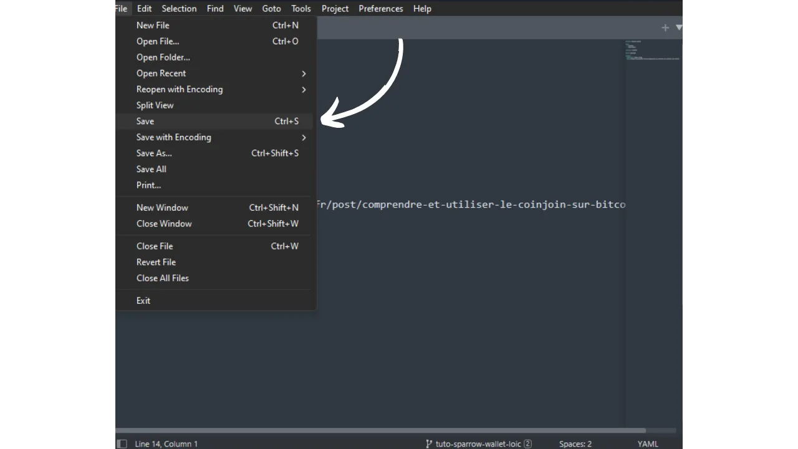

Antes de seguir este tutorial sobre cómo añadir un nuevo tutorial, necesita haber completado algunos pasos preliminares. Si aún no lo ha hecho, eche un vistazo primero a este tutorial introductorio y luego vuelva aquí :

https://planb.network/tutorials/others/contribution/write-tutorials-4d142a6a-9127-4ffb-9e0a-5aba29f169e2
Ya tienes :


- Elija un tema para su tutorial;
- Póngase en contacto con el equipo de Plan ₿ Network a través de [grupo de Telegram](https://t.me/PlanBNetwork_ContentBuilder) o paolo@planb.network ;
- Elige tus herramientas de contribución.

En este tutorial, veremos cómo añadir tu tutorial a Plan ₿ Network configurando tu entorno local con GitHub Desktop. Si ya dominas Git, puede que este tutorial tan detallado no sea necesario para ti. En su lugar, te recomiendo que eches un vistazo a este otro tutorial en el que sólo presento las líneas generales, sin una guía detallada paso a paso :


- Usuarios con experiencia** :

https://planb.network/tutorials/others/contribution/write-tutorials-git-expert-0ce1e490-c28f-4c51-b7e0-9a6ac9728410
Si prefieres no configurar tu entorno local, sigue este otro tutorial pensado para principiantes, donde realizamos los cambios directamente a través de la interfaz web de GitHub :


- Principiantes (interfaz web)** :

https://planb.network/tutorials/others/contribution/write-tutorials-github-web-beginner-e64f8fed-4c0b-4225-9ebb-7fc5f1c01a79
## Requisitos previos

Software necesario para seguir este tutorial :


- [GitHub Desktop](https://desktop.github.com/);
- Un editor de archivos markdown como [Obsidian](https://obsidian.md/);
- Un editor de código ([VSC](https://code.visualstudio.com/) o [Sublime Text](https://www.sublimetext.com/)).


Requisitos previos antes de empezar el tutorial :


- Tener una [cuenta GitHub](https://github.com/signup);
- Disponga de un fork del [Plan ₿ Network source repository](https://github.com/PlanB-Network/bitcoin-educational-content);
- Tener [un perfil de profesor en Plan ₿ Network](https://planb.network/professors) (sólo si ofreces una tutoría completa).

Si necesitas ayuda para conseguir estos requisitos previos, mis otros tutoriales te ayudarán:

https://planb.network/tutorials/others/contribution/basics-of-github-471f7f00-8b5a-4b63-abb1-f1528b032bbb
https://planb.network/tutorials/others/contribution/create-github-account-a75fc39d-f0d0-44dc-9cd5-cd94aee0c07c
https://planb.network/tutorials/others/contribution/github-desktop-work-environment-5862003b-9d76-47f5-a9e0-5ec74256a8ba
https://planb.network/tutorials/others/contribution/create-teacher-profile-8ba9ba49-8fac-437a-a435-c38eebc8f8a4
Una vez que todo está en su lugar y su entorno local está configurado con su propio Plan ₿ Network fork, puede empezar a añadir el tutorial.

## 1 - Crear una nueva sucursal

Abre tu navegador y navega a tu página de bifurcación en el repositorio Plan ₿ Network. Esta es la bifurcación que has establecido en GitHub. La URL de su bifurcación debe tener este aspecto: `https://github.com/[tu-nombre-deusuario]/bitcoin-educational-content` :


Asegúrate de que estás en la rama principal `dev` y haz clic en el botón `Sync fork`. Si tu bifurcación no está actualizada, GitHub te pedirá que actualices tu rama. Procede con esta actualización. Si, por el contrario, tu rama ya está actualizada, GitHub te informará:


Abre GitHub Desktop y asegúrate de que tu fork está correctamente seleccionado en la esquina superior izquierda de la ventana:


Haz clic en el botón `Fetch origin`. Si tu repositorio local ya está actualizado, GitHub Desktop no te sugerirá ninguna otra acción. En caso contrario, aparecerá la opción "Obtener origen". Haz clic en este botón para actualizar tu repositorio local:


Comprueba que estás en la rama principal `dev`:


Haga clic en esta rama y, a continuación, en el botón `Nueva rama`:


Asegúrate de que la nueva rama se basa en el repositorio fuente, es decir, `PlanB-Network/bitcoin-educational-content`.

Nombra tu rama de forma que el título deje claro su objetivo, utilizando guiones para separar cada palabra. Por ejemplo, digamos que nuestro objetivo es escribir un tutorial sobre cómo usar Sparrow Wallet. En este caso, la rama de trabajo dedicada a escribir este tutorial podría llamarse: `tuto-sparrow-wallet-loic`. Una vez que haya introducido el nombre apropiado, haga clic en `Crear rama` para confirmar la creación de la rama:


Ahora haga clic en el botón "Publicar rama" para guardar su nueva rama de trabajo en su bifurcación en línea en GitHub:


Ahora, en GitHub Desktop, deberías estar en tu nueva rama. Esto significa que cualquier cambio que hagas localmente en tu ordenador se guardará exclusivamente en esta rama específica. Además, mientras esta rama permanezca seleccionada en GitHub Desktop, los archivos visibles localmente en tu máquina corresponderán a los de esta rama (`tuto-sparrow-wallet-loic`), y no a los de la rama principal (`dev`).


Para cada nuevo artículo que quieras publicar, tendrás que crear una nueva rama desde `dev`. Una rama en Git es una versión paralela del proyecto, que te permite hacer cambios sin afectar a la rama principal, hasta que el trabajo esté listo para ser fusionado.

## 2 - Añadir archivos del tutorial

Ahora que la rama de trabajo ha sido creada, es el momento de integrar tu nuevo tutorial. Tienes dos opciones: utilizar mi script de Python, que automatiza la creación de los documentos necesarios, o crear cada archivo manualmente. Veamos los pasos a seguir para cada opción.

### Con mi script Python

Es necesario instalar :


- Python 3.8 o superior ;
- Dependencias necesarias para el script. Ejecutar :

```bash
pip install customtkinter appdirs
````
Pour utiliser le script, rendez-vous dans le dossier où il est stocké. Le script se trouve dans le dépôt de data de Plan ₿ Network sous le chemin : `bitcoin-educational-content/scripts/tutorial-related/new-tutorial-creation/`.
Une fois dans le dossier, exécutez la commande :
```

python nuevo-tutorial-creacion.py

```
Une interface graphique (GUI) va s'ouvrir. La première fois, vous devrez entrer toutes les informations nécessaires, mais lors des utilisations ultérieures du script, vos informations personnelles seront mémorisées, ce qui vous évite de devoir les saisir de nouveau.

Commencez par indiquer le chemin local menant au dossier `/tutorials` sur votre clone du dépôt (`.../bitcoin-educational-content/tutorials/`). Vous pouvez le noter manuellement ou cliquer sur le bouton "Browse" pour naviguer via votre explorateur de fichiers.

Sélectionnez la langue dans laquelle vous rédigerez votre tutoriel.

Choisissez une catégorie principale pour votre tutoriel.

Ensuite, sélectionnez une sous-catégorie appropriée, en fonction de la catégorie principale que vous avez choisie.

Déterminez un niveau de difficulté pour le tutoriel.

Choisissez le nom du répertoire spécialement créé pour votre tutoriel. Le nom de ce dossier devrait refléter le logiciel abordé dans le tutoriel, en utilisant des tirets pour relier les mots. Par exemple, le dossier pourrait s'appeler `red-wallet` :

Le `project_id` est l'UUID de l'entreprise ou de l'organisation derrière l'outil présenté dans le tutoriel, disponible [dans la liste des projets](https://github.com/PlanB-Network/bitcoin-educational-content/tree/dev/resources/projects). Par exemple, pour un tutoriel sur le logiciel Sparrow Wallet, vous trouverez ce `project_id` dans le fichier : `bitcoin-educational-content/resources/projects/sparrow/project.yml`. Cette information est ajoutée au fichier YAML de votre tutoriel car Plan ₿ Network maintient une base de données des entreprises et organisations actives sur Bitcoin ou des projets connexes. En ajoutant le `project_id` associé à votre tutoriel, vous créez un lien entre votre contenu et l'entité concernée.
***Mise à jour :*** Dans la nouvelle version du script, vous n'avez plus besoin de saisir manuellement le `project_id`. Une fonction de recherche a été ajoutée pour trouver le projet par son nom et récupérer automatiquement le `project_id` correspondant. Tapez le début du nom du projet dans la case "Project name" pour le rechercher, puis sélectionnez l'entreprise souhaitée dans le menu déroulant. Le `project_id` sera automatiquement renseigné dans la case en dessous. Vous avez également la possibilité de le noter manuellement si nécessaire.

Pour les tags, sélectionnez 2 ou 3 mots-clés pertinents en relation avec le contenu de votre tutoriel, en les choisissant exclusivement [dans la liste des tags de Plan ₿ Network](https://github.com/PlanB-Network/bitcoin-educational-content/blob/dev/docs/50-planb-tags.md).

Dans la case "Contributor's GitHub ID", inscrivez votre identifiant GitHub.

Pour la case "PBN professor's ID", saisissez votre identifiant en utilisant les mots de la liste BIP39, tel qu'il apparaît sur [votre profil professeur](https://github.com/PlanB-Network/bitcoin-educational-content/tree/dev/professors).

Pour plus de détails sur votre identifiant de professeur, veuillez consulter le tutoriel suivant :
https://planb.network/tutorials/others/contribution/create-teacher-profile-8ba9ba49-8fac-437a-a435-c38eebc8f8a4
Une fois toutes les informations saisies et vérifiées, cliquez sur "Create Tutorial" pour valider la création des fichiers de votre tutoriel. Cela générera en local le dossier de votre tutoriel et tous les fichiers nécessaires dans le dossier de la catégorie sélectionnée.

Vous pouvez maintenant passer outre la sous-partie "Sans mon script Python", ainsi que l'étape 3 "Remplir le fichier YAML", car le script a déjà effectué ces actions automatiquement pour vous. Passez directement à l'étape 4 et à la rédaction de votre tutoriel.
Pour plus d'informations sur ce script Python, vous pouvez également [consulter son README](https://github.com/PlanB-Network/bitcoin-educational-content/blob/dev/scripts/tutorial-related/new-tutorial-creation/README.md).
### Sans mon script Python
Ouvrez votre gestionnaire de fichiers et dirigez-vous vers le dossier `bitcoin-educational-content`, qui représente le clone local de votre dépôt. Vous devriez normalement le trouver sous `Documents\GitHub\bitcoin-educational-content`.
Au sein de ce répertoire, il sera nécessaire de localiser le sous-dossier adéquat pour le placement de votre tutoriel. L'organisation des dossiers reflète les différentes sections du site web Plan ₿ Network. Dans notre exemple, puisque nous souhaitons ajouter un tutoriel sur Sparrow Wallet, il convient de se rendre dans le chemin suivant : `bitcoin-educational-content\tutorials\wallet` qui correspond à la section `WALLET` sur le site web :

Au sein du dossier `wallet`, il faut créer un nouveau répertoire spécifiquement dédié à votre tutoriel. Le nom de ce dossier doit évoquer le logiciel traité dans le tutoriel, en veillant à relier les mots par des tirets. Pour mon exemple, le dossier sera intitulé `sparrow-wallet` :

Dans ce nouveau sous-dossier dédié à votre tutoriel, il faut ajouter plusieurs éléments :
- Créez un dossier `assets`, destiné à recevoir toutes les illustrations nécessaires à votre tutoriel ;
- Au sein de ce dossier `assets`, il faut créer un sous-dossier nommé selon le code de langue originale du tutoriel. Par exemple, si le tutoriel est rédigé en anglais, ce sous-dossier doit être nommé `en`. Placez-y tous les visuels du tutoriel (schémas, images, captures d’écran, etc.).
- Un fichier `tutorial.yml` doit être créé pour y consigner les détails relatifs à votre tutoriel ;
- Un fichier en format markdown est à créer pour y rédiger le contenu effectif de votre tutoriel. Ce fichier doit être intitulé selon le code de la langue de rédaction. Par exemple, pour un tutoriel rédigé en français, le fichier devra s'appeler `fr.md`.

Pour résumer, voici la hiérarchie des fichiers à créer :
```

bitcoin-educational-content/

└── tutoriales/

└── cartera/ (cambiar a la categoría correcta)

└── gorrión-gallo/ (modificar con tuto nombre)

├── activos/

│ ├── es/ (cambiar al código de idioma correspondiente)

├── tutorial.yml

└── fr.md (debe modificarse según el código de idioma correspondiente)

```
## 3 - Remplir le fichier YAML
Remplissez le fichier `tutorial.yml` en copiant le modèle suivant :
```

id:

project_id:

tags:

-

-

-

categoría:

nivel:

créditos:

profesor:

# Corrección de metadatos

idioma_original:

corrección de pruebas:


  - idioma:

fecha_última_contribución:

urgencia:

contribuyentes_id:

-

recompensa:

````

Estos son los campos obligatorios:


- id**: Un UUID (_Universally Unique Identifier_) para identificar de forma única el tutorial. Puede generarlo con [una herramienta en línea](https://www.uuidgenerator.net/version4). La única restricción es que este UUID debe ser aleatorio, para no entrar en conflicto con otro UUID de la plataforma;
- project_id** : El UUID de la empresa u organización detrás de la herramienta presentada en el tutorial [de la lista de proyectos](https://github.com/PlanB-Network/bitcoin-educational-content/tree/dev/resources/projects). Por ejemplo, si estás haciendo un tutorial sobre el software Sparrow Wallet, puedes encontrar este `project_id` en el siguiente archivo: `bitcoin-educational-content/resources/projects/sparrow/project.yml`. Esta información se añade en el archivo YAML de su tutorial porque Plan ₿ Network mantiene una base de datos de todas las empresas y organizaciones que operan en Bitcoin o proyectos relacionados. Al añadir el `project_id` de la entidad vinculada a su tutorial, usted crea un vínculo entre los dos elementos;
- etiquetas**: 2 o 3 palabras clave relevantes relacionadas con el contenido del tutorial, elegidas exclusivamente [de la lista de etiquetas Plan ₿ Network](https://github.com/PlanB-Network/bitcoin-educational-content/blob/dev/docs/50-planb-tags.md);
- categoría** : La subcategoría correspondiente al contenido del tutorial, según la estructura del Plan ₿ Red (por ejemplo, para carteras: `desktop`, `hardware`, `mobile`, `backup`) ;
- nivel** : Nivel de dificultad del tutorial, de :
    - principiante
    - `intermedio`
    - `avanzado`
    - `experto`
- profesor**: Su `contributor_id` (palabras BIP39) tal y como aparece en [su perfil de profesor](https://github.com/PlanB-Network/bitcoin-educational-content/tree/dev/professors);
- idioma_original** : El idioma original del tutorial (por ejemplo, `fr`, `en`, etc.) ;
- corrección de pruebas**: Información sobre el proceso de corrección. Rellene la primera parte, porque la corrección de su propio tutorial cuenta como primera validación:
    - idioma**: Corrección del código de idioma (por ejemplo, `fr`, `en`, etc.).
    - fecha_última_contribución**: La fecha de hoy.
    - urgencia** : Dejar en blanco.
    - contributors_id** : Tu ID de GitHub.
    - recompensa** : Dejar en blanco.

Para más detalles sobre su ID de profesor, consulte el tutorial correspondiente :

https://planb.network/tutorials/others/contribution/create-teacher-profile-8ba9ba49-8fac-437a-a435-c38eebc8f8a4
Este es un ejemplo de un archivo `tutorial.yml` completado para un tutorial sobre el monedero Blockstream Green:

```yaml
id: e84edaa9-fb65-48c1-a357-8a5f27996143
project_id: 3b2f45e6-d612-412c-95ba-cf65b49aa5b8
tags:
- wallets
- software
- keys
category: mobile
level: beginner
credits:
professor: pretty-private
# Proofreading metadata
original_language: fr
proofreading:
- language: fr
last_contribution_date: 2024-11-20
urgency:
contributors_id:
- LoicPandul
reward:
```

Una vez que haya terminado de editar el archivo `tutorial.yml`, guarde el documento haciendo clic en `File > Save` :



Ahora puede cerrar el editor de código.

## 4 - Rellenar el archivo Markdown

Ahora puedes abrir tu archivo tutorial, nombrado con el código de tu idioma, por ejemplo `en.md`. Vaya a Obsidian, en la parte izquierda de la ventana, y desplácese por el árbol de carpetas hasta la carpeta de su tutorial y el archivo deseado :


Haz clic en el archivo para abrirlo:


Empezaremos rellenando la sección `Propiedades` en la parte superior del documento.


Añada y rellene manualmente el siguiente bloque de código:

```markdown
---
name: [Titre]
description: [Description]
---
```


Escriba el nombre de su tutorial y una breve descripción:


A continuación, añada la ruta a la imagen de portada al principio de su tutorial. Para ello, anote :

```markdown

```

Esta sintaxis le resultará útil siempre que necesite añadir una imagen a su tutorial. El signo de exclamación indica una imagen, cuyo texto alternativo (alt) se especifica entre los corchetes. La ruta a la imagen se indica entre los corchetes:


## 5 - Añadir logotipo y portada

Dentro de la carpeta `assets`, necesita añadir un archivo llamado `logo.webp`, que servirá como miniatura de su artículo. Esta imagen debe estar en formato `.webp` y tener un tamaño cuadrado para que coincida con la interfaz de usuario. Puede elegir libremente el logotipo del software tratado en el tutorial o cualquier otra imagen relevante, siempre que esté libre de derechos de autor. Además, añade una imagen titulada `cover.webp` en el mismo lugar. Esta imagen aparecerá en la parte superior del tutorial. Asegúrese de que esta imagen, al igual que el logotipo, respeta los derechos de uso y es adecuada al contexto de su tutorial:


## 6 - Escribir el tutorial y añadir elementos visuales

Continúe escribiendo el contenido de su tutorial. Cuando desee incluir un subtítulo, aplique el formato markdown adecuado anteponiendo al texto el prefijo `##` :


La subcarpeta de idiomas de la carpeta `assets` se utiliza para almacenar los diagramas y elementos visuales que acompañarán a su tutorial. En la medida de lo posible, evite incluir texto en sus imágenes para que su contenido sea accesible a un público internacional. Por supuesto, el software presentado contendrá texto, pero si añades esquemas o indicaciones adicionales en las capturas de pantalla del software, hazlo sin texto o, si es imprescindible, utiliza el inglés.


Para nombrar sus imágenes, utilice simplemente los números correspondientes a su orden de aparición en el tutorial, formateados con dos dígitos (o tres dígitos si su tutorial contiene más de 99 imágenes). Por ejemplo, llame a su primera imagen `01.webp`, a la segunda `02.webp`, y así sucesivamente.

Tus imágenes deben estar únicamente en formato `.webp`. Si es necesario, puede utilizar [mi software de conversión de imágenes](https://github.com/LoicPandul/ImagesConverter).


Para insertar un diagrama en su documento, utilice el siguiente comando en Markdown, teniendo cuidado de especificar el texto alternativo apropiado, así como la ruta correcta de la imagen:

```markdown

```

El signo de exclamación al principio indica una imagen. El texto alternativo, que ayuda a la accesibilidad y a la referenciación, se coloca entre corchetes. Por último, la ruta a la imagen se indica entre corchetes.

Si desea crear sus propios esquemas, asegúrese de seguir las directrices gráficas de Plan ₿ Red para garantizar la coherencia visual:


- Fuente**: Utilice [Rubik](https://fonts.google.com/specimen/Rubik);
- Colores** :
 - Naranja: #FF5C00
 - Negro : #000000
 - Blanco: #FFFFFF

**Es imprescindible que todos los elementos visuales integrados en sus tutoriales estén libres de derechos de autor o respeten la licencia del archivo fuente**. Por lo tanto, todos los diagramas publicados en Plan ₿ Network están disponibles bajo una licencia CC-BY-SA, del mismo modo que el texto.

**-> Consejo:** Al compartir archivos en público, como imágenes, es importante eliminar los metadatos superfluos. Estos pueden contener información sensible, como datos de ubicación, fechas de creación y detalles del autor. Para proteger tu privacidad, es una buena idea eliminar estos metadatos. Para simplificar esta operación, puedes utilizar herramientas especializadas como [Exif Cleaner](https://exifcleaner.com/), que te permite limpiar los metadatos de un documento con un simple arrastrar y soltar.

## 7 - Guardar y proponer el tutorial

Una vez que haya terminado de escribir su tutorial en el idioma de su elección, el siguiente paso es enviar una **Solicitud de extracción**. El administrador añadirá las traducciones que faltan a su tutorial, utilizando nuestro método de traducción automática con revisión humana.

Para realizar una Pull Request, abre GitHub Desktop. El programa debería detectar automáticamente cualquier cambio que hayas hecho localmente en tu rama del repositorio original. Antes de proceder, comprueba cuidadosamente en la parte izquierda de la interfaz que estos cambios se corresponden con lo que esperabas:


Añade un título a tu confirmación y haz clic en el botón azul `Commit to [your branch]` para validar los cambios:


Un commit es un registro de los cambios realizados en una rama, acompañados de un mensaje descriptivo, que permite seguir la evolución de un proyecto a lo largo del tiempo. Es una especie de punto de control intermedio.

A continuación, haga clic en el botón `Push origin`. Esto enviará tu commit a tu fork:


Si no has terminado tu tutorial, puedes volver a él más tarde y hacer nuevos commits. Si has terminado de editar esta rama, haz clic en el botón `Preview Pull Request`:


Puede comprobar por última vez que los cambios son correctos y, a continuación, haga clic en el botón "Crear solicitud de extracción":


Una Pull Request es una solicitud realizada para integrar cambios de tu rama en la rama principal del repositorio Plan ₿ Network, lo que permite revisar y discutir los cambios antes de fusionarlos.

Se te redirigirá automáticamente en tu navegador a GitHub en la página de preparación de tu Pull Request :


Introduzca un título que resuma brevemente los cambios que desea fusionar con el repositorio fuente. Añada un breve comentario que describa estos cambios (si tiene un número de incidencia asociado a la creación de su tutorial, recuerde anotar `Closes #{issue number}` como comentario), después haga clic en el botón verde `Create pull request` para confirmar la solicitud de fusión:


Su PR estará visible en la pestaña `Pull Request` del repositorio principal de Plan ₿ Network. Todo lo que tiene que hacer ahora es esperar hasta que un administrador se ponga en contacto con usted para confirmar que su contribución ha sido fusionada, o para solicitar cualquier modificación adicional.


Después de fusionar tu PR con la rama principal, te recomendamos borrar tu rama de trabajo (`tuto-sparrow-wallet`) para mantener un historial limpio en tu bifurcación. GitHub le ofrecerá esta opción automáticamente en la página de su PR:


En GitHub Desktop, puedes volver a la rama principal de tu bifurcación (`dev`).


Si desea realizar cambios en su contribución después de haber presentado su RP, los pasos a seguir dependen del estado actual de su RP:


- Si su PR sigue abierto y aún no se ha fusionado, realice los cambios localmente, permaneciendo en la misma rama. Una vez finalizados los cambios, utilice el botón `Push origin` para añadir un nuevo commit a su PR aún abierto;
- En el caso de que su PR ya se haya fusionado con la rama principal, tendrá que rehacer el proceso desde el principio creando una nueva rama y enviando un nuevo PR. Asegúrese de que su repositorio local está sincronizado con el repositorio fuente de Plan ₿ Network antes de continuar.

Si tienes dificultades técnicas para enviar tu tutorial, no dudes en pedir ayuda en [nuestro grupo de Telegram dedicado a las contribuciones](https://t.me/PlanBNetwork_ContentBuilder). Muchas gracias