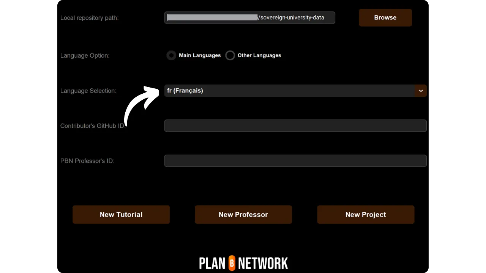
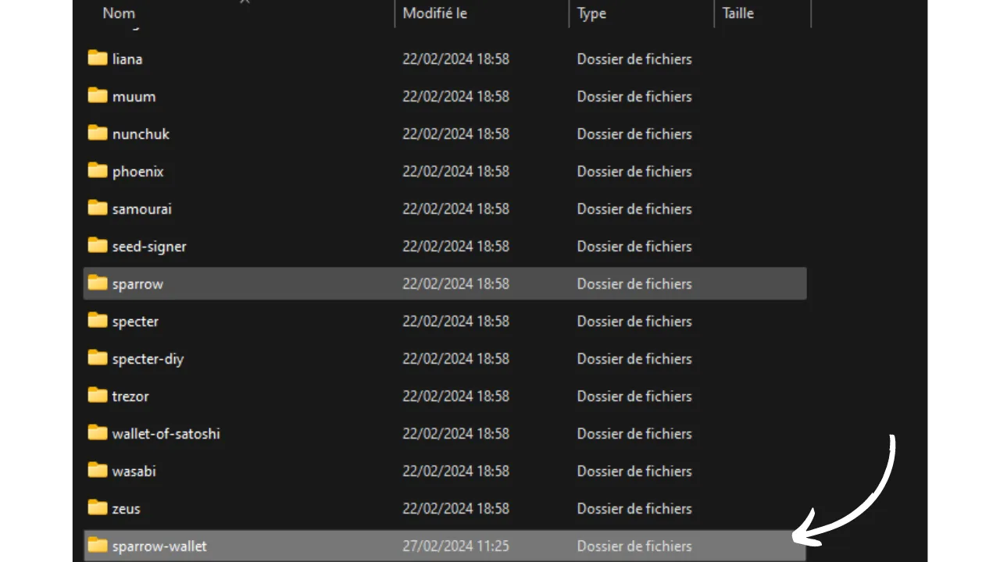
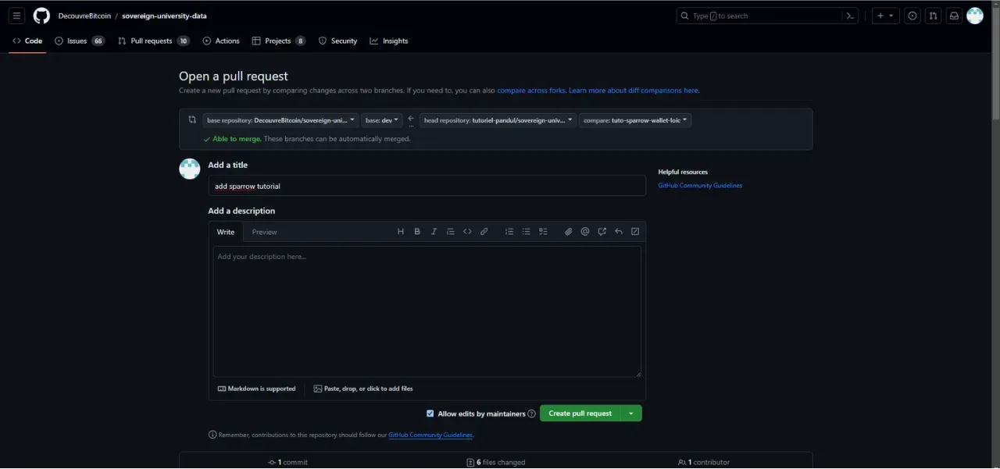

Ennen kuin seuraat tätä ohjeistusta uuden ohjeen lisäämisestä, sinun on suoritettava muutama alustava vaihe. Jos et ole vielä tehnyt sitä, tutustu ensin tähän johdantooppaaseen ja palaa sitten tänne :

https://planb.network/tutorials/others/contribution/write-tutorials-4d142a6a-9127-4ffb-9e0a-5aba29f169e2
Sinulla on jo :


- Valitse opetusohjelmasi teema;
- Ota yhteyttä Plan ₿ Network -tiimiin [Telegram-ryhmässä] (https://t.me/PlanBNetwork_ContentBuilder) tai paolo@planb.network ;
- Valitse osallistumisvälineesi.

Tässä oppaassa tarkastelemme, miten voit lisätä oppaasi Plan ₿ -verkkoon konfiguroimalla paikallisen ympäristösi GitHub Desktopin avulla. Jos hallitset jo Gitin, tämä hyvin yksityiskohtainen opetusohjelma ei ehkä ole sinulle tarpeen. Sen sijaan suosittelen tutustumaan tähän toiseen opetusohjelmaan, jossa esittelen vain laajat suuntaviivat ilman yksityiskohtaisia askel askeleelta ohjeita :


- Kokeneet käyttäjät** :

https://planb.network/tutorials/others/contribution/write-tutorials-git-expert-0ce1e490-c28f-4c51-b7e0-9a6ac9728410
Jos et halua konfiguroida paikallista ympäristöäsi, seuraa tätä toista aloittelijoille tarkoitettua ohjetta, jossa teemme muutokset suoraan GitHubin web-käyttöliittymän kautta:


- Aloittelijoille (verkkokäyttöliittymä)** :

https://planb.network/tutorials/others/contribution/write-tutorials-github-web-beginner-e64f8fed-4c0b-4225-9ebb-7fc5f1c01a79
## Edellytykset

Tämän ohjeen seuraamiseen tarvittava ohjelmisto :


- [GitHub Desktop](https://desktop.github.com/);
- Markdown-tiedostoeditori, kuten [Obsidian](https://obsidian.md/);
- Koodieditori ([VSC](https://code.visualstudio.com/) tai [Sublime Text](https://www.sublimetext.com/)).


Edellytykset ennen opetusohjelman aloittamista :


- Sinulla on [GitHub-tili](https://github.com/signup);
- Ota haara [Plan ₿ Network source repository](https://github.com/PlanB-Network/bitcoin-educational-content);
- [Opettajaprofiili Plan ₿ Network -verkossa](https://planb.network/professors) (vain jos tarjoat täydellistä opetusohjelmaa).

Jos tarvitset apua näiden edellytysten hankkimisessa, muut opetusohjelmani auttavat sinua:

https://planb.network/tutorials/others/contribution/basics-of-github-471f7f00-8b5a-4b63-abb1-f1528b032bbb
https://planb.network/tutorials/others/contribution/create-github-account-a75fc39d-f0d0-44dc-9cd5-cd94aee0c07c
https://planb.network/tutorials/others/contribution/github-desktop-work-environment-5862003b-9d76-47f5-a9e0-5ec74256a8ba
https://planb.network/tutorials/others/contribution/create-teacher-profile-8ba9ba49-8fac-437a-a435-c38eebc8f8a4
Kun kaikki on valmista ja paikallinen ympäristösi on perustettu omalla Plan ₿ Network -haarukalla, voit aloittaa opetusohjelman lisäämisen.

## 1 - Luo uusi haara

Avaa selaimesi ja siirry Plan ₿ Network -arkiston haarukointisivulle. Tämä on GitHubiin perustamasi haarautuminen. Haarautumisesi URL-osoitteen pitäisi näyttää tältä: `https://github.com/[käyttäjätunnuksesi]/bitcoin-educational-content` :


Varmista, että olet päähaarassa `dev`, ja napsauta sitten `Synkronoi haarautuminen`-painiketta. Jos haarasi ei ole ajan tasalla, GitHub pyytää sinua päivittämään haarasi. Jatka päivittämistä. Jos taas haarasi on jo ajan tasalla, GitHub ilmoittaa siitä sinulle:


Avaa GitHub Desktop ja varmista, että haarautumisesi on oikein valittu ikkunan vasemmassa yläkulmassa:


Napsauta `Hae alkuperä`-painiketta. Jos paikallinen arkistosi on jo ajan tasalla, GitHub Desktop ei ehdota lisätoimia. Muussa tapauksessa `Pull origin` -vaihtoehto tulee näkyviin. Napsauta tätä painiketta päivittääksesi paikallisen arkistosi:


Tarkista, että olet `dev`-päähaarassa:


Napsauta tätä haaraa ja napsauta sitten `Uusi haara`-painiketta:


Varmista, että uusi haara perustuu lähdekoodivarastoon, eli `PlanB-Network/bitcoin-educational-content`.

Nimeä sivukonttorisi niin, että otsikosta käy selvästi ilmi sen tarkoitus, ja erota jokainen sana toisistaan viivaimilla. Sanotaan esimerkiksi, että tavoitteenamme on kirjoittaa opetusohjelma Sparrow Walletin käytöstä. Tässä tapauksessa tämän ohjeen kirjoittamiseen omistetun työhaaran nimi voisi olla: `tuto-sparrow-wallet-loic`. Kun olet syöttänyt sopivan nimen, vahvista haaran luominen napsauttamalla `Luo haara`:


Klikkaa nyt "Julkaise haara" -painiketta tallentaaksesi uuden työhaarasi GitHubin online-haaraasi:


Nyt GitHubin työpöydällä pitäisi olla uusi haara. Tämä tarkoittaa, että kaikki tietokoneellasi paikallisesti tekemäsi muutokset tallennetaan ainoastaan tähän haaraan. Niin kauan kuin tämä haara on valittuna GitHub Desktopissa, koneellasi paikallisesti näkyvät tiedostot vastaavat tämän haaran (`tuto-sparrow-wallet-loic`) eikä päähaaran (`dev`) tiedostoja.


Jokaista uutta artikkelia varten, jonka haluat julkaista, sinun on luotava uusi haara `dev`:stä. Gitissä haara on projektin rinnakkaisversio, jonka avulla voit tehdä muutoksia vaikuttamatta päähaaraan, kunnes työ on valmis yhdistettäväksi.

## 2 - Lisää opetusohjelmatiedostoja

Nyt kun työhaara on luotu, on aika integroida uusi opetusohjelma. Sinulla on kaksi vaihtoehtoa: voit käyttää Python-skriptiäni, joka automatisoi tarvittavien dokumenttien luomisen, tai luoda jokaisen tiedoston manuaalisesti. Katsotaanpa, mitä vaiheita kummassakin vaihtoehdossa on noudatettava.

### Python-skriptilläni

Sinun on asennettava :


- Python 3.8 tai uudempi ;
- Skriptin edellyttämät riippuvuudet. Suorita :

```bash
pip install customtkinter appdirs
````
Pour utiliser le script, rendez-vous dans le dossier où il est stocké. Le script se trouve dans le dépôt de data de Plan ₿ Network sous le chemin : `bitcoin-educational-content/scripts/tutorial-related/new-tutorial-creation/`.
Une fois dans le dossier, exécutez la commande :
```

python new-tutorial-creation.py

```
Une interface graphique (GUI) va s'ouvrir. La première fois, vous devrez entrer toutes les informations nécessaires, mais lors des utilisations ultérieures du script, vos informations personnelles seront mémorisées, ce qui vous évite de devoir les saisir de nouveau.

Commencez par indiquer le chemin local menant au dossier `/tutorials` sur votre clone du dépôt (`.../bitcoin-educational-content/tutorials/`). Vous pouvez le noter manuellement ou cliquer sur le bouton "Browse" pour naviguer via votre explorateur de fichiers.

Sélectionnez la langue dans laquelle vous rédigerez votre tutoriel.

Choisissez une catégorie principale pour votre tutoriel.

Ensuite, sélectionnez une sous-catégorie appropriée, en fonction de la catégorie principale que vous avez choisie.

Déterminez un niveau de difficulté pour le tutoriel.

Choisissez le nom du répertoire spécialement créé pour votre tutoriel. Le nom de ce dossier devrait refléter le logiciel abordé dans le tutoriel, en utilisant des tirets pour relier les mots. Par exemple, le dossier pourrait s'appeler `red-wallet` :

Le `project_id` est l'UUID de l'entreprise ou de l'organisation derrière l'outil présenté dans le tutoriel, disponible [dans la liste des projets](https://github.com/PlanB-Network/bitcoin-educational-content/tree/dev/resources/projects). Par exemple, pour un tutoriel sur le logiciel Sparrow Wallet, vous trouverez ce `project_id` dans le fichier : `bitcoin-educational-content/resources/projects/sparrow/project.yml`. Cette information est ajoutée au fichier YAML de votre tutoriel car Plan ₿ Network maintient une base de données des entreprises et organisations actives sur Bitcoin ou des projets connexes. En ajoutant le `project_id` associé à votre tutoriel, vous créez un lien entre votre contenu et l'entité concernée.
***Mise à jour :*** Dans la nouvelle version du script, vous n'avez plus besoin de saisir manuellement le `project_id`. Une fonction de recherche a été ajoutée pour trouver le projet par son nom et récupérer automatiquement le `project_id` correspondant. Tapez le début du nom du projet dans la case "Project name" pour le rechercher, puis sélectionnez l'entreprise souhaitée dans le menu déroulant. Le `project_id` sera automatiquement renseigné dans la case en dessous. Vous avez également la possibilité de le noter manuellement si nécessaire.

Pour les tags, sélectionnez 2 ou 3 mots-clés pertinents en relation avec le contenu de votre tutoriel, en les choisissant exclusivement [dans la liste des tags de Plan ₿ Network](https://github.com/PlanB-Network/bitcoin-educational-content/blob/dev/docs/50-planb-tags.md).

Dans la case "Contributor's GitHub ID", inscrivez votre identifiant GitHub.

Pour la case "PBN professor's ID", saisissez votre identifiant en utilisant les mots de la liste BIP39, tel qu'il apparaît sur [votre profil professeur](https://github.com/PlanB-Network/bitcoin-educational-content/tree/dev/professors).

Pour plus de détails sur votre identifiant de professeur, veuillez consulter le tutoriel suivant :
https://planb.network/tutorials/others/contribution/create-teacher-profile-8ba9ba49-8fac-437a-a435-c38eebc8f8a4
Une fois toutes les informations saisies et vérifiées, cliquez sur "Create Tutorial" pour valider la création des fichiers de votre tutoriel. Cela générera en local le dossier de votre tutoriel et tous les fichiers nécessaires dans le dossier de la catégorie sélectionnée.

Vous pouvez maintenant passer outre la sous-partie "Sans mon script Python", ainsi que l'étape 3 "Remplir le fichier YAML", car le script a déjà effectué ces actions automatiquement pour vous. Passez directement à l'étape 4 et à la rédaction de votre tutoriel.
Pour plus d'informations sur ce script Python, vous pouvez également [consulter son README](https://github.com/PlanB-Network/bitcoin-educational-content/blob/dev/scripts/tutorial-related/new-tutorial-creation/README.md).
### Sans mon script Python
Ouvrez votre gestionnaire de fichiers et dirigez-vous vers le dossier `bitcoin-educational-content`, qui représente le clone local de votre dépôt. Vous devriez normalement le trouver sous `Documents\GitHub\bitcoin-educational-content`.
Au sein de ce répertoire, il sera nécessaire de localiser le sous-dossier adéquat pour le placement de votre tutoriel. L'organisation des dossiers reflète les différentes sections du site web Plan ₿ Network. Dans notre exemple, puisque nous souhaitons ajouter un tutoriel sur Sparrow Wallet, il convient de se rendre dans le chemin suivant : `bitcoin-educational-content\tutorials\wallet` qui correspond à la section `WALLET` sur le site web :

Au sein du dossier `wallet`, il faut créer un nouveau répertoire spécifiquement dédié à votre tutoriel. Le nom de ce dossier doit évoquer le logiciel traité dans le tutoriel, en veillant à relier les mots par des tirets. Pour mon exemple, le dossier sera intitulé `sparrow-wallet` :

Dans ce nouveau sous-dossier dédié à votre tutoriel, il faut ajouter plusieurs éléments :
- Créez un dossier `assets`, destiné à recevoir toutes les illustrations nécessaires à votre tutoriel ;
- Au sein de ce dossier `assets`, il faut créer un sous-dossier nommé selon le code de langue originale du tutoriel. Par exemple, si le tutoriel est rédigé en anglais, ce sous-dossier doit être nommé `en`. Placez-y tous les visuels du tutoriel (schémas, images, captures d’écran, etc.).
- Un fichier `tutorial.yml` doit être créé pour y consigner les détails relatifs à votre tutoriel ;
- Un fichier en format markdown est à créer pour y rédiger le contenu effectif de votre tutoriel. Ce fichier doit être intitulé selon le code de la langue de rédaction. Par exemple, pour un tutoriel rédigé en français, le fichier devra s'appeler `fr.md`.

Pour résumer, voici la hiérarchie des fichiers à créer :
```

bitcoin-educational-content/

└── tutorials/

└── lompakko/ (vaihda oikeaan luokkaan)

└── sparrow-wallet/ (muokkaa tuton nimellä)

├── omaisuus/

│ ├── en/ (vaihda asianmukaiseen kielikoodiin)

├── tutorial.yml

└── fr.md (muutettava asianmukaisen kielikoodin mukaisesti)

```
## 3 - Remplir le fichier YAML
Remplissez le fichier `tutorial.yml` en copiant le modèle suivant :
```

id:

project_id:

tunnisteet:

-

-

-

luokka:

taso:

krediittejä:

professori:

# Metatietojen oikolukeminen

original_language:

oikoluku:


  - kieli:

viimeinen_maksun_päivämäärä:

kiireellisyys:

avustajat_id:

-

palkinto:

````

Tässä ovat vaaditut kentät:


- id**: UUID (_Universally Unique Identifier_), jolla opetusohjelma voidaan yksilöidä yksiselitteisesti. Voit luoda sen [online-työkalulla](https://www.uuidgenerator.net/version4). Ainoa rajoitus on, että tämän UUID-tunnuksen on oltava satunnainen, jotta se ei ole ristiriidassa alustan toisen UUID-tunnuksen kanssa;
- project_id** : Ohjeessa esitellyn työkalun takana olevan yrityksen tai organisaation UUID-tunnus [projektiluettelosta](https://github.com/PlanB-Network/bitcoin-educational-content/tree/dev/resources/projects). Jos esimerkiksi teet opetusohjelman Sparrow Wallet -ohjelmistosta, löydät tämän `project_id`:n seuraavasta tiedostosta: `bitcoin-educational-content/resources/projects/sparrow/project.yml`. Tämä tieto lisätään opetusohjelmasi YAML-tiedostoon, koska Plan ₿ Network ylläpitää tietokantaa kaikista yrityksistä ja organisaatioista, jotka toimivat Bitcoinissa tai siihen liittyvissä projekteissa. Lisäämällä linkitetyn entiteetin `project_id`:n opetusohjelmaasi luot linkin näiden kahden elementin välille;
- tagit**: 2 tai 3 relevanttia avainsanaa, jotka liittyvät opetusohjelman sisältöön ja jotka on valittu yksinomaan [Plan ₿ Network tag -luettelosta](https://github.com/PlanB-Network/bitcoin-educational-content/blob/dev/docs/50-planb-tags.md);
- luokka** : Alaluokka, joka vastaa opetusohjelman sisältöä Plan ₿ Network -verkkorakenteen mukaisesti (esim. lompakoille: `desktop`, `hardware`, `mobile`, `backup`) ;
- taso** : Tutoriaalin vaikeustaso, alkaen :
    - aloitteleva`
    - `välitason`
    - `Advanced`
    - "Asiantuntija
- professori**: Sinun `contributor_id` (BIP39 sanat), joka näkyy [opettajaprofiilissasi](https://github.com/PlanB-Network/bitcoin-educational-content/tree/dev/professors);
- original_language** : Ohjeen alkuperäinen kieli (esim. `fr`, `en` jne.) ;
- oikoluku**: Tietoa oikolukuprosessista. Täytä ensimmäinen osa, koska oman opetusohjelmasi oikolukeminen lasketaan ensimmäiseksi validoinniksi:
    - kieli**: Kielikoodin oikolukeminen (esim. "fr", "en" jne.).
    - viimeinen_maksun_päivämäärä**: Tämän päivän päivämäärä.
    - kiireellisyys** : Jätä tyhjäksi.
    - contributors_id** : GitHub-tunnuksesi.
    - palkinto** : Jätä tyhjäksi.

Lisätietoja opettajatunnuksesta saat vastaavasta ohjeesta :

https://planb.network/tutorials/others/contribution/create-teacher-profile-8ba9ba49-8fac-437a-a435-c38eebc8f8a4
Tässä on esimerkki `tutorial.yml`-tiedostosta, joka on valmis Blockstream Green -lompakkoa koskevaa opetusohjelmaa varten:

```yaml
id: e84edaa9-fb65-48c1-a357-8a5f27996143
project_id: 3b2f45e6-d612-412c-95ba-cf65b49aa5b8
tags:
- wallets
- software
- keys
category: mobile
level: beginner
credits:
professor: pretty-private
# Proofreading metadata
original_language: fr
proofreading:
- language: fr
last_contribution_date: 2024-11-20
urgency:
contributors_id:
- LoicPandul
reward:
```

Kun olet muokannut `tutorial.yml`-tiedoston, tallenna dokumentti klikkaamalla `File > Save` :


Voit nyt sulkea koodieditorin.

## 4 - Täytä Markdown-tiedosto

Nyt voit avata opetustiedoston, jonka nimenä on kielikoodisi, esimerkiksi `en.md`. Siirry ikkunan vasemmassa reunassa olevaan Obsidianiin ja selaa kansiopuuta alaspäin opetusohjelmasi kansioon ja haluamaasi tiedostoon :


Avaa tiedosto napsauttamalla sitä:


Aloitamme täyttämällä asiakirjan yläreunassa olevan "Ominaisuudet"-osion.


Lisää manuaalisesti seuraava koodilohko ja täytä se:

```markdown
---
name: [Titre]
description: [Description]
---
```


Täytä opetusohjelmasi nimi ja lyhyt kuvaus:


Lisää sitten polku kansikuvaan opetusohjelmasi alussa. Tee tämä merkitsemällä :

```markdown

```

Tämä syntaksi on kätevä aina, kun haluat lisätä kuvan opetusohjelmaasi. Huutomerkki tarkoittaa kuvaa, jonka vaihtoehtoinen teksti (alt) on määritetty hakasulkeiden väliin. Kuvan polku ilmoitetaan hakasulkeiden välissä:


## 5 - Lisää logo ja kansi

Lisää `assets`-kansioon tiedosto nimeltä `logo.webp`, joka toimii artikkelisi pikkukuvana. Tämän kuvan on oltava `.webp`-muodossa ja neliön kokoinen, jotta se sopii käyttöliittymään. Voit vapaasti valita opetusohjelmassa käsitellyn ohjelmiston logon tai minkä tahansa muun asiaankuuluvan kuvan, kunhan se on tekijänoikeudeton. Lisää lisäksi kuva nimeltä `cover.webp` samaan paikkaan. Tämä näytetään opetusohjelmasi yläosassa. Varmista, että tämä kuva, kuten logokin, kunnioittaa käyttöoikeuksia ja sopii opetusohjelmasi kontekstiin:


## 6 - Ohjeen kirjoittaminen ja visuaalisen materiaalin lisääminen

Jatka oppaan sisällön kirjoittamista. Kun haluat sisällyttää alaotsikon, käytä asianmukaista markdown-muotoilua liittämällä tekstin eteen `##` :


`assets`-kansion kieli-alakansiota käytetään opetusohjelmaan liitettävien kaavioiden ja kuvien tallentamiseen. Vältä mahdollisuuksien mukaan tekstin sisällyttämistä kuviin, jotta sisältösi olisi kansainvälisen yleisön saatavilla. Esiteltävässä ohjelmistossa on tietenkin tekstiä, mutta jos lisäät kaavioita tai lisämerkintöjä ohjelmiston kuvakaappauksiin, tee se ilman tekstiä tai, jos se on välttämätöntä, käytä englantia.


Voit nimetä kuvat käyttämällä numeroita, jotka vastaavat niiden esiintymisjärjestystä opetusohjelmassa ja jotka on muotoiltu kaksinumeroisiksi (tai kolminumeroisiksi, jos opetusohjelmassasi on yli 99 kuvaa). Nimeä esimerkiksi ensimmäinen kuva `01.webp`, toinen kuva `02.webp` ja niin edelleen.

Kuvien on oltava ainoastaan .webp-muodossa. Tarvittaessa voit käyttää [kuvien muunto-ohjelmistoani](https://github.com/LoicPandul/ImagesConverter).


Jos haluat lisätä kaavion asiakirjaasi, käytä seuraavaa komentoa Markdownissa ja määritä asianmukainen vaihtoehtoinen teksti sekä oikea kuvapolku:

```markdown

```

Huutomerkki alussa osoittaa kuvan. Vaihtoehtoinen teksti, joka helpottaa saavutettavuutta ja viittaamista, on sijoitettu hakasulkeiden väliin. Lopuksi kuvan polku ilmoitetaan hakasulkeiden välissä.

Jos haluat luoda omia kaavioita, muista noudattaa Plan ₿ Network -ohjelman graafisia ohjeita visuaalisen yhdenmukaisuuden varmistamiseksi:


- Fontti**: Rubik](https://fonts.google.com/specimen/Rubik);
- Värit** :
 - Oranssi: #FF5C00
 - Musta : #000000
 - Valkoinen: #FFFFFF

**On ehdottoman tärkeää, että kaikki opetusohjelmiin sisällytetty visuaalinen materiaali on tekijänoikeudetonta tai noudattaa lähdetiedostojen lisenssiä**. Siksi kaikki Plan ₿ Networkissa julkaistut kaaviot ovat saatavilla CC-BY-SA -lisenssillä samalla tavalla kuin teksti.

**-> Vinkki:** Kun jaat tiedostoja julkisesti, kuten kuvia, on tärkeää poistaa turhat metatiedot. Ne voivat sisältää arkaluonteisia tietoja, kuten sijaintitietoja, luontipäivämääriä ja tekijää koskevia tietoja. Yksityisyyden suojaamiseksi nämä metatiedot kannattaa poistaa. Voit yksinkertaistaa tätä toimenpidettä käyttämällä erikoistuneita työkaluja, kuten [Exif Cleaner](https://exifcleaner.com/), jonka avulla voit siivota asiakirjan metatiedot yksinkertaisesti vetämällä ja pudottamalla.

## 7 - Tallenna ja ehdota opetusohjelma

Kun olet kirjoittanut opetusohjelmasi haluamallasi kielellä, seuraava vaihe on lähettää **Pull Request**. Järjestelmänvalvoja lisää puuttuvat käännökset opetusohjelmaasi käyttämällä automaattista käännösmenetelmäämme, jossa on ihmisen suorittama oikoluku.

Avaa GitHub Desktop avataksesi Pull Requestin. Ohjelmiston pitäisi havaita automaattisesti kaikki muutokset, jotka olet tehnyt paikallisesti haarassasi alkuperäiseen arkistoon. Ennen kuin jatkat, tarkista huolellisesti käyttöliittymän vasemmasta reunasta, että nämä muutokset vastaavat odotuksiasi:


Lisää toimitukselle otsikko ja napsauta sitten sinistä `Kirjoita [haaraasi]-painiketta vahvistaaksesi muutokset:


Sitoumus on kirjaus haaraan tehdyistä muutoksista, joihin liittyy kuvaava viesti, jonka avulla voit seurata projektin kehitystä ajan mittaan. Se on eräänlainen välitarkistuspiste.

Napsauta sitten `Push origin`-painiketta. Tämä lähettää sitoumuksesi haarukkaan:


Jos et ole saanut opetusohjelmaasi valmiiksi, voit palata siihen myöhemmin ja tehdä uusia muutoksia. Jos olet lopettanut tämän haaran muokkaamisen, napsauta `Preview Pull Request`-painiketta:


Voit tarkistaa vielä kerran, että muutokset ovat oikein, ja napsauttaa sitten `Create pull request`-painiketta:


Pull Request on pyyntö, jolla pyydetään integroimaan muutokset omasta haarastasi Plan ₿ Network -arkiston päähaaraan, mikä mahdollistaa muutosten tarkastelun ja keskustelun ennen niiden yhdistämistä.

Sinut ohjataan automaattisesti selaimellasi GitHubiin Pull Requestin valmistelusivulla:



Kirjoita otsikko, joka tiivistää lyhyesti muutokset, jotka haluat yhdistää lähdekoodivarastoon. Lisää lyhyt kommentti, jossa kuvataan nämä muutokset (jos sinulla on oppaasi luomiseen liittyvä ongelmanumero, muista merkitä kommentiksi `Closes #{kysymyksenumero}`) ja vahvista yhdistämispyyntö napsauttamalla vihreää `Create pull request`-painiketta:


PR:si näkyy tämän jälkeen Plan ₿ Network -verkkovaraston `Pull Request` -välilehdellä. Nyt sinun tarvitsee vain odottaa, että ylläpitäjä ottaa sinuun yhteyttä vahvistaakseen, että panoksesi on yhdistetty, tai pyytäessään lisämuutoksia.


Kun olet yhdistänyt PR:si päähaaraan, suosittelemme poistamaan työhaarasi (`tuto-sparrow-wallet`), jotta haarasi historia pysyy puhtaana. GitHub tarjoaa tämän vaihtoehdon automaattisesti PR-sivullasi:


GitHubin työpöydällä voit siirtyä takaisin haarasi päähaaraan (`dev`).


Jos haluat tehdä muutoksia maksuosuuteesi sen jälkeen, kun olet jo lähettänyt PR:n, noudatettavat vaiheet riippuvat PR:n tämänhetkisestä tilasta:


- Jos PR-julkaisusi on vielä auki eikä sitä ole vielä yhdistetty, tee muutokset paikallisesti ja pysy samassa haarassa. Kun muutokset on viimeistelty, käytä `Push origin`-painiketta lisätäksesi uuden toimituksen vielä avoinna olevaan PR:ään;
- Jos PR:si on jo yhdistetty päähaaraan, sinun on aloitettava prosessi alusta luomalla uusi haara ja lähettämällä uusi PR. Varmista, että paikallinen arkistosi on synkronoitu Plan ₿ Network -lähdekoodivaraston kanssa ennen kuin jatkat.

Jos sinulla on teknisiä ongelmia opetusohjelmasi lähettämisessä, älä epäröi pyytää apua [omassa Telegram-ryhmässämme](https://t.me/PlanBNetwork_ContentBuilder). Kiitos paljon!