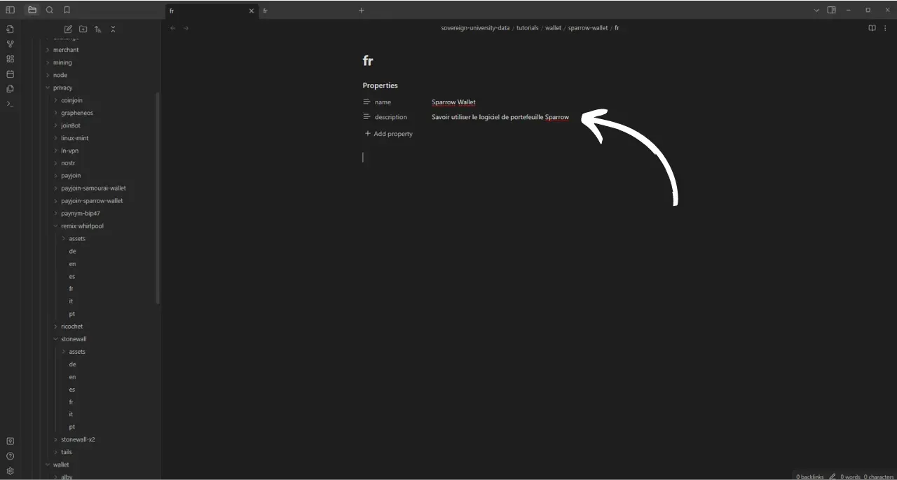
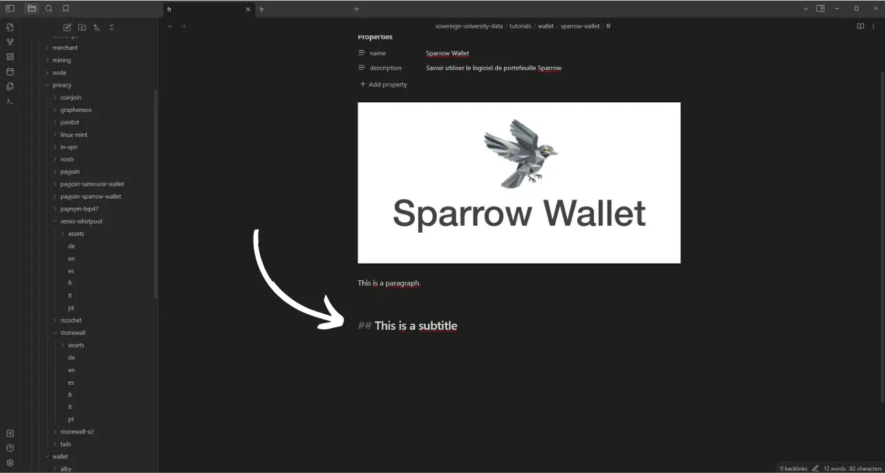
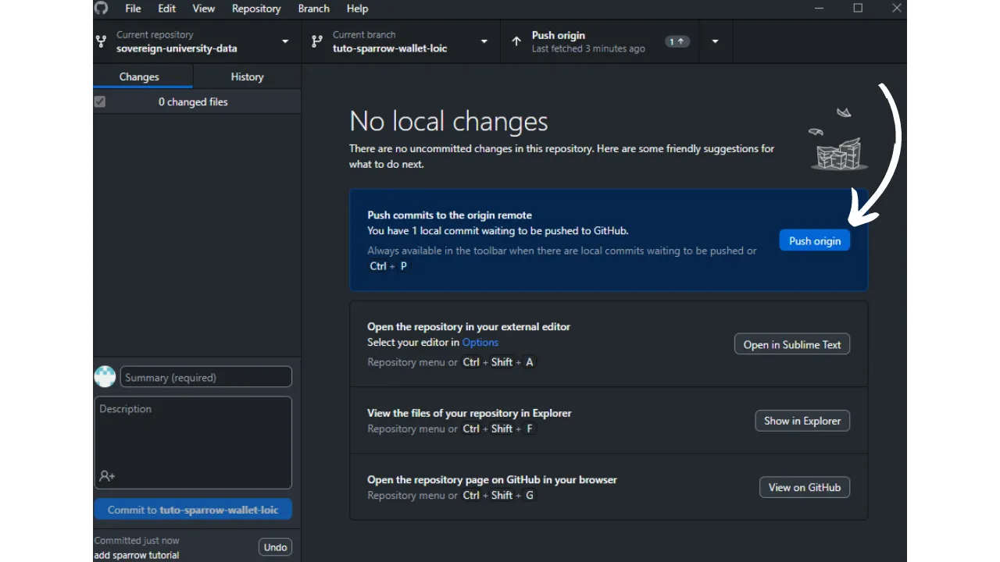

Prima di seguire questo tutorial sull'aggiunta di un nuovo tutorial, è necessario aver completato alcuni passaggi preliminari. Se non l'avete ancora fatto, date prima un'occhiata a questo tutorial introduttivo e poi tornate qui:

https://planb.network/tutorials/others/contribution/write-tutorials-4d142a6a-9127-4ffb-9e0a-5aba29f169e2
Avete già :


- Scegliete un tema per il vostro tutorial;
- Contattare il team di Plan ₿ Network tramite [gruppo Telegram](https://t.me/PlanBNetwork_ContentBuilder) o paolo@planb.network;
- Scegliete gli strumenti di contribuzione.

In questo tutorial, vedremo come aggiungere il vostro tutorial a Plan ₿ Network configurando il vostro ambiente locale con GitHub Desktop. Se siete già esperti di Git, questo tutorial molto dettagliato potrebbe non essere necessario per voi. Vi consiglio invece di dare un'occhiata a quest'altro tutorial in cui presento solo le linee guida generali, senza una guida dettagliata passo-passo:


- Utenti esperti** :

https://planb.network/tutorials/others/contribution/write-tutorials-git-expert-0ce1e490-c28f-4c51-b7e0-9a6ac9728410
Se preferite non configurare il vostro ambiente locale, seguite quest'altro tutorial pensato per i principianti, in cui apportiamo le modifiche direttamente tramite l'interfaccia web di GitHub:


- Principianti (interfaccia web)** :

https://planb.network/tutorials/others/contribution/write-tutorials-github-web-beginner-e64f8fed-4c0b-4225-9ebb-7fc5f1c01a79
## Prerequisiti

Software necessario per seguire questo tutorial :


- [GitHub Desktop](https://desktop.github.com/);
- Un editor di file markdown come [Obsidian](https://obsidian.md/);
- Un editor di codice ([VSC](https://code.visualstudio.com/) o [Sublime Text](https://www.sublimetext.com/)).


Prerequisiti prima di iniziare l'esercitazione :


- Avere un [account GitHub](https://github.com/signup);
- Avere un fork del [repository dei sorgenti di Plan ₿ Network](https://github.com/PlanB-Network/bitcoin-educational-content);
- Avere [un profilo docente su Plan ₿ Network](https://planb.network/professors) (solo se si offre un tutorial completo).

Se avete bisogno di aiuto per ottenere questi prerequisiti, le mie altre esercitazioni vi aiuteranno:

https://planb.network/tutorials/others/contribution/basics-of-github-471f7f00-8b5a-4b63-abb1-f1528b032bbb
https://planb.network/tutorials/others/contribution/create-github-account-a75fc39d-f0d0-44dc-9cd5-cd94aee0c07c
https://planb.network/tutorials/others/contribution/github-desktop-work-environment-5862003b-9d76-47f5-a9e0-5ec74256a8ba
https://planb.network/tutorials/others/contribution/create-teacher-profile-8ba9ba49-8fac-437a-a435-c38eebc8f8a4
Una volta che tutto è a posto e l'ambiente locale è configurato con il proprio fork di rete Plan ₿, si può iniziare ad aggiungere il tutorial.

## 1 - Creare un nuovo ramo

Aprire il browser e navigare alla pagina del fork nel repository Plan ₿ Network. Questo è il fork che avete creato su GitHub. L'URL del vostro fork dovrebbe essere simile a questo: `https://github.com/[nomeutente]/bitcoin-educational-content`:


Assicurarsi di essere nel ramo principale `dev`, quindi fare clic sul pulsante `Sync fork`. Se il vostro fork non è aggiornato, GitHub vi chiederà di aggiornare il vostro ramo. Procedere con l'aggiornamento. Se invece il vostro ramo è già aggiornato, GitHub vi informerà:


Aprite GitHub Desktop e assicuratevi che il vostro fork sia selezionato correttamente nell'angolo in alto a sinistra della finestra:


Fare clic sul pulsante "Recupera origine". Se il repository locale è già aggiornato, GitHub Desktop non suggerirà ulteriori azioni. In caso contrario, apparirà l'opzione `Pull origin`. Fare clic su questo pulsante per aggiornare il repository locale:


Verificare di essere nel ramo principale `dev`:


Fare clic su questo ramo, quindi fare clic sul pulsante "Nuovo ramo":


Assicurarsi che il nuovo ramo sia basato sul repository sorgente, cioè `PlanB-Network/bitcoin-educational-content`.

Nominate il vostro ramo in modo che il titolo sia chiaro sul suo scopo, utilizzando i trattini per separare ogni parola. Per esempio, diciamo che il nostro obiettivo è scrivere un tutorial su come usare Sparrow Wallet. In questo caso, il ramo di lavoro dedicato alla scrittura di questo tutorial potrebbe essere chiamato: `tuto-sparrow-wallet-loic`. Una volta inserito il nome appropriato, fare clic su `Crea ramo` per confermare la creazione del ramo:


Ora fate clic sul pulsante `Publish branch` per salvare il nuovo ramo di lavoro sul vostro fork online su GitHub:


Ora, su GitHub Desktop, dovreste trovarvi nel nuovo ramo. Ciò significa che tutte le modifiche apportate localmente sul computer saranno salvate esclusivamente su questo ramo specifico. Inoltre, finché questo ramo rimane selezionato su GitHub Desktop, i file visibili localmente sul computer corrispondono a quelli di questo ramo (`tuto-sparrow-wallet-loic`) e non a quelli del ramo principale (`dev`).


Per ogni nuovo articolo che si vuole pubblicare, è necessario creare un nuovo ramo da `dev`. Un ramo in Git è una versione parallela del progetto, che consente di apportare modifiche senza influenzare il ramo principale, finché il lavoro non è pronto per essere unito.

## 2 - Aggiungere i file del tutorial

Ora che il ramo di lavoro è stato creato, è il momento di integrare il nuovo tutorial. Avete due opzioni: usare il mio script Python, che automatizza la creazione dei documenti necessari, oppure creare ogni file manualmente. Vediamo i passi da seguire per ciascuna opzione.

### Con il mio script Python

È necessario installare :


- Python 3.8 o superiore ;
- Dipendenze necessarie per lo script. Eseguire :

```bash
pip install customtkinter appdirs
````
Pour utiliser le script, rendez-vous dans le dossier où il est stocké. Le script se trouve dans le dépôt de data de Plan ₿ Network sous le chemin : `bitcoin-educational-content/scripts/tutorial-related/new-tutorial-creation/`.
Une fois dans le dossier, exécutez la commande :
```

python nuovo-tutorial-creazione.py

```
Une interface graphique (GUI) va s'ouvrir. La première fois, vous devrez entrer toutes les informations nécessaires, mais lors des utilisations ultérieures du script, vos informations personnelles seront mémorisées, ce qui vous évite de devoir les saisir de nouveau.

Commencez par indiquer le chemin local menant au dossier `/tutorials` sur votre clone du dépôt (`.../bitcoin-educational-content/tutorials/`). Vous pouvez le noter manuellement ou cliquer sur le bouton "Browse" pour naviguer via votre explorateur de fichiers.

Sélectionnez la langue dans laquelle vous rédigerez votre tutoriel.

Choisissez une catégorie principale pour votre tutoriel.

Ensuite, sélectionnez une sous-catégorie appropriée, en fonction de la catégorie principale que vous avez choisie.

Déterminez un niveau de difficulté pour le tutoriel.

Choisissez le nom du répertoire spécialement créé pour votre tutoriel. Le nom de ce dossier devrait refléter le logiciel abordé dans le tutoriel, en utilisant des tirets pour relier les mots. Par exemple, le dossier pourrait s'appeler `red-wallet` :

Le `project_id` est l'UUID de l'entreprise ou de l'organisation derrière l'outil présenté dans le tutoriel, disponible [dans la liste des projets](https://github.com/PlanB-Network/bitcoin-educational-content/tree/dev/resources/projects). Par exemple, pour un tutoriel sur le logiciel Sparrow Wallet, vous trouverez ce `project_id` dans le fichier : `bitcoin-educational-content/resources/projects/sparrow/project.yml`. Cette information est ajoutée au fichier YAML de votre tutoriel car Plan ₿ Network maintient une base de données des entreprises et organisations actives sur Bitcoin ou des projets connexes. En ajoutant le `project_id` associé à votre tutoriel, vous créez un lien entre votre contenu et l'entité concernée.
***Mise à jour :*** Dans la nouvelle version du script, vous n'avez plus besoin de saisir manuellement le `project_id`. Une fonction de recherche a été ajoutée pour trouver le projet par son nom et récupérer automatiquement le `project_id` correspondant. Tapez le début du nom du projet dans la case "Project name" pour le rechercher, puis sélectionnez l'entreprise souhaitée dans le menu déroulant. Le `project_id` sera automatiquement renseigné dans la case en dessous. Vous avez également la possibilité de le noter manuellement si nécessaire.

Pour les tags, sélectionnez 2 ou 3 mots-clés pertinents en relation avec le contenu de votre tutoriel, en les choisissant exclusivement [dans la liste des tags de Plan ₿ Network](https://github.com/PlanB-Network/bitcoin-educational-content/blob/dev/docs/50-planb-tags.md).

Dans la case "Contributor's GitHub ID", inscrivez votre identifiant GitHub.

Pour la case "PBN professor's ID", saisissez votre identifiant en utilisant les mots de la liste BIP39, tel qu'il apparaît sur [votre profil professeur](https://github.com/PlanB-Network/bitcoin-educational-content/tree/dev/professors).

Pour plus de détails sur votre identifiant de professeur, veuillez consulter le tutoriel suivant :
https://planb.network/tutorials/others/contribution/create-teacher-profile-8ba9ba49-8fac-437a-a435-c38eebc8f8a4
Une fois toutes les informations saisies et vérifiées, cliquez sur "Create Tutorial" pour valider la création des fichiers de votre tutoriel. Cela générera en local le dossier de votre tutoriel et tous les fichiers nécessaires dans le dossier de la catégorie sélectionnée.

Vous pouvez maintenant passer outre la sous-partie "Sans mon script Python", ainsi que l'étape 3 "Remplir le fichier YAML", car le script a déjà effectué ces actions automatiquement pour vous. Passez directement à l'étape 4 et à la rédaction de votre tutoriel.
Pour plus d'informations sur ce script Python, vous pouvez également [consulter son README](https://github.com/PlanB-Network/bitcoin-educational-content/blob/dev/scripts/tutorial-related/new-tutorial-creation/README.md).
### Sans mon script Python
Ouvrez votre gestionnaire de fichiers et dirigez-vous vers le dossier `bitcoin-educational-content`, qui représente le clone local de votre dépôt. Vous devriez normalement le trouver sous `Documents\GitHub\bitcoin-educational-content`.
Au sein de ce répertoire, il sera nécessaire de localiser le sous-dossier adéquat pour le placement de votre tutoriel. L'organisation des dossiers reflète les différentes sections du site web Plan ₿ Network. Dans notre exemple, puisque nous souhaitons ajouter un tutoriel sur Sparrow Wallet, il convient de se rendre dans le chemin suivant : `bitcoin-educational-content\tutorials\wallet` qui correspond à la section `WALLET` sur le site web :

Au sein du dossier `wallet`, il faut créer un nouveau répertoire spécifiquement dédié à votre tutoriel. Le nom de ce dossier doit évoquer le logiciel traité dans le tutoriel, en veillant à relier les mots par des tirets. Pour mon exemple, le dossier sera intitulé `sparrow-wallet` :

Dans ce nouveau sous-dossier dédié à votre tutoriel, il faut ajouter plusieurs éléments :
- Créez un dossier `assets`, destiné à recevoir toutes les illustrations nécessaires à votre tutoriel ;
- Au sein de ce dossier `assets`, il faut créer un sous-dossier nommé selon le code de langue originale du tutoriel. Par exemple, si le tutoriel est rédigé en anglais, ce sous-dossier doit être nommé `en`. Placez-y tous les visuels du tutoriel (schémas, images, captures d’écran, etc.).
- Un fichier `tutorial.yml` doit être créé pour y consigner les détails relatifs à votre tutoriel ;
- Un fichier en format markdown est à créer pour y rédiger le contenu effectif de votre tutoriel. Ce fichier doit être intitulé selon le code de la langue de rédaction. Par exemple, pour un tutoriel rédigé en français, le fichier devra s'appeler `fr.md`.

Pour résumer, voici la hiérarchie des fichiers à créer :
```

bitcoin-educational-content/

└─── tutorial/

└─── portafoglio/ (passare alla categoria corretta)

└─── passerotto/ (modificare con il nome del tuto)

├─── beni/

│ ├── en/ (passare al codice lingua appropriato)

├── tutorial.yml

└── fr.md (da modificare secondo il codice della lingua appropriata)

```
## 3 - Remplir le fichier YAML
Remplissez le fichier `tutorial.yml` en copiant le modèle suivant :
```

id:

progetto_id:

tag:

-

-

-

categoria:

livello:

crediti:

professore:

# Correzione dei metadati

lingua_originale:

correzione di bozze:


  - lingua:

data_ultimo_contributo:

urgenza:

collaboratori_id:

-

ricompensa:

````

Ecco i campi obbligatori:


- id**: Un UUID (_Universally Unique Identifier_) per identificare in modo univoco il tutorial. È possibile generarlo con [uno strumento online](https://www.uuidgenerator.net/version4). L'unico vincolo è che questo UUID deve essere casuale, in modo da non entrare in conflitto con un altro UUID della piattaforma;
- project_id** : L'UUID dell'azienda o dell'organizzazione che sta dietro allo strumento presentato nel tutorial [dall'elenco dei progetti] (https://github.com/PlanB-Network/bitcoin-educational-content/tree/dev/resources/projects). Per esempio, se si sta facendo un tutorial sul software Sparrow Wallet, si può trovare questo `project_id` nel seguente file: `bitcoin-educational-content/resources/projects/sparrow/project.yml`. Questa informazione viene aggiunta nel file YAML del tutorial perché Plan ₿ Network mantiene un database di tutte le aziende e organizzazioni che operano su Bitcoin o su progetti correlati. Aggiungendo il `project_id` dell'entità collegata al tutorial, si crea un collegamento tra i due elementi;
- tag**: 2 o 3 parole chiave pertinenti al contenuto del tutorial, scelte esclusivamente [dall'elenco dei tag della Rete Plan ₿](https://github.com/PlanB-Network/bitcoin-educational-content/blob/dev/docs/50-planb-tags.md);
- categoria** : La sottocategoria corrispondente al contenuto del tutorial, secondo la struttura del Piano ₿ Network (ad esempio, per i portafogli: `desktop`, `hardware`, `mobile`, `backup`) ;
- livello** : Livello di difficoltà del tutorial, da :
    - principiante`
    - `intermedio`
    - avanzato
    - esperto
- professore**: Il vostro `contributor_id` (parole BIP39) come visualizzato nel [vostro profilo docente](https://github.com/PlanB-Network/bitcoin-educational-content/tree/dev/professors);
- lingua_originale** : La lingua originale del tutorial (es. `fr`, `en`, ecc.) ;
- correzione di bozze**: Informazioni sul processo di correzione. Compilare la prima parte, perché la correzione del proprio tutorial conta come prima validazione:
    - lingua**: Correzione del codice della lingua (ad es. `fr`, `en`, ecc.).
    - data_ultimo_contributo**: Data di oggi.
    - urgenza** : Lasciare in bianco.
    - contributors_id** : Il vostro ID GitHub.
    - ricompensa** : Lasciare vuoto.

Per maggiori dettagli sull'ID insegnante, consultare il tutorial corrispondente:

https://planb.network/tutorials/others/contribution/create-teacher-profile-8ba9ba49-8fac-437a-a435-c38eebc8f8a4
Ecco un esempio di file `tutorial.yml` compilato per un tutorial sul portafoglio Blockstream Green:

```yaml
id: e84edaa9-fb65-48c1-a357-8a5f27996143
project_id: 3b2f45e6-d612-412c-95ba-cf65b49aa5b8
tags:
- wallets
- software
- keys
category: mobile
level: beginner
credits:
professor: pretty-private
# Proofreading metadata
original_language: fr
proofreading:
- language: fr
last_contribution_date: 2024-11-20
urgency:
contributors_id:
- LoicPandul
reward:
```

Una volta terminata la modifica del file `tutorial.yml`, salvare il documento facendo clic su `File > Save`:


Ora è possibile chiudere l'editor di codice.

## 4 - Compilare il file Markdown

Ora è possibile aprire il file del tutorial, denominato con il codice della lingua, ad esempio `en.md`. Andare in Obsidian, sul lato sinistro della finestra, e scorrere l'albero delle cartelle fino alla cartella del tutorial e al file desiderato:


Fare clic sul file per aprirlo:


Inizieremo compilando la sezione `Proprietà` all'inizio del documento.


Aggiungere manualmente e compilare il seguente blocco di codice:

```markdown
---
name: [Titre]
description: [Description]
---
```


Inserite il nome del vostro tutorial e una breve descrizione:



Quindi aggiungere il percorso all'immagine di copertina all'inizio del tutorial. Per fare ciò, notare :

```markdown

```

Questa sintassi vi sarà utile ogni volta che dovrete aggiungere un'immagine al vostro tutorial. Il punto esclamativo indica un'immagine, il cui testo alternativo (alt) è specificato tra le parentesi quadre. Il percorso dell'immagine è indicato tra le parentesi:


## 5 - Aggiungere il logo e la copertina

Nella cartella `assets` è necessario aggiungere un file chiamato `logo.webp`, che servirà come miniatura dell'articolo. Questa immagine deve essere in formato `.webp` e di dimensioni quadrate per adattarsi all'interfaccia utente. Siete liberi di scegliere il logo del software trattato nel tutorial o qualsiasi altra immagine pertinente, purché sia royalty-free. Inoltre, aggiungere un'immagine intitolata `cover.webp` nello stesso posto. Questa verrà visualizzata nella parte superiore del tutorial. Assicurarsi che questa immagine, come il logo, rispetti i diritti d'uso e sia appropriata al contesto del tutorial:


## 6 - Scrittura del tutorial e aggiunta di immagini

Continuare a scrivere il contenuto del tutorial. Quando si vuole includere un sottotitolo, applicare la formattazione markdown appropriata anteponendo al testo il prefisso `##`:



La sottocartella Lingua nella cartella `assets` è utilizzata per memorizzare i diagrammi e le immagini che accompagneranno il tutorial. Per quanto possibile, evitate di inserire testo nelle immagini per rendere i contenuti accessibili a un pubblico internazionale. Naturalmente il software presentato conterrà del testo, ma se aggiungete schemi o indicazioni aggiuntive alle schermate del software, fatelo senza testo o, se essenziale, usate l'inglese.


Per nominare le immagini, è sufficiente utilizzare i numeri corrispondenti all'ordine di apparizione nel tutorial, formattati a due cifre (o a tre cifre se il tutorial contiene più di 99 immagini). Ad esempio, nominare la prima immagine `01.webp`, la seconda `02.webp` e così via.

Le immagini devono essere solo in formato `.webp`. Se necessario, è possibile utilizzare [il mio software di conversione delle immagini](https://github.com/LoicPandul/ImagesConverter).


Per inserire un diagramma nel documento, utilizzare il seguente comando in Markdown, avendo cura di specificare il testo alternativo appropriato e il percorso corretto dell'immagine:

```markdown

```

Il punto esclamativo all'inizio indica un'immagine. Il testo alternativo, che aiuta l'accessibilità e il riferimento, è posto tra le parentesi quadre. Infine, il percorso dell'immagine è indicato tra le parentesi.

Se desiderate creare i vostri schemi, assicuratevi di seguire le linee guida grafiche di Plan ₿ Network per garantire la coerenza visiva:


- Font**: Utilizzare [Rubik](https://fonts.google.com/specimen/Rubik);
- Colori** :
 - Arancione: #FF5C00
 - Nero : #000000
 - Bianco: #FFFFFF

**È indispensabile che tutte le immagini integrate nelle esercitazioni siano libere da copyright o rispettino la licenza del file sorgente**. Pertanto, tutti i diagrammi pubblicati su Plan ₿ Network sono resi disponibili con licenza CC-BY-SA, allo stesso modo del testo.

**-> Suggerimento:** Quando si condividono file in pubblico, come le immagini, è importante rimuovere i metadati superflui. Questi possono contenere informazioni sensibili, come dati sulla posizione, date di creazione e dettagli sull'autore. Per proteggere la propria privacy, è bene rimuovere questi metadati. Per semplificare questa operazione, è possibile utilizzare strumenti specializzati come [Exif Cleaner](https://exifcleaner.com/), che consente di ripulire i metadati di un documento con un semplice trascinamento.

## 7 - Salvare e proporre l'esercitazione

Una volta terminata la stesura del tutorial nella lingua desiderata, il passo successivo consiste nell'inviare una **Richiesta di estrazione**. L'amministratore aggiungerà le traduzioni mancanti al vostro tutorial, utilizzando il nostro metodo di traduzione automatica con revisione umana.

Per eseguire una richiesta di pull, aprire GitHub Desktop. Il software dovrebbe rilevare automaticamente le modifiche apportate localmente sul proprio ramo al repository originale. Prima di procedere, verificare attentamente sul lato sinistro dell'interfaccia che tali modifiche corrispondano a quanto previsto:


Aggiungete un titolo per il vostro commit, quindi fate clic sul pulsante blu `Commit to [your branch]` per convalidare le modifiche:


Un commit è una registrazione delle modifiche apportate a un ramo, accompagnata da un messaggio descrittivo, che consente di seguire l'evoluzione di un progetto nel tempo. È una sorta di checkpoint intermedio.

Quindi fare clic sul pulsante `Push origin`. Questo invierà il commit al proprio fork:



Se non si è terminata l'esercitazione, si può tornare ad essa in un secondo momento e fare nuovi commit. Se avete finito di modificare questo ramo, fate clic sul pulsante `Preview Pull Request`:


Si può controllare un'ultima volta che le modifiche siano corrette, quindi fare clic sul pulsante `Create pull request`:


Una richiesta di pull è una richiesta fatta per integrare le modifiche dal proprio ramo nel ramo principale del repository Plan ₿ Network, che consente la revisione e la discussione delle modifiche prima che vengano unite.

Verrete automaticamente reindirizzati su GitHub nella pagina di preparazione della vostra richiesta di pull:


Inserire un titolo che riassuma brevemente le modifiche che si desidera unire al repository sorgente. Aggiungere un breve commento che descriva queste modifiche (se si ha un numero di problema associato alla creazione del tutorial, ricordarsi di annotare `Chiude #{numero di problema}` come commento), quindi fare clic sul pulsante verde `Create pull request` per confermare la richiesta di unione:


Il vostro PR sarà quindi visibile nella scheda "Richiesta di estrazione" del repository principale di Plan ₿ Network. A questo punto non resta che attendere che un amministratore vi contatti per confermare che il vostro contributo è stato unito o per richiedere ulteriori modifiche.


Dopo aver unito la PR al ramo principale, si consiglia di cancellare il ramo di lavoro (`tuto-sparrow-wallet`) per mantenere una cronologia pulita sul proprio fork. GitHub offre questa opzione automaticamente nella pagina della PR:


Su GitHub Desktop, è possibile tornare al ramo principale del proprio fork (`dev`).


Se desiderate apportare modifiche al vostro contributo dopo aver già presentato la PR, i passi da seguire dipendono dallo stato attuale della PR:


- Se il PR è ancora aperto e non è ancora stato unito, apportare le modifiche localmente, rimanendo sullo stesso ramo. Una volta finalizzate le modifiche, usare il pulsante `Push origin` per aggiungere un nuovo commit alla PR ancora aperta;
- Nel caso in cui il vostro PR sia già stato unito al ramo principale, dovrete rifare il processo dall'inizio creando un nuovo ramo e inviando un nuovo PR. Assicuratevi che il vostro repository locale sia sincronizzato con il repository dei sorgenti di Plan ₿ Network prima di procedere.

Se hai difficoltà tecniche a inviare il tuo tutorial, non esitare a chiedere aiuto su [il nostro gruppo Telegram dedicato ai contributi](https://t.me/PlanBNetwork_ContentBuilder). Grazie mille!