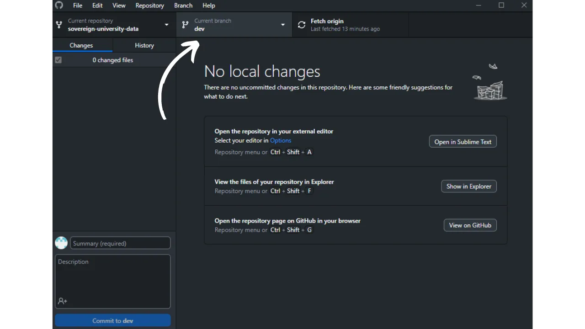
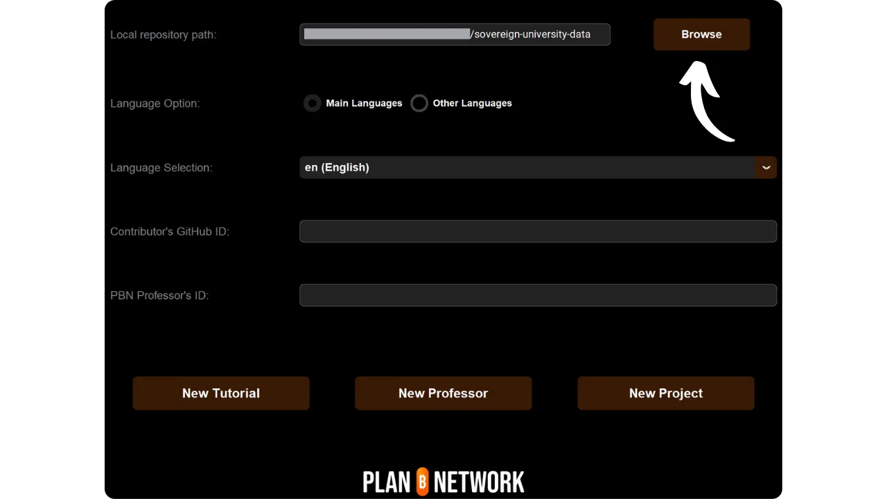

Prima di seguire questo tutorial sull'aggiunta di un nuovo tutorial, è necessario aver completato alcuni passi preliminari. Se non l'avete ancora fatto, vi invito a consultare prima questo tutorial introduttivo e poi a tornare qui:

https://planb.network/tutorials/others/contribution/write-tutorials-4d142a6a-9127-4ffb-9e0a-5aba29f169e2
L'avete già fatto:


- Scegliere il tema del tutorial;
- Contattare il team di Plan ₿ Network tramite [il gruppo Telegram](https://t.me/PlanBNetwork_ContentBuilder) o paolo@planb.network;
- Scegliere gli strumenti di contribuzione.

In questa guida vedremo come aggiungere il vostro tutorial alla rete di Plan ₿ configurando il vostro ambiente locale con GitHub Desktop. Se siete già esperti di Git, questo tutorial molto dettagliato potrebbe non essere necessario per voi. Vi consiglio piuttosto di consultare quest'altro tutorial in cui presento solo le linee guida principali, senza una guida dettagliata passo-passo:


- Utenti esperti**:

https://planb.network/tutorials/others/contribution/write-tutorials-git-expert-0ce1e490-c28f-4c51-b7e0-9a6ac9728410
Se preferite non configurare il vostro ambiente locale, seguite quest'altra guida pensata per i principianti, in cui apportiamo le modifiche direttamente tramite l'interfaccia web di GitHub:


- Principianti (interfaccia web)**:

https://planb.network/tutorials/others/contribution/write-tutorials-github-web-beginner-e64f8fed-4c0b-4225-9ebb-7fc5f1c01a79
## Prerequisiti

Software necessario per seguire questa esercitazione:


- [GitHub Desktop](https://desktop.github.com/);
- Un editor di file markdown come [Obsidian](https://obsidian.md/);
- Un editor di codice ([VSC](https://code.visualstudio.com/) o [Sublime Text](https://www.sublimetext.com/)).


Prerequisiti prima di iniziare l'esercitazione:


- Avere un [account GitHub](https://github.com/signup);
- Avere un fork del [repository dei sorgenti di Plan ₿ Network](https://github.com/PlanB-Network/bitcoin-educational-content);
- Avere [un profilo di professore su Plan ₿ Network](https://planb.network/professors) (solo se si propone un tutorial completo).

Se avete bisogno di aiuto per ottenere questi prerequisiti, le mie altre esercitazioni vi aiuteranno:

https://planb.network/tutorials/others/contribution/basics-of-github-471f7f00-8b5a-4b63-abb1-f1528b032bbb
Una volta che tutto è a posto e l'ambiente locale è correttamente configurato con il proprio fork della rete Plan ₿, si può iniziare ad aggiungere il tutorial.


## 1 - Creare un nuovo ramo

Aprire il browser e andare alla pagina del proprio fork del repository Plan ₿ Network. Questo è il fork che avete creato su GitHub. L'URL del vostro fork dovrebbe essere simile a: `https://github.com/[nomeutente]/bitcoin-educational-content`:


Assicurarsi di essere nel ramo principale `dev`, quindi fare clic sul pulsante `Sync fork`. Se il vostro fork non è aggiornato, GitHub vi proporrà di aggiornare il vostro ramo. Procedere con l'aggiornamento. Se, al contrario, il vostro ramo è già aggiornato, GitHub vi informerà:


Aprite il software GitHub Desktop e assicuratevi che il vostro fork sia selezionato correttamente nell'angolo superiore sinistro della finestra:


Fare clic sul pulsante "Recupera origine". Se il repository locale è già aggiornato, GitHub Desktop non suggerirà alcuna azione aggiuntiva. In caso contrario, apparirà l'opzione `Pull origin`. Fare clic su questo pulsante per aggiornare il repository locale:


Verificare che ci si trovi effettivamente nel ramo principale `dev`:



Fare clic su questo ramo, quindi fare clic sul pulsante "Nuovo ramo":


Assicurarsi che il nuovo ramo sia basato sul repository sorgente, cioè `PlanB-Network/bitcoin-educational-content`.

Nominate il vostro ramo in modo che il titolo sia chiaro sul suo scopo, usando i trattini per separare ogni parola. Per esempio, diciamo che il nostro obiettivo è scrivere un tutorial sull'uso del software Sparrow Wallet. In questo caso, il ramo di lavoro dedicato alla scrittura di questo tutorial potrebbe essere chiamato: `tuto-sparrow-wallet-loic`. Una volta inserito il nome appropriato, fare clic su `Crea ramo` per confermare la creazione del ramo:


Ora fate clic sul pulsante `Publish branch` per salvare il nuovo ramo di lavoro nel vostro fork online su GitHub:


Ora, su GitHub Desktop, ci si dovrebbe trovare nel nuovo ramo. Ciò significa che tutte le modifiche apportate localmente sul computer saranno salvate esclusivamente su questo ramo specifico. Inoltre, finché questo ramo rimane selezionato su GitHub Desktop, i file visibili localmente sul computer corrispondono a quelli di questo ramo (`tuto-sparrow-wallet-loic`) e non a quelli del ramo principale (`dev`).


Per ogni nuovo articolo che si desidera pubblicare, è necessario creare un nuovo ramo da `dev`. Un ramo in Git è una versione parallela del progetto, che consente di apportare modifiche senza influenzare il ramo principale, finché il lavoro non è pronto per essere unito.

## 2 - Aggiungere i file del tutorial

Ora che il ramo di lavoro è stato creato, è il momento di integrare il nuovo tutorial. Avete due opzioni: usare il mio script Python, che automatizza la creazione dei documenti necessari, oppure creare manualmente ogni file. Vediamo i passi da seguire per ciascuna opzione.

### Con il mio script Python

È necessario installarlo sul proprio computer:


- Python 3.8 o superiore.

Per utilizzare lo script, navigare nella cartella in cui è memorizzato. Lo script si trova nel repository dei dati di Plan ₿ Network al percorso: `bitcoin-educational-content/scripts/tutorial-related/data-creator`.

Una volta nella cartella, installare le dipendenze:

```
pip install -r requirements.txt
```

Avviate quindi il software con il comando:

```
python3 main.py
```

Si aprirà un'interfaccia grafica (GUI). La prima volta sarà necessario inserire tutte le informazioni necessarie, ma negli utilizzi successivi lo script ricorderà le informazioni personali, per cui non sarà necessario inserirle di nuovo.


Iniziate inserendo il percorso locale della cartella `/tutorials` nel vostro repository clonato (`.../bitcoin-educational-content/tutorials/`). È possibile inserirlo manualmente o fare clic sul pulsante "Sfoglia" per navigare con il proprio file explorer.



Selezionare la lingua in cui scrivere il tutorial.


Nel campo "ID GitHub del collaboratore", inserire il proprio nome utente GitHub.


Nel campo "ID professore PBN", inserire il proprio identificativo utilizzando le parole dell'elenco BIP39, così come appare sul [profilo del professore](https://github.com/PlanB-Network/bitcoin-educational-content/tree/dev/professors).


Se non avete ancora un profilo di professore, consultate questa guida:

https://planb.network/tutorials/others/contribution/create-teacher-profile-8ba9ba49-8fac-437a-a435-c38eebc8f8a4
Fare quindi clic sul pulsante "Nuova esercitazione".


Scegliere una categoria principale per il tutorial. Quindi, selezionare una sottocategoria pertinente in base alla categoria principale scelta.


Determinare il livello di difficoltà dell'esercitazione.


Scegliere un nome per la cartella creata appositamente per l'esercitazione. Il nome di questa cartella deve riflettere il software trattato nell'esercitazione, usando i trattini per separare le parole. Ad esempio, la cartella potrebbe chiamarsi `red-wallet`:


Il `project_id` è l'UUID dell'azienda o dell'organizzazione che sta dietro allo strumento trattato nel tutorial, disponibile [nell'elenco dei progetti](https://github.com/PlanB-Network/bitcoin-educational-content/tree/dev/resources/projects). Ad esempio, per un tutorial su Sparrow Wallet, è possibile trovare il suo `project_id` nel file: `bitcoin-educational-content/resources/projects/sparrow/project.yml`. Questa informazione viene aggiunta al file YAML del tutorial perché Plan ₿ Network mantiene un database di aziende e organizzazioni attive in Bitcoin o in progetti correlati. Aggiungendo il `project_id` associato, si collega il contenuto all'entità pertinente.

***Nella nuova versione dello script, non è più necessario inserire manualmente il `project_id`. È stata aggiunta una funzione di ricerca per trovare il progetto in base al nome e recuperare automaticamente il corrispondente `project_id`. Digitare l'inizio del nome del progetto nel campo "Nome progetto" per cercarlo, quindi selezionare la società desiderata dal menu a discesa. Il `project_id` verrà popolato automaticamente nel campo sottostante. Se necessario, è possibile inserirlo manualmente.


Per i tag, selezionare 2 o 3 parole chiave pertinenti al contenuto del tutorial, scegliendole esclusivamente da [l'elenco dei tag del Piano ₿ Network](https://github.com/PlanB-Network/bitcoin-educational-content/blob/dev/docs/50-planb-tags.md). Il software offre anche una funzione di ricerca per parole chiave con un elenco a discesa.


Una volta inserite e verificate tutte le informazioni, fare clic su "Crea tutorial" per confermare la creazione dei file del tutorial. La cartella del tutorial e tutti i file necessari della categoria selezionata verranno generati localmente.


A questo punto, si può saltare la sezione "Senza il mio script Python" e il passo 3, "Compilare il file YAML", poiché lo script ha già completato queste azioni per voi. Passate direttamente al passo 4 e iniziate a scrivere il vostro tutorial.

Per ulteriori informazioni su questo script Python, è possibile consultare il [README](https://github.com/PlanB-Network/bitcoin-educational-content/blob/dev/scripts/tutorial-related/new-tutorial-creation/README.md).

### Senza il mio script Python

Aprire il file manager e navigare nella cartella `bitcoin-educational-content`, che rappresenta il clone locale del repository. In genere si trova sotto `Documents\GitHub\bitcoin-educational-content`.

All'interno di questa cartella, è necessario individuare la sottocartella appropriata per inserire il tutorial. L'organizzazione delle cartelle riflette le diverse sezioni del sito web di Plan ₿ Network. Nel nostro esempio, poiché vogliamo aggiungere un tutorial su Sparrow Wallet, dovremo navigare nel seguente percorso: `bitcoin-educational-content\tutorials\wallet`, che corrisponde alla sezione `WALLET` del sito web:


All'interno della cartella `wallet`, è necessario creare una nuova cartella specificamente dedicata all'esercitazione. Il nome di questa cartella dovrebbe evocare il software trattato nel tutorial, assicurandosi di collegare le parole con dei trattini. Nel mio esempio, la cartella sarà intitolata `sparrow-wallet`:


In questa nuova sottocartella dedicata al tutorial, è necessario aggiungere diversi elementi:


- Creare una cartella `assets`, destinata a ricevere tutte le illustrazioni necessarie per l'esercitazione;
- All'interno di questa cartella `assets`, è necessario creare una sottocartella denominata in base al codice della lingua originale del tutorial. Ad esempio, se il tutorial è scritto in inglese, questa sottocartella deve essere denominata `en`. Inserire lì tutte le immagini del tutorial (diagrammi, immagini, screenshot, ecc.).
- È necessario creare un file `tutorial.yml` per registrare i dettagli relativi all'esercitazione;
- È necessario creare un file in formato markdown per scrivere il contenuto effettivo del tutorial. Questo file deve essere intitolato secondo il codice della lingua in cui è scritto. Ad esempio, per un tutorial scritto in francese, il file deve essere chiamato `fr.md`.


In sintesi, ecco la gerarchia dei file da creare:

```
bitcoin-educational-content/
└── tutorials/
└── wallet/ (to be modified with the correct category)
└── sparrow-wallet/ (to be modified with the name of the tutorial)
├── assets/
│   ├── en/ (to be modified according to the appropriate language code)
├── tutorial.yml
└── en.md (to be modified according to the appropriate language code)
```

## 3 - Compilare il file YAML

Compilare il file `tutorial.yml` copiando il seguente modello:

```
id:
project_id:
tags:
-
-
-
category:
level:
credits:
professor:
# Proofreading metadata
original_language:
proofreading:
- language:
last_contribution_date:
urgency:
contributors_id:
-
reward:
```

Ecco i dettagli dei campi obbligatori:


- id**: Un UUID (_Universally Unique Identifier_) per identificare in modo univoco il tutorial. È possibile generarlo con [uno strumento online](https://www.uuidgenerator.net/version4). L'unico requisito è che questo UUID sia casuale per evitare conflitti con un altro UUID della piattaforma;
- progetto_id**: L'UUID dell'azienda o dell'organizzazione che sta dietro allo strumento presentato nel tutorial [dall'elenco dei progetti] (https://github.com/PlanB-Network/bitcoin-educational-content/tree/dev/resources/projects). Ad esempio, se si sta creando un tutorial sul software Sparrow Wallet, si può trovare questo `project_id` nel seguente file: `bitcoin-educational-content/resources/projects/sparrow/project.yml`. Questa informazione viene aggiunta al file YAML del vostro tutorial perché Plan ₿ Network mantiene un database di tutte le aziende e organizzazioni che operano su Bitcoin o su progetti correlati. Aggiungendo il `project_id` dell'entità correlata al tutorial, si crea un collegamento tra i due elementi;
- tag**: 2 o 3 parole chiave pertinenti al contenuto del tutorial, scelte esclusivamente [dall'elenco dei tag di Plan ₿ Network](https://github.com/PlanB-Network/bitcoin-educational-content/blob/dev/docs/50-planb-tags.md);
- categoria**: La sottocategoria corrispondente al contenuto del tutorial, secondo la struttura del sito Plan ₿ Network (ad esempio per i portafogli: `desktop`, `hardware`, `mobile`, `backup`);
- livello**: Il livello di difficoltà dell'esercitazione, tra:
    - `principiante`
    - `intermedio`
    - avanzato
    - esperto
- professore**: Il suo `contributor_id` (parole BIP39) come visualizzato nel [suo profilo di professore](https://github.com/PlanB-Network/bitcoin-educational-content/tree/dev/professors);
- lingua_originale**: La lingua originale del tutorial (ad esempio `fr`, `en`, ecc.);
- correzione di bozze**: Informazioni sul processo di correzione delle bozze. Compilare la prima parte, poiché la correzione del proprio tutorial conta come prima validazione:
    - lingua**: Codice della lingua della correzione (ad esempio `fr`, `en`, ecc.).
    - data_ultimo_contributo**: Data di oggi.
    - urgenza**: Lasciare in bianco.
    - contributors_id**: Il vostro ID GitHub.
    - ricompensa**: Lasciare in bianco.

Per maggiori dettagli sull'identificativo del professore, consultare il relativo tutorial:

https://planb.network/tutorials/others/contribution/create-teacher-profile-8ba9ba49-8fac-437a-a435-c38eebc8f8a4
Ecco un esempio di file `tutorial.yml` completato per un tutorial sul portafoglio Blockstream Green:

```
id: e84edaa9-fb65-48c1-a357-8a5f27996143
project_id: 3b2f45e6-d612-412c-95ba-cf65b49aa5b8
tags:
- wallets
- software
- keys
category: mobile
level: beginner
credits:
professor: pretty-private
# Proofreading metadata
original_language: fr
proofreading:
- language: fr
last_contribution_date: 2024-11-20
urgency: 1
contributors_id:
- LoicPandul
reward: 0
```

Una volta terminata la modifica del file `tutorial.yml`, salvare il documento facendo clic su `File > Save`:


Ora è possibile chiudere l'editor di codice.

## 4 - Compilare il file Markdown

A questo punto, si può aprire il file che ospiterà il tutorial, denominato con il codice della propria lingua, ad esempio `fr.md`. Andate in Obsidian, sul lato sinistro della finestra, scorrete l'albero delle cartelle fino a trovare la cartella del vostro tutorial e il file che state cercando:


Fare clic sul file per aprirlo:


Inizieremo compilando la sezione `Proprietà` all'inizio del documento.


Aggiungere manualmente e compilare il seguente blocco di codice:

```
---
name: [Title]
description: [Description]
---
```


Inserite il nome del vostro tutorial e una breve descrizione:


Quindi, aggiungere il percorso dell'immagine di copertina all'inizio del tutorial. Per fare ciò, notare:

```

```

Questa sintassi è utile quando è necessario aggiungere un'immagine al tutorial. Il punto esclamativo indica che si tratta di un'immagine, con il testo alternativo (alt) specificato tra le parentesi. Il percorso dell'immagine è indicato tra le parentesi:


## 5 - Aggiungere il logo e la copertina

Nella cartella `assets` si deve aggiungere un file chiamato `logo.webp`, che servirà come miniatura per l'articolo. Questa immagine deve essere in formato `.webp` e deve rispettare una dimensione quadrata per armonizzarsi con l'interfaccia utente. È possibile scegliere il logo del software trattato nel tutorial o qualsiasi altra immagine pertinente, a condizione che sia libera da diritti. Inoltre, aggiungere anche un'immagine intitolata `cover.webp` nello stesso posto. Questa immagine verrà visualizzata nella parte superiore del tutorial. Assicurarsi che questa immagine, come il logo, rispetti i diritti d'uso e sia adatta al contesto del tutorial:

## 6 - Scrittura dell'esercitazione e aggiunta di immagini

Continuare a scrivere il tutorial redigendo il contenuto. Quando si desidera integrare un sottotitolo, applicare la formattazione markdown appropriata anteponendo al testo il prefisso `##`:


La sottocartella Lingua nella cartella `assets` è utilizzata per memorizzare i diagrammi e le immagini che accompagneranno il tutorial. Per quanto possibile, evitate di inserire testo nelle immagini per rendere i contenuti accessibili a un pubblico internazionale. Naturalmente il software presentato conterrà del testo, ma se aggiungete diagrammi o indicazioni aggiuntive alle schermate del software, fatelo senza testo o, se risulta indispensabile, usate l'inglese.


Per nominare le immagini, è sufficiente utilizzare i numeri corrispondenti all'ordine di apparizione nel tutorial, formattati con due cifre (o tre cifre se il tutorial contiene più di 99 immagini). Ad esempio, nominare la prima immagine `01.webp`, la seconda `02.webp` e così via.

Le immagini devono essere esclusivamente in formato `.webp`. Se necessario, è possibile utilizzare [il mio software di conversione delle immagini](https://github.com/LoicPandul/ImagesConverter).


Per inserire un diagramma nel documento, utilizzare il seguente comando Markdown, assicurandosi di specificare il testo alternativo appropriato e il percorso corretto dell'immagine:

```

```

Il punto esclamativo all'inizio indica che si tratta di un'immagine. Il testo alternativo, che aiuta l'accessibilità e la SEO, è posto tra le parentesi. Infine, il percorso dell'immagine è indicato tra le parentesi.

Se desiderate creare i vostri diagrammi, assicuratevi di aderire alla carta grafica di Plan ₿ Network per garantire la coerenza visiva:


- Font**: Utilizzare [Rubik](https://fonts.google.com/specimen/Rubik);
- Colori**:
 - Arancione: #FF5C00
 - Nero: #000000
 - Bianco: #FFFFFF

**È indispensabile che tutte le immagini integrate nelle esercitazioni siano libere da diritti o rispettino la licenza del file sorgente**. Inoltre, tutti i diagrammi pubblicati su Plan ₿ Network sono resi disponibili con licenza CC-BY-SA, allo stesso modo del testo.

**-> Suggerimento:** Quando si condividono file pubblicamente, come le immagini, è importante rimuovere i metadati non necessari. Questi possono contenere informazioni sensibili, come dati sulla posizione, date di creazione o dettagli sull'autore. Per proteggere la privacy, è consigliabile eliminare questi metadati. Per semplificare questo processo, è possibile utilizzare strumenti specializzati come [Exif Cleaner](https://exifcleaner.com/), che consente di pulire i metadati di un documento con un semplice drag-and-drop.

## 7 - Salvare e inviare l'esercitazione

Una volta terminata la stesura del tutorial nella lingua desiderata, il passo successivo consiste nell'inviare una **Richiesta di estrazione**. L'amministratore si occuperà di aggiungere le traduzioni mancanti del vostro tutorial, grazie al nostro metodo di traduzione automatica con revisione umana.

Per procedere con la richiesta di pull, aprire il software GitHub Desktop. Il software dovrebbe rilevare automaticamente le modifiche apportate localmente al ramo rispetto al repository originale. Prima di continuare, verificare attentamente sul lato sinistro dell'interfaccia che le modifiche corrispondano a quanto previsto:


Aggiungete un titolo per il vostro commit, quindi fate clic sul pulsante blu `Commit to [your branch]` per convalidare le modifiche:


Un commit è un salvataggio delle modifiche apportate al ramo, accompagnato da un messaggio descrittivo, che permette di seguire l'evoluzione di un progetto nel tempo. È una sorta di checkpoint intermedio.

Quindi fare clic sul pulsante `Push origin`. Questo invierà il commit al proprio fork:


Se non si è terminata l'esercitazione, si può tornare ad essa più tardi e fare nuovi commit. Se avete completato le modifiche per questo ramo, cliccate ora sul pulsante `Preview Pull Request`:


Si può controllare un'ultima volta che le modifiche siano corrette, quindi fare clic sul pulsante `Create pull request`:


Una richiesta di pull è una richiesta di integrazione delle modifiche dal proprio ramo al ramo principale del repository Plan ₿ Network, che consente la revisione e la discussione delle modifiche prima della loro fusione.

Verrete automaticamente reindirizzati nel vostro browser su GitHub alla pagina di preparazione della vostra richiesta di pull:


Indicare un titolo che riassuma brevemente le modifiche che si desidera unire al repository sorgente. Aggiungere un breve commento che descriva queste modifiche (se alla creazione del tutorial è associato un numero di problema, ricordarsi di annotare nel commento `Chiude #{numero di problema}`), quindi fare clic sul pulsante verde `Create pull request` per confermare la richiesta di unione:


La vostra PR sarà quindi visibile nella scheda "Richiesta di estrazione" del repository principale di Plan ₿ Network. Non dovrete far altro che attendere che un amministratore vi contatti per confermare la fusione del vostro contributo o per richiedere ulteriori modifiche.


Dopo che la PR è stata unita al ramo principale, si raccomanda di cancellare il ramo di lavoro (`tuto-sparrow-wallet`) per mantenere una storia pulita sul proprio fork. GitHub offre automaticamente questa opzione nella pagina della PR:


Sul software GitHub Desktop, è possibile tornare al ramo principale del proprio fork (`dev`).


Se desiderate apportare modifiche al vostro contributo dopo aver già presentato il PR, la procedura dipende dallo stato attuale del PR:


- Se il PR è ancora aperto e non è ancora stato unito, apportare le modifiche localmente rimanendo sullo stesso ramo. Una volta finalizzate le modifiche, usare il pulsante `Push origin` per aggiungere un nuovo commit al PR ancora aperto;
- Se il vostro PR è già stato unito al ramo principale, dovrete ricominciare il processo creando un nuovo ramo e inviando un nuovo PR. Assicurarsi che il repository locale sia sincronizzato con il repository di origine di Plan ₿ Network prima di procedere.

Se incontrate difficoltà tecniche nell'inviare il vostro tutorial, non esitate a chiedere aiuto su [il nostro gruppo Telegram dedicato ai contributi](https://t.me/PlanBNetwork_ContentBuilder). Grazie!

