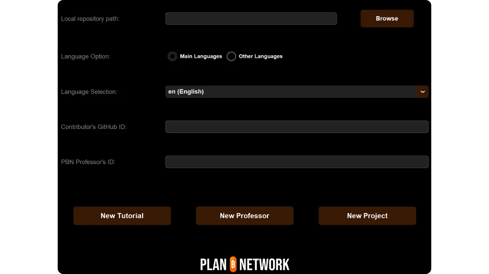
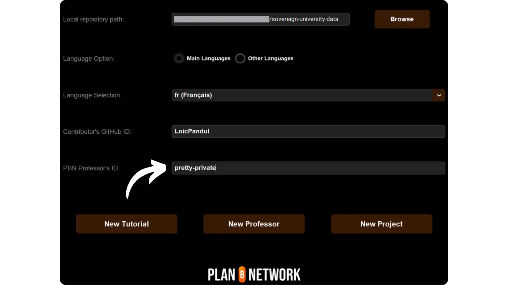
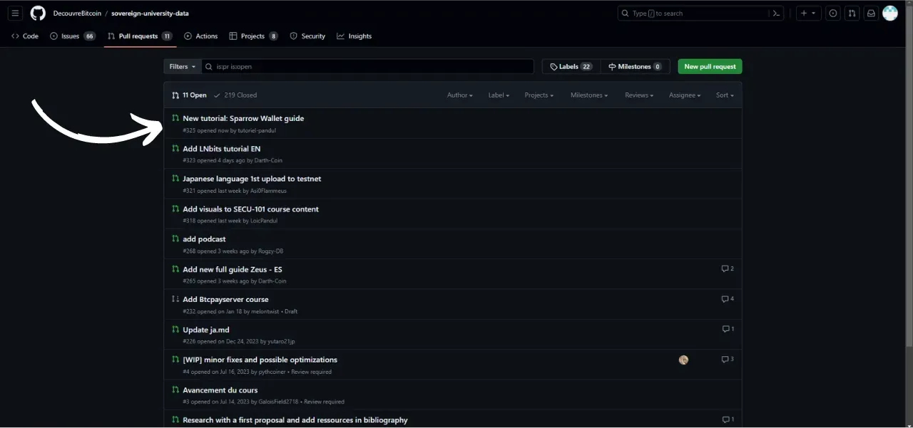

新しいチュートリアルの追加に関するこのチュートリアルに従う前に、いくつかの予備ステップを完了している必要があります。まだ完了していない場合は、まずこの入門チュートリアルを参照し、それからここに戻ってきてください：

https://planb.network/tutorials/others/contribution/write-tutorials-4d142a6a-9127-4ffb-9e0a-5aba29f169e2
あなたはすでにそうしている：


- チュートリアルのテーマを決める；
- Plan ₿ Networkチームに[Telegram group](https://t.me/PlanBNetwork_ContentBuilder)またはpaolo@planb.network；
- 貢献ツールを選ぶ

このチュートリアルでは、GitHub Desktop を使ってローカル環境を構築し、Plan ȋ Network にチュートリアルを追加する方法を説明します。すでに Git を使いこなしている方には、この詳細なチュートリアルは必要ないかもしれません。むしろ、このチュートリアルを参考にすることをお勧めします。このチュートリアルでは、詳細なステップバイステップのガイダンスを使わずに、主なガイドラインだけを紹介します：


- 経験豊富なユーザー

https://planb.network/tutorials/others/contribution/write-tutorials-git-expert-0ce1e490-c28f-4c51-b7e0-9a6ac9728410
ローカル環境を構築したくない場合は、初心者向けの別のチュートリアルを参考にしてください。このチュートリアルでは、GitHub のウェブインターフェイスを使って直接変更を行います：


- 初心者（ウェブインターフェース）**：

https://planb.network/tutorials/others/contribution/write-tutorials-github-web-beginner-e64f8fed-4c0b-4225-9ebb-7fc5f1c01a79
## 前提条件

このチュートリアルに従うために必要なソフトウェア：


- [GitHub Desktop](https://desktop.github.com/)；
- Obsidian](https://obsidian.md/)のようなマークダウン・ファイル・エディター；
- コードエディター（[VSC](https://code.visualstudio.com/)または[Sublime Text](https://www.sublimetext.com/)）。


チュートリアルを始める前の前提条件


- GitHubアカウント](https://github.com/signup)を持っている；
- Plan ₿ Networkソースリポジトリ](https://github.com/PlanB-Network/bitcoin-educational-content)をフォークしてください；
- Plan ₿ Network上の教授プロフィール](https://planb.network/professors)を持つ（完全なチュートリアルを提案する場合のみ）。

これらの前提条件の取得に助けが必要な場合は、私の他のチュートリアルがお手伝いします：

https://planb.network/tutorials/others/contribution/basics-of-github-471f7f00-8b5a-4b63-abb1-f1528b032bbb
すべての準備が整い、ローカル環境にプラン₿ネットワークのフォークが適切にセットアップされたら、チュートリアルの追加を開始できます。


## 1 - 新しいブランチを作る

ブラウザを開き、Plan ₿ Networkリポジトリのフォークのページに移動します。これは、GitHub で確立したフォークです。フォークのURLは以下のようになります：https://github.com/[あなたのユーザー名]/bitcoin-educational-content`：


メインブランチの `dev` にいることを確認してから、`Sync fork` ボタンをクリックします。フォークが最新でない場合は、GitHub がブランチの更新を提案します。更新を進めてください。逆に、あなたのブランチがすでに最新である場合は、GitHub があなたに通知します：


GitHub Desktopソフトウェアを開き、ウィンドウの左上でフォークが正しく選択されていることを確認します：


Fetch origin` ボタンをクリックします。ローカルリポジトリがすでに最新の状態であれば、GitHub Desktop は追加のアクションを提案しません。そうでない場合は、`Pull origin` オプションが表示されます。このボタンをクリックすると、ローカルリポジトリが更新されます：


メインブランチ `dev` にいることを確認してください：


このブランチをクリックし、`新規ブランチ`ボタンをクリックします：


新しいブランチがソースリポジトリ（`PlanB-Network/bitcoin-educational-content`）に基づいていることを確認してください。

各単語をダッシュで区切って、目的が明確になるようにタイトルをつけてください。たとえば、Sparrow Wallet の使い方のチュートリアルを書くのが目的だとしましょう。この場合、このチュートリアルを書くための作業ブランチの名前は `tuto-sparrow-wallet-loic` とします。適切な名前を入力したら、`Create branch`をクリックしてブランチの作成を確定します：


ここで、`Publish branch` ボタンをクリックして、新しい作業ブランチを GitHub 上のオンラインフォークに保存します：


これで、GitHub Desktop 上で新しいブランチにいることがわかります。つまり、ローカルで行った変更はすべてこのブランチに保存されるということです。また、GitHub Desktop 上でこのブランチが選択されている間は、あなたのマシンのローカルに表示されるファイルはこのブランチ (`tuto-sparrow-wallet-loic`) のものになり、メインブランチ (`dev`) のものにはなりません。


新しい記事を公開するたびに、`dev` から新しいブランチを作成する必要があります。Git におけるブランチとはプロジェクトの並行バージョンのことで、メインブランチに影響を与えずに変更を加えることができます。

## 2 - チュートリアルファイルの追加

作業ブランチができたので、いよいよ新しいチュートリアルを統合します。必要なドキュメントの作成を自動化する Python スクリプトを使うか、手動で各ファイルを作成するかです。それぞれのオプションの手順を説明します。

### 私のPythonスクリプトで

あなたのマシンにインストールする必要がある：


- Python 3.8以上。

スクリプトを使用するには、スクリプトが保存されているフォルダに移動します。スクリプトは Plan ₿ Network data repository のパスにあります：bitcoin-educational-content/scripts/tutorial-related/data-creator`にあります。

フォルダに入ったら、依存関係をインストールする：

```
pip install -r requirements.txt
```

次に、コマンドでソフトウェアを起動する：

```
python3 main.py
```

グラフィカル・ユーザー・インターフェース（GUI）が開きます。初回は必要な情報をすべて入力する必要がありますが、次回以降はスクリプトが個人情報を記憶しますので、再度入力する必要はありません。



まず、クローンしたリポジトリの `/tutorials` フォルダへのローカルパスを入力します（.../bitcoin-educational-content/tutorials/`）。手動で入力するか、「参照」ボタンをクリックしてファイルエクスプローラを使用して移動できます。


チュートリアルを書く言語を選択してください。


Contributor's GitHub ID "フィールドに、あなたのGitHubユーザー名を入力してください。


PBN教授ID」フィールドに、[あなたの教授プロフィール](https://github.com/PlanB-Network/bitcoin-educational-content/tree/dev/professors)に表示されているように、BIP39リストの単語を使ってあなたの識別子を入力してください。



まだ教授プロフィールをお持ちでない方は、こちらのチュートリアルをご覧ください：

https://planb.network/tutorials/others/contribution/create-teacher-profile-8ba9ba49-8fac-437a-a435-c38eebc8f8a4
次に「新しいチュートリアル」ボタンをクリックします。


チュートリアルのメインカテゴリーを選択してください。次に、選択したメインカテゴリーに基づいて関連するサブカテゴリーを選択します。


チュートリアルの難易度を決定します。


チュートリアル用に作成したディレクトリの名前を決めてください。このフォルダの名前はチュートリアルで扱うソフトウェアを反映したものにし、ハイフンで単語を区切ります。例えば、フォルダ名は `red-wallet` とします：


project_id`はチュートリアルで使用するツールの会社または組織のUUIDで、[プロジェクトのリスト](https://github.com/PlanB-Network/bitcoin-educational-content/tree/dev/resources/projects)にあります。例えば、Sparrow Walletのチュートリアルの場合、`project_id`はファイルで見つけることができます：bitcoin-educational-content/resources/projects/sparrow/project.yml`にあります。この情報は、Plan ↪Sc_20BF がビットコインや関連プロジェクトで活動している企業や組織のデータベースを管理しているため、チュートリアルの YAML ファイルに追加されます。関連する `project_id` を追加することで、コンテンツを関連するエンティティにリンクします。

***Update:***新バージョンのスクリプトでは、`project_id`を手動で入力する必要がなくなりました。検索機能が追加され、プロジェクト名で検索し、対応する `project_id` を自動的に取得します。プロジェクト名」フィールドにプロジェクト名の先頭を入力して検索し、ドロップダウンメニューから希望の会社を選択します。project_id`は自動的に下のフィールドに入力されます。必要に応じて手動で入力することもできます。


タグは、チュートリアルのコンテンツに関連するキーワードを 2 つまたは 3 つ、[プラン ₿ ネットワークタグリスト](https://github.com/PlanB-Network/bitcoin-educational-content/blob/dev/docs/50-planb-tags.md) から選択します。このソフトウェアには、ドロップダウンリストによるキーワード検索機能もあります。


すべての情報が入力され確認されたら、「チュートリアルを作成」をクリックしてチュートリアルファイルの作成を確定します。これにより、チュートリアルフォルダと、選択されたカテゴリにあるすべての必要なファイルがローカルに生成されます。


サブセクション「Pythonスクリプトを使わないで」とステップ3「YAMLファイルを埋める」は省略できます。ステップ4に直接進み、チュートリアルを書き始めます。

このPythonスクリプトの詳細については、[README](https://github.com/PlanB-Network/bitcoin-educational-content/blob/dev/scripts/tutorial-related/new-tutorial-creation/README.md)も参照してください。

### Pythonスクリプトなし

ファイルマネージャを開き、リポジトリのローカルクローンを表す `bitcoin-educational-content` フォルダに移動します。通常、このフォルダは `Documents}GitHub}bitcoin-educational-content` の下にあります。

このディレクトリの中で、チュートリアルを配置するのに適切なサブフォルダを見つける必要があります。フォルダ構成は、Plan ₿ Network ウェブサイトの各セクションを反映しています。この例では、Sparrow Wallet に関するチュートリアルを追加したいので、次のパスに移動します：これはウェブサイトの `WALLET` セクションに対応します：


wallet`フォルダの中に、チュートリアル専用の新しいディレクトリを作成する必要があります。このフォルダの名前は、チュートリアルで扱うソフトウェアを連想させるものにします。私の例では、フォルダのタイトルは `sparrow-wallet` とします：


このチュートリアル専用の新しいサブフォルダに、いくつかの要素を追加する必要があります：


- assets`フォルダを作成し、チュートリアルに必要なすべてのイラストを保存します；
- この `assets` フォルダの中に、チュートリアルの元の言語コードに応じた名前のサブフォルダを作成する必要があります。例えば、チュートリアルが英語で書かれている場合、このサブフォルダは `en` という名前にする必要があります。そこにチュートリアルのすべてのビジュアル（図、画像、スクリーンショットなど）を置きます。
- チュートリアルに関する詳細を記録するために `tutorial.yml` ファイルを作成する必要があります；
- チュートリアルの実際の内容を書くために、マークダウン形式のファイルを作成する必要があります。このファイルのタイトルはチュートリアルの言語コードに従わなければなりません。例えば、フランス語で書かれたチュートリアルの場合、ファイルは `fr.md` という名前でなければなりません。


まとめると、作成するファイルの階層は以下のようになる：

```
bitcoin-educational-content/
└── tutorials/
└── wallet/ (to be modified with the correct category)
└── sparrow-wallet/ (to be modified with the name of the tutorial)
├── assets/
│   ├── en/ (to be modified according to the appropriate language code)
├── tutorial.yml
└── en.md (to be modified according to the appropriate language code)
```

## 3 - YAMLファイルを埋める

以下のテンプレートをコピーして `tutorial.yml` ファイルを埋める：

```
id:
project_id:
tags:
-
-
-
category:
level:
credits:
professor:
# Proofreading metadata
original_language:
proofreading:
- language:
last_contribution_date:
urgency:
contributors_id:
-
reward:
```

以下は必須項目の詳細である：


- id**：チュートリアルを一意に識別するための UUID (_Universally Unique Identifier_) です。オンラインツール](https://www.uuidgenerator.net/version4) で生成できます。唯一の要件は、プラットフォーム上の他のUUIDとの衝突を避けるために、このUUIDがランダムであることです；
- project_id**：チュートリアルで紹介するツールの会社または組織の UUID [プロジェクトのリストから](https://github.com/PlanB-Network/bitcoin-educational-content/tree/dev/resources/projects)。例えば、Sparrow Walletソフトウェアのチュートリアルを作成する場合、この`project_id`は以下のファイルにあります：bitcoin-educational-content/resources/projects/sparrow/project.yml`。この情報がチュートリアルの YAML ファイルに追加されるのは、Plan ↪Sc_20BF がビットコインや関連プロジェクトで活動しているすべての企業や組織のデータベースを管理しているからです。チュートリアルに関連するエンティティの `project_id` を追加することで、2 つの要素の間にリンクが作成されます；
- タグ**：Plan ₿ Networkのタグリストから](https://github.com/PlanB-Network/bitcoin-educational-content/blob/dev/docs/50-planb-tags.md)、チュートリアルの内容に関連するキーワードを2～3個選んでください；
- カテゴリー**：カテゴリ**: Plan ȏ Networkサイトの構造に従って、チュートリアルの内容に対応するサブカテゴリ（例：財布の場合、`デスクトップ`、`ハードウェア`、`モバイル`、`バックアップ`）；
- レベル**：チュートリアルの難易度：
    - 初心者
    - 中級
    - 上級者向け
    - エキスパート
- professor**：あなたの教授プロフィール](https://github.com/PlanB-Network/bitcoin-educational-content/tree/dev/professors)に表示されているあなたの`contributor_id` (BIP39ワード)；
- original_language**：チュートリアルの元の言語 (例 `fr`、`en` など)；
- 校正**：校正プロセスに関する情報。自分自身のチュートリアルの校正は最初の検証としてカウントされますので、最初の部分を記入してください：
    - language**：校正の言語コード（例えば `fr`、`en` など）。
    - last_contribution_date**：今日の日付。
    - 緊急度**：空欄のまま
    - contributors_id**：あなたの GitHub ID。
    - 報酬**：空白のままにする。

教授識別子の詳細については、対応するチュートリアルを参照してください：

https://planb.network/tutorials/others/contribution/create-teacher-profile-8ba9ba49-8fac-437a-a435-c38eebc8f8a4
以下は、Blockstream Green ウォレットのチュートリアル用に完成した `tutorial.yml` ファイルの例です：

```
id: e84edaa9-fb65-48c1-a357-8a5f27996143
project_id: 3b2f45e6-d612-412c-95ba-cf65b49aa5b8
tags:
- wallets
- software
- keys
category: mobile
level: beginner
credits:
professor: pretty-private
# Proofreading metadata
original_language: fr
proofreading:
- language: fr
last_contribution_date: 2024-11-20
urgency: 1
contributors_id:
- LoicPandul
reward: 0
```

tutorial.yml`ファイルの修正が終わったら、`File > Save`をクリックしてドキュメントを保存してください：


これでコードエディターを閉じることができる。

## 4 - マークダウン・ファイルに記入する

これで、チュートリアルをホストするファイルを開くことができるようになります。Obsidianのウィンドウの左側にあるフォルダツリーをスクロールして、チュートリアルのフォルダと探しているファイルを見つけます：


ファイルをクリックして開く：


まず、ドキュメントの一番上にある`プロパティ`セクションを埋めることから始めます。


以下のコードブロックを手動で追加し、記入する：

```
---
name: [Title]
description: [Description]
---
```


チュートリアルの名前と簡単な説明を記入してください：


次に、チュートリアルの冒頭にカバー画像のパスを追加します。そのためには

```

```

この構文はチュートリアルに画像を追加する必要があるときに便利です。感嘆符は画像であることを示し、代替テキスト（alt）は括弧の間に指定されます。画像へのパスは括弧の間に示されます：


## 5 - ロゴと表紙を追加する

assets`フォルダの中に `logo.webp` というファイルを追加してください。この画像は `.webp` フォーマットで、ユーザーインターフェイスと調和するように正方形の寸法にする必要があります。チュートリアルで扱うソフトウェアのロゴ、またはその他の関連画像は、権利フリーであれば自由に選択できます。さらに、同じ場所に `cover.webp` というタイトルの画像も追加してください。この画像はチュートリアルの一番上に表示されます。この画像もロゴと同様に、使用権を尊重し、チュートリアルの文脈に適したものであることを確認してください：

## 6 - チュートリアルの作成とビジュアルの追加

コンテンツの下書きを行い、チュートリアルを書き続けてください。サブタイトルを組み込みたい場合は、テキストの先頭に `##` を付けて、適切なマークダウン書式を適用してください：


assets`フォルダ内のlanguageサブフォルダは、チュートリアルに付随する図やビジュアルを保存するために使用します。できるだけ、画像にテキストを含めないようにしてください。もちろん、紹介するソフトウェアにはテキストが含まれますが、ソフトウェアのスクリーンショットに図や追加の表示を追加する場合は、テキストなしで行うか、テキストが不可欠であることが判明した場合は、英語を使用してください。


画像に名前を付けるには、チュートリアルに登場する順番に対応する番号を、2桁（チュートリアルに99枚以上の画像が含まれる場合は3桁）のフォーマットで使用するだけです。例えば、最初の画像には `01.webp`、2番目の画像には `02.webp` というように名前をつけます。

画像は `.webp` 形式に限ります。必要であれば、[私の画像変換ソフトウェア](https://github.com/LoicPandul/ImagesConverter)を使用することができます。


ドキュメントに図を挿入するには、以下のMarkdownコマンドを使用し、適切な代替テキストと画像の正しいパスを指定してください：

```

```

冒頭の感嘆符は画像であることを示す。アクセシビリティとSEOを助ける代替テキストは、括弧の間に配置されています。最後に、括弧の間に画像へのパスを示します。

独自のダイアグラムを作成する場合は、視覚的な一貫性を確保するため、Plan ₿ Networkのグラフィック・チャーターに従うようにしてください：


- フォント**：ルービック](https://fonts.google.com/specimen/Rubik)を使う；
- 色**：
 - オレンジ#FF5C00
 - ブラック#000000
 - 白：白：#FFFFFFF

**チュートリアルに組み込まれるすべてのビジュアルは、権利フリーであるか、ソースファイルのライセンスを尊重することが必須です**。また、Plan ₿ Networkで公開されているすべての図は、テキストと同様にCC-BY-SAライセンスの下で利用可能です。

**-> ヒント：*** 画像などのファイルを公に共有する場合、不要なメタデータを削除することが重要です。メタデータには、位置情報、作成日、作者の情報など、機密情報が含まれていることがあります。プライバシーを守るためにも、このメタデータは削除することをお勧めします。このプロセスを簡素化するには、[Exif Cleaner](https://exifcleaner.com/)のような専用ツールを使用することができます。このツールを使用すると、簡単なドラッグ＆ドロップ操作でドキュメントのメタデータをクリーニングすることができます。

## 7 - チュートリアルを保存して送信する

お好みの言語でチュートリアルを書き終えたら、次のステップは **プルリクエスト** を提出することです。チュートリアルに不足している翻訳は、管理者が追加します。

Pull Request を進めるには、GitHub Desktop を開きます。ソフトウェアが、元のリポジトリと比較してブランチのローカルで行った変更を自動的に検出するはずです。続行する前に、インターフェイスの左側でこれらの変更が期待したものと一致していることを注意深く確認してください：


コミットのタイトルを追加し、青い `Commit to [your branch]` ボタンをクリックして変更を確認します：


コミットとは、ブランチに加えられた変更を、説明的なメッセージを添えて保存することで、時間の経過とともにプロジェクトの進化をたどることができます。中間チェックポイントのようなものです。

次に `Push origin` ボタンをクリックします。これであなたのコミットがフォークに送信されます：


まだチュートリアルを終えていない場合は、後でチュートリアルに戻って新しいコミットを行うことができます。このブランチの変更が完了したら、今すぐ `Preview Pull Request` ボタンをクリックします：


最後にもう一度、修正内容が正しいことを確認してから、`Create pull request`ボタンをクリックします：


プルリクエストとは、あなたのブランチの変更を Plan ȏ Network リポジトリのメインブランチに統合するためのリクエストです。

GitHub 上のブラウザで、Pull Request の準備ページに自動的にリダイレクトされます：


ソースリポジトリにマージしたい変更点を簡潔にまとめたタイトルを記入してください。チュートリアルの作成に関連する課題番号がある場合、コメントに `Closes #{課題番号}` と記述することを忘れないでください）、緑色の `Create pull request` ボタンをクリックしてマージリクエストを確定します：


あなたのPRは、メインの Plan ₿ Network リポジトリの `Pull Request` タブに表示されます。あとは、管理者があなたの投稿の合併を確認したり、追加の修正を依頼するために連絡をくれるのを待つだけです。



PRがメインブランチにマージされた後、作業ブランチ（`tuto-sparrow-wallet`）を削除することをお勧めします。GitHub はあなたの PR ページで自動的にこのオプションを提供します：


GitHub デスクトップソフトウェアでは、フォークのメインブランチ (`dev`) に戻ることができます。


既にPRを提出した後に、投稿内容の変更を希望する場合、その手続きはPRの現状によって異なります：


- PR がまだオープンでマージされていない場合は、同じブランチに留まりながらローカルで変更を行ってください。変更が完了したら、`Push origin` ボタンを使ってまだオープンしている PR に新しいコミットを追加します；
- PRがすでにメインブランチにマージされている場合は、新しいブランチを作成し、新しいPRを投稿してプロセスをやり直す必要があります。作業を進める前に、ローカルリポジトリが Plan ȏ Network ソースリポジトリと同期していることを確認してください。

チュートリアルを投稿する際に技術的な問題が発生した場合は、遠慮なく[投稿専用のTelegramグループ](https://t.me/PlanBNetwork_ContentBuilder)に助けを求めてください。ありがとうございました！

