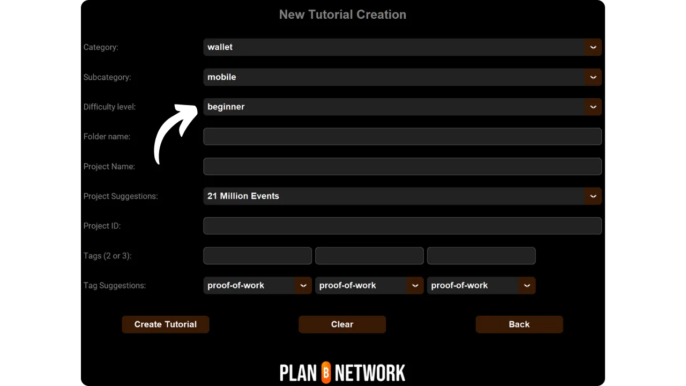

新しいチュートリアルを追加するためのこのチュートリアルに従う前に、いくつかの予備ステップを完了する必要があります。まだ完了していない場合は、まずこの入門チュートリアルをご覧ください：

https://planb.network/tutorials/others/contribution/write-tutorials-4d142a6a-9127-4ffb-9e0a-5aba29f169e2

あなたはすでに持っている：


- チュートリアルのテーマを決めてください；
- Plan ₿ Networkチームに[Telegram group](https://t.me/PlanBNetwork_ContentBuilder)またはpaolo@planb.network；
- 貢献ツールを選ぶ

このチュートリアルでは、GitHub Desktop を使ってローカル環境を設定し、チュートリアルを Plan ₿ Network に追加する方法を説明します。すでに Git を使いこなしている方には、この詳細なチュートリアルは必要ないかもしれません。代わりに、このチュートリアルをご覧になることをお勧めします。このチュートリアルでは、大まかなガイドラインのみを紹介し、詳細なステップバイステップのガイダンスは省略しています：


- 経験者** ：

https://planb.network/tutorials/others/contribution/write-tutorials-git-expert-0ce1e490-c28f-4c51-b7e0-9a6ac9728410

ローカル環境を設定したくない場合は、初心者向けのチュートリアルに従い、GitHubのウェブインターフェイスから直接変更を行ってください：


- 初心者向け（ウェブインターフェース）** ：

https://planb.network/tutorials/others/contribution/write-tutorials-github-web-beginner-e64f8fed-4c0b-4225-9ebb-7fc5f1c01a79

## 前提条件

このチュートリアルに必要なソフトウェア ：


- [GitHub Desktop](https://desktop.github.com/)；
- Obsidian](https://obsidian.md/)のようなマークダウンファイルエディタ；
- コードエディター（[VSC](https://code.visualstudio.com/)または[Sublime Text](https://www.sublimetext.com/)）。


チュートリアルを始める前の前提条件 ：


- GitHubアカウント](https://github.com/signup)を持っている；
- Plan ₿ Networkソースリポジトリ](https://github.com/PlanB-Network/bitcoin-educational-content)をフォークしてください；
- Plan ₿ Networkの講師プロフィール](https://planb.network/professors)(完全なチュートリアルを提供する場合のみ)を持っている。

これらの前提条件を得るのに手助けが必要な場合は、私の他のチュートリアルが役に立つだろう：


https://planb.network/tutorials/others/contribution/create-github-account-a75fc39d-f0d0-44dc-9cd5-cd94aee0c07c

https://planb.network/tutorials/others/contribution/github-desktop-work-environment-5862003b-9d76-47f5-a9e0-5ec74256a8ba

https://planb.network/tutorials/others/contribution/create-teacher-profile-8ba9ba49-8fac-437a-a435-c38eebc8f8a4

すべての準備が整い、ローカル環境に独自の Plan ₿ Network フォークがセットアップされたら、チュートリアルの追加を開始できます。

## 1 - 新しいブランチを作る

ブラウザを開き、Plan ₿ Network リポジトリのフォークページに移動します。これが GitHub で確立したフォークです。フォークのURLは以下のようになります：https://github.com/[あなたのユーザー名]/bitcoin-educational-content` ：


メインの `dev` ブランチにいることを確認してから、`Sync fork` ボタンをクリックします。フォークが最新でない場合は、GitHub がブランチを更新するよう求めてきます。更新を進めてください。一方、あなたのブランチがすでに最新である場合は、GitHub があなたに通知します：


GitHub Desktopを開き、ウィンドウの左上でフォークが正しく選択されていることを確認します：


Fetch origin` ボタンをクリックします。ローカルリポジトリがすでに最新であれば、GitHub Desktop はそれ以上のアクションを提案しません。そうでない場合は、`Pull origin` オプションが表示されます。このボタンをクリックすると、ローカルリポジトリが更新されます：


dev`メインブランチにいることを確認する：


このブランチをクリックし、`新規ブランチ`ボタンをクリックします：


新しいブランチがソースリポジトリ、つまり `PlanB-Network/bitcoin-educational-content` に基づいていることを確認してください。

各単語をダッシュで区切って、タイトルが目的を明確にするようにブランチに名前を付けましょう。たとえば、私たちの目的が Sparrow Wallet の使い方のチュートリアルを書くことだとしましょう。この場合、このチュートリアルを書くための作業ブランチの名前は `tuto-sparrow-wallet-loic` となります。適切な名前を入力したら、`Create branch`をクリックしてブランチの作成を確定します：


ここで、`Publish branch` ボタンをクリックして、新しい作業ブランチを GitHub 上のオンラインフォークに保存します：


これで、GitHub Desktop 上では新しいブランチにいるはずです。つまり、ローカルで行った変更はすべてこのブランチのみに保存されるということです。また、GitHub Desktop 上でこのブランチが選択されている間は、あなたのマシンのローカルに表示されるファイルはこのブランチ (`tuto-sparrow-wallet-loic`) のものになり、メインブランチ (`dev`) のものにはなりません。


新しい記事を公開するたびに、`dev` から新しいブランチを作成する必要があります。Git におけるブランチとはプロジェクトの並行バージョンのことで、メインブランチに影響を与えずに変更を加えることができます。

## 2 - チュートリアルファイルの追加

作業ブランチが作成されたので、新しいチュートリアルを統合しましょう。必要なドキュメントの作成を自動化する Python スクリプトを使うか、各ファイルを手動で作成するかです。それぞれのオプションについて、手順を説明しましょう。

### 私のPythonスクリプトで

をインストールする必要があります：


- Python 3.8 以上；
- スクリプトに必要な依存関係実行：

```bash
pip install customtkinter appdirs
````
Pour utiliser le script, rendez-vous dans le dossier où il est stocké. Le script se trouve dans le dépôt de data de Plan ₿ Network sous le chemin : `bitcoin-educational-content/scripts/tutorial-related/new-tutorial-creation/`.
Une fois dans le dossier, exécutez la commande :
```

python new-tutorial-creation.py

```
Une interface graphique (GUI) va s'ouvrir. La première fois, vous devrez entrer toutes les informations nécessaires, mais lors des utilisations ultérieures du script, vos informations personnelles seront mémorisées, ce qui vous évite de devoir les saisir de nouveau.

Commencez par indiquer le chemin local menant au dossier `/tutorials` sur votre clone du dépôt (`.../bitcoin-educational-content/tutorials/`). Vous pouvez le noter manuellement ou cliquer sur le bouton "Browse" pour naviguer via votre explorateur de fichiers.

Sélectionnez la langue dans laquelle vous rédigerez votre tutoriel.

Choisissez une catégorie principale pour votre tutoriel.

Ensuite, sélectionnez une sous-catégorie appropriée, en fonction de la catégorie principale que vous avez choisie.

Déterminez un niveau de difficulté pour le tutoriel.

Choisissez le nom du répertoire spécialement créé pour votre tutoriel. Le nom de ce dossier devrait refléter le logiciel abordé dans le tutoriel, en utilisant des tirets pour relier les mots. Par exemple, le dossier pourrait s'appeler `red-wallet` :

Le `project_id` est l'UUID de l'entreprise ou de l'organisation derrière l'outil présenté dans le tutoriel, disponible [dans la liste des projets](https://github.com/PlanB-Network/bitcoin-educational-content/tree/dev/resources/projects). Par exemple, pour un tutoriel sur le logiciel Sparrow Wallet, vous trouverez ce `project_id` dans le fichier : `bitcoin-educational-content/resources/projects/sparrow/project.yml`. Cette information est ajoutée au fichier YAML de votre tutoriel car Plan ₿ Network maintient une base de données des entreprises et organisations actives sur Bitcoin ou des projets connexes. En ajoutant le `project_id` associé à votre tutoriel, vous créez un lien entre votre contenu et l'entité concernée.
***Mise à jour :*** Dans la nouvelle version du script, vous n'avez plus besoin de saisir manuellement le `project_id`. Une fonction de recherche a été ajoutée pour trouver le projet par son nom et récupérer automatiquement le `project_id` correspondant. Tapez le début du nom du projet dans la case "Project name" pour le rechercher, puis sélectionnez l'entreprise souhaitée dans le menu déroulant. Le `project_id` sera automatiquement renseigné dans la case en dessous. Vous avez également la possibilité de le noter manuellement si nécessaire.

Pour les tags, sélectionnez 2 ou 3 mots-clés pertinents en relation avec le contenu de votre tutoriel, en les choisissant exclusivement [dans la liste des tags de Plan ₿ Network](https://github.com/PlanB-Network/bitcoin-educational-content/blob/dev/docs/50-planb-tags.md).

Dans la case "Contributor's GitHub ID", inscrivez votre identifiant GitHub.

Pour la case "PBN professor's ID", saisissez votre identifiant en utilisant les mots de la liste BIP39, tel qu'il apparaît sur [votre profil professeur](https://github.com/PlanB-Network/bitcoin-educational-content/tree/dev/professors).

Pour plus de détails sur votre identifiant de professeur, veuillez consulter le tutoriel suivant :
https://planb.network/tutorials/others/contribution/create-teacher-profile-8ba9ba49-8fac-437a-a435-c38eebc8f8a4

Une fois toutes les informations saisies et vérifiées, cliquez sur "Create Tutorial" pour valider la création des fichiers de votre tutoriel. Cela générera en local le dossier de votre tutoriel et tous les fichiers nécessaires dans le dossier de la catégorie sélectionnée.

Vous pouvez maintenant passer outre la sous-partie "Sans mon script Python", ainsi que l'étape 3 "Remplir le fichier YAML", car le script a déjà effectué ces actions automatiquement pour vous. Passez directement à l'étape 4 et à la rédaction de votre tutoriel.
Pour plus d'informations sur ce script Python, vous pouvez également [consulter son README](https://github.com/PlanB-Network/bitcoin-educational-content/blob/dev/scripts/tutorial-related/new-tutorial-creation/README.md).
### Sans mon script Python
Ouvrez votre gestionnaire de fichiers et dirigez-vous vers le dossier `bitcoin-educational-content`, qui représente le clone local de votre dépôt. Vous devriez normalement le trouver sous `Documents\GitHub\bitcoin-educational-content`.
Au sein de ce répertoire, il sera nécessaire de localiser le sous-dossier adéquat pour le placement de votre tutoriel. L'organisation des dossiers reflète les différentes sections du site web Plan ₿ Network. Dans notre exemple, puisque nous souhaitons ajouter un tutoriel sur Sparrow Wallet, il convient de se rendre dans le chemin suivant : `bitcoin-educational-content\tutorials\wallet` qui correspond à la section `WALLET` sur le site web :

Au sein du dossier `wallet`, il faut créer un nouveau répertoire spécifiquement dédié à votre tutoriel. Le nom de ce dossier doit évoquer le logiciel traité dans le tutoriel, en veillant à relier les mots par des tirets. Pour mon exemple, le dossier sera intitulé `sparrow-wallet` :

Dans ce nouveau sous-dossier dédié à votre tutoriel, il faut ajouter plusieurs éléments :
- Créez un dossier `assets`, destiné à recevoir toutes les illustrations nécessaires à votre tutoriel ;
- Au sein de ce dossier `assets`, il faut créer un sous-dossier nommé selon le code de langue originale du tutoriel. Par exemple, si le tutoriel est rédigé en anglais, ce sous-dossier doit être nommé `en`. Placez-y tous les visuels du tutoriel (schémas, images, captures d’écran, etc.).
- Un fichier `tutorial.yml` doit être créé pour y consigner les détails relatifs à votre tutoriel ;
- Un fichier en format markdown est à créer pour y rédiger le contenu effectif de votre tutoriel. Ce fichier doit être intitulé selon le code de la langue de rédaction. Par exemple, pour un tutoriel rédigé en français, le fichier devra s'appeler `fr.md`.

Pour résumer, voici la hiérarchie des fichiers à créer :
```

ビットコイン教育コンテンツ

チュートリアル

財布／（正しいカテゴリーに変更する）

スズメノカタビラ／（ツナギ名で修正）

資産

├── ja/（適切な言語コードに変更する）

├── tutorial.yml

└─ fr.md（適切な言語コードに従って修正される）

```
## 3 - Remplir le fichier YAML
Remplissez le fichier `tutorial.yml` en copiant le modèle suivant :
```

id.K.である：

project_id：

のタグがある：

-

-

-

カテゴリーに分類される：

レベルだ：

のクレジットがある：

教授

# メタデータの校正

original_language：

校正：


  - 言語である：

last_contribution_date：

急を要する：

contributors_id：

-

報奨金だ：

````

以下は必須項目です：


- id**：チュートリアルを一意に識別するための UUID (_Universally Unique Identifier_) です。オンラインツール](https://www.uuidgenerator.net/version4) で生成できます。唯一の制約は、プラットフォーム上の他のUUIDと衝突しないように、このUUIDはランダムでなければならないということです；
- project_id** ：チュートリアルで紹介するツールの背後にある会社または組織のUUID [プロジェクトのリストから](https://github.com/PlanB-Network/bitcoin-educational-content/tree/dev/resources/projects)。例えば、Sparrow Walletソフトウェアのチュートリアルを行う場合、この`project_id`は以下のファイルにあります：bitcoin-educational-content/resources/projects/sparrow/project.yml`。この情報はチュートリアルの YAML ファイルに追加されます。これは、Plan ↪Sc_20BF がビットコインまたは関連プロジェクトで活動しているすべての企業や組織のデータベースを管理しているためです。リンクされたエンティティの `project_id` をチュートリアルに追加することで、2 つの要素の間にリンクが作成されます；
- タグ**：プラン₿ネットワークタグリストから](https://github.com/PlanB-Network/bitcoin-educational-content/blob/dev/docs/50-planb-tags.md)、チュートリアルの内容に関連するキーワードを2つまたは3つ選びます；
- カテゴリー** ：Plan ȏ Network structure（例：ウォレットの場合、`デスクトップ`、`ハードウェア`、`モバイル`、`バックアップ`）に従った、チュートリアルの内容に対応するサブカテゴリー；
- レベル** ：チュートリアルの難易度：
    - 初心者
    - 中級
    - 上級者向け
    - エキスパート
- 教授**：あなたの先生プロフィール](https://github.com/PlanB-Network/bitcoin-educational-content/tree/dev/professors)に表示されているあなたの`contributor_id` (BIP39ワード)；
- original_language** ：チュートリアルの元の言語 (例 `fr`、`en` など) ；
- 校正**：校正プロセスに関する情報。自分自身のチュートリアルの校正は最初の検証としてカウントされますので、最初の部分を記入してください：
    - 言語**：校正言語コード（例：`fr`、`en`など）。
    - last_contribution_date**：今日の日付。
    - 緊急度** ：空欄のまま
    - contributors_id** ：あなたのGitHub ID。
    - 報酬** ：空欄のまま

教師IDの詳細については、対応するチュートリアルを参照してください：

https://planb.network/tutorials/others/contribution/create-teacher-profile-8ba9ba49-8fac-437a-a435-c38eebc8f8a4

以下は、Blockstream Green ウォレットのチュートリアル用に完成した `tutorial.yml` ファイルの例です：

```yaml
id: e84edaa9-fb65-48c1-a357-8a5f27996143
project_id: 3b2f45e6-d612-412c-95ba-cf65b49aa5b8
tags:
- wallets
- software
- keys
category: mobile
level: beginner
credits:
professor: pretty-private
# Proofreading metadata
original_language: fr
proofreading:
- language: fr
last_contribution_date: 2024-11-20
urgency:
contributors_id:
- LoicPandul
reward:
```

tutorial.yml`ファイルの編集が終わったら、`File > Save`をクリックしてドキュメントを保存してください：


これでコードエディターを閉じることができる。

## 4 - マークダウン・ファイルに記入する

これでチュートリアルファイルを開くことができます。ウィンドウの左側にある Obsidian に移動し、フォルダツリーをスクロールしてチュートリアルフォルダと目的のファイルまで移動します：


ファイルをクリックして開く：


まず、ドキュメントの一番上にある`プロパティ`セクションを埋めることから始めます。


以下のコードブロックを手動で追加し、記入する：

```markdown
---
name: [Titre]
description: [Description]
---
```


チュートリアルの名前と簡単な説明を記入してください：


次に、チュートリアルの最初にカバー画像へのパスを追加します。これを行うには、：

```markdown

```

この構文は、チュートリアルに画像を追加する必要があるときに便利です。感嘆符は画像を示し、その代替テキスト（alt）は角括弧の間に指定されます。画像へのパスは大括弧の間に示されます：


## 5 - ロゴとカバーを追加

assets`フォルダの中に、記事のサムネイルとなる `logo.webp` というファイルを追加する必要があります。この画像は `.webp` フォーマットで、ユーザーインターフェースに合うように正方形のサイズでなければなりません。チュートリアルで扱うソフトウェアのロゴでも、ロイヤリティフリーの画像であれば他の関連画像でも自由に選んでください。さらに、同じ場所に `cover.webp` というタイトルの画像を追加してください。これはチュートリアルの一番上に表示されます。この画像もロゴと同様に使用権を尊重し、チュートリアルの文脈にふさわしいものにしてください：


## 6 - チュートリアルの作成とビジュアルの追加

チュートリアルのコンテンツを書き続けてください。サブタイトルを入れたい場合は、テキストの先頭に `##` を付けて、適切なマークダウン書式を適用してください：


assets`フォルダ内のlanguageサブフォルダは、あなたのチュートリアルに付随する図やビジュアルを保存するために使用します。できるだけ、画像にテキストを含めないようにしてください。もちろん、紹介するソフトウェアにはテキストが含まれますが、ソフトウェアのスクリーンショットに回路図や追加的な表示を加える場合は、テキストなしにするか、必要であれば英語にしてください。


画像に名前を付けるには、チュートリアルに登場する順番に対応する数字を2桁（チュートリアルに99枚以上の画像が含まれる場合は3桁）で入力してください。例えば、最初の画像には `01.webp`、2番目の画像には `02.webp` というように名前をつけます。

画像は `.webp` 形式に限ります。必要であれば、[私の画像変換ソフト](https://github.com/LoicPandul/ImagesConverter) を使用してください。


ドキュメントに図を挿入するには、適切な代替テキストと正しい画像パスを指定するように注意して、Markdownで以下のコマンドを使用します：

```markdown

```

冒頭の感嘆符は画像を示す。アクセシビリティと参照に役立つ代替テキストは、角括弧の間に置かれます。最後に、画像へのパスを括弧で囲んで示します。

独自の回路図を作成する場合は、視覚的な一貫性を確保するため、必ず Plan ₿ Network グラフィックのガイドラインに従ってください：


- フォント**：ルービック](https://fonts.google.com/specimen/Rubik)を使う；
- カラー** ：
 - オレンジ#FF5C00
 - 黒 : #000000
 - 白：白：#FFFFFFF

**チュートリアルに組み込まれるすべてのビジュアルは、著作権フリーであるか、ソースファイルのライセンス**を尊重することが不可欠です。そのため、Plan ₿ Networkで公開されるすべての図は、テキストと同様にCC-BY-SAライセンスの下で利用可能です。

**-> ヒント：*** 画像などのファイルを公共の場で共有する場合、余計なメタデータを削除することが重要です。メタデータには、位置情報、作成日、作者の詳細などの機密情報が含まれていることがあります。プライバシーを守るためにも、このメタデータを削除するのは良いアイデアです。この作業を簡単にするために、[Exif Cleaner](https://exifcleaner.com/)のような専用ツールを使用することができます。このツールを使用すると、簡単なドラッグ＆ドロップでドキュメントのメタデータをクリーンアップすることができます。

## 7 - チュートリアルを保存して提案する

お好みの言語でチュートリアルを書き終えたら、次のステップは **Pull Request** を提出することです。その後、管理者がチュートリアルに不足している翻訳を追加します。

Pull Request を実行するには、GitHub Desktop を開きます。GitHub Desktop は、あなたのブランチが元のリポジトリに対して行った変更を自動的に検出します。先に進む前に、インターフェイスの左側に表示される変更内容が期待したものであるかどうかを注意深く確認しましょう：


コミットのタイトルを追加し、青い `Commit to [your branch]` ボタンをクリックして変更を確認します：


コミットとは、ブランチに加えられた変更の記録であり、説明的なメッセージが添えられている。一種の中間チェックポイントです。

次に `Push origin` ボタンをクリックします。これであなたのコミットがフォークに送信されます：


まだチュートリアルを終えていない場合は、後でチュートリアルに戻って新しいコミットを行うことができます。このブランチの編集が終わったら、`Preview Pull Request` ボタンをクリックします：


最後にもう一度、変更が正しいことを確認してから、`Create pull request`ボタンをクリックします：


プルリクエストとは、あなたのブランチからの変更を Plan ȏ Network リポジトリのメインブランチに統合するためのリクエストです。

プルリクエストの準備ページで、自動的にGitHubにリダイレクトされます：


ソースリポジトリにマージしたい変更点を簡潔にまとめたタイトルを入力してください。チュートリアルの作成に関連する課題番号がある場合は、コメントとして `Closes #{課題番号}` と記述することを忘れないでください）、これらの変更点を説明する簡単なコメントを追加し、緑色の `Create pull request` ボタンをクリックしてマージリクエストを確定します：


あなたの PR は、メイン Plan ₿ Network リポジトリの `Pull Request` タブに表示されます。あとは、管理者があなたの投稿がマージされたことを確認したり、さらなる修正を依頼したりする連絡を待つだけです。


PRをメインブランチにマージした後、作業ブランチ（`tuto-sparrow-wallet`）を削除して、フォークの履歴をきれいに保つことをお勧めします。GitHub では、PR ページでこのオプションを自動的に提供しています：


GitHub Desktop では、フォークのメインブランチ (`dev`) に戻ることができます。


すでにPRを提出した後で、自分の貢献を変更したい場合は、PRの現在のステータスによって、従うべき手順が異なります：


- PR がまだオープンでマージされていない場合は、同じブランチのままでローカルに変更を加えます。変更が確定したら、`Push origin` ボタンを使ってまだオープンしている PR に新しいコミットを追加します；
- PRがすでにメインブランチにマージされている場合は、新しいブランチを作成し、新しいPRを投稿して、プロセスを最初からやり直す必要があります。作業を進める前に、ローカルリポジトリが Plan ȏ Network ソースリポジトリと同期していることを確認してください。

チュートリアルの投稿に技術的な問題がある場合は、遠慮なく[投稿専用のTelegramグループ](https://t.me/PlanBNetwork_ContentBuilder)に助けを求めてください。ありがとうございました！

