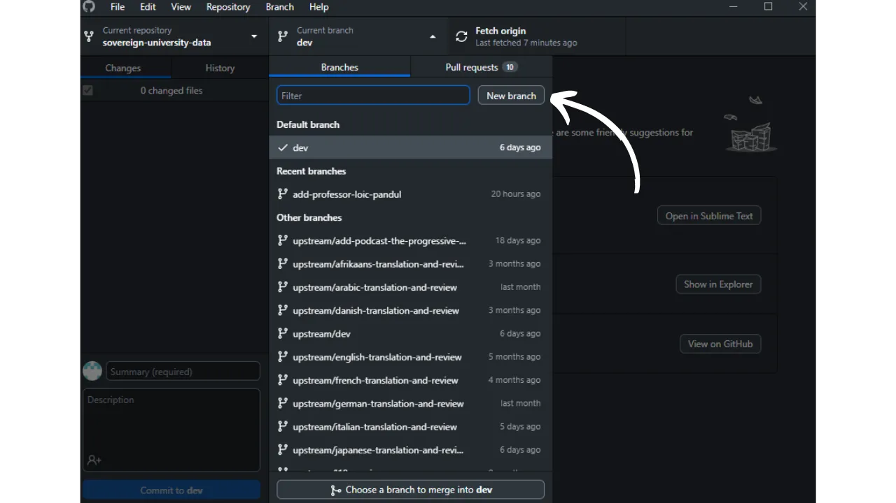

Antes de seguir este tutorial sobre como adicionar um novo tutorial, deve ter completado alguns passos preliminares. Se ainda não o fez, convido-o a consultar primeiro este tutorial introdutório e depois a voltar aqui:

https://planb.network/tutorials/others/contribution/write-tutorials-4d142a6a-9127-4ffb-9e0a-5aba29f169e2
Já o fez:


- Escolha o tema do seu tutorial;
- Contactou a equipa do Plano ₿ Network através do [grupo Telegram] (https://t.me/PlanBNetwork_ContentBuilder) ou paolo@planb.network;
- Escolha as suas ferramentas de contribuição.

Neste tutorial, veremos como adicionar seu tutorial no Plan ₿ Network configurando seu ambiente local com GitHub Desktop. Se você já domina o Git, este tutorial muito detalhado pode não ser necessário para você. Prefiro recomendar a consulta deste outro tutorial onde apenas apresento as principais diretrizes, sem orientações detalhadas passo a passo:


- Utilizadores experientes**:

https://planb.network/tutorials/others/contribution/write-tutorials-git-expert-0ce1e490-c28f-4c51-b7e0-9a6ac9728410
Se preferir não configurar o seu ambiente local, siga este outro tutorial concebido para principiantes, onde fazemos as alterações diretamente através da interface Web do GitHub:


- Iniciantes (interface web)**:

https://planb.network/tutorials/others/contribution/write-tutorials-github-web-beginner-e64f8fed-4c0b-4225-9ebb-7fc5f1c01a79
## Pré-requisitos

Software necessário para seguir este tutorial:


- [GitHub Desktop](https://desktop.github.com/);
- Um editor de ficheiros markdown como o [Obsidian](https://obsidian.md/);
- Um editor de código ([VSC](https://code.visualstudio.com/) ou [Sublime Text](https://www.sublimetext.com/)).


Pré-requisitos antes de iniciar o tutorial:


- Ter uma [conta GitHub](https://github.com/signup);
- Ter uma bifurcação do repositório de fontes do [Plano ₿ Rede] (https://github.com/PlanB-Network/bitcoin-educational-content);
- Ter [um perfil de professor no Plano ₿ Rede](https://planb.network/professors) (apenas se estiver a propor um tutorial completo).

Se precisar de ajuda para obter estes pré-requisitos, os meus outros tutoriais ajudá-lo-ão:

https://planb.network/tutorials/others/contribution/basics-of-github-471f7f00-8b5a-4b63-abb1-f1528b032bbb
Assim que tudo estiver no lugar e o seu ambiente local estiver devidamente configurado com o seu próprio fork do Plan ₿ Network, pode começar a adicionar o tutorial.


## 1 - Criar uma nova sucursal

Abra o seu navegador e vá para a página da sua bifurcação do repositório Plan ₿ Network. Esta é a bifurcação que você estabeleceu no GitHub. O URL da sua bifurcação deve ser parecido com: `https://github.com/[your-username]/bitcoin-educational-content`:


Certifique-se de que está no ramo principal `dev` e clique no botão `Sync fork`. Se a sua bifurcação não estiver actualizada, o GitHub irá oferecer-se para atualizar o seu ramo. Proceda com essa atualização. Se, pelo contrário, o seu ramo já estiver atualizado, o GitHub irá informá-lo:


Abra o software GitHub Desktop e certifique-se de que a sua bifurcação está corretamente selecionada no canto superior esquerdo da janela:


Clique no botão `Fetch origin`. Se o seu repositório local já estiver atualizado, o GitHub Desktop não irá sugerir nenhuma ação adicional. Caso contrário, a opção `Pull origin` aparecerá. Clique neste botão para atualizar seu repositório local:


Verifique se você está realmente no ramo principal `dev`:


Clique neste ramo e, em seguida, clique no botão `Novo ramo`:



Certifique-se de que o novo ramo é baseado no repositório de origem, nomeadamente `PlanB-Network/bitcoin-educational-content`.

Dê um nome ao seu ramo de forma a que o título seja claro quanto ao seu objetivo, utilizando travessões para separar cada palavra. Por exemplo, digamos que o nosso objetivo é escrever um tutorial sobre a utilização do software Sparrow Wallet. Neste caso, o ramo de trabalho dedicado a escrever este tutorial poderia ser nomeado: `tuto-sparrow-wallet-loic`. Uma vez introduzido o nome apropriado, clique em `Criar ramo` para confirmar a criação do ramo:


Agora clique no botão `Publish branch` para salvar seu novo branch de trabalho no seu fork online no GitHub:


Agora, no GitHub Desktop, deverá encontrar-se no seu novo ramo. Isso significa que todas as alterações feitas localmente no seu computador serão salvas exclusivamente nesse branch específico. Além disso, enquanto este ramo permanecer selecionado no GitHub Desktop, os arquivos visíveis localmente na sua máquina correspondem aos deste ramo (`tuto-sparrow-wallet-loic`), e não aos do ramo principal (`dev`).


Para cada novo artigo que pretenda publicar, terá de criar um novo ramo a partir de `dev`. Um ramo no Git é uma versão paralela do projeto, que lhe permite fazer alterações sem afetar o ramo principal, até que o trabalho esteja pronto para ser fundido.

## 2 - Adicionar os ficheiros do tutorial

Agora que o ramo de trabalho está criado, é altura de integrar o seu novo tutorial. Tem duas opções: utilizar o meu script Python, que automatiza a criação dos documentos necessários, ou criar manualmente cada ficheiro. Vamos ver os passos a seguir para cada opção.

### Com o meu script Python

É necessário instalar no seu computador:


- Python 3.8 ou superior.

Para utilizar o script, navegue para a pasta onde está armazenado. O script está localizado no repositório de dados Plan ₿ Network no caminho: `bitcoin-educational-content/scripts/tutorial-related/data-creator`.

Uma vez na pasta, instale as dependências:

```
pip install -r requirements.txt
```

Em seguida, inicie o software com o comando:

```
python3 main.py
```

Será aberta uma interface gráfica do utilizador (GUI). Na primeira vez, terá de introduzir todas as informações necessárias, mas nas utilizações subsequentes, o script lembrar-se-á das suas informações pessoais, pelo que não terá de as introduzir novamente.


Comece por introduzir o caminho local para a pasta `/tutorials` no seu repositório clonado (`.../bitcoin-educational-content/tutorials/`). Pode introduzi-lo manualmente ou clicar no botão "Browse" para navegar usando o seu explorador de ficheiros.


Selecione a língua em que vai escrever o seu tutorial.


No campo "ID do GitHub do contribuidor", introduza o seu nome de utilizador do GitHub.


No campo "ID do professor PBN", introduza o seu identificador utilizando palavras da lista BIP39, tal como aparece no [seu perfil de professor] (https://github.com/PlanB-Network/bitcoin-educational-content/tree/dev/professors).


Se ainda não tem um perfil de professor, consulte este tutorial:

https://planb.network/tutorials/others/contribution/create-teacher-profile-8ba9ba49-8fac-437a-a435-c38eebc8f8a4
Em seguida, clique no botão "Novo tutorial".


Escolha uma categoria principal para o seu tutorial. Em seguida, selecione uma subcategoria relevante com base na categoria principal escolhida.


Determinar o nível de dificuldade do tutorial.


Escolha um nome para o diretório criado especificamente para o seu tutorial. O nome dessa pasta deve refletir o software abordado no tutorial, usando hífens para separar as palavras. Por exemplo, a pasta pode ser chamada de `red-wallet`:


O `project_id` é o UUID da empresa ou organização por detrás da ferramenta abordada no tutorial, disponível [na lista de projectos] (https://github.com/PlanB-Network/bitcoin-educational-content/tree/dev/resources/projects). Por exemplo, para um tutorial sobre a Sparrow Wallet, pode encontrar o seu `project_id` no ficheiro: `bitcoin-educational-content/resources/projects/sparrow/project.yml`. Esta informação é adicionada ao arquivo YAML do seu tutorial porque o Plan ₿ Network mantém um banco de dados de empresas e organizações ativas em Bitcoin ou projetos relacionados. Ao adicionar o `project_id` associado, você vincula seu conteúdo à entidade relevante.

***Atualização:*** Na nova versão do script, já não é necessário introduzir manualmente o `project_id`. Foi adicionada uma função de pesquisa para encontrar o projeto pelo nome e obter automaticamente o `project_id` correspondente. Escreva o início do nome do projeto no campo "Nome do projeto" para o procurar e, em seguida, selecione a empresa pretendida no menu pendente. O `project_id` será automaticamente preenchido no campo abaixo. Também pode introduzi-lo manualmente, se necessário.


Para as etiquetas, selecione 2 ou 3 palavras-chave relevantes relacionadas com o conteúdo do seu tutorial, escolhendo exclusivamente da [lista de etiquetas Plano ₿ Rede] (https://github.com/PlanB-Network/bitcoin-educational-content/blob/dev/docs/50-planb-tags.md). O software também fornece uma função de pesquisa de palavras-chave com uma lista pendente.


Quando todas as informações tiverem sido introduzidas e verificadas, clique em "Criar tutorial" para confirmar a criação dos seus ficheiros de tutorial. Isto irá gerar localmente a sua pasta de tutorial e todos os ficheiros necessários na categoria selecionada.


Pode agora saltar a subsecção "Sem o meu script Python", bem como o passo 3, "Preencher o ficheiro YAML", uma vez que o script já completou estas acções por si. Avance diretamente para o passo 4 e comece a escrever o seu tutorial.

Para mais informações sobre este script Python, pode também consultar o [README](https://github.com/PlanB-Network/bitcoin-educational-content/blob/dev/scripts/tutorial-related/new-tutorial-creation/README.md).

### Sem o meu script Python

Abra seu gerenciador de arquivos e navegue até a pasta `bitcoin-educational-content`, que representa o clone local do seu repositório. Normalmente, deve encontrá-la em `Documents\GitHub\bitcoin-educational-content`.

Dentro deste diretório, terá de localizar a subpasta adequada para colocar o seu tutorial. A organização das pastas reflecte as diferentes secções do site da Plan ₿ Network. No nosso exemplo, como queremos adicionar um tutorial sobre a Sparrow Wallet, devemos navegar para o seguinte caminho: `bitcoin-educational-content\tutorials\wallet`, que corresponde à secção `WALLET` do site:


Dentro da pasta `wallet`, é necessário criar um novo diretório especificamente dedicado ao seu tutorial. O nome dessa pasta deve evocar o software abordado no tutorial, certificando-se de conectar as palavras com traços. No meu exemplo, a pasta terá o título `sparrow-wallet`:


Nesta nova subpasta dedicada ao seu tutorial, é necessário adicionar vários elementos:


- Crie uma pasta `assets`, destinada a receber todas as ilustrações necessárias para o seu tutorial;
- Dentro desta pasta `assets`, é necessário criar uma subpasta nomeada de acordo com o código do idioma original do tutorial. Por exemplo, se o tutorial está escrito em inglês, esta subpasta deve ser nomeada `en`. Coloque aí todos os elementos visuais do tutorial (diagramas, imagens, capturas de ecrã, etc.).
- Um arquivo `tutorial.yml` deve ser criado para registrar os detalhes relacionados ao seu tutorial;
- Deve ser criado um ficheiro de formato markdown para escrever o conteúdo real do seu tutorial. Este ficheiro deve ser intitulado de acordo com o código da língua em que foi escrito. Por exemplo, para um tutorial escrito em francês, o ficheiro deve chamar-se `fr.md`.


Para resumir, eis a hierarquia dos ficheiros a criar:

```
bitcoin-educational-content/
└── tutorials/
└── wallet/ (to be modified with the correct category)
└── sparrow-wallet/ (to be modified with the name of the tutorial)
├── assets/
│   ├── en/ (to be modified according to the appropriate language code)
├── tutorial.yml
└── en.md (to be modified according to the appropriate language code)
```

## 3 - Preencher o ficheiro YAML

Preencha o ficheiro `tutorial.yml` copiando o seguinte modelo:

```
id:
project_id:
tags:
-
-
-
category:
level:
credits:
professor:
# Proofreading metadata
original_language:
proofreading:
- language:
last_contribution_date:
urgency:
contributors_id:
-
reward:
```

Eis os pormenores dos campos obrigatórios:


- id**: Um UUID (_Universally Unique Identifier_) para identificar exclusivamente o tutorial. Pode gerá-lo com [uma ferramenta em linha] (https://www.uuidgenerator.net/version4). O único requisito é que este UUID seja aleatório para evitar conflitos com outro UUID na plataforma;
- project_id**: O UUID da empresa ou organização por detrás da ferramenta apresentada no tutorial [da lista de projectos] (https://github.com/PlanB-Network/bitcoin-educational-content/tree/dev/resources/projects). Por exemplo, se estiver a criar um tutorial sobre o software Sparrow Wallet, pode encontrar este `project_id` no seguinte ficheiro: `bitcoin-educational-content/resources/projects/sparrow/project.yml`. Esta informação é adicionada ao arquivo YAML do seu tutorial porque o Plan ₿ Network mantém um banco de dados de todas as empresas e organizações que operam em Bitcoin ou projetos relacionados. Ao adicionar o `project_id` da entidade relacionada ao seu tutorial, você cria um link entre os dois elementos;
- tags**: 2 ou 3 palavras-chave relevantes relacionadas com o conteúdo do tutorial, escolhidas exclusivamente [da lista de etiquetas do Plano ₿ Rede] (https://github.com/PlanB-Network/bitcoin-educational-content/blob/dev/docs/50-planb-tags.md);
- categoria**: A subcategoria correspondente ao conteúdo do tutorial, de acordo com a estrutura do site da Rede Plan ₿ (por exemplo, para carteiras: `desktop`, `hardware`, `mobile`, `backup`);
- level**: O nível de dificuldade do tutorial, entre:
    - `iniciante`
    - `intermédio`
    - `avançado`
    - "especialista
- professor**: O seu `contributor_id` (palavras BIP39) tal como aparece no [perfil do professor] (https://github.com/PlanB-Network/bitcoin-educational-content/tree/dev/professors);
- original_language**: A língua original do tutorial (por exemplo, `fr`, `en`, etc.);
- revisão**: Informações sobre o processo de revisão. Preencher a primeira parte, uma vez que a revisão do seu próprio tutorial conta como uma primeira validação:
    - língua**: Código da língua da revisão de provas (por exemplo, `fr`, `en`, etc.).
    - last_contribution_date**: A data de hoje.
    - urgência**: Deixar em branco.
    - contributors_id**: O seu ID do GitHub.
    - recompensa**: Deixar em branco.

Para mais informações sobre o identificador do professor, consulte o tutorial correspondente:

https://planb.network/tutorials/others/contribution/create-teacher-profile-8ba9ba49-8fac-437a-a435-c38eebc8f8a4
Aqui está um exemplo de um arquivo `tutorial.yml` completo para um tutorial sobre a carteira Blockstream Green:

```
id: e84edaa9-fb65-48c1-a357-8a5f27996143
project_id: 3b2f45e6-d612-412c-95ba-cf65b49aa5b8
tags:
- wallets
- software
- keys
category: mobile
level: beginner
credits:
professor: pretty-private
# Proofreading metadata
original_language: fr
proofreading:
- language: fr
last_contribution_date: 2024-11-20
urgency: 1
contributors_id:
- LoicPandul
reward: 0
```

Quando tiver terminado de modificar seu arquivo `tutorial.yml`, salve seu documento clicando em `Arquivo > Salvar`:


Pode agora fechar o seu editor de código.

## 4 - Preencher o ficheiro Markdown

Agora, você pode abrir o arquivo que vai hospedar o seu tutorial, nomeado com o código da sua língua, como `fr.md`. Vá para a Obsidian, no lado esquerdo da janela, percorra a árvore de pastas até encontrar a pasta do seu tutorial e o arquivo que está procurando:


Clique no ficheiro para o abrir:


Vamos começar por preencher a secção `Propriedades` no topo do documento.


Adicionar manualmente e preencher o seguinte bloco de código:

```
---
name: [Title]
description: [Description]
---
```


Preencha o nome do seu tutorial e uma breve descrição do mesmo:


Em seguida, adicione o caminho da imagem de capa no início do seu tutorial. Para fazer isso, observe:

```

```

Esta sintaxe será útil sempre que for necessário adicionar uma imagem ao seu tutorial. O ponto de exclamação indica que se trata de uma imagem, com o texto alternativo (alt) especificado entre parênteses. O caminho para a imagem é indicado entre os parênteses:


## 5 - Adicionar o logótipo e a capa

Dentro da pasta `assets`, deve adicionar um ficheiro com o nome `logo.webp`, que servirá de miniatura para o seu artigo. Esta imagem deve estar no formato `.webp` e deve respeitar uma dimensão quadrada para se harmonizar com a interface do utilizador. É livre de escolher o logótipo do software abordado no tutorial ou qualquer outra imagem relevante, desde que esteja livre de direitos. Para além disso, adicione também uma imagem com o título `cover.webp` no mesmo local. Esta imagem será exibida no topo do seu tutorial. Certifique-se de que esta imagem, tal como o logótipo, respeita os direitos de utilização e é adequada ao contexto do seu tutorial:

## 6 - Escrevendo o tutorial e adicionando recursos visuais

Continue a escrever o seu tutorial, redigindo o seu conteúdo. Quando quiser integrar um subtítulo, aplique a formatação markdown apropriada, prefixando o texto com `##`:


A subpasta de idiomas na pasta `assets` é utilizada para armazenar diagramas e imagens que acompanharão o seu tutorial. Tanto quanto possível, evite incluir texto nas suas imagens para tornar o seu conteúdo acessível a um público internacional. Naturalmente, o software apresentado conterá texto, mas se adicionar diagramas ou indicações adicionais nas imagens de ecrã do software, faça-o sem texto ou, se for indispensável, utilize o inglês.


Para nomear suas imagens, basta usar números correspondentes à ordem de aparecimento no tutorial, formatados com dois dígitos (ou três dígitos se o tutorial contiver mais de 99 imagens). Por exemplo, nomeie a primeira imagem como `01.webp`, a segunda como `02.webp`, e assim por diante.

As suas imagens devem estar exclusivamente no formato `.webp`. Se necessário, pode utilizar o [meu software de conversão de imagens] (https://github.com/LoicPandul/ImagesConverter).


Para inserir um diagrama no seu documento, utilize o seguinte comando Markdown, certificando-se de que especifica o texto alternativo adequado, bem como o caminho correto da imagem:

```

```

O ponto de exclamação no início indica que se trata de uma imagem. O texto alternativo, que ajuda na acessibilidade e SEO, é colocado entre parêntesis. Por fim, o caminho para a imagem é indicado entre parênteses.

Se pretender criar os seus próprios diagramas, certifique-se de que segue a carta gráfica do Plano ₿ Rede para garantir a coerência visual:


- Tipo de letra**: Utilizar [Rubik](https://fonts.google.com/specimen/Rubik);
- Cores**:
 - Laranja: #FF5C00
 - Preto: #000000
 - Branco: #FFFFFF

**É imperativo que todos os elementos visuais integrados nos seus tutoriais estejam isentos de direitos ou respeitem a licença do ficheiro de origem**. Além disso, todos os diagramas publicados na Plan ₿ Network são disponibilizados ao abrigo da licença CC-BY-SA, da mesma forma que o texto.

**-> Dica:** Ao partilhar ficheiros publicamente, como imagens, é importante remover quaisquer metadados desnecessários. Estes podem conter informações sensíveis, como dados de localização, datas de criação ou detalhes sobre o autor. Para proteger a sua privacidade, é aconselhável eliminar estes metadados. Para simplificar este processo, pode utilizar ferramentas especializadas como o [Exif Cleaner] (https://exifcleaner.com/), que permite a limpeza dos metadados de um documento através de um simples arrastar e largar.

## 7 - Guardar e enviar o tutorial

Quando tiver terminado de escrever o seu tutorial na língua da sua escolha, o próximo passo é submeter um **Pull Request**. O administrador encarregar-se-á de adicionar as traduções em falta do seu tutorial, graças ao nosso método de tradução automática com revisão humana.

Para prosseguir com o Pull Request, abra o software GitHub Desktop. O software deve detetar automaticamente as alterações que fez localmente no seu ramo em comparação com o repositório original. Antes de continuar, verifique cuidadosamente no lado esquerdo da interface se estas alterações correspondem ao que esperava:


Adicione um título para o seu commit e, em seguida, clique no botão azul `Commit to [your branch]` para validar estas alterações:


Um commit é uma gravação das alterações efectuadas no ramo, acompanhada de uma mensagem descritiva, permitindo seguir a evolução de um projeto ao longo do tempo. É uma espécie de ponto de controlo intermédio.

Em seguida, clique no botão `Push origin`. Isso enviará seu commit para sua bifurcação:


Se você não terminou seu tutorial, você pode voltar a ele mais tarde e fazer novos commits. Se você completou suas alterações para este ramo, clique agora no botão `Preview Pull Request`:


Pode verificar uma última vez se as suas modificações estão corretas e, em seguida, clicar no botão `Create pull request`:


Um Pull Request é um pedido feito para integrar as alterações do seu ramo no ramo principal do repositório Plan ₿ Network, o que permite a revisão e discussão das alterações antes da sua fusão.

Será automaticamente redireccionado para o seu navegador no GitHub para a página de preparação do seu Pull Request:


Indique um título que resuma brevemente as alterações que deseja mesclar com o repositório de origem. Adicione um breve comentário descrevendo essas alterações (se você tiver um número de problema associado à criação do seu tutorial, lembre-se de anotar no comentário `Fecha #{número de problema}`) e, em seguida, clique no botão verde `Criar pull request` para confirmar a solicitação de merge:


O seu PR ficará então visível no separador `Pull Request` do repositório principal do Plano ₿ Rede. Só tem de esperar que um administrador o contacte para confirmar a fusão da sua contribuição ou para solicitar alterações adicionais.


Após o seu PR ter sido mesclado com o ramo principal, é recomendado excluir seu ramo de trabalho (`tuto-sparrow-wallet`) para manter um histórico limpo em sua bifurcação. O GitHub irá oferecer-lhe automaticamente esta opção na sua página PR:


No software GitHub Desktop, você pode voltar para o branch principal da sua bifurcação (`dev`).


Se pretender alterar a sua contribuição depois de já ter apresentado o seu RP, o procedimento depende do estado atual do seu RP:


- Se o seu PR ainda estiver aberto e ainda não tiver sido mesclado, faça as alterações localmente enquanto permanece no mesmo ramo. Quando as modificações estiverem finalizadas, use o botão `Push origin` para adicionar um novo commit ao seu PR ainda aberto;
- Se o seu PR já tiver sido mesclado com o ramo principal, será necessário iniciar o processo novamente criando um novo ramo e, em seguida, enviando um novo PR. Certifique-se de que o seu repositório local está sincronizado com o repositório de origem Plan ₿ Network antes de continuar.

Se tiveres dificuldades técnicas para enviar o teu tutorial, não hesites em pedir ajuda no [nosso grupo de Telegrama dedicado às contribuições] (https://t.me/PlanBNetwork_ContentBuilder). Obrigado!

