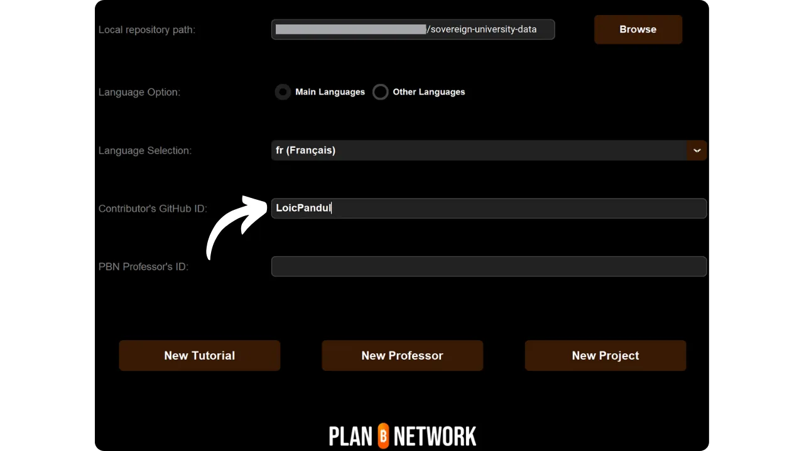

Antes de seguir este tutorial sobre como adicionar um novo tutorial, é necessário ter concluído algumas etapas preliminares. Se ainda não o fez, consulte primeiro este tutorial introdutório e depois volte aqui:

https://planb.network/tutorials/others/contribution/write-tutorials-4d142a6a-9127-4ffb-9e0a-5aba29f169e2

Já tem :


- Escolha um tema para o seu tutorial;
- Contactou a equipa do Plano ₿ Network através do [grupo Telegram] (https://t.me/PlanBNetwork_ContentBuilder) ou paolo@planb.network ;
- Escolha as suas ferramentas de contribuição.

Neste tutorial, veremos como adicionar seu tutorial ao Plan ₿ Network configurando seu ambiente local com GitHub Desktop. Se você já domina o Git, este tutorial muito detalhado pode não ser necessário para você. Em vez disso, recomendo que você dê uma olhada neste outro tutorial, onde apresento apenas as diretrizes gerais, sem orientações detalhadas passo a passo:


- Utilizadores experientes** :

https://planb.network/tutorials/others/contribution/write-tutorials-git-expert-0ce1e490-c28f-4c51-b7e0-9a6ac9728410

Se preferir não configurar o seu ambiente local, siga este outro tutorial concebido para principiantes, onde efectuamos as alterações diretamente através da interface Web do GitHub :


- Iniciantes (interface web)** :

https://planb.network/tutorials/others/contribution/write-tutorials-github-web-beginner-e64f8fed-4c0b-4225-9ebb-7fc5f1c01a79

## Pré-requisitos

Software necessário para seguir este tutorial :


- [GitHub Desktop](https://desktop.github.com/);
- Um editor de ficheiros markdown como o [Obsidian](https://obsidian.md/);
- Um editor de código ([VSC](https://code.visualstudio.com/) ou [Sublime Text](https://www.sublimetext.com/)).


Pré-requisitos antes de iniciar o tutorial :


- Ter uma [conta GitHub](https://github.com/signup);
- Ter uma bifurcação do repositório de fontes do [Plano ₿ Rede] (https://github.com/PlanB-Network/bitcoin-educational-content);
- Ter [um perfil de professor no Plan ₿ Network](https://planb.network/professors) (apenas se oferecer uma tutoria completa).

Se precisar de ajuda para obter estes pré-requisitos, os meus outros tutoriais irão ajudá-lo:


https://planb.network/tutorials/others/contribution/create-github-account-a75fc39d-f0d0-44dc-9cd5-cd94aee0c07c

https://planb.network/tutorials/others/contribution/github-desktop-work-environment-5862003b-9d76-47f5-a9e0-5ec74256a8ba

https://planb.network/tutorials/others/contribution/create-teacher-profile-8ba9ba49-8fac-437a-a435-c38eebc8f8a4

Quando tudo estiver no lugar e o seu ambiente local estiver configurado com o seu próprio fork Plan ₿ Network, pode começar a adicionar o tutorial.

## 1 - Criar uma nova sucursal

Abra o seu navegador e navegue para a sua página de bifurcação no repositório Plan ₿ Network. Esta é a bifurcação que você estabeleceu no GitHub. O URL da sua bifurcação deve ter a seguinte aparência: `https://github.com/[your-username]/bitcoin-educational-content` :


Certifique-se de que está no ramo principal `dev` e, em seguida, clique no botão `Sync fork`. Se a sua bifurcação não estiver actualizada, o GitHub irá pedir-lhe para atualizar o seu ramo. Prossiga com essa atualização. Se, por outro lado, seu branch já estiver atualizado, o GitHub irá informá-lo:


Abra o GitHub Desktop e certifique-se de que a sua bifurcação está corretamente selecionada no canto superior esquerdo da janela:


Clique no botão `Fetch origin`. Se o seu repositório local já estiver atualizado, o GitHub Desktop não irá sugerir nenhuma ação adicional. Caso contrário, a opção `Pull origin` aparecerá. Clique neste botão para atualizar seu repositório local:


Verifique se você está no ramo principal `dev`:


Clique neste ramo e, em seguida, clique no botão `Novo ramo`:


Certifique-se de que o novo ramo é baseado no repositório de origem, ou seja, `PlanB-Network/bitcoin-educational-content`.

Dê um nome ao seu ramo de modo a que o título seja claro quanto ao seu objetivo, utilizando travessões para separar cada palavra. Por exemplo, digamos que o nosso objetivo é escrever um tutorial sobre como usar a Sparrow Wallet. Neste caso, o ramo de trabalho dedicado a escrever este tutorial poderia ser nomeado: `tuto-sparrow-wallet-loic`. Depois de ter introduzido o nome apropriado, clique em `Criar ramo` para confirmar a criação do ramo:


Agora clique no botão `Publish branch` para salvar seu novo ramo de trabalho em seu fork online no GitHub :


Agora, no GitHub Desktop, você deve estar no seu novo ramo. Isso significa que todas as alterações que você fizer localmente no seu computador serão salvas exclusivamente neste branch específico. Além disso, enquanto este branch permanecer selecionado no GitHub Desktop, os arquivos visíveis localmente na sua máquina correspondem aos deste branch (`tuto-sparrow-wallet-loic`), e não aos do branch principal (`dev`).


Para cada novo artigo que pretende publicar, terá de criar um novo ramo a partir de `dev`. Um ramo no Git é uma versão paralela do projeto, permitindo-lhe fazer alterações sem afetar o ramo principal, até que o trabalho esteja pronto para ser fundido.

## 2 - Adicionar ficheiros de tutorial

Agora que o ramo de trabalho foi criado, está na altura de integrar o seu novo tutorial. Tem duas opções: utilizar o meu script Python, que automatiza a criação dos documentos necessários, ou criar cada ficheiro manualmente. Vejamos os passos a seguir para cada opção.

### Com o meu script Python

É necessário instalar o :


- Python 3.8 ou superior ;
- Dependências necessárias para o script. Executar :

```bash
pip install customtkinter appdirs
````
Pour utiliser le script, rendez-vous dans le dossier où il est stocké. Le script se trouve dans le dépôt de data de Plan ₿ Network sous le chemin : `bitcoin-educational-content/scripts/tutorial-related/new-tutorial-creation/`.
Une fois dans le dossier, exécutez la commande :
```

python novo-tutorial-criação.py

```
Une interface graphique (GUI) va s'ouvrir. La première fois, vous devrez entrer toutes les informations nécessaires, mais lors des utilisations ultérieures du script, vos informations personnelles seront mémorisées, ce qui vous évite de devoir les saisir de nouveau.

Commencez par indiquer le chemin local menant au dossier `/tutorials` sur votre clone du dépôt (`.../bitcoin-educational-content/tutorials/`). Vous pouvez le noter manuellement ou cliquer sur le bouton "Browse" pour naviguer via votre explorateur de fichiers.

Sélectionnez la langue dans laquelle vous rédigerez votre tutoriel.

Choisissez une catégorie principale pour votre tutoriel.

Ensuite, sélectionnez une sous-catégorie appropriée, en fonction de la catégorie principale que vous avez choisie.

Déterminez un niveau de difficulté pour le tutoriel.

Choisissez le nom du répertoire spécialement créé pour votre tutoriel. Le nom de ce dossier devrait refléter le logiciel abordé dans le tutoriel, en utilisant des tirets pour relier les mots. Par exemple, le dossier pourrait s'appeler `red-wallet` :

Le `project_id` est l'UUID de l'entreprise ou de l'organisation derrière l'outil présenté dans le tutoriel, disponible [dans la liste des projets](https://github.com/PlanB-Network/bitcoin-educational-content/tree/dev/resources/projects). Par exemple, pour un tutoriel sur le logiciel Sparrow Wallet, vous trouverez ce `project_id` dans le fichier : `bitcoin-educational-content/resources/projects/sparrow/project.yml`. Cette information est ajoutée au fichier YAML de votre tutoriel car Plan ₿ Network maintient une base de données des entreprises et organisations actives sur Bitcoin ou des projets connexes. En ajoutant le `project_id` associé à votre tutoriel, vous créez un lien entre votre contenu et l'entité concernée.
***Mise à jour :*** Dans la nouvelle version du script, vous n'avez plus besoin de saisir manuellement le `project_id`. Une fonction de recherche a été ajoutée pour trouver le projet par son nom et récupérer automatiquement le `project_id` correspondant. Tapez le début du nom du projet dans la case "Project name" pour le rechercher, puis sélectionnez l'entreprise souhaitée dans le menu déroulant. Le `project_id` sera automatiquement renseigné dans la case en dessous. Vous avez également la possibilité de le noter manuellement si nécessaire.

Pour les tags, sélectionnez 2 ou 3 mots-clés pertinents en relation avec le contenu de votre tutoriel, en les choisissant exclusivement [dans la liste des tags de Plan ₿ Network](https://github.com/PlanB-Network/bitcoin-educational-content/blob/dev/docs/50-planb-tags.md).

Dans la case "Contributor's GitHub ID", inscrivez votre identifiant GitHub.

Pour la case "PBN professor's ID", saisissez votre identifiant en utilisant les mots de la liste BIP39, tel qu'il apparaît sur [votre profil professeur](https://github.com/PlanB-Network/bitcoin-educational-content/tree/dev/professors).

Pour plus de détails sur votre identifiant de professeur, veuillez consulter le tutoriel suivant :
https://planb.network/tutorials/others/contribution/create-teacher-profile-8ba9ba49-8fac-437a-a435-c38eebc8f8a4

Une fois toutes les informations saisies et vérifiées, cliquez sur "Create Tutorial" pour valider la création des fichiers de votre tutoriel. Cela générera en local le dossier de votre tutoriel et tous les fichiers nécessaires dans le dossier de la catégorie sélectionnée.

Vous pouvez maintenant passer outre la sous-partie "Sans mon script Python", ainsi que l'étape 3 "Remplir le fichier YAML", car le script a déjà effectué ces actions automatiquement pour vous. Passez directement à l'étape 4 et à la rédaction de votre tutoriel.
Pour plus d'informations sur ce script Python, vous pouvez également [consulter son README](https://github.com/PlanB-Network/bitcoin-educational-content/blob/dev/scripts/tutorial-related/new-tutorial-creation/README.md).
### Sans mon script Python
Ouvrez votre gestionnaire de fichiers et dirigez-vous vers le dossier `bitcoin-educational-content`, qui représente le clone local de votre dépôt. Vous devriez normalement le trouver sous `Documents\GitHub\bitcoin-educational-content`.
Au sein de ce répertoire, il sera nécessaire de localiser le sous-dossier adéquat pour le placement de votre tutoriel. L'organisation des dossiers reflète les différentes sections du site web Plan ₿ Network. Dans notre exemple, puisque nous souhaitons ajouter un tutoriel sur Sparrow Wallet, il convient de se rendre dans le chemin suivant : `bitcoin-educational-content\tutorials\wallet` qui correspond à la section `WALLET` sur le site web :

Au sein du dossier `wallet`, il faut créer un nouveau répertoire spécifiquement dédié à votre tutoriel. Le nom de ce dossier doit évoquer le logiciel traité dans le tutoriel, en veillant à relier les mots par des tirets. Pour mon exemple, le dossier sera intitulé `sparrow-wallet` :

Dans ce nouveau sous-dossier dédié à votre tutoriel, il faut ajouter plusieurs éléments :
- Créez un dossier `assets`, destiné à recevoir toutes les illustrations nécessaires à votre tutoriel ;
- Au sein de ce dossier `assets`, il faut créer un sous-dossier nommé selon le code de langue originale du tutoriel. Par exemple, si le tutoriel est rédigé en anglais, ce sous-dossier doit être nommé `en`. Placez-y tous les visuels du tutoriel (schémas, images, captures d’écran, etc.).
- Un fichier `tutorial.yml` doit être créé pour y consigner les détails relatifs à votre tutoriel ;
- Un fichier en format markdown est à créer pour y rédiger le contenu effectif de votre tutoriel. Ce fichier doit être intitulé selon le code de la langue de rédaction. Par exemple, pour un tutoriel rédigé en français, le fichier devra s'appeler `fr.md`.

Pour résumer, voici la hiérarchie des fichiers à créer :
```

bitcoin-educational-content/

└── tutoriais/

└── carteira/ (mudar para a categoria correta)

└── pardal-baleia/ (modificar com o nome do tuto)

├── activos/

│ ├── en/ (mudar para o código de língua adequado)

├── tutorial.yml

└── fr.md (a ser modificado de acordo com o código da língua apropriada)

```
## 3 - Remplir le fichier YAML
Remplissez le fichier `tutorial.yml` en copiant le modèle suivant :
```

id:

project_id:

tags:

-

-

-

categoria:

nível:

créditos:

professor:

# Revisão de metadados

língua_original:

revisão de provas:


  - língua:

last_contribution_date:

urgência:

contribuintes_id:

-

recompensa:

````

Eis os campos obrigatórios:


- id**: Um UUID (_Universally Unique Identifier_) para identificar exclusivamente o tutorial. Pode gerá-lo com [uma ferramenta em linha] (https://www.uuidgenerator.net/version4). A única restrição é que este UUID deve ser aleatório, de modo a não entrar em conflito com outro UUID na plataforma;
- project_id** : O UUID da empresa ou organização por detrás da ferramenta apresentada no tutorial [da lista de projectos] (https://github.com/PlanB-Network/bitcoin-educational-content/tree/dev/resources/projects). Por exemplo, se estiver a fazer um tutorial sobre o software Sparrow Wallet, pode encontrar este `project_id` no seguinte ficheiro: `bitcoin-educational-content/resources/projects/sparrow/project.yml`. Esta informação é adicionada no arquivo YAML do seu tutorial porque o Plan ₿ Network mantém um banco de dados de todas as empresas e organizações que operam em Bitcoin ou projetos relacionados. Ao adicionar o `project_id` da entidade vinculada ao seu tutorial, você cria um link entre os dois elementos;
- tags**: 2 ou 3 palavras-chave relevantes relacionadas com o conteúdo do tutorial, escolhidas exclusivamente [da lista de etiquetas do Plano ₿ Rede] (https://github.com/PlanB-Network/bitcoin-educational-content/blob/dev/docs/50-planb-tags.md);
- categoria** : A subcategoria correspondente ao conteúdo do tutorial, de acordo com o Plano ₿ Estrutura da rede (por exemplo, para carteiras: `desktop`, `hardware`, `mobile`, `backup`) ;
- nível** : Nível de dificuldade do tutorial, de :
    - principiante`
    - `intermédio`
    - `avançado`
    - "especialista
- professor**: O seu `contributor_id` (palavras BIP39) tal como aparece no [seu perfil de professor] (https://github.com/PlanB-Network/bitcoin-educational-content/tree/dev/professors);
- original_language** : A língua original do tutorial (por exemplo, `fr`, `en`, etc.) ;
- revisão**: Informações sobre o processo de revisão. Preencha a primeira parte, porque a revisão do seu próprio tutorial conta como uma primeira validação:
    - língua**: Código da língua de revisão (por exemplo, `fr`, `en`, etc.).
    - last_contribution_date**: A data de hoje.
    - urgência** : Deixar em branco.
    - contributors_id** : O seu ID do GitHub.
    - prémio** : Deixar em branco.

Para mais informações sobre o ID do professor, consulte o tutorial correspondente :

https://planb.network/tutorials/others/contribution/create-teacher-profile-8ba9ba49-8fac-437a-a435-c38eebc8f8a4

Aqui está um exemplo de um arquivo `tutorial.yml` concluído para um tutorial sobre a carteira Blockstream Green:

```yaml
id: e84edaa9-fb65-48c1-a357-8a5f27996143
project_id: 3b2f45e6-d612-412c-95ba-cf65b49aa5b8
tags:
- wallets
- software
- keys
category: mobile
level: beginner
credits:
professor: pretty-private
# Proofreading metadata
original_language: fr
proofreading:
- language: fr
last_contribution_date: 2024-11-20
urgency:
contributors_id:
- LoicPandul
reward:
```

Quando terminar de editar o arquivo `tutorial.yml`, salve o documento clicando em `Arquivo > Salvar` :


Pode agora fechar o seu editor de código.

## 4 - Preencher o ficheiro Markdown

Agora pode abrir o seu ficheiro de tutorial, nomeado com o código da sua língua, por exemplo `en.md`. Vá para Obsidian, no lado esquerdo da janela, e desça na árvore de pastas até a pasta do tutorial e o arquivo desejado :


Clique no ficheiro para o abrir:


Vamos começar por preencher a secção `Properties` no topo do documento.


Adicionar manualmente e preencher o seguinte bloco de código:

```markdown
---
name: [Titre]
description: [Description]
---
```


Preencha o nome do seu tutorial e uma breve descrição:


Em seguida, adicione o caminho para a imagem de capa no início do seu tutorial. Para fazer isso, observe :

```markdown

```

Esta sintaxe será útil sempre que precisar de adicionar uma imagem ao seu tutorial. O ponto de exclamação indica uma imagem, cujo texto alternativo (alt) é especificado entre os parêntesis rectos. O caminho para a imagem é indicado entre os parêntesis:


## 5 - Adicionar logótipo e capa

Dentro da pasta `assets`, é necessário adicionar um ficheiro chamado `logo.webp`, que servirá de miniatura para o seu artigo. Esta imagem deve estar no formato `.webp` e ter um tamanho quadrado para combinar com a interface do utilizador. É livre para escolher o logotipo do software abordado no tutorial ou qualquer outra imagem relevante, desde que seja livre de royalties. Para além disso, adicione uma imagem intitulada `cover.webp` no mesmo local. Esta será exibida no topo do seu tutorial. Certifique-se de que esta imagem, tal como o logótipo, respeita os direitos de utilização e é adequada ao contexto do seu tutorial:


## 6 - Escrever o tutorial e adicionar elementos visuais

Continue a escrever o conteúdo do tutorial. Quando quiser incluir um subtítulo, aplique a formatação markdown apropriada, prefixando o texto com `##` :


A subpasta de idiomas na pasta `assets` é utilizada para armazenar os diagramas e imagens que acompanharão o seu tutorial. Na medida do possível, evite incluir texto nas suas imagens para tornar o seu conteúdo acessível a um público internacional. Naturalmente, o software apresentado conterá texto, mas se acrescentar esquemas ou indicações adicionais nas imagens de ecrã do software, faça-o sem texto ou, se for essencial, utilize o inglês.


Para nomear suas imagens, basta usar números correspondentes à ordem de aparecimento no tutorial, formatados com dois dígitos (ou três dígitos se o tutorial contiver mais de 99 imagens). Por exemplo, nomeie a primeira imagem como `01.webp`, a segunda como `02.webp`, e assim por diante.

As suas imagens devem estar apenas no formato `.webp`. Se necessário, pode utilizar o [meu software de conversão de imagens] (https://github.com/LoicPandul/ImagesConverter).


Para inserir um diagrama no seu documento, utilize o seguinte comando em Markdown, tendo o cuidado de especificar o texto alternativo apropriado, bem como o caminho correto da imagem:

```markdown

```

O ponto de exclamação no início indica uma imagem. O texto alternativo, que ajuda na acessibilidade e na referenciação, é colocado entre parêntesis rectos. Finalmente, o caminho para a imagem é indicado entre parêntesis.

Se pretender criar os seus próprios esquemas, certifique-se de que segue as diretrizes gráficas do Plano ₿ Rede para garantir a consistência visual:


- Tipo de letra**: Utilizar [Rubik](https://fonts.google.com/specimen/Rubik);
- Cores** :
 - Laranja: #FF5C00
 - Preto : #000000
 - Branco: #FFFFFF

**É imperativo que todos os elementos visuais integrados nos seus tutoriais estejam isentos de direitos de autor ou respeitem a licença do ficheiro fonte**. Por conseguinte, todos os diagramas publicados na Plan ₿ Network são disponibilizados ao abrigo de uma licença CC-BY-SA, da mesma forma que o texto.

**-> Dica:** Ao partilhar ficheiros em público, como imagens, é importante remover metadados supérfluos. Estes podem conter informações sensíveis, tais como dados de localização, datas de criação e detalhes do autor. Para proteger a sua privacidade, é uma boa ideia remover estes metadados. Para simplificar esta operação, pode utilizar ferramentas especializadas, como o [Exif Cleaner] (https://exifcleaner.com/), que lhe permite limpar os metadados de um documento com um simples arrastar e largar.

## 7 - Guardar e propor o tutorial

Quando tiver terminado de escrever o seu tutorial na língua da sua escolha, o próximo passo é submeter um **Pull Request**. O administrador irá então adicionar as traduções em falta ao seu tutorial, utilizando o nosso método de tradução automática com revisão humana.

Para efetuar um Pull Request, abra o GitHub Desktop. O software deve detetar automaticamente quaisquer alterações que tenha feito localmente no seu ramo para o repositório original. Antes de prosseguir, verifique cuidadosamente no lado esquerdo da interface se essas alterações correspondem ao que esperava:


Adicione um título para o seu commit e, em seguida, clique no botão azul `Commit to [your branch]` para validar estas alterações:


Um commit é um registo das alterações feitas a um ramo, acompanhado por uma mensagem descritiva, que lhe permite acompanhar a evolução de um projeto ao longo do tempo. É uma espécie de ponto de controlo intermédio.

Em seguida, clique no botão `Push origin`. Isso enviará seu commit para sua bifurcação:


Se você não terminou seu tutorial, você pode voltar a ele mais tarde e fazer novos commits. Se você terminou de editar este ramo, clique no botão `Preview Pull Request`:


Pode verificar uma última vez se as suas alterações estão corretas e, em seguida, clicar no botão `Create pull request`:


Um Pull Request é um pedido feito para integrar as alterações do seu ramo no ramo principal do repositório Plan ₿ Network, o que permite a revisão e discussão das alterações antes de serem fundidas.

Será automaticamente redireccionado no seu navegador para GitHub na página de preparação do seu Pull Request :


Insira um título que resuma brevemente as alterações que deseja mesclar com o repositório de origem. Adicione um breve comentário descrevendo essas alterações (se você tiver um número de problema associado à criação do seu tutorial, lembre-se de anotar `Fecha #{número de problema}` como um comentário) e, em seguida, clique no botão verde `Criar pull request` para confirmar a solicitação de merge:


O seu PR ficará então visível no separador `Pull Request` do repositório principal do Plan ₿ Network. Tudo o que tem de fazer agora é esperar que um administrador o contacte para confirmar que a sua contribuição foi incorporada ou para solicitar quaisquer outras modificações.


Depois de mesclar seu PR com o ramo principal, recomendamos excluir seu ramo de trabalho (`tuto-sparrow-wallet`) para manter um histórico limpo em sua bifurcação. O GitHub irá oferecer-lhe esta opção automaticamente na sua página PR:


No GitHub Desktop, você pode voltar para o branch principal da sua bifurcação (`dev`).


Se pretender alterar a sua contribuição depois de já ter apresentado o seu RP, os passos a seguir dependem do estado atual do seu RP:


- Se o seu PR ainda está aberto e ainda não foi fundido, faça as alterações localmente, permanecendo no mesmo ramo. Uma vez que as alterações tenham sido finalizadas, use o botão `Push origin` para adicionar um novo commit ao seu PR ainda aberto;
- No caso de o seu PR já ter sido fundido com o ramo principal, terá de refazer o processo desde o início, criando um novo ramo e, em seguida, submetendo um novo PR. Certifique-se de que o seu repositório local está sincronizado com o repositório de origem do Plan ₿ Network antes de continuar.

Se tiveres dificuldades técnicas para enviar o teu tutorial, não hesites em pedir ajuda no [nosso grupo de Telegrama dedicado às contribuições] (https://t.me/PlanBNetwork_ContentBuilder). Muito obrigado!

