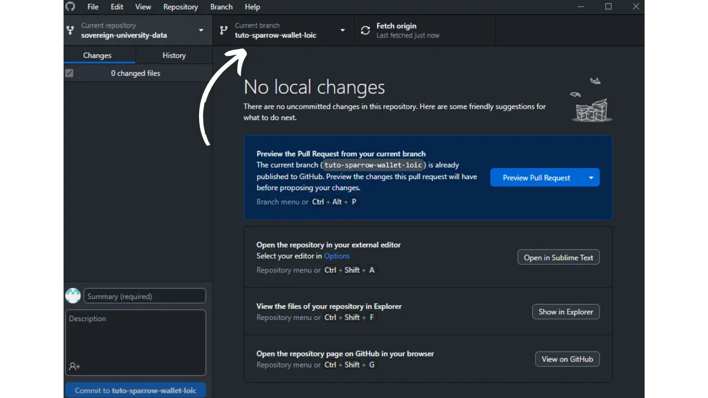

Прежде чем следовать этому руководству по добавлению нового учебника, вам необходимо выполнить несколько предварительных шагов. Если вы еще не сделали этого, ознакомьтесь сначала с этим вводным уроком, а затем вернитесь сюда:

https://planb.network/tutorials/others/contribution/write-tutorials-4d142a6a-9127-4ffb-9e0a-5aba29f169e2

У вас уже есть :


- Выберите тему для своего учебника;
- Свяжитесь с командой Plan ₿ Network через [группу Telegram](https://t.me/PlanBNetwork_ContentBuilder) или paolo@planb.network ;
- Выберите инструменты для внесения средств.

В этом уроке мы рассмотрим, как добавить свой учебник в Plan ₿ Network, настроив локальную среду с помощью GitHub Desktop. Если вы уже освоили Git, этот очень подробный учебник может вам не понадобиться. Вместо этого я рекомендую вам взглянуть на другой учебник, в котором я представляю только общие рекомендации, без подробного пошагового руководства:


- Опытные пользователи** :

https://planb.network/tutorials/others/contribution/write-tutorials-git-expert-0ce1e490-c28f-4c51-b7e0-9a6ac9728410

Если вы предпочитаете не настраивать локальное окружение, следуйте другому руководству, предназначенному для новичков, где мы вносим изменения непосредственно через веб-интерфейс GitHub:


- Новички (веб-интерфейс)** :

https://planb.network/tutorials/others/contribution/write-tutorials-github-web-beginner-e64f8fed-4c0b-4225-9ebb-7fc5f1c01a79

## Пререквизиты

Программное обеспечение, необходимое для выполнения этого руководства :


- [GitHub Desktop](https://desktop.github.com/);
- Редактор файлов в формате markdown, например [Obsidian](https://obsidian.md/);
- Редактор кода ([VSC](https://code.visualstudio.com/) или [Sublime Text](https://www.sublimetext.com/)).


Необходимые условия перед началом обучения :


- Иметь аккаунт [GitHub](https://github.com/signup);
- Сделайте форк репозитория [Plan ₿ Network source repository](https://github.com/PlanB-Network/bitcoin-educational-content);
- Иметь [профиль учителя в Plan ₿ Network](https://planb.network/professors) (только если вы предлагаете полный учебник).

Если вам нужна помощь в получении этих предварительных условий, вам помогут другие мои руководства:


https://planb.network/tutorials/others/contribution/create-github-account-a75fc39d-f0d0-44dc-9cd5-cd94aee0c07c

https://planb.network/tutorials/others/contribution/github-desktop-work-environment-5862003b-9d76-47f5-a9e0-5ec74256a8ba

https://planb.network/tutorials/others/contribution/create-teacher-profile-8ba9ba49-8fac-437a-a435-c38eebc8f8a4

Как только все будет готово и в вашем локальном окружении будет установлен собственный форк Plan ₿ Network, вы можете приступать к добавлению учебника.

## 1 - Создайте новую ветку

Откройте браузер и перейдите на страницу вашего форка в репозитории Plan ₿ Network. Это форк, который вы создали на GitHub. URL вашего форка должен выглядеть следующим образом: `https://github.com/[ваше имя пользователя]/bitcoin-educational-content` :


Убедитесь, что вы находитесь в основной ветке `dev`, затем нажмите на кнопку `Sync fork`. Если ваш форк не обновлен, GitHub попросит вас обновить ветку. Выполните это обновление. Если же, напротив, ваша ветка уже обновлена, GitHub сообщит вам об этом:


Откройте рабочий стол GitHub и убедитесь, что ваш форк правильно выбран в левом верхнем углу окна:


Нажмите на кнопку `Fetch origin`. Если ваш локальный репозиторий уже обновлен, GitHub Desktop не предложит никаких дальнейших действий. В противном случае появится опция `Pull origin`. Нажмите на эту кнопку, чтобы обновить локальный репозиторий:


Убедитесь, что вы находитесь в основной ветке `dev`:


Выберите эту ветку, затем нажмите на кнопку `Новая ветка`:


Убедитесь, что новая ветка основана на исходном репозитории, то есть `PlanB-Network/bitcoin-educational-content`.

Назовите свою ветку так, чтобы из заголовка была понятна ее цель, используя тире для разделения каждого слова. Например, допустим, наша цель - написать учебник по использованию Sparrow Wallet. В этом случае рабочая ветка, посвященная написанию этого руководства, может быть названа: `tuto-sparrow-wallet-loic`. После того как вы ввели подходящее название, нажмите `Создать ветку`, чтобы подтвердить создание ветки:


Теперь нажмите на кнопку `Publish branch`, чтобы сохранить новую рабочую ветку на вашем онлайн-форке на GitHub:


Теперь на рабочем столе GitHub вы должны находиться в новой ветке. Это означает, что все изменения, которые вы делаете локально на вашем компьютере, будут сохраняться исключительно в этой ветке. Кроме того, пока эта ветка остается выбранной на GitHub Desktop, файлы, видимые локально на вашем компьютере, будут соответствовать файлам этой ветки (`tuto-sparrow-wallet-loic`), а не основной ветки (`dev`).



Для каждой новой статьи, которую вы хотите опубликовать, вам нужно будет создавать новую ветку из `dev`. Ветка в Git - это параллельная версия проекта, позволяющая вносить изменения, не затрагивая основную ветку, до тех пор, пока работа не будет готова к слиянию.

## 2 - Добавьте обучающие файлы

Теперь, когда рабочая ветка создана, пришло время интегрировать ваш новый учебник. У вас есть два варианта: использовать мой Python-скрипт, который автоматизирует создание необходимых документов, или создать каждый файл вручную. Давайте рассмотрим шаги, которые необходимо выполнить для каждого варианта.

### С помощью моего скрипта Python

Вам необходимо установить :


- Python 3.8 или выше ;
- Зависимости, необходимые для работы скрипта. Выполнить

```bash
pip install customtkinter appdirs
````
Pour utiliser le script, rendez-vous dans le dossier où il est stocké. Le script se trouve dans le dépôt de data de Plan ₿ Network sous le chemin : `bitcoin-educational-content/scripts/tutorial-related/new-tutorial-creation/`.
Une fois dans le dossier, exécutez la commande :
```

python new-tutorial-creation.py

```
Une interface graphique (GUI) va s'ouvrir. La première fois, vous devrez entrer toutes les informations nécessaires, mais lors des utilisations ultérieures du script, vos informations personnelles seront mémorisées, ce qui vous évite de devoir les saisir de nouveau.

Commencez par indiquer le chemin local menant au dossier `/tutorials` sur votre clone du dépôt (`.../bitcoin-educational-content/tutorials/`). Vous pouvez le noter manuellement ou cliquer sur le bouton "Browse" pour naviguer via votre explorateur de fichiers.

Sélectionnez la langue dans laquelle vous rédigerez votre tutoriel.

Choisissez une catégorie principale pour votre tutoriel.

Ensuite, sélectionnez une sous-catégorie appropriée, en fonction de la catégorie principale que vous avez choisie.

Déterminez un niveau de difficulté pour le tutoriel.

Choisissez le nom du répertoire spécialement créé pour votre tutoriel. Le nom de ce dossier devrait refléter le logiciel abordé dans le tutoriel, en utilisant des tirets pour relier les mots. Par exemple, le dossier pourrait s'appeler `red-wallet` :

Le `project_id` est l'UUID de l'entreprise ou de l'organisation derrière l'outil présenté dans le tutoriel, disponible [dans la liste des projets](https://github.com/PlanB-Network/bitcoin-educational-content/tree/dev/resources/projects). Par exemple, pour un tutoriel sur le logiciel Sparrow Wallet, vous trouverez ce `project_id` dans le fichier : `bitcoin-educational-content/resources/projects/sparrow/project.yml`. Cette information est ajoutée au fichier YAML de votre tutoriel car Plan ₿ Network maintient une base de données des entreprises et organisations actives sur Bitcoin ou des projets connexes. En ajoutant le `project_id` associé à votre tutoriel, vous créez un lien entre votre contenu et l'entité concernée.
***Mise à jour :*** Dans la nouvelle version du script, vous n'avez plus besoin de saisir manuellement le `project_id`. Une fonction de recherche a été ajoutée pour trouver le projet par son nom et récupérer automatiquement le `project_id` correspondant. Tapez le début du nom du projet dans la case "Project name" pour le rechercher, puis sélectionnez l'entreprise souhaitée dans le menu déroulant. Le `project_id` sera automatiquement renseigné dans la case en dessous. Vous avez également la possibilité de le noter manuellement si nécessaire.

Pour les tags, sélectionnez 2 ou 3 mots-clés pertinents en relation avec le contenu de votre tutoriel, en les choisissant exclusivement [dans la liste des tags de Plan ₿ Network](https://github.com/PlanB-Network/bitcoin-educational-content/blob/dev/docs/50-planb-tags.md).

Dans la case "Contributor's GitHub ID", inscrivez votre identifiant GitHub.

Pour la case "PBN professor's ID", saisissez votre identifiant en utilisant les mots de la liste BIP39, tel qu'il apparaît sur [votre profil professeur](https://github.com/PlanB-Network/bitcoin-educational-content/tree/dev/professors).

Pour plus de détails sur votre identifiant de professeur, veuillez consulter le tutoriel suivant :
https://planb.network/tutorials/others/contribution/create-teacher-profile-8ba9ba49-8fac-437a-a435-c38eebc8f8a4

Une fois toutes les informations saisies et vérifiées, cliquez sur "Create Tutorial" pour valider la création des fichiers de votre tutoriel. Cela générera en local le dossier de votre tutoriel et tous les fichiers nécessaires dans le dossier de la catégorie sélectionnée.

Vous pouvez maintenant passer outre la sous-partie "Sans mon script Python", ainsi que l'étape 3 "Remplir le fichier YAML", car le script a déjà effectué ces actions automatiquement pour vous. Passez directement à l'étape 4 et à la rédaction de votre tutoriel.
Pour plus d'informations sur ce script Python, vous pouvez également [consulter son README](https://github.com/PlanB-Network/bitcoin-educational-content/blob/dev/scripts/tutorial-related/new-tutorial-creation/README.md).
### Sans mon script Python
Ouvrez votre gestionnaire de fichiers et dirigez-vous vers le dossier `bitcoin-educational-content`, qui représente le clone local de votre dépôt. Vous devriez normalement le trouver sous `Documents\GitHub\bitcoin-educational-content`.
Au sein de ce répertoire, il sera nécessaire de localiser le sous-dossier adéquat pour le placement de votre tutoriel. L'organisation des dossiers reflète les différentes sections du site web Plan ₿ Network. Dans notre exemple, puisque nous souhaitons ajouter un tutoriel sur Sparrow Wallet, il convient de se rendre dans le chemin suivant : `bitcoin-educational-content\tutorials\wallet` qui correspond à la section `WALLET` sur le site web :

Au sein du dossier `wallet`, il faut créer un nouveau répertoire spécifiquement dédié à votre tutoriel. Le nom de ce dossier doit évoquer le logiciel traité dans le tutoriel, en veillant à relier les mots par des tirets. Pour mon exemple, le dossier sera intitulé `sparrow-wallet` :

Dans ce nouveau sous-dossier dédié à votre tutoriel, il faut ajouter plusieurs éléments :
- Créez un dossier `assets`, destiné à recevoir toutes les illustrations nécessaires à votre tutoriel ;
- Au sein de ce dossier `assets`, il faut créer un sous-dossier nommé selon le code de langue originale du tutoriel. Par exemple, si le tutoriel est rédigé en anglais, ce sous-dossier doit être nommé `en`. Placez-y tous les visuels du tutoriel (schémas, images, captures d’écran, etc.).
- Un fichier `tutorial.yml` doit être créé pour y consigner les détails relatifs à votre tutoriel ;
- Un fichier en format markdown est à créer pour y rédiger le contenu effectif de votre tutoriel. Ce fichier doit être intitulé selon le code de la langue de rédaction. Par exemple, pour un tutoriel rédigé en français, le fichier devra s'appeler `fr.md`.

Pour résumer, voici la hiérarchie des fichiers à créer :
```

bitcoin-educational-content/

└──── учебники/

└──── кошелек/ (изменить на правильную категорию)

└── воробьиная крылатка/ (изменить на тутошнее название)

├──── активы/

│ ├──── en/ (измените на соответствующий код языка)

├──── tutorial.yml

└── fr.md (должен быть изменен в соответствии с кодом соответствующего языка)

```
## 3 - Remplir le fichier YAML
Remplissez le fichier `tutorial.yml` en copiant le modèle suivant :
```

id:

project_id:

теги:

-

-

-

категория:

уровень:

кредиты:

профессор:

# Вычитка метаданных

original_language:

корректура:


  - язык:

дата последнего_взноса:

срочность:

contributors_id:

-

награда:

````

Вот необходимые поля:


- id**: UUID (_Universally Unique Identifier_) для уникальной идентификации учебника. Вы можете сгенерировать его с помощью [онлайн-инструмента](https://www.uuidgenerator.net/version4). Единственное ограничение - этот UUID должен быть случайным, чтобы не конфликтовать с другим UUID на платформе;
- project_id** : UUID компании или организации, стоящей за инструментом, представленным в учебнике [из списка проектов] (https://github.com/PlanB-Network/bitcoin-educational-content/tree/dev/resources/projects). Например, если вы делаете учебник по программному обеспечению Sparrow Wallet, вы можете найти этот `project_id` в следующем файле: `bitcoin-educational-content/resources/projects/sparrow/project.yml`. Эта информация добавлена в YAML-файл вашего учебника, потому что Plan ₿ Network ведет базу данных всех компаний и организаций, работающих с Биткойном или связанными с ним проектами. Добавляя `project_id` связанной организации в ваш учебник, вы создаете связь между двумя элементами;
- теги**: 2 или 3 релевантных ключевых слова, связанных с содержанием учебника, выбранные исключительно [из списка тегов Plan ₿ Network](https://github.com/PlanB-Network/bitcoin-educational-content/blob/dev/docs/50-planb-tags.md);
- категория** : Подкатегория, соответствующая содержанию учебника, в соответствии со структурой сети Plan ₿ Network (например, для кошельков: `desktop`, `hardware`, `mobile`, `backup`);
- уровень** : Уровень сложности учебника, от :
    - новичок`
    - `промежуточный`
    - `продвинутый`
    - `эксперт`
- профессор**: Ваш `contributor_id` (BIP39 слов), отображаемый в [вашем профиле преподавателя](https://github.com/PlanB-Network/bitcoin-educational-content/tree/dev/professors);
- original_language** : Язык оригинала учебника (например, `fr`, `en` и т. д.) ;
- вычитка**: Информация о процессе вычитки. Заполните первую часть, так как вычитка собственного учебника считается первой проверкой:
    - язык**: Вычитка языкового кода (например, `fr`, `en` и т.д.).
    - last_contribution_date**: Сегодняшняя дата.
    - срочность** : Оставьте пустым.
    - contributors_id** : Ваш идентификатор на GitHub.
    - награда** : Оставьте пустым.

Для получения более подробной информации об идентификаторе учителя обратитесь к соответствующему руководству:

https://planb.network/tutorials/others/contribution/create-teacher-profile-8ba9ba49-8fac-437a-a435-c38eebc8f8a4

Вот пример файла `tutorial.yml`, заполненного для учебника по кошельку Blockstream Green:

```yaml
id: e84edaa9-fb65-48c1-a357-8a5f27996143
project_id: 3b2f45e6-d612-412c-95ba-cf65b49aa5b8
tags:
- wallets
- software
- keys
category: mobile
level: beginner
credits:
professor: pretty-private
# Proofreading metadata
original_language: fr
proofreading:
- language: fr
last_contribution_date: 2024-11-20
urgency:
contributors_id:
- LoicPandul
reward:
```

После завершения редактирования файла `tutorial.yml` сохраните документ, нажав на `File > Save` :


Теперь вы можете закрыть редактор кода.

## 4 - Заполните файл в формате Markdown

Теперь вы можете открыть файл учебника, названный кодом вашего языка, например `en.md`. Перейдите в Obsidian, в левой части окна, и прокрутите дерево папок вниз до папки с учебником и нужным файлом:


Щелкните по файлу, чтобы открыть его:


Начнем с заполнения раздела `Свойства` в самом верху документа.


Вручную добавьте и заполните следующий блок кода:

```markdown
---
name: [Titre]
description: [Description]
---
```


Введите название вашего учебника и краткое описание:


Затем добавьте путь к изображению обложки в начало учебника. Чтобы сделать это, обратите внимание на :

```markdown

```

Этот синтаксис пригодится вам, когда потребуется добавить изображение в учебник. Восклицательный знак обозначает изображение, альтернативный текст которого (alt) указывается между квадратными скобками. Путь к изображению указывается между скобками:


## 5 - Добавить логотип и обложку

В папку `assets` нужно добавить файл с именем `logo.webp`, который будет служить миниатюрой для вашей статьи. Это изображение должно быть в формате `.webp` и иметь квадратный размер, чтобы соответствовать пользовательскому интерфейсу. Вы можете выбрать логотип программного обеспечения, о котором идет речь в учебнике, или любое другое подходящее изображение, если оно не содержит авторских прав. Кроме того, добавьте туда же изображение под названием `cover.webp`. Оно будет отображаться в верхней части вашего учебника. Убедитесь, что это изображение, как и логотип, соблюдает права на использование и соответствует контексту вашего учебника:


## 6 - Написание учебника и добавление визуальных элементов

Продолжайте писать содержание учебника. Если вы хотите включить подзаголовок, примените соответствующее форматирование в формате markdown, добавив к тексту префикс `##`:


Вложенная папка "Язык" в папке `assets` используется для хранения диаграмм и визуальных изображений, которые будут сопровождать ваш учебник. По возможности избегайте включения текста в изображения, чтобы сделать ваш контент доступным для международной аудитории. Конечно, представленные программы будут содержать текст, но если вы добавляете схемы или дополнительные указания на скриншоты программ, делайте это без текста или, если это необходимо, используйте английский язык.


Чтобы назвать изображения, просто используйте номера, соответствующие порядку их появления в учебнике, в виде двух цифр (или трех цифр, если учебник содержит более 99 изображений). Например, назовите первое изображение `01.webp`, второе `02.webp` и так далее.

Ваши изображения должны быть только в формате `.webp`. При необходимости вы можете воспользоваться [моей программой для конвертации изображений](https://github.com/LoicPandul/ImagesConverter).


Чтобы вставить диаграмму в документ, используйте следующую команду в формате Markdown, позаботившись о том, чтобы указать соответствующий альтернативный текст и правильный путь к изображению:

```markdown

```

Восклицательный знак в начале указывает на изображение. Альтернативный текст, который помогает обеспечить доступность и ссылки, помещается между квадратными скобками. Наконец, в скобках указывается путь к изображению.

Если вы хотите создать собственные схемы, обязательно следуйте графическим рекомендациям Plan ₿ Network, чтобы обеспечить визуальную согласованность:


- Шрифт**: Используйте [Rubik](https://fonts.google.com/specimen/Rubik);
- Цвета** :
 - Оранжевый: #FF5C00
 - Черный : #000000
 - Белый: #FFFFFF

**Необходимо, чтобы все визуальные материалы, интегрированные в ваши учебные пособия, были свободны от авторских прав или соответствовали лицензии на исходный файл**. Поэтому все диаграммы, опубликованные в Plan ₿ Network, доступны по лицензии CC-BY-SA, так же, как и текст.

**-> Совет:** При публичном размещении файлов, например изображений, важно удалять лишние метаданные. Они могут содержать конфиденциальную информацию, например данные о местоположении, дате создания и авторе. Чтобы защитить свою конфиденциальность, лучше удалить эти метаданные. Чтобы упростить эту операцию, можно воспользоваться специализированными инструментами, например [Exif Cleaner](https://exifcleaner.com/), который позволяет очистить метаданные документа простым перетаскиванием.

## 7 - Сохранить и предложить учебник

После того как вы закончили писать учебник на выбранном вами языке, следующим шагом будет отправка **Запроса на перевод**. Администратор добавит недостающие переводы в ваш учебник, используя наш метод автоматического перевода с человеческой корректурой.

Чтобы выполнить Pull Request, откройте GitHub Desktop. Программа должна автоматически обнаружить все изменения, которые вы внесли локально в свою ветку к исходному репозиторию. Прежде чем продолжить, внимательно проверьте в левой части интерфейса, соответствуют ли эти изменения тому, что вы ожидали:


Добавьте название фиксации, а затем нажмите на синюю кнопку `Commit to [your branch]`, чтобы подтвердить эти изменения:


Коммит - это запись изменений, внесенных в ветку, сопровождаемая описательным сообщением, позволяющая отслеживать развитие проекта во времени. Это своего рода промежуточная контрольная точка.

Затем нажмите на кнопку `Push origin`. Это отправит ваш коммит на ваш форк:


Если вы не закончили работу над учебником, вы можете вернуться к нему позже и сделать новые коммиты. Если вы закончили редактирование этой ветки, нажмите на кнопку `Preview Pull Request`:


Вы можете в последний раз проверить правильность внесенных изменений, а затем нажать кнопку `Create pull request`:


Pull Request - это запрос на интеграцию изменений из вашей ветки в основную ветку репозитория Plan ₿ Network, что позволяет просмотреть и обсудить изменения до их слияния.

Вы будете автоматически перенаправлены в браузере на GitHub на странице подготовки вашего Pull Request:


Введите название, кратко описывающее изменения, которые вы хотите объединить с исходным репозиторием. Добавьте краткий комментарий, описывающий эти изменения (если у вас есть номер проблемы, связанный с созданием вашего учебника, не забудьте отметить `Закрывает #{номер проблемы}` в качестве комментария), затем нажмите на зеленую кнопку `Создать запрос на слияние`, чтобы подтвердить запрос на слияние:


После этого ваш PR будет виден на вкладке `Pull Request` главного репозитория Plan ₿ Network. Теперь вам остается только ждать, пока администратор свяжется с вами, чтобы подтвердить, что ваш вклад был объединен, или попросить о дальнейших изменениях.


После слияния вашего PR с основной веткой мы рекомендуем удалить вашу рабочую ветку (`tuto-sparrow-wallet`), чтобы сохранить чистую историю на вашем форке. GitHub предложит вам эту опцию автоматически на странице вашего PR:


На GitHub Desktop вы можете вернуться к основной ветке вашего форка (`dev`).


Если вы хотите внести изменения в свой взнос после того, как уже подали ОР, порядок действий зависит от текущего статуса вашего ОР:


- Если ваш PR еще открыт и не был слит, внесите изменения локально, оставаясь в той же ветке. Когда изменения будут доработаны, воспользуйтесь кнопкой `Push origin`, чтобы добавить новый коммит к вашему все еще открытому PR;
- В случае если ваш PR уже был объединен с основной веткой, вам придется повторить процесс с самого начала, создав новую ветку и отправив новый PR. Прежде чем приступить к работе, убедитесь, что ваш локальный репозиторий синхронизирован с исходным репозиторием Plan ₿ Network.

Если у вас возникли технические трудности с отправкой урока, пожалуйста, не стесняйтесь просить помощи в [нашей специальной группе Telegram для вкладов](https://t.me/PlanBNetwork_ContentBuilder). Большое спасибо!

