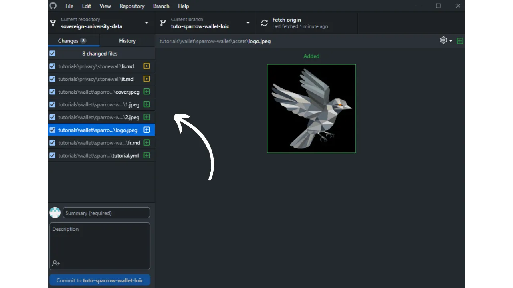

在学习本教程添加新教程之前，您需要完成几个初步步骤。如果您还没有这样做，请先看看这个入门教程，然后再回到这里：

https://planb.network/tutorials/others/contribution/write-tutorials-4d142a6a-9127-4ffb-9e0a-5aba29f169e2

您已经拥有 ：


- 为您的教程选择一个主题；
- 通过 [Telegram 群组](https://t.me/PlanBNetwork_ContentBuilder) 或 paolo@planb.network 与计划 ₿ 网络团队联系；
- 选择您的捐助工具。

在本教程中，我们将介绍如何通过配置本地环境与 GitHub Desktop，将教程添加到 Plan ₿ Network 中。如果你已经熟练掌握了 Git，那么本教程可能就没有必要这么详细了。相反，我建议你看看另一篇教程，在那里我只介绍了大致的指导原则，而没有详细的分步指导：


- 经验丰富的用户** ：

https://planb.network/tutorials/others/contribution/write-tutorials-git-expert-0ce1e490-c28f-4c51-b7e0-9a6ac9728410

如果你不想配置本地环境，可以参考另一篇专为初学者设计的教程，我们将直接通过 GitHub 网页界面进行更改：


- 初学者（网络界面）** ：

https://planb.network/tutorials/others/contribution/write-tutorials-github-web-beginner-e64f8fed-4c0b-4225-9ebb-7fc5f1c01a79

## 先决条件

学习本教程所需的软件 ：


- [GitHub Desktop](https://desktop.github.com/)；
- 标记文件编辑器，如 [Obsidian](https://obsidian.md/)；
- 代码编辑器（[VSC](https://code.visualstudio.com/) 或 [Sublime Text](https://www.sublimetext.com/)）。


开始教程前的先决条件 ：


- 拥有 [GitHub 账户](https://github.com/signup)；
- 有一个 [Plan ₿ Network source repository](https://github.com/PlanB-Network/bitcoin-educational-content) 的 fork；
- 拥有[Plan ₿ Network 上的教师简介](https://planb.network/professors) （仅当您提供完整教程时）。

如果您在获得这些先决条件方面需要帮助，我的其他教程会有所帮助：

https://planb.network/tutorials/others/contribution/basics-of-github-471f7f00-8b5a-4b63-abb1-f1528b032bbb

https://planb.network/tutorials/others/contribution/create-github-account-a75fc39d-f0d0-44dc-9cd5-cd94aee0c07c

https://planb.network/tutorials/others/contribution/github-desktop-work-environment-5862003b-9d76-47f5-a9e0-5ec74256a8ba

https://planb.network/tutorials/others/contribution/create-teacher-profile-8ba9ba49-8fac-437a-a435-c38eebc8f8a4

一旦一切就绪，本地环境也设置了自己的 Plan ₿ Network fork，就可以开始添加教程了。

## 1 - 创建新分支

打开浏览器，导航至计划 ₿ 网络存储库中的分叉页面。这是您在 GitHub 上建立的 fork。你的分叉的 URL 应该是这样的`https://github.com/[your-username]/bitcoin-educational-content` ：


确保你在主分支 `dev` 上，然后点击 `Sync fork` 按钮。如果您的分叉不是最新的，GitHub 会要求您更新分支。继续更新。反之，如果您的分支已经是最新的，GitHub 会通知您：


打开 GitHub 桌面，确保在窗口左上角正确选择了你的 fork：


点击 "Fetch origin "按钮。如果本地仓库已经是最新版本，GitHub Desktop 不会建议采取任何进一步行动。否则，"Pull origin "选项就会出现。点击该按钮更新本地版本库：


检查您所在的是 `dev` 主分支：


单击该分支，然后单击 "新建分支 "按钮：


确保新分支基于源代码库，即 `PlanB-Network/bitcoin-educational-content`。

使用破折号分隔每个单词，为您的分支命名，使标题明确其目的。例如，假设我们的目标是编写 Sparrow Wallet 的使用教程。在这种情况下，用于编写该教程的工作分支可以命名为：`tuto-sparrow-wallet-loic`。输入适当的名称后，单击 `Create branch` 以确认分支的创建：


现在点击 "发布分支 "按钮，将新的工作分支保存在 GitHub 上的在线分叉中：


现在，在 GitHub 桌面上，你应该在你的新分支上。这意味着你在本地电脑上所做的任何改动，都将只保存在这个分支上。此外，只要在 GitHub Desktop 上仍选中该分支，在你电脑上可见的文件就会是该分支 (`tuto-sprow-wallet-loic`)的文件，而不是主分支 (`dev`)的文件。


每发布一篇新文章，都需要从 `dev` 创建一个新分支。Git 中的分支是项目的并行版本，允许你在不影响主分支的情况下进行修改，直到工作准备好合并为止。

## 2 - 添加教程文件

现在工作分支已经创建，是时候整合你的新教程了。你有两个选择：使用我的 Python 脚本自动创建必要的文件，或者手动创建每个文件。让我们看看每种选择的步骤。

### 使用我的 Python 脚本

您需要安装 .NET Framework 3.0：


- Python 3.8 或更高版本；
- 脚本所需的依赖项。运行 ：

```bash
pip install customtkinter appdirs
````
Pour utiliser le script, rendez-vous dans le dossier où il est stocké. Le script se trouve dans le dépôt de data de Plan ₿ Network sous le chemin : `bitcoin-educational-content/scripts/tutorial-related/new-tutorial-creation/`.
Une fois dans le dossier, exécutez la commande :
```

python new-tutorial-creation.py

```
Une interface graphique (GUI) va s'ouvrir. La première fois, vous devrez entrer toutes les informations nécessaires, mais lors des utilisations ultérieures du script, vos informations personnelles seront mémorisées, ce qui vous évite de devoir les saisir de nouveau.

Commencez par indiquer le chemin local menant au dossier `/tutorials` sur votre clone du dépôt (`.../bitcoin-educational-content/tutorials/`). Vous pouvez le noter manuellement ou cliquer sur le bouton "Browse" pour naviguer via votre explorateur de fichiers.

Sélectionnez la langue dans laquelle vous rédigerez votre tutoriel.

Choisissez une catégorie principale pour votre tutoriel.

Ensuite, sélectionnez une sous-catégorie appropriée, en fonction de la catégorie principale que vous avez choisie.

Déterminez un niveau de difficulté pour le tutoriel.

Choisissez le nom du répertoire spécialement créé pour votre tutoriel. Le nom de ce dossier devrait refléter le logiciel abordé dans le tutoriel, en utilisant des tirets pour relier les mots. Par exemple, le dossier pourrait s'appeler `red-wallet` :

Le `project_id` est l'UUID de l'entreprise ou de l'organisation derrière l'outil présenté dans le tutoriel, disponible [dans la liste des projets](https://github.com/PlanB-Network/bitcoin-educational-content/tree/dev/resources/projects). Par exemple, pour un tutoriel sur le logiciel Sparrow Wallet, vous trouverez ce `project_id` dans le fichier : `bitcoin-educational-content/resources/projects/sparrow/project.yml`. Cette information est ajoutée au fichier YAML de votre tutoriel car Plan ₿ Network maintient une base de données des entreprises et organisations actives sur Bitcoin ou des projets connexes. En ajoutant le `project_id` associé à votre tutoriel, vous créez un lien entre votre contenu et l'entité concernée.
***Mise à jour :*** Dans la nouvelle version du script, vous n'avez plus besoin de saisir manuellement le `project_id`. Une fonction de recherche a été ajoutée pour trouver le projet par son nom et récupérer automatiquement le `project_id` correspondant. Tapez le début du nom du projet dans la case "Project name" pour le rechercher, puis sélectionnez l'entreprise souhaitée dans le menu déroulant. Le `project_id` sera automatiquement renseigné dans la case en dessous. Vous avez également la possibilité de le noter manuellement si nécessaire.

Pour les tags, sélectionnez 2 ou 3 mots-clés pertinents en relation avec le contenu de votre tutoriel, en les choisissant exclusivement [dans la liste des tags de Plan ₿ Network](https://github.com/PlanB-Network/bitcoin-educational-content/blob/dev/docs/50-planb-tags.md).

Dans la case "Contributor's GitHub ID", inscrivez votre identifiant GitHub.

Pour la case "PBN professor's ID", saisissez votre identifiant en utilisant les mots de la liste BIP39, tel qu'il apparaît sur [votre profil professeur](https://github.com/PlanB-Network/bitcoin-educational-content/tree/dev/professors).

Pour plus de détails sur votre identifiant de professeur, veuillez consulter le tutoriel suivant :
https://planb.network/tutorials/others/contribution/create-teacher-profile-8ba9ba49-8fac-437a-a435-c38eebc8f8a4

Une fois toutes les informations saisies et vérifiées, cliquez sur "Create Tutorial" pour valider la création des fichiers de votre tutoriel. Cela générera en local le dossier de votre tutoriel et tous les fichiers nécessaires dans le dossier de la catégorie sélectionnée.

Vous pouvez maintenant passer outre la sous-partie "Sans mon script Python", ainsi que l'étape 3 "Remplir le fichier YAML", car le script a déjà effectué ces actions automatiquement pour vous. Passez directement à l'étape 4 et à la rédaction de votre tutoriel.
Pour plus d'informations sur ce script Python, vous pouvez également [consulter son README](https://github.com/PlanB-Network/bitcoin-educational-content/blob/dev/scripts/tutorial-related/new-tutorial-creation/README.md).
### Sans mon script Python
Ouvrez votre gestionnaire de fichiers et dirigez-vous vers le dossier `bitcoin-educational-content`, qui représente le clone local de votre dépôt. Vous devriez normalement le trouver sous `Documents\GitHub\bitcoin-educational-content`.
Au sein de ce répertoire, il sera nécessaire de localiser le sous-dossier adéquat pour le placement de votre tutoriel. L'organisation des dossiers reflète les différentes sections du site web Plan ₿ Network. Dans notre exemple, puisque nous souhaitons ajouter un tutoriel sur Sparrow Wallet, il convient de se rendre dans le chemin suivant : `bitcoin-educational-content\tutorials\wallet` qui correspond à la section `WALLET` sur le site web :

Au sein du dossier `wallet`, il faut créer un nouveau répertoire spécifiquement dédié à votre tutoriel. Le nom de ce dossier doit évoquer le logiciel traité dans le tutoriel, en veillant à relier les mots par des tirets. Pour mon exemple, le dossier sera intitulé `sparrow-wallet` :

Dans ce nouveau sous-dossier dédié à votre tutoriel, il faut ajouter plusieurs éléments :
- Créez un dossier `assets`, destiné à recevoir toutes les illustrations nécessaires à votre tutoriel ;
- Au sein de ce dossier `assets`, il faut créer un sous-dossier nommé selon le code de langue originale du tutoriel. Par exemple, si le tutoriel est rédigé en anglais, ce sous-dossier doit être nommé `en`. Placez-y tous les visuels du tutoriel (schémas, images, captures d’écran, etc.).
- Un fichier `tutorial.yml` doit être créé pour y consigner les détails relatifs à votre tutoriel ;
- Un fichier en format markdown est à créer pour y rédiger le contenu effectif de votre tutoriel. Ce fichier doit être intitulé selon le code de la langue de rédaction. Par exemple, pour un tutoriel rédigé en français, le fichier devra s'appeler `fr.md`.

Pour résumer, voici la hiérarchie des fichiers à créer :
```

比特币-教育-内容/

└──教程/

└──钱包/（更改为正确的类别）

└──雀稗/ （用图名修改）

├── 资产/

│ ├──en/ （改为相应的语言代码）

├── tutorial.yml

└── fr.md（根据相应的语言代码修改）

```
## 3 - Remplir le fichier YAML
Remplissez le fichier `tutorial.yml` en copiant le modèle suivant :
```

id：

project_id：

标签

-

-

-

类别

水平：

学分

教授

# 校对元数据

Original_language：

校对：


  - 语言

最后捐款日期：

紧迫性：

贡献者_id：

-

奖励：

````

以下是必填字段：


- id**：UUID（通用唯一标识符），用于唯一标识教程。您可以使用[在线工具](https://www.uuidgenerator.net/version4)生成它。唯一的限制是该 UUID 必须是随机的，以免与平台上的其他 UUID 冲突；
- project_id** ：教程中介绍的工具背后的公司或组织的 UUID[来自项目列表](https://github.com/PlanB-Network/bitcoin-educational-content/tree/dev/resources/projects)。例如，如果您正在做 Sparrow 钱包软件的教程，您可以在以下文件中找到这个 `project_id` ：`bitcoin-educational-content/resources/projects/sparrow/project.yml`。之所以在教程的 YAML 文件中添加此信息，是因为 Plan ₿ Network 维护着一个所有在比特币或相关项目上运营的公司和组织的数据库。将链接实体的 `project_id` 添加到您的教程中，就在两个元素之间建立了链接；
- 标签**：从计划₿ 网络标签列表]中专门选择 2 或 3 个与教程内容相关的关键字(https://github.com/PlanB-Network/bitcoin-educational-content/blob/dev/docs/50-planb-tags.md)；
- 类别** ：根据计划₿ 网络结构（例如钱包："桌面"、"硬件"、"移动"、"备份"），与教程内容相对应的子类别；
- 级别** ：教程难度级别，从 ：
    - 初学者
    - 中级
    - 高级
    - 专家
- 教授**：您在[您的教师简介](https://github.com/PlanB-Network/bitcoin-educational-content/tree/dev/professors)中显示的 "贡献者 ID"（BIP39 字样）；
- original_language** ：教程的原始语言（如`fr`、`en`等）；
- 校对**：有关校对过程的信息。填写第一部分，因为校对自己的教程也算第一次验证：
    - 语言**：校对语言代码（如`fr`、`en`等）。
    - last_contribution_date**：今天的日期。
    - 紧迫性** ：留空。
    - contributors_id** ：您的 GitHub ID。
    - 奖励** ：留空。

有关教师 ID 的详细信息，请参阅相应的教程 ：

https://planb.network/tutorials/others/contribution/create-teacher-profile-8ba9ba49-8fac-437a-a435-c38eebc8f8a4

以下是为 Blockstream Green 钱包教程编写的`tutorial.yml`文件示例：

```yaml
id: e84edaa9-fb65-48c1-a357-8a5f27996143
project_id: 3b2f45e6-d612-412c-95ba-cf65b49aa5b8
tags:
- wallets
- software
- keys
category: mobile
level: beginner
credits:
professor: pretty-private
# Proofreading metadata
original_language: fr
proofreading:
- language: fr
last_contribution_date: 2024-11-20
urgency:
contributors_id:
- LoicPandul
reward:
```

编辑完 `tutorial.yml` 文件后，点击 `文件 > 保存` 保存文档：


现在可以关闭代码编辑器了。

## 4 - 填写 Markdown 文件

现在可以打开以语言代码命名的教程文件，例如 `en.md`。转到窗口左侧的 Obsidian，然后向下滚动文件夹树，找到教程文件夹和所需文件：


点击文件打开：


首先，我们要填写文档顶部的 "属性 "部分。


手动添加并填写以下代码块：

```markdown
---
name: [Titre]
description: [Description]
---
```


填写教程名称和简短说明：


然后在教程开头添加封面图像的路径。为此，请注意 ：

```markdown

```

当您需要在教程中添加图片时，这种语法就会派上用场。感叹号表示图片，其替代文本 (alt) 指定在方括号之间。图片的路径位于方括号之间：


## 5 - 添加徽标和封面

在 `assets` 文件夹中，您需要添加一个名为 `logo.webp` 的文件，作为文章的缩略图。该图片必须为 `.webp`格式，大小为正方形，以便与用户界面相匹配。您可以自由选择教程中涉及的软件的徽标或任何其他相关图片，只要是免版税的即可。此外，请在同一位置添加一张名为 "cover.webp "的图片。该图片将显示在教程的顶部。请确保该图片与徽标一样，尊重使用权并适合教程的上下文：


## 6 - 编写教程并添加视觉效果

继续编写教程内容。如果您想加入副标题，请在文本前加上 `##` 以应用适当的标记符格式：


assets "文件夹中的语言子文件夹用于存储教程中的图表和视觉效果。请尽可能避免在图像中包含文字，以便国际受众也能阅读您的内容。当然，展示的软件会包含文字，但如果您在软件截图上添加示意图或其他说明，请不要使用文字，如果有必要，请使用英文。


要为图像命名，只需使用与它们在教程中出现的顺序相对应的数字，格式为两位数（如果教程包含 99 张以上的图像，则为三位数）。例如，将第一张图片命名为 `01.webp`，第二张命名为 `02.webp`，以此类推。

您的图片必须是 `.webp` 格式。如有必要，您可以使用 [我的图像转换软件](https://github.com/LoicPandul/ImagesConverter)。


要在文档中插入图表，请在 Markdown 中使用以下命令，注意指定适当的替代文本和正确的图像路径：

```markdown

```

开头的感叹号表示图像。方括号之间是备选文本，有助于无障碍访问和引用。最后，图片的路径标注在方括号之间。

如果您想创建自己的示意图，请务必遵循计划 ₿ 网络图形指南，以确保视觉一致性：


- 字体**：使用 [Rubik](https://fonts.google.com/specimen/Rubik)；
- 颜色** ：
 - 橙色#FF5C00
 - 黑色 : #000000
 - 白色#FFFFFF

**在您的教程中集成的所有视觉效果必须是无版权或尊重源文件许可**的。因此，在 Plan ₿ Network 上发布的所有图表均采用 CC-BY-SA 许可，与文本相同。

**-> 提示：** 在公共场合共享图片等文件时，删除多余的元数据非常重要。这可能包含敏感信息，如位置数据、创建日期和作者详情。为了保护你的隐私，最好删除这些元数据。要简化这一操作，可以使用 [Exif Cleaner](https://exifcleaner.com/)等专业工具，只需简单拖放即可清理文档的元数据。

## 7 - 保存并提出教程

当您用自己选择的语言编写完教程后，下一步就是提交**拉动请求**。然后，管理员将使用我们的自动翻译方法和人工校对，将缺失的翻译添加到您的教程中。

要执行拉取请求，请打开 GitHub Desktop。软件会自动检测到你在本地分支上对原始仓库所做的任何改动。在继续之前，请在界面左侧仔细检查这些改动是否与你预期的一致：



为你的提交添加一个标题，然后点击蓝色的 "提交到 [你的分支]"按钮来验证这些更改：


提交是对分支所做更改的记录，并附有描述性信息，让你可以跟踪项目随时间的演变。它是一种中间检查点。

然后点击 `Push origin` 按钮。这将把你的提交发送到你的分叉：


如果你还没有完成你的教程，你可以稍后再回来做新的提交。如果您已完成该分支的编辑，请单击 "预览 Pull Request "按钮：


您可以最后一次检查更改是否正确，然后点击 "创建拉取请求 "按钮：


拉动请求是将您的分支中的更改整合到 Plan ₿ Network 代码库的主分支中的请求，允许在合并之前对更改进行审查和讨论。

您的浏览器将自动重定向到 GitHub 的 Pull Request 准备页面：


输入一个标题，简要概括您希望与源代码库合并的更改。添加一个简短的注释来描述这些更改（如果您有一个与创建教程相关的问题编号，记得在注释中注明 "关闭 #{ 问题编号}"），然后点击绿色的 "创建拉取请求 "按钮来确认合并请求：


然后，您的 PR 就会出现在主计划₿ 网络存储库的 "拉取请求 "选项卡中。您现在要做的就是等待管理员与您联系，确认您的贡献已被合并，或要求进一步修改。


将您的 PR 与主分支合并后，我们建议您删除工作分支 (`tuto-sparrow-wallet`)，以保持您的分叉上的历史清白。GitHub 会在您的 PR 页面自动提供该选项：


在 GitHub Desktop 上，您可以移回分叉的主分支 (`dev`)。


如果您在提交 PR 后希望更改会费，应遵循的步骤取决于 PR 的当前状态：


- 如果您的 PR 仍未合并，请在本地进行修改，并保持在同一分支上。修改完成后，使用 "Push origin "按钮为仍未合并的 PR 添加新提交；
- 如果您的 PR 已与主分支合并，则需要从头开始重新创建一个新分支，然后提交一份新 PR。确保本地版本库与 Plan ₿ Network 源版本库同步后再继续。

如果您在提交教程时遇到技术问题，请不要犹豫，在[我们专门的 Telegram 投稿群组](https://t.me/PlanBNetwork_ContentBuilder)上寻求帮助。非常感谢！