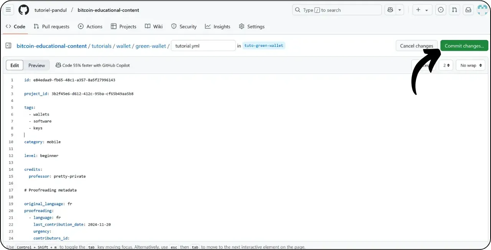
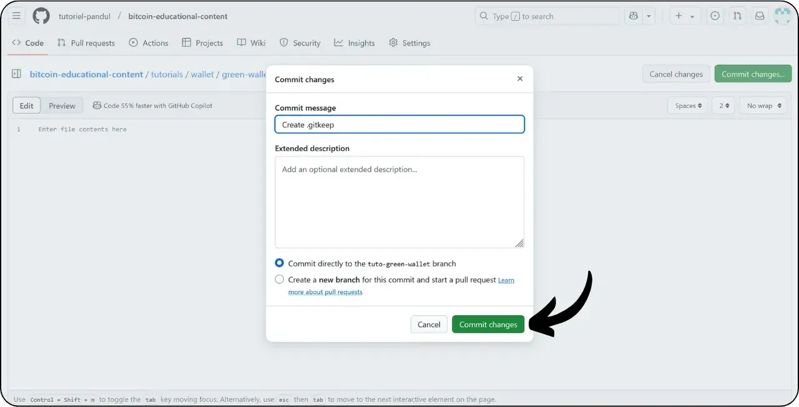
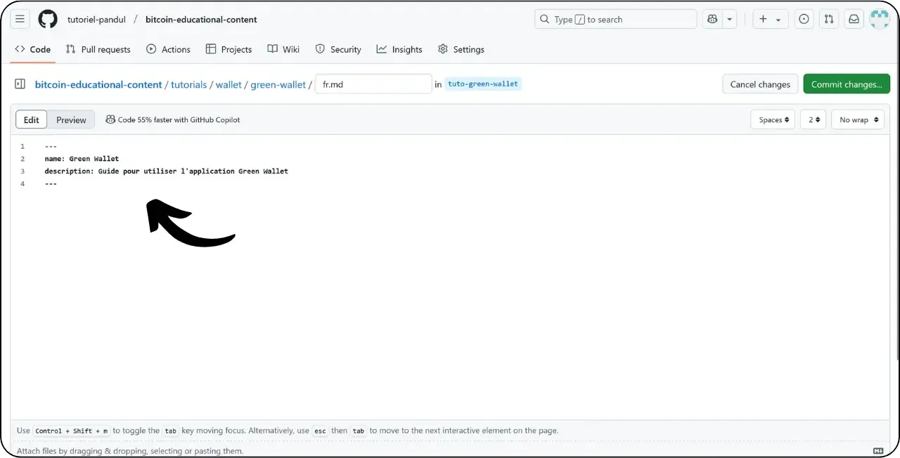

Bevor Sie dieses Tutorial zum Hinzufügen eines neuen Tutorials lesen, müssen Sie einige vorbereitende Schritte durchgeführt haben. Falls Sie dies noch nicht getan haben, sehen Sie sich bitte zuerst dieses einführende Tutorial an und kommen Sie dann hierher zurück:

https://planb.network/tutorials/others/contribution/write-tutorials-4d142a6a-9127-4ffb-9e0a-5aba29f169e2

Sie haben bereits :


- Wählen Sie ein Thema für Ihr Lernprogramm;
- Kontaktieren Sie das Plan ₿ Network Team über [Telegram group] (https://t.me/PlanBNetwork_ContentBuilder) oder paolo@planb.network;
- Wählen Sie Ihre Beitragstools.

In diesem Tutorial zeigen wir Ihnen, wie Sie Ihr Tutorial mit der Web-Version von GitHub zum Plan ₿ Network hinzufügen. Wenn Sie Git bereits beherrschen, ist dieses sehr detaillierte Tutorial vielleicht nicht notwendig für Sie. Stattdessen empfehle ich Ihnen, sich eines der beiden anderen Tutorials anzusehen, in denen ich die zu befolgenden Richtlinien und die Schritte zum Vornehmen von Änderungen von einem lokalen :


- Erfahrene Benutzer** :

https://planb.network/tutorials/others/contribution/write-tutorials-git-expert-0ce1e490-c28f-4c51-b7e0-9a6ac9728410

- Fortgeschrittene (GitHub Desktop)** :

https://planb.network/tutorials/others/contribution/write-tutorials-github-desktop-intermediate-4a36a052-1000-4191-890a-9a1dc65f8957

## Voraussetzungen

Voraussetzungen vor Beginn des Tutorials :


- Sie haben ein [GitHub-Konto] (https://github.com/signup);
- Haben Sie einen Fork des [Plan ₿ Network source repository] (https://github.com/PlanB-Network/bitcoin-educational-content);
- Haben Sie [ein Lehrerprofil im Plan ₿ Network] (https://planb.network/professors) (nur wenn Sie ein vollständiges Tutorium anbieten).

Wenn Sie Hilfe brauchen, um diese Voraussetzungen zu schaffen, helfen Ihnen meine anderen Tutorials:


https://planb.network/tutorials/others/contribution/create-github-account-a75fc39d-f0d0-44dc-9cd5-cd94aee0c07c

https://planb.network/tutorials/others/contribution/github-desktop-work-environment-5862003b-9d76-47f5-a9e0-5ec74256a8ba

https://planb.network/tutorials/others/contribution/create-teacher-profile-8ba9ba49-8fac-437a-a435-c38eebc8f8a4

Sobald alles an Ort und Stelle ist und Sie Ihren Fork des Plan ₿ Network Repository haben, können Sie mit dem Hinzufügen des Tutorials beginnen.

## 1 - Einen neuen Zweig erstellen

Öffnen Sie Ihren Browser und navigieren Sie zu Ihrer Fork-Seite im Plan ₿ Network Repository. Dies ist der Fork, den Sie auf GitHub eingerichtet haben. Die URL Ihrer Abspaltung sollte wie folgt aussehen: `https://github.com/[Ihr-Benutzername]/bitcoin-educational-content` :


Vergewissern Sie sich, dass Sie sich auf dem Hauptzweig `dev` befinden, und klicken Sie dann auf die Schaltfläche "*Sync fork*". Wenn Ihr Fork nicht auf dem neuesten Stand ist, wird GitHub Sie auffordern, Ihren Branch zu aktualisieren. Fahren Sie mit dieser Aktualisierung fort:


Klicken Sie auf den `dev`-Zweig und benennen Sie dann Ihren Arbeitszweig so, dass der Titel den Zweck klar widerspiegelt, indem Sie Bindestriche zur Trennung der Wörter verwenden. Wenn es zum Beispiel unser Ziel ist, ein Tutorial über die Verwendung von Green Wallet zu schreiben, könnte der Zweig folgendermaßen heißen: tuto-green-wallet-loic". Nachdem Sie einen geeigneten Namen eingegeben haben, klicken Sie auf "*Zweig erstellen*", um die Erstellung Ihres neuen Zweigs auf der Grundlage von `dev` zu bestätigen:


Sie sollten sich nun in Ihrem neuen Arbeitsbereich befinden:


Das bedeutet, dass alle Änderungen, die Sie vornehmen, nur in diesem speziellen Zweig gespeichert werden.

Für jeden neuen Artikel, den Sie veröffentlichen wollen, erstellen Sie einen neuen Zweig von `dev`.

Ein Zweig in Git stellt eine parallele Version des Projekts dar, die es Ihnen ermöglicht, an Änderungen zu arbeiten, ohne den Hauptzweig zu beeinflussen, bis Ihre Arbeit für die Integration bereit ist.

## 2 - Tutorial-Dateien hinzufügen

Nun, da der Arbeitszweig erstellt wurde, ist es an der Zeit, das neue Tutorial zu integrieren.

Innerhalb Ihrer Verzweigungsdateien müssen Sie den passenden Unterordner für die Platzierung Ihres Tutorials finden. Die Organisation der Ordner spiegelt die verschiedenen Bereiche der Plan ₿ Network Website wider. In unserem Beispiel, da wir ein Tutorial über Green Wallet hinzufügen, gehen Sie zu folgendem Pfad: `bitcoin-educational-content\tutorials\wallet`, was dem Abschnitt `WALLET` auf der Website entspricht:


Erstellen Sie im Ordner "wallet" ein neues Verzeichnis, das speziell für Ihr Lernprogramm bestimmt ist. Der Name dieses Ordners sollte eindeutig auf die Software hinweisen, die im Lernprogramm behandelt wird, und Bindestriche zur Verbindung der Wörter verwenden. In meinem Beispiel wird der Ordner "green-wallet" heißen. Klicken Sie auf "*Datei hinzufügen*" und dann auf "*Neue Datei erstellen*":


Geben Sie den Ordnernamen gefolgt von einem Schrägstrich `/` ein, um die Erstellung des Ordners zu bestätigen.


In diesem neuen Unterordner, der Ihrem Tutorial gewidmet ist, müssen Sie mehrere Elemente hinzufügen:


- Erstellen Sie einen Ordner `Assets`, in dem alle für Ihr Tutorial benötigten Illustrationen gespeichert werden;
- Erstellen Sie in diesem Ordner "Assets" einen Unterordner mit dem Namen der Originalsprache des Tutorials. Wenn das Lernprogramm beispielsweise auf Englisch verfasst ist, sollte dieser Unterordner den Namen "en" tragen. Legen Sie alle visuellen Elemente des Tutorials (Diagramme, Bilder, Screenshots usw.) in diesen Ordner.
- Es muss eine Datei "tutorial.yml" erstellt werden, um die Details Ihres Tutorials festzuhalten;
- Es muss eine Markdown-Datei erstellt werden, um den eigentlichen Inhalt Ihres Tutorials zu schreiben. Diese Datei muss nach dem Code der Sprache benannt werden, in der sie geschrieben ist. Für ein französischsprachiges Lernprogramm sollte die Datei beispielsweise "fr.md" heißen.

Zusammenfassend lässt sich die Dateihierarchie wie folgt darstellen (wir werden im nächsten Abschnitt mit der Erstellung der Dateien fortfahren):

```
bitcoin-educational-content/
└── tutorials/
└── wallet/ (à modifier avec la bonne catégorie)
└── green-wallet/ (à modifier avec le nom du tuto)
├── assets/
│   ├── fr/ (à modifier selon le code de langue approprié)
├── tutorial.yml
└── fr.md (à modifier selon le code de langue approprié)
```

## 3 - Ausfüllen der YAML-Datei

Beginnen wir mit der YAML-Datei. In das Feld für die Erstellung einer neuen Datei geben Sie "tutorial.yml" ein:


Füllen Sie die Datei "tutorial.yml" aus, indem Sie die folgende Vorlage kopieren:

```
id:
project_id:
tags:
-
-
-
category:
level:
credits:
professor:
# Proofreading metadata
original_language:
proofreading:
- language:
last_contribution_date:
urgency:
contributors_id:
-
reward:
```

Hier sind die erforderlichen Felder:


- id**: Eine UUID (_Universally Unique Identifier_) zur eindeutigen Identifizierung des Lernprogramms. Sie können sie mit [einem Online-Tool] (https://www.uuidgenerator.net/version4) erzeugen. Die einzige Einschränkung ist, dass diese UUID zufällig sein muss, damit sie nicht mit einer anderen UUID auf der Plattform kollidiert;
- project_id** : Die UUID des Unternehmens oder der Organisation, die hinter dem im Tutorium vorgestellten Tool steht [aus der Liste der Projekte] (https://github.com/PlanB-Network/bitcoin-educational-content/tree/dev/resources/projects). Wenn Sie zum Beispiel ein Tutorial über die Green Wallet Software machen, können Sie diese `project_id` in der folgenden Datei finden: `bitcoin-educational-content/resources/projects/blockstream/project.yml`. Diese Information wird in der YAML-Datei Ihres Tutorials hinzugefügt, weil das Plan ₿ Network eine Datenbank aller Unternehmen und Organisationen unterhält, die an Bitcoin oder verwandten Projekten arbeiten. Indem Sie die `project_id` der verlinkten Entität zu Ihrem Tutorial hinzufügen, schaffen Sie eine Verbindung zwischen den beiden Elementen;
- tags**: 2 oder 3 relevante Schlüsselwörter, die sich auf den Inhalt des Tutorials beziehen und ausschließlich [aus der Tag-Liste des Plan ₿ Network] (https://github.com/PlanB-Network/bitcoin-educational-content/blob/dev/docs/50-planb-tags.md) ausgewählt werden;
- kategorie** : Die Unterkategorie, die dem Inhalt des Tutorials entspricht, gemäß der Plan ₿ Netzwerkstruktur (z.B. für Wallets: `Desktop`, `Hardware`, `Mobile`, `Backup`) ;
- stufe** : Schwierigkeitsgrad des Tutorials, von :
    - anfängerin
    - mittel
    - fortgeschritten
    - experte
- professor**: Ihre "contributor_id" (BIP39-Wörter), wie sie auf [Ihr Lehrerprofil] (https://github.com/PlanB-Network/bitcoin-educational-content/tree/dev/professors) angezeigt wird;
- original_language** : Die Originalsprache des Tutorials (z.B. `fr`, `en`, etc.) ;
- korrekturlesen**: Informationen über den Korrekturleseprozess. Füllen Sie den ersten Teil aus, denn das Korrekturlesen Ihres eigenen Tutoriums zählt als erste Validierung:
    - sprache**: Korrekturlesen von Sprachcodes (z. B. `fr`, `en`, usw.).
    - letzter_Beitrag_datum**: Das heutige Datum.
    - dringlichkeit** : Leer lassen.
    - contributors_id** : Ihre GitHub-ID.
    - belohnung** : Leer lassen.

Weitere Einzelheiten zu Ihrer Lehrer-ID finden Sie in der entsprechenden Anleitung:

https://planb.network/tutorials/others/contribution/create-teacher-profile-8ba9ba49-8fac-437a-a435-c38eebc8f8a4

Hier ist ein Beispiel für eine "tutorial.yml"-Datei, die für ein Tutorial über die Blockstream Green Wallet erstellt wurde:

```
id: e84edaa9-fb65-48c1-a357-8a5f27996143
project_id: 3b2f45e6-d612-412c-95ba-cf65b49aa5b8
tags:
- wallets
- software
- keys
category: mobile
level: beginner
credits:
professor: pretty-private
# Proofreading metadata
original_language: fr
proofreading:
- language: fr
last_contribution_date: 2024-11-20
urgency:
contributors_id:
- LoicPandul
reward:
```

Wenn Sie die Änderungen an der Datei "tutorial.yml" abgeschlossen haben, speichern Sie Ihr Dokument, indem Sie auf die Schaltfläche "*Commit changes...*" klicken:



Fügen Sie einen Titel und eine Beschreibung hinzu und vergewissern Sie sich, dass die Übergabe an die Verzweigung erfolgt, die Sie zu Beginn dieses Tutorials erstellt haben. Bestätigen Sie dann mit einem Klick auf "*Änderungen übertragen*".


## 4 - Erstellen von Unterordnern für Bilder

Klicken Sie erneut auf "*Datei hinzufügen*" und dann auf "*Neue Datei erstellen*":


Geben Sie `assets` gefolgt von einem Schrägstrich `/` ein, um den Ordner zu erstellen:


Wiederholen Sie diesen Schritt im Ordner `/assets`, um den Unterordner für die Sprache zu erstellen, z. B. `fr`, wenn Ihr Lernprogramm auf Französisch ist:


Erstellen Sie in diesem Ordner eine Dummy-Datei, um GitHub zu zwingen, Ihren Ordner zu behalten (der sonst leer wäre). Nennen Sie diese Datei `.gitkeep`. Klicken Sie dann auf "*Änderungen übertragen...*".


Vergewissern Sie sich noch einmal, dass Sie sich im richtigen Zweig befinden, und klicken Sie dann auf "*Änderungen übertragen*".



## 5 - Erstellen der Markdown-Datei

Jetzt erstellen wir die Datei, in der Ihr Tutorial gespeichert wird, und benennen sie nach Ihrem Sprachcode, z. B. "fr.md", wenn wir auf Französisch schreiben. Gehen Sie zu Ihrem Tutorial-Ordner:


Klicken Sie auf "Datei hinzufügen*", dann auf "Neue Datei erstellen*".


Benennen Sie die Datei mit dem Code Ihrer Sprache. In meinem Fall, da das Lernprogramm auf Französisch verfasst ist, nenne ich meine Datei `fr.md`. Die Erweiterung `.md` zeigt an, dass die Datei im Markdown-Format ist.


Wir beginnen mit dem Ausfüllen des Abschnitts "Eigenschaften" am Anfang des Dokuments. Fügen Sie den folgenden Code-Block manuell hinzu und füllen Sie ihn aus (die Schlüssel "Name" und "Beschreibung" müssen in englischer Sprache gehalten werden, aber ihre Werte müssen in der Sprache geschrieben werden, die Sie für Ihr Lernprogramm verwenden):

```
---
name: [Titre]
description: [Description]
---
```


Geben Sie den Namen Ihres Tutorials und eine kurze Beschreibung ein:



Fügen Sie dann den Pfad zum Titelbild am Anfang Ihres Tutorials ein. Beachten Sie dazu:

```

```

Diese Syntax ist immer dann nützlich, wenn Sie ein Bild zu Ihrem Tutorial hinzufügen möchten. Das Ausrufezeichen steht für ein Bild, dessen Alternativtext (alt) zwischen den eckigen Klammern angegeben wird. Der Pfad zum Bild wird zwischen den Klammern angegeben:


Klicken Sie auf die Schaltfläche "*Änderungen übernehmen...*", um diese Datei zu speichern.


Überprüfen Sie, ob Sie sich im richtigen Zweig befinden, und bestätigen Sie die Übergabe.


Ihr Tutorial-Ordner sollte nun entsprechend Ihrem Sprachcode wie folgt aussehen:


## 6 - Logo und Umschlag hinzufügen

Im Ordner "Assets" müssen Sie eine Datei mit dem Namen "logo.webp" hinzufügen, die als Miniaturbild für Ihren Artikel dienen wird. Dieses Bild muss im Format "webp" vorliegen und quadratisch sein, damit es zur Benutzeroberfläche passt.

Sie können das in der Anleitung verwendete Software-Logo oder jedes andere relevante Bild wählen, solange es lizenzfrei ist. Fügen Sie außerdem ein Bild mit dem Titel "cover.webp" an der gleichen Stelle ein. Dieses Bild wird am Anfang des Tutorials angezeigt. Achten Sie darauf, dass dieses Bild, ebenso wie das Logo, die Nutzungsrechte respektiert und dem Kontext Ihres Tutorials angemessen ist.

Um Bilder zum Ordner "/Assets" hinzuzufügen, können Sie sie aus Ihren lokalen Dateien ziehen und ablegen. Vergewissern Sie sich, dass Sie sich im Ordner "/Assets" und in der richtigen Verzweigung befinden, und klicken Sie dann auf "*Änderungen übertragen*".


Jetzt sollten die Bilder im Ordner erscheinen.


## 7 - Schreiben des Tutorials

Fahren Sie mit dem Schreiben Ihres Tutorials fort, indem Sie Ihren Inhalt in der Markdown-Datei mit dem Sprachcode notieren (in meinem Beispiel auf Französisch ist es die Datei "fr.md"). Rufen Sie die Datei auf und klicken Sie auf das Bleistiftsymbol :


Beginnen Sie mit dem Schreiben Ihres Tutorials. Wenn Sie einen Untertitel hinzufügen, verwenden Sie die entsprechende Markdown-Formatierung, indem Sie dem Text das Zeichen "##" voranstellen:


Wechseln Sie zwischen den Ansichten "*Bearbeiten*" und "*Vorschau*", um das Rendering besser zu visualisieren.


Um Ihre Arbeit zu speichern, klicken Sie auf "*Commit Changes...*", vergewissern Sie sich, dass Sie sich im richtigen Zweig befinden, und bestätigen Sie dann erneut mit "*Commit Changes*".


## 8 - Bildmaterial hinzufügen

Der Sprachunterordner im Ordner `/assets` (in meinem Beispiel: `/assets/en`) wird verwendet, um die Diagramme und Bilder zu speichern, die Ihren Lehrgang begleiten werden. Vermeiden Sie so weit wie möglich Text in Ihren Bildern, um Ihre Inhalte einem internationalen Publikum zugänglich zu machen. Natürlich wird die vorgestellte Software Text enthalten, aber wenn Sie Schemata oder zusätzliche Angaben zu den Software-Screenshots hinzufügen, tun Sie dies ohne Text oder verwenden Sie, falls unbedingt erforderlich, Englisch.

Um Ihre Bilder zu benennen, verwenden Sie einfach Nummern, die der Reihenfolge ihres Erscheinens im Lernprogramm entsprechen, formatiert als zwei Ziffern (oder drei Ziffern, wenn Ihr Lernprogramm mehr als 99 Bilder enthält). Nennen Sie zum Beispiel Ihr erstes Bild `01.webp`, Ihr zweites `02.webp`, und so weiter.

Ihre Bilder dürfen nur im `.webp`-Format sein. Falls erforderlich, können Sie [meine Bildkonvertierungssoftware] (https://github.com/LoicPandul/ImagesConverter) verwenden.


Nachdem Sie nun Ihre Bilder in den Unterordner eingefügt haben, können Sie die Dummy-Datei `.gitkeep` löschen. Öffnen Sie diese Datei, klicken Sie auf die drei kleinen Punkte in der oberen rechten Ecke und dann auf "*Datei löschen*".


Speichern Sie Ihre Änderungen, indem Sie auf "*Änderungen übernehmen...*" klicken.


Um ein Diagramm aus Ihrem Unterordner in Ihr redaktionelles Dokument einzufügen, verwenden Sie den folgenden Markdown-Befehl. Achten Sie dabei darauf, den entsprechenden Alternativtext und den richtigen Bildpfad für Ihre Sprache anzugeben:

```

```

Das Ausrufezeichen am Anfang weist auf ein Bild hin. Der alternative Text, der die Zugänglichkeit und die Referenzierung erleichtert, steht zwischen den eckigen Klammern. Schließlich wird der Pfad zum Bild in Klammern angegeben.


Wenn Sie Ihre eigenen Schemata erstellen möchten, sollten Sie sich an die grafischen Richtlinien des Plan ₿ Network halten, um die visuelle Konsistenz zu gewährleisten:


- Schriftart**: Verwenden Sie [Rubik](https://fonts.google.com/specimen/Rubik);
- Farben** :
 - Orange: #FF5C00
 - Schwarz : #000000
 - Weiß: #FFFFFF

**Es ist unbedingt erforderlich, dass alle in Ihre Tutorials integrierten Grafiken frei von Urheberrechten sind oder die Lizenz für die Quelldatei respektieren**. Daher werden alle Diagramme, die im Plan ₿ Network veröffentlicht werden, unter einer CC-BY-SA-Lizenz zur Verfügung gestellt, genau wie der Text.

**-> Tipp:** Wenn Sie Dateien, wie z. B. Bilder, öffentlich zugänglich machen, ist es wichtig, überflüssige Metadaten zu entfernen. Diese können sensible Informationen enthalten, z. B. Standortdaten, Erstellungsdaten und Angaben zum Autor. Um Ihre Privatsphäre zu schützen, ist es eine gute Idee, diese Metadaten zu entfernen. Um diesen Vorgang zu vereinfachen, können Sie spezielle Werkzeuge wie [Exif Cleaner] (https://exifcleaner.com/) verwenden, mit denen Sie die Metadaten eines Dokuments durch einfaches Ziehen und Ablegen bereinigen können.

## 9 - Das Tutorium vorschlagen

Wenn Sie Ihr Tutorial in der Sprache Ihrer Wahl fertiggestellt haben, ist der nächste Schritt das Einreichen eines **Pull Request**. Der Administrator wird dann die fehlenden Übersetzungen zu Ihrem Tutorial hinzufügen, indem er unsere automatische Übersetzungsmethode mit menschlichem Korrekturlesen verwendet.

Um mit dem Pull Request fortzufahren, klicken Sie, nachdem Sie alle Änderungen gespeichert haben, auf die Schaltfläche "*Contribute*" und dann auf "*Open pull request*":


Ein Pull Request ist eine Anfrage, um Änderungen aus Ihrem Zweig in den Hauptzweig des Plan ₿ Network Repository zu integrieren, was eine Überprüfung und Diskussion der Änderungen ermöglicht, bevor sie zusammengeführt werden.

Bevor Sie fortfahren, vergewissern Sie sich am unteren Rand der Benutzeroberfläche, dass diese Änderungen Ihren Erwartungen entsprechen:


Vergewissern Sie sich, dass Ihr Arbeitszweig oben in der Schnittstelle mit dem Zweig `dev` des Plan ₿ Network Repository (dem Hauptzweig) zusammengeführt wird.

Geben Sie einen Titel ein, der kurz die Änderungen zusammenfasst, die Sie mit dem Quell-Repository zusammenführen möchten. Fügen Sie einen kurzen Kommentar hinzu, der diese Änderungen beschreibt (wenn Sie eine Ausgabenummer haben, die mit der Erstellung Ihres Tutorials verbunden ist, denken Sie daran, "Schließt #{Ausgabenummer}" als Kommentar zu vermerken), und klicken Sie dann auf die grüne Schaltfläche "*Create pull request*", um die Zusammenführungsanfrage zu bestätigen:


Ihr PR wird dann auf der Registerkarte "*Pull Request*" des Plan ₿ Network Repository sichtbar sein. Jetzt müssen Sie nur noch warten, bis ein Administrator Sie kontaktiert, um zu bestätigen, dass Ihr Beitrag zusammengeführt wurde, oder um weitere Änderungen anzufordern.


Nachdem Sie Ihren PR mit dem Hauptzweig zusammengeführt haben, empfehlen wir, Ihren Arbeitszweig (in meinem Beispiel: `tuto-green-wallet`) zu löschen, um eine saubere Historie Ihrer Abspaltung zu erhalten. GitHub bietet Ihnen diese Option automatisch auf Ihrer PR-Seite an:


Wenn Sie Änderungen an Ihrem Beitrag vornehmen möchten, nachdem Sie Ihren PR bereits eingereicht haben, hängen die zu befolgenden Schritte vom aktuellen Status Ihres PR ab:


- Wenn Ihr PR noch offen ist und noch nicht zusammengeführt wurde, nehmen Sie die Änderungen in demselben Arbeitszweig vor. Die übertragenen Änderungen werden zu Ihrem noch offenen PR hinzugefügt;
- Falls Ihr PR bereits mit dem Hauptzweig zusammengeführt wurde, müssen Sie den Prozess von Anfang an wiederholen, indem Sie einen neuen Zweig erstellen und dann einen neuen PR einreichen. Stellen Sie sicher, dass Ihr Fork mit dem Plan ₿ Network Source Repository auf dem `dev`-Zweig synchronisiert ist, bevor Sie fortfahren.

Wenn Sie technische Schwierigkeiten haben, Ihr Tutorial einzureichen, zögern Sie bitte nicht, auf [unserer speziellen Telegram-Gruppe für Beiträge] (https://t.me/PlanBNetwork_ContentBuilder) um Hilfe zu bitten. Herzlichen Dank!
