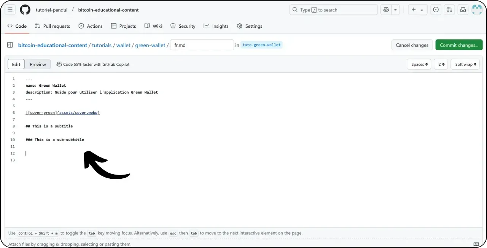

Antes de seguir este tutorial sobre cómo añadir un nuevo tutorial, necesita haber completado algunos pasos preliminares. Si aún no lo ha hecho, eche un vistazo primero a este tutorial introductorio y luego vuelva aquí :

https://planb.network/tutorials/others/contribution/write-tutorials-4d142a6a-9127-4ffb-9e0a-5aba29f169e2
Ya tienes :


- Elija un tema para su tutorial;
- Póngase en contacto con el equipo de Plan ₿ Network a través de [grupo de Telegram](https://t.me/PlanBNetwork_ContentBuilder) o paolo@planb.network ;
- Elige tus herramientas de contribución.

En este tutorial, veremos cómo añadir tu tutorial al Plan ₿ Network utilizando la versión web de GitHub. Si ya dominas Git, puede que este tutorial tan detallado no sea necesario para ti. En su lugar, te recomiendo que eches un vistazo a alguno de estos otros 2 tutoriales, donde detallo las pautas a seguir y los pasos para realizar cambios desde un archivo :


- Usuarios con experiencia** :

https://planb.network/tutorials/others/contribution/write-tutorials-git-expert-0ce1e490-c28f-4c51-b7e0-9a6ac9728410

- Intermedio (GitHub Desktop)** :

https://planb.network/tutorials/others/contribution/write-tutorials-github-desktop-intermediate-4a36a052-1000-4191-890a-9a1dc65f8957
## Requisitos previos

Requisitos previos antes de empezar el tutorial :


- Tener una [cuenta GitHub](https://github.com/signup);
- Disponga de un fork del [Plan ₿ Network source repository](https://github.com/PlanB-Network/bitcoin-educational-content);
- Tener [un perfil de profesor en Plan ₿ Network](https://planb.network/professors) (sólo si ofreces una tutoría completa).

Si necesitas ayuda para conseguir estos requisitos previos, mis otros tutoriales te ayudarán:

https://planb.network/tutorials/others/contribution/basics-of-github-471f7f00-8b5a-4b63-abb1-f1528b032bbb
https://planb.network/tutorials/others/contribution/create-github-account-a75fc39d-f0d0-44dc-9cd5-cd94aee0c07c
https://planb.network/tutorials/others/contribution/github-desktop-work-environment-5862003b-9d76-47f5-a9e0-5ec74256a8ba
https://planb.network/tutorials/others/contribution/create-teacher-profile-8ba9ba49-8fac-437a-a435-c38eebc8f8a4
Una vez que todo esté en su lugar y tengas tu fork del repositorio Plan ₿ Network, puedes empezar a añadir el tutorial.

## 1 - Crear una nueva sucursal

Abre tu navegador y navega a tu página de bifurcación en el repositorio Plan ₿ Network. Esta es la bifurcación que has establecido en GitHub. La URL de su bifurcación debe tener este aspecto: `https://github.com/[tu-nombre-deusuario]/bitcoin-educational-content` :


Asegúrate de que estás en la rama principal `dev` y haz clic en el botón "*Sync fork*". Si tu bifurcación no está actualizada, GitHub te pedirá que actualices tu rama. Procede con esta actualización:


Haz clic en la rama `dev` y, a continuación, nombra tu rama de trabajo de forma que su título refleje claramente su objetivo, utilizando guiones para separar las palabras. Por ejemplo, si nuestro objetivo es escribir un tutorial sobre el uso de Green Wallet, la rama podría llamarse `tuto-cartera-verde-loic`. Tras introducir un nombre adecuado, haz clic en "*Crear rama*" para confirmar la creación de tu nueva rama basada en `dev` :


Ahora deberías estar en tu nueva rama de trabajo:


Esto significa que cualquier cambio que hagas se guardará sólo en esa rama específica.

Para cada nuevo artículo que vaya a publicar, cree una nueva rama a partir de `dev`.

Una rama en Git representa una versión paralela del proyecto, que te permite trabajar en modificaciones sin afectar a la rama principal, hasta que tu trabajo esté listo para ser integrado.

## 2 - Añadir archivos del tutorial

Ahora que se ha creado la rama de trabajo, es el momento de integrar su nuevo tutorial.

Dentro de sus archivos de rama, tendrá que encontrar la subcarpeta adecuada para la colocación de su tutorial. La organización de las carpetas refleja las diferentes secciones del sitio web de Plan ₿ Network. En nuestro ejemplo, ya que estamos añadiendo un tutorial sobre Green Wallet, dirígete a la siguiente ruta: `bitcoin-educational-content\tutorials\wallet` que corresponde a la sección `WALLET` del sitio web:


En la carpeta `wallet`, cree un nuevo directorio dedicado específicamente a su tutorial. El nombre de esta carpeta debe indicar claramente el software cubierto en el tutorial, utilizando guiones para conectar las palabras. En mi ejemplo, la carpeta se llamará `green-wallet`. Haga clic en "*Añadir archivo*" y luego en "*Crear nuevo archivo*" :


Introduzca el nombre de la carpeta seguido de una barra `/` para confirmar su creación como carpeta.


En esta nueva subcarpeta dedicada a su tutorial, deberá añadir varios elementos:


- Crea una carpeta `assets` para guardar todas las ilustraciones necesarias para tu tutorial;
- Dentro de esta carpeta `assets`, cree una subcarpeta con el nombre del código del idioma original del tutorial. Por ejemplo, si el tutorial está escrito en inglés, esta subcarpeta debería llamarse `en`. Coloca todos los elementos visuales del tutorial (diagramas, imágenes, capturas de pantalla, etc.) en esta carpeta.
- Debe crear un archivo `tutorial.yml` para registrar los detalles de su tutorial;
- Debe crearse un archivo markdown para escribir el contenido real de su tutorial. Este archivo debe nombrarse de acuerdo con el código del idioma en el que está escrito. Por ejemplo, para un tutorial escrito en francés, el archivo debe llamarse `fr.md`.

Para resumir, esta es la jerarquía de archivos (seguiremos creándolos en la próxima sección):

```
bitcoin-educational-content/
└── tutorials/
└── wallet/ (à modifier avec la bonne catégorie)
└── green-wallet/ (à modifier avec le nom du tuto)
├── assets/
│   ├── fr/ (à modifier selon le code de langue approprié)
├── tutorial.yml
└── fr.md (à modifier selon le code de langue approprié)
```

## 3 - Rellene el archivo YAML

Empecemos con el archivo YAML. En la casilla para crear un nuevo archivo, introduzca `tutorial.yml` :


Rellene el archivo `tutorial.yml` copiando la siguiente plantilla:

```
id:
project_id:
tags:
-
-
-
category:
level:
credits:
professor:
# Proofreading metadata
original_language:
proofreading:
- language:
last_contribution_date:
urgency:
contributors_id:
-
reward:
```

Estos son los campos obligatorios:


- id**: Un UUID (_Universally Unique Identifier_) para identificar de forma única el tutorial. Puede generarlo con [una herramienta en línea](https://www.uuidgenerator.net/version4). La única restricción es que este UUID debe ser aleatorio, para no entrar en conflicto con otro UUID de la plataforma;
- project_id** : El UUID de la empresa u organización que está detrás de la herramienta presentada en el tutorial [de la lista de proyectos](https://github.com/PlanB-Network/bitcoin-educational-content/tree/dev/resources/projects). Por ejemplo, si estás haciendo un tutorial sobre el software Green Wallet, puedes encontrar este `project_id` en el siguiente archivo: `bitcoin-educational-content/resources/projects/blockstream/project.yml`. Esta información se añade en el archivo YAML de su tutorial porque Plan ₿ Network mantiene una base de datos de todas las empresas y organizaciones que operan en Bitcoin o proyectos relacionados. Al añadir el `project_id` de la entidad vinculada a su tutorial, se crea un vínculo entre los dos elementos;
- etiquetas**: 2 o 3 palabras clave relevantes relacionadas con el contenido del tutorial, elegidas exclusivamente [de la lista de etiquetas Plan ₿ Network](https://github.com/PlanB-Network/bitcoin-educational-content/blob/dev/docs/50-planb-tags.md);
- categoría** : La subcategoría correspondiente al contenido del tutorial, según la estructura del Plan ₿ Red (por ejemplo, para carteras: `desktop`, `hardware`, `mobile`, `backup`) ;
- nivel** : Nivel de dificultad del tutorial, de :
    - principiante
    - `intermedio`
    - `avanzado`
    - `experto`
- profesor**: Su `contributor_id` (palabras BIP39) tal y como aparece en [su perfil de profesor](https://github.com/PlanB-Network/bitcoin-educational-content/tree/dev/professors);
- idioma_original** : El idioma original del tutorial (por ejemplo, `fr`, `en`, etc.) ;
- corrección de pruebas**: Información sobre el proceso de corrección. Rellene la primera parte, porque la corrección de su propio tutorial cuenta como primera validación:
    - idioma**: Corrección del código de idioma (por ejemplo, `fr`, `en`, etc.).
    - fecha_última_contribución**: La fecha de hoy.
    - urgencia** : Dejar en blanco.
    - contributors_id** : Tu ID de GitHub.
    - recompensa** : Dejar en blanco.

Para más detalles sobre su ID de profesor, consulte el tutorial correspondiente :

https://planb.network/tutorials/others/contribution/create-teacher-profile-8ba9ba49-8fac-437a-a435-c38eebc8f8a4
Este es un ejemplo de un archivo `tutorial.yml` completado para un tutorial sobre el monedero Blockstream Green:

```
id: e84edaa9-fb65-48c1-a357-8a5f27996143
project_id: 3b2f45e6-d612-412c-95ba-cf65b49aa5b8
tags:
- wallets
- software
- keys
category: mobile
level: beginner
credits:
professor: pretty-private
# Proofreading metadata
original_language: fr
proofreading:
- language: fr
last_contribution_date: 2024-11-20
urgency:
contributors_id:
- LoicPandul
reward:
```

Una vez que haya terminado de modificar su archivo `tutorial.yml`, guarde su documento haciendo clic en el botón "*Commit changes...*":


Añade un título y una descripción, y asegúrate de que el commit se hace en la rama que creaste al principio de este tutorial. A continuación, confirma haciendo clic en "*Commit changes*".


## 4 - Crear subcarpetas para las imágenes

Vuelva a hacer clic en "*Añadir archivo*" y, a continuación, en "*Crear nuevo archivo*" :


Introduce `assets` seguido de una barra `/` para crear la carpeta:


Repita este paso en la carpeta `/assets` para crear la subcarpeta del idioma, por ejemplo `fr` si su tutorial está en francés:


En esta carpeta, crea un archivo ficticio para forzar a GitHub a mantener tu carpeta (que de otro modo estaría vacía). Nombra este archivo `.gitkeep`. A continuación, haz clic en "*Commit changes...*".


Compruebe de nuevo que se encuentra en la rama correcta y, a continuación, haga clic en "*Commitir cambios*".


## 5 - Creación del archivo Markdown

Ahora vamos a crear el archivo que alojará tu tutorial, llamado según el código de tu idioma, por ejemplo `fr.md` si estamos escribiendo en francés. Ve a la carpeta de tu tutorial :


Haga clic en "Añadir archivo*" y, a continuación, en "Crear nuevo archivo*".


Nombra el archivo utilizando el código de tu idioma. En mi caso, como el tutorial está escrito en francés, llamo a mi archivo `fr.md`. La extensión `.md` indica que el archivo está en formato Markdown.


Empezaremos rellenando la sección `Properties` en la parte superior del documento. Añade y rellena manualmente el siguiente bloque de código (las claves `name:` y `description:` deben mantenerse en inglés, pero sus valores deben escribirse en el idioma utilizado en tu tutorial):

```
---
name: [Titre]
description: [Description]
---
```


Escriba el nombre de su tutorial y una breve descripción:


A continuación, añada la ruta a la imagen de portada al principio de su tutorial. Para ello, anote :

```

```

Esta sintaxis le resultará útil siempre que necesite añadir una imagen a su tutorial. El signo de exclamación indica una imagen, cuyo texto alternativo (alt) se especifica entre los corchetes. La ruta a la imagen se indica entre los corchetes:


Haga clic en el botón "*Commitir cambios...*" para guardar este archivo.


Comprueba que estás en la rama correcta y confirma la confirmación.


Su carpeta de tutoriales debería tener ahora este aspecto, según su código de idioma:


## 6 - Añadir logotipo y portada

Dentro de la carpeta `assets`, necesita añadir un archivo llamado `logo.webp`, que servirá como miniatura de su artículo. Esta imagen debe estar en formato `.webp`, y debe ser de tamaño cuadrado para que coincida con la interfaz de usuario.

Puedes elegir el logotipo del software utilizado en el tutorial, o cualquier otra imagen relevante, siempre que esté libre de derechos de autor. Además, añada una imagen titulada `cover.webp` en el mismo lugar. Se mostrará en la parte superior del tutorial. Asegúrate de que esta imagen, al igual que el logotipo, respeta los derechos de uso y es adecuada al contexto de tu tutorial.

Para añadir imágenes a la carpeta `/assets`, puedes arrastrarlas y soltarlas desde tus archivos locales. Asegúrate de que estás en la carpeta `/assets` y en la rama correcta, luego haz clic en "*Commit changes*".


Ahora debería ver aparecer las imágenes en la carpeta.


## 7 - Escribir el tutorial

Continúa escribiendo tu tutorial anotando tu contenido en el archivo Markdown con el código del idioma (en mi ejemplo, en francés, es el archivo `fr.md`). Vaya al archivo y haga clic en el icono del lápiz :


Empieza a escribir tu tutorial. Cuando añada un subtítulo, utilice el formato Markdown adecuado anteponiendo al texto el prefijo `##` :



Alterne entre las vistas "*Edición*" y "*Vista previa*" para visualizar mejor el renderizado.


Para guardar tu trabajo, haz clic en "*Commit Changes...*", asegúrate de que estás en la rama correcta y, a continuación, confirma haciendo clic de nuevo en "*Commit Changes*".


## 8 - Añada elementos visuales

La subcarpeta de idioma de la carpeta `/assets` (en mi ejemplo: `/assets/en`) se utiliza para almacenar los diagramas y elementos visuales que acompañarán a su tutorial. En la medida de lo posible, evite incluir texto en las imágenes para que el contenido sea accesible a un público internacional. Por supuesto, el software presentado contendrá texto, pero si añades esquemas o indicaciones adicionales en las capturas de pantalla del software, hazlo sin texto o, si es imprescindible, utiliza el inglés.

Para nombrar sus imágenes, utilice simplemente los números correspondientes a su orden de aparición en el tutorial, formateados con dos dígitos (o tres dígitos si su tutorial contiene más de 99 imágenes). Por ejemplo, llame a su primera imagen `01.webp`, a la segunda `02.webp`, y así sucesivamente.

Tus imágenes deben estar únicamente en formato `.webp`. Si es necesario, puede utilizar [mi software de conversión de imágenes](https://github.com/LoicPandul/ImagesConverter).


Ahora que has añadido tus imágenes a la subcarpeta, puedes eliminar el archivo ficticio `.gitkeep`. Abre este archivo, haz clic en los tres puntitos de la esquina superior derecha y luego en "*Borrar archivo*".


Guarde los cambios haciendo clic en "*Commit changes...*".


Para insertar un diagrama de su subcarpeta en su documento editorial, utilice el siguiente comando Markdown, teniendo cuidado de especificar el texto alternativo apropiado y la ruta de la imagen correcta para su idioma:

```

```

El signo de exclamación al principio indica una imagen. El texto alternativo, que ayuda a la accesibilidad y a la referenciación, se coloca entre corchetes. Por último, la ruta a la imagen se indica entre corchetes.


Si desea crear sus propios esquemas, asegúrese de seguir las directrices gráficas de Plan ₿ Red para garantizar la coherencia visual:


- Fuente**: Utilice [Rubik](https://fonts.google.com/specimen/Rubik);
- Colores** :
 - Naranja: #FF5C00
 - Negro : #000000
 - Blanco: #FFFFFF

**Es imprescindible que todos los elementos visuales integrados en sus tutoriales estén libres de derechos de autor o respeten la licencia del archivo fuente**. Por lo tanto, todos los diagramas publicados en Plan ₿ Network están disponibles bajo una licencia CC-BY-SA, del mismo modo que el texto.

**-> Consejo:** Al compartir archivos en público, como imágenes, es importante eliminar los metadatos superfluos. Estos pueden contener información sensible, como datos de ubicación, fechas de creación y detalles del autor. Para proteger tu privacidad, es una buena idea eliminar estos metadatos. Para simplificar esta operación, puedes utilizar herramientas especializadas como [Exif Cleaner](https://exifcleaner.com/), que te permite limpiar los metadatos de un documento con un simple arrastrar y soltar.

## 9 - Proponer la tutoría

Una vez que haya terminado de escribir su tutorial en el idioma de su elección, el siguiente paso es enviar una **Solicitud de extracción**. El administrador añadirá las traducciones que faltan a su tutorial, utilizando nuestro método de traducción automática con revisión humana.

Para proceder con el Pull Request, después de guardar todos sus cambios, haga clic en el botón "*Contribuir*", luego en "*Abrir pull request*" :


Una Pull Request es una solicitud realizada para integrar cambios de tu rama en la rama principal del repositorio Plan ₿ Network, lo que permite revisar y discutir los cambios antes de fusionarlos.

Antes de continuar, compruebe detenidamente en la parte inferior de la interfaz que estos cambios son los esperados:


Asegúrate, en la parte superior de la interfaz, de que tu rama de trabajo está fusionada en la rama `dev` del repositorio Plan ₿ Network (que es la rama principal).

Introduce un título que resuma brevemente los cambios que deseas fusionar con el repositorio fuente. Añada un breve comentario que describa estos cambios (si tiene un número de incidencia asociado a la creación de su tutorial, recuerde anotar `Closes #{issue number}` como comentario) y, a continuación, haga clic en el botón verde "*Create pull request*" para confirmar la solicitud de fusión:


Su RP estará visible en la pestaña "*Pull Request*" del repositorio principal de Plan ₿ Network. Todo lo que tiene que hacer ahora es esperar a que un administrador se ponga en contacto con usted para confirmar que su contribución ha sido fusionada, o para solicitar cualquier otra modificación.


Después de fusionar tu PR con la rama principal, te recomendamos borrar tu rama de trabajo (en mi ejemplo: `tuto-green-wallet`) para mantener un historial limpio de tu bifurcación. GitHub te ofrecerá automáticamente esta opción en la página de tu PR:


Si desea realizar cambios en su contribución después de haber presentado su RP, los pasos a seguir dependen del estado actual de su RP:


- Si su PR sigue abierto y aún no se ha fusionado, realice los cambios en la misma rama de trabajo. Los cambios confirmados se añadirán a su PR aún abierto;
- En el caso de que su PR ya se haya fusionado con la rama principal, tendrá que rehacer el proceso desde el principio creando una nueva rama y enviando un nuevo PR. Asegúrese de que su bifurcación está sincronizada con el repositorio fuente de Plan ₿ Network en la rama `dev` antes de continuar.

Si tienes dificultades técnicas para enviar tu tutorial, no dudes en pedir ayuda en [nuestro grupo de Telegram dedicado a las contribuciones](https://t.me/PlanBNetwork_ContentBuilder). Muchas gracias