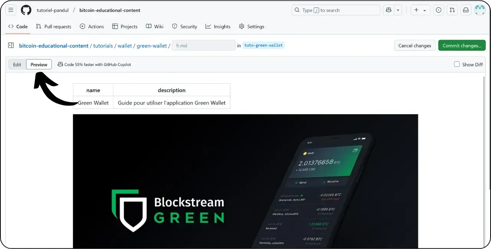
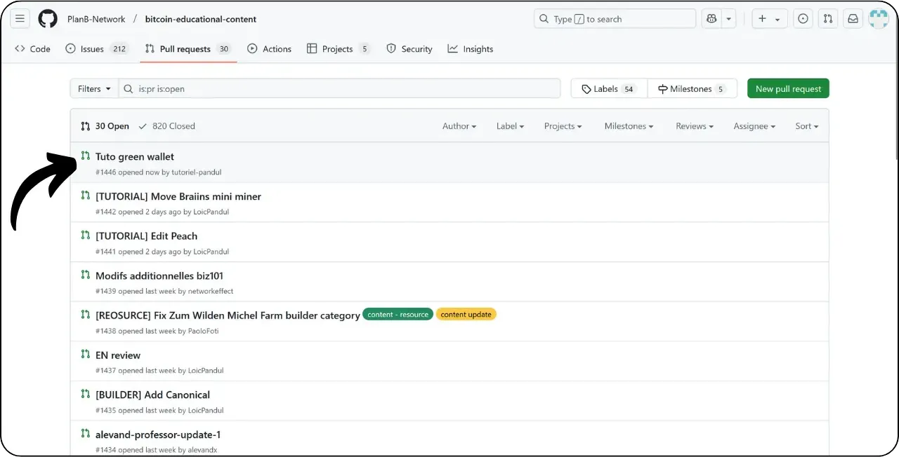

Avant de suivre ce tutoriel sur l'ajout d'un nouveau tutoriel, vous devez avoir complété quelques étapes préliminaires. Si ce n'est pas encore fait, je vous invite à consulter d'abord ce tutoriel introductif, puis à revenir ici :

https://planb.network/tutorials/others/contribution/write-tutorials-4d142a6a-9127-4ffb-9e0a-5aba29f169e2

Vous avez déjà :
- Choisi le thème de votre tutoriel ;
- Contacté l'équipe de Plan ₿ Network via [le groupe Telegram](https://t.me/PlanBNetwork_ContentBuilder) ou paolo@planb.network ;
- Choisi vos outils de contribution.

Dans ce tutoriel, nous allons voir comment ajouter votre tutoriel sur Plan ₿ Network en utilisant la version web de GitHub. Si vous maîtrisez déjà Git, ce tutoriel très détaillé n'est peut-être pas nécessaire pour vous. Je vous recommande plutôt de consulter un de ces 2 autres tutoriels, où je détaille les lignes directrices à suivre et les étapes pour effectuer les modifications depuis un environnement local :

- **Utilisateurs expérimentés** :

https://planb.network/tutorials/others/contribution/write-tutorials-git-expert-0ce1e490-c28f-4c51-b7e0-9a6ac9728410

- **Intermédiaire (GitHub Desktop)** :

https://planb.network/tutorials/others/contribution/write-tutorials-github-desktop-intermediate-4a36a052-1000-4191-890a-9a1dc65f8957

## Prérequis

Prérequis avant de commencer le tutoriel :

- Avoir un [compte GitHub](https://github.com/signup) ;
- Avoir un fork du [dépôt source de Plan ₿ Network](https://github.com/PlanB-Network/bitcoin-educational-content) ;
- Avoir [un profil de professeur sur Plan ₿ Network](https://planb.network/professors) (uniquement si vous proposez un tutoriel complet).

Si vous avez besoin d'aide pour obtenir ces prérequis, mes autres tutoriels vous aideront :

https://planb.network/tutorials/others/contribution/basics-of-github-471f7f00-8b5a-4b63-abb1-f1528b032bbb

https://planb.network/tutorials/others/contribution/create-github-account-a75fc39d-f0d0-44dc-9cd5-cd94aee0c07c

https://planb.network/tutorials/others/contribution/github-desktop-work-environment-5862003b-9d76-47f5-a9e0-5ec74256a8ba

https://planb.network/tutorials/others/contribution/create-teacher-profile-8ba9ba49-8fac-437a-a435-c38eebc8f8a4

Une fois que tout est en place et que vous avez votre fork du dépôt de Plan ₿ Network, vous allez pouvoir commencer l'ajout du tutoriel.

## 1 - Créer une nouvelle branche

Ouvrez votre navigateur et dirigez-vous vers la page de votre fork du dépôt de Plan ₿ Network. Il s'agit du fork que vous avez établi sur GitHub. L'URL de votre fork devrait ressembler à : `https://github.com/[votre-nom-d'utilisateur]/bitcoin-educational-content` :


Assurez-vous d'être sur la branche principale `dev` puis cliquez sur le bouton "*Sync fork*". Si votre fork n'est pas à jour, GitHub vous proposera de mettre à jour votre branche. Procédez à cette mise à jour :


Cliquez sur la branche `dev`, puis nommez votre branche de travail de manière à ce que son titre reflète clairement son objectif, en utilisant des tirets pour séparer les mots. Par exemple, si notre but est de rédiger un tutoriel sur l'utilisation de Green Wallet, la branche pourrait s'appeler : `tuto-green-wallet-loic`. Après avoir saisi un nom approprié, cliquez sur "*Create branch*" pour confirmer la création de votre nouvelle branche basée sur `dev` :


Vous devriez désormais vous trouver sur votre nouvelle branche de travail :


Cela signifie que toutes les modifications que vous effectuez seront enregistrées uniquement sur cette branche spécifique.

Pour chaque nouvel article que vous envisagez de publier, créez une nouvelle branche à partir de `dev`.

Une branche dans Git représente une version parallèle du projet, vous permettant de travailler sur des modifications sans affecter la branche principale, jusqu'à ce que votre travail soit prêt à être intégré.

## 2 - Ajouter les fichiers du tutoriel

Maintenant que la branche de travail est créée, il est temps de faire l'intégration de votre nouveau tutoriel.

Au sein des fichiers de votre branche, vous devrez trouver le sous-dossier approprié pour le placement de votre tutoriel. L'organisation des dossiers reflète les différentes sections du site web Plan ₿ Network. Dans notre exemple, puisque nous ajoutons un tutoriel sur Green Wallet, dirigez-vous vers le chemin suivant : `bitcoin-educational-content\tutorials\wallet` qui correspond à la section `WALLET` du site web :


Dans le dossier `wallet`, créez un nouveau répertoire spécifiquement dédié à votre tutoriel. Le nom de ce dossier doit clairement indiquer le logiciel abordé dans le tutoriel, en utilisant des tirets pour relier les mots. Pour mon exemple, le dossier sera nommé `green-wallet`. Cliquez sur "*Add File*" puis sur "*Create new file*" :


Entrez le nom du dossier suivi d'un slash `/` pour confirmer sa création en tant que dossier.


Dans ce nouveau sous-dossier dédié à votre tutoriel, il faut ajouter plusieurs éléments :
- Créez un dossier `assets`, destiné à recevoir toutes les illustrations nécessaires à votre tutoriel ;
- Au sein de ce dossier `assets`, il faut créer un sous-dossier nommé selon le code de langue originale du tutoriel. Par exemple, si le tutoriel est rédigé en anglais, ce sous-dossier doit être nommé `en`. Placez-y tous les visuels du tutoriel (schémas, images, captures d’écran, etc.).
- Un fichier `tutorial.yml` doit être créé pour y consigner les détails relatifs à votre tutoriel ;
- Un fichier en format markdown est à créer pour y rédiger le contenu effectif de votre tutoriel. Ce fichier doit être intitulé selon le code de la langue de rédaction. Par exemple, pour un tutoriel rédigé en français, le fichier devra s'appeler `fr.md`.

Pour résumer, voici la hiérarchie des fichiers (nous allons continuer de les créer dans la prochaine section) :

```
bitcoin-educational-content/
└── tutorials/
    └── wallet/ (à modifier avec la bonne catégorie)
        └── green-wallet/ (à modifier avec le nom du tuto)
            ├── assets/
            │   ├── fr/ (à modifier selon le code de langue approprié)
            ├── tutorial.yml
            └── fr.md (à modifier selon le code de langue approprié)
```

## 3 - Remplir le fichier YAML

Commençons par le fichier YAML. Dans la case de création d'un nouveau fichier, notez `tutorial.yml` :


Remplissez le fichier `tutorial.yml` en copiant le modèle suivant :

```
id: 

project_id: 

tags:
  - 
  - 
  - 

category: 

level: 

credits:
  professor: 

# Proofreading metadata

original_language:
proofreading:
  - language: 
    last_contribution_date:
    urgency:
    contributors_id:
      - 
    reward:
```

Voici le détail des champs obligatoires :

- **id** : Un UUID (_Universally Unique Identifier_) permettant d’identifier de manière unique le tutoriel. Vous pouvez le générer avec [un outil en ligne](https://www.uuidgenerator.net/version4). La seule contrainte est que cet UUID soit aléatoire pour ne pas avoir de conflit avec un autre UUID sur la plateforme ;

- **project_id** : L'UUID de l’entreprise ou de l’organisation derrière l’outil présenté dans le tutoriel [depuis la liste des projets](https://github.com/PlanB-Network/bitcoin-educational-content/tree/dev/resources/projects). Par exemple, si vous réalisez un tutoriel sur le logiciel Green Wallet, vous pouvez trouver ce `project_id` dans le fichier suivant : `bitcoin-educational-content/resources/projects/blockstream/project.yml`. Cette information est ajoutée dans le fichier YAML de votre tutoriel parce que Plan ₿ Network maintient une base de données de toutes les entreprises et organisations opérant sur Bitcoin ou des projets connexes. En ajoutant le `project_id` de l'entité liée à votre tutoriel, vous créez un lien entre les deux éléments ;

- **tags** : 2 ou 3 mots-clés pertinents liés au contenu du tutoriel, choisis exclusivement [dans la liste des tags de Plan ₿ Network](https://github.com/PlanB-Network/bitcoin-educational-content/blob/dev/docs/50-planb-tags.md) ;

- **category** : La sous-catégorie correspondant au contenu du tutoriel, selon la structure du site Plan ₿ Network (par exemple pour les wallets : `desktop`, `hardware`, `mobile`, `backup`) ;

- **level** : Le niveau de difficulté du tutoriel, parmi :
    - `beginner`
    - `intermediate`
    - `advanced`
    - `expert`

- **professor** : Votre `contributor_id` (mots BIP39) tel qu'affiché sur [votre profil professeur](https://github.com/PlanB-Network/bitcoin-educational-content/tree/dev/professors) ;

- **original_language** : La langue d’origine du tutoriel (par exemple `fr`, `en`, etc.) ;

- **proofreading** : Informations sur le processus de relecture. Remplissez la première partie, car la relecture de votre propre tutoriel compte comme une première validation :
    - **language** : Code de langue de la relecture (par exemple `fr`, `en`, etc.).
    - **last_contribution_date** : Date du jour.
    - **urgency** : Laissez vide.
    - **contributors_id** : Votre ID GitHub.
    - **reward** : Laissez vide.

Pour davantage de détails sur votre identifiant de professeur, reportez-vous au tutoriel correspondant :

https://planb.network/tutorials/others/contribution/create-teacher-profile-8ba9ba49-8fac-437a-a435-c38eebc8f8a4

Voici un exemple de fichier `tutorial.yml` complété pour un tutoriel sur le wallet Blockstream Green :

```
id: e84edaa9-fb65-48c1-a357-8a5f27996143

project_id: 3b2f45e6-d612-412c-95ba-cf65b49aa5b8

tags:
  - wallets
  - software
  - keys

category: mobile

level: beginner

credits:
  professor: pretty-private

# Proofreading metadata

original_language: fr
proofreading:
  - language: fr
    last_contribution_date: 2024-11-20
    urgency:
    contributors_id:
      - LoicPandul
    reward:
```

Une fois la modification de votre fichier `tutorial.yml` achevée, enregistrez votre document en cliquant sur le bouton "*Commit changes...*" :


Ajoutez un titre et une description, et assurez-vous que le commit soit réalisé sur la branche de travail que vous avez créée au début de ce tutoriel. Puis confirmez en cliquant sur "*Commit changes*".


## 4 - Créer les sous-dossiers pour les images

Cliquez de nouveau sur "*Add File*" puis sur "*Create new file*" :


Entrez `assets` suivi d'un slash `/` pour créer le dossier :


Répétez cette étape dans le dossier `/assets` pour créer le sous-dossier de langue, par exemple `fr` si votre tutoriel est en français :


Dans ce dossier, créez un fichier factice pour obliger GitHub à conserver votre dossier (qui sinon serait vide). Nommez ce fichier `.gitkeep`. Ensuite, cliquez sur "*Commit changes...*".


Assurez-vous à nouveau que vous êtes sur la branche de travail correcte, puis cliquez sur "*Commit changes*".


## 5 - Créer le fichier Markdown

Maintenant, nous allons créer le fichier qui accueillera votre tutoriel, nommé selon le code de votre langue, comme par exemple `fr.md` si l'on rédige en français. Accédez au dossier de votre tutoriel :


Cliquez sur "*Add file*", puis sur "*Create new file*".


Nommez le fichier en utilisant le code de votre langue. Dans mon cas, le tutoriel étant rédigé en français, je nomme mon fichier `fr.md`. L'extension `.md` indique que le fichier est au format Markdown.


Nous commençons par remplir la section `Properties` en haut du document. Ajoutez manuellement et remplissez le bloc de code suivant (les clés `name:` et `description:` doivent être conservées en anglais, mais leur valeur doit être rédigée dans la langue utilisée pour votre tutoriel) :

```
---
name: [Titre]
description: [Description]
---
```


Remplissez le nom de votre tutoriel ainsi qu'une courte description de celui-ci :


Ajoutez ensuite le chemin de l'image de couverture au début de votre tutoriel. Pour ce faire, notez :

```

```

Cette syntaxe vous sera utile chaque fois que l'ajout d'une image dans votre tutoriel sera nécessaire. Le point d'exclamation signale qu'il s'agit d'une image, dont le texte alternatif (alt) est spécifié entre les crochets. Le chemin d'accès à l'image est indiqué entre les parenthèses :


Cliquez sur le bouton "*Commit changes...*" pour enregistrer ce fichier.


Vérifiez que vous êtes sur la bonne branche, puis confirmez le commit.


Votre dossier de tutoriel devrait maintenant se présenter de cette manière, selon le code de votre langue :


## 6 - Ajouter le logo et la couverture

Au sein du dossier `assets`, vous devez ajouter un fichier nommé `logo.webp`, qui servira de vignette pour votre article. Cette image doit obligatoirement être au format `.webp` et doit respecter une dimension carrée afin de s'harmoniser avec l'interface utilisateur.

Vous avez la liberté de choisir le logo du logiciel traité dans le tutoriel ou toute autre image pertinente, à condition que celle-ci soit libre de droits. En complément, ajoutez également au même endroit une image intitulée `cover.webp`. Celle-ci sera affichée en haut de votre tutoriel. Veillez à ce que cette image, tout comme le logo, respecte les droits d'utilisation et soit adaptée au contexte de votre tutoriel.

Pour ajouter des images dans le dossier `/assets`, vous pouvez les glisser-déposer depuis vos fichiers locaux. Assurez-vous que vous êtes bien dans le dossier `/assets` et sur la bonne branche de travail, puis cliquez sur "*Commit changes*".


Vous devriez maintenant voir les images apparaître dans le dossier.


## 7 - Rédiger le tutoriel

Poursuivez la rédaction de votre tutoriel en notant votre contenu dans le fichier Markdown avec le code de langue (dans mon exemple, en français, c'est le fichier `fr.md`). Accédez au fichier et cliquez sur l'icône du crayon :


Commencez la rédaction de votre tutoriel. Lorsque vous ajoutez un sous-titre, utilisez le formatage Markdown approprié en préfixant le texte avec `##` :


Alternez entre la vue "*Edit*" et la vue "*Preview*" pour mieux visualiser le rendu.



Pour enregistrer votre travail, cliquez sur "*Commit Changes...*", assurez-vous d'être sur la bonne branche de travail, puis confirmez en cliquant de nouveau sur "*Commit Changes*".


## 8 - Ajouter des visuels

Le sous-dossier de langues dans le dossier `/assets` (dans mon exemple : `/assets/fr`) permet de stocker les schémas et les visuels qui accompagneront votre tutoriel. Autant que possible, évitez d'inclure du texte dans vos images pour rendre votre contenu accessible à un public international. Bien sûr, le logiciel présenté contiendra du texte, mais si vous ajoutez des schémas ou des indications supplémentaires sur les captures d'écran du logiciel, faites-le sans texte ou, si cela s'avère indispensable, utilisez l'anglais.

Pour nommer vos images, utilisez simplement des numéros correspondant à leur ordre d'apparition dans le tutoriel, formatés sur deux chiffres (ou trois chiffres si votre tutoriel contient plus de 99 images). Par exemple, nommez votre première image `01.webp`, votre deuxième `02.webp`, et ainsi de suite.

Le format de vos images doit être en `.webp` exclusivement. Si besoin, vous pouvez utiliser [mon logiciel de conversion d'images](https://github.com/LoicPandul/ImagesConverter).


Maintenant que vous avez ajouté vos images dans le sous-dossier, vous pouvez supprimer le fichier factice `.gitkeep`. Ouvrez ce fichier, cliquez sur les trois petits points en haut à droite, puis sur "*Delete file*".


Enregistrez vos modifications en cliquant sur "*Commit changes...*".


Pour insérer un schéma présent dans votre sous-dossier dans votre document de rédaction, utilisez la commande Markdown suivante, en prenant soin de spécifier le texte alternatif approprié ainsi que le chemin correct de l'image en fonction de votre langue :

```

```

Le point d'exclamation au début indique qu'il s'agit d'une image. Le texte alternatif, qui aide à l'accessibilité et au référencement, est placé entre les crochets. Enfin, le chemin d'accès à l'image est indiqué entre les parenthèses.


Si vous souhaitez créer vos propres schémas, veillez à respecter la charte graphique de Plan ₿ Network pour assurer la cohérence visuelle :
- **Police** : Utilisez [Rubik](https://fonts.google.com/specimen/Rubik) ;
- **Couleurs** :
	- Orange : #FF5C00
	- Noir : #000000
	- Blanc : #FFFFFF

**Il est impératif que tous les visuels intégrés à vos tutoriels soient libres de droit ou respectent la licence du fichier source**. Aussi, l'intégralité des schémas publiés sur Plan ₿ Network sont mis à disposition sous licence CC-BY-SA, de la même manière que le texte.

**-> Astuce :** Lors du partage de fichiers en public, tels que des images, il est important de supprimer les métadonnées superflues. Celles-ci peuvent contenir des informations sensibles, comme des données de localisation, des dates de création, ou encore des détails concernant l'auteur. Afin de protéger votre vie privée, il est conseillé de supprimer ces métadonnées. Pour simplifier cette opération, vous pouvez recourir à des outils spécialisés comme [Exif Cleaner](https://exifcleaner.com/), qui offre la possibilité de nettoyer les métadonnées d'un document grâce à un simple drag-and-drop.

## 9 - Proposer le tutoriel

Une fois que vous avez terminé la rédaction de votre tutoriel dans la langue de votre choix, l'étape suivante consiste à soumettre une **Pull Request**. L'administrateur se chargera ensuite d'ajouter les traductions manquantes de votre tutoriel, grâce à notre méthode de traduction automatisée avec relecture humaine.

Pour procéder à la Pull Request, après avoir enregistré tous vos changements, cliquez sur le bouton "*Contribute*", puis sur "*Open pull request*" :


Une Pull Request est une demande faite pour intégrer les modifications de votre branche vers la branche de principale du dépôt de Plan ₿ Network, qui permet la revue et la discussion des changements avant leur fusion.

Avant de continuer, vérifiez soigneusement en bas de l'interface que ces modifications correspondent bien à ce que vous attendiez :


Assurez-vous, en haut de l'interface, que votre branche de travail soit bien fusionnée sur la branche `dev` du dépôt Plan ₿ Network (qui est la branche principale).

Indiquez un titre qui résume brièvement les modifications que vous souhaitez fusionner avec le dépôt source. Ajoutez un bref commentaire décrivant ces changements (si vous avez un numéro d'issue associé à la création de votre tutoriel, pensez à noter en commentaire `Closes #{le numéro de l'issue}`), puis cliquez sur le bouton vert "*Create pull request*" pour confirmer la demande de fusion :


Votre PR sera alors visible dans l'onglet "*Pull Request*" du dépôt principal de Plan ₿ Network. Il ne vous reste plus qu'à patienter jusqu'à ce qu'un administrateur vous contacte pour confirmer la fusion de votre contribution ou pour solliciter d'éventuelles modifications complémentaires.



Après la fusion de votre PR avec la branche principale, il est recommandé de supprimer votre branche de travail (dans mone exemple : `tuto-green-wallet`) pour maintenir un historique propre sur votre fork. GitHub vous proposera cette option automatiquement sur la page de votre PR :


Si vous désirez apporter des modifications à votre contribution après avoir déjà soumis votre PR, la démarche à suivre dépend de l'état actuel de votre PR :
- Si votre PR est toujours ouverte et n'a pas encore été fusionnée, effectuez les modifications sur la même branche de travail. Les modifications commit s'ajouteront à votre PR encore ouverte ;
- Dans le cas où votre PR a déjà été fusionnée avec la branche principale, vous devrez refaire le processus depuis le début en créant une nouvelle branche, puis en soumettant une nouvelle PR. Assurez-vous que votre fork soit synchronisé avec le dépôt source de Plan ₿ Network sur la branche `dev` avant de procéder.

Si vous rencontrez des difficultés techniques pour soumettre votre tutoriel, n'hésitez pas à demander de l'aide sur [notre groupe Telegram dédié aux contributions](https://t.me/PlanBNetwork_ContentBuilder). Merci !
