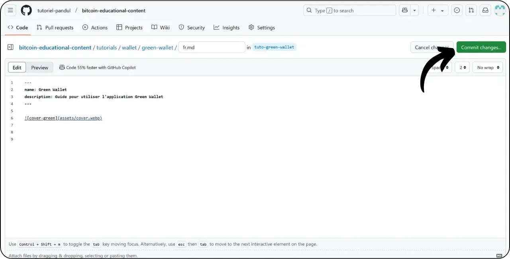
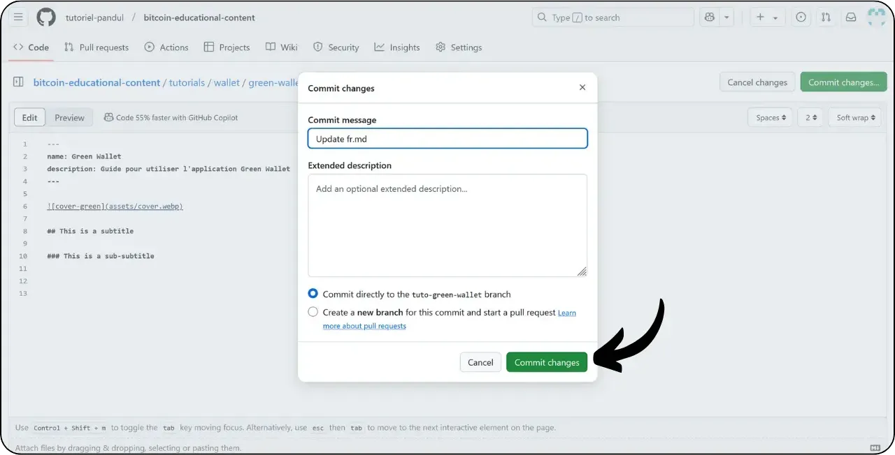

Antes de seguir este tutorial sobre como adicionar um novo tutorial, é necessário ter concluído algumas etapas preliminares. Se ainda não o fez, consulte primeiro este tutorial introdutório e depois volte aqui:

https://planb.network/tutorials/others/contribution/write-tutorials-4d142a6a-9127-4ffb-9e0a-5aba29f169e2

Já tem :


- Escolha um tema para o seu tutorial;
- Contactou a equipa do Plano ₿ Network através do [grupo Telegram] (https://t.me/PlanBNetwork_ContentBuilder) ou paolo@planb.network ;
- Escolha as suas ferramentas de contribuição.

Neste tutorial, veremos como adicionar seu tutorial ao Plan ₿ Network usando a versão web do GitHub. Se você já domina o Git, este tutorial muito detalhado pode não ser necessário para você. Em vez disso, recomendo que você confira um desses outros 2 tutoriais, onde detalho as diretrizes a serem seguidas e as etapas para fazer alterações de um arquivo :


- Utilizadores experientes** :

https://planb.network/tutorials/others/contribution/write-tutorials-git-expert-0ce1e490-c28f-4c51-b7e0-9a6ac9728410

- Intermediário (GitHub Desktop)** :

https://planb.network/tutorials/others/contribution/write-tutorials-github-desktop-intermediate-4a36a052-1000-4191-890a-9a1dc65f8957

## Pré-requisitos

Pré-requisitos antes de iniciar o tutorial :


- Ter uma [conta GitHub](https://github.com/signup);
- Ter uma bifurcação do repositório de fontes do [Plano ₿ Rede] (https://github.com/PlanB-Network/bitcoin-educational-content);
- Ter [um perfil de professor no Plan ₿ Network](https://planb.network/professors) (apenas se oferecer uma tutoria completa).

Se precisar de ajuda para obter estes pré-requisitos, os meus outros tutoriais irão ajudá-lo:

https://planb.network/tutorials/others/contribution/basics-of-github-471f7f00-8b5a-4b63-abb1-f1528b032bbb

https://planb.network/tutorials/others/contribution/create-github-account-a75fc39d-f0d0-44dc-9cd5-cd94aee0c07c

https://planb.network/tutorials/others/contribution/github-desktop-work-environment-5862003b-9d76-47f5-a9e0-5ec74256a8ba

https://planb.network/tutorials/others/contribution/create-teacher-profile-8ba9ba49-8fac-437a-a435-c38eebc8f8a4

Quando tudo estiver no lugar e você tiver sua bifurcação do repositório Plan ₿ Network, você pode começar a adicionar o tutorial.

## 1 - Criar uma nova sucursal

Abra o seu navegador e navegue para a sua página de bifurcação no repositório Plan ₿ Network. Esta é a bifurcação que você estabeleceu no GitHub. O URL da sua bifurcação deve ter a seguinte aparência: `https://github.com/[your-username]/bitcoin-educational-content` :


Certifique-se de que está no ramo principal `dev` e, em seguida, clique no botão "*Sync fork*". Se a sua bifurcação não estiver actualizada, o GitHub pedir-lhe-á para atualizar o seu ramo. Prossiga com esta atualização:


Clique no ramo `dev` e, em seguida, nomeie seu ramo de trabalho de modo que seu título reflita claramente seu objetivo, usando traços para separar as palavras. Por exemplo, se nosso objetivo é escrever um tutorial sobre o uso da Green Wallet, o ramo poderia ser chamado: `tuto-green-wallet-loic`. Depois de introduzir um nome adequado, clique em "*Create branch*" para confirmar a criação do seu novo ramo baseado em `dev` :


Agora deve estar no seu novo ramo de trabalho:


Isto significa que quaisquer alterações que faça serão guardadas apenas nesse ramo específico.

Para cada novo artigo que você planeja publicar, crie um novo ramo a partir de `dev`.

Um ramo no Git representa uma versão paralela do projeto, permitindo-lhe trabalhar em modificações sem afetar o ramo principal, até que o seu trabalho esteja pronto para ser integrado.

## 2 - Adicionar ficheiros de tutorial

Agora que o ramo de trabalho foi criado, é hora de integrar seu novo tutorial.

Dentro dos seus ficheiros de ramificação, terá de encontrar a subpasta adequada para a colocação do seu tutorial. A organização das pastas reflecte as diferentes secções do sítio Web Plan ₿ Network. No nosso exemplo, uma vez que estamos a adicionar um tutorial sobre a Green Wallet, vá para o seguinte caminho: `bitcoin-educational-content\tutorials\wallet` que corresponde à secção `WALLET` do site:


Na pasta `wallet`, crie um novo diretório especificamente dedicado ao seu tutorial. O nome dessa pasta deve indicar claramente o software abordado no tutorial, usando hífens para conectar as palavras. No meu exemplo, a pasta chamar-se-á `green-wallet`. Clique em "*Adicionar ficheiro*" e depois em "*Criar novo ficheiro*":


Introduza o nome da pasta seguido de uma barra `/` para confirmar a sua criação como pasta.


Nesta nova subpasta dedicada ao seu tutorial, tem de adicionar vários itens:


- Crie uma pasta `assets` para guardar todas as ilustrações necessárias para o seu tutorial;
- Dentro desta pasta `assets`, crie uma subpasta nomeada de acordo com o código do idioma original do tutorial. Por exemplo, se o tutorial for escrito em inglês, esta subpasta deve ser nomeada `en`. Coloque todos os elementos visuais do tutorial (diagramas, imagens, capturas de ecrã, etc.) nesta pasta.
- Um arquivo `tutorial.yml` deve ser criado para registrar os detalhes do seu tutorial;
- Deve ser criado um ficheiro markdown para escrever o conteúdo real do seu tutorial. Este ficheiro deve ser nomeado de acordo com o código da língua em que está escrito. Por exemplo, para um tutorial escrito em francês, o arquivo deve ser chamado `fr.md`.

Para resumir, eis a hierarquia dos ficheiros (continuaremos a criá-los na próxima secção):

```
bitcoin-educational-content/
└── tutorials/
└── wallet/ (à modifier avec la bonne catégorie)
└── green-wallet/ (à modifier avec le nom du tuto)
├── assets/
│   ├── fr/ (à modifier selon le code de langue approprié)
├── tutorial.yml
└── fr.md (à modifier selon le code de langue approprié)
```

## 3 - Preencher o ficheiro YAML

Vamos começar com o ficheiro YAML. Na caixa para criar um novo ficheiro, introduza `tutorial.yml` :


Preencha o ficheiro `tutorial.yml` copiando o seguinte modelo:

```
id:
project_id:
tags:
-
-
-
category:
level:
credits:
professor:
# Proofreading metadata
original_language:
proofreading:
- language:
last_contribution_date:
urgency:
contributors_id:
-
reward:
```

Eis os campos obrigatórios:


- id**: Um UUID (_Universally Unique Identifier_) para identificar exclusivamente o tutorial. Pode gerá-lo com [uma ferramenta em linha] (https://www.uuidgenerator.net/version4). A única restrição é que este UUID deve ser aleatório, de modo a não entrar em conflito com outro UUID na plataforma;
- project_id** : O UUID da empresa ou organização por detrás da ferramenta apresentada no tutorial [a partir da lista de projectos] (https://github.com/PlanB-Network/bitcoin-educational-content/tree/dev/resources/projects). Por exemplo, se estiver a fazer um tutorial sobre o software Green Wallet, pode encontrar este `project_id` no seguinte ficheiro: `bitcoin-educational-content/resources/projects/blockstream/project.yml`. Esta informação é adicionada no arquivo YAML do seu tutorial porque o Plan ₿ Network mantém um banco de dados de todas as empresas e organizações que operam em Bitcoin ou projetos relacionados. Ao adicionar o `project_id` da entidade vinculada ao seu tutorial, você cria um link entre os dois elementos;
- tags**: 2 ou 3 palavras-chave relevantes relacionadas com o conteúdo do tutorial, escolhidas exclusivamente [da lista de etiquetas do Plano ₿ Rede] (https://github.com/PlanB-Network/bitcoin-educational-content/blob/dev/docs/50-planb-tags.md);
- categoria** : A subcategoria correspondente ao conteúdo do tutorial, de acordo com o Plano ₿ Estrutura da rede (por exemplo, para carteiras: `desktop`, `hardware`, `mobile`, `backup`) ;
- nível** : Nível de dificuldade do tutorial, de :
    - principiante`
    - `intermédio`
    - `avançado`
    - "especialista
- professor**: O seu `contributor_id` (palavras BIP39) tal como aparece no [seu perfil de professor] (https://github.com/PlanB-Network/bitcoin-educational-content/tree/dev/professors);
- original_language** : A língua original do tutorial (por exemplo, `fr`, `en`, etc.) ;
- revisão**: Informações sobre o processo de revisão. Preencha a primeira parte, porque a revisão do seu próprio tutorial conta como uma primeira validação:
    - língua**: Código da língua de revisão (por exemplo, `fr`, `en`, etc.).
    - last_contribution_date**: A data de hoje.
    - urgência** : Deixar em branco.
    - contributors_id** : O seu ID do GitHub.
    - prémio** : Deixar em branco.

Para mais informações sobre o ID do professor, consulte o tutorial correspondente :

https://planb.network/tutorials/others/contribution/create-teacher-profile-8ba9ba49-8fac-437a-a435-c38eebc8f8a4

Aqui está um exemplo de um arquivo `tutorial.yml` concluído para um tutorial sobre a carteira Blockstream Green:

```
id: e84edaa9-fb65-48c1-a357-8a5f27996143
project_id: 3b2f45e6-d612-412c-95ba-cf65b49aa5b8
tags:
- wallets
- software
- keys
category: mobile
level: beginner
credits:
professor: pretty-private
# Proofreading metadata
original_language: fr
proofreading:
- language: fr
last_contribution_date: 2024-11-20
urgency:
contributors_id:
- LoicPandul
reward:
```

Quando tiver terminado de modificar o seu ficheiro `tutorial.yml`, guarde o seu documento clicando no botão "*Commit changes...*":


Adicione um título e uma descrição e certifique-se de que o commit é feito no ramo que criou no início deste tutorial. Em seguida, confirme clicando em "*Commit changes*".


## 4 - Criar subpastas para imagens

Clique novamente em "*Adicionar ficheiro*" e depois em "*Criar novo ficheiro*" :


Introduza `assets` seguido de uma barra `/` para criar a pasta:


Repita este passo na pasta `/assets` para criar a subpasta de idioma, por exemplo `fr` se o seu tutorial estiver em francês:


Nesta pasta, crie um ficheiro fictício para forçar o GitHub a manter a sua pasta (que de outra forma estaria vazia). Dê a este ficheiro o nome `.gitkeep`. Em seguida, clique em "*Commit changes...*".


Verifique novamente se está no ramo correto e, em seguida, clique em "*Commit changes*".


## 5 - Criar o ficheiro Markdown

Agora vamos criar o ficheiro que irá alojar o seu tutorial, nomeado de acordo com o código da sua língua, por exemplo `fr.md` se estivermos a escrever em francês. Vá para a pasta do seu tutorial :


Clique em "Adicionar ficheiro*" e depois em "Criar novo ficheiro*".


Dê um nome ao ficheiro utilizando o código da sua língua. No meu caso, como o tutorial está escrito em francês, nomeio o meu ficheiro `fr.md`. A extensão `.md` indica que o ficheiro está no formato Markdown.


Começamos por preencher a secção `Properties` no topo do documento. Adicione e preencha manualmente o seguinte bloco de código (as chaves `name:` e `description:` devem ser mantidas em inglês, mas seus valores devem ser escritos no idioma usado para o seu tutorial):

```
---
name: [Titre]
description: [Description]
---
```


Preencha o nome do seu tutorial e uma breve descrição:


Em seguida, adicione o caminho para a imagem de capa no início do seu tutorial. Para fazer isso, observe :

```

```

Esta sintaxe será útil sempre que precisar de adicionar uma imagem ao seu tutorial. O ponto de exclamação indica uma imagem, cujo texto alternativo (alt) é especificado entre os parêntesis rectos. O caminho para a imagem é indicado entre os parêntesis:


Clique no botão "*Commit changes...*" para guardar este ficheiro.



Verifique se está no ramo correto e, em seguida, confirme a confirmação.


A sua pasta de tutoriais deve agora ter o seguinte aspeto, de acordo com o seu código de idioma:


## 6 - Adicionar logótipo e capa

Dentro da pasta `assets`, é necessário adicionar um ficheiro chamado `logo.webp`, que servirá como miniatura para o seu artigo. Esta imagem deve estar no formato `.webp` e deve ter um tamanho quadrado para corresponder à interface do utilizador.

É livre de escolher o logótipo do software utilizado no tutorial, ou qualquer outra imagem relevante, desde que seja isenta de direitos de autor. Para além disso, adicione uma imagem intitulada `cover.webp` no mesmo local. Esta será exibida no topo do seu tutorial. Certifique-se de que esta imagem, tal como o logótipo, respeita os direitos de utilização e é adequada ao contexto do seu tutorial.

Para adicionar imagens à pasta `/assets`, pode arrastá-las e largá-las a partir dos seus ficheiros locais. Certifique-se de que está na pasta `/assets` e no ramo correto e, em seguida, clique em "*Commit changes*".


As imagens devem agora aparecer na pasta.


## 7 - Escrever o tutorial

Continue a escrever o seu tutorial, anotando o seu conteúdo no ficheiro Markdown com o código da língua (no meu exemplo, em francês, é o ficheiro `fr.md`). Vá para o ficheiro e clique no ícone do lápis :


Comece a escrever o seu tutorial. Ao adicionar um subtítulo, use a formatação Markdown apropriada, prefixando o texto com `##` :


Alternar entre as vistas "*Editar*" e "*Visualizar*" para melhor visualizar o processamento.


Para guardar o seu trabalho, clique em "*Commit Changes...*", certifique-se de que está no ramo correto e, em seguida, confirme clicando novamente em "*Commit Changes*".



## 8 - Adicionar elementos visuais

A subpasta de idioma na pasta `/assets` (no meu exemplo: `/assets/en`) é utilizada para armazenar os diagramas e imagens que acompanharão o seu tutorial. Na medida do possível, evite incluir texto nas suas imagens para tornar o seu conteúdo acessível a um público internacional. É claro que o software apresentado conterá texto, mas se acrescentar esquemas ou indicações adicionais nas imagens de ecrã do software, faça-o sem texto ou, se for essencial, utilize o inglês.

Para nomear suas imagens, basta usar números correspondentes à ordem de aparecimento no tutorial, formatados com dois dígitos (ou três dígitos se o tutorial contiver mais de 99 imagens). Por exemplo, nomeie a primeira imagem como `01.webp`, a segunda como `02.webp`, e assim por diante.

As suas imagens devem estar apenas no formato `.webp`. Se necessário, pode utilizar o [meu software de conversão de imagens] (https://github.com/LoicPandul/ImagesConverter).


Agora que já adicionou as suas imagens à subpasta, pode apagar o ficheiro fictício `.gitkeep`. Abra este ficheiro, clique nos três pequenos pontos no canto superior direito e depois em "*Delete file*".


Guarde as suas alterações clicando em "*Commit changes...*".


Para inserir um diagrama da sua subpasta no seu documento editorial, utilize o seguinte comando Markdown, tendo o cuidado de especificar o texto alternativo apropriado e o caminho de imagem correto para a sua língua:

```

```

O ponto de exclamação no início indica uma imagem. O texto alternativo, que ajuda na acessibilidade e na referenciação, é colocado entre parêntesis rectos. Finalmente, o caminho para a imagem é indicado entre parêntesis.


Se pretender criar os seus próprios esquemas, certifique-se de que segue as diretrizes gráficas do Plano ₿ Rede para garantir a consistência visual:


- Tipo de letra**: Utilizar [Rubik](https://fonts.google.com/specimen/Rubik);
- Cores** :
 - Laranja: #FF5C00
 - Preto : #000000
 - Branco: #FFFFFF

**É imperativo que todos os elementos visuais integrados nos seus tutoriais estejam isentos de direitos de autor ou respeitem a licença do ficheiro fonte**. Por conseguinte, todos os diagramas publicados na Plan ₿ Network são disponibilizados ao abrigo de uma licença CC-BY-SA, da mesma forma que o texto.

**-> Dica:** Ao partilhar ficheiros em público, como imagens, é importante remover metadados supérfluos. Estes podem conter informações sensíveis, tais como dados de localização, datas de criação e detalhes do autor. Para proteger a sua privacidade, é uma boa ideia remover estes metadados. Para simplificar esta operação, pode utilizar ferramentas especializadas, como o [Exif Cleaner] (https://exifcleaner.com/), que lhe permite limpar os metadados de um documento com um simples arrastar e largar.

## 9 - Propor o tutorial

Quando tiver terminado de escrever o seu tutorial na língua da sua escolha, o próximo passo é submeter um **Pull Request**. O administrador irá então adicionar as traduções em falta ao seu tutorial, utilizando o nosso método de tradução automática com revisão humana.

Para prosseguir com o Pull Request, depois de guardar todas as alterações, clique no botão "*Contribute*" e depois em "*Open pull request*" :


Um Pull Request é um pedido feito para integrar as alterações do seu ramo no ramo principal do repositório Plan ₿ Network, o que permite a revisão e discussão das alterações antes de serem fundidas.

Antes de continuar, verifique cuidadosamente na parte inferior da interface se estas alterações são as esperadas:


Certifique-se, no topo da interface, que o seu ramo de trabalho está fundido com o ramo `dev` do repositório Plan ₿ Network (que é o ramo principal).

Insira um título que resuma brevemente as alterações que você deseja mesclar com o repositório de origem. Adicione um breve comentário descrevendo essas alterações (se você tiver um número de problema associado à criação do seu tutorial, lembre-se de anotar `Fecha #{número de problema}` como um comentário) e, em seguida, clique no botão verde "*Criar pull request*" para confirmar a solicitação de merge:


O seu PR ficará então visível no separador "*Pull Request*" do repositório principal do Plan ₿ Network. Tudo o que tem de fazer agora é esperar que um administrador o contacte para confirmar que a sua contribuição foi incorporada ou para solicitar quaisquer outras modificações.


Depois de mesclar seu PR com o ramo principal, recomendamos excluir seu ramo de trabalho (no meu exemplo: `tuto-green-wallet`) para manter um histórico limpo de sua bifurcação. O GitHub oferecerá automaticamente essa opção na sua página de PR:


Se pretender alterar a sua contribuição depois de já ter apresentado o seu RP, os passos a seguir dependem do estado atual do seu RP:


- Se o seu PR ainda estiver aberto e ainda não tiver sido fundido, faça as alterações no mesmo ramo de trabalho. As alterações do commit serão adicionadas ao seu PR ainda aberto;
- No caso de o seu PR já ter sido fundido com o ramo principal, terá de refazer o processo desde o início, criando um novo ramo e, em seguida, submetendo um novo PR. Certifique-se de que a sua bifurcação está sincronizada com o repositório de fontes da Plan ₿ Network no ramo `dev` antes de prosseguir.

Se tiveres dificuldades técnicas para enviar o teu tutorial, não hesites em pedir ajuda no [nosso grupo de Telegrama dedicado às contribuições] (https://t.me/PlanBNetwork_ContentBuilder). Muito obrigado!