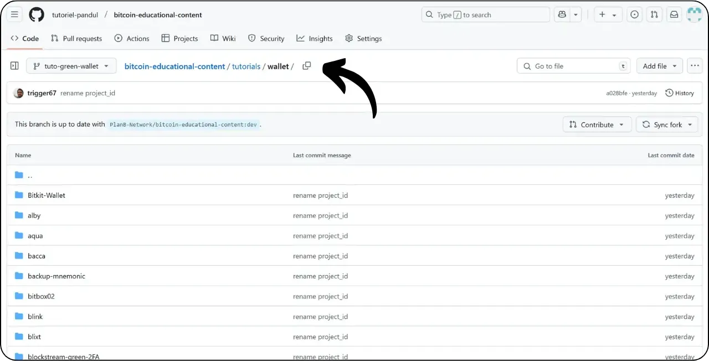
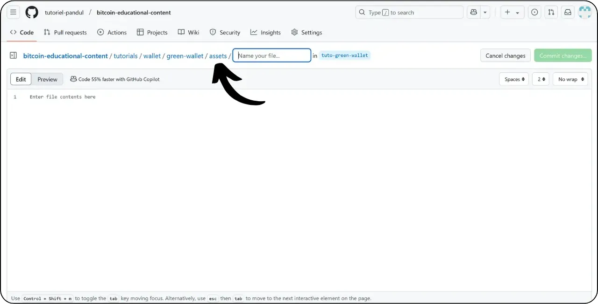
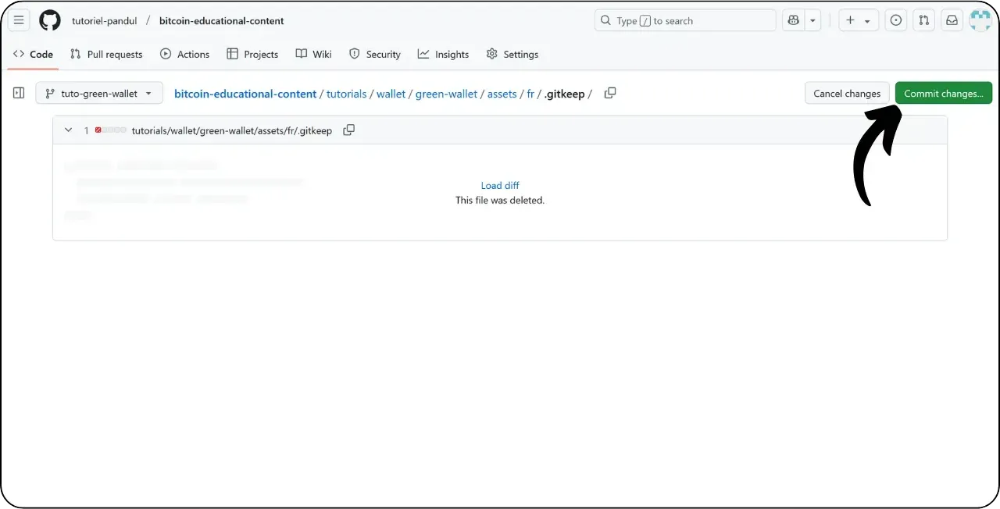

Antes de seguir este tutorial sobre como adicionar um novo tutorial, é necessário ter concluído algumas etapas preliminares. Se ainda não o fez, consulte primeiro este tutorial introdutório e depois volte aqui:

https://planb.network/tutorials/others/contribution/write-tutorials-4d142a6a-9127-4ffb-9e0a-5aba29f169e2
Já tem :


- Escolha um tema para o seu tutorial;
- Contactou a equipa do Plano ₿ Network através do [grupo Telegram] (https://t.me/PlanBNetwork_ContentBuilder) ou paolo@planb.network ;
- Escolha as suas ferramentas de contribuição.

Neste tutorial, veremos como adicionar seu tutorial ao Plan ₿ Network usando a versão web do GitHub. Se você já domina o Git, este tutorial muito detalhado pode não ser necessário para você. Em vez disso, recomendo que você confira um desses outros 2 tutoriais, onde detalho as diretrizes a serem seguidas e as etapas para fazer alterações de um arquivo :


- Utilizadores experientes** :

https://planb.network/tutorials/others/contribution/write-tutorials-git-expert-0ce1e490-c28f-4c51-b7e0-9a6ac9728410

- Intermediário (GitHub Desktop)** :

https://planb.network/tutorials/others/contribution/write-tutorials-github-desktop-intermediate-4a36a052-1000-4191-890a-9a1dc65f8957
## Pré-requisitos

Pré-requisitos antes de iniciar o tutorial :


- Ter uma [conta GitHub](https://github.com/signup);
- Ter uma bifurcação do repositório de fontes do [Plano ₿ Rede] (https://github.com/PlanB-Network/bitcoin-educational-content);
- Ter [um perfil de professor no Plan ₿ Network](https://planb.network/professors) (apenas se oferecer uma tutoria completa).

Se precisar de ajuda para obter estes pré-requisitos, os meus outros tutoriais irão ajudá-lo:

https://planb.network/tutorials/others/contribution/basics-of-github-471f7f00-8b5a-4b63-abb1-f1528b032bbb
https://planb.network/tutorials/others/contribution/create-github-account-a75fc39d-f0d0-44dc-9cd5-cd94aee0c07c
https://planb.network/tutorials/others/contribution/github-desktop-work-environment-5862003b-9d76-47f5-a9e0-5ec74256a8ba
https://planb.network/tutorials/others/contribution/create-teacher-profile-8ba9ba49-8fac-437a-a435-c38eebc8f8a4
Quando tudo estiver no lugar e você tiver sua bifurcação do repositório Plan ₿ Network, você pode começar a adicionar o tutorial.

## 1 - Criar uma nova sucursal

Abra o seu navegador e navegue para a sua página de bifurcação no repositório Plan ₿ Network. Esta é a bifurcação que você estabeleceu no GitHub. O URL da sua bifurcação deve ter a seguinte aparência: `https://github.com/[your-username]/bitcoin-educational-content` :


Certifique-se de que está no ramo principal `dev` e, em seguida, clique no botão "*Sync fork*". Se a sua bifurcação não estiver actualizada, o GitHub pedir-lhe-á para atualizar o seu ramo. Prossiga com esta atualização:


Clique no ramo `dev` e, em seguida, nomeie seu ramo de trabalho de modo que seu título reflita claramente seu objetivo, usando traços para separar as palavras. Por exemplo, se nosso objetivo é escrever um tutorial sobre o uso da Green Wallet, o ramo poderia ser chamado: `tuto-green-wallet-loic`. Depois de introduzir um nome adequado, clique em "*Create branch*" para confirmar a criação do seu novo ramo baseado em `dev` :


Agora deve estar no seu novo ramo de trabalho:


Isto significa que quaisquer alterações que faça serão guardadas apenas nesse ramo específico.

Para cada novo artigo que você planeja publicar, crie um novo ramo a partir de `dev`.

Um ramo no Git representa uma versão paralela do projeto, permitindo-lhe trabalhar em modificações sem afetar o ramo principal, até que o seu trabalho esteja pronto para ser integrado.

## 2 - Adicionar ficheiros de tutorial

Agora que o ramo de trabalho foi criado, é hora de integrar seu novo tutorial.

Dentro dos seus ficheiros de ramificação, terá de encontrar a subpasta adequada para a colocação do seu tutorial. A organização das pastas reflecte as diferentes secções do sítio Web Plan ₿ Network. No nosso exemplo, uma vez que estamos a adicionar um tutorial sobre a Green Wallet, vá para o seguinte caminho: `bitcoin-educational-content\tutorials\wallet` que corresponde à secção `WALLET` do site:



Na pasta `wallet`, crie um novo diretório especificamente dedicado ao seu tutorial. O nome dessa pasta deve indicar claramente o software abordado no tutorial, usando hífens para conectar as palavras. No meu exemplo, a pasta chamar-se-á `green-wallet`. Clique em "*Adicionar ficheiro*" e depois em "*Criar novo ficheiro*":


Introduza o nome da pasta seguido de uma barra `/` para confirmar a sua criação como pasta.


Nesta nova subpasta dedicada ao seu tutorial, tem de adicionar vários itens:


- Crie uma pasta `assets` para guardar todas as ilustrações necessárias para o seu tutorial;
- Dentro desta pasta `assets`, crie uma subpasta nomeada de acordo com o código do idioma original do tutorial. Por exemplo, se o tutorial for escrito em inglês, esta subpasta deve ser nomeada `en`. Coloque todos os elementos visuais do tutorial (diagramas, imagens, capturas de ecrã, etc.) nesta pasta.
- Um arquivo `tutorial.yml` deve ser criado para registrar os detalhes do seu tutorial;
- Deve ser criado um ficheiro markdown para escrever o conteúdo real do seu tutorial. Este ficheiro deve ser nomeado de acordo com o código da língua em que está escrito. Por exemplo, para um tutorial escrito em francês, o arquivo deve ser chamado `fr.md`.

Para resumir, eis a hierarquia dos ficheiros (continuaremos a criá-los na próxima secção):

```plaintext
bitcoin-educational-content/
└── tutorials/
└── wallet/ (à modifier avec la bonne catégorie)
└── green-wallet/ (à modifier avec le nom du tuto)
├── assets/
│   ├── fr/ (à modifier selon le code de langue approprié)
├── tutorial.yml
└── fr.md (à modifier selon le code de langue approprié)
```

## 3 - Preencher o ficheiro YAML

Vamos começar com o ficheiro YAML. Na caixa para criar um novo ficheiro, introduza `tutorial.yml` :


Preencha o ficheiro `tutorial.yml` copiando o seguinte modelo:

```yaml
id:
project_id:
tags:
-
-
-
category:
level:
credits:
professor:
# Proofreading metadata
original_language:
proofreading:
- language:
last_contribution_date:
urgency:
contributors_id:
-
reward:
````
Voici le détail des champs obligatoires :
- **id** : Un UUID (_Universally Unique Identifier_) permettant d’identifier de manière unique le tutoriel. Vous pouvez le générer avec [un outil en ligne](https://www.uuidgenerator.net/version4). La seule contrainte est que cet UUID soit aléatoire pour ne pas avoir de conflit avec un autre UUID sur la plateforme ;
- **project_id** : L'UUID de l’entreprise ou de l’organisation derrière l’outil présenté dans le tutoriel [depuis la liste des projets](https://github.com/PlanB-Network/bitcoin-educational-content/tree/dev/resources/projects). Par exemple, si vous réalisez un tutoriel sur le logiciel Green Wallet, vous pouvez trouver ce `project_id` dans le fichier suivant : `bitcoin-educational-content/resources/projects/blockstream/project.yml`. Cette information est ajoutée dans le fichier YAML de votre tutoriel parce que Plan ₿ Network maintient une base de données de toutes les entreprises et organisations opérant sur Bitcoin ou des projets connexes. En ajoutant le `project_id` de l'entité liée à votre tutoriel, vous créez un lien entre les deux éléments ;
- **tags** : 2 ou 3 mots-clés pertinents liés au contenu du tutoriel, choisis exclusivement [dans la liste des tags de Plan ₿ Network](https://github.com/PlanB-Network/bitcoin-educational-content/blob/dev/docs/50-planb-tags.md) ;
- **category** : La sous-catégorie correspondant au contenu du tutoriel, selon la structure du site Plan ₿ Network (par exemple pour les wallets : `desktop`, `hardware`, `mobile`, `backup`) ;
- **level** : Le niveau de difficulté du tutoriel, parmi :
- `beginner`
- `intermediate`
- `advanced`
- `expert`
- **professor** : Votre `contributor_id` (mots BIP39) tel qu'affiché sur [votre profil professeur](https://github.com/PlanB-Network/bitcoin-educational-content/tree/dev/professors) ;
- **original_language** : La langue d’origine du tutoriel (par exemple `fr`, `en`, etc.) ;
- **proofreading** : Informations sur le processus de relecture. Remplissez la première partie, car la relecture de votre propre tutoriel compte comme une première validation :
- **language** : Code de langue de la relecture (par exemple `fr`, `en`, etc.).
- **last_contribution_date** : Date du jour.
- **urgency** : Laissez vide.
- **contributors_id** : Votre ID GitHub.
- **reward** : Laissez vide.
Pour davantage de détails sur votre identifiant de professeur, reportez-vous au tutoriel correspondant :
https://planb.network/tutorials/others/contribution/create-teacher-profile-8ba9ba49-8fac-437a-a435-c38eebc8f8a4
Voici un exemple de fichier `tutorial.yml` complété pour un tutoriel sur le wallet Blockstream Green :
```

id: e84edaa9-fb65-48c1-a357-8a5f27996143

project_id: 3b2f45e6-d612-412c-95ba-cf65b49aa5b8

tags:


  - carteiras
  - software
  - chaves

categoria: telemóvel

nível: principiante

créditos:

professor: pretty-private

# Revisão de metadados

língua_original: fr

revisão de provas:


  - língua: fr

last_contribution_date: 2024-11-20

urgência:

contribuintes_id:


      - LoicPandul

recompensa:

```
Une fois la modification de votre fichier `tutorial.yml` achevée, enregistrez votre document en cliquant sur le bouton "*Commit changes...*" :

Ajoutez un titre et une description, et assurez-vous que le commit soit réalisé sur la branche de travail que vous avez créée au début de ce tutoriel. Puis confirmez en cliquant sur "*Commit changes*".

## 4 - Créer les sous-dossiers pour les images
Cliquez de nouveau sur "*Add File*" puis sur "*Create new file*" :

Entrez `assets` suivi d'un slash `/` pour créer le dossier :

Répétez cette étape dans le dossier `/assets` pour créer le sous-dossier de langue, par exemple `fr` si votre tutoriel est en français :

Dans ce dossier, créez un fichier factice pour obliger GitHub à conserver votre dossier (qui sinon serait vide). Nommez ce fichier `.gitkeep`. Ensuite, cliquez sur "*Commit changes...*".

Assurez-vous à nouveau que vous êtes sur la branche de travail correcte, puis cliquez sur "*Commit changes*".

## 5 - Créer le fichier Markdown
Maintenant, nous allons créer le fichier qui accueillera votre tutoriel, nommé selon le code de votre langue, comme par exemple `fr.md` si l'on rédige en français. Accédez au dossier de votre tutoriel :

Cliquez sur "*Add file*", puis sur "*Create new file*".

Nommez le fichier en utilisant le code de votre langue. Dans mon cas, le tutoriel étant rédigé en français, je nomme mon fichier `fr.md`. L'extension `.md` indique que le fichier est au format Markdown.

Nous commençons par remplir la section `Properties` en haut du document. Ajoutez manuellement et remplissez le bloc de code suivant (les clés `name:` et `description:` doivent être conservées en anglais, mais leur valeur doit être rédigée dans la langue utilisée pour votre tutoriel) :
```

---
name: [Título]
description: [Descrição]
---
```

Remplissez le nom de votre tutoriel ainsi qu'une courte description de celui-ci :

Ajoutez ensuite le chemin de l'image de couverture au début de votre tutoriel. Pour ce faire, notez :
```


```
Cette syntaxe vous sera utile chaque fois que l'ajout d'une image dans votre tutoriel sera nécessaire. Le point d'exclamation signale qu'il s'agit d'une image, dont le texte alternatif (alt) est spécifié entre les crochets. Le chemin d'accès à l'image est indiqué entre les parenthèses :

Cliquez sur le bouton "*Commit changes...*" pour enregistrer ce fichier.

Vérifiez que vous êtes sur la bonne branche, puis confirmez le commit.

Votre dossier de tutoriel devrait maintenant se présenter de cette manière, selon le code de votre langue :

## 6 - Ajouter le logo et la couverture
Au sein du dossier `assets`, vous devez ajouter un fichier nommé `logo.webp`, qui servira de vignette pour votre article. Cette image doit obligatoirement être au format `.webp` et doit respecter une dimension carrée afin de s'harmoniser avec l'interface utilisateur.
Vous avez la liberté de choisir le logo du logiciel traité dans le tutoriel ou toute autre image pertinente, à condition que celle-ci soit libre de droits. En complément, ajoutez également au même endroit une image intitulée `cover.webp`. Celle-ci sera affichée en haut de votre tutoriel. Veillez à ce que cette image, tout comme le logo, respecte les droits d'utilisation et soit adaptée au contexte de votre tutoriel.
Pour ajouter des images dans le dossier `/assets`, vous pouvez les glisser-déposer depuis vos fichiers locaux. Assurez-vous que vous êtes bien dans le dossier `/assets` et sur la bonne branche de travail, puis cliquez sur "*Commit changes*".

Vous devriez maintenant voir les images apparaître dans le dossier.

## 7 - Rédiger le tutoriel
Poursuivez la rédaction de votre tutoriel en notant votre contenu dans le fichier Markdown avec le code de langue (dans mon exemple, en français, c'est le fichier `fr.md`). Accédez au fichier et cliquez sur l'icône du crayon :

Commencez la rédaction de votre tutoriel. Lorsque vous ajoutez un sous-titre, utilisez le formatage Markdown approprié en préfixant le texte avec `##` :

Alternez entre la vue "*Edit*" et la vue "*Preview*" pour mieux visualiser le rendu.

Pour enregistrer votre travail, cliquez sur "*Commit Changes...*", assurez-vous d'être sur la bonne branche de travail, puis confirmez en cliquant de nouveau sur "*Commit Changes*".

## 8 - Ajouter des visuels
Le sous-dossier de langues dans le dossier `/assets` (dans mon exemple : `/assets/fr`) permet de stocker les schémas et les visuels qui accompagneront votre tutoriel. Autant que possible, évitez d'inclure du texte dans vos images pour rendre votre contenu accessible à un public international. Bien sûr, le logiciel présenté contiendra du texte, mais si vous ajoutez des schémas ou des indications supplémentaires sur les captures d'écran du logiciel, faites-le sans texte ou, si cela s'avère indispensable, utilisez l'anglais.
Pour nommer vos images, utilisez simplement des numéros correspondant à leur ordre d'apparition dans le tutoriel, formatés sur deux chiffres (ou trois chiffres si votre tutoriel contient plus de 99 images). Par exemple, nommez votre première image `01.webp`, votre deuxième `02.webp`, et ainsi de suite.
Le format de vos images doit être en `.webp` exclusivement. Si besoin, vous pouvez utiliser [mon logiciel de conversion d'images](https://github.com/LoicPandul/ImagesConverter).

Maintenant que vous avez ajouté vos images dans le sous-dossier, vous pouvez supprimer le fichier factice `.gitkeep`. Ouvrez ce fichier, cliquez sur les trois petits points en haut à droite, puis sur "*Delete file*".

Enregistrez vos modifications en cliquant sur "*Commit changes...*".

Pour insérer un schéma présent dans votre sous-dossier dans votre document de rédaction, utilisez la commande Markdown suivante, en prenant soin de spécifier le texte alternatif approprié ainsi que le chemin correct de l'image en fonction de votre langue :
```


```