Прежде чем следовать этому руководству по добавлению нового учебника, вам необходимо выполнить несколько предварительных шагов. Если вы еще не сделали этого, ознакомьтесь сначала с этим вводным уроком, а затем вернитесь сюда:

https://planb.network/tutorials/others/contribution/write-tutorials-4d142a6a-9127-4ffb-9e0a-5aba29f169e2
У вас уже есть :


- Выберите тему для своего учебника;
- Свяжитесь с командой Plan ₿ Network через [группу Telegram](https://t.me/PlanBNetwork_ContentBuilder) или paolo@planb.network ;
- Выберите инструменты для внесения средств.

В этом уроке мы рассмотрим, как добавить свой учебник в Plan ₿ Network с помощью веб-версии GitHub. Если вы уже освоили Git, этот очень подробный учебник может вам не понадобиться. Вместо этого я рекомендую вам ознакомиться с двумя другими уроками, в которых подробно описаны рекомендации и шаги по внесению изменений из локальной версии :


- Опытные пользователи** :

https://planb.network/tutorials/others/contribution/write-tutorials-git-expert-0ce1e490-c28f-4c51-b7e0-9a6ac9728410

- Промежуточный уровень (GitHub Desktop)** :

https://planb.network/tutorials/others/contribution/write-tutorials-github-desktop-intermediate-4a36a052-1000-4191-890a-9a1dc65f8957
## Пререквизиты

Необходимые условия перед началом обучения :


- Иметь аккаунт [GitHub](https://github.com/signup);
- Сделайте форк репозитория [Plan ₿ Network source repository](https://github.com/PlanB-Network/bitcoin-educational-content);
- Иметь [профиль учителя в Plan ₿ Network](https://planb.network/professors) (только если вы предлагаете полный учебник).

Если вам нужна помощь в получении этих предварительных условий, вам помогут другие мои руководства:

https://planb.network/tutorials/others/contribution/basics-of-github-471f7f00-8b5a-4b63-abb1-f1528b032bbb
https://planb.network/tutorials/others/contribution/create-github-account-a75fc39d-f0d0-44dc-9cd5-cd94aee0c07c
https://planb.network/tutorials/others/contribution/github-desktop-work-environment-5862003b-9d76-47f5-a9e0-5ec74256a8ba
https://planb.network/tutorials/others/contribution/create-teacher-profile-8ba9ba49-8fac-437a-a435-c38eebc8f8a4
Когда все готово и у вас есть форк репозитория Plan ₿ Network, вы можете начать добавлять учебник.

## 1 - Создайте новую ветку

Откройте браузер и перейдите на страницу вашего форка в репозитории Plan ₿ Network. Это форк, который вы создали на GitHub. URL вашего форка должен выглядеть следующим образом: `https://github.com/[ваше имя пользователя]/bitcoin-educational-content` :

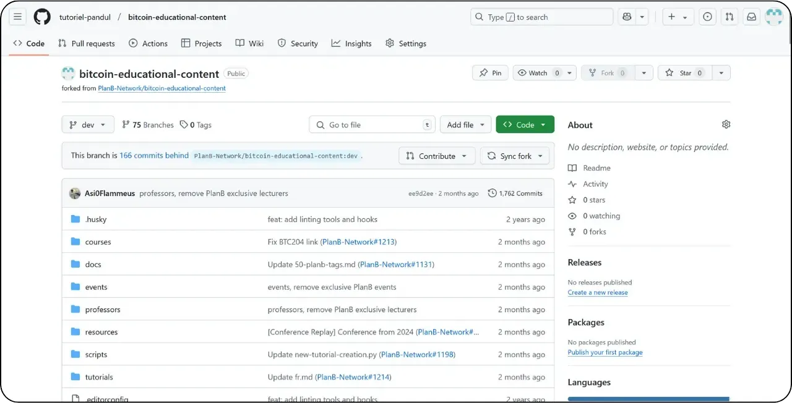

Убедитесь, что вы находитесь в основной ветке `dev`, затем нажмите на кнопку "*Sync fork*". Если ваш форк не обновлен, GitHub попросит вас обновить ветку. Приступайте к обновлению:


Выберите ветку `dev`, а затем назовите свою рабочую ветку так, чтобы ее название четко отражало ее цель, используя тире для разделения слов. Например, если наша цель - написать учебник по использованию Green Wallet, ветка может называться: `tuto-green-wallet-loic`. После ввода подходящего названия нажмите на кнопку "*Создать ветку*", чтобы подтвердить создание новой ветки на основе `dev`:

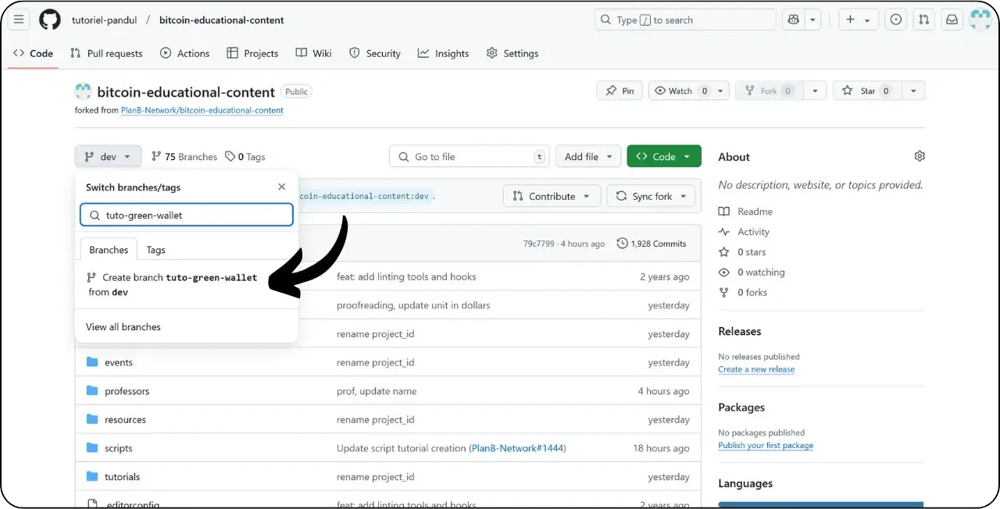

Теперь вы должны быть на новой ветке работы:

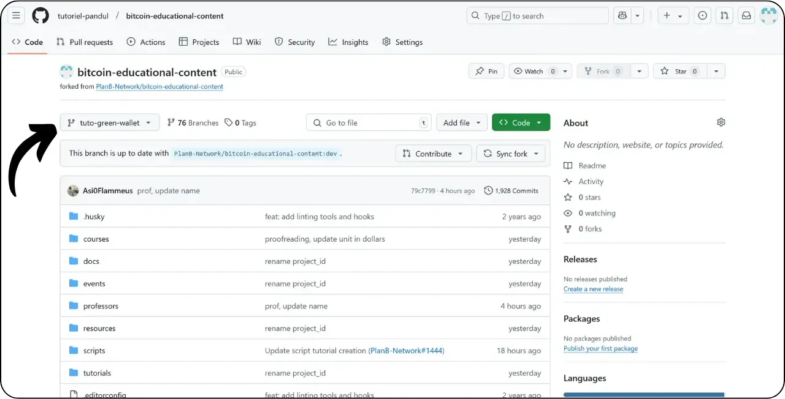

Это означает, что все внесённые вами изменения будут сохранены только в этой ветке.

Для каждой новой статьи, которую вы планируете опубликовать, создавайте новую ветку из `dev`.

Ветка в Git представляет собой параллельную версию проекта, позволяя вам работать над изменениями, не затрагивая основную ветку, пока ваша работа не будет готова к интеграции.

## 2 - Добавьте обучающие файлы

Теперь, когда рабочая ветка создана, пришло время интегрировать ваш новый учебник.

В файлах ветки вам нужно найти соответствующую подпапку для размещения вашего учебника. Организация папок отражает различные разделы сайта Plan ₿ Network. В нашем примере, поскольку мы добавляем учебник по Green Wallet, перейдите по следующему пути: `bitcoin-educational-content\tutorials\wallet`, что соответствует разделу сайта `WALLET`:

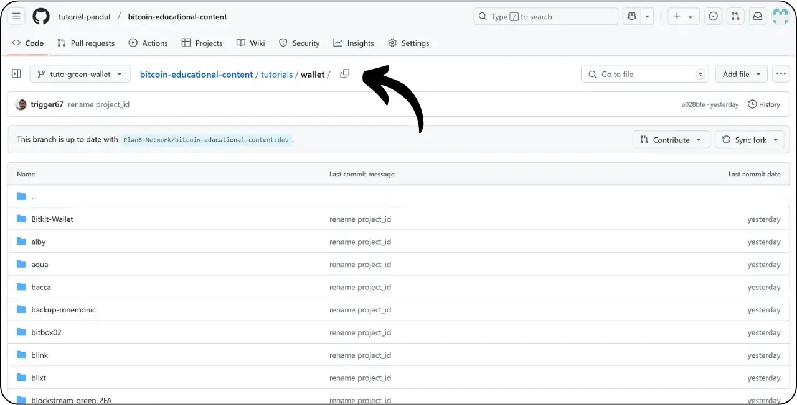

В папке `wallet` создайте новую директорию, специально предназначенную для вашего учебника. Название этой папки должно четко указывать на программное обеспечение, о котором пойдет речь в учебнике, используя дефисы для соединения слов. В моем примере папка будет называться `green-wallet`. Нажмите на кнопку "*Добавить файл*", затем на "*Создать новый файл*":

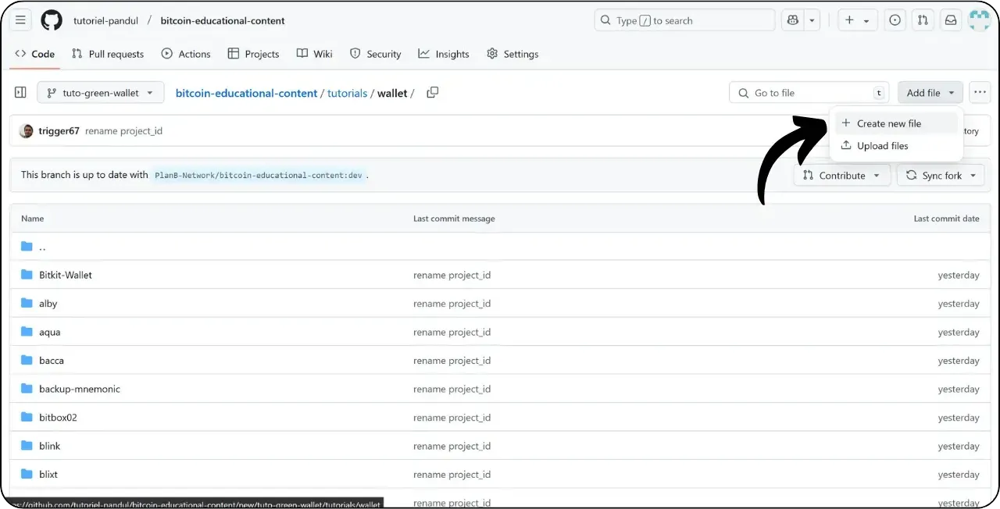

Введите имя папки, за которым следует косая черта `/`, чтобы подтвердить ее создание в качестве папки.

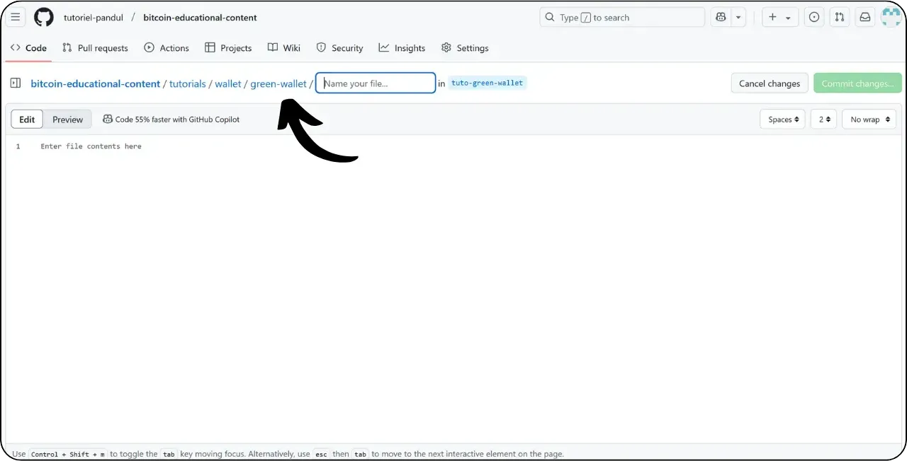

В эту новую папку, предназначенную для вашего учебника, нужно добавить несколько элементов:


- Создайте папку `assets`, в которой будут храниться все иллюстрации, необходимые для вашего учебника;
- В этой папке `assets` создайте подпапку, названную в соответствии с кодом языка, на котором написан учебник. Например, если учебник написан на английском языке, эта папка должна называться `en`. Поместите в эту папку все визуальные материалы учебника (диаграммы, изображения, скриншоты и т. д.).
- Необходимо создать файл `tutorial.yml` для записи деталей вашего учебника;
- Для записи фактического содержания вашего учебника необходимо создать файл markdown. Этот файл должен быть назван в соответствии с кодом языка, на котором он написан. Например, для учебника, написанного на французском языке, файл должен называться `fr.md`.

Подводя итог, можно сказать, что здесь представлена иерархия файлов (мы продолжим создавать их в следующем разделе):

```
bitcoin-educational-content/
└── tutorials/
└── wallet/ (à modifier avec la bonne catégorie)
└── green-wallet/ (à modifier avec le nom du tuto)
├── assets/
│   ├── fr/ (à modifier selon le code de langue approprié)
├── tutorial.yml
└── fr.md (à modifier selon le code de langue approprié)
```

## 3 - Заполните файл YAML

Начнем с файла YAML. В поле для создания нового файла введите `tutorial.yml` :

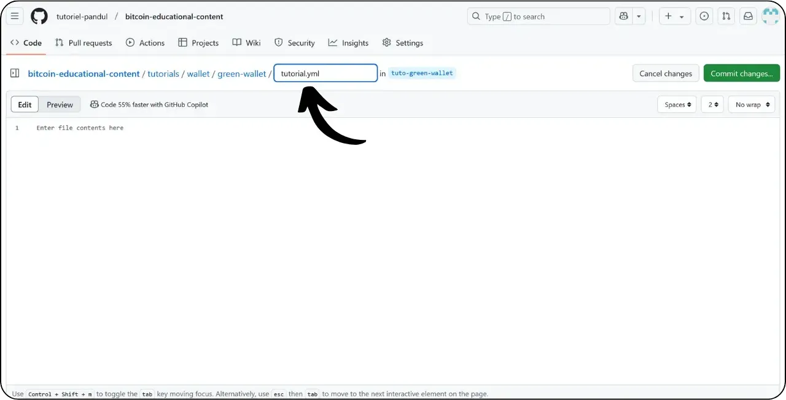

Заполните файл `tutorial.yml`, скопировав следующий шаблон:

```
id:
project_id:
tags:
-
-
-
category:
level:
credits:
professor:
# Proofreading metadata
original_language:
proofreading:
- language:
last_contribution_date:
urgency:
contributors_id:
-
reward:
```

Вот необходимые поля:


- id**: UUID (_Universally Unique Identifier_) для уникальной идентификации учебника. Вы можете сгенерировать его с помощью [онлайн-инструмента](https://www.uuidgenerator.net/version4). Единственное ограничение - этот UUID должен быть случайным, чтобы не конфликтовать с другим UUID на платформе;
- project_id** : UUID компании или организации, стоящей за инструментом, представленным в учебнике [из списка проектов] (https://github.com/PlanB-Network/bitcoin-educational-content/tree/dev/resources/projects). Например, если вы делаете учебник по программе Green Wallet, вы можете найти этот `project_id` в следующем файле: `bitcoin-educational-content/resources/projects/blockstream/project.yml`. Эта информация добавлена в YAML-файл вашего учебника, потому что Plan ₿ Network ведет базу данных всех компаний и организаций, работающих с Биткойном или связанными с ним проектами. Добавляя `project_id` связанной организации в ваш учебник, вы создаете связь между двумя элементами;
- теги**: 2 или 3 релевантных ключевых слова, связанных с содержанием учебника, выбранные исключительно [из списка тегов Plan ₿ Network](https://github.com/PlanB-Network/bitcoin-educational-content/blob/dev/docs/50-planb-tags.md);
- категория** : Подкатегория, соответствующая содержанию учебника, в соответствии со структурой сети Plan ₿ Network (например, для кошельков: `desktop`, `hardware`, `mobile`, `backup`);
- уровень** : Уровень сложности учебника, от :
    - новичок`
    - `промежуточный`
    - `продвинутый`
    - `эксперт`
- профессор**: Ваш `contributor_id` (BIP39 слов), отображаемый в [вашем профиле преподавателя](https://github.com/PlanB-Network/bitcoin-educational-content/tree/dev/professors);
- original_language** : Язык оригинала учебника (например, `fr`, `en` и т. д.) ;
- вычитка**: Информация о процессе вычитки. Заполните первую часть, так как вычитка собственного учебника считается первой проверкой:
    - язык**: Вычитка языкового кода (например, `fr`, `en` и т.д.).
    - last_contribution_date**: Сегодняшняя дата.
    - срочность** : Оставьте пустым.
    - contributors_id** : Ваш идентификатор на GitHub.
    - награда** : Оставьте пустым.

Для получения более подробной информации об идентификаторе учителя обратитесь к соответствующему руководству:

https://planb.network/tutorials/others/contribution/create-teacher-profile-8ba9ba49-8fac-437a-a435-c38eebc8f8a4
Вот пример файла `tutorial.yml`, заполненного для учебника по кошельку Blockstream Green:

```
id: e84edaa9-fb65-48c1-a357-8a5f27996143
project_id: 3b2f45e6-d612-412c-95ba-cf65b49aa5b8
tags:
- wallets
- software
- keys
category: mobile
level: beginner
credits:
professor: pretty-private
# Proofreading metadata
original_language: fr
proofreading:
- language: fr
last_contribution_date: 2024-11-20
urgency:
contributors_id:
- LoicPandul
reward:
```

После того как вы закончили изменять файл `tutorial.yml`, сохраните документ, нажав на кнопку "*Коммитировать изменения...*":

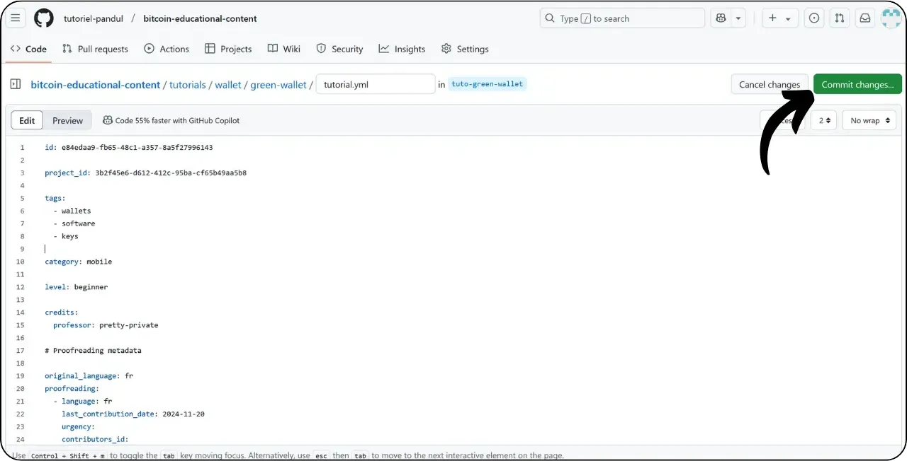

Добавьте название и описание и убедитесь, что фиксация производится в ветке, которую вы создали в начале этого урока. Затем подтвердите, нажав на кнопку "*Коммитировать изменения*".

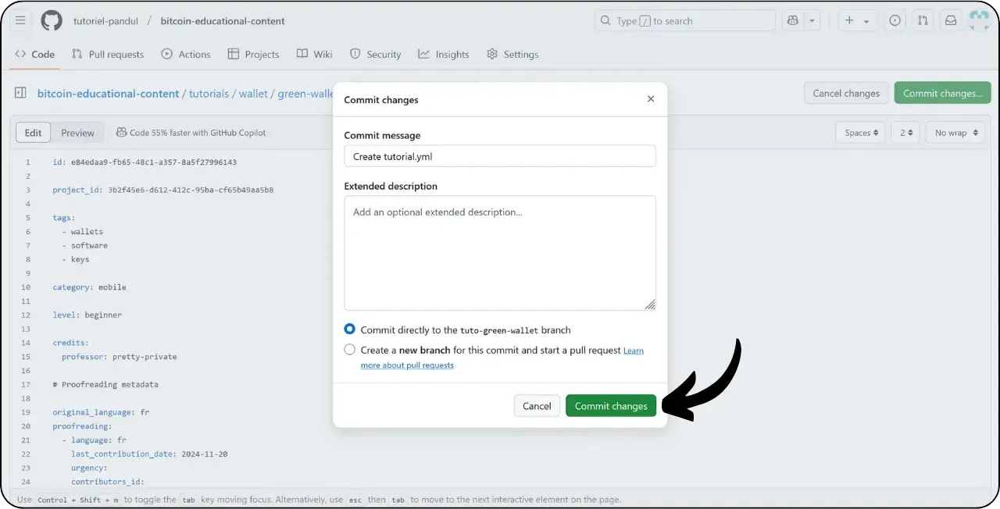

## 4 - Создание вложенных папок для изображений

Снова нажмите на "*Добавить файл*", а затем на "*Создать новый файл*":

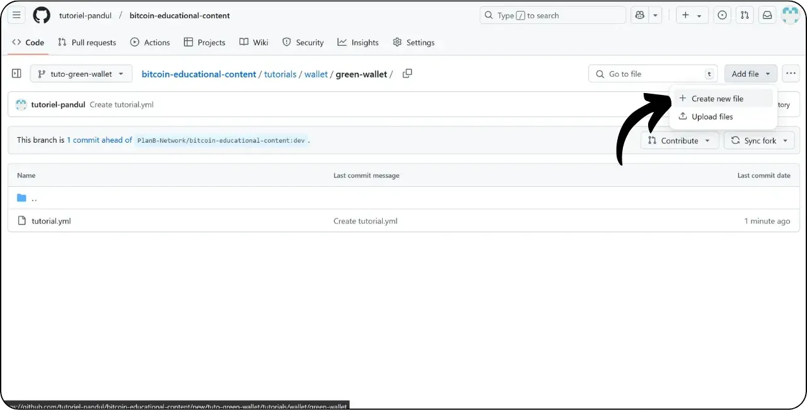

Введите `assets`, за которым следует косая черта `/`, чтобы создать папку:

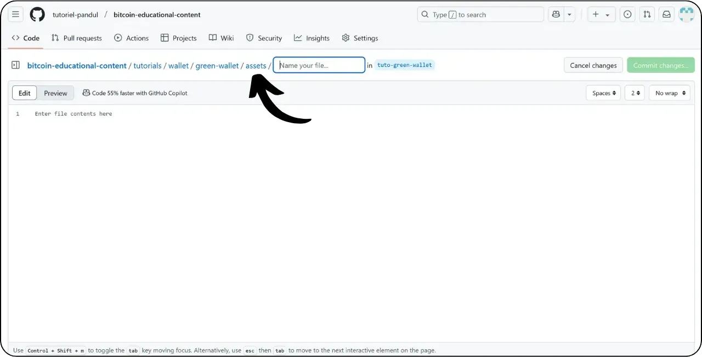

Повторите этот шаг в папке `/assets` для создания языковой подпапки, например `fr`, если ваш учебник на французском языке:

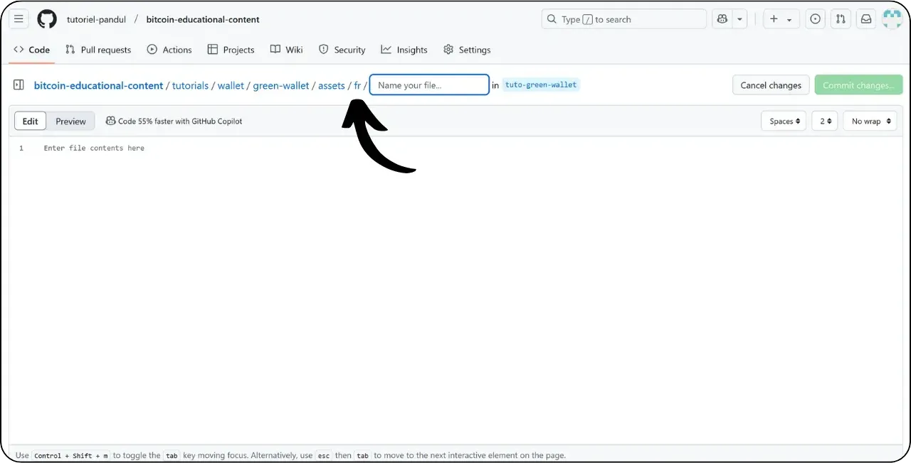

В этой папке создайте фиктивный файл, чтобы заставить GitHub сохранить вашу папку (которая в противном случае будет пустой). Назовите этот файл `.gitkeep`. Затем нажмите на кнопку "*Коммитировать изменения...*".

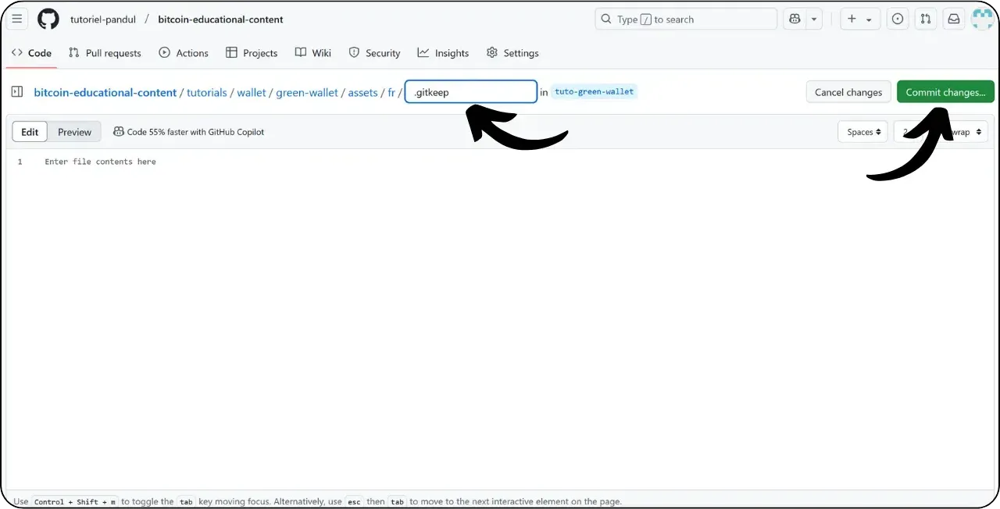

Еще раз проверьте, что вы находитесь в правильной ветке, затем нажмите "*Коммитировать изменения*".


## 5 - Создание файла Markdown

Сейчас мы создадим файл, в котором будет размещен ваш учебник, назвав его в соответствии с кодом вашего языка, например `fr.md`, если мы пишем на французском. Перейдите в папку с учебником :

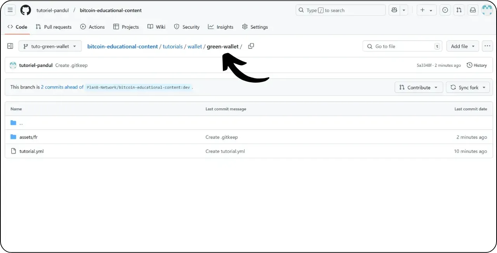

Нажмите на "Добавить файл*", затем на "Создать новый файл*".

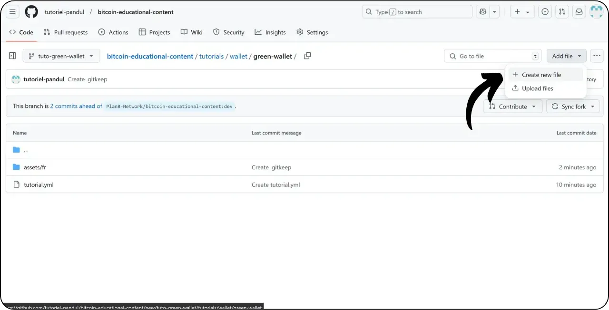

Назовите файл, используя код вашего языка. В моем случае, поскольку учебник написан на французском, я назвал свой файл `fr.md`. Расширение `.md` указывает на то, что файл имеет формат Markdown.

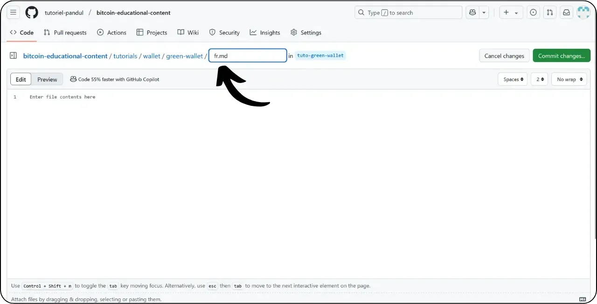

Начнем с заполнения раздела `Properties` в верхней части документа. Вручную добавьте и заполните следующий блок кода (ключи `name:` и `description:` должны быть на английском, но их значения должны быть написаны на том языке, который используется в вашем учебнике):

```
---
name: [Titre]
description: [Description]
---
```

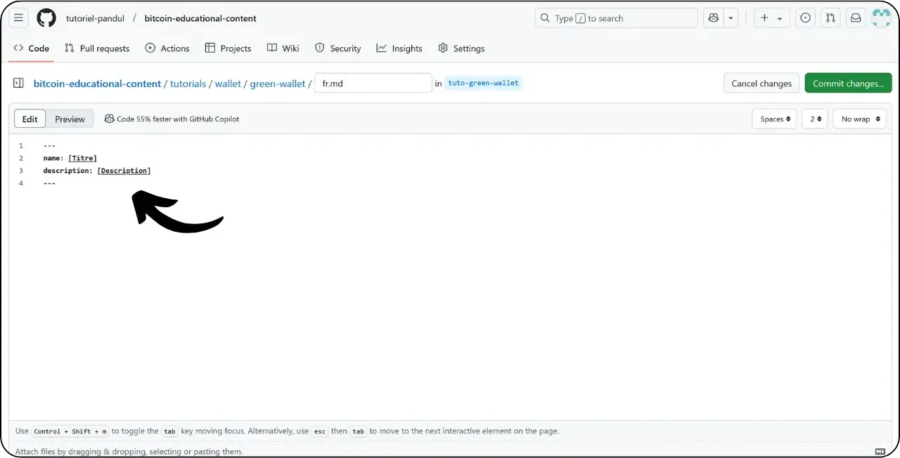

Введите название вашего учебника и краткое описание:

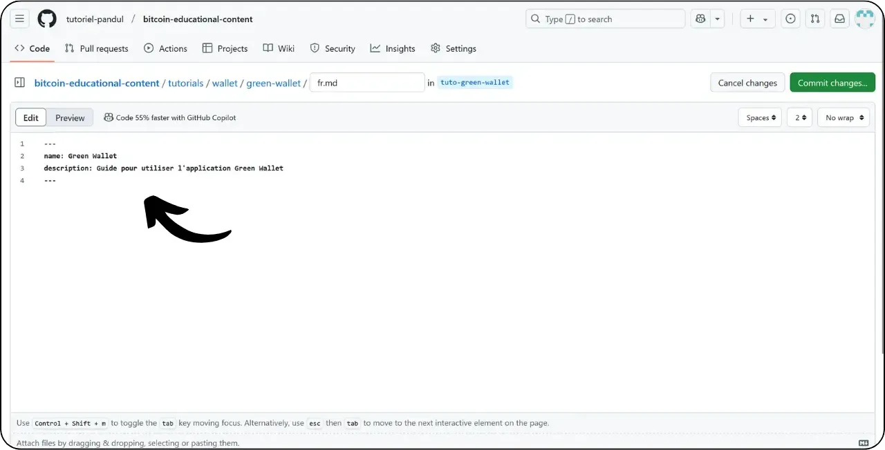

Затем добавьте путь к изображению обложки в начало учебника. Чтобы сделать это, обратите внимание на :

```

```

Этот синтаксис пригодится вам, когда потребуется добавить изображение в учебник. Восклицательный знак обозначает изображение, альтернативный текст которого (alt) указывается между квадратными скобками. Путь к изображению указывается между скобками:

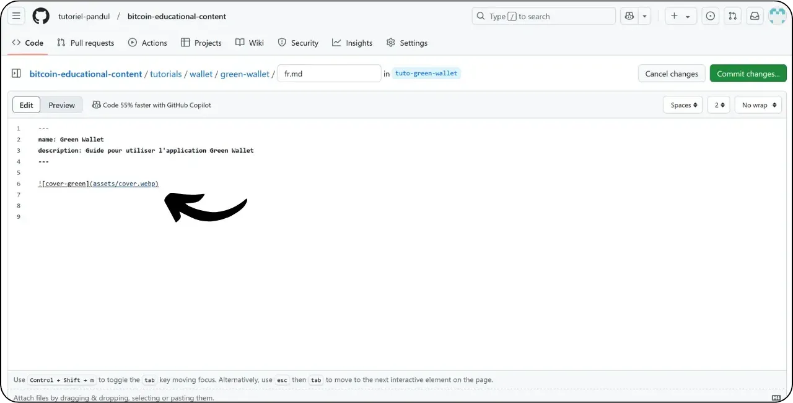

Нажмите на кнопку "*Коммитировать изменения...*", чтобы сохранить этот файл.

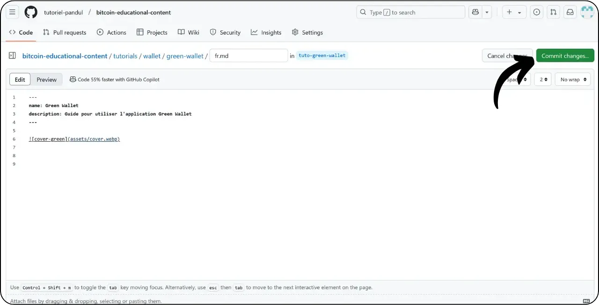

Проверьте, что вы находитесь в правильной ветке, а затем подтвердите фиксацию.


Теперь ваша папка с учебниками должна выглядеть следующим образом, в соответствии с кодом вашего языка:

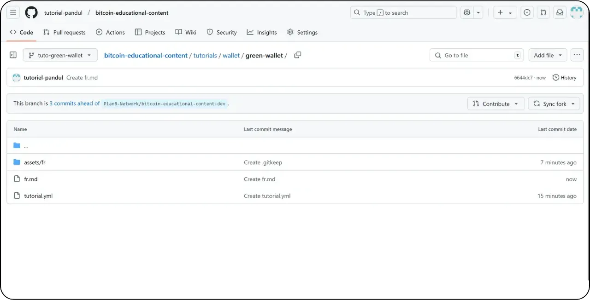

## 6 - Добавьте логотип и обложку

В папку `assets` нужно добавить файл с именем `logo.webp`, который будет служить миниатюрой для вашей статьи. Это изображение должно быть в формате `.webp` и иметь квадратный размер, чтобы соответствовать пользовательскому интерфейсу.

Вы можете выбрать логотип программы, используемый в учебнике, или любое другое подходящее изображение, если оно не содержит авторских прав. Кроме того, добавьте изображение под названием `cover.webp` в то же место. Оно будет отображаться в верхней части вашего учебника. Убедитесь, что это изображение, как и логотип, соблюдает права на использование и соответствует контексту вашего учебника.

Чтобы добавить изображения в папку `/assets`, вы можете перетащить их из своих локальных файлов. Убедитесь, что вы находитесь в папке `/assets` и в нужной ветке, затем нажмите на кнопку "*Коммитировать изменения*".

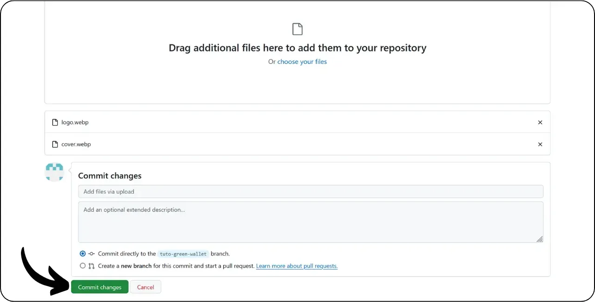

Теперь в папке должны появиться изображения.

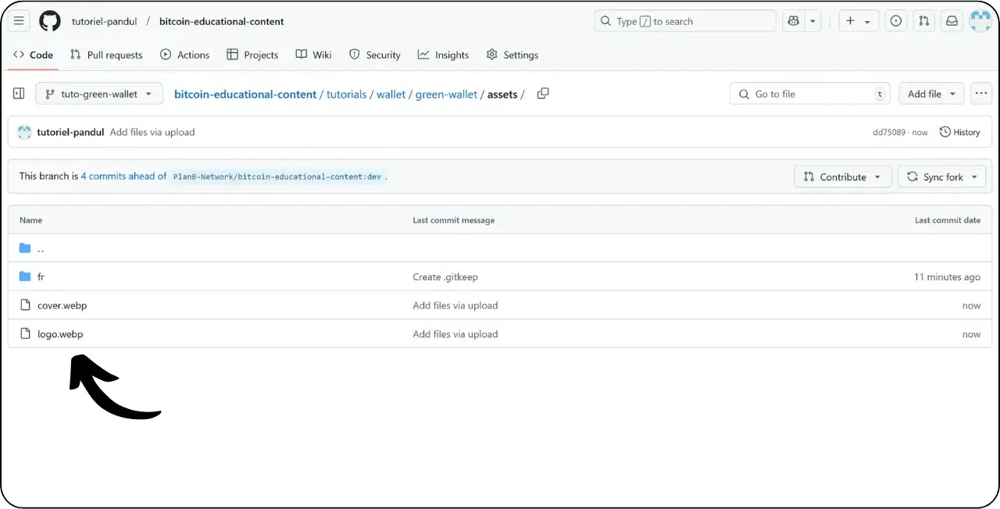

## 7 - Написание учебника

Продолжайте писать учебник, отмечая содержимое в файле Markdown с кодом языка (в моем примере, на французском, это файл `fr.md`). Перейдите в этот файл и нажмите на значок карандаша:

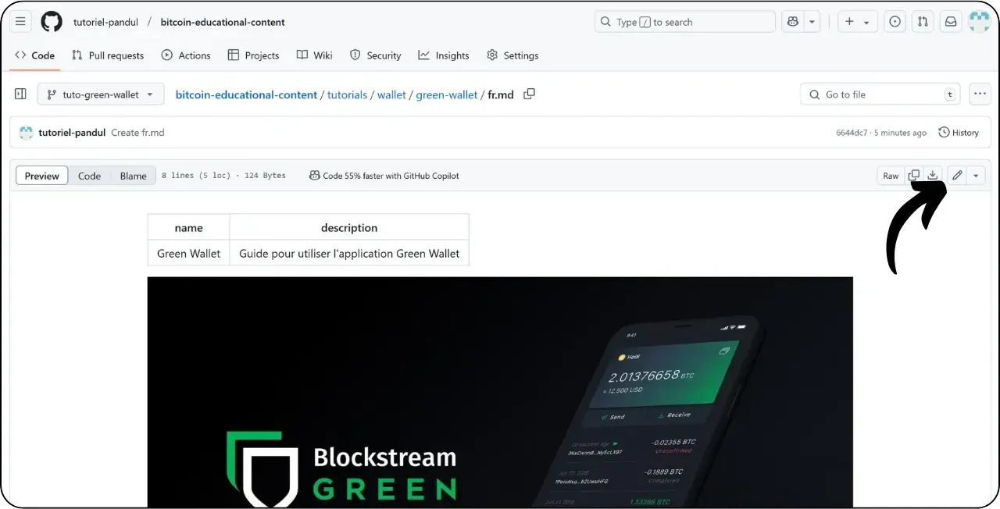

Начните писать учебник. При добавлении подзаголовка используйте соответствующее форматирование в Markdown, добавляя к тексту префикс `##`:

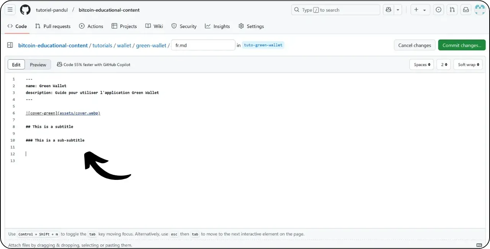

Чередуйте виды "*Редактирование*" и "*Предварительный просмотр*", чтобы лучше представить себе рендеринг.

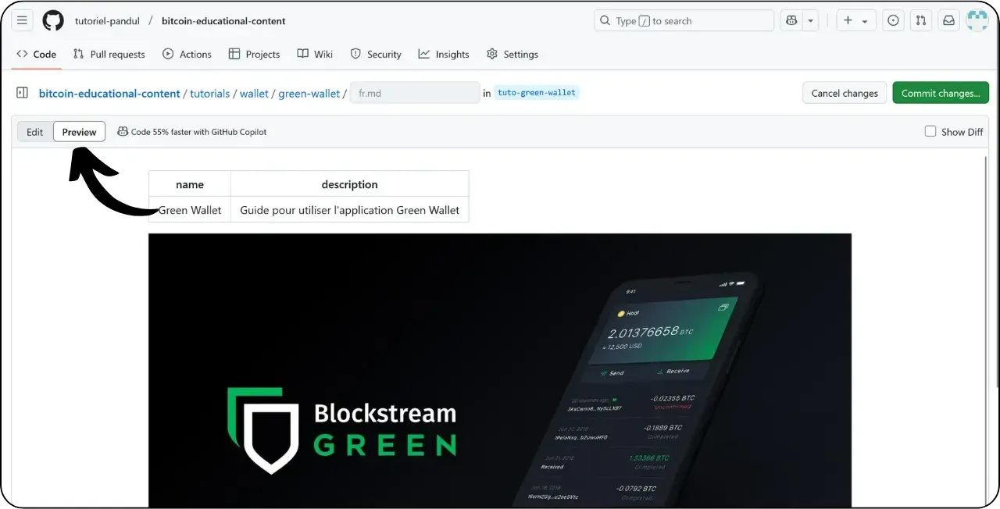

Чтобы сохранить свою работу, нажмите "*Commit Changes...*", убедитесь, что вы находитесь в правильной ветке, затем подтвердите, снова нажав "*Commit Changes*".

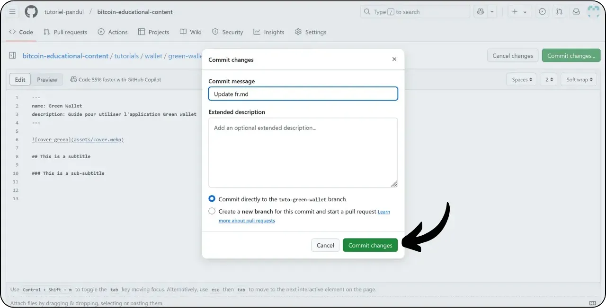

## 8 - Добавьте визуальные эффекты

Языковая подпапка в папке `/assets` (в моем примере: `/assets/en`) используется для хранения диаграмм и визуальных изображений, которые будут сопровождать ваш учебник. По возможности избегайте включения текста в изображения, чтобы сделать ваш контент доступным для международной аудитории. Конечно, представленные программы будут содержать текст, но если вы добавляете схемы или дополнительные указания на скриншоты программ, делайте это без текста или, если это необходимо, используйте английский язык.

Чтобы назвать изображения, просто используйте номера, соответствующие порядку их появления в учебнике, в виде двух цифр (или трех цифр, если учебник содержит более 99 изображений). Например, назовите первое изображение `01.webp`, второе `02.webp` и так далее.

Ваши изображения должны быть только в формате `.webp`. При необходимости вы можете воспользоваться [моей программой для конвертации изображений](https://github.com/LoicPandul/ImagesConverter).

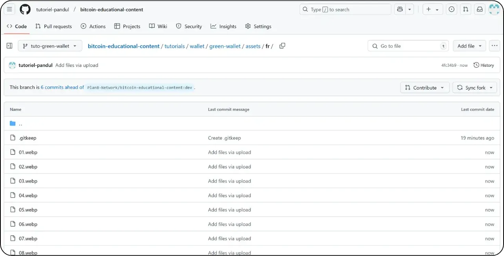

Теперь, когда вы добавили свои изображения в подпапку, можно удалить фиктивный файл `.gitkeep`. Откройте этот файл, нажмите на три маленькие точки в правом верхнем углу, а затем на "*Удалить файл*".

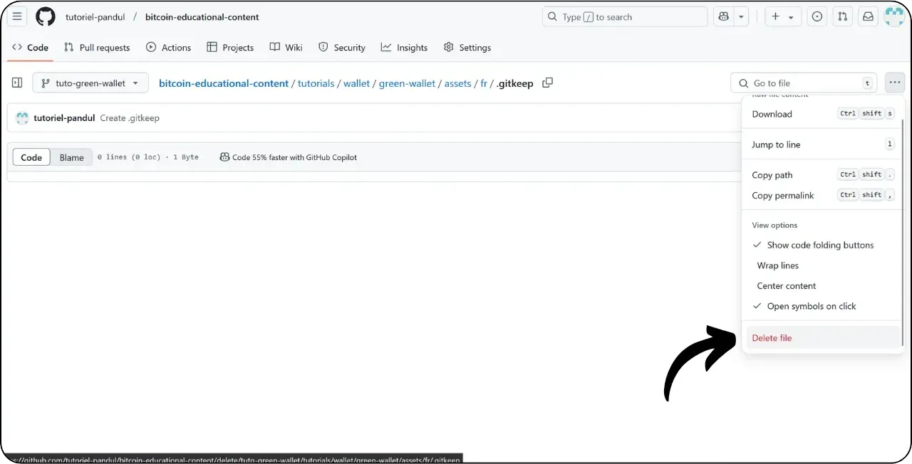

Сохраните изменения, нажав на кнопку "*Коммитировать изменения...*".

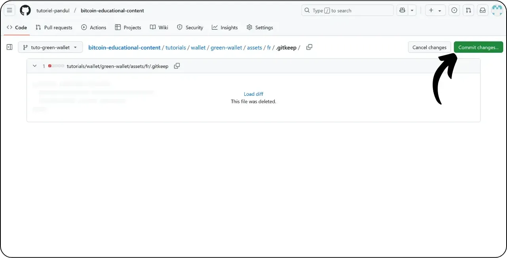

Чтобы вставить диаграмму из подпапки в редакционный документ, воспользуйтесь следующей командой Markdown, указав соответствующий альтернативный текст и правильный путь к изображению для вашего языка:

```

```

Восклицательный знак в начале указывает на изображение. Альтернативный текст, который помогает обеспечить доступность и ссылки, помещается между квадратными скобками. Наконец, в скобках указывается путь к изображению.

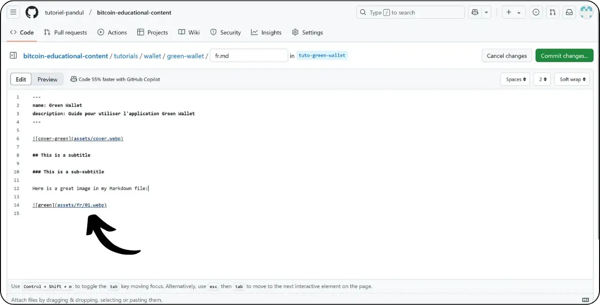

Если вы хотите создать собственные схемы, обязательно следуйте графическим рекомендациям Plan ₿ Network, чтобы обеспечить визуальную согласованность:


- Шрифт**: Используйте [Rubik](https://fonts.google.com/specimen/Rubik);
- Цвета** :
 - Оранжевый: #FF5C00
 - Черный : #000000
 - Белый: #FFFFFF

**Необходимо, чтобы все визуальные материалы, интегрированные в ваши учебные пособия, были свободны от авторских прав или соответствовали лицензии на исходный файл**. Поэтому все диаграммы, опубликованные в Plan ₿ Network, доступны по лицензии CC-BY-SA, так же, как и текст.

**-> Совет:** При публичном размещении файлов, например изображений, важно удалять лишние метаданные. Они могут содержать конфиденциальную информацию, например данные о местоположении, дате создания и авторе. Чтобы защитить свою конфиденциальность, лучше удалить эти метаданные. Чтобы упростить эту операцию, можно воспользоваться специализированными инструментами, например [Exif Cleaner](https://exifcleaner.com/), который позволяет очистить метаданные документа простым перетаскиванием.

## 9 - Предложите учебное пособие

После того как вы закончили писать учебник на выбранном вами языке, следующим шагом будет отправка **Запроса на перевод**. Администратор добавит недостающие переводы в ваш учебник, используя наш метод автоматического перевода с человеческой корректурой.

Чтобы продолжить Pull Request, после сохранения всех изменений нажмите на кнопку "*Contribute*", а затем на "*Open pull request*":

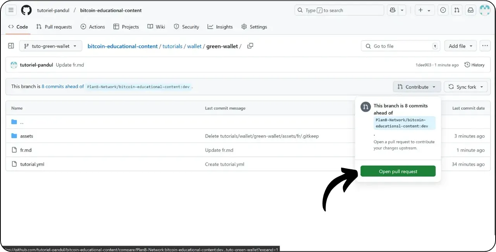

Pull Request - это запрос на интеграцию изменений из вашей ветки в основную ветку репозитория Plan ₿ Network, что позволяет просмотреть и обсудить изменения до их слияния.

Прежде чем продолжить, внимательно проверьте в нижней части интерфейса, соответствуют ли эти изменения вашим ожиданиям:

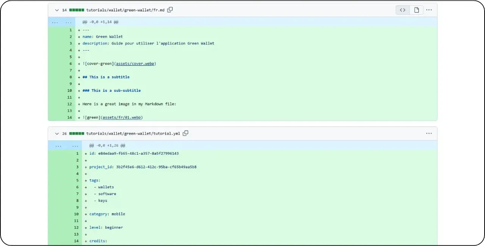

Убедитесь в верхней части интерфейса, что ваша рабочая ветка слита с веткой `dev` репозитория Plan ₿ Network (которая является основной веткой).

Введите название, кратко описывающее изменения, которые вы хотите объединить с исходным репозиторием. Добавьте краткий комментарий, описывающий эти изменения (если у вас есть номер проблемы, связанный с созданием вашего учебника, не забудьте отметить `Закрывает #{номер проблемы}` в качестве комментария), затем нажмите на зеленую кнопку "*Создать запрос на слияние*", чтобы подтвердить запрос на слияние:

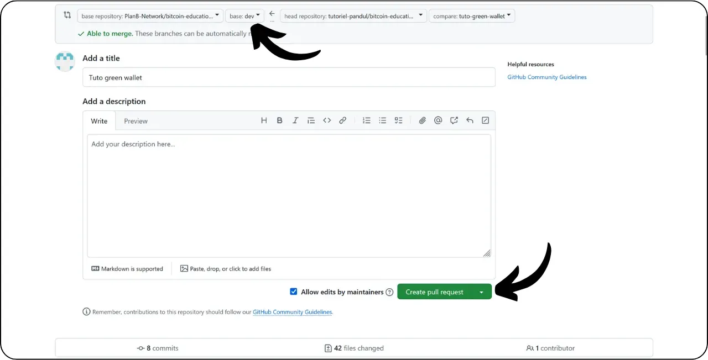

После этого ваш PR будет виден на вкладке "*Pull Request*" главного репозитория Plan ₿ Network. Теперь вам остается только ждать, пока администратор свяжется с вами, чтобы подтвердить, что ваш вклад был объединен, или попросить о дальнейших изменениях.

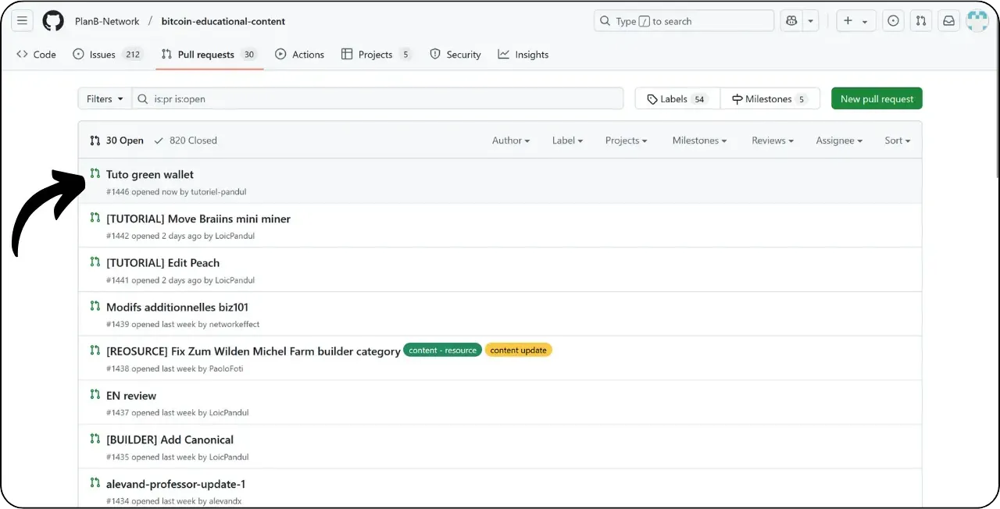

После слияния вашего PR с основной веткой мы рекомендуем удалить вашу рабочую ветку (в моем примере: `tuto-green-wallet`), чтобы сохранить чистую историю вашего форка. GitHub автоматически предложит вам эту опцию на странице вашего PR:

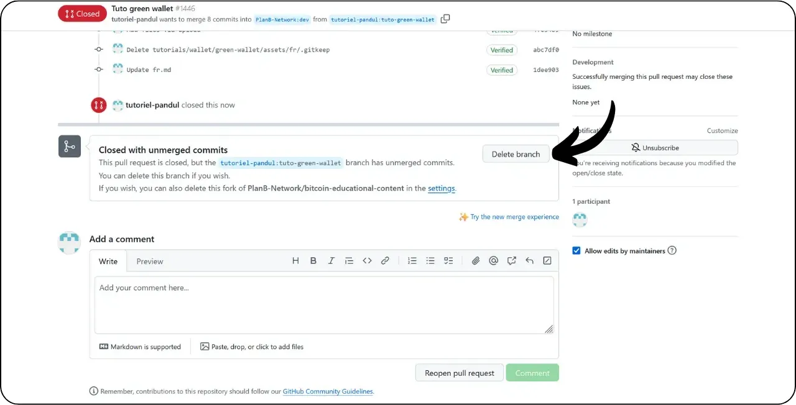

Если вы хотите внести изменения в свой взнос после того, как уже подали ОР, порядок действий зависит от текущего статуса вашего ОР:


- Если ваш PR еще открыт и не был слит, внесите изменения в том же рабочем филиале. Изменения, внесенные в коммит, будут добавлены в ваш все еще открытый PR;
- В случае если ваш PR уже был объединен с основной веткой, вам придется повторить процесс с самого начала, создав новую ветку и отправив новый PR. Убедитесь, что ваш форк синхронизирован с репозиторием исходных текстов Plan ₿ Network в ветке `dev`, прежде чем приступать к работе.

Если у вас возникли технические трудности с отправкой урока, пожалуйста, не стесняйтесь просить помощи в [нашей специальной группе Telegram для вкладов](https://t.me/PlanBNetwork_ContentBuilder). Большое спасибо!